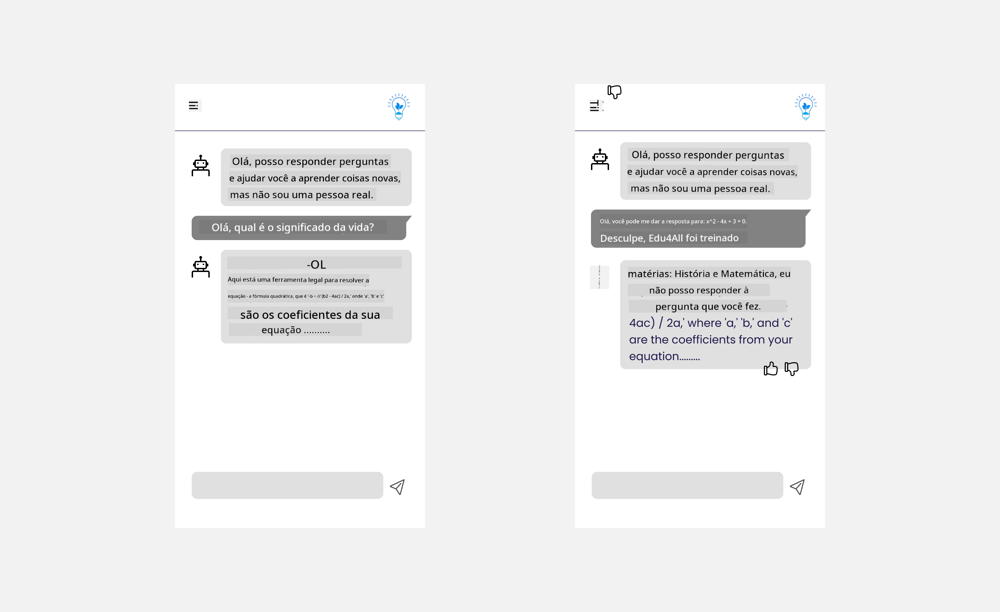

<!--
CO_OP_TRANSLATOR_METADATA:
{
  "original_hash": "78bbeed50fd4dc9fdee931f5daf98cb3",
  "translation_date": "2025-10-17T15:56:56+00:00",
  "source_file": "12-designing-ux-for-ai-applications/README.md",
  "language_code": "br"
}
-->
# Projetando UX para Aplicações de IA

> _(Clique na imagem acima para assistir ao vídeo desta lição)_

A experiência do usuário é um aspecto muito importante na construção de aplicativos. Os usuários precisam ser capazes de usar seu aplicativo de maneira eficiente para realizar tarefas. Ser eficiente é uma coisa, mas você também precisa projetar aplicativos para que possam ser usados por todos, tornando-os _acessíveis_. Este capítulo se concentrará nessa área para que você, com sorte, acabe projetando um aplicativo que as pessoas possam e queiram usar.

## Introdução

A experiência do usuário é como um usuário interage e utiliza um produto ou serviço específico, seja um sistema, ferramenta ou design. Ao desenvolver aplicações de IA, os desenvolvedores não apenas se concentram em garantir que a experiência do usuário seja eficaz, mas também ética. Nesta lição, abordamos como construir aplicações de Inteligência Artificial (IA) que atendam às necessidades dos usuários.

A lição abordará as seguintes áreas:

- Introdução à Experiência do Usuário e Compreensão das Necessidades dos Usuários
- Projetando Aplicações de IA para Confiança e Transparência
- Projetando Aplicações de IA para Colaboração e Feedback

## Objetivos de aprendizado

Após esta lição, você será capaz de:

- Compreender como construir aplicações de IA que atendam às necessidades dos usuários.
- Projetar aplicações de IA que promovam confiança e colaboração.

### Pré-requisito

Reserve um tempo para ler mais sobre [experiência do usuário e design thinking.](https://learn.microsoft.com/training/modules/ux-design?WT.mc_id=academic-105485-koreyst)

## Introdução à Experiência do Usuário e Compreensão das Necessidades dos Usuários

Em nossa startup fictícia de educação, temos dois usuários principais, professores e alunos. Cada um dos dois usuários tem necessidades únicas. Um design centrado no usuário prioriza o usuário, garantindo que os produtos sejam relevantes e benéficos para aqueles a quem se destinam.

O aplicativo deve ser **útil, confiável, acessível e agradável** para proporcionar uma boa experiência ao usuário.

### Usabilidade

Ser útil significa que o aplicativo possui funcionalidades que correspondem ao seu propósito pretendido, como automatizar o processo de avaliação ou gerar cartões de estudo para revisão. Um aplicativo que automatiza o processo de avaliação deve ser capaz de atribuir notas com precisão e eficiência ao trabalho dos alunos com base em critérios predefinidos. Da mesma forma, um aplicativo que gera cartões de estudo deve ser capaz de criar perguntas relevantes e diversificadas com base em seus dados.

### Confiabilidade

Ser confiável significa que o aplicativo pode realizar sua tarefa de forma consistente e sem erros. No entanto, a IA, assim como os humanos, não é perfeita e pode estar sujeita a erros. Os aplicativos podem encontrar erros ou situações inesperadas que exigem intervenção ou correção humana. Como lidar com erros? Na última seção desta lição, abordaremos como sistemas e aplicativos de IA são projetados para colaboração e feedback.

### Acessibilidade

Ser acessível significa estender a experiência do usuário a usuários com diversas habilidades, incluindo aqueles com deficiências, garantindo que ninguém seja deixado de fora. Seguindo diretrizes e princípios de acessibilidade, as soluções de IA tornam-se mais inclusivas, utilizáveis e benéficas para todos os usuários.

### Agradável

Ser agradável significa que o aplicativo é prazeroso de usar. Uma experiência do usuário atraente pode ter um impacto positivo no usuário, incentivando-o a retornar ao aplicativo e aumentando a receita do negócio.

Nem todo desafio pode ser resolvido com IA. A IA entra para complementar sua experiência do usuário, seja automatizando tarefas manuais ou personalizando experiências do usuário.

## Projetando Aplicações de IA para Confiança e Transparência

Construir confiança é fundamental ao projetar aplicações de IA. A confiança garante que o usuário tenha segurança de que o aplicativo realizará o trabalho, entregará resultados de forma consistente e que os resultados são o que o usuário precisa. Um risco nessa área é a desconfiança e o excesso de confiança. A desconfiança ocorre quando um usuário tem pouca ou nenhuma confiança em um sistema de IA, levando-o a rejeitar seu aplicativo. O excesso de confiança ocorre quando um usuário superestima a capacidade de um sistema de IA, levando os usuários a confiarem demais no sistema de IA. Por exemplo, um sistema automatizado de avaliação, no caso de excesso de confiança, pode levar o professor a não revisar alguns dos trabalhos para garantir que o sistema de avaliação funcione bem. Isso pode resultar em notas injustas ou imprecisas para os alunos, ou em oportunidades perdidas de feedback e melhoria.

Duas maneiras de garantir que a confiança esteja no centro do design são explicabilidade e controle.

### Explicabilidade

Quando a IA ajuda a informar decisões, como transmitir conhecimento às gerações futuras, é fundamental que professores e pais entendam como as decisões da IA são tomadas. Isso é explicabilidade - entender como as aplicações de IA tomam decisões. Projetar para explicabilidade inclui adicionar detalhes que destacam como a IA chegou ao resultado. O público deve estar ciente de que o resultado é gerado por IA e não por um humano. Por exemplo, em vez de dizer "Comece a conversar com seu tutor agora", diga "Use o tutor de IA que se adapta às suas necessidades e ajuda você a aprender no seu ritmo."

Outro exemplo é como a IA usa dados do usuário e dados pessoais. Por exemplo, um usuário com a persona de estudante pode ter limitações com base em sua persona. A IA pode não ser capaz de revelar respostas às perguntas, mas pode ajudar a orientar o usuário a pensar em como resolver um problema.

Uma última parte importante da explicabilidade é a simplificação das explicações. Estudantes e professores podem não ser especialistas em IA, portanto, as explicações sobre o que o aplicativo pode ou não fazer devem ser simplificadas e fáceis de entender.

### Controle

A IA generativa cria uma colaboração entre a IA e o usuário, onde, por exemplo, um usuário pode modificar prompts para diferentes resultados. Além disso, uma vez que um resultado é gerado, os usuários devem ser capazes de modificar os resultados, dando-lhes uma sensação de controle. Por exemplo, ao usar o Bing, você pode ajustar seu prompt com base no formato, tom e comprimento. Além disso, você pode fazer alterações no seu resultado e modificá-lo conforme mostrado abaixo:

Outro recurso no Bing que permite ao usuário ter controle sobre o aplicativo é a capacidade de optar por participar ou não dos dados que a IA usa. Para um aplicativo escolar, um aluno pode querer usar suas anotações, bem como os recursos do professor como material de revisão.

> Ao projetar aplicações de IA, a intencionalidade é fundamental para garantir que os usuários não confiem excessivamente, criando expectativas irreais sobre suas capacidades. Uma maneira de fazer isso é criando fricção entre os prompts e os resultados. Lembrando ao usuário que isso é IA e não um ser humano.

## Projetando Aplicações de IA para Colaboração e Feedback

Como mencionado anteriormente, a IA generativa cria uma colaboração entre o usuário e a IA. A maioria das interações ocorre com um usuário inserindo um prompt e a IA gerando um resultado. E se o resultado estiver incorreto? Como o aplicativo lida com erros, caso ocorram? A IA culpa o usuário ou explica o erro?

As aplicações de IA devem ser projetadas para receber e fornecer feedback. Isso não apenas ajuda o sistema de IA a melhorar, mas também constrói confiança com os usuários. Um ciclo de feedback deve ser incluído no design, um exemplo pode ser um simples "curtir" ou "não curtir" no resultado.

Outra maneira de lidar com isso é comunicar claramente as capacidades e limitações do sistema. Quando um usuário comete um erro ao solicitar algo além das capacidades da IA, também deve haver uma maneira de lidar com isso, como mostrado abaixo.

Erros de sistema são comuns em aplicativos onde o usuário pode precisar de assistência com informações fora do escopo da IA ou o aplicativo pode ter um limite de quantas perguntas/assuntos um usuário pode gerar resumos. Por exemplo, um aplicativo de IA treinado com dados em assuntos limitados, como História e Matemática, pode não ser capaz de lidar com perguntas sobre Geografia. Para mitigar isso, o sistema de IA pode dar uma resposta como: "Desculpe, nosso produto foi treinado com dados nos seguintes assuntos....., não posso responder à pergunta que você fez."

As aplicações de IA não são perfeitas, portanto, estão sujeitas a cometer erros. Ao projetar seus aplicativos, você deve garantir que haja espaço para feedback dos usuários e tratamento de erros de maneira simples e facilmente explicável.

## Tarefa

Pegue qualquer aplicativo de IA que você tenha construído até agora e considere implementar os passos abaixo em seu aplicativo:

- **Agradável:** Considere como você pode tornar seu aplicativo mais agradável. Você está adicionando explicações em todos os lugares? Está incentivando o usuário a explorar? Como você está formulando suas mensagens de erro?

- **Usabilidade:** Construindo um aplicativo web. Certifique-se de que seu aplicativo seja navegável tanto por mouse quanto por teclado.

- **Confiança e transparência:** Não confie completamente na IA e em seus resultados, considere como você adicionaria um humano ao processo para verificar os resultados. Além disso, considere e implemente outras maneiras de alcançar confiança e transparência.

- **Controle:** Dê ao usuário controle sobre os dados que ele fornece ao aplicativo. Implemente uma maneira de o usuário optar por participar ou não da coleta de dados no aplicativo de IA.

<!-- ## [Quiz pós-aula](../../../12-designing-ux-for-ai-applications/quiz-url) -->

## Continue Aprendendo!

Após concluir esta lição, confira nossa [coleção de aprendizado sobre IA generativa](https://aka.ms/genai-collection?WT.mc_id=academic-105485-koreyst) para continuar aprimorando seu conhecimento sobre IA generativa!

Vá para a Lição 13, onde veremos como [proteger aplicações de IA](../13-securing-ai-applications/README.md?WT.mc_id=academic-105485-koreyst)!

---

**Aviso Legal**:  
Este documento foi traduzido utilizando o serviço de tradução por IA [Co-op Translator](https://github.com/Azure/co-op-translator). Embora nos esforcemos para garantir a precisão, esteja ciente de que traduções automatizadas podem conter erros ou imprecisões. O documento original em seu idioma nativo deve ser considerado a fonte autoritativa. Para informações críticas, recomenda-se a tradução profissional feita por humanos. Não nos responsabilizamos por quaisquer mal-entendidos ou interpretações incorretas decorrentes do uso desta tradução.