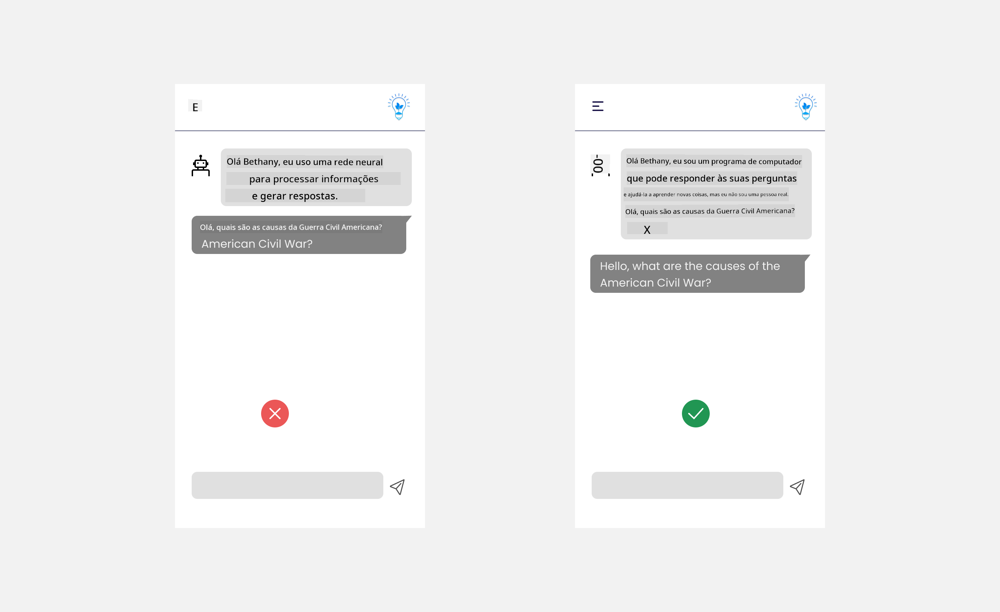
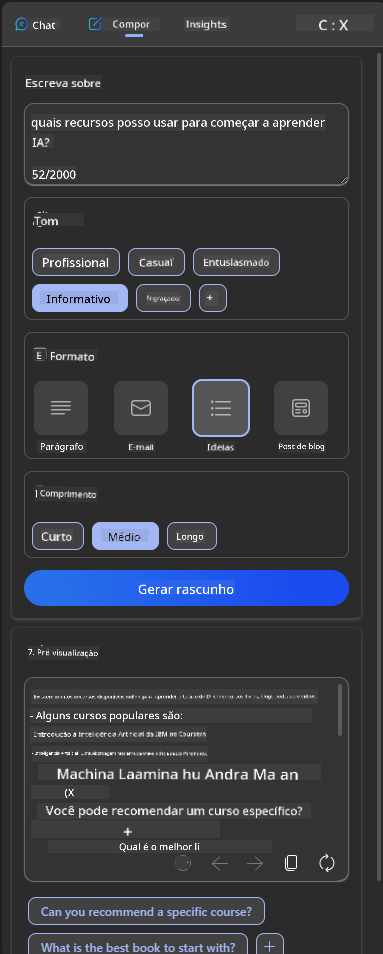

<!--
CO_OP_TRANSLATOR_METADATA:
{
  "original_hash": "747668e4c53d067369f06e9ec2e6313e",
  "translation_date": "2025-08-26T16:29:23+00:00",
  "source_file": "12-designing-ux-for-ai-applications/README.md",
  "language_code": "br"
}
-->
# Projetando UX para Aplicações de IA

> _(Clique na imagem acima para assistir ao vídeo desta lição)_

A experiência do usuário é um aspecto muito importante na construção de aplicativos. Os usuários precisam conseguir usar seu app de forma eficiente para realizar tarefas. Ser eficiente é importante, mas você também precisa projetar apps para que possam ser usados por todos, tornando-os _acessíveis_. Este capítulo vai focar nesse tema para que você consiga criar um app que as pessoas possam e queiram usar.

## Introdução

Experiência do usuário é como uma pessoa interage e utiliza um produto ou serviço específico, seja um sistema, ferramenta ou design. Ao desenvolver aplicações de IA, os desenvolvedores não focam apenas em garantir uma boa experiência do usuário, mas também em aspectos éticos. Nesta lição, vamos abordar como construir aplicações de Inteligência Artificial (IA) que atendam às necessidades dos usuários.

A lição vai abordar os seguintes tópicos:

- Introdução à Experiência do Usuário e Compreensão das Necessidades dos Usuários
- Projetando Aplicações de IA para Confiança e Transparência
- Projetando Aplicações de IA para Colaboração e Feedback

## Objetivos de aprendizagem

Após esta lição, você será capaz de:

- Entender como construir aplicações de IA que atendam às necessidades dos usuários.
- Projetar aplicações de IA que promovam confiança e colaboração.

### Pré-requisito

Reserve um tempo para ler mais sobre [experiência do usuário e design thinking.](https://learn.microsoft.com/training/modules/ux-design?WT.mc_id=academic-105485-koreyst)

## Introdução à Experiência do Usuário e Compreensão das Necessidades dos Usuários

Na nossa startup fictícia de educação, temos dois usuários principais: professores e alunos. Cada um deles tem necessidades únicas. Um design centrado no usuário prioriza o usuário, garantindo que os produtos sejam relevantes e benéficos para quem se destinam.

O aplicativo deve ser **útil, confiável, acessível e agradável** para proporcionar uma boa experiência ao usuário.

### Usabilidade

Ser útil significa que o aplicativo tem funcionalidades que correspondem ao seu propósito, como automatizar o processo de correção de provas ou gerar flashcards para revisão. Um aplicativo que automatiza a correção deve conseguir atribuir notas de forma precisa e eficiente com base em critérios pré-definidos. Da mesma forma, um app que gera flashcards de revisão deve criar perguntas relevantes e variadas com base em seus dados.

### Confiabilidade

Ser confiável significa que o aplicativo consegue executar suas tarefas de forma consistente e sem erros. No entanto, a IA, assim como os humanos, não é perfeita e pode cometer erros. Os aplicativos podem encontrar erros ou situações inesperadas que exigem intervenção ou correção humana. Como lidar com erros? Na última seção desta lição, vamos abordar como sistemas e aplicações de IA são projetados para colaboração e feedback.

### Acessibilidade

Ser acessível significa ampliar a experiência do usuário para pessoas com diferentes habilidades, incluindo aquelas com deficiência, garantindo que ninguém fique de fora. Seguindo diretrizes e princípios de acessibilidade, as soluções de IA se tornam mais inclusivas, utilizáveis e benéficas para todos.

### Agradável

Ser agradável significa que o aplicativo é gostoso de usar. Uma experiência atraente pode ter um impacto positivo no usuário, incentivando-o a voltar ao app e aumentando a receita do negócio.

Nem todo desafio pode ser resolvido com IA. A IA entra para potencializar a experiência do usuário, seja automatizando tarefas manuais ou personalizando experiências.

## Projetando Aplicações de IA para Confiança e Transparência

Construir confiança é fundamental ao projetar aplicações de IA. A confiança garante que o usuário acredite que o app vai realizar o trabalho, entregar resultados de forma consistente e que esses resultados são o que ele precisa. Um risco aqui é a desconfiança ou o excesso de confiança. A desconfiança ocorre quando o usuário não confia ou confia pouco no sistema de IA, levando ao abandono do app. O excesso de confiança acontece quando o usuário superestima a capacidade da IA, confiando demais nela. Por exemplo, um sistema automatizado de correção, em caso de excesso de confiança, pode fazer com que o professor deixe de revisar algumas provas para garantir que o sistema está funcionando bem. Isso pode resultar em notas injustas ou incorretas para os alunos, ou em oportunidades perdidas de feedback e melhoria.

Duas formas de garantir que a confiança esteja no centro do design são a explicabilidade e o controle.

### Explicabilidade

Quando a IA ajuda a tomar decisões, como transmitir conhecimento para as próximas gerações, é fundamental que professores e pais entendam como as decisões da IA são tomadas. Isso é explicabilidade – entender como as aplicações de IA chegam às decisões. Projetar para explicabilidade inclui adicionar detalhes que mostram como a IA chegou ao resultado. O público deve saber que o resultado foi gerado por IA e não por um humano. Por exemplo, em vez de dizer "Comece a conversar com seu tutor agora", diga "Use o tutor de IA que se adapta às suas necessidades e te ajuda a aprender no seu ritmo."

Outro exemplo é como a IA usa dados do usuário e dados pessoais. Por exemplo, um usuário com persona de estudante pode ter limitações baseadas em sua persona. A IA pode não revelar respostas, mas pode ajudar a guiar o usuário a pensar em como resolver um problema.

Outro ponto importante da explicabilidade é simplificar as explicações. Alunos e professores podem não ser especialistas em IA, então as explicações sobre o que o app pode ou não pode fazer devem ser simples e fáceis de entender.

### Controle

A IA generativa cria uma colaboração entre a IA e o usuário, onde, por exemplo, o usuário pode modificar prompts para obter resultados diferentes. Além disso, depois que um resultado é gerado, o usuário deve poder modificar o resultado, dando a ele uma sensação de controle. Por exemplo, ao usar o Bing, você pode personalizar seu prompt com base no formato, tom e tamanho. Além disso, é possível alterar e modificar o resultado, como mostrado abaixo:

Outro recurso do Bing que permite ao usuário ter controle sobre o app é a possibilidade de optar por compartilhar ou não os dados que a IA usa. Em um app escolar, um aluno pode querer usar suas anotações e também os recursos do professor como material de revisão.

> Ao projetar aplicações de IA, a intencionalidade é fundamental para garantir que os usuários não confiem demais, criando expectativas irreais sobre as capacidades da IA. Uma forma de fazer isso é criar um certo atrito entre os prompts e os resultados. Lembre o usuário de que está interagindo com uma IA, e não com outro ser humano.

## Projetando Aplicações de IA para Colaboração e Feedback

Como mencionado antes, a IA generativa cria uma colaboração entre o usuário e a IA. Na maioria das vezes, o usuário insere um prompt e a IA gera um resultado. E se o resultado estiver incorreto? Como o app lida com erros, caso ocorram? A IA culpa o usuário ou explica o erro?

Aplicações de IA devem ser construídas para receber e dar feedback. Isso não só ajuda o sistema de IA a melhorar, mas também constrói confiança com os usuários. Um ciclo de feedback deve ser incluído no design, por exemplo, um simples botão de curtir ou não curtir no resultado.

Outra forma de lidar com isso é comunicar claramente as capacidades e limitações do sistema. Quando o usuário faz um pedido além das capacidades da IA, também deve haver uma forma de lidar com isso, como mostrado abaixo.

Erros de sistema são comuns em aplicativos, onde o usuário pode precisar de ajuda com informações fora do escopo da IA ou o app pode ter um limite de quantas perguntas/assuntos o usuário pode gerar resumos. Por exemplo, um app de IA treinado apenas com dados de História e Matemática pode não conseguir responder perguntas sobre Geografia. Para contornar isso, o sistema de IA pode responder algo como: "Desculpe, nosso produto foi treinado com dados nos seguintes assuntos....., não consigo responder à sua pergunta."

Aplicações de IA não são perfeitas, portanto, estão sujeitas a cometer erros. Ao projetar seus apps, garanta espaço para feedback dos usuários e tratamento de erros de forma simples e fácil de explicar.

## Exercício

Pegue qualquer app de IA que você já tenha criado e considere implementar os passos abaixo no seu app:

- **Agradável:** Pense em como tornar seu app mais agradável. Você está adicionando explicações em todos os lugares? Está incentivando o usuário a explorar? Como você está escrevendo suas mensagens de erro?

- **Usabilidade:** Se estiver criando um app web, garanta que ele seja navegável tanto pelo mouse quanto pelo teclado.

- **Confiança e transparência:** Não confie totalmente na IA e em seus resultados, pense em como adicionar um humano ao processo para verificar o resultado. Considere e implemente outras formas de garantir confiança e transparência.

- **Controle:** Dê ao usuário controle sobre os dados que fornece ao app. Implemente uma forma do usuário optar por participar ou não da coleta de dados na aplicação de IA.

## Continue aprendendo!

Depois de concluir esta lição, confira nossa [coleção de aprendizado em IA Generativa](https://aka.ms/genai-collection?WT.mc_id=academic-105485-koreyst) para continuar evoluindo seu conhecimento em IA Generativa!

Vá para a Lição 13, onde vamos ver como [proteger aplicações de IA](../13-securing-ai-applications/README.md?WT.mc_id=academic-105485-koreyst)!

---

**Aviso Legal**:
Este documento foi traduzido utilizando o serviço de tradução por IA [Co-op Translator](https://github.com/Azure/co-op-translator). Embora nos esforcemos pela precisão, esteja ciente de que traduções automáticas podem conter erros ou imprecisões. O documento original em seu idioma nativo deve ser considerado a fonte oficial. Para informações críticas, recomenda-se a tradução profissional humana. Não nos responsabilizamos por quaisquer mal-entendidos ou interpretações incorretas decorrentes do uso desta tradução.