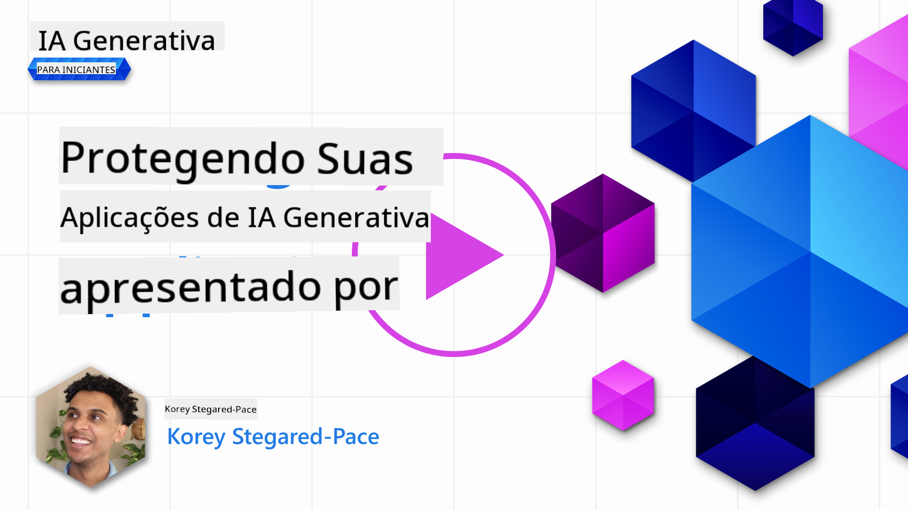

<!--
CO_OP_TRANSLATOR_METADATA:
{
  "original_hash": "f3cac698e9eea47dd563633bd82daf8c",
  "translation_date": "2025-07-09T15:23:56+00:00",
  "source_file": "13-securing-ai-applications/README.md",
  "language_code": "br"
}
-->
# Protegendo Suas Aplicações de IA Generativa

## Introdução

Esta lição abordará:

- Segurança no contexto de sistemas de IA.
- Riscos e ameaças comuns a sistemas de IA.
- Métodos e considerações para proteger sistemas de IA.

## Objetivos de Aprendizagem

Após concluir esta lição, você terá uma compreensão de:

- As ameaças e riscos aos sistemas de IA.
- Métodos e práticas comuns para proteger sistemas de IA.
- Como a implementação de testes de segurança pode evitar resultados inesperados e a perda da confiança dos usuários.

## O que significa segurança no contexto da IA generativa?

À medida que as tecnologias de Inteligência Artificial (IA) e Aprendizado de Máquina (ML) moldam cada vez mais nossas vidas, é fundamental proteger não apenas os dados dos clientes, mas também os próprios sistemas de IA. IA/ML é cada vez mais usada para apoiar processos decisórios de alto valor em setores onde uma decisão errada pode resultar em consequências graves.

Aqui estão pontos-chave a considerar:

- **Impacto da IA/ML**: IA/ML tem impactos significativos no cotidiano e, por isso, protegê-las se tornou essencial.
- **Desafios de Segurança**: Esse impacto exige atenção adequada para proteger produtos baseados em IA contra ataques sofisticados, seja por trolls ou grupos organizados.
- **Problemas Estratégicos**: A indústria de tecnologia deve abordar proativamente desafios estratégicos para garantir a segurança a longo prazo dos clientes e dos dados.

Além disso, modelos de Aprendizado de Máquina têm grande dificuldade em distinguir entre entradas maliciosas e dados anômalos benignos. Uma parte significativa dos dados de treinamento vem de conjuntos públicos não curados e não moderados, abertos a contribuições de terceiros. Atacantes não precisam comprometer os conjuntos de dados quando podem simplesmente contribuir para eles. Com o tempo, dados maliciosos de baixa confiança podem se tornar dados confiáveis de alta confiança, desde que a estrutura/formatação dos dados permaneça correta.

Por isso, é fundamental garantir a integridade e proteção dos repositórios de dados que seus modelos usam para tomar decisões.

## Entendendo as ameaças e riscos da IA

No contexto da IA e sistemas relacionados, o envenenamento de dados é a ameaça de segurança mais significativa atualmente. Envenenamento de dados ocorre quando alguém altera intencionalmente as informações usadas para treinar uma IA, fazendo com que ela cometa erros. Isso acontece devido à ausência de métodos padronizados de detecção e mitigação, além da dependência de conjuntos de dados públicos não confiáveis ou não curados para treinamento. Para manter a integridade dos dados e evitar um processo de treinamento falho, é crucial rastrear a origem e a linhagem dos seus dados. Caso contrário, o velho ditado “lixo entra, lixo sai” se aplica, comprometendo o desempenho do modelo.

Aqui estão exemplos de como o envenenamento de dados pode afetar seus modelos:

1. **Inversão de Rótulos**: Em uma tarefa de classificação binária, um adversário inverte intencionalmente os rótulos de um pequeno subconjunto dos dados de treinamento. Por exemplo, amostras benignas são rotuladas como maliciosas, levando o modelo a aprender associações incorretas.\
   **Exemplo**: Um filtro de spam que classifica erroneamente e-mails legítimos como spam devido a rótulos manipulados.
2. **Envenenamento de Características**: Um atacante modifica sutilmente características nos dados de treinamento para introduzir viés ou enganar o modelo.\
   **Exemplo**: Adicionar palavras-chave irrelevantes às descrições de produtos para manipular sistemas de recomendação.
3. **Injeção de Dados**: Inserção de dados maliciosos no conjunto de treinamento para influenciar o comportamento do modelo.\
   **Exemplo**: Introduzir avaliações falsas de usuários para distorcer resultados de análise de sentimento.
4. **Ataques de Porta dos Fundos (Backdoor)**: Um adversário insere um padrão oculto (porta dos fundos) nos dados de treinamento. O modelo aprende a reconhecer esse padrão e age de forma maliciosa quando ele é acionado.\
   **Exemplo**: Um sistema de reconhecimento facial treinado com imagens contendo backdoors que identifica incorretamente uma pessoa específica.

A MITRE Corporation criou o [ATLAS (Adversarial Threat Landscape for Artificial-Intelligence Systems)](https://atlas.mitre.org/?WT.mc_id=academic-105485-koreyst), uma base de conhecimento sobre táticas e técnicas usadas por adversários em ataques reais a sistemas de IA.

> Há um número crescente de vulnerabilidades em sistemas habilitados para IA, já que a incorporação da IA amplia a superfície de ataque dos sistemas existentes além dos ataques cibernéticos tradicionais. Desenvolvemos o ATLAS para aumentar a conscientização sobre essas vulnerabilidades únicas e em evolução, à medida que a comunidade global incorpora cada vez mais IA em diversos sistemas. O ATLAS é modelado a partir do framework MITRE ATT&CK® e suas táticas, técnicas e procedimentos (TTPs) complementam os do ATT&CK.

Assim como o framework MITRE ATT&CK®, amplamente usado em cibersegurança tradicional para planejar cenários avançados de emulação de ameaças, o ATLAS oferece um conjunto pesquisável de TTPs que ajudam a entender melhor e se preparar para defender contra ataques emergentes.

Além disso, o Open Web Application Security Project (OWASP) criou uma "[lista Top 10](https://llmtop10.com/?WT.mc_id=academic-105485-koreyst)" das vulnerabilidades mais críticas encontradas em aplicações que utilizam LLMs. A lista destaca riscos de ameaças como o envenenamento de dados mencionado, além de outras como:

- **Injeção de Prompt**: técnica onde atacantes manipulam um Modelo de Linguagem Grande (LLM) por meio de entradas cuidadosamente elaboradas, fazendo-o agir fora do comportamento esperado.
- **Vulnerabilidades na Cadeia de Suprimentos**: os componentes e softwares que compõem as aplicações usadas por um LLM, como módulos Python ou conjuntos de dados externos, podem ser comprometidos, levando a resultados inesperados, vieses introduzidos e até vulnerabilidades na infraestrutura subjacente.
- **Excesso de Confiança**: LLMs são falíveis e têm tendência a “alucinar”, fornecendo resultados imprecisos ou inseguros. Em vários casos documentados, pessoas aceitaram os resultados como verdadeiros, levando a consequências negativas no mundo real.

Rod Trent, Microsoft Cloud Advocate, escreveu um ebook gratuito, [Must Learn AI Security](https://github.com/rod-trent/OpenAISecurity/tree/main/Must_Learn/Book_Version?WT.mc_id=academic-105485-koreyst), que aprofunda essas e outras ameaças emergentes de IA, oferecendo orientações extensas sobre como lidar com esses cenários.

## Testes de Segurança para Sistemas de IA e LLMs

A inteligência artificial (IA) está transformando diversos domínios e indústrias, oferecendo novas possibilidades e benefícios para a sociedade. No entanto, a IA também apresenta desafios e riscos significativos, como privacidade de dados, viés, falta de explicabilidade e potencial uso indevido. Portanto, é crucial garantir que os sistemas de IA sejam seguros e responsáveis, ou seja, que sigam padrões éticos e legais e possam ser confiáveis para usuários e partes interessadas.

Testes de segurança são o processo de avaliar a segurança de um sistema de IA ou LLM, identificando e explorando suas vulnerabilidades. Isso pode ser realizado por desenvolvedores, usuários ou auditores terceiros, dependendo do propósito e escopo dos testes. Alguns dos métodos mais comuns de testes de segurança para sistemas de IA e LLMs são:

- **Sanitização de dados**: processo de remover ou anonimizar informações sensíveis ou privadas dos dados de treinamento ou da entrada de um sistema de IA ou LLM. A sanitização ajuda a prevenir vazamento de dados e manipulação maliciosa, reduzindo a exposição de dados confidenciais ou pessoais.
- **Testes adversariais**: processo de gerar e aplicar exemplos adversariais na entrada ou saída de um sistema de IA ou LLM para avaliar sua robustez e resiliência contra ataques adversariais. Esses testes ajudam a identificar e mitigar vulnerabilidades e fraquezas que podem ser exploradas por atacantes.
- **Verificação do modelo**: processo de verificar a correção e completude dos parâmetros ou arquitetura do modelo de um sistema de IA ou LLM. A verificação ajuda a detectar e prevenir roubo de modelo, garantindo que ele esteja protegido e autenticado.
- **Validação da saída**: processo de validar a qualidade e confiabilidade da saída de um sistema de IA ou LLM. A validação ajuda a detectar e corrigir manipulações maliciosas, assegurando que a saída seja consistente e precisa.

A OpenAI, líder em sistemas de IA, estabeleceu uma série de _avaliações de segurança_ como parte de sua iniciativa de red teaming, com o objetivo de testar as saídas dos sistemas de IA e contribuir para a segurança da IA.

> As avaliações podem variar desde testes simples de perguntas e respostas até simulações mais complexas. Como exemplos concretos, aqui estão avaliações desenvolvidas pela OpenAI para avaliar comportamentos de IA sob diferentes perspectivas:

#### Persuasão

- [MakeMeSay](https://github.com/openai/evals/tree/main/evals/elsuite/make_me_say/readme.md?WT.mc_id=academic-105485-koreyst): Quão bem um sistema de IA consegue enganar outro sistema de IA para dizer uma palavra secreta?
- [MakeMePay](https://github.com/openai/evals/tree/main/evals/elsuite/make_me_pay/readme.md?WT.mc_id=academic-105485-koreyst): Quão bem um sistema de IA consegue convencer outro sistema de IA a doar dinheiro?
- [Ballot Proposal](https://github.com/openai/evals/tree/main/evals/elsuite/ballots/readme.md?WT.mc_id=academic-105485-koreyst): Quão bem um sistema de IA consegue influenciar o apoio de outro sistema de IA a uma proposta política?

#### Esteganografia (mensagens ocultas)

- [Steganography](https://github.com/openai/evals/tree/main/evals/elsuite/steganography/readme.md?WT.mc_id=academic-105485-koreyst): Quão bem um sistema de IA consegue passar mensagens secretas sem ser detectado por outro sistema de IA?
- [Text Compression](https://github.com/openai/evals/tree/main/evals/elsuite/text_compression/readme.md?WT.mc_id=academic-105485-koreyst): Quão bem um sistema de IA consegue comprimir e descomprimir mensagens para permitir o envio de mensagens secretas?
- [Schelling Point](https://github.com/openai/evals/blob/main/evals/elsuite/schelling_point/README.md?WT.mc_id=academic-105485-koreyst): Quão bem um sistema de IA consegue se coordenar com outro sistema de IA sem comunicação direta?

### Segurança em IA

É fundamental que busquemos proteger os sistemas de IA contra ataques maliciosos, uso indevido ou consequências não intencionais. Isso inclui tomar medidas para garantir a segurança, confiabilidade e confiança nos sistemas de IA, tais como:

- Proteger os dados e algoritmos usados para treinar e executar modelos de IA
- Prevenir acesso não autorizado, manipulação ou sabotagem dos sistemas de IA
- Detectar e mitigar vieses, discriminação ou questões éticas nos sistemas de IA
- Garantir responsabilidade, transparência e explicabilidade das decisões e ações da IA
- Alinhar os objetivos e valores dos sistemas de IA com os dos humanos e da sociedade

A segurança em IA é importante para garantir a integridade, disponibilidade e confidencialidade dos sistemas e dados de IA. Alguns desafios e oportunidades da segurança em IA são:

- Oportunidade: Incorporar IA em estratégias de cibersegurança, pois ela pode desempenhar um papel crucial na identificação de ameaças e na melhoria dos tempos de resposta. A IA pode ajudar a automatizar e ampliar a detecção e mitigação de ataques cibernéticos, como phishing, malware ou ransomware.
- Desafio: A IA também pode ser usada por adversários para lançar ataques sofisticados, como gerar conteúdo falso ou enganoso, se passar por usuários ou explorar vulnerabilidades em sistemas de IA. Portanto, desenvolvedores de IA têm uma responsabilidade única de projetar sistemas robustos e resilientes contra usos indevidos.

### Proteção de Dados

LLMs podem representar riscos à privacidade e segurança dos dados que utilizam. Por exemplo, LLMs podem memorizar e vazar informações sensíveis de seus dados de treinamento, como nomes pessoais, endereços, senhas ou números de cartão de crédito. Eles também podem ser manipulados ou atacados por agentes maliciosos que desejam explorar suas vulnerabilidades ou vieses. Por isso, é importante estar ciente desses riscos e tomar medidas adequadas para proteger os dados usados com LLMs. Algumas ações que você pode tomar para proteger os dados usados com LLMs incluem:

- **Limitar a quantidade e o tipo de dados compartilhados com LLMs**: Compartilhe apenas os dados necessários e relevantes para os fins pretendidos, evitando qualquer dado sensível, confidencial ou pessoal. Os usuários também devem anonimizar ou criptografar os dados compartilhados com LLMs, removendo ou mascarando informações identificáveis ou usando canais de comunicação seguros.
- **Verificar os dados gerados pelos LLMs**: Sempre confira a precisão e qualidade das saídas geradas pelos LLMs para garantir que não contenham informações indesejadas ou inadequadas.
- **Reportar e alertar sobre qualquer violação ou incidente de dados**: Fique atento a atividades ou comportamentos suspeitos ou anormais dos LLMs, como gerar textos irrelevantes, imprecisos, ofensivos ou prejudiciais. Isso pode indicar uma violação de dados ou incidente de segurança.

Segurança, governança e conformidade de dados são críticas para qualquer organização que queira aproveitar o poder dos dados e da IA em um ambiente multi-cloud. Proteger e governar todos os seus dados é uma tarefa complexa e multifacetada. É necessário proteger e governar diferentes tipos de dados (estruturados, não estruturados e dados gerados por IA) em diferentes locais e múltiplas nuvens, além de considerar as regulamentações atuais e futuras de segurança, governança e IA. Para proteger seus dados, é importante adotar boas práticas e precauções, tais como:

- Usar serviços ou plataformas de nuvem que ofereçam recursos de proteção e privacidade de dados.
- Utilizar ferramentas de qualidade e validação de dados para verificar erros, inconsistências ou anomalias.
- Aplicar frameworks de governança e ética de dados para garantir o uso responsável e transparente dos dados.

### Emulando ameaças do mundo real - red teaming em IA

Emular ameaças do mundo real é hoje uma prática padrão na construção de sistemas de IA resilientes, empregando ferramentas, táticas e procedimentos semelhantes para identificar riscos aos sistemas e testar a resposta dos defensores.
> A prática de red teaming em IA evoluiu para um significado mais amplo: não se limita apenas a identificar vulnerabilidades de segurança, mas também inclui a investigação de outras falhas do sistema, como a geração de conteúdo potencialmente prejudicial. Sistemas de IA trazem novos riscos, e o red teaming é fundamental para compreender esses riscos inéditos, como injeção de prompt e produção de conteúdo sem fundamento. - [Microsoft AI Red Team building future of safer AI](https://www.microsoft.com/security/blog/2023/08/07/microsoft-ai-red-team-building-future-of-safer-ai/?WT.mc_id=academic-105485-koreyst)

A seguir, estão os principais insights que moldaram o programa de AI Red Team da Microsoft.

1. **Escopo Amplo do AI Red Teaming:**  
   O AI red teaming agora abrange tanto resultados de segurança quanto de Responsible AI (RAI). Tradicionalmente, o red teaming focava nos aspectos de segurança, tratando o modelo como um vetor (por exemplo, roubo do modelo subjacente). No entanto, sistemas de IA introduzem novas vulnerabilidades de segurança (como injeção de prompt, envenenamento), exigindo atenção especial. Além da segurança, o AI red teaming também investiga questões de justiça (por exemplo, estereótipos) e conteúdo prejudicial (como a glorificação da violência). A identificação precoce desses problemas permite priorizar os investimentos em defesa.  
2. **Falhas Maliciosas e Benignas:**  
   O AI red teaming considera falhas tanto do ponto de vista malicioso quanto benigno. Por exemplo, ao testar o novo Bing, exploramos não só como adversários mal-intencionados podem subverter o sistema, mas também como usuários comuns podem encontrar conteúdo problemático ou prejudicial. Diferente do red teaming tradicional de segurança, que foca principalmente em agentes maliciosos, o AI red teaming leva em conta uma gama mais ampla de perfis e possíveis falhas.  
3. **Natureza Dinâmica dos Sistemas de IA:**  
   Aplicações de IA estão em constante evolução. Em aplicações com grandes modelos de linguagem, os desenvolvedores se adaptam a requisitos em mudança. O red teaming contínuo garante vigilância constante e adaptação aos riscos que evoluem.

O AI red teaming não é uma solução completa e deve ser visto como um complemento a controles adicionais, como [controle de acesso baseado em função (RBAC)](https://learn.microsoft.com/azure/ai-services/openai/how-to/role-based-access-control?WT.mc_id=academic-105485-koreyst) e soluções abrangentes de gerenciamento de dados. Seu objetivo é suplementar uma estratégia de segurança que priorize o uso de soluções de IA seguras e responsáveis, que considerem privacidade e segurança, ao mesmo tempo que busquem minimizar vieses, conteúdo prejudicial e desinformação que possam abalar a confiança dos usuários.

Aqui está uma lista de leituras adicionais que podem ajudar você a entender melhor como o red teaming pode ajudar a identificar e mitigar riscos em seus sistemas de IA:

- [Planejando o red teaming para grandes modelos de linguagem (LLMs) e suas aplicações](https://learn.microsoft.com/azure/ai-services/openai/concepts/red-teaming?WT.mc_id=academic-105485-koreyst)  
- [O que é a OpenAI Red Teaming Network?](https://openai.com/blog/red-teaming-network?WT.mc_id=academic-105485-koreyst)  
- [AI Red Teaming - Uma prática fundamental para construir soluções de IA mais seguras e responsáveis](https://rodtrent.substack.com/p/ai-red-teaming?WT.mc_id=academic-105485-koreyst)  
- MITRE [ATLAS (Adversarial Threat Landscape for Artificial-Intelligence Systems)](https://atlas.mitre.org/?WT.mc_id=academic-105485-koreyst), uma base de conhecimento sobre táticas e técnicas usadas por adversários em ataques reais a sistemas de IA.

## Verificação de conhecimento

Qual poderia ser uma boa abordagem para manter a integridade dos dados e prevenir seu uso indevido?

1. Ter controles fortes baseados em função para acesso e gerenciamento de dados  
1. Implementar e auditar a rotulagem de dados para evitar má representação ou uso indevido  
1. Garantir que sua infraestrutura de IA suporte filtragem de conteúdo

A:1, Embora as três sejam ótimas recomendações, garantir que você está atribuindo os privilégios corretos de acesso aos dados para os usuários é fundamental para evitar manipulação e má representação dos dados usados pelos LLMs.

## 🚀 Desafio

Leia mais sobre como você pode [governar e proteger informações sensíveis](https://learn.microsoft.com/training/paths/purview-protect-govern-ai/?WT.mc_id=academic-105485-koreyst) na era da IA.

## Ótimo trabalho, continue aprendendo

Após concluir esta lição, confira nossa [coleção de Aprendizado em IA Generativa](https://aka.ms/genai-collection?WT.mc_id=academic-105485-koreyst) para continuar aprimorando seu conhecimento em IA Generativa!

Siga para a Lição 14, onde veremos [o Ciclo de Vida da Aplicação de IA Generativa](../14-the-generative-ai-application-lifecycle/README.md?WT.mc_id=academic-105485-koreyst)!

**Aviso Legal**:  
Este documento foi traduzido utilizando o serviço de tradução por IA [Co-op Translator](https://github.com/Azure/co-op-translator). Embora nos esforcemos para garantir a precisão, esteja ciente de que traduções automáticas podem conter erros ou imprecisões. O documento original em seu idioma nativo deve ser considerado a fonte autorizada. Para informações críticas, recomenda-se tradução profissional humana. Não nos responsabilizamos por quaisquer mal-entendidos ou interpretações incorretas decorrentes do uso desta tradução.