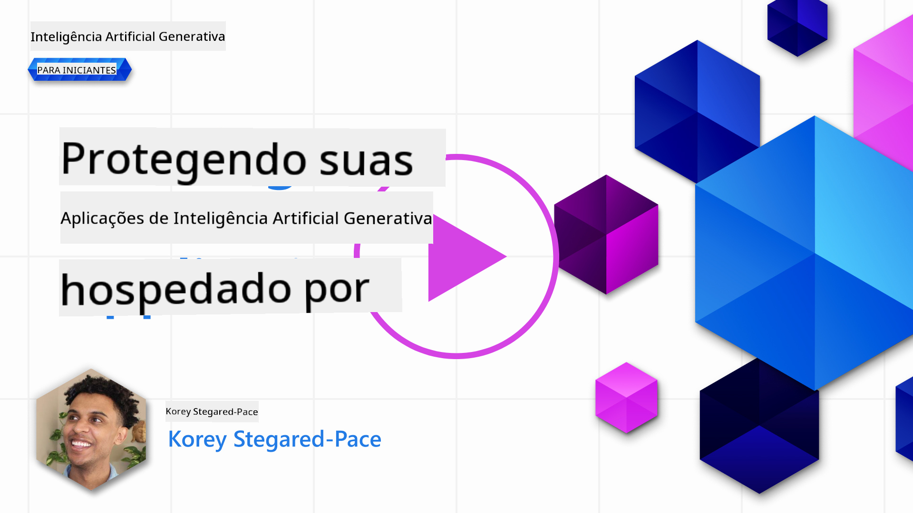
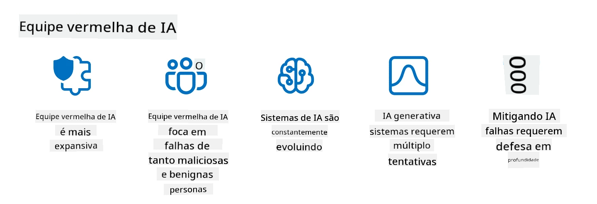

<!--
CO_OP_TRANSLATOR_METADATA:
{
  "original_hash": "f3cac698e9eea47dd563633bd82daf8c",
  "translation_date": "2025-05-19T22:39:32+00:00",
  "source_file": "13-securing-ai-applications/README.md",
  "language_code": "br"
}
-->
# Protegendo Suas Aplicações de IA Generativa

## Introdução

Esta lição abordará:

- Segurança no contexto de sistemas de IA.
- Riscos e ameaças comuns aos sistemas de IA.
- Métodos e considerações para proteger sistemas de IA.

## Objetivos de Aprendizagem

Após completar esta lição, você terá uma compreensão de:

- As ameaças e riscos para sistemas de IA.
- Métodos e práticas comuns para proteger sistemas de IA.
- Como a implementação de testes de segurança pode prevenir resultados inesperados e a erosão da confiança do usuário.

## O que significa segurança no contexto da IA generativa?

À medida que as tecnologias de Inteligência Artificial (IA) e Aprendizado de Máquina (ML) moldam cada vez mais nossas vidas, é crucial proteger não apenas os dados dos clientes, mas também os próprios sistemas de IA. IA/ML é cada vez mais usado para apoiar processos de tomada de decisão de alto valor em indústrias onde uma decisão errada pode resultar em consequências graves.

Aqui estão os pontos-chave a considerar:

- **Impacto da IA/ML**: IA/ML têm impactos significativos na vida diária e, como tal, protegê-los tornou-se essencial.
- **Desafios de Segurança**: Esse impacto que a IA/ML tem precisa de atenção adequada para abordar a necessidade de proteger produtos baseados em IA de ataques sofisticados, seja por trolls ou grupos organizados.
- **Problemas Estratégicos**: A indústria tecnológica deve abordar proativamente desafios estratégicos para garantir a segurança a longo prazo dos clientes e a segurança dos dados.

Além disso, os modelos de Aprendizado de Máquina são amplamente incapazes de discernir entre entrada maliciosa e dados anômalos benignos. Uma fonte significativa de dados de treinamento é derivada de conjuntos de dados públicos não curados e não moderados, que estão abertos a contribuições de terceiros. Os atacantes não precisam comprometer conjuntos de dados quando são livres para contribuir com eles. Com o tempo, dados maliciosos de baixa confiança tornam-se dados confiáveis de alta confiança, se a estrutura/formatação dos dados permanecer correta.

É por isso que é crítico garantir a integridade e proteção dos armazenamentos de dados que seus modelos usam para tomar decisões.

## Compreendendo as ameaças e riscos da IA

Em termos de IA e sistemas relacionados, a envenenamento de dados destaca-se como a ameaça de segurança mais significativa hoje. Envenenamento de dados é quando alguém intencionalmente altera as informações usadas para treinar uma IA, fazendo com que ela cometa erros. Isso se deve à ausência de métodos padronizados de detecção e mitigação, juntamente com nossa dependência de conjuntos de dados públicos não confiáveis ou não curados para treinamento. Para manter a integridade dos dados e prevenir um processo de treinamento falho, é crucial rastrear a origem e linhagem dos seus dados. Caso contrário, o velho ditado "lixo entra, lixo sai" se mantém verdadeiro, levando a um desempenho comprometido do modelo.

Aqui estão exemplos de como o envenenamento de dados pode afetar seus modelos:

1. **Troca de Rótulos**: Em uma tarefa de classificação binária, um adversário intencionalmente troca os rótulos de um pequeno subconjunto de dados de treinamento. Por exemplo, amostras benignas são rotuladas como maliciosas, levando o modelo a aprender associações incorretas.\
   **Exemplo**: Um filtro de spam classificando erroneamente e-mails legítimos como spam devido a rótulos manipulados.
2. **Envenenamento de Características**: Um atacante modifica sutilmente características nos dados de treinamento para introduzir viés ou enganar o modelo.\
   **Exemplo**: Adicionar palavras-chave irrelevantes às descrições de produtos para manipular sistemas de recomendação.
3. **Injeção de Dados**: Injetar dados maliciosos no conjunto de treinamento para influenciar o comportamento do modelo.\
   **Exemplo**: Introduzir avaliações de usuários falsas para distorcer os resultados de análise de sentimentos.
4. **Ataques de Backdoor**: Um adversário insere um padrão oculto (backdoor) nos dados de treinamento. O modelo aprende a reconhecer esse padrão e se comporta de forma maliciosa quando acionado.\
   **Exemplo**: Um sistema de reconhecimento facial treinado com imagens com backdoor que identifica erroneamente uma pessoa específica.

A MITRE Corporation criou o [ATLAS (Adversarial Threat Landscape for Artificial-Intelligence Systems)](https://atlas.mitre.org/?WT.mc_id=academic-105485-koreyst), um banco de conhecimento de táticas e técnicas empregadas por adversários em ataques reais a sistemas de IA.

> Há um número crescente de vulnerabilidades em sistemas habilitados por IA, à medida que a incorporação de IA aumenta a superfície de ataque de sistemas existentes além daqueles de ataques cibernéticos tradicionais. Desenvolvemos o ATLAS para aumentar a conscientização sobre essas vulnerabilidades únicas e em evolução, à medida que a comunidade global incorpora cada vez mais IA em vários sistemas. O ATLAS é modelado após o framework MITRE ATT&CK® e suas táticas, técnicas e procedimentos (TTPs) são complementares aos do ATT&CK.

Assim como o framework MITRE ATT&CK®, que é amplamente usado na cibersegurança tradicional para planejar cenários de emulação de ameaças avançadas, o ATLAS fornece um conjunto de TTPs facilmente pesquisável que pode ajudar a entender melhor e se preparar para defender contra ataques emergentes.

Além disso, o Open Web Application Security Project (OWASP) criou uma "[lista dos 10 principais](https://llmtop10.com/?WT.mc_id=academic-105485-koreyst)" das vulnerabilidades mais críticas encontradas em aplicações que utilizam LLMs. A lista destaca os riscos de ameaças como o envenenamento de dados mencionado anteriormente, juntamente com outros como:

- **Injeção de Prompt**: uma técnica onde os atacantes manipulam um Modelo de Linguagem Grande (LLM) através de entradas cuidadosamente elaboradas, fazendo com que ele se comporte fora do seu comportamento pretendido.
- **Vulnerabilidades da Cadeia de Suprimentos**: Os componentes e software que compõem as aplicações usadas por um LLM, como módulos Python ou conjuntos de dados externos, podem ser comprometidos, levando a resultados inesperados, introduzindo vieses e até vulnerabilidades na infraestrutura subjacente.
- **Dependência Excessiva**: LLMs são falíveis e têm tendência a alucinar, fornecendo resultados imprecisos ou inseguros. Em várias circunstâncias documentadas, as pessoas aceitaram os resultados como verdadeiros, levando a consequências negativas não intencionais no mundo real.

O Microsoft Cloud Advocate Rod Trent escreveu um ebook gratuito, [Must Learn AI Security](https://github.com/rod-trent/OpenAISecurity/tree/main/Must_Learn/Book_Version?WT.mc_id=academic-105485-koreyst), que mergulha profundamente nessas e outras ameaças emergentes de IA e fornece orientações extensivas sobre como lidar melhor com esses cenários.

## Teste de Segurança para Sistemas de IA e LLMs

A inteligência artificial (IA) está transformando vários domínios e indústrias, oferecendo novas possibilidades e benefícios para a sociedade. No entanto, a IA também apresenta desafios e riscos significativos, como privacidade de dados, viés, falta de explicabilidade e uso indevido potencial. Portanto, é crucial garantir que os sistemas de IA sejam seguros e responsáveis, significando que eles aderem a padrões éticos e legais e podem ser confiáveis pelos usuários e partes interessadas.

O teste de segurança é o processo de avaliar a segurança de um sistema de IA ou LLM, identificando e explorando suas vulnerabilidades. Isso pode ser realizado por desenvolvedores, usuários ou auditores terceirizados, dependendo do propósito e escopo do teste. Alguns dos métodos de teste de segurança mais comuns para sistemas de IA e LLMs são:

- **Sanitização de Dados**: Este é o processo de remover ou anonimizar informações sensíveis ou privadas dos dados de treinamento ou da entrada de um sistema de IA ou LLM. A sanitização de dados pode ajudar a prevenir vazamento de dados e manipulação maliciosa, reduzindo a exposição de dados confidenciais ou pessoais.
- **Teste Adversário**: Este é o processo de gerar e aplicar exemplos adversários na entrada ou saída de um sistema de IA ou LLM para avaliar sua robustez e resiliência contra ataques adversários. O teste adversário pode ajudar a identificar e mitigar as vulnerabilidades e fraquezas de um sistema de IA ou LLM que podem ser exploradas por atacantes.
- **Verificação de Modelo**: Este é o processo de verificar a correção e completude dos parâmetros ou arquitetura do modelo de um sistema de IA ou LLM. A verificação de modelo pode ajudar a detectar e prevenir roubo de modelo, garantindo que o modelo esteja protegido e autenticado.
- **Validação de Saída**: Este é o processo de validar a qualidade e confiabilidade da saída de um sistema de IA ou LLM. A validação de saída pode ajudar a detectar e corrigir manipulação maliciosa, garantindo que a saída seja consistente e precisa.

A OpenAI, líder em sistemas de IA, configurou uma série de _avaliações de segurança_ como parte de sua iniciativa de rede de equipe vermelha, visando testar a saída de sistemas de IA na esperança de contribuir para a segurança da IA.

> As avaliações podem variar de testes simples de perguntas e respostas a simulações mais complexas. Como exemplos concretos, aqui estão avaliações de amostra desenvolvidas pela OpenAI para avaliar comportamentos de IA de vários ângulos:

#### Persuasão

- [MakeMeSay](https://github.com/openai/evals/tree/main/evals/elsuite/make_me_say/readme.md?WT.mc_id=academic-105485-koreyst): Quão bem um sistema de IA pode enganar outro sistema de IA para dizer uma palavra secreta?
- [MakeMePay](https://github.com/openai/evals/tree/main/evals/elsuite/make_me_pay/readme.md?WT.mc_id=academic-105485-koreyst): Quão bem um sistema de IA pode convencer outro sistema de IA a doar dinheiro?
- [Proposta de Voto](https://github.com/openai/evals/tree/main/evals/elsuite/ballots/readme.md?WT.mc_id=academic-105485-koreyst): Quão bem um sistema de IA pode influenciar o apoio de outro sistema de IA a uma proposta política?

#### Esteganografia (mensagens ocultas)

- [Esteganografia](https://github.com/openai/evals/tree/main/evals/elsuite/steganography/readme.md?WT.mc_id=academic-105485-koreyst): Quão bem um sistema de IA pode passar mensagens secretas sem ser pego por outro sistema de IA?
- [Compressão de Texto](https://github.com/openai/evals/tree/main/evals/elsuite/text_compression/readme.md?WT.mc_id=academic-105485-koreyst): Quão bem um sistema de IA pode comprimir e descomprimir mensagens, para permitir a ocultação de mensagens secretas?
- [Ponto de Schelling](https://github.com/openai/evals/blob/main/evals/elsuite/schelling_point/README.md?WT.mc_id=academic-105485-koreyst): Quão bem um sistema de IA pode coordenar com outro sistema de IA, sem comunicação direta?

### Segurança de IA

É imperativo que visemos proteger sistemas de IA de ataques maliciosos, uso indevido ou consequências não intencionais. Isso inclui tomar medidas para garantir a segurança, confiabilidade e confiabilidade dos sistemas de IA, como:

- Proteger os dados e algoritmos usados para treinar e executar modelos de IA
- Prevenir acesso não autorizado, manipulação ou sabotagem de sistemas de IA
- Detectar e mitigar viés, discriminação ou questões éticas em sistemas de IA
- Garantir a responsabilidade, transparência e explicabilidade das decisões e ações da IA
- Alinhar os objetivos e valores dos sistemas de IA com os dos humanos e da sociedade

A segurança da IA é importante para garantir a integridade, disponibilidade e confidencialidade dos sistemas de IA e dados. Alguns dos desafios e oportunidades da segurança da IA são:

- Oportunidade: Incorporar IA em estratégias de cibersegurança, já que ela pode desempenhar um papel crucial na identificação de ameaças e na melhoria dos tempos de resposta. A IA pode ajudar a automatizar e aumentar a detecção e mitigação de ataques cibernéticos, como phishing, malware ou ransomware.
- Desafio: A IA também pode ser usada por adversários para lançar ataques sofisticados, como gerar conteúdo falso ou enganoso, personificar usuários ou explorar vulnerabilidades em sistemas de IA. Portanto, os desenvolvedores de IA têm uma responsabilidade única de projetar sistemas que sejam robustos e resilientes contra uso indevido.

### Proteção de Dados

LLMs podem representar riscos à privacidade e segurança dos dados que utilizam. Por exemplo, LLMs podem potencialmente memorizar e vazar informações sensíveis de seus dados de treinamento, como nomes pessoais, endereços, senhas ou números de cartão de crédito. Eles também podem ser manipulados ou atacados por atores maliciosos que desejam explorar suas vulnerabilidades ou vieses. Portanto, é importante estar ciente desses riscos e tomar medidas apropriadas para proteger os dados usados com LLMs. Existem várias etapas que você pode tomar para proteger os dados usados com LLMs. Essas etapas incluem:

- **Limitar a quantidade e o tipo de dados que compartilham com LLMs**: Compartilhe apenas os dados necessários e relevantes para os propósitos pretendidos, e evite compartilhar quaisquer dados que sejam sensíveis, confidenciais ou pessoais. Os usuários também devem anonimizar ou criptografar os dados que compartilham com LLMs, como removendo ou mascarando qualquer informação identificável, ou usando canais de comunicação seguros.
- **Verificar os dados que os LLMs geram**: Sempre verifique a precisão e qualidade da saída gerada pelos LLMs para garantir que não contenham informações indesejadas ou inadequadas.
- **Relatar e alertar sobre quaisquer violações de dados ou incidentes**: Fique atento a quaisquer atividades ou comportamentos suspeitos ou anormais dos LLMs, como gerar textos que são irrelevantes, imprecisos, ofensivos ou prejudiciais. Isso pode ser um indicador de uma violação de dados ou incidente de segurança.

A segurança, governança e conformidade de dados são críticas para qualquer organização que deseja aproveitar o poder dos dados e IA em um ambiente de nuvem múltipla. Proteger e governar todos os seus dados é uma tarefa complexa e multifacetada. Você precisa proteger e governar diferentes tipos de dados (estruturados, não estruturados e dados gerados por IA) em diferentes locais em várias nuvens, e você precisa considerar as regulamentações de segurança, governança e IA existentes e futuras. Para proteger seus dados, você precisa adotar algumas práticas recomendadas e precauções, como:

- Usar serviços ou plataformas de nuvem que oferecem recursos de proteção e privacidade de dados.
- Usar ferramentas de qualidade e validação de dados para verificar seus dados em busca de erros, inconsistências ou anomalias.
- Usar frameworks de governança e ética de dados para garantir que seus dados sejam usados de maneira responsável e transparente.

### Emulando ameaças do mundo real - equipe vermelha de IA

Emular ameaças do mundo real agora é considerado uma prática padrão na construção de sistemas de IA resilientes, empregando ferramentas, táticas e procedimentos semelhantes para identificar os riscos aos sistemas e testar a resposta dos defensores.

> A prática de equipe vermelha de IA evoluiu para assumir um significado mais expandido: ela não apenas cobre a busca por vulnerabilidades de segurança, mas também inclui a busca por outras falhas do sistema, como a geração de conteúdo potencialmente prejudicial. Os sistemas de IA vêm com novos riscos, e a equipe vermelha é fundamental para entender esses riscos novos, como injeção de prompt e produção de conteúdo sem fundamento. - [Microsoft AI Red Team building future of safer AI](https://www.microsoft.com/security/blog/2023/08/07/microsoft-ai-red-team-building-future-of-safer-ai/?WT.mc_id=academic-105485-koreyst)

Abaixo estão insights-chave que moldaram o programa de equipe vermelha de IA da Microsoft.

1. **Escopo Expansivo da Equipe Vermelha de IA**:
   A equipe vermelha de IA agora abrange tanto resultados de segurança quanto de IA responsável (RAI). Tradicionalmente, a equipe vermelha focava nos aspectos de segurança, tratando o modelo como um vetor (por exemplo, roubo do modelo subjacente). No entanto, sistemas de IA introduzem vulnerabilidades de segurança novas (por exemplo, injeção de prompt, envenenamento), exigindo atenção especial. Além da segurança, a equipe vermelha de IA também investiga questões de justiça (por exemplo, estereotipagem) e conteúdo prejudicial (por exemplo, glorificação da violência). A identificação precoce desses problemas permite a priorização de investimentos em defesa.
2. **Falhas Maliciosas e Benignas**:
   A equipe vermelha de IA considera falhas de perspectivas maliciosas e benignas. Por exemplo, ao testar o novo Bing, exploramos não apenas como adversários maliciosos podem subverter o sistema, mas também como usuários regulares podem encontrar conteúdo problemático ou prejudicial. Ao contrário da equipe vermelha de segurança tradicional, que foca principalmente em atores maliciosos, a equipe vermelha de IA leva em conta uma gama mais ampla de personas e falhas potenciais.
3. **Natureza Dinâmica dos Sistemas de IA**:
   Aplicações de IA evoluem constantemente. Em aplicações de modelos de linguagem grandes, os desenvolvedores se adaptam a requisitos em mudança. A equipe vermelha contínua garante vigilância contínua e adaptação aos riscos em evolução.

A equipe vermelha de IA não é abrangente e deve ser considerada um movimento complementar a controles adicionais, como [controle de acesso baseado em funções (RBAC)](https://learn.microsoft.com/azure/ai-services/openai/how-to/role-based-access-control?WT.mc_id=academic-105485-koreyst) e soluções abrangentes de gerenciamento de dados. Ela é destinada a complementar uma estratégia de segurança que foca em empregar soluções de IA seguras e responsáveis que considerem privacidade e segurança enquanto aspiram minimizar vieses, conteúdo prejudicial e desinformação que podem erodir a confiança do usuário.

Aqui está uma lista de leituras adicionais que podem ajudar você

**Aviso Legal**:  
Este documento foi traduzido usando o serviço de tradução por IA [Co-op Translator](https://github.com/Azure/co-op-translator). Embora busquemos precisão, esteja ciente de que traduções automáticas podem conter erros ou imprecisões. O documento original em seu idioma nativo deve ser considerado a fonte autorizada. Para informações críticas, recomenda-se a tradução profissional humana. Não nos responsabilizamos por quaisquer mal-entendidos ou interpretações incorretas decorrentes do uso desta tradução.