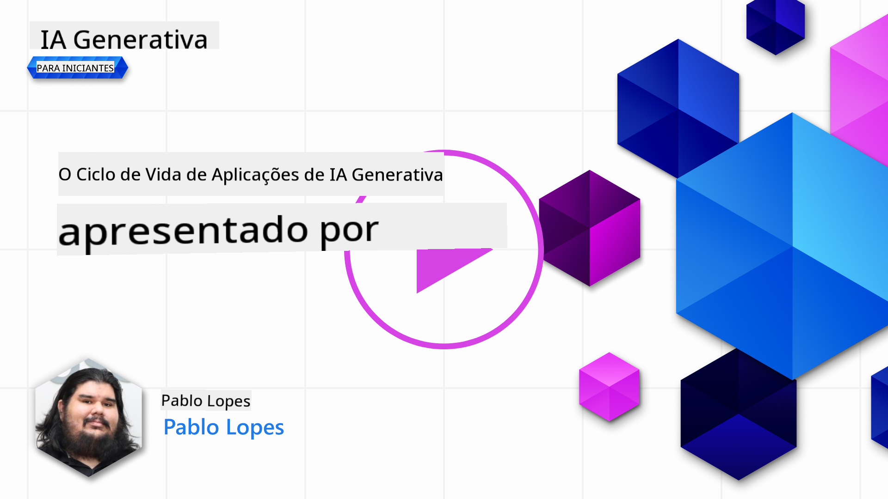

<!--
CO_OP_TRANSLATOR_METADATA:
{
  "original_hash": "df44972d5575ea8cef3c52ee31696d04",
  "translation_date": "2025-12-19T14:36:08+00:00",
  "source_file": "14-the-generative-ai-application-lifecycle/README.md",
  "language_code": "br"
}
-->

# O Ciclo de Vida da Aplicação de IA Generativa

Uma pergunta importante para todas as aplicações de IA é a relevância dos recursos de IA, já que a IA é um campo em rápida evolução, para garantir que sua aplicação permaneça relevante, confiável e robusta, você precisa monitorá-la, avaliá-la e melhorá-la continuamente. É aqui que entra o ciclo de vida da IA generativa.

O ciclo de vida da IA generativa é uma estrutura que orienta você pelas etapas de desenvolvimento, implantação e manutenção de uma aplicação de IA generativa. Ele ajuda a definir seus objetivos, medir seu desempenho, identificar seus desafios e implementar suas soluções. Também ajuda a alinhar sua aplicação com os padrões éticos e legais do seu domínio e dos seus stakeholders. Seguindo o ciclo de vida da IA generativa, você pode garantir que sua aplicação esteja sempre entregando valor e satisfazendo seus usuários.

## Introdução

Neste capítulo, você irá:

- Entender a Mudança de Paradigma de MLOps para LLMOps
- O Ciclo de Vida do LLM
- Ferramentas para o Ciclo de Vida
- Métricas e Avaliação do Ciclo de Vida

## Entender a Mudança de Paradigma de MLOps para LLMOps

LLMs são uma nova ferramenta no arsenal da Inteligência Artificial, são incrivelmente poderosos em tarefas de análise e geração para aplicações, porém esse poder tem algumas consequências em como otimizamos tarefas de IA e Aprendizado de Máquina Clássico.

Com isso, precisamos de um novo Paradigma para adaptar essa ferramenta de forma dinâmica, com os incentivos corretos. Podemos categorizar aplicações antigas de IA como "Apps de ML" e aplicações novas de IA como "Apps de GenAI" ou simplesmente "Apps de IA", refletindo a tecnologia e técnicas predominantes usadas na época. Isso muda nossa narrativa de várias formas, veja a comparação a seguir.

Note que em LLMOps, estamos mais focados nos Desenvolvedores de Aplicações, usando integrações como ponto chave, utilizando "Modelos-como-Serviço" e pensando nos seguintes pontos para métricas.

- Qualidade: Qualidade da resposta
- Dano: IA Responsável
- Honestidade: Fundamentação da resposta (Faz sentido? Está correta?)
- Custo: Orçamento da solução
- Latência: Tempo médio para resposta do token

## O Ciclo de Vida do LLM

Primeiro, para entender o ciclo de vida e as modificações, observe o próximo infográfico.

Como você pode notar, isso é diferente dos Ciclos de Vida usuais do MLOps. LLMs têm muitos novos requisitos, como Prompting, técnicas diferentes para melhorar a qualidade (Fine-Tuning, RAG, Meta-Prompts), avaliação e responsabilidade com IA responsável, por fim, novas métricas de avaliação (Qualidade, Dano, Honestidade, Custo e Latência).

Por exemplo, veja como idealizamos. Usando engenharia de prompt para experimentar com vários LLMs para explorar possibilidades e testar se suas Hipóteses podem estar corretas.

Note que isso não é linear, mas ciclos integrados, iterativos e com um ciclo abrangente.

Como poderíamos explorar essas etapas? Vamos detalhar como construir um ciclo de vida.

Isso pode parecer um pouco complicado, vamos focar primeiro nos três grandes passos.

1. Idealizar/Explorar: Exploração, aqui podemos explorar conforme as necessidades do nosso negócio. Prototipar, criar um [PromptFlow](https://microsoft.github.io/promptflow/index.html?WT.mc_id=academic-105485-koreyst) e testar se é eficiente para nossa Hipótese.
1. Construir/Aumentar: Implementação, agora, começamos a avaliar para conjuntos de dados maiores, implementar técnicas como Fine-tuning e RAG, para verificar a robustez da nossa solução. Se não funcionar, reimplementar, adicionar novos passos no fluxo ou reestruturar os dados pode ajudar. Após testar nosso fluxo e escala, se funcionar e as Métricas estiverem ok, está pronto para o próximo passo.
1. Operacionalizar: Integração, agora adicionando Monitoramento e Sistemas de Alertas ao nosso sistema, implantação e integração da aplicação.

Depois, temos o ciclo abrangente de Gestão, focando em segurança, conformidade e governança.

Parabéns, agora sua Aplicação de IA está pronta para uso e operacional. Para uma experiência prática, dê uma olhada na [Demonstração do Contoso Chat.](https://nitya.github.io/contoso-chat/?WT.mc_id=academic-105485-koreys)

Agora, que ferramentas podemos usar?

## Ferramentas para o Ciclo de Vida

Para ferramentas, a Microsoft oferece a [Plataforma Azure AI](https://azure.microsoft.com/solutions/ai/?WT.mc_id=academic-105485-koreys) e o [PromptFlow](https://microsoft.github.io/promptflow/index.html?WT.mc_id=academic-105485-koreyst) que facilitam e tornam seu ciclo fácil de implementar e pronto para uso.

A [Plataforma Azure AI](https://azure.microsoft.com/solutions/ai/?WT.mc_id=academic-105485-koreys), permite usar o [AI Studio](https://ai.azure.com/?WT.mc_id=academic-105485-koreys). O AI Studio é um portal web que permite explorar modelos, exemplos e ferramentas. Gerenciar seus recursos, fluxos de desenvolvimento UI e opções SDK/CLI para desenvolvimento Code-First.

Azure AI permite usar múltiplos recursos para gerenciar suas operações, serviços, projetos, busca vetorial e necessidades de bancos de dados.

Construa, desde Prova de Conceito (POC) até aplicações em larga escala com PromptFlow:

- Projete e construa apps a partir do VS Code, com ferramentas visuais e funcionais
- Teste e ajuste seus apps para IA de qualidade, com facilidade.
- Use o Azure AI Studio para integrar e iterar com a nuvem, enviar e implantar para integração rápida.

## Ótimo! Continue seu aprendizado!

Incrível, agora aprenda mais sobre como estruturamos uma aplicação para usar os conceitos com o [Contoso Chat App](https://nitya.github.io/contoso-chat/?WT.mc_id=academic-105485-koreyst), para ver como o Cloud Advocacy adiciona esses conceitos em demonstrações. Para mais conteúdo, confira nossa [sessão breakout do Ignite!
](https://www.youtube.com/watch?v=DdOylyrTOWg)

Agora, confira a Lição 15, para entender como [Retrieval Augmented Generation e Bancos de Dados Vetoriais](../15-rag-and-vector-databases/README.md?WT.mc_id=academic-105485-koreyst) impactam a IA Generativa e para criar Aplicações mais envolventes!

---

<!-- CO-OP TRANSLATOR DISCLAIMER START -->
**Aviso Legal**:  
Este documento foi traduzido utilizando o serviço de tradução por IA [Co-op Translator](https://github.com/Azure/co-op-translator). Embora nos esforcemos para garantir a precisão, esteja ciente de que traduções automáticas podem conter erros ou imprecisões. O documento original em seu idioma nativo deve ser considerado a fonte autorizada. Para informações críticas, recomenda-se a tradução profissional realizada por humanos. Não nos responsabilizamos por quaisquer mal-entendidos ou interpretações incorretas decorrentes do uso desta tradução.
<!-- CO-OP TRANSLATOR DISCLAIMER END -->