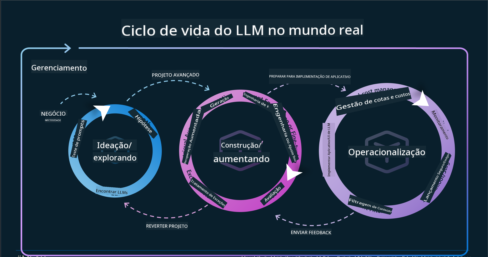
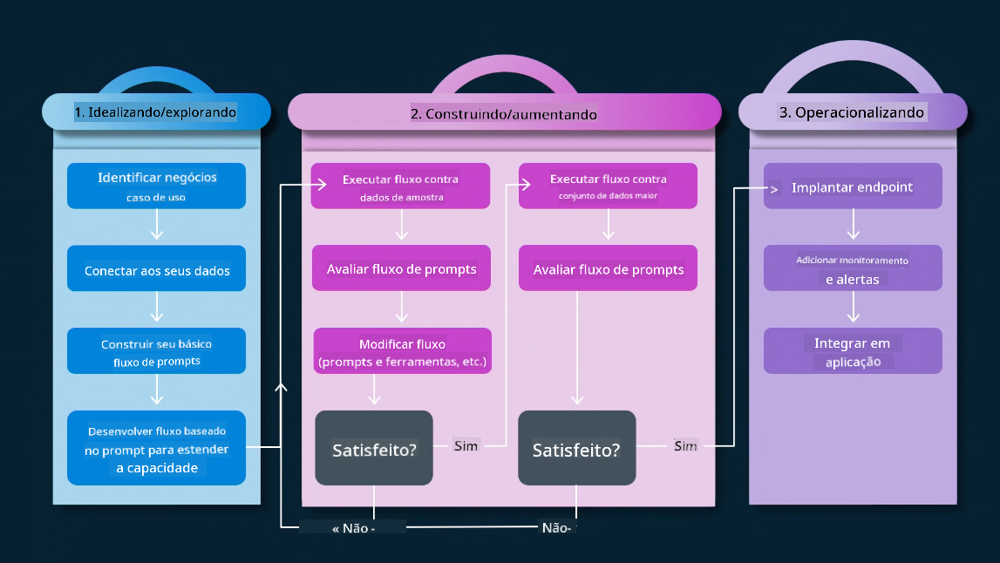
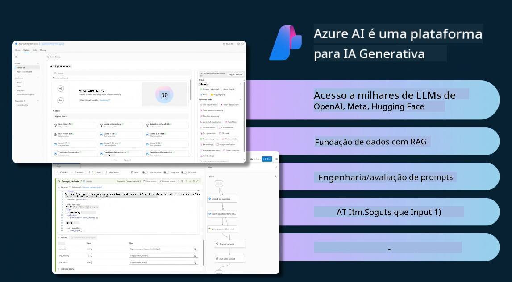
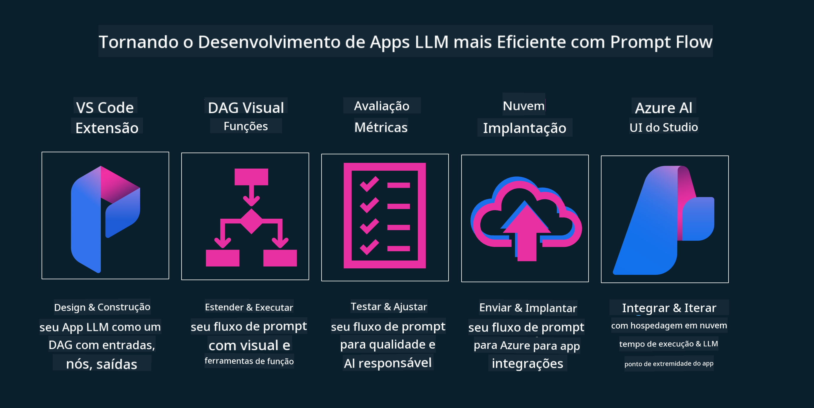

<!--
CO_OP_TRANSLATOR_METADATA:
{
  "original_hash": "27a5347a5022d5ef0a72ab029b03526a",
  "translation_date": "2025-05-19T23:26:06+00:00",
  "source_file": "14-the-generative-ai-application-lifecycle/README.md",
  "language_code": "br"
}
-->

# O Ciclo de Vida de Aplicações de IA Generativa

Uma pergunta importante para todas as aplicações de IA é a relevância das funcionalidades de IA, já que a IA é um campo em rápida evolução. Para garantir que sua aplicação continue relevante, confiável e robusta, é necessário monitorá-la, avaliá-la e melhorá-la continuamente. É aqui que entra o ciclo de vida da IA generativa.

O ciclo de vida da IA generativa é uma estrutura que orienta você através das etapas de desenvolvimento, implantação e manutenção de uma aplicação de IA generativa. Ele ajuda a definir seus objetivos, medir seu desempenho, identificar seus desafios e implementar suas soluções. Também ajuda a alinhar sua aplicação com os padrões éticos e legais do seu domínio e seus stakeholders. Ao seguir o ciclo de vida da IA generativa, você pode garantir que sua aplicação esteja sempre entregando valor e satisfazendo seus usuários.

## Introdução

Neste capítulo, você irá:

- Entender a Mudança de Paradigma de MLOps para LLMOps
- O Ciclo de Vida do LLM
- Ferramentas do Ciclo de Vida
- Metrificação e Avaliação do Ciclo de Vida

## Entender a Mudança de Paradigma de MLOps para LLMOps

LLMs são uma nova ferramenta no arsenal da Inteligência Artificial, incrivelmente poderosos em tarefas de análise e geração para aplicações. No entanto, esse poder traz algumas consequências sobre como simplificamos tarefas de IA e Aprendizado de Máquina Clássico.

Com isso, precisamos de um novo Paradigma para adaptar essa ferramenta de forma dinâmica, com os incentivos corretos. Podemos categorizar aplicativos de IA mais antigos como "ML Apps" e aplicativos de IA mais novos como "GenAI Apps" ou apenas "AI Apps", refletindo a tecnologia e técnicas predominantes na época. Isso muda nossa narrativa de várias maneiras, veja a comparação a seguir.

Observe que em LLMOps, estamos mais focados nos Desenvolvedores de Aplicações, usando integrações como ponto chave, utilizando "Modelos-como-um-Serviço" e pensando nos seguintes pontos para métricas.

- Qualidade: Qualidade da resposta
- Dano: IA Responsável
- Honestidade: Fundamentação da resposta (Faz sentido? Está correta?)
- Custo: Orçamento da Solução
- Latência: Tempo médio para resposta do token

## O Ciclo de Vida do LLM

Primeiro, para entender o ciclo de vida e as modificações, vamos observar o próximo infográfico.

Como você pode notar, isso é diferente dos Ciclos de Vida usuais do MLOps. LLMs têm muitos novos requisitos, como Prompting, diferentes técnicas para melhorar a qualidade (Fine-Tuning, RAG, Meta-Prompts), diferentes avaliações e responsabilidade com IA responsável e, por último, novas métricas de avaliação (Qualidade, Dano, Honestidade, Custo e Latência).

Por exemplo, veja como ideamos. Usando engenharia de prompts para experimentar com vários LLMs para explorar possibilidades e testar se suas Hipóteses poderiam estar corretas.

Observe que isso não é linear, mas sim loops integrados, iterativos e com um ciclo abrangente.

Como poderíamos explorar essas etapas? Vamos detalhar como poderíamos construir um ciclo de vida.

Isso pode parecer um pouco complicado, vamos focar nos três grandes passos primeiro.

1. Ideação/Exploração: Exploração, aqui podemos explorar de acordo com nossas necessidades de negócios. Prototipagem, criando um [PromptFlow](https://microsoft.github.io/promptflow/index.html?WT.mc_id=academic-105485-koreyst) e testando se é eficiente o suficiente para nossa Hipótese.
2. Construção/Aumento: Implementação, agora, começamos a avaliar para conjuntos de dados maiores, implementando técnicas como Fine-tuning e RAG, para verificar a robustez da nossa solução. Se não for, reimplementá-la, adicionando novos passos em nosso fluxo ou reestruturando os dados, pode ajudar. Após testar nosso fluxo e nossa escala, se funcionar e verificarmos nossas Métricas, está pronto para o próximo passo.
3. Operacionalização: Integração, agora adicionando Sistemas de Monitoramento e Alertas ao nosso sistema, implantação e integração de aplicação à nossa Aplicação.

Então, temos o ciclo abrangente de Gestão, focando em segurança, conformidade e governança.

Parabéns, agora você tem sua Aplicação de IA pronta para uso e operacional. Para uma experiência prática, dê uma olhada no [Demo do Contoso Chat.](https://nitya.github.io/contoso-chat/?WT.mc_id=academic-105485-koreys)

Agora, quais ferramentas podemos usar?

## Ferramentas do Ciclo de Vida

Para Ferramentas, a Microsoft fornece a [Plataforma Azure AI](https://azure.microsoft.com/solutions/ai/?WT.mc_id=academic-105485-koreys) e o [PromptFlow](https://microsoft.github.io/promptflow/index.html?WT.mc_id=academic-105485-koreyst) para facilitar e tornar seu ciclo fácil de implementar e pronto para uso.

A [Plataforma Azure AI](https://azure.microsoft.com/solutions/ai/?WT.mc_id=academic-105485-koreys), permite que você use o [AI Studio](https://ai.azure.com/?WT.mc_id=academic-105485-koreys). O AI Studio é um portal web que permite explorar modelos, amostras e ferramentas. Gerenciando seus recursos, fluxos de desenvolvimento de UI e opções de SDK/CLI para desenvolvimento Code-First.

Azure AI, permite que você use múltiplos recursos, para gerenciar suas operações, serviços, projetos, busca vetorial e necessidades de bancos de dados.

Construa, desde Prova de Conceito (POC) até aplicações em larga escala com PromptFlow:

- Projete e Construa apps a partir do VS Code, com ferramentas visuais e funcionais
- Teste e ajuste seus apps para qualidade de IA, com facilidade.
- Use o Azure AI Studio para Integrar e Iterar com a nuvem, Publicar e Implantar para integração rápida.

## Ótimo! Continue seu Aprendizado!

Incrível, agora aprenda mais sobre como estruturamos uma aplicação para usar os conceitos com o [App Contoso Chat](https://nitya.github.io/contoso-chat/?WT.mc_id=academic-105485-koreyst), para verificar como a Cloud Advocacy adiciona esses conceitos em demonstrações. Para mais conteúdo, confira nossa [sessão breakout do Ignite!
](https://www.youtube.com/watch?v=DdOylyrTOWg)

Agora, confira a Aula 15, para entender como [Geração Aumentada por Recuperação e Bancos de Dados Vetoriais](../15-rag-and-vector-databases/README.md?WT.mc_id=academic-105485-koreyst) impactam a IA Generativa e tornam as Aplicações mais envolventes!

**Aviso Legal**:  
Este documento foi traduzido usando o serviço de tradução por IA [Co-op Translator](https://github.com/Azure/co-op-translator). Embora nos esforcemos para garantir a precisão, esteja ciente de que traduções automatizadas podem conter erros ou imprecisões. O documento original em seu idioma nativo deve ser considerado a fonte autorizada. Para informações críticas, recomenda-se a tradução profissional humana. Não nos responsabilizamos por quaisquer mal-entendidos ou interpretações incorretas decorrentes do uso desta tradução.