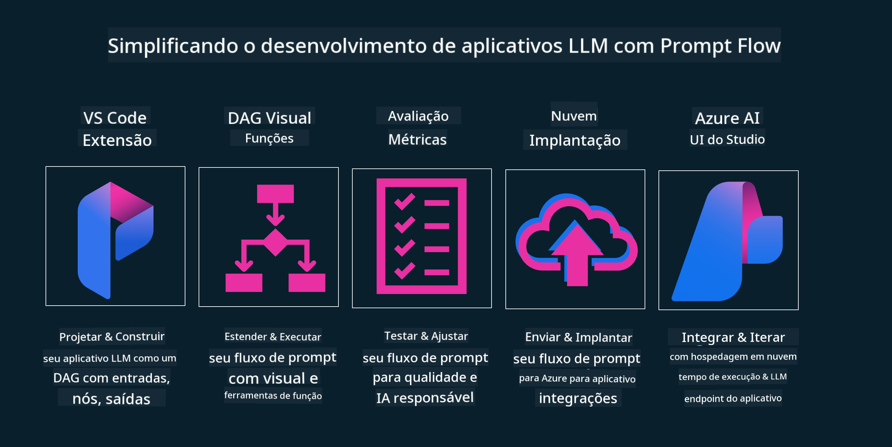

<!--
CO_OP_TRANSLATOR_METADATA:
{
  "original_hash": "27a5347a5022d5ef0a72ab029b03526a",
  "translation_date": "2025-07-09T15:52:17+00:00",
  "source_file": "14-the-generative-ai-application-lifecycle/README.md",
  "language_code": "br"
}
-->

# O Ciclo de Vida de Aplicações de IA Generativa

Uma questão importante para todas as aplicações de IA é a relevância dos recursos de IA, já que a IA é um campo em rápida evolução. Para garantir que sua aplicação continue relevante, confiável e robusta, é necessário monitorá-la, avaliá-la e aprimorá-la continuamente. É aí que entra o ciclo de vida da IA generativa.

O ciclo de vida da IA generativa é um framework que orienta você pelas etapas de desenvolvimento, implantação e manutenção de uma aplicação de IA generativa. Ele ajuda a definir seus objetivos, medir seu desempenho, identificar desafios e implementar soluções. Também auxilia a alinhar sua aplicação com os padrões éticos e legais do seu domínio e dos seus stakeholders. Seguindo o ciclo de vida da IA generativa, você garante que sua aplicação esteja sempre entregando valor e satisfazendo seus usuários.

## Introdução

Neste capítulo, você irá:

- Entender a mudança de paradigma de MLOps para LLMOps
- O ciclo de vida do LLM
- Ferramentas para o ciclo de vida
- Métricas e avaliação do ciclo de vida

## Entenda a mudança de paradigma de MLOps para LLMOps

LLMs são uma nova ferramenta no arsenal da Inteligência Artificial, extremamente poderosos em tarefas de análise e geração para aplicações. No entanto, esse poder traz algumas consequências na forma como otimizamos tarefas de IA e Machine Learning clássico.

Por isso, precisamos de um novo paradigma para adaptar essa ferramenta de forma dinâmica, com os incentivos corretos. Podemos categorizar as aplicações antigas de IA como "ML Apps" e as mais recentes como "GenAI Apps" ou simplesmente "AI Apps", refletindo a tecnologia e técnicas predominantes na época. Isso muda nossa narrativa de várias formas, veja a comparação a seguir.

Note que em LLMOps, o foco está mais nos desenvolvedores de aplicações, usando integrações como ponto-chave, adotando "Modelos como Serviço" e considerando os seguintes pontos para métricas:

- Qualidade: Qualidade da resposta
- Dano: IA responsável
- Honestidade: Fundamentação da resposta (Faz sentido? Está correta?)
- Custo: Orçamento da solução
- Latência: Tempo médio para resposta por token

## O ciclo de vida do LLM

Primeiro, para entender o ciclo de vida e suas modificações, observe o infográfico a seguir.

Como você pode notar, isso é diferente dos ciclos de vida tradicionais do MLOps. LLMs têm muitos novos requisitos, como Prompting, técnicas diversas para melhorar a qualidade (Fine-Tuning, RAG, Meta-Prompts), diferentes formas de avaliação e responsabilidade com IA responsável, e por fim, novas métricas de avaliação (Qualidade, Dano, Honestidade, Custo e Latência).

Por exemplo, veja como fazemos a ideação. Usamos engenharia de prompts para experimentar com vários LLMs e explorar possibilidades para testar se nossa hipótese pode estar correta.

Note que isso não é linear, mas sim ciclos integrados, iterativos e com um ciclo geral abrangente.

Como podemos explorar essas etapas? Vamos detalhar como construir um ciclo de vida.

Isso pode parecer um pouco complicado, vamos focar primeiro nos três grandes passos.

1. Ideação/Exploração: Exploração, aqui podemos explorar conforme as necessidades do negócio. Prototipar, criar um [PromptFlow](https://microsoft.github.io/promptflow/index.html?WT.mc_id=academic-105485-koreyst) e testar se é eficiente para nossa hipótese.
1. Construção/Aprimoramento: Implementação, agora começamos a avaliar com conjuntos de dados maiores, aplicando técnicas como Fine-tuning e RAG para verificar a robustez da solução. Se não funcionar, reimplementar, adicionar novos passos no fluxo ou reestruturar os dados pode ajudar. Após testar o fluxo e a escala, se funcionar e as métricas estiverem dentro do esperado, está pronto para o próximo passo.
1. Operacionalização: Integração, agora adicionando sistemas de monitoramento e alertas, implantação e integração da aplicação.

Depois, temos o ciclo geral de Gestão, focado em segurança, conformidade e governança.

Parabéns, agora sua aplicação de IA está pronta e operacional. Para uma experiência prática, confira a [Demonstração do Contoso Chat.](https://nitya.github.io/contoso-chat/?WT.mc_id=academic-105485-koreys)

Agora, quais ferramentas podemos usar?

## Ferramentas para o ciclo de vida

Para ferramentas, a Microsoft oferece a [Azure AI Platform](https://azure.microsoft.com/solutions/ai/?WT.mc_id=academic-105485-koreys) e o [PromptFlow](https://microsoft.github.io/promptflow/index.html?WT.mc_id=academic-105485-koreyst), que facilitam e tornam seu ciclo fácil de implementar e pronto para uso.

A [Azure AI Platform](https://azure.microsoft.com/solutions/ai/?WT.mc_id=academic-105485-koreys) permite usar o [AI Studio](https://ai.azure.com/?WT.mc_id=academic-105485-koreys). O AI Studio é um portal web que permite explorar modelos, exemplos e ferramentas. Gerenciar seus recursos, fluxos de desenvolvimento UI e opções SDK/CLI para desenvolvimento orientado a código.

O Azure AI permite usar múltiplos recursos para gerenciar suas operações, serviços, projetos, buscas vetoriais e necessidades de banco de dados.

Construa, desde Prova de Conceito (POC) até aplicações em larga escala com PromptFlow:

- Projete e construa apps a partir do VS Code, com ferramentas visuais e funcionais
- Teste e ajuste suas aplicações para uma IA de qualidade, com facilidade.
- Use o Azure AI Studio para integrar e iterar com a nuvem, publicar e implantar para integração rápida.

## Ótimo! Continue seu aprendizado!

Incrível, agora aprenda mais sobre como estruturamos uma aplicação para usar esses conceitos com o [Contoso Chat App](https://nitya.github.io/contoso-chat/?WT.mc_id=academic-105485-koreyst), para ver como o Cloud Advocacy aplica esses conceitos em demonstrações. Para mais conteúdo, confira nossa [sessão breakout do Ignite!](https://www.youtube.com/watch?v=DdOylyrTOWg)

Agora, confira a Lição 15 para entender como [Retrieval Augmented Generation e Bancos de Dados Vetoriais](../15-rag-and-vector-databases/README.md?WT.mc_id=academic-105485-koreyst) impactam a IA Generativa e tornam as aplicações mais envolventes!

**Aviso Legal**:  
Este documento foi traduzido utilizando o serviço de tradução por IA [Co-op Translator](https://github.com/Azure/co-op-translator). Embora nos esforcemos para garantir a precisão, esteja ciente de que traduções automáticas podem conter erros ou imprecisões. O documento original em seu idioma nativo deve ser considerado a fonte autorizada. Para informações críticas, recomenda-se tradução profissional humana. Não nos responsabilizamos por quaisquer mal-entendidos ou interpretações incorretas decorrentes do uso desta tradução.