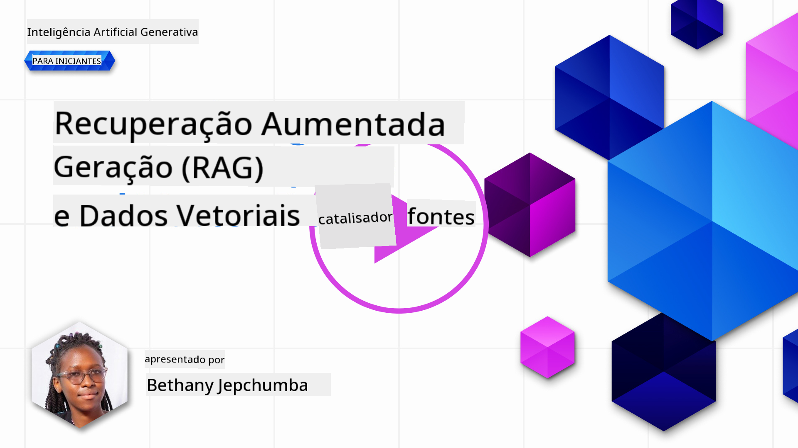
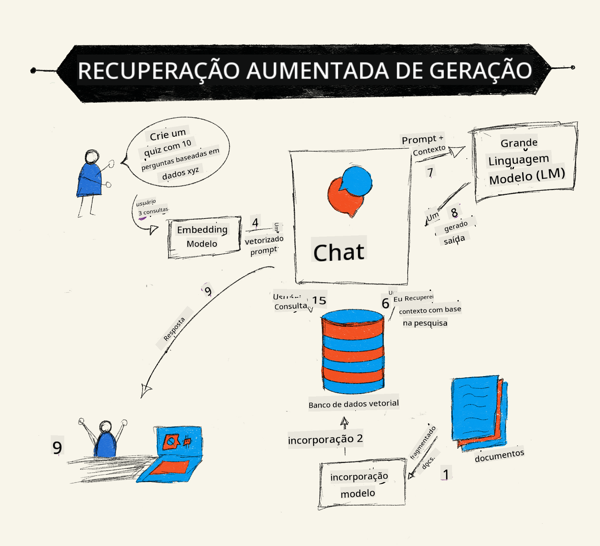
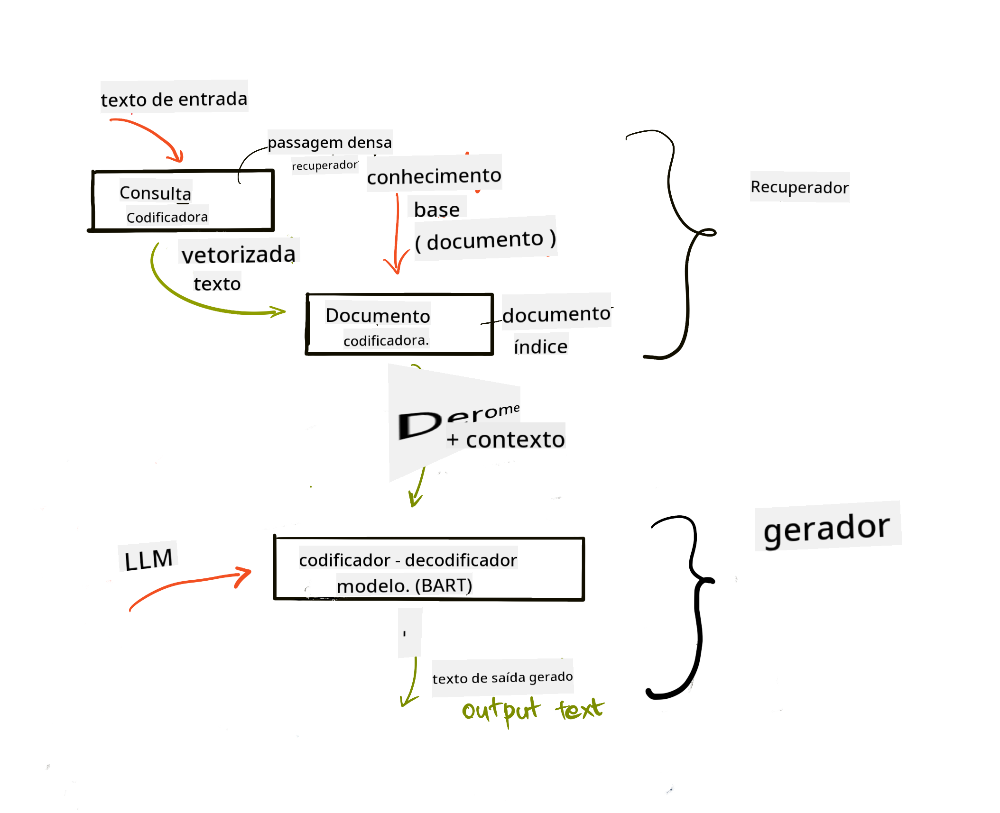
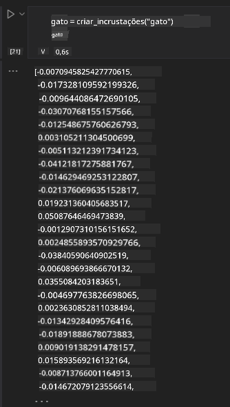

<!--
CO_OP_TRANSLATOR_METADATA:
{
  "original_hash": "e2861bbca91c0567ef32bc77fe054f9e",
  "translation_date": "2025-07-09T16:10:55+00:00",
  "source_file": "15-rag-and-vector-databases/README.md",
  "language_code": "br"
}
-->
# Retrieval Augmented Generation (RAG) e Bancos de Dados Vetoriais

[](https://aka.ms/gen-ai-lesson15-gh?WT.mc_id=academic-105485-koreyst)

Na lição sobre aplicações de busca, aprendemos brevemente como integrar seus próprios dados em Large Language Models (LLMs). Nesta lição, vamos aprofundar os conceitos de fundamentar seus dados na aplicação LLM, a mecânica do processo e os métodos para armazenar dados, incluindo embeddings e texto.

> **Vídeo em breve**

## Introdução

Nesta lição, abordaremos o seguinte:

- Uma introdução ao RAG, o que é e por que é usado em IA (inteligência artificial).

- Entender o que são bancos de dados vetoriais e criar um para nossa aplicação.

- Um exemplo prático de como integrar RAG em uma aplicação.

## Objetivos de Aprendizagem

Após concluir esta lição, você será capaz de:

- Explicar a importância do RAG na recuperação e processamento de dados.

- Configurar uma aplicação RAG e fundamentar seus dados em um LLM.

- Integrar de forma eficaz RAG e Bancos de Dados Vetoriais em aplicações LLM.

## Nosso Cenário: aprimorando nossos LLMs com nossos próprios dados

Para esta lição, queremos adicionar nossas próprias anotações na startup de educação, permitindo que o chatbot obtenha mais informações sobre os diferentes assuntos. Usando as anotações que temos, os alunos poderão estudar melhor e entender os diferentes tópicos, facilitando a revisão para seus exames. Para criar nosso cenário, usaremos:

- `Azure OpenAI:` o LLM que usaremos para criar nosso chatbot

- `Lição AI para iniciantes sobre Redes Neurais:` esses serão os dados nos quais fundamentaremos nosso LLM

- `Azure AI Search` e `Azure Cosmos DB:` banco de dados vetorial para armazenar nossos dados e criar um índice de busca

Os usuários poderão criar quizzes práticos a partir de suas anotações, cartões de revisão e resumi-los em visões gerais concisas. Para começar, vamos entender o que é RAG e como funciona:

## Retrieval Augmented Generation (RAG)

Um chatbot alimentado por LLM processa prompts dos usuários para gerar respostas. Ele é projetado para ser interativo e engajar os usuários em uma ampla variedade de tópicos. No entanto, suas respostas são limitadas ao contexto fornecido e aos dados de treinamento fundamentais. Por exemplo, o conhecimento do GPT-4 tem corte em setembro de 2021, ou seja, ele não possui informações sobre eventos ocorridos após esse período. Além disso, os dados usados para treinar LLMs excluem informações confidenciais, como anotações pessoais ou manuais de produtos de uma empresa.

### Como os RAGs (Retrieval Augmented Generation) funcionam



Suponha que você queira implantar um chatbot que cria quizzes a partir de suas anotações, será necessário uma conexão com a base de conhecimento. É aí que o RAG entra em ação. Os RAGs operam da seguinte forma:

- **Base de conhecimento:** Antes da recuperação, esses documentos precisam ser ingeridos e pré-processados, normalmente dividindo documentos grandes em pedaços menores, transformando-os em embeddings de texto e armazenando-os em um banco de dados.

- **Consulta do usuário:** o usuário faz uma pergunta

- **Recuperação:** Quando o usuário faz uma pergunta, o modelo de embedding recupera informações relevantes da base de conhecimento para fornecer mais contexto que será incorporado ao prompt.

- **Geração aumentada:** o LLM aprimora sua resposta com base nos dados recuperados. Isso permite que a resposta gerada não seja apenas baseada nos dados pré-treinados, mas também em informações relevantes do contexto adicionado. Os dados recuperados são usados para aumentar as respostas do LLM. O LLM então retorna uma resposta à pergunta do usuário.



A arquitetura dos RAGs é implementada usando transformers que consistem em duas partes: um encoder e um decoder. Por exemplo, quando um usuário faz uma pergunta, o texto de entrada é 'codificado' em vetores que capturam o significado das palavras, e os vetores são 'decodificados' em nosso índice de documentos, gerando um novo texto baseado na consulta do usuário. O LLM usa um modelo encoder-decoder para gerar a saída.

Existem duas abordagens para implementar RAG segundo o artigo proposto: [Retrieval-Augmented Generation for Knowledge intensive NLP Tasks](https://arxiv.org/pdf/2005.11401.pdf?WT.mc_id=academic-105485-koreyst):

- **_RAG-Sequence_** usa documentos recuperados para prever a melhor resposta possível para uma consulta do usuário

- **RAG-Token** usa documentos para gerar o próximo token, e então os recupera para responder à consulta do usuário

### Por que usar RAGs?

- **Riqueza de informação:** garante que as respostas em texto estejam atualizadas e atuais. Isso melhora o desempenho em tarefas específicas de domínio ao acessar a base de conhecimento interna.

- Reduz a fabricação de informações utilizando **dados verificáveis** na base de conhecimento para fornecer contexto às consultas dos usuários.

- É **econômico**, pois é mais barato do que ajustar finamente um LLM.

## Criando uma base de conhecimento

Nossa aplicação é baseada em nossos dados pessoais, ou seja, a lição de Redes Neurais do currículo AI For Beginners.

### Bancos de Dados Vetoriais

Um banco de dados vetorial, diferente dos bancos tradicionais, é um banco especializado em armazenar, gerenciar e buscar vetores embutidos. Ele armazena representações numéricas dos documentos. Quebrar os dados em embeddings numéricos facilita para nosso sistema de IA entender e processar os dados.

Armazenamos nossos embeddings em bancos de dados vetoriais porque os LLMs têm um limite no número de tokens que aceitam como entrada. Como não é possível passar todos os embeddings para um LLM, precisamos dividi-los em pedaços e, quando um usuário faz uma pergunta, os embeddings mais relacionados à pergunta são retornados junto com o prompt. Dividir em pedaços também reduz os custos relacionados ao número de tokens processados pelo LLM.

Alguns bancos de dados vetoriais populares incluem Azure Cosmos DB, Clarifyai, Pinecone, Chromadb, ScaNN, Qdrant e DeepLake. Você pode criar um modelo Azure Cosmos DB usando Azure CLI com o seguinte comando:

```bash
az login
az group create -n <resource-group-name> -l <location>
az cosmosdb create -n <cosmos-db-name> -r <resource-group-name>
az cosmosdb list-keys -n <cosmos-db-name> -g <resource-group-name>
```

### De texto para embeddings

Antes de armazenar nossos dados, precisamos convertê-los em embeddings vetoriais antes de guardá-los no banco. Se estiver trabalhando com documentos grandes ou textos longos, você pode dividi-los com base nas consultas que espera. A divisão pode ser feita em nível de sentença ou parágrafo. Como a divisão deriva significados das palavras ao redor, você pode adicionar algum contexto extra a um pedaço, por exemplo, incluindo o título do documento ou algum texto antes ou depois do trecho. Você pode dividir os dados da seguinte forma:

```python
def split_text(text, max_length, min_length):
    words = text.split()
    chunks = []
    current_chunk = []

    for word in words:
        current_chunk.append(word)
        if len(' '.join(current_chunk)) < max_length and len(' '.join(current_chunk)) > min_length:
            chunks.append(' '.join(current_chunk))
            current_chunk = []

    # If the last chunk didn't reach the minimum length, add it anyway
    if current_chunk:
        chunks.append(' '.join(current_chunk))

    return chunks
```

Depois de divididos, podemos então embutir nosso texto usando diferentes modelos de embedding. Alguns modelos que você pode usar incluem: word2vec, ada-002 da OpenAI, Azure Computer Vision e muitos outros. A escolha do modelo depende dos idiomas que você está usando, do tipo de conteúdo codificado (texto/imagens/áudio), do tamanho da entrada que pode codificar e do comprimento da saída do embedding.

Um exemplo de texto embutido usando o modelo `text-embedding-ada-002` da OpenAI é:


## Recuperação e Busca Vetorial

Quando um usuário faz uma pergunta, o recuperador a transforma em um vetor usando o codificador de consulta, então ele busca em nosso índice de documentos os vetores relevantes relacionados à entrada. Depois disso, converte tanto o vetor de entrada quanto os vetores dos documentos em texto e os passa para o LLM.

### Recuperação

A recuperação acontece quando o sistema tenta encontrar rapidamente os documentos no índice que atendem aos critérios de busca. O objetivo do recuperador é obter documentos que serão usados para fornecer contexto e fundamentar o LLM em seus dados.

Existem várias formas de realizar buscas em nosso banco de dados, como:

- **Busca por palavra-chave** - usada para buscas textuais

- **Busca semântica** - usa o significado semântico das palavras

- **Busca vetorial** - converte documentos de texto para representações vetoriais usando modelos de embedding. A recuperação é feita consultando os documentos cujas representações vetoriais estão mais próximas da pergunta do usuário.

- **Híbrida** - combinação de busca por palavra-chave e busca vetorial.

Um desafio na recuperação ocorre quando não há resposta similar à consulta no banco de dados; o sistema então retorna a melhor informação que conseguir. No entanto, você pode usar táticas como definir a distância máxima para relevância ou usar busca híbrida que combina palavra-chave e busca vetorial. Nesta lição, usaremos busca híbrida, uma combinação de busca vetorial e por palavra-chave. Armazenaremos nossos dados em um dataframe com colunas contendo os pedaços e os embeddings.

### Similaridade Vetorial

O recuperador busca no banco de conhecimento embeddings que estejam próximos, o vizinho mais próximo, pois são textos similares. No cenário em que um usuário faz uma consulta, ela é primeiro embutida e depois comparada com embeddings similares. A medida comum usada para encontrar o quão similares diferentes vetores são é a similaridade cosseno, que se baseia no ângulo entre dois vetores.

Podemos medir similaridade usando outras alternativas, como distância Euclidiana, que é a linha reta entre os pontos finais dos vetores, e produto escalar, que mede a soma dos produtos dos elementos correspondentes de dois vetores.

### Índice de busca

Ao realizar a recuperação, precisamos construir um índice de busca para nossa base de conhecimento antes de executar a busca. Um índice armazenará nossos embeddings e poderá recuperar rapidamente os pedaços mais similares, mesmo em um banco de dados grande. Podemos criar nosso índice localmente usando:

```python
from sklearn.neighbors import NearestNeighbors

embeddings = flattened_df['embeddings'].to_list()

# Create the search index
nbrs = NearestNeighbors(n_neighbors=5, algorithm='ball_tree').fit(embeddings)

# To query the index, you can use the kneighbors method
distances, indices = nbrs.kneighbors(embeddings)
```

### Reordenação

Depois de consultar o banco de dados, pode ser necessário ordenar os resultados do mais relevante para o menos relevante. Um LLM de reordenação utiliza Machine Learning para melhorar a relevância dos resultados de busca, ordenando-os do mais relevante para o menos relevante. Usando Azure AI Search, a reordenação é feita automaticamente para você usando um reordenador semântico. Um exemplo de como a reordenação funciona usando vizinhos mais próximos:

```python
# Find the most similar documents
distances, indices = nbrs.kneighbors([query_vector])

index = []
# Print the most similar documents
for i in range(3):
    index = indices[0][i]
    for index in indices[0]:
        print(flattened_df['chunks'].iloc[index])
        print(flattened_df['path'].iloc[index])
        print(flattened_df['distances'].iloc[index])
    else:
        print(f"Index {index} not found in DataFrame")
```

## Juntando tudo

O último passo é adicionar nosso LLM à mistura para conseguir respostas fundamentadas em nossos dados. Podemos implementá-lo da seguinte forma:

```python
user_input = "what is a perceptron?"

def chatbot(user_input):
    # Convert the question to a query vector
    query_vector = create_embeddings(user_input)

    # Find the most similar documents
    distances, indices = nbrs.kneighbors([query_vector])

    # add documents to query  to provide context
    history = []
    for index in indices[0]:
        history.append(flattened_df['chunks'].iloc[index])

    # combine the history and the user input
    history.append(user_input)

    # create a message object
    messages=[
        {"role": "system", "content": "You are an AI assistant that helps with AI questions."},
        {"role": "user", "content": history[-1]}
    ]

    # use chat completion to generate a response
    response = openai.chat.completions.create(
        model="gpt-4",
        temperature=0.7,
        max_tokens=800,
        messages=messages
    )

    return response.choices[0].message

chatbot(user_input)
```

## Avaliando nossa aplicação

### Métricas de Avaliação

- Qualidade das respostas fornecidas, garantindo que soem naturais, fluentes e humanas

- Fundamentação dos dados: avaliar se a resposta veio dos documentos fornecidos

- Relevância: avaliar se a resposta corresponde e está relacionada à pergunta feita

- Fluência - se a resposta faz sentido gramaticalmente

## Casos de Uso para RAG (Retrieval Augmented Generation) e bancos de dados vetoriais

Existem muitos casos de uso diferentes onde chamadas de função podem melhorar sua aplicação, como:

- Perguntas e Respostas: fundamentar os dados da sua empresa em um chat que pode ser usado por funcionários para fazer perguntas.

- Sistemas de Recomendação: onde você pode criar um sistema que combina os valores mais similares, por exemplo, filmes, restaurantes e muito mais.

- Serviços de chatbot: você pode armazenar o histórico de conversas e personalizar a conversa com base nos dados do usuário.

- Busca de imagens baseada em embeddings vetoriais, útil para reconhecimento de imagens e detecção de anomalias.

## Resumo

Cobrimos as áreas fundamentais do RAG, desde adicionar nossos dados à aplicação, a consulta do usuário e a saída. Para simplificar a criação de RAG, você pode usar frameworks como Semantic Kernel, Langchain ou Autogen.

## Tarefa

Para continuar seu aprendizado sobre Retrieval Augmented Generation (RAG), você pode construir:

- Desenvolver um front-end para a aplicação usando o framework de sua escolha

- Utilizar um framework, seja LangChain ou Semantic Kernel, e recriar sua aplicação.

Parabéns por concluir a lição 👏.

## O aprendizado não para aqui, continue a jornada

Após concluir esta lição, confira nossa [coleção de Aprendizado em IA Generativa](https://aka.ms/genai-collection?WT.mc_id=academic-105485-koreyst) para continuar aprimorando seu conhecimento em IA Generativa!

**Aviso Legal**:  
Este documento foi traduzido utilizando o serviço de tradução por IA [Co-op Translator](https://github.com/Azure/co-op-translator). Embora nos esforcemos para garantir a precisão, esteja ciente de que traduções automáticas podem conter erros ou imprecisões. O documento original em seu idioma nativo deve ser considerado a fonte autorizada. Para informações críticas, recomenda-se tradução profissional humana. Não nos responsabilizamos por quaisquer mal-entendidos ou interpretações incorretas decorrentes do uso desta tradução.