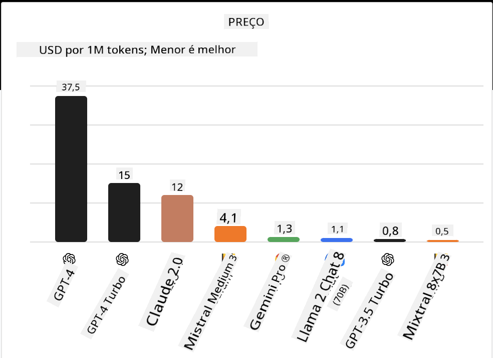
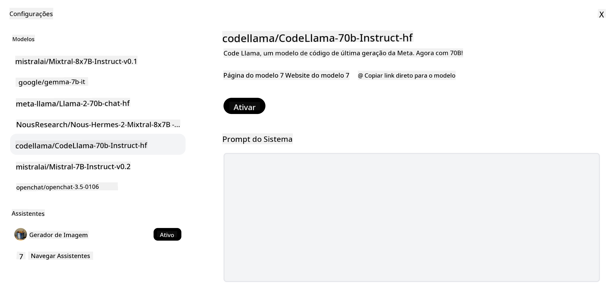
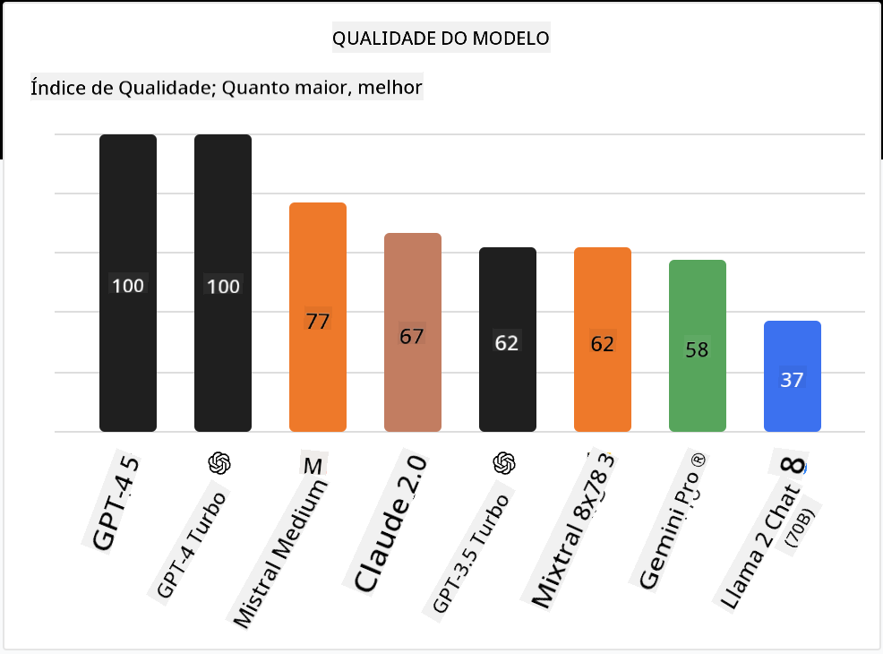

<!--
CO_OP_TRANSLATOR_METADATA:
{
  "original_hash": "0bba96e53ab841d99db731892a51fab8",
  "translation_date": "2025-07-09T17:08:42+00:00",
  "source_file": "16-open-source-models/README.md",
  "language_code": "br"
}
-->

## Introdução

O mundo dos LLMs open source é empolgante e está em constante evolução. Esta lição tem como objetivo oferecer uma visão aprofundada sobre modelos open source. Se você busca informações sobre como modelos proprietários se comparam aos modelos open source, acesse a [lição "Explorando e Comparando Diferentes LLMs"](../02-exploring-and-comparing-different-llms/README.md?WT.mc_id=academic-105485-koreyst). Esta lição também abordará o tema de fine-tuning, mas uma explicação mais detalhada pode ser encontrada na [lição "Fine-Tuning LLMs"](../18-fine-tuning/README.md?WT.mc_id=academic-105485-koreyst).

## Objetivos de aprendizado

- Compreender os modelos open source  
- Entender os benefícios de trabalhar com modelos open source  
- Explorar os modelos open disponíveis no Hugging Face e no Azure AI Studio  

## O que são Modelos Open Source?

O software open source desempenhou um papel fundamental no crescimento da tecnologia em diversas áreas. A Open Source Initiative (OSI) definiu [10 critérios para software](https://web.archive.org/web/20241126001143/https://opensource.org/osd?WT.mc_id=academic-105485-koreyst) ser classificado como open source. O código-fonte deve ser compartilhado abertamente sob uma licença aprovada pela OSI.

Embora o desenvolvimento de LLMs tenha elementos semelhantes ao desenvolvimento de software, o processo não é exatamente o mesmo. Isso gerou muita discussão na comunidade sobre a definição de open source no contexto dos LLMs. Para que um modelo esteja alinhado com a definição tradicional de open source, as seguintes informações devem estar publicamente disponíveis:

- Conjuntos de dados usados para treinar o modelo.  
- Pesos completos do modelo como parte do treinamento.  
- O código de avaliação.  
- O código de fine-tuning.  
- Pesos completos do modelo e métricas de treinamento.  

Atualmente, existem poucos modelos que atendem a esses critérios. O [modelo OLMo criado pelo Allen Institute for Artificial Intelligence (AllenAI)](https://huggingface.co/allenai/OLMo-7B?WT.mc_id=academic-105485-koreyst) é um que se encaixa nessa categoria.

Para esta lição, nos referiremos aos modelos como "modelos open" daqui para frente, pois eles podem não corresponder aos critérios acima no momento da escrita.

## Benefícios dos Modelos Open

**Altamente Personalizáveis** – Como os modelos open são lançados com informações detalhadas de treinamento, pesquisadores e desenvolvedores podem modificar a estrutura interna do modelo. Isso possibilita a criação de modelos altamente especializados, ajustados para uma tarefa ou área de estudo específica. Alguns exemplos são geração de código, operações matemáticas e biologia.

**Custo** – O custo por token para usar e implantar esses modelos é menor do que o dos modelos proprietários. Ao construir aplicações de IA Generativa, é importante avaliar o desempenho em relação ao preço ao trabalhar com esses modelos no seu caso de uso.

  
Fonte: Artificial Analysis

**Flexibilidade** – Trabalhar com modelos open permite maior flexibilidade para usar diferentes modelos ou combiná-los. Um exemplo disso são os [Assistentes HuggingChat](https://huggingface.co/chat?WT.mc_id=academic-105485-koreyst), onde o usuário pode selecionar o modelo utilizado diretamente na interface:

## Explorando Diferentes Modelos Open

### Llama 2

[LLama2](https://huggingface.co/meta-llama?WT.mc_id=academic-105485-koreyst), desenvolvido pela Meta, é um modelo open otimizado para aplicações baseadas em chat. Isso se deve ao seu método de fine-tuning, que incluiu uma grande quantidade de diálogos e feedback humano. Com esse método, o modelo gera resultados mais alinhados às expectativas humanas, proporcionando uma melhor experiência ao usuário.

Alguns exemplos de versões fine-tuned do Llama incluem o [Japanese Llama](https://huggingface.co/elyza/ELYZA-japanese-Llama-2-7b?WT.mc_id=academic-105485-koreyst), especializado em japonês, e o [Llama Pro](https://huggingface.co/TencentARC/LLaMA-Pro-8B?WT.mc_id=academic-105485-koreyst), que é uma versão aprimorada do modelo base.

### Mistral

[Mistral](https://huggingface.co/mistralai?WT.mc_id=academic-105485-koreyst) é um modelo open com forte foco em alta performance e eficiência. Ele utiliza a abordagem Mixture-of-Experts, que combina um grupo de modelos especialistas em um único sistema, onde, dependendo da entrada, certos modelos são selecionados para uso. Isso torna o processamento mais eficiente, pois os modelos lidam apenas com os inputs para os quais são especializados.

Alguns exemplos de versões fine-tuned do Mistral incluem o [BioMistral](https://huggingface.co/BioMistral/BioMistral-7B?text=Mon+nom+est+Thomas+et+mon+principal?WT.mc_id=academic-105485-koreyst), focado no domínio médico, e o [OpenMath Mistral](https://huggingface.co/nvidia/OpenMath-Mistral-7B-v0.1-hf?WT.mc_id=academic-105485-koreyst), que realiza cálculos matemáticos.

### Falcon

[Falcon](https://huggingface.co/tiiuae?WT.mc_id=academic-105485-koreyst) é um LLM criado pelo Technology Innovation Institute (**TII**). O Falcon-40B foi treinado com 40 bilhões de parâmetros e demonstrou desempenho superior ao GPT-3 com menor custo computacional. Isso se deve ao uso do algoritmo FlashAttention e da atenção multiquery, que reduzem os requisitos de memória durante a inferência. Com esse tempo de inferência reduzido, o Falcon-40B é adequado para aplicações de chat.

Alguns exemplos de versões fine-tuned do Falcon são o [OpenAssistant](https://huggingface.co/OpenAssistant/falcon-40b-sft-top1-560?WT.mc_id=academic-105485-koreyst), um assistente construído com modelos open, e o [GPT4ALL](https://huggingface.co/nomic-ai/gpt4all-falcon?WT.mc_id=academic-105485-koreyst), que oferece desempenho superior ao modelo base.

## Como Escolher

Não há uma resposta única para escolher um modelo open. Um bom ponto de partida é usar o recurso de filtro por tarefa do Azure AI Studio. Isso ajuda a entender para quais tipos de tarefas o modelo foi treinado. O Hugging Face também mantém um LLM Leaderboard que mostra os modelos com melhor desempenho com base em certas métricas.

Ao comparar LLMs entre diferentes tipos, o [Artificial Analysis](https://artificialanalysis.ai/?WT.mc_id=academic-105485-koreyst) é outro recurso excelente:

  
Fonte: Artificial Analysis

Se estiver trabalhando em um caso de uso específico, buscar versões fine-tuned focadas na mesma área pode ser eficaz. Experimentar múltiplos modelos open para ver como eles performam de acordo com suas expectativas e as dos seus usuários é outra boa prática.

## Próximos Passos

A melhor parte dos modelos open é que você pode começar a trabalhar com eles rapidamente. Confira o [Catálogo de Modelos do Azure AI Studio](https://ai.azure.com?WT.mc_id=academic-105485-koreyst), que apresenta uma coleção específica do Hugging Face com os modelos que discutimos aqui.

## O aprendizado não para por aqui, continue a jornada

Após concluir esta lição, confira nossa [coleção de Aprendizado em IA Generativa](https://aka.ms/genai-collection?WT.mc_id=academic-105485-koreyst) para continuar aprimorando seu conhecimento em IA Generativa!

**Aviso Legal**:  
Este documento foi traduzido utilizando o serviço de tradução por IA [Co-op Translator](https://github.com/Azure/co-op-translator). Embora nos esforcemos para garantir a precisão, esteja ciente de que traduções automáticas podem conter erros ou imprecisões. O documento original em seu idioma nativo deve ser considerado a fonte autorizada. Para informações críticas, recomenda-se tradução profissional humana. Não nos responsabilizamos por quaisquer mal-entendidos ou interpretações incorretas decorrentes do uso desta tradução.