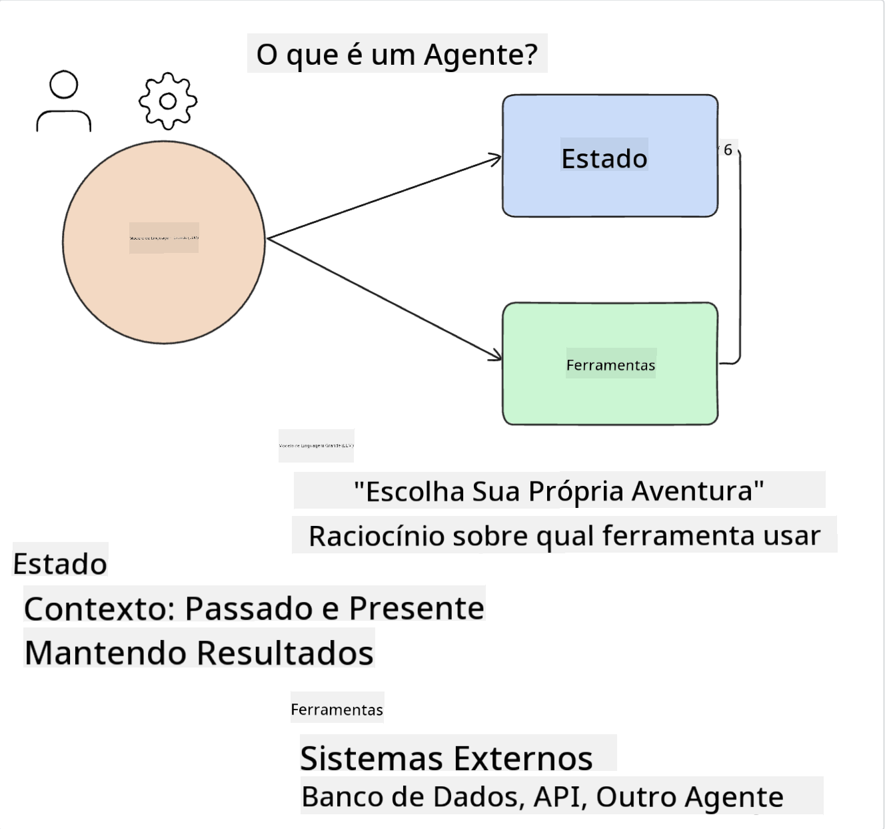
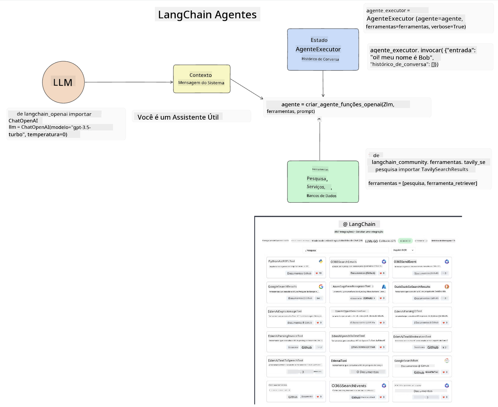
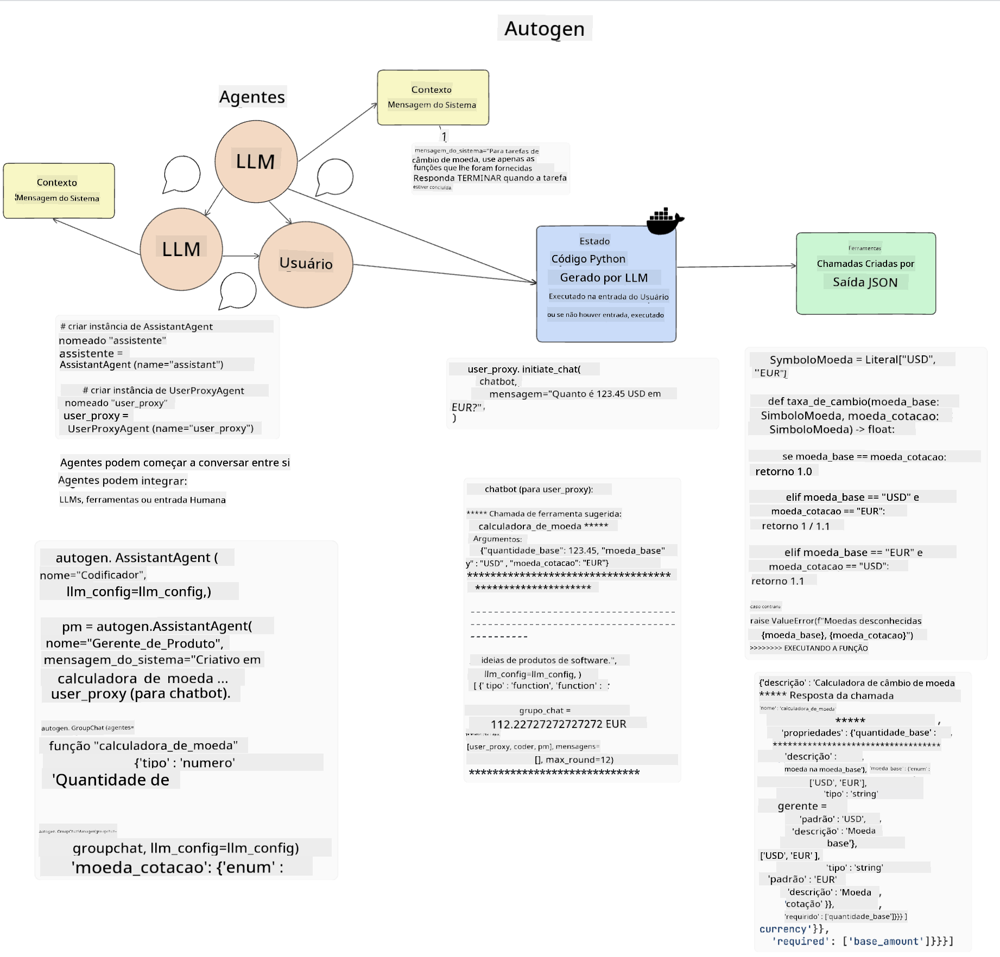
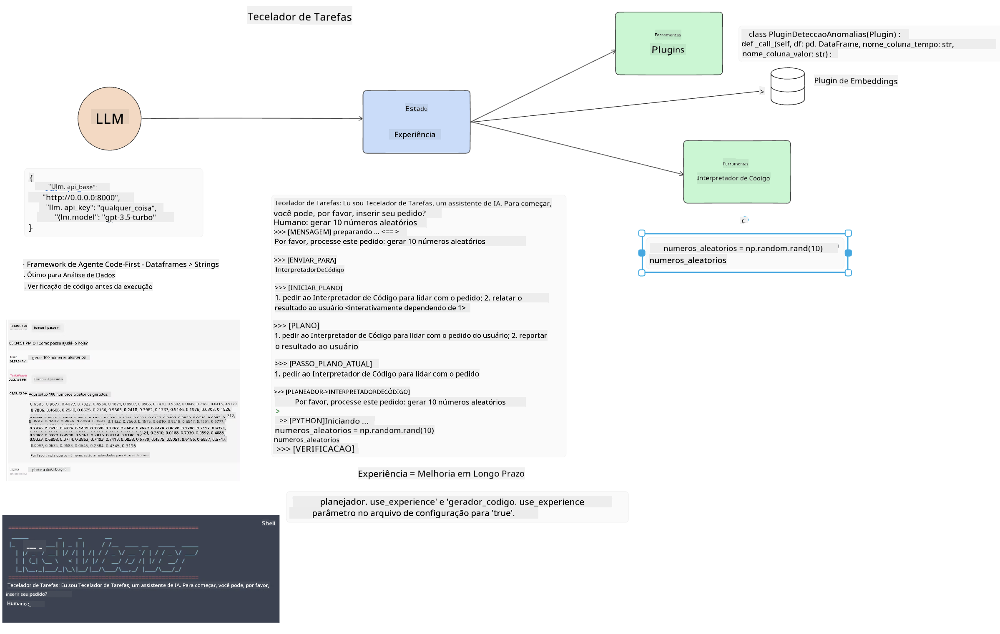
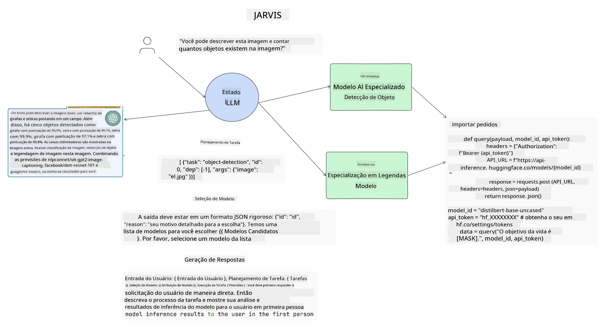

<!--
CO_OP_TRANSLATOR_METADATA:
{
  "original_hash": "11f03c81f190d9cbafd0f977dcbede6c",
  "translation_date": "2025-05-20T07:21:29+00:00",
  "source_file": "17-ai-agents/README.md",
  "language_code": "br"
}
-->
[](https://aka.ms/gen-ai-lesson17-gh?WT.mc_id=academic-105485-koreyst)

## Introdução

Agentes de IA representam um desenvolvimento empolgante na IA Generativa, permitindo que Modelos de Linguagem de Grande Escala (LLMs) evoluam de assistentes para agentes capazes de tomar ações. Frameworks de Agentes de IA permitem que desenvolvedores criem aplicações que dão aos LLMs acesso a ferramentas e gerenciamento de estado. Esses frameworks também aumentam a visibilidade, permitindo que usuários e desenvolvedores monitorem as ações planejadas pelos LLMs, melhorando assim o gerenciamento da experiência.

A lição cobrirá as seguintes áreas:

- Compreender o que é um Agente de IA - O que exatamente é um Agente de IA?
- Explorar quatro diferentes Frameworks de Agentes de IA - O que os torna únicos?
- Aplicar esses Agentes de IA a diferentes casos de uso - Quando devemos usar Agentes de IA?

## Objetivos de aprendizado

Após esta lição, você será capaz de:

- Explicar o que são Agentes de IA e como eles podem ser usados.
- Ter uma compreensão das diferenças entre alguns dos populares Frameworks de Agentes de IA, e como eles diferem.
- Entender como os Agentes de IA funcionam para construir aplicações com eles.

## O que são Agentes de IA?

Agentes de IA são um campo muito empolgante no mundo da IA Generativa. Com essa empolgação vem, às vezes, uma confusão de termos e sua aplicação. Para manter as coisas simples e inclusivas da maioria das ferramentas que se referem a Agentes de IA, vamos usar esta definição:

Agentes de IA permitem que Modelos de Linguagem de Grande Escala (LLMs) realizem tarefas dando-lhes acesso a um **estado** e **ferramentas**.



Vamos definir esses termos:

**Modelos de Linguagem de Grande Escala** - Estes são os modelos referidos ao longo deste curso, como GPT-3.5, GPT-4, Llama-2, etc.

**Estado** - Refere-se ao contexto em que o LLM está operando. O LLM usa o contexto de suas ações passadas e o contexto atual, orientando sua tomada de decisões para ações subsequentes. Frameworks de Agentes de IA permitem que os desenvolvedores mantenham esse contexto mais facilmente.

**Ferramentas** - Para completar a tarefa que o usuário solicitou e que o LLM planejou, o LLM precisa de acesso a ferramentas. Alguns exemplos de ferramentas podem ser um banco de dados, uma API, um aplicativo externo ou até mesmo outro LLM!

Essas definições devem lhe dar uma boa base à medida que exploramos como são implementadas. Vamos explorar alguns frameworks diferentes de Agentes de IA:

## Agentes LangChain

[Agentes LangChain](https://python.langchain.com/docs/how_to/#agents?WT.mc_id=academic-105485-koreyst) é uma implementação das definições que fornecemos acima.

Para gerenciar o **estado**, ele usa uma função interna chamada `AgentExecutor`. Isso aceita o `agent` definido e as `tools` que estão disponíveis para ele.

O `Agent Executor` também armazena o histórico do chat para fornecer o contexto da conversa.



LangChain oferece um [catálogo de ferramentas](https://integrations.langchain.com/tools?WT.mc_id=academic-105485-koreyst) que podem ser importadas para sua aplicação nas quais o LLM pode ter acesso. Essas são feitas pela comunidade e pela equipe LangChain.

Você pode então definir essas ferramentas e passá-las para o `Agent Executor`.

Visibilidade é outro aspecto importante ao falar sobre Agentes de IA. É importante para desenvolvedores de aplicativos entenderem qual ferramenta o LLM está usando e por quê. Para isso, a equipe da LangChain desenvolveu o LangSmith.

## AutoGen

O próximo framework de Agentes de IA que discutiremos é o [AutoGen](https://microsoft.github.io/autogen/?WT.mc_id=academic-105485-koreyst). O foco principal do AutoGen são as conversas. Agentes são tanto **conversáveis** quanto **customizáveis**.

**Conversáveis -** LLMs podem iniciar e continuar uma conversa com outro LLM para completar uma tarefa. Isso é feito criando `AssistantAgents` e dando-lhes uma mensagem de sistema específica.

```python

autogen.AssistantAgent( name="Coder", llm_config=llm_config, ) pm = autogen.AssistantAgent( name="Product_manager", system_message="Creative in software product ideas.", llm_config=llm_config, )

```

**Customizáveis** - Agentes podem ser definidos não apenas como LLMs, mas como um usuário ou uma ferramenta. Como desenvolvedor, você pode definir um `UserProxyAgent` que é responsável por interagir com o usuário para feedback na conclusão de uma tarefa. Esse feedback pode continuar a execução da tarefa ou pará-la.

```python
user_proxy = UserProxyAgent(name="user_proxy")
```

### Estado e Ferramentas

Para alterar e gerenciar o estado, um Agente assistente gera código Python para completar a tarefa.

Aqui está um exemplo do processo:



#### LLM Definido com uma Mensagem de Sistema

```python
system_message="For weather related tasks, only use the functions you have been provided with. Reply TERMINATE when the task is done."
```

Essas mensagens de sistema direcionam esse LLM específico para quais funções são relevantes para sua tarefa. Lembre-se, com o AutoGen você pode ter vários AssistantAgents definidos com diferentes mensagens de sistema.

#### Chat Iniciado pelo Usuário

```python
user_proxy.initiate_chat( chatbot, message="I am planning a trip to NYC next week, can you help me pick out what to wear? ", )

```

Esta mensagem do user_proxy (Humano) é o que iniciará o processo do Agente para explorar as possíveis funções que ele deve executar.

#### Função é Executada

```bash
chatbot (to user_proxy):

***** Suggested tool Call: get_weather ***** Arguments: {"location":"New York City, NY","time_periond:"7","temperature_unit":"Celsius"} ******************************************************** --------------------------------------------------------------------------------

>>>>>>>> EXECUTING FUNCTION get_weather... user_proxy (to chatbot): ***** Response from calling function "get_weather" ***** 112.22727272727272 EUR ****************************************************************

```

Uma vez que o chat inicial é processado, o Agente enviará a ferramenta sugerida para chamar. Neste caso, é uma função chamada `get_weather`. Depending on your configuration, this function can be automatically executed and read by the Agent or can be executed based on user input.

You can find a list of [AutoGen code samples](https://microsoft.github.io/autogen/docs/Examples/?WT.mc_id=academic-105485-koreyst) to further explore how to get started building.

## Taskweaver

The next agent framework we will explore is [Taskweaver](https://microsoft.github.io/TaskWeaver/?WT.mc_id=academic-105485-koreyst). It is known as a "code-first" agent because instead of working strictly with `strings` , it can work with DataFrames in Python. This becomes extremely useful for data analysis and generation tasks. This can be things like creating graphs and charts or generating random numbers.

### State and Tools

To manage the state of the conversation, TaskWeaver uses the concept of a `Planner`. The `Planner` is a LLM that takes the request from the users and maps out the tasks that need to be completed to fulfill this request.

To complete the tasks the `Planner` is exposed to the collection of tools called `Plugins`. Isso pode ser classes Python ou um interpretador de código geral. Esses plugins são armazenados como embeddings para que o LLM possa buscar melhor o plugin correto.



Aqui está um exemplo de um plugin para lidar com detecção de anomalias:

```python
class AnomalyDetectionPlugin(Plugin): def __call__(self, df: pd.DataFrame, time_col_name: str, value_col_name: str):
```

O código é verificado antes de ser executado. Outra característica para gerenciar contexto no Taskweaver é `experience`. Experience allows for the context of a conversation to be stored over to the long term in a YAML file. This can be configured so that the LLM improves over time on certain tasks given that it is exposed to prior conversations.

## JARVIS

The last agent framework we will explore is [JARVIS](https://github.com/microsoft/JARVIS?tab=readme-ov-file?WT.mc_id=academic-105485-koreyst). What makes JARVIS unique is that it uses an LLM to manage the `state` da conversa e o `tools` são outros modelos de IA. Cada um dos modelos de IA são modelos especializados que realizam certas tarefas, como detecção de objetos, transcrição ou legenda de imagens.



O LLM, sendo um modelo de propósito geral, recebe a solicitação do usuário e identifica a tarefa específica e quaisquer argumentos/dados necessários para completar a tarefa.

```python
[{"task": "object-detection", "id": 0, "dep": [-1], "args": {"image": "e1.jpg" }}]
```

O LLM então formata a solicitação de uma maneira que o modelo de IA especializado possa interpretar, como JSON. Uma vez que o modelo de IA retorna sua previsão com base na tarefa, o LLM recebe a resposta.

Se múltiplos modelos forem necessários para completar a tarefa, ele também interpretará a resposta desses modelos antes de reuni-los para gerar a resposta ao usuário.

O exemplo abaixo mostra como isso funcionaria quando um usuário solicita uma descrição e contagem dos objetos em uma imagem:

## Tarefa

Para continuar seu aprendizado sobre Agentes de IA, você pode construir com o AutoGen:

- Uma aplicação que simula uma reunião de negócios com diferentes departamentos de uma startup de educação.
- Criar mensagens de sistema que guiem os LLMs na compreensão de diferentes personas e prioridades, e permitam que o usuário apresente uma nova ideia de produto.
- O LLM deve então gerar perguntas de acompanhamento de cada departamento para refinar e melhorar a apresentação e a ideia do produto.

## O aprendizado não para aqui, continue a Jornada

Após completar esta lição, confira nossa [coleção de Aprendizado de IA Generativa](https://aka.ms/genai-collection?WT.mc_id=academic-105485-koreyst) para continuar aprimorando seu conhecimento em IA Generativa!

**Aviso Legal**:  
Este documento foi traduzido usando o serviço de tradução por IA [Co-op Translator](https://github.com/Azure/co-op-translator). Embora nos esforcemos para garantir a precisão, esteja ciente de que traduções automáticas podem conter erros ou imprecisões. O documento original em seu idioma nativo deve ser considerado a fonte autoritária. Para informações críticas, recomenda-se a tradução humana profissional. Não nos responsabilizamos por quaisquer mal-entendidos ou interpretações incorretas decorrentes do uso desta tradução.