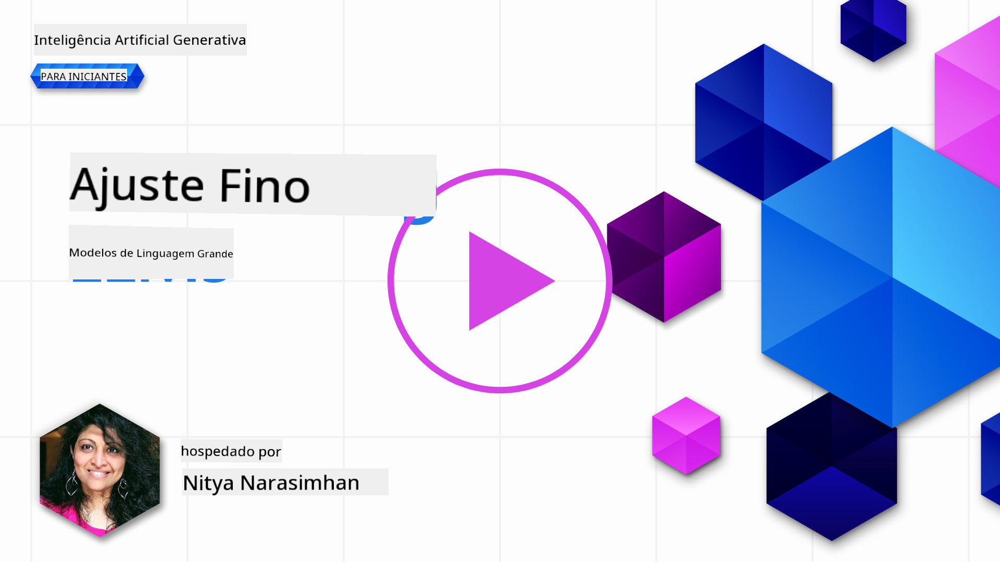

<!--
CO_OP_TRANSLATOR_METADATA:
{
  "original_hash": "68664f7e754a892ae1d8d5e2b7bd2081",
  "translation_date": "2025-05-20T07:45:40+00:00",
  "source_file": "18-fine-tuning/README.md",
  "language_code": "br"
}
-->

# Ajustando Seu LLM

Usar modelos de linguagem grandes para construir aplicações de IA generativa traz novos desafios. Uma questão chave é garantir a qualidade das respostas (precisão e relevância) no conteúdo gerado pelo modelo para uma solicitação do usuário. Em lições anteriores, discutimos técnicas como engenharia de prompt e geração aumentada por recuperação que tentam resolver o problema _modificando a entrada do prompt_ para o modelo existente.

Na lição de hoje, discutimos uma terceira técnica, **ajuste fino**, que tenta resolver o desafio _re-treinando o próprio modelo_ com dados adicionais. Vamos nos aprofundar nos detalhes.

## Objetivos de Aprendizagem

Esta lição introduz o conceito de ajuste fino para modelos de linguagem pré-treinados, explora os benefícios e desafios dessa abordagem e fornece orientações sobre quando e como usar o ajuste fino para melhorar o desempenho dos seus modelos de IA generativa.

Ao final desta lição, você deve ser capaz de responder às seguintes perguntas:

- O que é ajuste fino para modelos de linguagem?
- Quando, e por que, o ajuste fino é útil?
- Como posso ajustar um modelo pré-treinado?
- Quais são as limitações do ajuste fino?

Pronto? Vamos começar.

## Guia Ilustrado

Quer ter uma visão geral do que vamos abordar antes de mergulhar? Confira este guia ilustrado que descreve a jornada de aprendizado para esta lição - desde aprender os conceitos principais e a motivação para o ajuste fino, até entender o processo e as melhores práticas para executar a tarefa de ajuste fino. Este é um tópico fascinante para exploração, então não se esqueça de conferir a página de [Recursos](./RESOURCES.md?WT.mc_id=academic-105485-koreyst) para links adicionais que apoiarão sua jornada de aprendizado autodirigida!

## O que é ajuste fino para modelos de linguagem?

Por definição, modelos de linguagem grandes são _pré-treinados_ em grandes quantidades de texto provenientes de fontes diversas, incluindo a internet. Como aprendemos em lições anteriores, precisamos de técnicas como _engenharia de prompt_ e _geração aumentada por recuperação_ para melhorar a qualidade das respostas do modelo às perguntas dos usuários ("prompts").

Uma técnica popular de engenharia de prompt envolve dar ao modelo mais orientação sobre o que é esperado na resposta, seja fornecendo _instruções_ (orientação explícita) ou _dando alguns exemplos_ (orientação implícita). Isso é chamado de _aprendizado com poucos exemplos_, mas tem duas limitações:

- Limites de tokens do modelo podem restringir o número de exemplos que você pode dar e limitar a eficácia.
- Custos de tokens do modelo podem tornar caro adicionar exemplos a cada prompt, limitando a flexibilidade.

O ajuste fino é uma prática comum em sistemas de aprendizado de máquina, onde pegamos um modelo pré-treinado e o re-treinamos com novos dados para melhorar seu desempenho em uma tarefa específica. No contexto de modelos de linguagem, podemos ajustar o modelo pré-treinado _com um conjunto selecionado de exemplos para uma tarefa ou domínio de aplicação específicos_ para criar um **modelo personalizado** que pode ser mais preciso e relevante para essa tarefa ou domínio específico. Um benefício adicional do ajuste fino é que ele também pode reduzir o número de exemplos necessários para o aprendizado com poucos exemplos - reduzindo o uso de tokens e os custos relacionados.

## Quando e por que devemos ajustar modelos?

Neste contexto, quando falamos sobre ajuste fino, estamos nos referindo ao ajuste fino **supervisionado**, onde o re-treinamento é feito **adicionando novos dados** que não faziam parte do conjunto de dados original de treinamento. Isso é diferente de uma abordagem de ajuste fino não supervisionada, onde o modelo é re-treinado nos dados originais, mas com diferentes hiperparâmetros.

A coisa mais importante a lembrar é que o ajuste fino é uma técnica avançada que requer um certo nível de expertise para obter os resultados desejados. Se feito incorretamente, pode não fornecer as melhorias esperadas e até mesmo degradar o desempenho do modelo para o seu domínio alvo.

Então, antes de aprender "como" ajustar modelos de linguagem, você precisa saber "por que" deve seguir esse caminho e "quando" iniciar o processo de ajuste fino. Comece fazendo a si mesmo estas perguntas:

- **Caso de Uso**: Qual é o seu _caso de uso_ para o ajuste fino? Qual aspecto do modelo pré-treinado atual você deseja melhorar?
- **Alternativas**: Você tentou _outras técnicas_ para alcançar os resultados desejados? Use-as para criar uma linha de base para comparação.
  - Engenharia de prompt: Experimente técnicas como prompting com poucos exemplos com exemplos de respostas de prompt relevantes. Avalie a qualidade das respostas.
  - Geração Aumentada por Recuperação: Tente aumentar os prompts com resultados de consultas recuperados pesquisando seus dados. Avalie a qualidade das respostas.
- **Custos**: Você identificou os custos para o ajuste fino?
  - Ajustabilidade - o modelo pré-treinado está disponível para ajuste fino?
  - Esforço - para preparar dados de treinamento, avaliar e refinar o modelo.
  - Computação - para executar trabalhos de ajuste fino e implantar o modelo ajustado
  - Dados - acesso a exemplos de qualidade suficiente para impacto do ajuste fino
- **Benefícios**: Você confirmou os benefícios do ajuste fino?
  - Qualidade - o modelo ajustado superou a linha de base?
  - Custo - reduz o uso de tokens simplificando prompts?
  - Extensibilidade - você pode reutilizar o modelo base para novos domínios?

Ao responder a essas perguntas, você deve ser capaz de decidir se o ajuste fino é a abordagem certa para o seu caso de uso. Idealmente, a abordagem é válida apenas se os benefícios superarem os custos. Uma vez que você decida prosseguir, é hora de pensar em _como_ você pode ajustar o modelo pré-treinado.

Quer obter mais insights sobre o processo de tomada de decisão? Assista [Ajustar ou não ajustar](https://www.youtube.com/watch?v=0Jo-z-MFxJs)

## Como podemos ajustar um modelo pré-treinado?

Para ajustar um modelo pré-treinado, você precisa ter:

- um modelo pré-treinado para ajustar
- um conjunto de dados para usar no ajuste fino
- um ambiente de treinamento para executar o trabalho de ajuste fino
- um ambiente de hospedagem para implantar o modelo ajustado

## Ajuste Fino em Ação

Os recursos a seguir fornecem tutoriais passo a passo para guiá-lo através de um exemplo real usando um modelo selecionado com um conjunto de dados curado. Para trabalhar nesses tutoriais, você precisa de uma conta no provedor específico, juntamente com acesso ao modelo e conjuntos de dados relevantes.

| Provedor     | Tutorial                                                                                                                                                                       | Descrição                                                                                                                                                                                                                                                                                                                                                                                                                        |
| ------------ | ------------------------------------------------------------------------------------------------------------------------------------------------------------------------------ | ---------------------------------------------------------------------------------------------------------------------------------------------------------------------------------------------------------------------------------------------------------------------------------------------------------------------------------------------------------------------------------------------------------------------------------- |
| OpenAI       | [Como ajustar modelos de chat](https://github.com/openai/openai-cookbook/blob/main/examples/How_to_finetune_chat_models.ipynb?WT.mc_id=academic-105485-koreyst)                | Aprenda a ajustar um `gpt-35-turbo` para um domínio específico ("assistente de receitas") preparando dados de treinamento, executando o trabalho de ajuste fino e usando o modelo ajustado para inferência.                                                                                                                                                                                                                                              |
| Azure OpenAI | [Tutorial de ajuste fino do GPT 3.5 Turbo](https://learn.microsoft.com/azure/ai-services/openai/tutorials/fine-tune?tabs=python-new%2Ccommand-line?WT.mc_id=academic-105485-koreyst) | Aprenda a ajustar um modelo `gpt-35-turbo-0613` **no Azure** tomando medidas para criar e fazer upload de dados de treinamento, executar o trabalho de ajuste fino. Implante e use o novo modelo.                                                                                                                                                                                                                                                                 |
| Hugging Face | [Ajustando LLMs com Hugging Face](https://www.philschmid.de/fine-tune-llms-in-2024-with-trl?WT.mc_id=academic-105485-koreyst)                                               | Este post no blog guia você pelo ajuste fino de um _LLM aberto_ (ex: `CodeLlama 7B`) usando a biblioteca [transformers](https://huggingface.co/docs/transformers/index?WT.mc_id=academic-105485-koreyst) & [Aprendizado por Reforço com Transformers (TRL)](https://huggingface.co/docs/trl/index?WT.mc_id=academic-105485-koreyst]) com [datasets abertos](https://huggingface.co/docs/datasets/index?WT.mc_id=academic-105485-koreyst) no Hugging Face. |
|              |                                                                                                                                                                                |                                                                                                                                                                                                                                                                                                                                                                                                                                    |
| 🤗 AutoTrain | [Ajustando LLMs com AutoTrain](https://github.com/huggingface/autotrain-advanced/?WT.mc_id=academic-105485-koreyst)                                                         | AutoTrain (ou AutoTrain Advanced) é uma biblioteca python desenvolvida pela Hugging Face que permite o ajuste fino para muitas tarefas diferentes, incluindo ajuste fino de LLM. AutoTrain é uma solução sem código e o ajuste fino pode ser feito em sua própria nuvem, no Hugging Face Spaces ou localmente. Ele suporta uma interface gráfica baseada na web, CLI e treinamento via arquivos de configuração yaml.                                                                               |
|              |                                                                                                                                                                                |                                                                                                                                                                                                                                                                                                                                                                                                                                    |

## Tarefa

Selecione um dos tutoriais acima e percorra-os. _Podemos replicar uma versão desses tutoriais em Jupyter Notebooks neste repositório apenas para referência. Use as fontes originais diretamente para obter as versões mais recentes_.

## Ótimo Trabalho! Continue Seu Aprendizado.

Após completar esta lição, confira nossa [coleção de Aprendizado de IA Generativa](https://aka.ms/genai-collection?WT.mc_id=academic-105485-koreyst) para continuar aprimorando seu conhecimento em IA Generativa!

Parabéns!! Você completou a lição final da série v2 deste curso! Não pare de aprender e construir. **Confira a página de [RECURSOS](RESOURCES.md?WT.mc_id=academic-105485-koreyst) para uma lista de sugestões adicionais apenas para este tópico.

Nossa série de lições v1 também foi atualizada com mais tarefas e conceitos. Então, reserve um minuto para refrescar seu conhecimento - e por favor [compartilhe suas perguntas e feedback](https://github.com/microsoft/generative-ai-for-beginners/issues?WT.mc_id=academic-105485-koreyst) para nos ajudar a melhorar essas lições para a comunidade.

**Aviso Legal**:  
Este documento foi traduzido utilizando o serviço de tradução por IA [Co-op Translator](https://github.com/Azure/co-op-translator). Embora nos esforcemos para alcançar precisão, esteja ciente de que traduções automatizadas podem conter erros ou imprecisões. O documento original em seu idioma nativo deve ser considerado a fonte autoritária. Para informações críticas, recomenda-se a tradução profissional humana. Não nos responsabilizamos por quaisquer mal-entendidos ou interpretações errôneas decorrentes do uso desta tradução.