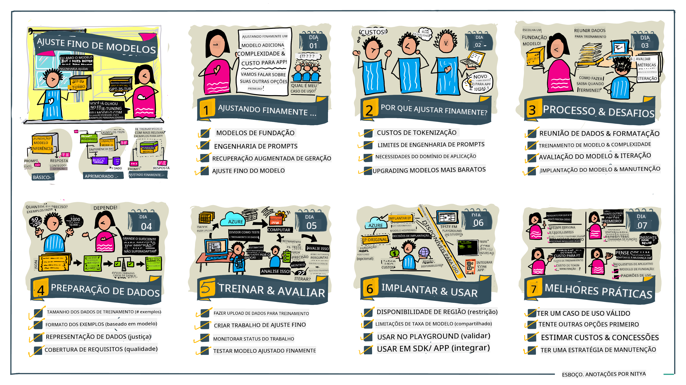

<!--
CO_OP_TRANSLATOR_METADATA:
{
  "original_hash": "68664f7e754a892ae1d8d5e2b7bd2081",
  "translation_date": "2025-07-09T17:41:32+00:00",
  "source_file": "18-fine-tuning/README.md",
  "language_code": "br"
}
-->

# Ajustando Seu LLM

Usar grandes modelos de linguagem para construir aplicações de IA generativa traz novos desafios. Uma questão fundamental é garantir a qualidade das respostas (precisão e relevância) no conteúdo gerado pelo modelo para uma determinada solicitação do usuário. Nas lições anteriores, discutimos técnicas como engenharia de prompt e geração aumentada por recuperação, que tentam resolver o problema _modificando a entrada do prompt_ para o modelo existente.

Na lição de hoje, vamos falar sobre uma terceira técnica, o **fine-tuning**, que busca resolver o desafio _re-treinando o próprio modelo_ com dados adicionais. Vamos aos detalhes.

## Objetivos de Aprendizagem

Esta lição apresenta o conceito de fine-tuning para modelos de linguagem pré-treinados, explora os benefícios e desafios dessa abordagem, e oferece orientações sobre quando e como usar o fine-tuning para melhorar o desempenho dos seus modelos de IA generativa.

Ao final desta lição, você deverá ser capaz de responder às seguintes perguntas:

- O que é fine-tuning para modelos de linguagem?
- Quando e por que o fine-tuning é útil?
- Como posso fazer fine-tuning em um modelo pré-treinado?
- Quais são as limitações do fine-tuning?

Pronto? Vamos começar.

## Guia Ilustrado

Quer ter uma visão geral do que vamos abordar antes de mergulhar no conteúdo? Confira este guia ilustrado que descreve a jornada de aprendizado desta lição — desde os conceitos principais e a motivação para o fine-tuning, até o entendimento do processo e das melhores práticas para executar essa tarefa. Este é um tema fascinante para explorar, então não esqueça de visitar a página de [Recursos](./RESOURCES.md?WT.mc_id=academic-105485-koreyst) para links adicionais que apoiem sua jornada de aprendizado autodirigida!

## O que é fine-tuning para modelos de linguagem?

Por definição, grandes modelos de linguagem são _pré-treinados_ com grandes quantidades de texto provenientes de diversas fontes, incluindo a internet. Como aprendemos nas lições anteriores, precisamos de técnicas como _engenharia de prompt_ e _geração aumentada por recuperação_ para melhorar a qualidade das respostas do modelo às perguntas do usuário ("prompts").

Uma técnica popular de engenharia de prompt envolve dar ao modelo mais orientações sobre o que se espera na resposta, seja fornecendo _instruções_ (orientação explícita) ou _dando alguns exemplos_ (orientação implícita). Isso é chamado de _few-shot learning_, mas tem duas limitações:

- Os limites de tokens do modelo podem restringir o número de exemplos que você pode fornecer, limitando a eficácia.
- O custo dos tokens pode tornar caro adicionar exemplos a cada prompt, limitando a flexibilidade.

Fine-tuning é uma prática comum em sistemas de machine learning onde pegamos um modelo pré-treinado e o re-treinamos com novos dados para melhorar seu desempenho em uma tarefa específica. No contexto de modelos de linguagem, podemos fazer fine-tuning no modelo pré-treinado _com um conjunto selecionado de exemplos para uma tarefa ou domínio específico_ para criar um **modelo personalizado** que pode ser mais preciso e relevante para essa tarefa ou domínio. Um benefício adicional do fine-tuning é que ele pode reduzir o número de exemplos necessários para o few-shot learning — diminuindo o uso de tokens e os custos relacionados.

## Quando e por que devemos fazer fine-tuning em modelos?

Neste _contexto_, quando falamos de fine-tuning, estamos nos referindo ao fine-tuning **supervisionado**, onde o re-treinamento é feito **adicionando novos dados** que não faziam parte do conjunto de dados original. Isso é diferente do fine-tuning não supervisionado, onde o modelo é re-treinado nos dados originais, mas com hiperparâmetros diferentes.

O ponto principal a lembrar é que fine-tuning é uma técnica avançada que requer um certo nível de expertise para alcançar os resultados desejados. Se feito incorretamente, pode não trazer as melhorias esperadas e até prejudicar o desempenho do modelo para o domínio alvo.

Então, antes de aprender "como" fazer fine-tuning em modelos de linguagem, você precisa saber "por que" deve seguir esse caminho e "quando" iniciar o processo. Comece se perguntando:

- **Caso de Uso**: Qual é o seu _caso de uso_ para o fine-tuning? Qual aspecto do modelo pré-treinado atual você quer melhorar?
- **Alternativas**: Você já tentou _outras técnicas_ para alcançar os resultados desejados? Use-as para criar uma linha de base para comparação.
  - Engenharia de prompt: Experimente técnicas como few-shot prompting com exemplos de respostas relevantes. Avalie a qualidade das respostas.
  - Geração Aumentada por Recuperação: Tente aumentar os prompts com resultados de consultas recuperadas ao buscar em seus dados. Avalie a qualidade das respostas.
- **Custos**: Você identificou os custos do fine-tuning?
  - Tunabilidade — o modelo pré-treinado está disponível para fine-tuning?
  - Esforço — para preparar os dados de treinamento, avaliar e refinar o modelo.
  - Computação — para executar os trabalhos de fine-tuning e implantar o modelo ajustado.
  - Dados — acesso a exemplos de qualidade suficiente para impacto do fine-tuning.
- **Benefícios**: Você confirmou os benefícios do fine-tuning?
  - Qualidade — o modelo ajustado superou a linha de base?
  - Custo — ele reduz o uso de tokens simplificando os prompts?
  - Extensibilidade — você pode reaproveitar o modelo base para novos domínios?

Respondendo a essas perguntas, você deve conseguir decidir se o fine-tuning é a abordagem certa para seu caso de uso. Idealmente, a abordagem é válida somente se os benefícios superarem os custos. Uma vez decidido seguir em frente, é hora de pensar em _como_ fazer fine-tuning no modelo pré-treinado.

Quer mais insights sobre o processo de decisão? Assista [To fine-tune or not to fine-tune](https://www.youtube.com/watch?v=0Jo-z-MFxJs)

## Como podemos fazer fine-tuning em um modelo pré-treinado?

Para fazer fine-tuning em um modelo pré-treinado, você precisa ter:

- um modelo pré-treinado para ajustar
- um conjunto de dados para usar no fine-tuning
- um ambiente de treinamento para executar o trabalho de fine-tuning
- um ambiente de hospedagem para implantar o modelo ajustado

## Fine-Tuning na Prática

Os recursos a seguir oferecem tutoriais passo a passo para guiá-lo em um exemplo real usando um modelo selecionado com um conjunto de dados curado. Para seguir esses tutoriais, você precisa de uma conta no provedor específico, além de acesso ao modelo e aos conjuntos de dados relevantes.

| Provedor    | Tutorial                                                                                                                                                                       | Descrição                                                                                                                                                                                                                                                                                                                                                                                                                        |
| ----------- | ------------------------------------------------------------------------------------------------------------------------------------------------------------------------------ | -------------------------------------------------------------------------------------------------------------------------------------------------------------------------------------------------------------------------------------------------------------------------------------------------------------------------------------------------------------------------------------------------------------------------------- |
| OpenAI      | [Como fazer fine-tuning em modelos de chat](https://github.com/openai/openai-cookbook/blob/main/examples/How_to_finetune_chat_models.ipynb?WT.mc_id=academic-105485-koreyst)    | Aprenda a fazer fine-tuning em um `gpt-35-turbo` para um domínio específico ("assistente de receitas") preparando os dados de treinamento, executando o trabalho de fine-tuning e usando o modelo ajustado para inferência.                                                                                                                                                                                                       |
| Azure OpenAI| [Tutorial de fine-tuning GPT 3.5 Turbo](https://learn.microsoft.com/azure/ai-services/openai/tutorials/fine-tune?tabs=python-new%2Ccommand-line?WT.mc_id=academic-105485-koreyst) | Aprenda a fazer fine-tuning em um modelo `gpt-35-turbo-0613` **no Azure** seguindo os passos para criar e enviar os dados de treinamento, executar o trabalho de fine-tuning, implantar e usar o novo modelo.                                                                                                                                                                                                                      |
| Hugging Face| [Fine-tuning de LLMs com Hugging Face](https://www.philschmid.de/fine-tune-llms-in-2024-with-trl?WT.mc_id=academic-105485-koreyst)                                           | Este post no blog mostra como fazer fine-tuning em um _LLM aberto_ (ex: `CodeLlama 7B`) usando a biblioteca [transformers](https://huggingface.co/docs/transformers/index?WT.mc_id=academic-105485-koreyst) e o [Transformer Reinforcement Learning (TRL)](https://huggingface.co/docs/trl/index?WT.mc_id=academic-105485-koreyst) com [datasets](https://huggingface.co/docs/datasets/index?WT.mc_id=academic-105485-koreyst) abertos no Hugging Face. |
|             |                                                                                                                                                                                |                                                                                                                                                                                                                                                                                                                                                                                                                                  |
| 🤗 AutoTrain| [Fine-tuning de LLMs com AutoTrain](https://github.com/huggingface/autotrain-advanced/?WT.mc_id=academic-105485-koreyst)                                                     | AutoTrain (ou AutoTrain Advanced) é uma biblioteca Python desenvolvida pela Hugging Face que permite fine-tuning para várias tarefas, incluindo ajuste fino de LLMs. AutoTrain é uma solução sem código e o fine-tuning pode ser feito na sua própria nuvem, no Hugging Face Spaces ou localmente. Suporta interface web, CLI e treinamento via arquivos de configuração yaml.                                                                                 |
|             |                                                                                                                                                                                |                                                                                                                                                                                                                                                                                                                                                                                                                                  |

## Exercício

Escolha um dos tutoriais acima e siga-o. _Podemos replicar uma versão desses tutoriais em Jupyter Notebooks neste repositório apenas para referência. Por favor, use as fontes originais diretamente para obter as versões mais recentes_.

## Excelente trabalho! Continue seu aprendizado.

Após concluir esta lição, confira nossa [coleção de Aprendizado em IA Generativa](https://aka.ms/genai-collection?WT.mc_id=academic-105485-koreyst) para continuar aprimorando seu conhecimento em IA Generativa!

Parabéns!! Você completou a última lição da série v2 deste curso! Não pare de aprender e construir. \*\*Confira a página de [RECURSOS](RESOURCES.md?WT.mc_id=academic-105485-koreyst) para uma lista de sugestões adicionais só sobre este tema.

Nossa série v1 de lições também foi atualizada com mais exercícios e conceitos. Então, reserve um minuto para atualizar seu conhecimento — e por favor, [compartilhe suas dúvidas e feedback](https://github.com/microsoft/generative-ai-for-beginners/issues?WT.mc_id=academic-105485-koreyst) para nos ajudar a melhorar essas lições para a comunidade.

**Aviso Legal**:  
Este documento foi traduzido utilizando o serviço de tradução por IA [Co-op Translator](https://github.com/Azure/co-op-translator). Embora nos esforcemos para garantir a precisão, esteja ciente de que traduções automáticas podem conter erros ou imprecisões. O documento original em seu idioma nativo deve ser considerado a fonte autorizada. Para informações críticas, recomenda-se tradução profissional humana. Não nos responsabilizamos por quaisquer mal-entendidos ou interpretações incorretas decorrentes do uso desta tradução.