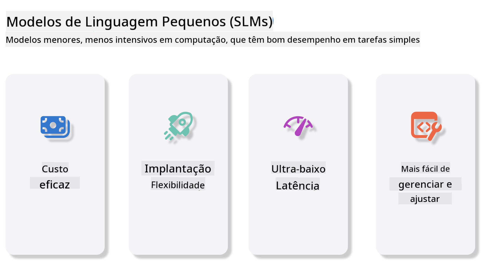
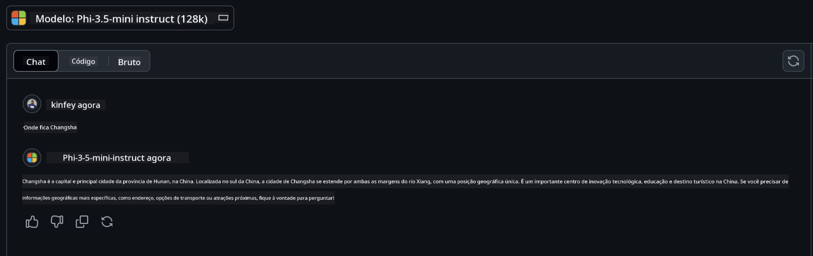

<!--
CO_OP_TRANSLATOR_METADATA:
{
  "original_hash": "124ad36cfe96f74038811b6e2bb93e9d",
  "translation_date": "2025-07-09T18:30:42+00:00",
  "source_file": "19-slm/README.md",
  "language_code": "br"
}
-->
# Introdução aos Pequenos Modelos de Linguagem para IA Generativa para Iniciantes  
A IA generativa é um campo fascinante da inteligência artificial que se concentra na criação de sistemas capazes de gerar novos conteúdos. Esses conteúdos podem variar desde texto e imagens até música e até ambientes virtuais completos. Uma das aplicações mais empolgantes da IA generativa está no âmbito dos modelos de linguagem.

## O que são Pequenos Modelos de Linguagem?  

Um Pequeno Modelo de Linguagem (SLM) representa uma variante reduzida de um grande modelo de linguagem (LLM), aproveitando muitos dos princípios arquitetônicos e técnicas dos LLMs, mas com uma pegada computacional significativamente menor.

SLMs são um subconjunto de modelos de linguagem projetados para gerar texto semelhante ao humano. Diferentemente de seus equivalentes maiores, como o GPT-4, os SLMs são mais compactos e eficientes, tornando-os ideais para aplicações onde os recursos computacionais são limitados. Apesar do tamanho menor, eles ainda podem realizar uma variedade de tarefas. Normalmente, os SLMs são construídos por meio da compressão ou destilação de LLMs, buscando manter uma parte substancial da funcionalidade e das capacidades linguísticas do modelo original. Essa redução no tamanho do modelo diminui a complexidade geral, tornando os SLMs mais eficientes tanto em uso de memória quanto em requisitos computacionais. Apesar dessas otimizações, os SLMs ainda conseguem executar uma ampla gama de tarefas de processamento de linguagem natural (NLP):

- Geração de Texto: Criar sentenças ou parágrafos coerentes e contextualmente relevantes.  
- Completação de Texto: Prever e completar sentenças com base em um prompt dado.  
- Tradução: Converter texto de um idioma para outro.  
- Resumo: Condensar textos longos em resumos mais curtos e fáceis de entender.  

Embora com algumas concessões em desempenho ou profundidade de entendimento em comparação com seus equivalentes maiores.

## Como Funcionam os Pequenos Modelos de Linguagem?  
Os SLMs são treinados com grandes quantidades de dados textuais. Durante o treinamento, eles aprendem os padrões e estruturas da linguagem, permitindo gerar textos que são gramaticalmente corretos e contextualmente apropriados. O processo de treinamento envolve:

- Coleta de Dados: Reunir grandes conjuntos de dados textuais de diversas fontes.  
- Pré-processamento: Limpar e organizar os dados para torná-los adequados ao treinamento.  
- Treinamento: Usar algoritmos de aprendizado de máquina para ensinar o modelo a entender e gerar texto.  
- Ajuste Fino: Ajustar o modelo para melhorar seu desempenho em tarefas específicas.  

O desenvolvimento dos SLMs está alinhado com a crescente necessidade de modelos que possam ser implantados em ambientes com recursos limitados, como dispositivos móveis ou plataformas de computação de borda, onde LLMs completos podem ser impraticáveis devido à alta demanda por recursos. Ao focar na eficiência, os SLMs equilibram desempenho e acessibilidade, permitindo uma aplicação mais ampla em diversos domínios.



## Objetivos de Aprendizagem  

Nesta lição, esperamos apresentar o conhecimento sobre SLM e combiná-lo com o Microsoft Phi-3 para explorar diferentes cenários em conteúdo textual, visão e MoE.

Ao final desta lição, você deverá ser capaz de responder às seguintes perguntas:

- O que é SLM  
- Qual a diferença entre SLM e LLM  
- O que é a Família Microsoft Phi-3/3.5  
- Como realizar inferência com a Família Microsoft Phi-3/3.5  

Pronto? Vamos começar.

## As Diferenças entre Grandes Modelos de Linguagem (LLMs) e Pequenos Modelos de Linguagem (SLMs)  

Tanto LLMs quanto SLMs são construídos com base em princípios fundamentais de aprendizado de máquina probabilístico, seguindo abordagens semelhantes em seu design arquitetônico, metodologias de treinamento, processos de geração de dados e técnicas de avaliação de modelos. No entanto, vários fatores-chave diferenciam esses dois tipos de modelos.

## Aplicações dos Pequenos Modelos de Linguagem  

Os SLMs têm uma ampla gama de aplicações, incluindo:

- Chatbots: Fornecer suporte ao cliente e interagir com usuários de forma conversacional.  
- Criação de Conteúdo: Auxiliar escritores gerando ideias ou até mesmo rascunhando artigos completos.  
- Educação: Ajudar estudantes com tarefas de escrita ou no aprendizado de novos idiomas.  
- Acessibilidade: Criar ferramentas para pessoas com deficiências, como sistemas de texto para fala.  

**Tamanho**  

Uma distinção principal entre LLMs e SLMs está na escala dos modelos. LLMs, como o ChatGPT (GPT-4), podem conter cerca de 1,76 trilhão de parâmetros, enquanto SLMs open-source como o Mistral 7B são projetados com um número significativamente menor de parâmetros — aproximadamente 7 bilhões. Essa disparidade se deve principalmente às diferenças na arquitetura do modelo e nos processos de treinamento. Por exemplo, o ChatGPT utiliza um mecanismo de autoatenção dentro de uma estrutura encoder-decoder, enquanto o Mistral 7B usa atenção por janela deslizante, o que permite um treinamento mais eficiente dentro de um modelo apenas decoder. Essa variação arquitetônica tem implicações profundas na complexidade e no desempenho desses modelos.

**Compreensão**  

Os SLMs são tipicamente otimizados para desempenho em domínios específicos, tornando-os altamente especializados, mas potencialmente limitados em sua capacidade de fornecer entendimento contextual amplo em múltiplos campos do conhecimento. Em contraste, os LLMs buscam simular uma inteligência semelhante à humana em um nível mais abrangente. Treinados em conjuntos de dados vastos e diversificados, os LLMs são projetados para ter bom desempenho em uma variedade de domínios, oferecendo maior versatilidade e adaptabilidade. Consequentemente, os LLMs são mais adequados para uma gama maior de tarefas downstream, como processamento de linguagem natural e programação.

**Computação**  

O treinamento e a implantação de LLMs são processos que demandam muitos recursos, frequentemente exigindo infraestrutura computacional significativa, incluindo clusters de GPUs em larga escala. Por exemplo, treinar um modelo como o ChatGPT do zero pode necessitar de milhares de GPUs por longos períodos. Em contraste, os SLMs, com seus menores números de parâmetros, são mais acessíveis em termos de recursos computacionais. Modelos como o Mistral 7B podem ser treinados e executados em máquinas locais equipadas com GPUs moderadas, embora o treinamento ainda demande várias horas em múltiplas GPUs.

**Viés**  

O viés é um problema conhecido nos LLMs, principalmente devido à natureza dos dados de treinamento. Esses modelos frequentemente dependem de dados brutos e abertos da internet, que podem sub-representar ou representar incorretamente certos grupos, introduzir rotulagens errôneas ou refletir vieses linguísticos influenciados por dialetos, variações geográficas e regras gramaticais. Além disso, a complexidade das arquiteturas dos LLMs pode inadvertidamente exacerbar esses vieses, que podem passar despercebidos sem um ajuste fino cuidadoso. Por outro lado, os SLMs, por serem treinados em conjuntos de dados mais restritos e específicos de domínio, são inerentemente menos suscetíveis a esses vieses, embora não estejam imunes a eles.

**Inferência**  

O tamanho reduzido dos SLMs lhes confere uma vantagem significativa em termos de velocidade de inferência, permitindo gerar saídas de forma eficiente em hardware local sem a necessidade de processamento paralelo extensivo. Em contraste, os LLMs, devido ao seu tamanho e complexidade, frequentemente requerem recursos computacionais paralelos substanciais para alcançar tempos de inferência aceitáveis. A presença de múltiplos usuários simultâneos ainda pode desacelerar os tempos de resposta dos LLMs, especialmente quando implantados em larga escala.

Em resumo, embora LLMs e SLMs compartilhem uma base fundamental em aprendizado de máquina, eles diferem significativamente em termos de tamanho do modelo, requisitos de recursos, compreensão contextual, suscetibilidade a vieses e velocidade de inferência. Essas distinções refletem sua adequação para diferentes casos de uso, com LLMs sendo mais versáteis, porém mais exigentes em recursos, e SLMs oferecendo eficiência mais específica para domínios com demandas computacionais reduzidas.

***Note：Neste capítulo, apresentaremos o SLM usando o Microsoft Phi-3 / 3.5 como exemplo.***

## Apresentando a Família Phi-3 / Phi-3.5  

A Família Phi-3 / 3.5 é voltada principalmente para cenários de aplicação em texto, visão e Agente (MoE):

### Phi-3 / 3.5 Instruct  

Principalmente para geração de texto, completamento de chat e extração de informações de conteúdo, entre outros.

**Phi-3-mini**  

O modelo de linguagem de 3,8B está disponível no Microsoft Azure AI Studio, Hugging Face e Ollama. Os modelos Phi-3 superam significativamente modelos de linguagem de tamanhos iguais e maiores em benchmarks importantes (veja os números dos benchmarks abaixo, números maiores são melhores). O Phi-3-mini supera modelos com o dobro do seu tamanho, enquanto Phi-3-small e Phi-3-medium superam modelos maiores, incluindo o GPT-3.5.

**Phi-3-small & medium**  

Com apenas 7B parâmetros, o Phi-3-small supera o GPT-3.5T em uma variedade de benchmarks de linguagem, raciocínio, codificação e matemática.

O Phi-3-medium, com 14B parâmetros, continua essa tendência e supera o Gemini 1.0 Pro.

**Phi-3.5-mini**  

Podemos considerá-lo uma atualização do Phi-3-mini. Embora os parâmetros permaneçam inalterados, ele melhora a capacidade de suportar múltiplos idiomas (Suporta mais de 20 idiomas: Árabe, Chinês, Tcheco, Dinamarquês, Holandês, Inglês, Finlandês, Francês, Alemão, Hebraico, Húngaro, Italiano, Japonês, Coreano, Norueguês, Polonês, Português, Russo, Espanhol, Sueco, Tailandês, Turco, Ucraniano) e adiciona suporte mais robusto para contextos longos.

O Phi-3.5-mini, com 3,8B parâmetros, supera modelos de linguagem do mesmo tamanho e está no mesmo nível de modelos com o dobro do seu tamanho.

### Phi-3 / 3.5 Vision  

Podemos pensar no modelo Instruct do Phi-3/3.5 como a capacidade do Phi de entender, e a Vision é o que dá ao Phi "olhos" para compreender o mundo.

**Phi-3-Vision**  

O Phi-3-vision, com apenas 4,2B parâmetros, continua essa tendência e supera modelos maiores como Claude-3 Haiku e Gemini 1.0 Pro V em tarefas gerais de raciocínio visual, OCR e compreensão de tabelas e diagramas.

**Phi-3.5-Vision**  

O Phi-3.5-Vision também é uma atualização do Phi-3-Vision, adicionando suporte para múltiplas imagens. Você pode pensar nisso como uma melhoria na visão: não só pode ver imagens, mas também vídeos.

O Phi-3.5-vision supera modelos maiores como Claude-3.5 Sonnet e Gemini 1.5 Flash em tarefas de OCR, compreensão de tabelas e gráficos, e está no mesmo nível em tarefas gerais de raciocínio visual. Suporta entrada multi-frame, ou seja, realiza raciocínio sobre múltiplas imagens de entrada.

### Phi-3.5-MoE  

***Mixture of Experts (MoE)*** permite que modelos sejam pré-treinados com muito menos computação, o que significa que você pode escalar dramaticamente o tamanho do modelo ou do conjunto de dados com o mesmo orçamento computacional de um modelo denso. Em particular, um modelo MoE deve alcançar a mesma qualidade que seu equivalente denso muito mais rápido durante o pré-treinamento.

O Phi-3.5-MoE é composto por 16 módulos especialistas de 3,8B cada. O Phi-3.5-MoE, com apenas 6,6B parâmetros ativos, alcança um nível semelhante de raciocínio, compreensão de linguagem e matemática comparável a modelos muito maiores.

Podemos usar o modelo da Família Phi-3/3.5 baseado em diferentes cenários. Diferente dos LLMs, você pode implantar Phi-3/3.5-mini ou Phi-3/3.5-Vision em dispositivos de borda.

## Como usar os modelos da Família Phi-3/3.5  

Esperamos usar o Phi-3/3.5 em diferentes cenários. A seguir, usaremos o Phi-3/3.5 baseado em diferentes contextos.


### Diferença de Inferência na API da Nuvem  

**GitHub Models**  

GitHub Models é a forma mais direta. Você pode acessar rapidamente o modelo Phi-3/3.5-Instruct através do GitHub Models. Combinado com o Azure AI Inference SDK / OpenAI SDK, você pode acessar a API via código para realizar chamadas ao Phi-3/3.5-Instruct. Também é possível testar diferentes resultados através do Playground.

- Demo: Comparação dos efeitos do Phi-3-mini e Phi-3.5-mini em cenários em chinês




**Azure AI Studio**  

Ou, se quisermos usar os modelos de visão e MoE, podemos usar o Azure AI Studio para realizar as chamadas. Se estiver interessado, você pode ler o Phi-3 Cookbook para aprender como chamar Phi-3/3.5 Instruct, Vision e MoE através do Azure AI Studio [Clique neste link](https://github.com/microsoft/Phi-3CookBook/blob/main/md/02.QuickStart/AzureAIStudio_QuickStart.md?WT.mc_id=academic-105485-koreyst)

**NVIDIA NIM**  

Além das soluções baseadas em nuvem do Catálogo de Modelos fornecidas pela Azure e GitHub, você também pode usar o [NVIDIA NIM](https://developer.nvidia.com/nim?WT.mc_id=academic-105485-koreyst) para realizar chamadas relacionadas. Você pode visitar o NVIDIA NIM para completar as chamadas API da Família Phi-3/3.5. O NVIDIA NIM (NVIDIA Inference Microservices) é um conjunto de microserviços de inferência acelerada projetados para ajudar desenvolvedores a implantar modelos de IA de forma eficiente em diversos ambientes, incluindo nuvens, data centers e estações de trabalho.

Aqui estão algumas características principais do NVIDIA NIM:

- **Facilidade de Implantação:** O NIM permite a implantação de modelos de IA com um único comando, facilitando a integração em fluxos de trabalho existentes.  
- **Desempenho Otimizado:** Ele aproveita os motores de inferência pré-otimizados da NVIDIA, como TensorRT e TensorRT-LLM, para garantir baixa latência e alta taxa de transferência.  
- **Escalabilidade:** O NIM suporta autoscaling no Kubernetes, permitindo lidar eficazmente com cargas de trabalho variáveis.
- **Segurança e Controle:** As organizações podem manter o controle sobre seus dados e aplicações ao hospedar os microserviços NIM em sua própria infraestrutura gerenciada.
- **APIs Padrão:** O NIM oferece APIs padrão do setor, facilitando a criação e integração de aplicações de IA, como chatbots, assistentes de IA e muito mais.

O NIM faz parte do NVIDIA AI Enterprise, que tem como objetivo simplificar a implantação e operacionalização de modelos de IA, garantindo que eles funcionem de forma eficiente em GPUs NVIDIA.

- Demo: Usando o Nividia NIM para chamar Phi-3.5-Vision-API [[Clique neste link](python/Phi-3-Vision-Nividia-NIM.ipynb)]


### Inferência Phi-3/3.5 no ambiente local
Inferência em relação ao Phi-3, ou qualquer modelo de linguagem como o GPT-3, refere-se ao processo de gerar respostas ou previsões com base na entrada recebida. Quando você fornece um prompt ou pergunta para o Phi-3, ele usa sua rede neural treinada para inferir a resposta mais provável e relevante, analisando padrões e relações nos dados em que foi treinado.

**Hugging Face Transformer**  
Hugging Face Transformers é uma biblioteca poderosa projetada para processamento de linguagem natural (PLN) e outras tarefas de aprendizado de máquina. Aqui estão alguns pontos importantes sobre ela:

1. **Modelos Pré-treinados:** Oferece milhares de modelos pré-treinados que podem ser usados para diversas tarefas, como classificação de texto, reconhecimento de entidades nomeadas, perguntas e respostas, sumarização, tradução e geração de texto.

2. **Interoperabilidade entre Frameworks:** A biblioteca suporta múltiplos frameworks de deep learning, incluindo PyTorch, TensorFlow e JAX. Isso permite treinar um modelo em um framework e usá-lo em outro.

3. **Capacidades Multimodais:** Além do PLN, o Hugging Face Transformers também suporta tarefas em visão computacional (ex.: classificação de imagens, detecção de objetos) e processamento de áudio (ex.: reconhecimento de fala, classificação de áudio).

4. **Facilidade de Uso:** A biblioteca oferece APIs e ferramentas para baixar e ajustar modelos facilmente, tornando-a acessível tanto para iniciantes quanto para especialistas.

5. **Comunidade e Recursos:** O Hugging Face possui uma comunidade ativa e documentação extensa, tutoriais e guias para ajudar os usuários a começar e aproveitar ao máximo a biblioteca.  
[documentação oficial](https://huggingface.co/docs/transformers/index?WT.mc_id=academic-105485-koreyst) ou seu [repositório no GitHub](https://github.com/huggingface/transformers?WT.mc_id=academic-105485-koreyst).

Este é o método mais utilizado, mas também requer aceleração por GPU. Afinal, cenários como Vision e MoE demandam muitos cálculos, que serão bastante limitados na CPU se não forem quantizados.


- Demo: Usando Transformer para chamar Phi-3.5-Instruct [Clique neste link](python/phi35-instruct-demo.ipynb)

- Demo: Usando Transformer para chamar Phi-3.5-Vision [Clique neste link](python/phi35-vision-demo.ipynb)

- Demo: Usando Transformer para chamar Phi-3.5-MoE [Clique neste link](python/phi35_moe_demo.ipynb)

**Ollama**  
[Ollama](https://ollama.com/?WT.mc_id=academic-105485-koreyst) é uma plataforma criada para facilitar a execução de grandes modelos de linguagem (LLMs) localmente na sua máquina. Ela suporta vários modelos como Llama 3.1, Phi 3, Mistral e Gemma 2, entre outros. A plataforma simplifica o processo ao agrupar pesos do modelo, configuração e dados em um único pacote, tornando mais acessível para os usuários personalizar e criar seus próprios modelos. Ollama está disponível para macOS, Linux e Windows. É uma ótima ferramenta se você quer experimentar ou implantar LLMs sem depender de serviços na nuvem. Ollama é o caminho mais direto, basta executar a seguinte instrução.


```bash

ollama run phi3.5

```


**ONNX Runtime para GenAI**

[ONNX Runtime](https://github.com/microsoft/onnxruntime-genai?WT.mc_id=academic-105485-koreyst) é um acelerador multiplataforma para inferência e treinamento de aprendizado de máquina. O ONNX Runtime para Generative AI (GENAI) é uma ferramenta poderosa que ajuda a executar modelos de IA generativa de forma eficiente em várias plataformas.

## O que é ONNX Runtime?  
ONNX Runtime é um projeto open-source que permite inferência de alto desempenho para modelos de aprendizado de máquina. Ele suporta modelos no formato Open Neural Network Exchange (ONNX), que é um padrão para representar modelos de aprendizado de máquina. A inferência com ONNX Runtime pode proporcionar experiências mais rápidas para o usuário e reduzir custos, suportando modelos de frameworks de deep learning como PyTorch e TensorFlow/Keras, assim como bibliotecas clássicas de machine learning como scikit-learn, LightGBM, XGBoost, entre outras. O ONNX Runtime é compatível com diferentes hardwares, drivers e sistemas operacionais, oferecendo desempenho otimizado ao aproveitar aceleradores de hardware quando disponíveis, além de otimizações e transformações no grafo computacional.

## O que é IA Generativa?  
IA Generativa refere-se a sistemas de IA capazes de criar novos conteúdos, como texto, imagens ou música, com base nos dados em que foram treinados. Exemplos incluem modelos de linguagem como GPT-3 e modelos de geração de imagens como Stable Diffusion. A biblioteca ONNX Runtime para GenAI oferece o ciclo completo de IA generativa para modelos ONNX, incluindo inferência com ONNX Runtime, processamento de logits, busca e amostragem, e gerenciamento de cache KV.

## ONNX Runtime para GENAI  
O ONNX Runtime para GENAI amplia as capacidades do ONNX Runtime para suportar modelos de IA generativa. Aqui estão algumas características principais:

- **Suporte Amplo a Plataformas:** Funciona em várias plataformas, incluindo Windows, Linux, macOS, Android e iOS.
- **Suporte a Modelos:** Suporta muitos modelos populares de IA generativa, como LLaMA, GPT-Neo, BLOOM e outros.
- **Otimização de Desempenho:** Inclui otimizações para diferentes aceleradores de hardware, como GPUs NVIDIA, GPUs AMD, entre outros.
- **Facilidade de Uso:** Fornece APIs para fácil integração em aplicações, permitindo gerar texto, imagens e outros conteúdos com pouco código.
- Os usuários podem chamar um método de alto nível generate(), ou executar cada iteração do modelo em um loop, gerando um token por vez e, opcionalmente, atualizando parâmetros de geração dentro do loop.
- O ONNX Runtime também suporta busca gulosa/beam search e amostragem TopP, TopK para gerar sequências de tokens, além de processamento interno de logits como penalidades de repetição. Também é fácil adicionar pontuação personalizada.

## Começando  
Para começar a usar o ONNX Runtime para GENAI, siga estes passos:

### Instale o ONNX Runtime:  
```Python
pip install onnxruntime
```  
### Instale as Extensões de IA Generativa:  
```Python
pip install onnxruntime-genai
```

### Execute um Modelo: Aqui está um exemplo simples em Python:  
```Python
import onnxruntime_genai as og

model = og.Model('path_to_your_model.onnx')

tokenizer = og.Tokenizer(model)

input_text = "Hello, how are you?"

input_tokens = tokenizer.encode(input_text)

output_tokens = model.generate(input_tokens)

output_text = tokenizer.decode(output_tokens)

print(output_text) 
```  
### Demo: Usando ONNX Runtime GenAI para chamar Phi-3.5-Vision


```python

import onnxruntime_genai as og

model_path = './Your Phi-3.5-vision-instruct ONNX Path'

img_path = './Your Image Path'

model = og.Model(model_path)

processor = model.create_multimodal_processor()

tokenizer_stream = processor.create_stream()

text = "Your Prompt"

prompt = "<|user|>\n"

prompt += "<|image_1|>\n"

prompt += f"{text}<|end|>\n"

prompt += "<|assistant|>\n"

image = og.Images.open(img_path)

inputs = processor(prompt, images=image)

params = og.GeneratorParams(model)

params.set_inputs(inputs)

params.set_search_options(max_length=3072)

generator = og.Generator(model, params)

while not generator.is_done():

    generator.compute_logits()
    
    generator.generate_next_token()

    new_token = generator.get_next_tokens()[0]
    
    code += tokenizer_stream.decode(new_token)
    
    print(tokenizer_stream.decode(new_token), end='', flush=True)

```


**Outros**

Além dos métodos de referência ONNX Runtime e Ollama, também podemos completar a referência de modelos quantitativos baseados nos métodos de referência fornecidos por diferentes fabricantes. Como o framework Apple MLX com Apple Metal, Qualcomm QNN com NPU, Intel OpenVINO com CPU/GPU, entre outros. Você também pode encontrar mais conteúdo no [Phi-3 Cookbook](https://github.com/microsoft/phi-3cookbook?WT.mc_id=academic-105485-koreyst)


## Mais

Aprendemos o básico da família Phi-3/3.5, mas para entender mais sobre SLM precisamos de mais conhecimento. Você pode encontrar as respostas no Phi-3 Cookbook. Se quiser se aprofundar, visite o [Phi-3 Cookbook](https://github.com/microsoft/phi-3cookbook?WT.mc_id=academic-105485-koreyst).

**Aviso Legal**:  
Este documento foi traduzido utilizando o serviço de tradução por IA [Co-op Translator](https://github.com/Azure/co-op-translator). Embora nos esforcemos para garantir a precisão, esteja ciente de que traduções automáticas podem conter erros ou imprecisões. O documento original em seu idioma nativo deve ser considerado a fonte autorizada. Para informações críticas, recomenda-se tradução profissional humana. Não nos responsabilizamos por quaisquer mal-entendidos ou interpretações incorretas decorrentes do uso desta tradução.