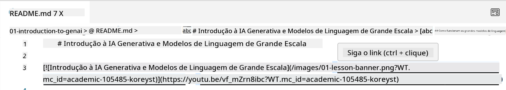
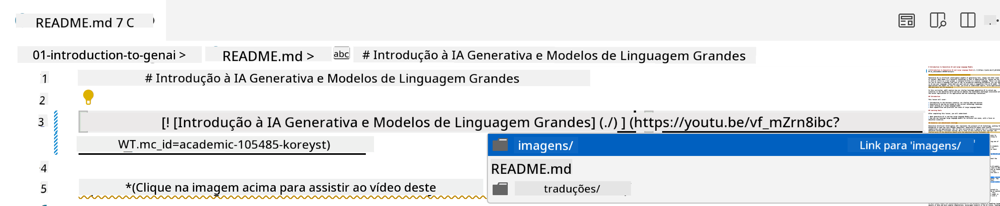
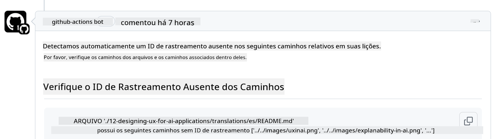
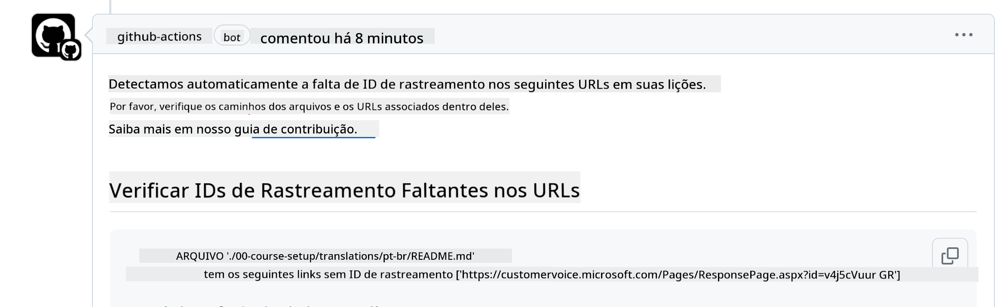
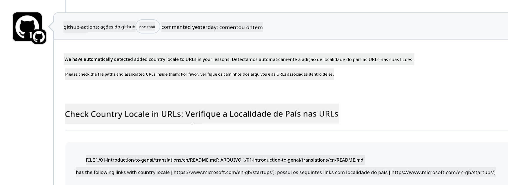

<!--
CO_OP_TRANSLATOR_METADATA:
{
  "original_hash": "57c41f2af71001a2cff9d8eb797cb843",
  "translation_date": "2025-05-19T08:39:54+00:00",
  "source_file": "CONTRIBUTING.md",
  "language_code": "br"
}
-->
# Contribuindo

Este projeto recebe contribuições e sugestões. A maioria das contribuições exige que você concorde com um Acordo de Licença de Contribuidor (CLA), declarando que você tem o direito de, e realmente concede, os direitos para usarmos sua contribuição. Para mais detalhes, visite <https://cla.microsoft.com>.

> Importante: ao traduzir texto neste repositório, certifique-se de não usar tradução automática. Vamos verificar traduções através da comunidade, então, por favor, só se voluntarie para traduções em idiomas nos quais você é proficiente.

Quando você enviar um pull request, um CLA-bot determinará automaticamente se você precisa fornecer um CLA e decorará o PR adequadamente (por exemplo, rótulo, comentário). Basta seguir as instruções fornecidas pelo bot. Você só precisará fazer isso uma vez em todos os repositórios que usam nosso CLA.

## Código de Conduta

Este projeto adotou o [Código de Conduta de Código Aberto da Microsoft](https://opensource.microsoft.com/codeofconduct/?WT.mc_id=academic-105485-koreyst). Para mais informações, leia as [Perguntas Frequentes sobre o Código de Conduta](https://opensource.microsoft.com/codeofconduct/faq/?WT.mc_id=academic-105485-koreyst) ou entre em contato com [opencode@microsoft.com](mailto:opencode@microsoft.com) para quaisquer perguntas ou comentários adicionais.

## Pergunta ou Problema?

Por favor, não abra issues no GitHub para perguntas gerais de suporte, pois a lista do GitHub deve ser usada para solicitações de funcionalidades e relatórios de bugs. Dessa forma, podemos rastrear mais facilmente problemas ou bugs reais do código e manter a discussão geral separada do código real.

## Erros de Digitação, Problemas, Bugs e Contribuições

Sempre que você estiver enviando quaisquer alterações para o repositório Generative AI for Beginners, por favor, siga estas recomendações.

* Sempre faça um fork do repositório para sua própria conta antes de fazer suas modificações
* Não combine várias alterações em um único pull request. Por exemplo, envie qualquer correção de bug e atualizações de documentação usando PRs separados
* Se o seu pull request mostrar conflitos de mesclagem, certifique-se de atualizar seu main local para ser um espelho do que está no repositório principal antes de fazer suas modificações
* Se você estiver enviando uma tradução, por favor, crie um PR para todos os arquivos traduzidos, pois não aceitamos traduções parciais para o conteúdo
* Se você estiver enviando uma correção de erro de digitação ou documentação, pode combinar modificações em um único PR onde for adequado

## Orientações Gerais para Escrita

- Certifique-se de que todos os seus URLs estejam entre colchetes seguidos por parênteses sem espaços extras ao redor ou dentro deles ``.
- Certifique-se de que qualquer link relativo (ou seja, links para outros arquivos e pastas no repositório) comece com um `./` referindo-se a um arquivo ou pasta localizado no diretório de trabalho atual ou um `../` referindo-se a um arquivo ou pasta localizado em um diretório de trabalho pai.
- Certifique-se de que qualquer link relativo (ou seja, links para outros arquivos e pastas no repositório) tenha um ID de rastreamento (ou seja, `?` ou `&` então `wt.mc_id=` ou `WT.mc_id=`) no final dele.
- Certifique-se de que qualquer URL dos seguintes domínios _github.com, microsoft.com, visualstudio.com, aka.ms e azure.com_ tenha um ID de rastreamento (ou seja, `?` ou `&` então `wt.mc_id=` ou `WT.mc_id=`) no final dele.
- Certifique-se de que seus links não tenham localidade específica de país neles (ou seja, `/en-us/` ou `/en/`).
- Certifique-se de que todas as imagens estejam armazenadas na pasta `./images`.
- Certifique-se de que as imagens tenham nomes descritivos usando caracteres em inglês, números e traços no nome da sua imagem.

## Fluxos de Trabalho do GitHub

Quando você enviar um pull request, quatro fluxos de trabalho diferentes serão acionados para validar as regras anteriores. Basta seguir as instruções listadas aqui para passar nas verificações dos fluxos de trabalho.

- [Verificar Caminhos Relativos Quebrados](../..)
- [Verificar Caminhos Com Rastreamento](../..)
- [Verificar URLs Com Rastreamento](../..)
- [Verificar URLs Sem Localidade](../..)

### Verificar Caminhos Relativos Quebrados

Este fluxo de trabalho garante que qualquer caminho relativo em seus arquivos esteja funcionando. Este repositório é implantado nas páginas do GitHub, então você precisa ter muito cuidado ao digitar os links que unem tudo para não direcionar ninguém para o lugar errado.

Para garantir que seus links estejam funcionando corretamente, use o VS code para verificar.

Por exemplo, quando você passa o mouse sobre qualquer link em seus arquivos, será solicitado a seguir o link pressionando **ctrl + clique**

Se você clicar em um link e ele não estiver funcionando localmente, então, com certeza, ele acionará o fluxo de trabalho e não funcionará no GitHub.

Para corrigir esse problema, tente digitar o link com a ajuda do VS code.

Quando você digita `./` ou `../`, o VS code solicitará que você escolha entre as opções disponíveis de acordo com o que você digitou.

Siga o caminho clicando no arquivo ou pasta desejado e você terá certeza de que seu caminho não está quebrado.

Uma vez que você adicionar o caminho relativo correto, salve e envie suas alterações, o fluxo de trabalho será acionado novamente para verificar suas alterações. Se você passar na verificação, então está tudo certo.

### Verificar Caminhos Com Rastreamento

Este fluxo de trabalho garante que qualquer caminho relativo tenha rastreamento nele. Este repositório é implantado nas páginas do GitHub, então precisamos rastrear o movimento entre os diferentes arquivos e pastas.

Para garantir que seus caminhos relativos tenham rastreamento, basta verificar o seguinte texto `?wt.mc_id=` no final do caminho. Se estiver anexado aos seus caminhos relativos, então você passará nesta verificação.

Caso contrário, você pode receber o seguinte erro.

Para corrigir esse problema, tente abrir o caminho do arquivo que o fluxo de trabalho destacou e adicione o ID de rastreamento ao final dos caminhos relativos.

Uma vez que você adicionar o ID de rastreamento, salve e envie suas alterações, o fluxo de trabalho será acionado novamente para verificar suas alterações. Se você passar na verificação, então está tudo certo.

### Verificar URLs Com Rastreamento

Este fluxo de trabalho garante que qualquer URL da web tenha rastreamento nele. Este repositório está disponível para todos, então você precisa garantir que o acesso seja rastreado para saber de onde vem o tráfego.

Para garantir que seus URLs tenham rastreamento, basta verificar o seguinte texto `?wt.mc_id=` no final do URL. Se estiver anexado aos seus URLs, então você passará nesta verificação.

Caso contrário, você pode receber o seguinte erro.

Para corrigir esse problema, tente abrir o caminho do arquivo que o fluxo de trabalho destacou e adicione o ID de rastreamento ao final dos URLs.

Uma vez que você adicionar o ID de rastreamento, salve e envie suas alterações, o fluxo de trabalho será acionado novamente para verificar suas alterações. Se você passar na verificação, então está tudo certo.

### Verificar URLs Sem Localidade

Este fluxo de trabalho garante que qualquer URL da web não tenha localidade específica de país nele. Este repositório está disponível para todos ao redor do mundo, então você precisa garantir que não inclua a localidade do seu país nos URLs.

Para garantir que seus URLs não tenham localidade de país, basta verificar o seguinte texto `/en-us/` ou `/en/` ou qualquer outra localidade de idioma em qualquer parte do URL. Se não estiver presente em seus URLs, então você passará nesta verificação.

Caso contrário, você pode receber o seguinte erro.

Para corrigir esse problema, tente abrir o caminho do arquivo que o fluxo de trabalho destacou e remover a localidade de país dos URLs.

Uma vez que você remover a localidade de país, salve e envie suas alterações, o fluxo de trabalho será acionado novamente para verificar suas alterações. Se você passar na verificação, então está tudo certo.

Parabéns! Entraremos em contato o mais rápido possível com feedback sobre sua contribuição.

**Aviso Legal**:  
Este documento foi traduzido usando o serviço de tradução por IA [Co-op Translator](https://github.com/Azure/co-op-translator). Embora nos esforcemos para alcançar precisão, esteja ciente de que traduções automatizadas podem conter erros ou imprecisões. O documento original em seu idioma nativo deve ser considerado a fonte autoritativa. Para informações críticas, recomenda-se a tradução profissional humana. Não nos responsabilizamos por quaisquer mal-entendidos ou interpretações errôneas decorrentes do uso desta tradução.