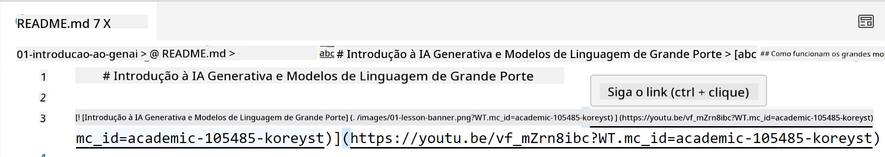
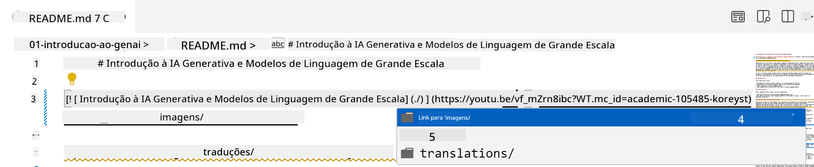
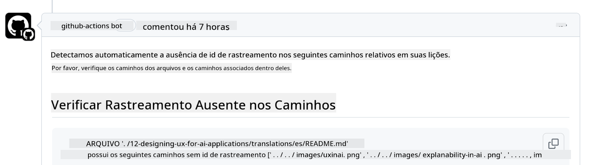
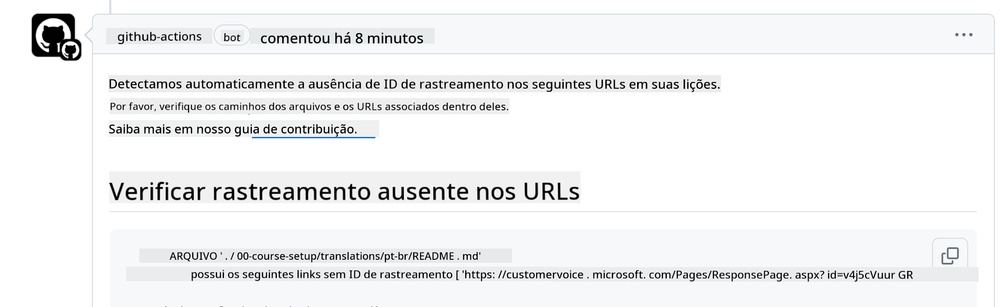
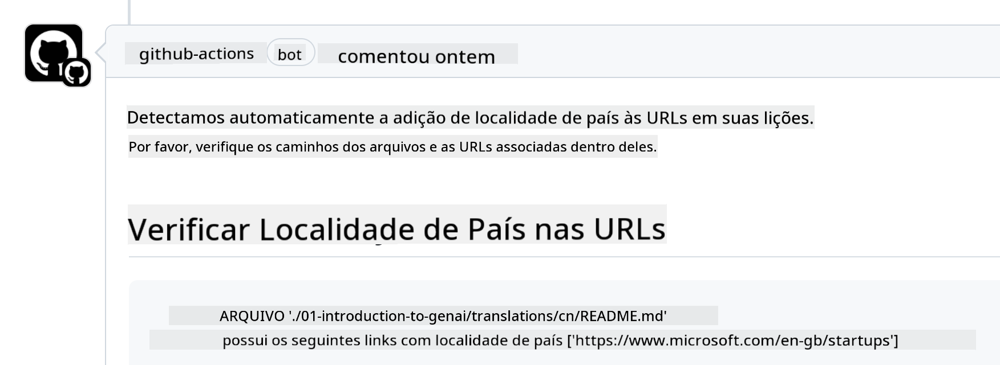

<!--
CO_OP_TRANSLATOR_METADATA:
{
  "original_hash": "57c41f2af71001a2cff9d8eb797cb843",
  "translation_date": "2025-07-09T05:54:00+00:00",
  "source_file": "CONTRIBUTING.md",
  "language_code": "br"
}
-->
# Contribuindo

Este projeto aceita contribuições e sugestões. A maioria das contribuições exige que você concorde com um Acordo de Licença de Contribuidor (CLA) declarando que você tem o direito e realmente concede a nós os direitos de usar sua contribuição. Para mais detalhes, visite <https://cla.microsoft.com>.

> Importante: ao traduzir textos neste repositório, certifique-se de não usar tradução automática. Verificaremos as traduções pela comunidade, então, por favor, só se voluntarie para traduções em idiomas nos quais você seja proficiente.

Quando você enviar um pull request, um bot CLA determinará automaticamente se você precisa fornecer um CLA e marcará o PR adequadamente (por exemplo, com etiqueta ou comentário). Basta seguir as instruções fornecidas pelo bot. Você precisará fazer isso apenas uma vez para todos os repositórios que usam nosso CLA.

## Código de Conduta

Este projeto adotou o [Microsoft Open Source Code of Conduct](https://opensource.microsoft.com/codeofconduct/?WT.mc_id=academic-105485-koreyst).  
Para mais informações, leia o [FAQ do Código de Conduta](https://opensource.microsoft.com/codeofconduct/faq/?WT.mc_id=academic-105485-koreyst) ou entre em contato pelo e-mail [opencode@microsoft.com](mailto:opencode@microsoft.com) para dúvidas ou comentários adicionais.

## Pergunta ou Problema?

Por favor, não abra issues no GitHub para dúvidas gerais, pois a lista do GitHub deve ser usada para solicitações de recursos e relatórios de bugs. Assim, podemos acompanhar mais facilmente problemas reais ou bugs no código e manter a discussão geral separada do código em si.

## Erros de digitação, problemas, bugs e contribuições

Sempre que você enviar alterações para o repositório Generative AI for Beginners, siga estas recomendações:

* Sempre faça um fork do repositório para sua própria conta antes de fazer suas modificações  
* Não combine várias alterações em um único pull request. Por exemplo, envie correções de bugs e atualizações de documentação em PRs separados  
* Se seu pull request apresentar conflitos de merge, certifique-se de atualizar seu branch main local para refletir o que está no repositório principal antes de fazer suas modificações  
* Se estiver enviando uma tradução, crie um único PR para todos os arquivos traduzidos, pois não aceitamos traduções parciais do conteúdo  
* Se estiver enviando uma correção de erro de digitação ou documentação, você pode combinar modificações em um único PR quando apropriado  

## Orientações gerais para escrita

- Certifique-se de que todas as suas URLs estejam entre colchetes seguidos de parênteses, sem espaços extras ao redor ou dentro deles ``.  
- Certifique-se de que qualquer link relativo (ou seja, links para outros arquivos e pastas no repositório) comece com `./` referindo-se a um arquivo ou pasta no diretório atual, ou `../` referindo-se a um arquivo ou pasta em um diretório pai.  
- Certifique-se de que qualquer link relativo tenha um ID de rastreamento (ou seja, `?` ou `&` seguido de `wt.mc_id=` ou `WT.mc_id=`) no final.  
- Certifique-se de que qualquer URL dos domínios _github.com, microsoft.com, visualstudio.com, aka.ms_ e _azure.com_ tenha um ID de rastreamento (ou seja, `?` ou `&` seguido de `wt.mc_id=` ou `WT.mc_id=`) no final.  
- Certifique-se de que seus links não contenham localidade específica de país (por exemplo, `/en-us/` ou `/en/`).  
- Certifique-se de que todas as imagens estejam armazenadas na pasta `./images`.  
- Certifique-se de que as imagens tenham nomes descritivos usando caracteres em inglês, números e hífens no nome da imagem.  

## Workflows do GitHub

Quando você enviar um pull request, quatro workflows diferentes serão acionados para validar as regras acima.  
Basta seguir as instruções listadas aqui para passar nas verificações do workflow.

- [Verificar caminhos relativos quebrados](../..)  
- [Verificar caminhos com rastreamento](../..)  
- [Verificar URLs com rastreamento](../..)  
- [Verificar URLs sem localidade](../..)  

### Verificar caminhos relativos quebrados

Este workflow garante que qualquer caminho relativo em seus arquivos esteja funcionando.  
Este repositório é publicado no GitHub Pages, então você precisa ter muito cuidado ao digitar os links que conectam tudo para não direcionar ninguém para o lugar errado.

Para garantir que seus links estejam funcionando corretamente, use o VS Code para verificar.

Por exemplo, ao passar o mouse sobre qualquer link em seus arquivos, você será convidado a seguir o link pressionando **ctrl + clique**

Se você clicar em um link e ele não funcionar localmente, certamente o workflow será acionado e não funcionará no GitHub.

Para corrigir esse problema, tente digitar o link com a ajuda do VS Code.

Quando você digitar `./` ou `../`, o VS Code sugerirá opções disponíveis de acordo com o que você digitou.

Siga o caminho clicando no arquivo ou pasta desejada e você terá certeza de que seu caminho não está quebrado.

Depois de adicionar o caminho relativo correto, salve e envie suas alterações; o workflow será acionado novamente para verificar suas mudanças.  
Se você passar na verificação, está tudo certo.

### Verificar caminhos com rastreamento

Este workflow garante que qualquer caminho relativo contenha rastreamento.  
Este repositório é publicado no GitHub Pages, então precisamos rastrear o movimento entre os diferentes arquivos e pastas.

Para garantir que seus caminhos relativos tenham rastreamento, verifique se há o texto `?wt.mc_id=` no final do caminho.  
Se estiver presente, você passará nesta verificação.

Caso contrário, você poderá receber o seguinte erro.

Para corrigir, abra o arquivo destacado pelo workflow e adicione o ID de rastreamento ao final dos caminhos relativos.

Depois de adicionar o ID de rastreamento, salve e envie suas alterações; o workflow será acionado novamente para verificar suas mudanças.  
Se você passar na verificação, está tudo certo.

### Verificar URLs com rastreamento

Este workflow garante que qualquer URL web contenha rastreamento.  
Este repositório está disponível para todos, então você precisa garantir o rastreamento para saber de onde vem o tráfego.

Para garantir que suas URLs tenham rastreamento, verifique se há o texto `?wt.mc_id=` no final da URL.  
Se estiver presente, você passará nesta verificação.

Caso contrário, você poderá receber o seguinte erro.

Para corrigir, abra o arquivo destacado pelo workflow e adicione o ID de rastreamento ao final das URLs.

Depois de adicionar o ID de rastreamento, salve e envie suas alterações; o workflow será acionado novamente para verificar suas mudanças.  
Se você passar na verificação, está tudo certo.

### Verificar URLs sem localidade

Este workflow garante que qualquer URL web não contenha localidade específica de país.  
Este repositório está disponível para pessoas do mundo todo, então você precisa garantir que não inclua a localidade do seu país nas URLs.

Para garantir que suas URLs não contenham localidade, verifique se não há o texto `/en-us/` ou `/en/` ou qualquer outra localidade de idioma em qualquer parte da URL.  
Se não estiver presente, você passará nesta verificação.

Caso contrário, você poderá receber o seguinte erro.

Para corrigir, abra o arquivo destacado pelo workflow e remova a localidade das URLs.

Depois de remover a localidade, salve e envie suas alterações; o workflow será acionado novamente para verificar suas mudanças.  
Se você passar na verificação, está tudo certo.

Parabéns! Retornaremos o mais breve possível com feedback sobre sua contribuição.

**Aviso Legal**:  
Este documento foi traduzido utilizando o serviço de tradução por IA [Co-op Translator](https://github.com/Azure/co-op-translator). Embora nos esforcemos para garantir a precisão, esteja ciente de que traduções automáticas podem conter erros ou imprecisões. O documento original em seu idioma nativo deve ser considerado a fonte autorizada. Para informações críticas, recomenda-se tradução profissional humana. Não nos responsabilizamos por quaisquer mal-entendidos ou interpretações incorretas decorrentes do uso desta tradução.