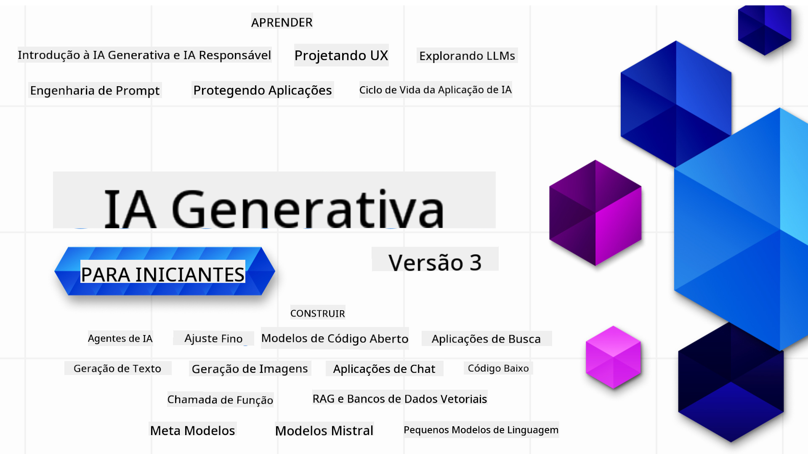

<!--
CO_OP_TRANSLATOR_METADATA:
{
  "original_hash": "5740c9b7fcb6919da1ea4df93475f331",
  "translation_date": "2025-07-09T06:30:15+00:00",
  "source_file": "README.md",
  "language_code": "br"
}
-->

### 21 Lições que ensinam tudo o que você precisa saber para começar a criar aplicações de IA Generativa

### 🌐 Suporte Multilíngue

#### Suportado via GitHub Action (Automatizado e Sempre Atualizado)

[Francês](../fr/README.md) | [Espanhol](../es/README.md) | [Alemão](../de/README.md) | [Russo](../ru/README.md) | [Árabe](../ar/README.md) | [Persa (Farsi)](../fa/README.md) | [Urdu](../ur/README.md) | [Chinês (Simplificado)](../zh/README.md) | [Chinês (Tradicional, Macau)](../mo/README.md) | [Chinês (Tradicional, Hong Kong)](../hk/README.md) | [Chinês (Tradicional, Taiwan)](../tw/README.md) | [Japonês](../ja/README.md) | [Coreano](../ko/README.md) | [Hindi](../hi/README.md) | [Bengali](../bn/README.md) | [Marathi](../mr/README.md) | [Nepali](../ne/README.md) | [Punjabi (Gurmukhi)](../pa/README.md) | [Português (Portugal)](../pt/README.md) | [Português (Brasil)](./README.md) | [Italiano](../it/README.md) | [Polonês](../pl/README.md) | [Turco](../tr/README.md) | [Grego](../el/README.md) | [Tailandês](../th/README.md) | [Sueco](../sv/README.md) | [Dinamarquês](../da/README.md) | [Norueguês](../no/README.md) | [Finlandês](../fi/README.md) | [Holandês](../nl/README.md) | [Hebraico](../he/README.md) | [Vietnamita](../vi/README.md) | [Indonésio](../id/README.md) | [Malaio](../ms/README.md) | [Tagalog (Filipino)](../tl/README.md) | [Suaíli](../sw/README.md) | [Húngaro](../hu/README.md) | [Tcheco](../cs/README.md) | [Eslovaco](../sk/README.md) | [Romeno](../ro/README.md) | [Búlgaro](../bg/README.md) | [Sérvio (Cirílico)](../sr/README.md) | [Croata](../hr/README.md) | [Esloveno](../sl/README.md) | [Ucraniano](../uk/README.md) | [Birmanês (Myanmar)](../my/README.md)

# IA Generativa para Iniciantes (Versão 3) - Um Curso

Aprenda os fundamentos para construir aplicações de IA Generativa com nosso curso completo de 21 lições, criado pelos Microsoft Cloud Advocates.

## 🌱 Começando

Este curso tem 21 lições. Cada lição aborda um tema específico, então comece de onde quiser!

As lições são divididas em "Learn" (Aprender), que explicam um conceito de IA Generativa, e "Build" (Construir), que explicam um conceito e trazem exemplos de código em **Python** e **TypeScript** sempre que possível.

Para desenvolvedores .NET, confira [Generative AI for Beginners (.NET Edition)](https://github.com/microsoft/Generative-AI-for-beginners-dotnet?WT.mc_id=academic-105485-koreyst)!

Cada lição também inclui uma seção "Keep Learning" com ferramentas adicionais para aprofundar seu aprendizado.

## O que você precisa
### Para rodar o código deste curso, você pode usar:
 - [Azure OpenAI Service](https://aka.ms/genai-beginners/azure-open-ai?WT.mc_id=academic-105485-koreyst) - **Lições:** "aoai-assignment"
 - [GitHub Marketplace Model Catalog](https://aka.ms/genai-beginners/gh-models?WT.mc_id=academic-105485-koreyst) - **Lições:** "githubmodels"
 - [OpenAI API](https://aka.ms/genai-beginners/open-ai?WT.mc_id=academic-105485-koreyst) - **Lições:** "oai-assignment" 
   
- Conhecimentos básicos em Python ou TypeScript são úteis - \*Para iniciantes absolutos, confira estes cursos de [Python](https://aka.ms/genai-beginners/python?WT.mc_id=academic-105485-koreyst) e [TypeScript](https://aka.ms/genai-beginners/typescript?WT.mc_id=academic-105485-koreyst)
- Uma conta no GitHub para [fazer fork deste repositório completo](https://aka.ms/genai-beginners/github?WT.mc_id=academic-105485-koreyst) para sua própria conta

Criamos uma lição **[Configuração do Curso](./00-course-setup/README.md?WT.mc_id=academic-105485-koreyst)** para ajudar você a preparar seu ambiente de desenvolvimento.

Não esqueça de [dar uma estrela (🌟) neste repositório](https://docs.github.com/en/get-started/exploring-projects-on-github/saving-repositories-with-stars?WT.mc_id=academic-105485-koreyst) para encontrá-lo mais facilmente depois.

## 🧠 Pronto para Implantar?

Se você busca exemplos de código mais avançados, confira nossa [coleção de Exemplos de Código de IA Generativa](https://aka.ms/genai-beg-code?WT.mc_id=academic-105485-koreyst) em **Python** e **TypeScript**.

## 🗣️ Conheça Outros Alunos, Obtenha Suporte

Junte-se ao nosso [servidor oficial Azure AI Foundry no Discord](https://aka.ms/genai-discord?WT.mc_id=academic-105485-koreyst) para conhecer e interagir com outros alunos do curso e receber suporte.

Faça perguntas ou compartilhe feedback sobre o produto em nosso [Fórum de Desenvolvedores Azure AI Foundry](https://aka.ms/azureaifoundry/forum) no GitHub.

## 🚀 Criando uma Startup?

Inscreva-se no [Microsoft for Startups Founders Hub](https://aka.ms/genai-foundershub?WT.mc_id=academic-105485-koreyst) para receber **créditos gratuitos do OpenAI** e até **$150 mil em créditos Azure para acessar modelos OpenAI via Azure OpenAI Services**.

## 🙏 Quer ajudar?

Tem sugestões ou encontrou erros de digitação ou código? [Abra uma issue](https://github.com/microsoft/generative-ai-for-beginners/issues?WT.mc_id=academic-105485-koreyst) ou [crie um pull request](https://github.com/microsoft/generative-ai-for-beginners/pulls?WT.mc_id=academic-105485-koreyst)

## 📂 Cada lição inclui:

- Uma breve introdução em vídeo sobre o tema
- Uma lição escrita disponível no README
- Exemplos de código em Python e TypeScript que suportam Azure OpenAI e OpenAI API
- Links para recursos extras para continuar seu aprendizado

## 🗃️ Lições

| #   | **Link da Lição**                                                                                                                            | **Descrição**                                                                                   | **Vídeo**                                                                   | **Aprendizado Extra**                                                           |
| --- | -------------------------------------------------------------------------------------------------------------------------------------------- | ----------------------------------------------------------------------------------------------- | --------------------------------------------------------------------------- | ------------------------------------------------------------------------------ |
| 00  | [Configuração do Curso](./00-course-setup/README.md?WT.mc_id=academic-105485-koreyst)                                                         | **Aprender:** Como configurar seu ambiente de desenvolvimento                                  | Vídeo em breve                                                              | [Saiba Mais](https://aka.ms/genai-collection?WT.mc_id=academic-105485-koreyst) |
| 01  | [Introdução à IA Generativa e LLMs](./01-introduction-to-genai/README.md?WT.mc_id=academic-105485-koreyst)                                    | **Aprender:** Entendendo o que é IA Generativa e como funcionam os Modelos de Linguagem Grande (LLMs) | [Vídeo](https://aka.ms/gen-ai-lesson-1-gh?WT.mc_id=academic-105485-koreyst) | [Saiba Mais](https://aka.ms/genai-collection?WT.mc_id=academic-105485-koreyst) |
| 02  | [Explorando e comparando diferentes LLMs](./02-exploring-and-comparing-different-llms/README.md?WT.mc_id=academic-105485-koreyst)               | **Aprender:** Como escolher o modelo certo para seu caso de uso                                | [Vídeo](https://aka.ms/gen-ai-lesson2-gh?WT.mc_id=academic-105485-koreyst)  | [Saiba Mais](https://aka.ms/genai-collection?WT.mc_id=academic-105485-koreyst) |
| 03  | [Usando IA Generativa de Forma Responsável](./03-using-generative-ai-responsibly/README.md?WT.mc_id=academic-105485-koreyst)                   | **Aprender:** Como construir aplicações de IA Generativa de forma responsável                  | [Vídeo](https://aka.ms/gen-ai-lesson3-gh?WT.mc_id=academic-105485-koreyst)  | [Saiba Mais](https://aka.ms/genai-collection?WT.mc_id=academic-105485-koreyst) |
| 04  | [Entendendo os Fundamentos de Engenharia de Prompt](./04-prompt-engineering-fundamentals/README.md?WT.mc_id=academic-105485-koreyst)           | **Aprender:** Práticas recomendadas de engenharia de prompt na prática                          | [Vídeo](https://aka.ms/gen-ai-lesson4-gh?WT.mc_id=academic-105485-koreyst)  | [Saiba Mais](https://aka.ms/genai-collection?WT.mc_id=academic-105485-koreyst) |
| 05  | [Criando Prompts Avançados](./05-advanced-prompts/README.md?WT.mc_id=academic-105485-koreyst)                                                  | **Aprender:** Como aplicar técnicas de engenharia de prompt que melhoram os resultados dos seus prompts | [Vídeo](https://aka.ms/gen-ai-lesson5-gh?WT.mc_id=academic-105485-koreyst)  | [Saiba Mais](https://aka.ms/genai-collection?WT.mc_id=academic-105485-koreyst) |
| 06  | [Construindo Aplicações de Geração de Texto](./06-text-generation-apps/README.md?WT.mc_id=academic-105485-koreyst)                                | **Construção:** Um app de geração de texto usando Azure OpenAI / OpenAI API                                | [Vídeo](https://aka.ms/gen-ai-lesson6-gh?WT.mc_id=academic-105485-koreyst)  | [Saiba Mais](https://aka.ms/genai-collection?WT.mc_id=academic-105485-koreyst) |
| 07  | [Construindo Aplicações de Chat](./07-building-chat-applications/README.md?WT.mc_id=academic-105485-koreyst)                                     | **Construção:** Técnicas para construir e integrar aplicações de chat de forma eficiente.               | [Vídeo](https://aka.ms/gen-ai-lessons7-gh?WT.mc_id=academic-105485-koreyst) | [Saiba Mais](https://aka.ms/genai-collection?WT.mc_id=academic-105485-koreyst) |
| 08  | [Construindo Aplicações de Busca com Bancos de Dados Vetoriais](./08-building-search-applications/README.md?WT.mc_id=academic-105485-koreyst)                        | **Construção:** Uma aplicação de busca que usa Embeddings para pesquisar dados.                        | [Vídeo](https://aka.ms/gen-ai-lesson8-gh?WT.mc_id=academic-105485-koreyst)  | [Saiba Mais](https://aka.ms/genai-collection?WT.mc_id=academic-105485-koreyst) |
| 09  | [Construindo Aplicações de Geração de Imagens](./09-building-image-applications/README.md?WT.mc_id=academic-105485-koreyst)                        | **Construção:** Uma aplicação de geração de imagens                                                       | [Vídeo](https://aka.ms/gen-ai-lesson9-gh?WT.mc_id=academic-105485-koreyst)  | [Saiba Mais](https://aka.ms/genai-collection?WT.mc_id=academic-105485-koreyst) |
| 10  | [Construindo Aplicações de IA Low Code](./10-building-low-code-ai-applications/README.md?WT.mc_id=academic-105485-koreyst)                       | **Construção:** Uma aplicação de IA Generativa usando ferramentas Low Code                                     | [Vídeo](https://aka.ms/gen-ai-lesson10-gh?WT.mc_id=academic-105485-koreyst) | [Saiba Mais](https://aka.ms/genai-collection?WT.mc_id=academic-105485-koreyst) |
| 11  | [Integrando Aplicações Externas com Function Calling](./11-integrating-with-function-calling/README.md?WT.mc_id=academic-105485-koreyst) | **Construção:** O que é function calling e seus casos de uso para aplicações                          | [Vídeo](https://aka.ms/gen-ai-lesson11-gh?WT.mc_id=academic-105485-koreyst) | [Saiba Mais](https://aka.ms/genai-collection?WT.mc_id=academic-105485-koreyst) |
| 12  | [Design de UX para Aplicações de IA](./12-designing-ux-for-ai-applications/README.md?WT.mc_id=academic-105485-koreyst)                         | **Aprenda:** Como aplicar princípios de design UX ao desenvolver aplicações de IA Generativa         | [Vídeo](https://aka.ms/gen-ai-lesson12-gh?WT.mc_id=academic-105485-koreyst) | [Saiba Mais](https://aka.ms/genai-collection?WT.mc_id=academic-105485-koreyst) |
| 13  | [Protegendo Suas Aplicações de IA Generativa](./13-securing-ai-applications/README.md?WT.mc_id=academic-105485-koreyst)                         | **Aprenda:** As ameaças e riscos aos sistemas de IA e métodos para proteger esses sistemas.             | [Vídeo](https://aka.ms/gen-ai-lesson13-gh?WT.mc_id=academic-105485-koreyst) | [Saiba Mais](https://aka.ms/genai-collection?WT.mc_id=academic-105485-koreyst) |
| 14  | [O Ciclo de Vida da Aplicação de IA Generativa](./14-the-generative-ai-application-lifecycle/README.md?WT.mc_id=academic-105485-koreyst)           | **Aprenda:** As ferramentas e métricas para gerenciar o ciclo de vida do LLM e LLMOps                         | [Vídeo](https://aka.ms/gen-ai-lesson14-gh?WT.mc_id=academic-105485-koreyst) | [Saiba Mais](https://aka.ms/genai-collection?WT.mc_id=academic-105485-koreyst) |
| 15  | [Retrieval Augmented Generation (RAG) e Bancos de Dados Vetoriais](./15-rag-and-vector-databases/README.md?WT.mc_id=academic-105485-koreyst)        | **Construção:** Uma aplicação usando um Framework RAG para recuperar embeddings de Bancos de Dados Vetoriais  | [Vídeo](https://aka.ms/gen-ai-lesson15-gh?WT.mc_id=academic-105485-koreyst) | [Saiba Mais](https://aka.ms/genai-collection?WT.mc_id=academic-105485-koreyst) |
| 16  | [Modelos Open Source e Hugging Face](./16-open-source-models/README.md?WT.mc_id=academic-105485-koreyst)                                    | **Construção:** Uma aplicação usando modelos open source disponíveis no Hugging Face                    | [Vídeo](https://aka.ms/gen-ai-lesson16-gh?WT.mc_id=academic-105485-koreyst) | [Saiba Mais](https://aka.ms/genai-collection?WT.mc_id=academic-105485-koreyst) |
| 17  | [Agentes de IA](./17-ai-agents/README.md?WT.mc_id=academic-105485-koreyst)                                                                       | **Construção:** Uma aplicação usando um Framework de Agentes de IA                                           | [Vídeo](https://aka.ms/gen-ai-lesson17-gh?WT.mc_id=academic-105485-koreyst) | [Saiba Mais](https://aka.ms/genai-collection?WT.mc_id=academic-105485-koreyst) |
| 18  | [Fine-Tuning de LLMs](./18-fine-tuning/README.md?WT.mc_id=academic-105485-koreyst)                                                              | **Aprenda:** O que, por que e como fazer fine-tuning em LLMs                                            | [Vídeo](https://aka.ms/gen-ai-lesson18-gh?WT.mc_id=academic-105485-koreyst) | [Saiba Mais](https://aka.ms/genai-collection?WT.mc_id=academic-105485-koreyst) |
| 19  | [Construindo com SLMs](./19-slm/README.md?WT.mc_id=academic-105485-koreyst)                                                              | **Aprenda:** Os benefícios de construir com Small Language Models                                            | Vídeo em breve | [Saiba Mais](https://aka.ms/genai-collection?WT.mc_id=academic-105485-koreyst) |
| 20  | [Construindo com Modelos Mistral](./20-mistral/README.md?WT.mc_id=academic-105485-koreyst)                                                              | **Aprenda:** As características e diferenças dos Modelos da Família Mistral                                           | Vídeo em breve | [Saiba Mais](https://aka.ms/genai-collection?WT.mc_id=academic-105485-koreyst) |
| 21  | [Construindo com Modelos Meta](./21-meta/README.md?WT.mc_id=academic-105485-koreyst)                                                              | **Aprenda:** As características e diferenças dos Modelos da Família Meta                                           | Vídeo em breve | [Saiba Mais](https://aka.ms/genai-collection?WT.mc_id=academic-105485-koreyst) |

### 🌟 Agradecimentos especiais

Agradecimentos especiais a [**John Aziz**](https://www.linkedin.com/in/john0isaac/) por criar todas as GitHub Actions e workflows

[**Bernhard Merkle**](https://www.linkedin.com/in/bernhard-merkle-738b73/) por suas contribuições essenciais em cada lição para melhorar a experiência do aprendiz e do código.

## 🎒 Outros Cursos

Nossa equipe produz outros cursos! Confira:

- [**NOVO** Protocolo de Contexto de Modelos para Iniciantes](https://github.com/microsoft/mcp-for-beginners?WT.mc_id=academic-105485-koreyst)
- [Agentes de IA para Iniciantes](https://github.com/microsoft/ai-agents-for-beginners?WT.mc_id=academic-105485-koreyst)
- [IA Generativa para Iniciantes usando .NET](https://github.com/microsoft/Generative-AI-for-beginners-dotnet?WT.mc_id=academic-105485-koreyst)
- [IA Generativa para Iniciantes usando JavaScript](https://aka.ms/genai-js-course?WT.mc_id=academic-105485-koreyst)
- [ML para Iniciantes](https://aka.ms/ml-beginners?WT.mc_id=academic-105485-koreyst)
- [Ciência de Dados para Iniciantes](https://aka.ms/datascience-beginners?WT.mc_id=academic-105485-koreyst)
- [IA para Iniciantes](https://aka.ms/ai-beginners?WT.mc_id=academic-105485-koreyst)
- [Cibersegurança para Iniciantes](https://github.com/microsoft/Security-101??WT.mc_id=academic-96948-sayoung)
- [Desenvolvimento Web para Iniciantes](https://aka.ms/webdev-beginners?WT.mc_id=academic-105485-koreyst)
- [IoT para Iniciantes](https://aka.ms/iot-beginners?WT.mc_id=academic-105485-koreyst)
- [Desenvolvimento XR para Iniciantes](https://github.com/microsoft/xr-development-for-beginners?WT.mc_id=academic-105485-koreyst)
- [Dominando o GitHub Copilot para Programação em Par com IA](https://aka.ms/GitHubCopilotAI?WT.mc_id=academic-105485-koreyst)
- [Dominando o GitHub Copilot para Desenvolvedores C#/.NET](https://github.com/microsoft/mastering-github-copilot-for-dotnet-csharp-developers?WT.mc_id=academic-105485-koreyst)
- [Escolha Sua Própria Aventura com Copilot](https://github.com/microsoft/CopilotAdventures?WT.mc_id=academic-105485-koreyst)

**Aviso Legal**:  
Este documento foi traduzido utilizando o serviço de tradução por IA [Co-op Translator](https://github.com/Azure/co-op-translator). Embora nos esforcemos para garantir a precisão, esteja ciente de que traduções automáticas podem conter erros ou imprecisões. O documento original em seu idioma nativo deve ser considerado a fonte autorizada. Para informações críticas, recomenda-se tradução profissional humana. Não nos responsabilizamos por quaisquer mal-entendidos ou interpretações incorretas decorrentes do uso desta tradução.