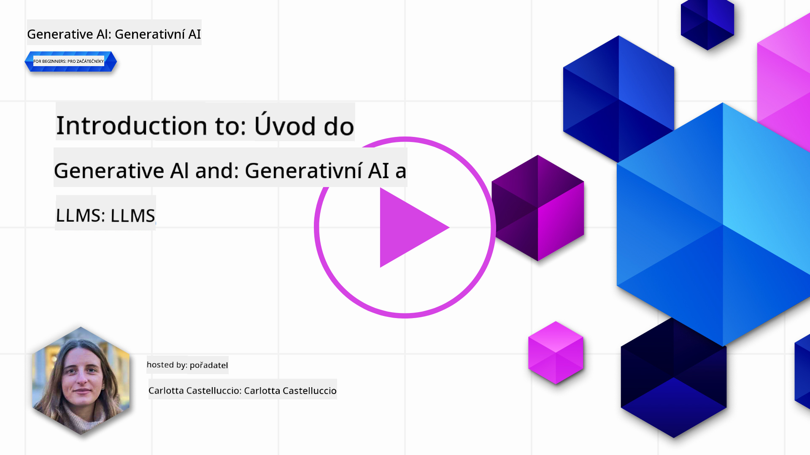
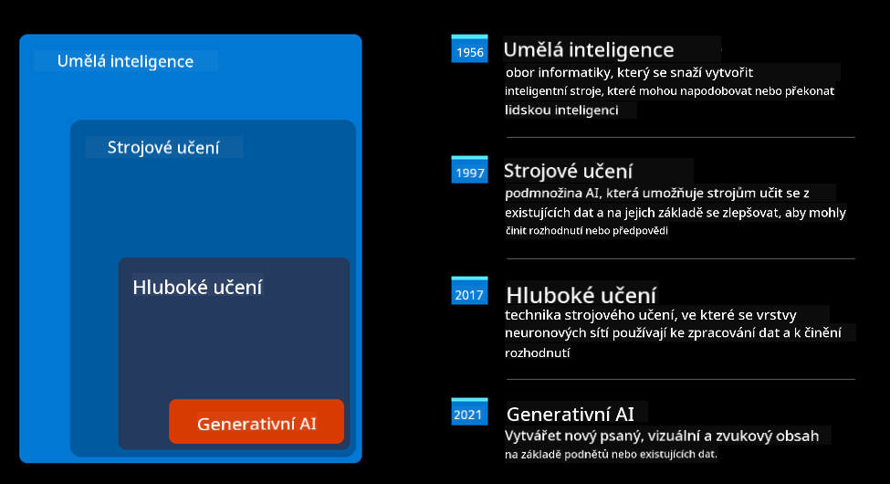
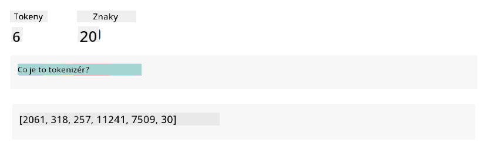
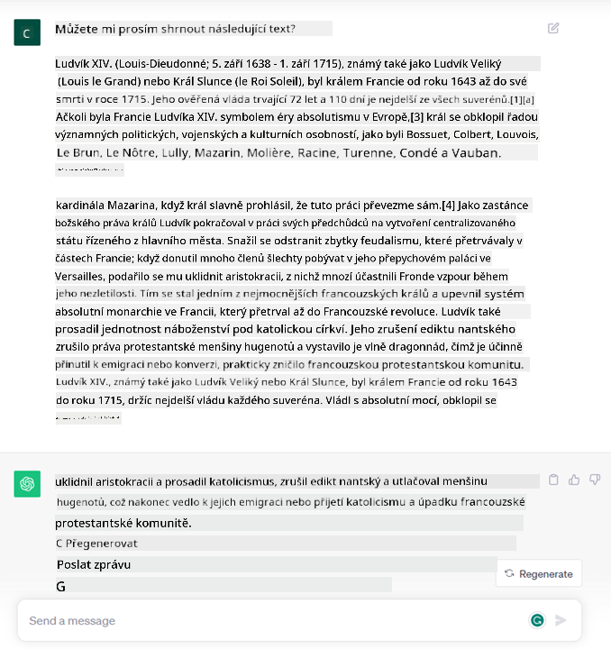
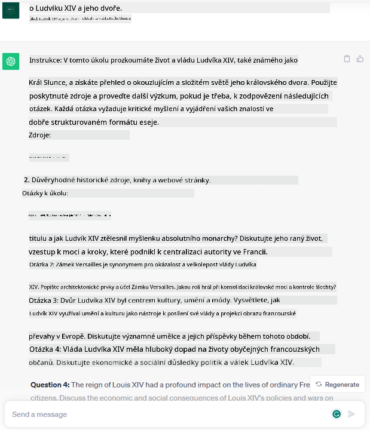
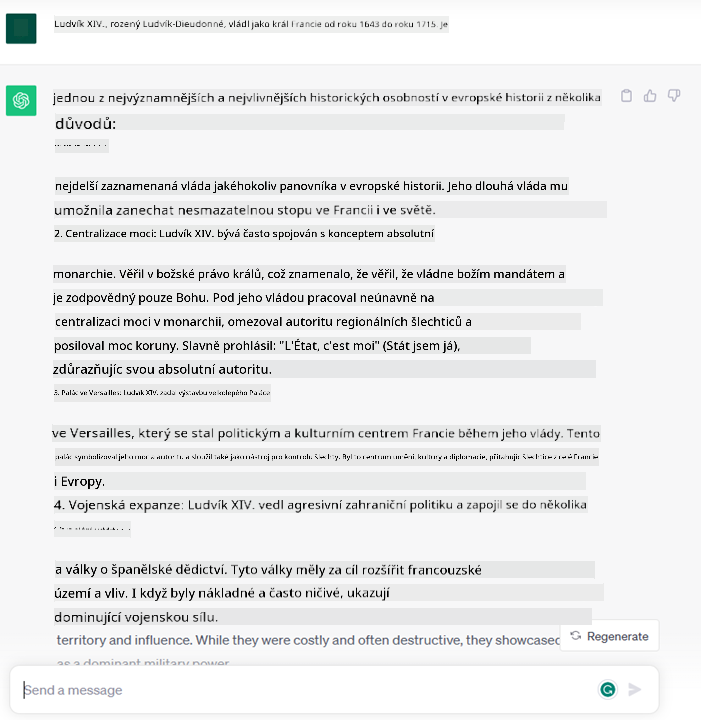
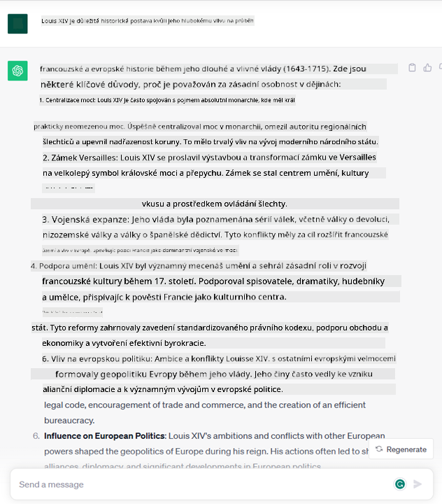
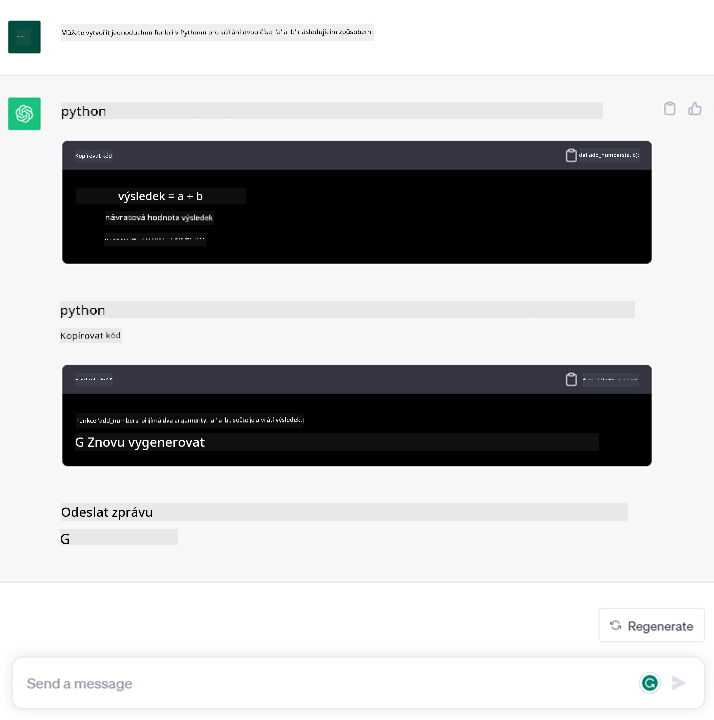

<!--
CO_OP_TRANSLATOR_METADATA:
{
  "original_hash": "f53ba0fa49164f9323043f1c6b11f2b1",
  "translation_date": "2025-06-25T10:04:34+00:00",
  "source_file": "01-introduction-to-genai/README.md",
  "language_code": "cs"
}
-->
# Úvod do generativní AI a velkých jazykových modelů

_(Klikněte na obrázek výše pro zhlédnutí videa této lekce)_

Generativní AI je umělá inteligence schopná generovat text, obrázky a další typy obsahu. Co ji činí fantastickou technologií, je to, že demokratizuje AI, kdokoli ji může použít s pouhým textovým zadáním, větou napsanou v přirozeném jazyce. Nemusíte se učit jazyk jako Java nebo SQL, abyste dosáhli něčeho užitečného, stačí použít svůj jazyk, říci, co chcete, a AI model vám poskytne návrh. Aplikace a dopad této technologie jsou obrovské, můžete psát nebo chápat zprávy, vytvářet aplikace a mnohem více, vše během několika sekund.

V tomto kurikulu prozkoumáme, jak náš startup využívá generativní AI k otevření nových scénářů ve vzdělávacím světě a jak řešíme nevyhnutelné výzvy spojené se sociálními dopady její aplikace a technologickými omezeními.

## Úvod

Tato lekce pokryje:

- Úvod do obchodního scénáře: náš startupový nápad a mise.
- Generativní AI a jak jsme se dostali k současné technologické krajině.
- Vnitřní fungování velkého jazykového modelu.
- Hlavní schopnosti a praktické případy použití velkých jazykových modelů.

## Cíle učení

Po dokončení této lekce pochopíte:

- Co je generativní AI a jak fungují velké jazykové modely.
- Jak můžete využít velké jazykové modely pro různé případy použití, se zaměřením na vzdělávací scénáře.

## Scénář: náš vzdělávací startup

Generativní umělá inteligence (AI) představuje vrchol AI technologie, posouvající hranice toho, co bylo kdysi považováno za nemožné. Generativní AI modely mají několik schopností a aplikací, ale pro toto kurikulum prozkoumáme, jak revolucionalizuje vzdělávání prostřednictvím fiktivního startupu. Na tento startup budeme odkazovat jako _náš startup_. Náš startup působí v oblasti vzdělávání s ambiciózním prohlášením mise

> _zlepšit dostupnost ve vzdělávání na globální úrovni, zajistit rovný přístup ke vzdělání a poskytovat personalizované vzdělávací zážitky každému studentovi podle jeho potřeb_.

Náš tým startupu si je vědom, že tohoto cíle nedosáhneme bez využití jednoho z nejmocnějších nástrojů moderní doby – velkých jazykových modelů (LLMs).

Generativní AI se očekává, že revolucionalizuje způsob, jakým se dnes učíme a učíme, se studenty, kteří mají k dispozici virtuální učitele 24 hodin denně, poskytující obrovské množství informací a příkladů, a učiteli, kteří mohou využívat inovativní nástroje k hodnocení svých studentů a poskytování zpětné vazby.

Začněme definováním některých základních pojmů a terminologie, které budeme používat v celém kurikulu.

## Jak jsme získali generativní AI?

Navzdory mimořádnému _hype_, který byl v poslední době vytvořen oznámením generativních AI modelů, tato technologie se vyvíjí desítky let, s prvními výzkumnými snahami sahajícími až do 60. let. Nyní jsme na bodě, kdy AI má lidské kognitivní schopnosti, jako je konverzace, jak je ukázáno například [OpenAI ChatGPT](https://openai.com/chatgpt) nebo [Bing Chat](https://www.microsoft.com/edge/features/bing-chat?WT.mc_id=academic-105485-koreyst), který také používá GPT model pro webové vyhledávání Bing konverzací.

Vrátíme-li se trochu zpět, první prototypy AI sestávaly z psaných chatbotů, spoléhajících na znalostní základnu extrahovanou ze skupiny odborníků a reprezentovanou v počítači. Odpovědi ve znalostní základně byly vyvolány klíčovými slovy objevujícími se ve vstupním textu.
Brzy však bylo jasné, že takový přístup, používající psané chatboty, se dobře neškáluje.

### Statistický přístup k AI: Strojové učení

Zlom nastal během 90. let s aplikací statistického přístupu k analýze textu. To vedlo k vývoji nových algoritmů – známých jako strojové učení – schopných se učit vzory z dat bez explicitního programování. Tento přístup umožňuje strojům simulovat porozumění lidskému jazyku: statistický model je trénován na párování text-štítek, což umožňuje modelu klasifikovat neznámý vstupní text s předem definovaným štítkem představujícím záměr zprávy.

### Neuronové sítě a moderní virtuální asistenti

V posledních letech technologický vývoj hardwaru, schopného zpracovávat větší množství dat a složitější výpočty, podpořil výzkum v oblasti AI, což vedlo k vývoji pokročilých algoritmů strojového učení známých jako neuronové sítě nebo algoritmy hlubokého učení.

Neuronové sítě (a zejména rekurentní neuronové sítě – RNN) významně vylepšily zpracování přirozeného jazyka, což umožňuje reprezentaci významu textu smysluplnějším způsobem, zohledňujícím kontext slova ve větě.

Toto je technologie, která poháněla virtuální asistenty narozené v první dekádě nového století, velmi zdatné v interpretaci lidského jazyka, identifikaci potřeby a provádění akce k jejímu uspokojení – jako je odpověď s předem definovaným skriptem nebo spotřebování služby třetí strany.

### Současnost, generativní AI

Tak jsme se dostali k dnešní generativní AI, kterou lze považovat za podmnožinu hlubokého učení.

Po desetiletích výzkumu v oblasti AI nová architektura modelu – nazývaná _Transformer_ – překonala omezení RNN, což umožňuje přijímat mnohem delší sekvence textu jako vstup. Transformery jsou založeny na mechanismu pozornosti, umožňující modelu dávat různé váhy vstupům, které přijímá, ‚věnovat více pozornosti‘ tam, kde je koncentrována nejrelevantnější informace, bez ohledu na jejich pořadí v textové sekvenci.

Většina nedávných generativních AI modelů – také známých jako velké jazykové modely (LLMs), protože pracují s textovými vstupy a výstupy – je skutečně založena na této architektuře. Co je zajímavé na těchto modelech – trénovaných na obrovském množství neoznačených dat z různých zdrojů, jako jsou knihy, články a webové stránky – je to, že je lze přizpůsobit široké škále úkolů a generovat gramaticky správný text s náznakem kreativity. Takže nejenže neuvěřitelně vylepšily schopnost stroje ‚porozumět‘ vstupnímu textu, ale umožnily jeho schopnost generovat originální odpověď v lidském jazyce.

## Jak fungují velké jazykové modely?

V další kapitole prozkoumáme různé typy generativních AI modelů, ale prozatím se podívejme, jak fungují velké jazykové modely, se zaměřením na OpenAI GPT (Generative Pre-trained Transformer) modely.

- **Tokenizér, text na čísla**: Velké jazykové modely přijímají text jako vstup a generují text jako výstup. Nicméně, protože jsou statistickými modely, pracují mnohem lépe s čísly než s textovými sekvencemi. Proto je každý vstup do modelu zpracován tokenizérem, než je použit jádrovým modelem. Token je úsek textu – skládající se z proměnlivého počtu znaků, takže hlavním úkolem tokenizéru je rozdělit vstup na pole tokenů. Poté je každý token mapován s indexem tokenu, což je celočíselné kódování původního úseku textu.

- **Předpovídání výstupních tokenů**: Daných n tokenů jako vstup (s max n se liší od jednoho modelu k druhému), model je schopen předpovědět jeden token jako výstup. Tento token je poté začleněn do vstupu další iterace, v rozšiřujícím se okně, což umožňuje lepší uživatelský zážitek z získání jedné (nebo více) vět jako odpovědi. To vysvětluje, proč, pokud jste někdy hráli s ChatGPT, možná jste si všimli, že někdy vypadá, že se zastaví uprostřed věty.

- **Proces výběru, pravděpodobnostní rozdělení**: Výstupní token je vybrán modelem podle jeho pravděpodobnosti výskytu po aktuální textové sekvenci. To je proto, že model předpovídá pravděpodobnostní rozdělení všech možných ‚dalších tokenů‘, vypočítaných na základě svého tréninku. Nicméně, ne vždy je token s nejvyšší pravděpodobností vybrán z výsledného rozdělení. Do této volby je přidána míra náhodnosti, způsobem, že model jedná nedeterministickým způsobem - nedostaneme přesně stejný výstup pro stejný vstup. Tato míra náhodnosti je přidána k simulaci procesu kreativního myšlení a lze ji nastavit pomocí parametru modelu nazývaného teplota.

## Jak může náš startup využít velké jazykové modely?

Nyní, když máme lepší pochopení vnitřního fungování velkého jazykového modelu, podívejme se na některé praktické příklady nejběžnějších úkolů, které mohou vykonávat velmi dobře, s ohledem na náš obchodní scénář.
Řekli jsme, že hlavní schopností velkého jazykového modelu je _generování textu od nuly, počínaje textovým vstupem, napsaným v přirozeném jazyce_.

Ale jaký druh textového vstupu a výstupu?
Vstup velkého jazykového modelu je známý jako prompt, zatímco výstup je známý jako completion, termín, který odkazuje na mechanismus modelu generování dalšího tokenu pro dokončení aktuálního vstupu. Budeme se podrobně zabývat tím, co je prompt a jak ho navrhnout tak, abychom z našeho modelu získali maximum. Ale prozatím si řekněme, že prompt může zahrnovat:

- **Instrukci** specifikující typ výstupu, který očekáváme od modelu. Tato instrukce někdy může obsahovat příklady nebo dodatečná data.

  1. Shrnutí článku, knihy, recenzí produktů a více, spolu s extrakcí poznatků z nestrukturovaných dat.
    
    
  
  2. Kreativní tvorba a návrh článku, eseje, úkolu nebo více.
      
     

- **Otázku**, položenou ve formě konverzace s agentem.
  
  

- Úsek **textu k dokončení**, což implicitně je žádost o asistenci při psaní.
  
  

- Úsek **kódu** spolu s žádostí o vysvětlení a dokumentaci, nebo komentář žádající o generování kódu provádějícího konkrétní úkol.
  
  

Výše uvedené příklady jsou poměrně jednoduché a nejsou zamýšleny jako vyčerpávající demonstrace schopností velkých jazykových modelů. Jsou určeny k ukázání potenciálu použití generativní AI, zejména, ale ne výhradně, ve vzdělávacích kontextech.

Také výstup generativního AI modelu není dokonalý a někdy může kreativita modelu pracovat proti němu, což vede k výstupu, který je kombinací slov, které lidský uživatel může interpretovat jako mystifikaci reality, nebo může být urážlivý. Generativní AI není inteligentní - alespoň ve více komplexní definici inteligence, zahrnující kritické a kreativní myšlení nebo emocionální inteligenci; není deterministická a není důvěryhodná, protože fabrikace, jako chybné odkazy, obsah a prohlášení, mohou být kombinovány se správnými informacemi a prezentovány přesvědčivým a sebevědomým způsobem. V následujících lekcích se budeme zabývat všemi těmito omezeními a uvidíme, co můžeme udělat pro jejich zmírnění.

## Úkol

Vaším úkolem je přečíst si více o [generativní AI](https://en.wikipedia.org/wiki/Generative_artificial_intelligence?WT.mc_id=academic-105485-koreyst) a pokusit se identifikovat oblast, kde byste dnes přidali generativní AI, která ji ještě nemá. Jak by byl dopad jiný oproti tomu, když to děláte „starým způsobem“, můžete dělat něco, co jste předtím nemohli, nebo jste rychlejší? Napište 300 slovný souhrn o tom, jak by váš vysněný AI startup vypadal a zahrňte nadpisy jako „Problém“, „Jak bych použil AI“, „Dopad“ a případně obchodní plán.

Pokud jste tento úkol splnili, možná jste dokonce připraveni se přihlásit do inkubátoru společnosti Microsoft, [Microsoft for Startups Founders Hub](https://www.microsoft.com/startups?WT.mc_id=academic-105485-koreyst), kde nabízíme kredity pro Azure, OpenAI, mentoring a mnohem více, podívejte se na to!

## Kontrola znalostí

Co je pravda o velkých jazykových modelech?

1. Získáte stejnou odpověď pokaždé.
2. Dělá věci dokonale, skvěle sčítá čísla, produkuje funkční kód atd.
3. Odpověď se může lišit, i když použijete stejný prompt. Je také skvělý na to, abyste získali první návrh něčeho, ať už je to text nebo kód. Ale je třeba výsledky zlepšit.

A: 3, LLM je nedeterministický, odpověď se liší, nicméně, můžete ovládat jeho varianci pomocí nastavení teploty. Také byste neměli očekávat, že to dělá věci dokonale, je tu proto, aby za vás udělal těžkou práci, což často znamená, že získáte dobrý první pokus o něco, co je třeba postupně zlepšovat.

## Skvělá práce! Pokračujte v cestě

Po dokončení této lekce se podívejte na naši [kolekci učení o generativní AI](https://aka.ms/genai-collection?WT.mc_id=academic-105485-koreyst) a pokračujte ve zvyšování svých znalostí o generativní AI!

Přejděte k lekci 2, kde se podíváme na to, jak [prozkoumat a porovnat různé typy LLM](../02-exploring-and-comparing-different-llms/README.md?WT.mc_id=academic-105485-koreyst)!

**Prohlášení**:  
Tento dokument byl přeložen pomocí služby AI pro překlad [Co-op Translator](https://github.com/Azure/co-op-translator). I když se snažíme o přesnost, mějte na paměti, že automatizované překlady mohou obsahovat chyby nebo nepřesnosti. Původní dokument ve svém rodném jazyce by měl být považován za autoritativní zdroj. Pro kritické informace se doporučuje profesionální lidský překlad. Nejsme zodpovědní za jakékoli nedorozumění nebo nesprávné interpretace vyplývající z použití tohoto překladu.