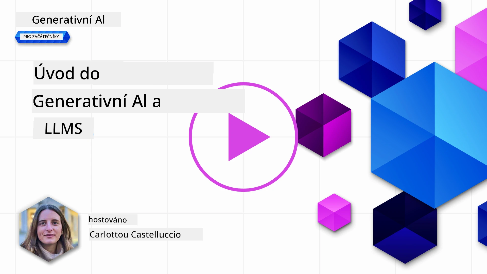
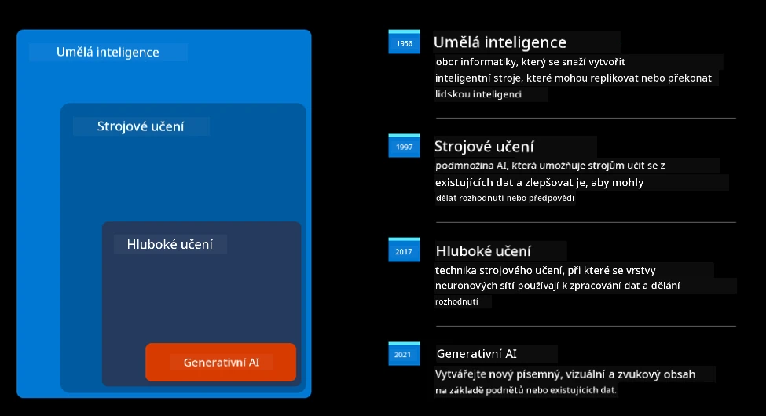
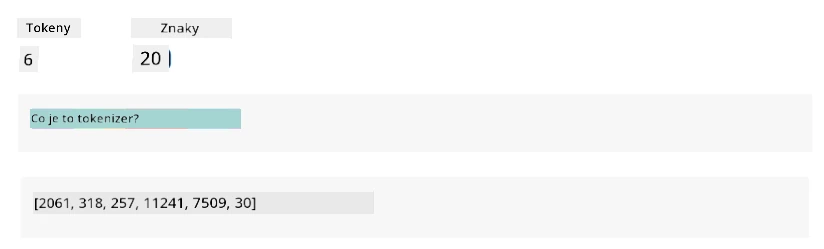
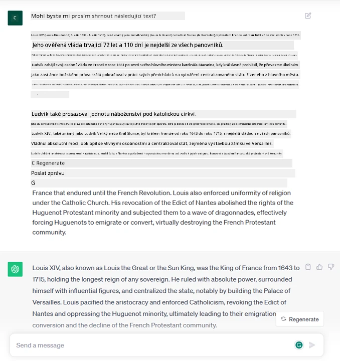
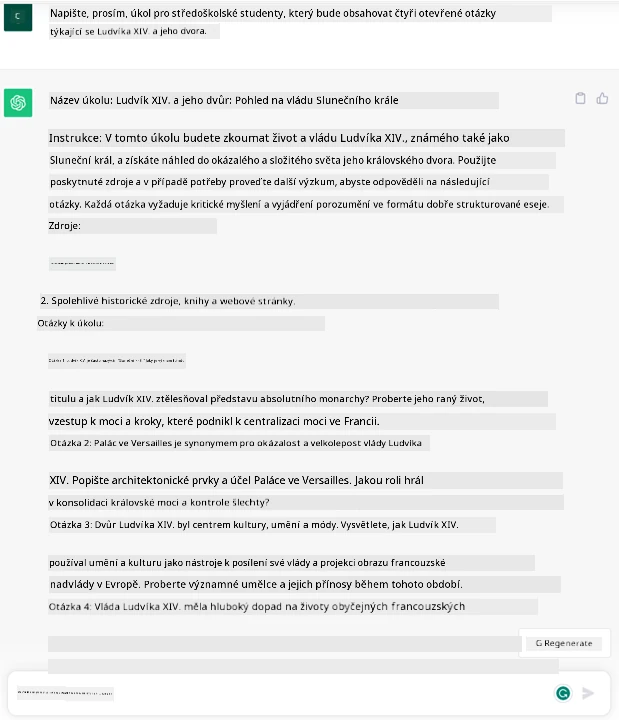
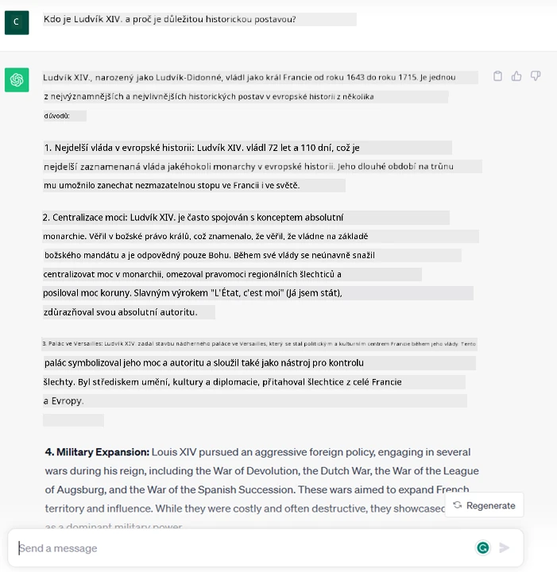
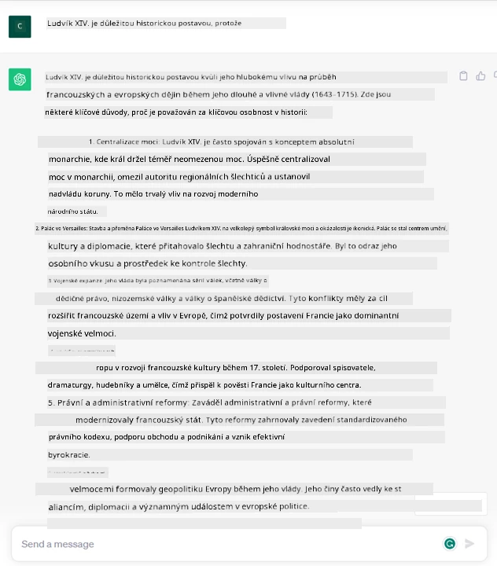
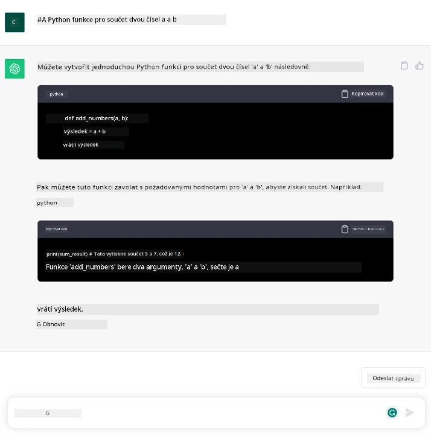

# Úvod do generativní AI a velkých jazykových modelů

_(Klikněte na obrázek výše pro zhlédnutí videa této lekce)_

Generativní AI je umělá inteligence schopná generovat text, obrázky a další typy obsahu. To, co ji činí skvělou technologií, je, že demokratizuje AI - kdokoli ji může použít jen s textovým promptem, větou napsanou v přirozeném jazyce. Nemusíte se učit jazyk jako Java nebo SQL, abyste něco hodnotného dokázali, stačí použít svůj jazyk, napsat, co chcete, a dostanete návrh od AI modelu. Použití a dopad této technologie je obrovský: píšete nebo chápete reporty, vytváříte aplikace a mnohem více, vše během sekund.

V tomto kurzu prozkoumáme, jak náš startup využívá generativní AI pro odemykání nových scénářů ve světě vzdělávání a jak řešíme nevyhnutelné výzvy spojené se sociálními dopady jejího použití a technologickými omezeními.

## Úvod

Tato lekce pokryje:

- Úvod do obchodního scénáře: naše idea a mise startupu.
- Generativní AI a jak jsme se dostali k současnému technologickému stavu.
- Vnitřní fungování velkého jazykového modelu.
- Hlavní schopnosti a praktické případy použití velkých jazykových modelů.

## Cíle učení

Po dokončení této lekce budete rozumět:

- Co je generativní AI a jak fungují velké jazykové modely.
- Jak můžete využít velké jazykové modely pro různé případy použití, se zaměřením na vzdělávací scénáře.

## Scénář: náš vzdělávací startup

Generativní umělá inteligence (AI) představuje vrchol technologie AI, posouvajíc hranice toho, co bylo dříve považováno za nemožné. Generativní AI modely mají mnoho schopností a aplikací, ale v tomto kurzu se zaměříme na to, jak revolucionalizují vzdělávání prostřednictvím fiktivního startupu, který budeme nazývat _náš startup_. Náš startup působí v oblasti vzdělávání s ambiciózním posláním

> _zlepšovat dostupnost vzdělávání na globální úrovni, zajišťovat rovný přístup ke vzdělání a poskytovat personalizované vzdělávací zážitky každému studentovi podle jeho potřeb_.

Náš tým si je vědom, že tohoto cíle nelze dosáhnout bez využití jednoho z nejsilnějších nástrojů moderní doby – velkých jazykových modelů (LLMs).

Očekává se, že generativní AI revolucionalizuje způsob, jakým se dnes učíme a vyučujeme, kdy studenti mají k dispozici virtuální učitele 24 hodin denně, kteří poskytují obrovské množství informací a příkladů, a učitelé mohou využívat inovativní nástroje k hodnocení studentů a poskytování zpětné vazby.

Na začátek si definujme základní pojmy a terminologii, kterou budeme v průběhu kurzu používat.

## Jak jsme se dostali k Generativní AI?

Navzdory mimořádnému _hype_, který generovaly nedávné oznámení generativních AI modelů, tato technologie je ve vývoji desítky let, přičemž první výzkumy sahají do 60. let. Dnes jsme na úrovni AI s lidskými kognitivními schopnostmi, jako je konverzace, jak dokládají například [OpenAI ChatGPT](https://openai.com/chatgpt) nebo [Microsoft Copilot](https://copilot.microsoft.com/?WT.mc_id=academic-105485-koreyst), který také používá GPT model pro svou konverzační webovou vyhledávací zkušenost.

Trochu zpět, první prototypy AI sestávaly z psaných chatbotů, které se spoléhaly na znalostní bázi extrahovanou od skupiny expertů a reprezentovanou v počítači. Odpovědi ve znalostní bázi byly spouštěny klíčovými slovy obsaženými v textovém vstupu.
Brzy však bylo jasné, že tento přístup, používající psané chatboty, není škálovatelný.

### Statistický přístup k AI: strojové učení

Obrat nastal v 90. letech zavedením statistického přístupu k analýze textu. Ten vedl k vývoji nových algoritmů - známých jako strojové učení - schopných učit se vzory z dat bez explicitního programování. Tento přístup umožňuje strojům simulovat porozumění lidskému jazyku: statistický model je trénován na párech text-štítek, což umožňuje modelu klasifikovat neznámý vstupní text s předem definovaným štítkem představujícím záměr zprávy.

### Neuronové sítě a moderní virtuální asistenti

V posledních letech technologický vývoj hardwaru, schopného zvládat větší objemy dat a složitější výpočty, podnítil výzkum v oblasti AI a vedl k vývoji pokročilých algoritmů strojového učení známých jako neuronové sítě nebo hluboké učení.

Neuronové sítě (zejména rekurentní neuronové sítě – RNN) výrazně zlepšily zpracování přirozeného jazyka tím, že umožnily reprezentovat význam textu smysluplnějším způsobem, a to oceněním kontextu slova ve větě.

Tato technologie poháněla virtuální asistenty narozené v první dekádě nového století, velmi zdatné v interpretaci lidského jazyka, identifikaci potřeby a provádění činnosti, která ji uspokojuje – například odpověď předdefinovaným skriptem nebo využití služby třetí strany.

### Současnost, generativní AI

Tak jsme se dostali k dnešní generativní AI, která může být chápána jako podmnožina hlubokého učení.

Po desetiletích výzkumu v oblasti AI nová architektura modelu – nazvaná _Transformer_ – překonala omezení RNN tím, že dokáže zpracovat mnohem delší sekvence textu jako vstup. Transformery jsou založeny na mechanismu pozornosti, který umožňuje modelu dávat různou váhu vstupům, 'věnovat větší pozornost' tam, kde je soustředěna nejdůležitější informace, bez ohledu na jejich pořadí v textové sekvenci.

Většina nedávných generativních AI modelů – známých také jako velké jazykové modely (LLMs), protože pracují s textovými vstupy a výstupy – je skutečně založena na této architektuře. Co je zajímavé na těchto modelech, které jsou trénovány na obrovském množství neoznačených dat z různých zdrojů jako knihy, články a webové stránky – je, že je lze přizpůsobit širokému spektru úkolů a generovat gramaticky správný text s nádechem kreativity. Takže nejenže výrazně zlepšily schopnost stroje 'rozumět' vstupnímu textu, ale umožnily i generování originální odpovědi v lidském jazyce.

## Jak fungují velké jazykové modely?

V následující kapitole budeme zkoumat různé typy generativních AI modelů, ale nyní si pojďme představit, jak fungují velké jazykové modely, se zaměřením na modely OpenAI GPT (Generative Pre-trained Transformer).

- **Tokenizer, text na čísla**: Velké jazykové modely přijímají text jako vstup a generují text jako výstup. Jako statistické modely však lépe pracují s čísly než s textovými sekvencemi. Proto je každý vstup před použitím v jádru modelu zpracován tokenizerem. Token je úsek textu – složený z proměnného počtu znaků, takže hlavním úkolem tokenizeru je rozdělit vstup do pole tokenů. Každý token je pak mapován na index tokenu, což je celočíselné kódování původního úseku textu.

- **Predikce výstupních tokenů**: Model dostane n tokenů jako vstup (s maximálním n lišícím se model od modelu) a dokáže na výstup predikovat jeden token. Tento token je pak začleněn do vstupu další iterace v rozšiřujícím okně, což umožňuje lepší uživatelský zážitek získání jedné (nebo více) vět jako odpovědi. To vysvětluje, proč pokud někdy pracujete s ChatGPT, může se zdát, že občas přestane uprostřed věty.

- **Proces výběru, pravděpodobnostní rozdělení**: Výstupní token vybírá model na základě pravděpodobnosti jeho výskytu po aktuální textové sekvenci. Model odhaduje pravděpodobnostní rozdělení pro všechny možné „následující tokeny“ získané z tréninku. Ne vždy však je z rozdělení vybrán token s nejvyšší pravděpodobností. Do výběru je přidána určitá náhodnost tak, že model jedná nedeterministicky – nedostaneme stejný výstup pro stejný vstup. Tato náhodnost simuluje proces kreativního myšlení a může být řízena parametrem modelu nazývaným teplota (temperature).

## Jak může náš startup využít velké jazykové modely?

Teď, když lépe rozumíme vnitřnímu fungování velkého jazykového modelu, podívejme se na některé praktické příklady běžných úkolů, které zvládají velmi dobře, s ohledem na náš obchodní scénář.
Řekli jsme, že hlavní schopností velkého jazykového modelu je _generování textu od nuly, vycházejícího ze vstupu napsaného v přirozeném jazyce_.

Ale jaký typ textového vstupu a výstupu?
Vstup velkého jazykového modelu se nazývá prompt, zatímco výstup je completion, což je termín odkazující na mechanismus modelu generovat další token k doplnění aktuálního vstupu. Podíváme se podrobněji na to, co je prompt a jak ho navrhnout tak, abychom z modelu získali co nejvíce. Prozatím však řekněme, že prompt může obsahovat:

- **Instrukci** určující typ výstupu, který od modelu očekáváme. Tato instrukce může někdy obsahovat příklady nebo další data.

  1. Shrnutí článku, knihy, recenzí produktů a další, včetně extrakce poznatků z nestrukturovaných dat.
    
    
  
  2. Kreativní nápady a návrhy článku, eseje, zadání a dalších.
      
     

- **Otázku** položenou ve formě konverzace s agentem.
  
  

- Úsek **textu k doplnění**, což implicitně znamená žádost o pomoc s psaním.
  
  

- Úsek **kódu** spolu se žádostí o vysvětlení a dokumentaci, nebo komentář žádající vygenerovat kus kódu vykonávající specifický úkol.
  
  

Výše uvedené příklady jsou poměrně jednoduché a nemají sloužit jako vyčerpávající demonstrace schopností velkých jazykových modelů. Mají ukázat potenciál generativní AI, zejména, ale nejen v kontextech vzdělávání.

Také je třeba říci, že výstup generativního AI modelu není dokonalý a někdy může jeho kreativita pracovat proti němu, což vede k výstupu, který je kombinací slov, jež uživatel může vnímat jako mystifikaci reality nebo dokonce urážlivý. Generativní AI není inteligentní – alespoň ne ve smyslu komplexního pojetí inteligence zahrnující kritické a kreativní myšlení nebo emoční inteligenci; není deterministická a není spolehlivá, protože se mohou kombinovat falešné informace, například chybné odkazy, obsah a tvrzení, s pravdivými daty, prezentované přesvědčivě a sebevědomě. V následujících lekcích budeme tato omezení řešit a uvidíme, co pro jejich zmírnění můžeme udělat.

## Zadání

Vaším úkolem je prostudovat více o [generativní AI](https://en.wikipedia.org/wiki/Generative_artificial_intelligence?WT.mc_id=academic-105485-koreyst) a pokusit se identifikovat oblast, kde byste dnes přidali generativní AI tam, kde ještě není. Jaký by byl dopad oproti "starému způsobu"? Můžete dělat něco, co předtím nebylo možné, nebo jste rychlejší? Napište 300 slov shrnutí, jak by vypadal váš vysněný AI startup, včetně nadpisů jako "Problém", "Jak bych použil AI", "Dopad" a volitelně i obchodní plán.

Pokud tento úkol splníte, můžete být dokonce připraveni podat žádost do inkubátoru Microsoftu, [Microsoft for Startups Founders Hub](https://www.microsoft.com/startups?WT.mc_id=academic-105485-koreyst), kde nabízíme kredity na Azure, OpenAI, mentoring a mnoho dalšího, podívejte se na to!

## Kontrola znalostí

Co je pravda o velkých jazykových modelech?

1. Dostanete pokaždé přesně stejnou odpověď.
1. Dělají věci perfektně, jsou skvělí v sčítání čísel, generování funkčního kódu atd.
1. Odpovědi se mohou lišit i při stejném promptu. Jsou také skvělí pro získání první verze něčeho, ať už textu nebo kódu. Výsledky ale je potřeba dále upravovat.

Odpověď: 3, LLM je nedeterministický, odpovědi se liší, ale variabilitu lze ovládat nastavením teploty. Neměli bychom od něj očekávat perfektní výsledky, je tu proto, aby zvládal náročné úkoly, což často znamená získání dobrého prvního pokusu, který je třeba postupně vylepšovat.

## Výborně! Pokračujte dále

Po dokončení této lekce si prohlédněte naši [kolekci učení o generativní AI](https://aka.ms/genai-collection?WT.mc_id=academic-105485-koreyst), abyste dále rozšiřovali své znalosti generativní AI!

Přejděte do Lekce 2, kde se podíváme, jak [prozkoumat a porovnat různé typy LLM](../02-exploring-and-comparing-different-llms/README.md?WT.mc_id=academic-105485-koreyst)!

---

<!-- CO-OP TRANSLATOR DISCLAIMER START -->
**Prohlášení o omezení odpovědnosti**:
Tento dokument byl přeložen pomocí AI překladatelské služby [Co-op Translator](https://github.com/Azure/co-op-translator). Přestože usilujeme o co největší přesnost, mějte prosím na paměti, že automatizované překlady mohou obsahovat chyby nebo nepřesnosti. Originální dokument v jeho mateřském jazyce by měl být považován za autoritativní zdroj. Pro kritické informace se doporučuje profesionální lidský překlad. Nejsme odpovědní za jakékoli nedorozumění nebo nesprávné interpretace vzniklé použitím tohoto překladu.
<!-- CO-OP TRANSLATOR DISCLAIMER END -->