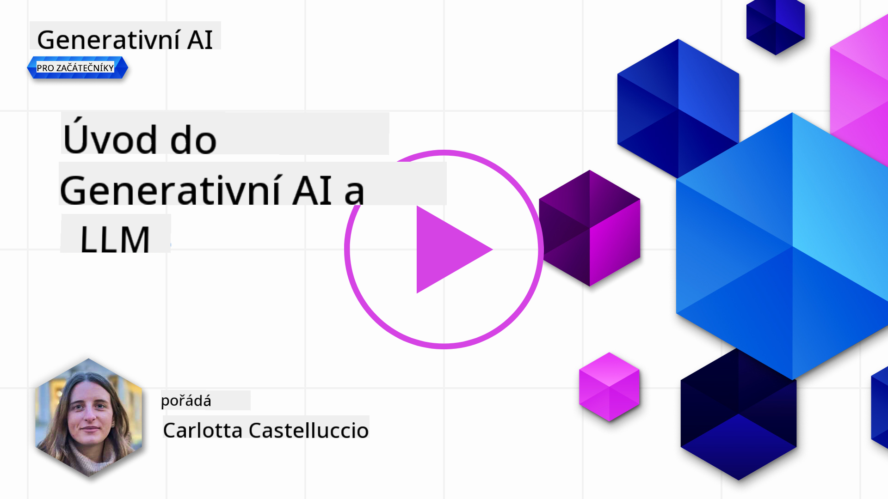
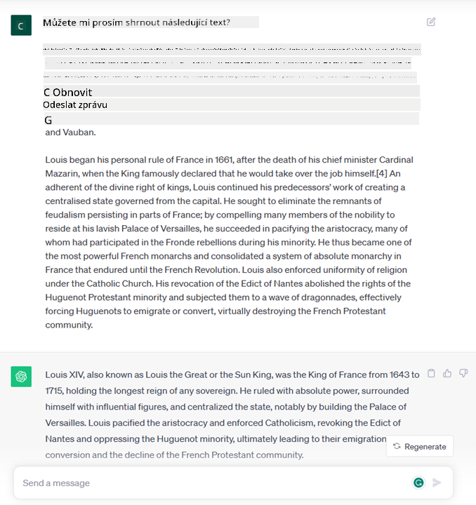
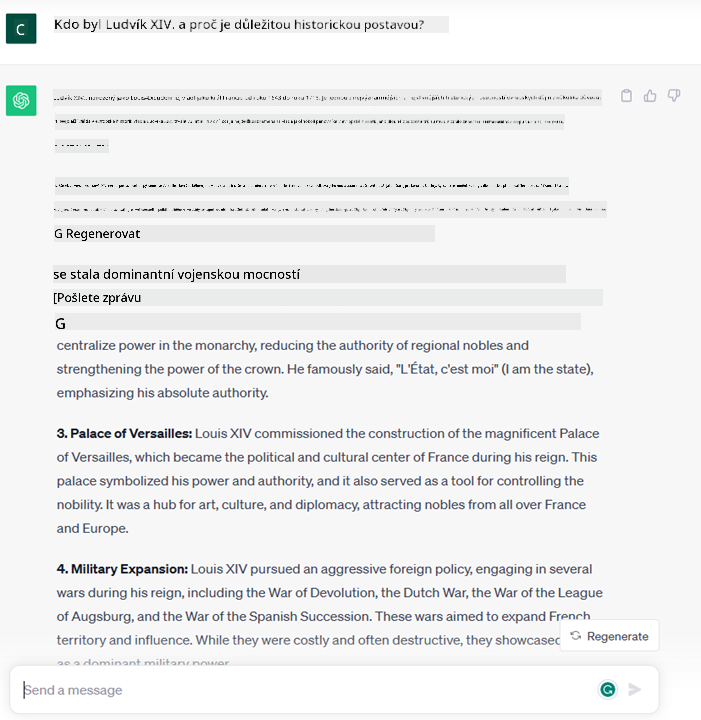
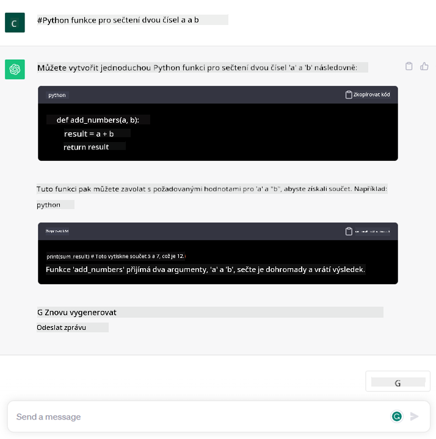

<!--
CO_OP_TRANSLATOR_METADATA:
{
  "original_hash": "bfb7901bdbece1ba3e9f35c400ca33e8",
  "translation_date": "2025-10-17T21:42:40+00:00",
  "source_file": "01-introduction-to-genai/README.md",
  "language_code": "cs"
}
-->
# Úvod do generativní AI a velkých jazykových modelů

_(Klikněte na obrázek výše pro zhlédnutí videa této lekce)_

Generativní AI je umělá inteligence schopná generovat text, obrázky a další typy obsahu. Co ji činí fantastickou technologií, je její schopnost demokratizovat AI – kdokoli ji může používat s minimálním úsilím, stačí zadat textový podnět, větu napsanou v přirozeném jazyce. Nemusíte se učit programovací jazyky jako Java nebo SQL, abyste dosáhli něčeho hodnotného – stačí použít svůj jazyk, říct, co chcete, a AI model vám nabídne návrh. Aplikace a dopad této technologie jsou obrovské – můžete psát nebo rozumět zprávám, vytvářet aplikace a mnoho dalšího, a to vše během několika sekund.

V tomto kurzu prozkoumáme, jak naše startupová společnost využívá generativní AI k odemykání nových scénářů ve světě vzdělávání a jak se vypořádáváme s nevyhnutelnými výzvami spojenými se sociálními dopady jejího použití a technologickými omezeními.

## Úvod

Tato lekce pokryje:

- Úvod do obchodního scénáře: naše startupová myšlenka a mise.
- Generativní AI a jak jsme se dostali k současnému technologickému prostředí.
- Vnitřní fungování velkého jazykového modelu.
- Hlavní schopnosti a praktické případy použití velkých jazykových modelů.

## Cíle učení

Po dokončení této lekce budete rozumět:

- Co je generativní AI a jak fungují velké jazykové modely.
- Jak můžete využít velké jazykové modely pro různé případy použití, se zaměřením na vzdělávací scénáře.

## Scénář: náš vzdělávací startup

Generativní umělá inteligence (AI) představuje vrchol technologie AI, posouvající hranice toho, co bylo kdysi považováno za nemožné. Generativní AI modely mají mnoho schopností a aplikací, ale v tomto kurzu prozkoumáme, jak revolucionalizují vzdělávání prostřednictvím fiktivního startupu. Tento startup budeme nazývat _náš startup_. Náš startup působí v oblasti vzdělávání s ambiciózním posláním:

> _zlepšit přístupnost k učení na globální úrovni, zajistit rovný přístup ke vzdělání a poskytovat personalizované vzdělávací zkušenosti každému studentovi podle jeho potřeb_.

Tým našeho startupu si je vědom, že tohoto cíle nedosáhneme bez využití jednoho z nejmocnějších nástrojů moderní doby – velkých jazykových modelů (LLMs).

Generativní AI má potenciál revolucionalizovat způsob, jakým se dnes učíme a vyučujeme, kdy studenti mají k dispozici virtuální učitele 24 hodin denně, kteří poskytují obrovské množství informací a příkladů, a učitelé mohou využívat inovativní nástroje k hodnocení svých studentů a poskytování zpětné vazby.

Začněme definováním některých základních pojmů a terminologie, které budeme používat v průběhu kurzu.

## Jak jsme se dostali k generativní AI?

Navzdory mimořádnému _hype_, který byl nedávno vytvořen oznámením generativních AI modelů, je tato technologie výsledkem desetiletí výzkumu, přičemž první výzkumné snahy sahají až do 60. let. Nyní jsme v bodě, kdy AI má lidské kognitivní schopnosti, jako je konverzace, což ukazují například [OpenAI ChatGPT](https://openai.com/chatgpt) nebo [Bing Chat](https://www.microsoft.com/edge/features/bing-chat?WT.mc_id=academic-105485-koreyst), který také používá model GPT pro konverzace při webovém vyhledávání.

Pokud se vrátíme trochu zpět, první prototypy AI sestávaly z psaných chatbotů, které se opíraly o znalostní bázi získanou od skupiny odborníků a reprezentovanou v počítači. Odpovědi v této znalostní bázi byly aktivovány klíčovými slovy objevujícími se ve vstupním textu. Brzy se však ukázalo, že takový přístup, využívající psané chatboty, není dobře škálovatelný.

### Statistický přístup k AI: strojové učení

Zlom nastal v 90. letech, kdy se začal aplikovat statistický přístup k analýze textu. To vedlo k vývoji nových algoritmů – známých jako strojové učení – schopných se učit vzory z dat bez explicitního programování. Tento přístup umožňuje strojům simulovat porozumění lidskému jazyku: statistický model je trénován na párování text-štítek, což modelu umožňuje klasifikovat neznámý vstupní text s předem definovaným štítkem reprezentujícím záměr zprávy.

### Neuronové sítě a moderní virtuální asistenti

V posledních letech technologický vývoj hardwaru, schopného zpracovávat větší množství dat a složitější výpočty, podpořil výzkum v oblasti AI, což vedlo k vývoji pokročilých algoritmů strojového učení známých jako neuronové sítě nebo algoritmy hlubokého učení.

Neuronové sítě (a zejména rekurentní neuronové sítě – RNN) významně zlepšily zpracování přirozeného jazyka, umožňující reprezentaci významu textu smysluplnějším způsobem, který zohledňuje kontext slova ve větě.

Tato technologie poháněla virtuální asistenty, které se objevily v první dekádě nového století, velmi schopné interpretovat lidský jazyk, identifikovat potřebu a provést akci k jejímu uspokojení – například odpovědět předem definovaným skriptem nebo využít službu třetí strany.

### Současnost, generativní AI

Tak jsme se dostali k dnešní generativní AI, kterou lze považovat za podmnožinu hlubokého učení.

Po desetiletích výzkumu v oblasti AI nová architektura modelu – nazvaná _Transformer_ – překonala limity RNN, protože dokáže přijímat mnohem delší sekvence textu jako vstup. Transformery jsou založeny na mechanismu pozornosti, který umožňuje modelu přidělovat různé váhy vstupům, které přijímá, a „věnovat větší pozornost“ tam, kde je soustředěna nejrelevantnější informace, bez ohledu na jejich pořadí v textové sekvenci.

Většina nedávných generativních AI modelů – známých také jako velké jazykové modely (LLMs), protože pracují s textovými vstupy a výstupy – je skutečně založena na této architektuře. Zajímavé na těchto modelech – trénovaných na obrovském množství neoznačených dat z různých zdrojů, jako jsou knihy, články a webové stránky – je, že mohou být přizpůsobeny široké škále úkolů a generovat gramaticky správný text s náznakem kreativity. Takže nejenže neuvěřitelně zlepšily schopnost stroje „rozumět“ vstupnímu textu, ale umožnily jeho schopnost generovat originální odpověď v lidském jazyce.

## Jak fungují velké jazykové modely?

V další kapitole prozkoumáme různé typy generativních AI modelů, ale prozatím se podívejme na to, jak fungují velké jazykové modely, se zaměřením na modely OpenAI GPT (Generative Pre-trained Transformer).

- **Tokenizér, text na čísla**: Velké jazykové modely přijímají text jako vstup a generují text jako výstup. Nicméně, protože jsou statistické modely, pracují mnohem lépe s čísly než s textovými sekvencemi. Proto je každý vstup do modelu zpracován tokenizérem, než je použit hlavním modelem. Token je část textu – skládající se z proměnného počtu znaků, takže hlavním úkolem tokenizéru je rozdělit vstup na pole tokenů. Poté je každý token mapován na index tokenu, což je číselné kódování původního textového úseku.

- **Predikce výstupních tokenů**: Na základě n tokenů jako vstupu (s maximálním n, které se liší od modelu k modelu) je model schopen předpovědět jeden token jako výstup. Tento token je poté začleněn do vstupu další iterace, v rozšiřujícím se vzoru okna, což umožňuje lepší uživatelskou zkušenost získání jedné (nebo více) věty jako odpovědi. To vysvětluje, proč, pokud jste si někdy hráli s ChatGPT, jste si možná všimli, že někdy vypadá, jako by se zastavil uprostřed věty.

- **Proces výběru, pravděpodobnostní rozdělení**: Výstupní token je vybrán modelem podle jeho pravděpodobnosti výskytu po aktuální textové sekvenci. To je proto, že model předpovídá pravděpodobnostní rozdělení všech možných „dalších tokenů“, vypočítané na základě jeho tréninku. Nicméně, ne vždy je vybrán token s nejvyšší pravděpodobností z výsledného rozdělení. Do tohoto výběru je přidána určitá míra náhodnosti, aby model jednal nedeterministickým způsobem – nedostaneme přesně stejný výstup pro stejný vstup. Tato míra náhodnosti je přidána k simulaci procesu kreativního myšlení a může být nastavena pomocí parametru modelu nazývaného teplota.

## Jak může náš startup využít velké jazykové modely?

Nyní, když máme lepší pochopení vnitřního fungování velkého jazykového modelu, podívejme se na některé praktické příklady nejběžnějších úkolů, které mohou vykonávat velmi dobře, s ohledem na náš obchodní scénář. Řekli jsme, že hlavní schopností velkého jazykového modelu je _generování textu od nuly, počínaje textovým vstupem napsaným v přirozeném jazyce_.

Ale jaký typ textového vstupu a výstupu?
Vstup velkého jazykového modelu je známý jako podnět (prompt), zatímco výstup je známý jako dokončení (completion), což odkazuje na mechanismus modelu generování dalšího tokenu k dokončení aktuálního vstupu. Podrobněji se podíváme na to, co je podnět a jak ho navrhnout tak, aby z modelu bylo možné získat co nejvíce. Prozatím si řekněme, že podnět může zahrnovat:

- **Instrukci** specifikující typ výstupu, který od modelu očekáváme. Tato instrukce může někdy obsahovat příklady nebo další data.

  1. Shrnutí článku, knihy, recenzí produktů a další, spolu s extrakcí poznatků z nestrukturovaných dat.
    
    
  
  2. Kreativní nápady a návrhy článků, esejí, úkolů a dalších.
      
     

- **Otázku**, položenou formou konverzace s agentem.
  
  

- Úsek **textu k dokončení**, což implicitně znamená žádost o pomoc s psaním.
  
  

- Úsek **kódu** spolu s žádostí o jeho vysvětlení a dokumentaci, nebo komentář žádající o generování části kódu, která provádí konkrétní úkol.
  
  

Výše uvedené příklady jsou poměrně jednoduché a nejsou zamýšleny jako vyčerpávající demonstrace schopností velkých jazykových modelů. Mají za cíl ukázat potenciál využití generativní AI, zejména, ale nejen, v kontextu vzdělávání.

Navíc výstup generativního AI modelu není dokonalý a někdy může kreativita modelu působit proti němu, což vede k výstupu, který je kombinací slov, jež lidský uživatel může interpretovat jako zkreslení reality, nebo může být urážlivý. Generativní AI není inteligentní – alespoň ne v komplexním smyslu inteligence, zahrnující kritické a kreativní myšlení nebo emocionální inteligenci; není deterministická a není zcela důvěryhodná, protože může kombinovat nesprávné odkazy, obsah a tvrzení se správnými informacemi a prezentovat je přesvědčivým a sebevědomým způsobem. V následujících lekcích se budeme zabývat všemi těmito omezeními a uvidíme, co můžeme udělat pro jejich zmírnění.

## Úkol

Vaším úkolem je přečíst si více o [generativní AI](https://en.wikipedia.org/wiki/Generative_artificial_intelligence?WT.mc_id=academic-105485-koreyst) a pokusit se identifikovat oblast, kde byste dnes mohli přidat generativní AI, která ji zatím nevyužívá. Jaký by byl rozdíl oproti "starému způsobu", mohli byste udělat něco, co dříve nebylo možné, nebo byste byli rychlejší? Napište 300 slovní shrnutí o tom, jak by vypadala vaše vysněná AI startupová společnost, a zahrňte nadpisy jako "Problém", "Jak bych použil AI", "Dopad" a případně obchodní plán.

Pokud tento úkol splníte, možná budete připraveni přihlásit se do inkubátoru Microsoftu, [Microsoft for Startups Founders Hub](https://www.microsoft.com/startups?WT.mc_id=academic-105485-koreyst), kde nabízíme kredity na Azure, OpenAI, mentoring a mnoho dalšího, podívejte se na to!

## Kontrola znalostí

Co je pravda o velkých jazykových modelech?

1. Dostanete pokaždé stejnou odpověď.
2. Dělá věci perfektně, skvěle sčítá čísla, vytváří funkční kód atd.
3. Odpověď se může lišit i při použití stejného podnětu. Je také skvělý na vytvoření prvního návrhu něčeho, ať už textu nebo kódu. Ale výsledky je třeba zlepšit.

A: 3, LLM je nedeterministický, odpověď se liší, nicméně jeho variabilitu můžete ovládat pomocí nastavení teploty. Neměli byste také očekávat, že bude dělat věci perfektně, je tu proto, aby za vás udělal těžkou práci, což často znamená, že dostanete dobrý první pokus, který je třeba postupně vylepšit.

## Skvělá práce! Pokračujte v cestě

Po dokončení této lekce se podívejte na naši [sbírku učení o generativní AI](https://aka.ms/genai-collection?WT.mc_id=academic-105485-koreyst), abyste dále rozvíjeli své znalosti o generativní AI!
Přejděte na Lekci 2, kde se podíváme na to, jak [prozkoumat a porovnat různé typy LLM](../02-exploring-and-comparing-different-llms/README.md?WT.mc_id=academic-105485-koreyst)!

---

**Prohlášení**:  
Tento dokument byl přeložen pomocí služby AI pro překlady [Co-op Translator](https://github.com/Azure/co-op-translator). Ačkoli se snažíme o přesnost, mějte prosím na paměti, že automatizované překlady mohou obsahovat chyby nebo nepřesnosti. Původní dokument v jeho původním jazyce by měl být považován za autoritativní zdroj. Pro důležité informace se doporučuje profesionální lidský překlad. Neodpovídáme za žádná nedorozumění nebo nesprávné interpretace vyplývající z použití tohoto překladu.