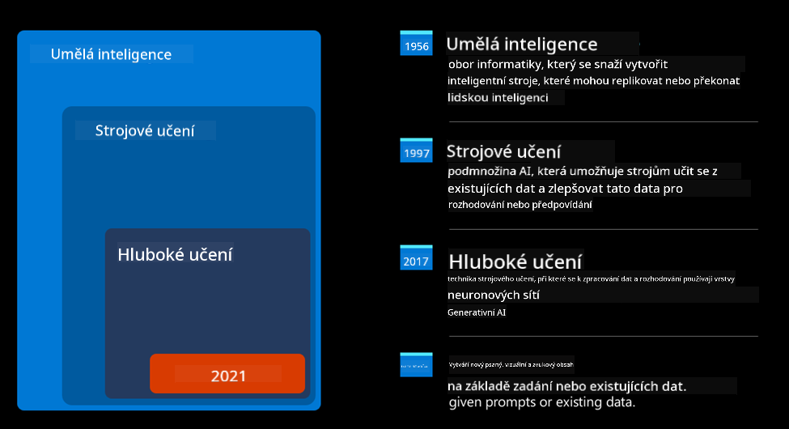
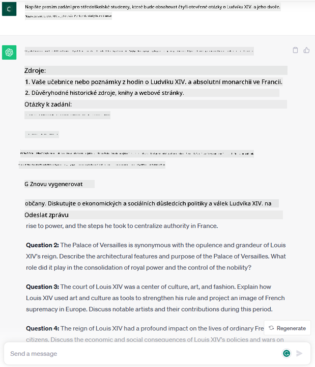
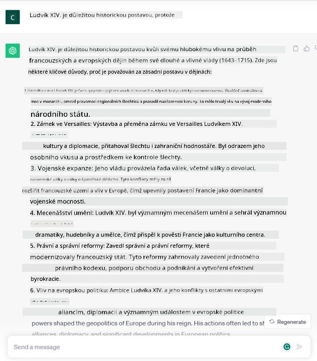

<!--
CO_OP_TRANSLATOR_METADATA:
{
  "original_hash": "f53ba0fa49164f9323043f1c6b11f2b1",
  "translation_date": "2025-07-09T08:00:46+00:00",
  "source_file": "01-introduction-to-genai/README.md",
  "language_code": "cs"
}
-->
# Úvod do generativní AI a velkých jazykových modelů

_(Klikněte na obrázek výše pro zhlédnutí videa této lekce)_

Generativní AI je umělá inteligence schopná vytvářet text, obrázky a další typy obsahu. Co ji činí skvělou technologií, je fakt, že demokratizuje AI – kdokoliv ji může používat jen s jednoduchým textovým pokynem, větou napsanou v přirozeném jazyce. Nemusíte se učit jazyky jako Java nebo SQL, abyste dosáhli něčeho užitečného, stačí použít svůj jazyk, říct, co chcete, a AI model vám nabídne návrh. Aplikace a dopad jsou obrovské – píšete nebo rozumíte zprávám, vytváříte aplikace a mnohem více, a to vše během několika sekund.

V tomto kurzu prozkoumáme, jak náš startup využívá generativní AI k otevírání nových možností ve světě vzdělávání a jak řešíme nevyhnutelné výzvy spojené se sociálními dopady jejího použití a technologickými omezeními.

## Úvod

Tato lekce pokryje:

- Úvod do obchodního scénáře: náš nápad na startup a mise.
- Generativní AI a jak jsme se dostali k současnému technologickému prostředí.
- Vnitřní fungování velkého jazykového modelu.
- Hlavní schopnosti a praktické případy použití velkých jazykových modelů.

## Cíle učení

Po dokončení této lekce budete rozumět:

- Co je generativní AI a jak fungují velké jazykové modely.
- Jak můžete využít velké jazykové modely pro různé případy použití, se zaměřením na vzdělávací scénáře.

## Scénář: náš vzdělávací startup

Generativní umělá inteligence (AI) představuje vrchol AI technologie, posouvající hranice toho, co bylo dříve považováno za nemožné. Generativní AI modely mají řadu schopností a aplikací, ale v tomto kurzu se zaměříme na to, jak revolucionalizují vzdělávání prostřednictvím fiktivního startupu. Tento startup budeme nazývat _náš startup_. Náš startup působí ve vzdělávací oblasti s ambiciózním posláním

> _zlepšovat přístupnost vzdělávání na globální úrovni, zajišťovat rovný přístup ke vzdělání a poskytovat personalizované vzdělávací zkušenosti každému studentovi podle jeho potřeb_.

Náš tým si je vědom, že tohoto cíle nedosáhneme bez využití jednoho z nejsilnějších nástrojů moderní doby – velkých jazykových modelů (LLM).

Očekává se, že generativní AI změní způsob, jakým dnes učíme a učíme se, kdy studenti budou mít k dispozici virtuální učitele 24 hodin denně, kteří poskytnou obrovské množství informací a příkladů, a učitelé budou moci využívat inovativní nástroje k hodnocení svých studentů a poskytování zpětné vazby.

Nejprve si definujme základní pojmy a terminologii, kterou budeme v kurzu používat.

## Jak jsme se dostali k generativní AI?

Navzdory obrovskému _hype_, který v poslední době vyvolalo oznámení generativních AI modelů, je tato technologie výsledkem desetiletí výzkumu, přičemž první snahy sahají až do 60. let. Dnes jsme na úrovni AI s lidskými kognitivními schopnostmi, jako je konverzace, jak ukazují například [OpenAI ChatGPT](https://openai.com/chatgpt) nebo [Bing Chat](https://www.microsoft.com/edge/features/bing-chat?WT.mc_id=academic-105485-koreyst), který také využívá GPT model pro konverzace při vyhledávání na webu Bing.

Trochu zpět – první prototypy AI byly psané chatovací roboty, které se spoléhaly na znalostní bázi vytvořenou skupinou expertů a reprezentovanou v počítači. Odpovědi v této bázi byly vyvolávány klíčovými slovy v zadaném textu. Brzy však bylo jasné, že takový přístup s psanými chatboty není škálovatelný.

### Statistický přístup k AI: strojové učení

Zlom nastal v 90. letech, kdy se začal používat statistický přístup k analýze textu. To vedlo k vývoji nových algoritmů – známých jako strojové učení – které jsou schopné se učit vzory z dat bez explicitního programování. Tento přístup umožňuje strojům simulovat porozumění lidskému jazyku: statistický model je trénován na párech text-štítek, což mu umožňuje klasifikovat neznámý vstupní text podle předem definovaného štítku, který reprezentuje záměr zprávy.

### Neuronové sítě a moderní virtuální asistenti

V posledních letech technologický vývoj hardwaru, schopného zpracovávat větší množství dat a složitější výpočty, podpořil výzkum v AI, což vedlo k vývoji pokročilých algoritmů strojového učení známých jako neuronové sítě nebo hluboké učení.

Neuronové sítě (zejména rekurentní neuronové sítě – RNN) výrazně zlepšily zpracování přirozeného jazyka, umožňující lépe reprezentovat význam textu, přičemž zohledňují kontext slova ve větě.

Tato technologie poháněla virtuální asistenty narozené v první dekádě nového tisíciletí, kteří byli velmi zdatní v interpretaci lidského jazyka, identifikaci potřeby a vykonání akce k jejímu uspokojení – například odpovědí podle předem definovaného scénáře nebo využitím služby třetí strany.

### Současnost, generativní AI

Tak jsme se dostali k dnešní generativní AI, kterou lze považovat za podmnožinu hlubokého učení.

Po desetiletích výzkumu v oblasti AI nová architektura modelu – nazvaná _Transformer_ – překonala omezení RNN tím, že dokáže zpracovat mnohem delší textové sekvence jako vstup. Transformery jsou založeny na mechanismu pozornosti, který umožňuje modelu přiřazovat různou váhu vstupům, „věnovat větší pozornost“ tam, kde je soustředěna nejrelevantnější informace, bez ohledu na jejich pořadí v textové sekvenci.

Většina nedávných generativních AI modelů – také známých jako velké jazykové modely (LLM), protože pracují s textovými vstupy a výstupy – je založena právě na této architektuře. Zajímavé na těchto modelech je, že jsou trénovány na obrovském množství neoznačených dat z různých zdrojů, jako jsou knihy, články a webové stránky, a lze je přizpůsobit široké škále úkolů a generovat gramaticky správný text s nádechem kreativity. Takže nejenže výrazně zlepšily schopnost stroje „rozumět“ vstupnímu textu, ale také umožnily generovat originální odpovědi v lidském jazyce.

## Jak fungují velké jazykové modely?

V další kapitole prozkoumáme různé typy generativních AI modelů, ale nyní se podívejme, jak fungují velké jazykové modely, se zaměřením na OpenAI GPT (Generative Pre-trained Transformer) modely.

- **Tokenizer, převod textu na čísla**: Velké jazykové modely přijímají text jako vstup a generují text jako výstup. Jako statistické modely však pracují mnohem lépe s čísly než s textovými sekvencemi. Proto je každý vstup do modelu nejprve zpracován tokenizérem. Token je úsek textu – skládající se z proměnného počtu znaků, takže hlavním úkolem tokenizéru je rozdělit vstup na pole tokenů. Každý token je pak namapován na token index, což je celočíselné kódování původního textového úseku.

- **Predikce výstupních tokenů**: Model dostane n tokenů jako vstup (maximální n se liší podle modelu) a je schopen předpovědět jeden token jako výstup. Tento token je pak začleněn do vstupu další iterace v rozšiřujícím se okně, což umožňuje lepší uživatelský zážitek, kdy dostanete jednu (nebo více) vět jako odpověď. To vysvětluje, proč pokud jste někdy používali ChatGPT, mohli jste si všimnout, že někdy vypadá, jako by přestal uprostřed věty.

- **Proces výběru, pravděpodobnostní rozdělení**: Výstupní token je vybrán modelem podle pravděpodobnosti jeho výskytu po aktuální textové sekvenci. Model totiž předpovídá pravděpodobnostní rozdělení všech možných „následujících tokenů“ na základě svého tréninku. Nicméně ne vždy je vybrán token s nejvyšší pravděpodobností. Do výběru je přidána určitá míra náhodnosti, takže model funguje nedeterministicky – pro stejný vstup nedostaneme vždy stejný výstup. Tato náhodnost simuluje proces kreativního myšlení a lze ji ladit pomocí parametru modelu nazvaného teplota (temperature).

## Jak může náš startup využít velké jazykové modely?

Nyní, když lépe rozumíme vnitřnímu fungování velkého jazykového modelu, podívejme se na praktické příklady nejběžnějších úkolů, které zvládají velmi dobře, s ohledem na náš obchodní scénář. Řekli jsme, že hlavní schopností velkého jazykového modelu je _generovat text od začátku na základě textového vstupu napsaného v přirozeném jazyce_.

Ale jaký druh textového vstupu a výstupu?
Vstup velkého jazykového modelu se nazývá prompt, zatímco výstup se nazývá completion, což odkazuje na mechanismus modelu generovat další token k doplnění aktuálního vstupu. Podrobně se podíváme na to, co je prompt a jak ho navrhnout, abychom z modelu dostali co nejvíce. Prozatím řekněme, že prompt může obsahovat:

- **Instrukci**, která specifikuje typ výstupu, který od modelu očekáváme. Tato instrukce může někdy obsahovat příklady nebo další data.

  1. Shrnutí článku, knihy, recenzí produktů a další, včetně extrakce poznatků z nestrukturovaných dat.
    
    
  
  2. Kreativní nápady a tvorba článku, eseje, úkolu a další.
      
     

- **Otázku**, položenou formou konverzace s agentem.
  
  

- Úsek **textu k doplnění**, což implicitně znamená žádost o pomoc s psaním.
  
  

- Úsek **kódu** spolu s žádostí o jeho vysvětlení a dokumentaci, nebo komentář žádající o vygenerování kódu pro konkrétní úkol.
  
  

Výše uvedené příklady jsou poměrně jednoduché a nejsou zamýšleny jako vyčerpávající ukázka schopností velkých jazykových modelů. Mají ukázat potenciál využití generativní AI, zejména, ale nejen ve vzdělávacím kontextu.

Výstup generativního AI modelu také není dokonalý a někdy může kreativita modelu pracovat proti němu, což vede k výstupu, který uživatel může vnímat jako zkreslení reality nebo může být urážlivý. Generativní AI není inteligentní – alespoň ne v širším smyslu inteligence, která zahrnuje kritické a kreativní myšlení nebo emoční inteligenci; není deterministická a není zcela spolehlivá, protože může kombinovat nesprávné reference, obsah a tvrzení s pravdivými informacemi a prezentovat je přesvědčivě a sebevědomě. V následujících lekcích se budeme těmito omezeními zabývat a uvidíme, co můžeme udělat pro jejich zmírnění.

## Úkol

Vaším úkolem je přečíst si více o [generativní AI](https://en.wikipedia.org/wiki/Generative_artificial_intelligence?WT.mc_id=academic-105485-koreyst) a pokusit se identifikovat oblast, kde byste dnes přidali generativní AI, která ji zatím nemá. Jaký by byl dopad oproti „starému způsobu“? Můžete dělat něco, co jste předtím nemohli, nebo jste rychlejší? Napište 300 slov shrnutí o tom, jak by vypadal váš vysněný AI startup, a zahrňte nadpisy jako „Problém“, „Jak bych použil AI“, „Dopad“ a volitelně i podnikatelský plán.

Pokud tento úkol splníte, můžete být dokonce připraveni se přihlásit do Microsoftova inkubátoru, [Microsoft for Startups Founders Hub](https://www.microsoft.com/startups?WT.mc_id=academic-105485-koreyst), kde nabízíme kredity na Azure, OpenAI, mentoring a mnoho dalšího, určitě to vyzkoušejte!

## Kontrola znalostí

Co platí o velkých jazykových modelech?

1. Vždy dostanete přesně stejnou odpověď.
1. Dělají věci perfektně, jsou skvělí v sčítání, generují funkční kód atd.
1. Odpověď se může lišit i při stejném promptu. Jsou také skvělí v poskytnutí prvního návrhu něčeho, ať už textu nebo kódu. Výsledek je ale potřeba dále vylepšovat.

Odpověď: 3, LLM jsou nedeterministické, odpověď se liší, ale můžete ovlivnit její variabilitu pomocí nastavení teploty. Neměli byste od nich očekávat dokonalost, jsou tu, aby vám usnadnily práci a často vám poskytnou dobrý první návrh, který je potřeba postupně vylepšovat.

## Skvělá práce! Pokračujte v cestě

Po dokončení této lekce si prohlédněte naši [kolekci Generativní AI Learning](https://aka.ms/genai-collection?WT.mc_id=academic-105485-koreyst) a pokračujte ve zvyšování svých znalostí o generativní AI!
Přejděte k Lekci 2, kde se podíváme na to, jak [prozkoumat a porovnat různé typy LLM](../02-exploring-and-comparing-different-llms/README.md?WT.mc_id=academic-105485-koreyst)!

**Prohlášení o vyloučení odpovědnosti**:  
Tento dokument byl přeložen pomocí AI překladatelské služby [Co-op Translator](https://github.com/Azure/co-op-translator). I když usilujeme o přesnost, mějte prosím na paměti, že automatizované překlady mohou obsahovat chyby nebo nepřesnosti. Původní dokument v jeho mateřském jazyce by měl být považován za autoritativní zdroj. Pro důležité informace se doporučuje profesionální lidský překlad. Nejsme odpovědní za jakékoliv nedorozumění nebo nesprávné výklady vyplývající z použití tohoto překladu.