<!--
CO_OP_TRANSLATOR_METADATA:
{
  "original_hash": "e2f686f2eb794941761252ac5e8e090b",
  "translation_date": "2025-07-09T08:38:04+00:00",
  "source_file": "02-exploring-and-comparing-different-llms/README.md",
  "language_code": "cs"
}
-->
# Prozkoumání a porovnání různých LLM

[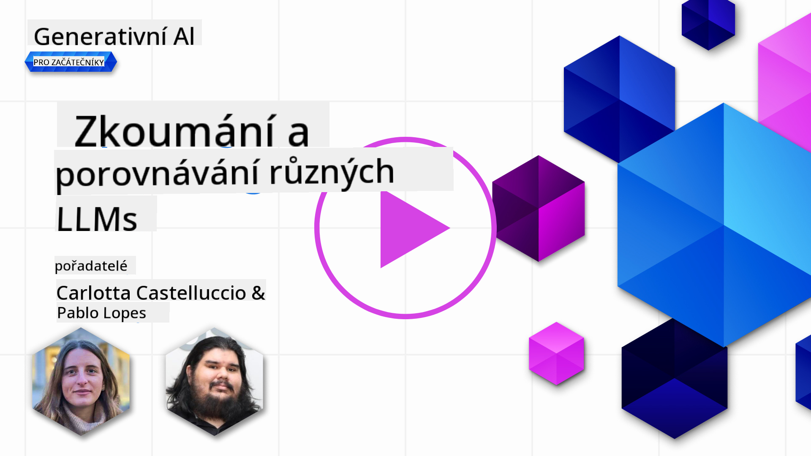](https://aka.ms/gen-ai-lesson2-gh?WT.mc_id=academic-105485-koreyst)

> _Klikněte na obrázek výše pro zhlédnutí videa této lekce_

V předchozí lekci jsme viděli, jak Generativní AI mění technologické prostředí, jak fungují velké jazykové modely (LLM) a jak je může firma – jako náš startup – využít pro své případy použití a růst! V této kapitole se zaměříme na porovnání různých typů velkých jazykových modelů (LLM), abychom pochopili jejich výhody a nevýhody.

Dalším krokem na cestě našeho startupu je prozkoumat současné prostředí LLM a zjistit, které modely jsou vhodné pro náš případ použití.

## Úvod

Tato lekce pokryje:

- Různé typy LLM v současném prostředí.
- Testování, iteraci a porovnávání různých modelů pro váš případ použití v Azure.
- Jak nasadit LLM.

## Cíle učení

Po dokončení této lekce budete schopni:

- Vybrat správný model pro váš případ použití.
- Pochopit, jak testovat, iterovat a zlepšovat výkon modelu.
- Vědět, jak firmy nasazují modely.

## Pochopení různých typů LLM

LLM lze rozdělit do několika kategorií podle jejich architektury, tréninkových dat a případu použití. Porozumění těmto rozdílům pomůže našemu startupu vybrat správný model pro daný scénář a pochopit, jak testovat, iterovat a zlepšovat výkon.

Existuje mnoho různých typů LLM modelů, výběr závisí na tom, k čemu je chcete použít, jaká máte data, kolik jste ochotni zaplatit a další faktory.

Podle toho, zda chcete modely využít pro text, audio, video, generování obrázků a podobně, můžete zvolit odlišný typ modelu.

- **Audio a rozpoznávání řeči**. Pro tento účel jsou skvělou volbou modely typu Whisper, protože jsou univerzální a zaměřené na rozpoznávání řeči. Jsou trénovány na různorodých audio datech a zvládají vícejazyčné rozpoznávání řeči. Více o [modelech typu Whisper zde](https://platform.openai.com/docs/models/whisper?WT.mc_id=academic-105485-koreyst).

- **Generování obrázků**. Pro generování obrázků jsou velmi známé modely DALL-E a Midjourney. DALL-E je dostupný přes Azure OpenAI. [Více o DALL-E zde](https://platform.openai.com/docs/models/dall-e?WT.mc_id=academic-105485-koreyst) a také v kapitole 9 tohoto kurzu.

- **Generování textu**. Většina modelů je trénována na generování textu a máte široký výběr od GPT-3.5 po GPT-4. Tyto modely mají různé ceny, přičemž GPT-4 je nejdražší. Stojí za to vyzkoušet [Azure OpenAI playground](https://oai.azure.com/portal/playground?WT.mc_id=academic-105485-koreyst), kde můžete vyhodnotit, které modely nejlépe vyhovují vašim potřebám z hlediska schopností a ceny.

- **Multimodalita**. Pokud chcete pracovat s více typy dat na vstupu i výstupu, můžete se podívat na modely jako [gpt-4 turbo s vizí nebo gpt-4o](https://learn.microsoft.com/azure/ai-services/openai/concepts/models#gpt-4-and-gpt-4-turbo-models?WT.mc_id=academic-105485-koreyst) – nejnovější verze OpenAI modelů – které kombinují zpracování přirozeného jazyka s vizuálním porozuměním a umožňují interakce přes multimodální rozhraní.

Výběr modelu znamená získat základní schopnosti, které ale nemusí vždy stačit. Často máte specifická data firmy, o kterých je potřeba LLM nějak informovat. Existuje několik možností, jak to řešit, o tom více v následujících částech.

### Foundation Models versus LLM

Termín Foundation Model byl [zaveden výzkumníky ze Stanfordu](https://arxiv.org/abs/2108.07258?WT.mc_id=academic-105485-koreyst) a definuje se jako AI model, který splňuje některá kritéria, například:

- **Jsou trénovány pomocí učení bez učitele nebo samo-učení**, což znamená, že jsou trénovány na neoznačených multimodálních datech a nevyžadují lidské anotace nebo označování dat během tréninku.
- **Jsou to velmi velké modely**, založené na hlubokých neuronových sítích trénovaných na miliardách parametrů.
- **Obvykle slouží jako „základ“ pro další modely**, což znamená, že mohou být použity jako výchozí bod pro další modely, které lze doladit (fine-tuningem).

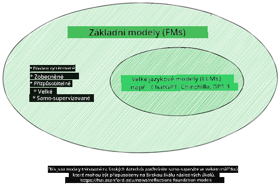

Zdroj obrázku: [Essential Guide to Foundation Models and Large Language Models | by Babar M Bhatti | Medium](https://thebabar.medium.com/essential-guide-to-foundation-models-and-large-language-models-27dab58f7404)

Pro lepší pochopení rozdílu si vezměme příklad ChatGPT. Pro vytvoření první verze ChatGPT posloužil model GPT-3.5 jako základní model. To znamená, že OpenAI použilo data specifická pro chat, aby vytvořilo doladěnou verzi GPT-3.5, která byla specializovaná na dobrý výkon v konverzačních scénářích, jako jsou chatboti.

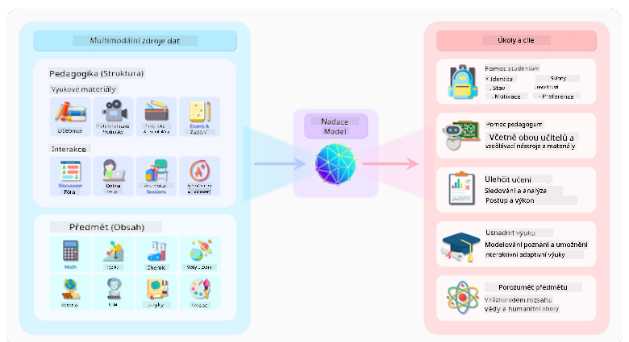

Zdroj obrázku: [2108.07258.pdf (arxiv.org)](https://arxiv.org/pdf/2108.07258.pdf?WT.mc_id=academic-105485-koreyst)

### Open Source versus Proprietární modely

Další způsob, jak kategorizovat LLM, je podle toho, zda jsou open source nebo proprietární.

Open source modely jsou modely zpřístupněné veřejnosti a může je používat kdokoliv. Často je poskytuje firma, která je vytvořila, nebo výzkumná komunita. Tyto modely lze prohlížet, upravovat a přizpůsobovat různým případům použití. Nicméně nejsou vždy optimalizované pro produkční nasazení a nemusí být tak výkonné jako proprietární modely. Financování open source modelů může být omezené, nemusí být dlouhodobě udržovány nebo aktualizovány s nejnovějším výzkumem. Příklady populárních open source modelů jsou [Alpaca](https://crfm.stanford.edu/2023/03/13/alpaca.html?WT.mc_id=academic-105485-koreyst), [Bloom](https://huggingface.co/bigscience/bloom) a [LLaMA](https://llama.meta.com).

Proprietární modely jsou modely vlastněné firmou a nejsou veřejně dostupné. Tyto modely jsou často optimalizované pro produkční použití. Není dovoleno je prohlížet, upravovat ani přizpůsobovat pro různé případy použití. Navíc nejsou vždy zdarma a mohou vyžadovat předplatné nebo platbu za používání. Uživatelé také nemají kontrolu nad daty použitými k tréninku modelu, což znamená, že musí důvěřovat vlastníkovi modelu, že zajistí ochranu dat a odpovědné využití AI. Příklady populárních proprietárních modelů jsou [OpenAI modely](https://platform.openai.com/docs/models/overview?WT.mc_id=academic-105485-koreyst), [Google Bard](https://sapling.ai/llm/bard?WT.mc_id=academic-105485-koreyst) nebo [Claude 2](https://www.anthropic.com/index/claude-2?WT.mc_id=academic-105485-koreyst).

### Embedding versus generování obrázků versus generování textu a kódu

LLM lze také rozdělit podle typu výstupu, který generují.

Embeddingy jsou sada modelů, které dokážou převést text do číselné podoby, nazývané embedding, což je číselná reprezentace vstupního textu. Embeddingy usnadňují strojům pochopit vztahy mezi slovy nebo větami a mohou být použity jako vstupy pro jiné modely, například klasifikační nebo shlukovací modely, které lépe pracují s číselnými daty. Embedding modely se často používají pro transfer learning, kdy je model vytvořen pro náhradní úlohu, pro kterou je dostatek dat, a pak se váhy modelu (embeddingy) znovu využívají pro další úlohy. Příkladem této kategorie jsou [OpenAI embeddings](https://platform.openai.com/docs/models/embeddings?WT.mc_id=academic-105485-koreyst).

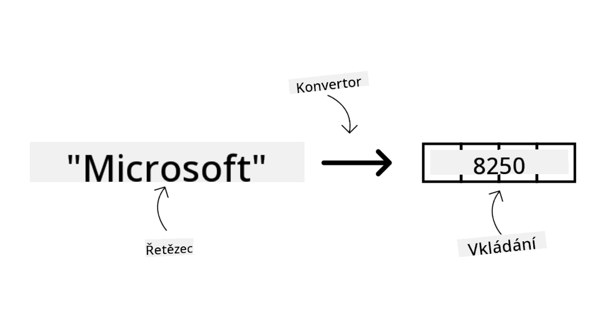

Modely generující obrázky jsou modely, které vytvářejí obrázky. Často se používají pro úpravu obrázků, syntézu nebo překlad obrázků. Jsou trénovány na velkých datových sadách obrázků, jako je [LAION-5B](https://laion.ai/blog/laion-5b/?WT.mc_id=academic-105485-koreyst), a mohou generovat nové obrázky nebo upravovat existující pomocí technik jako inpainting, super-resolution a kolorování. Příklady zahrnují [DALL-E-3](https://openai.com/dall-e-3?WT.mc_id=academic-105485-koreyst) a [Stable Diffusion modely](https://github.com/Stability-AI/StableDiffusion?WT.mc_id=academic-105485-koreyst).

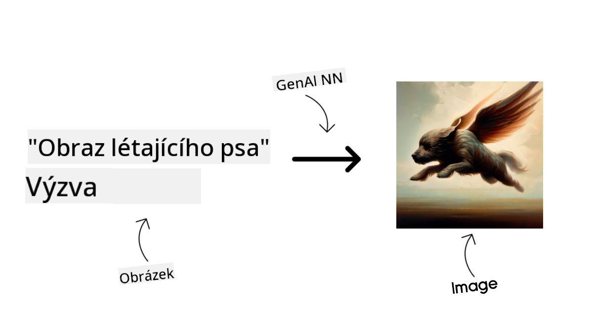

Modely generující text a kód jsou modely, které vytvářejí text nebo kód. Často se používají pro shrnutí textu, překlad nebo odpovídání na otázky. Textové modely jsou trénovány na velkých datových sadách textu, jako je [BookCorpus](https://www.cv-foundation.org/openaccess/content_iccv_2015/html/Zhu_Aligning_Books_and_ICCV_2015_paper.html?WT.mc_id=academic-105485-koreyst), a mohou generovat nový text nebo odpovídat na otázky. Modely generující kód, jako je [CodeParrot](https://huggingface.co/codeparrot?WT.mc_id=academic-105485-koreyst), jsou trénovány na velkých datových sadách kódu, například z GitHubu, a mohou generovat nový kód nebo opravovat chyby v existujícím kódu.

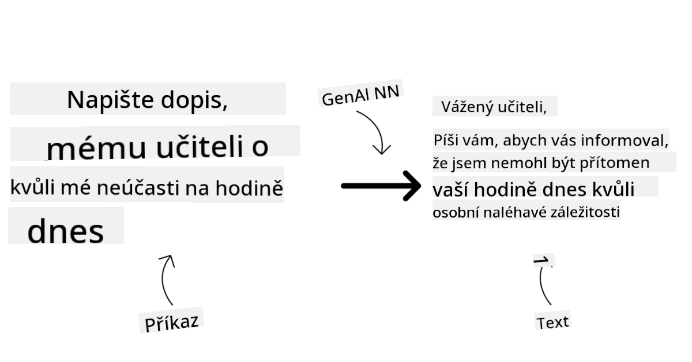

### Encoder-Decoder versus pouze Decoder

Pro vysvětlení různých architektur LLM použijme analogii.

Představte si, že vám váš manažer zadal úkol napsat kvíz pro studenty. Máte dva kolegy; jeden se stará o tvorbu obsahu a druhý o jeho kontrolu.

Tvůrce obsahu je jako model pouze s Decoderem, může se podívat na téma a vidět, co už jste napsali, a pak na základě toho napsat kurz. Jsou velmi dobří v psaní poutavého a informativního obsahu, ale nejsou příliš dobří v porozumění tématu a vzdělávacím cílům. Některé příklady Decoder modelů jsou modely rodiny GPT, například GPT-3.

Kontrolor je jako model pouze s Encoderem, podívá se na napsaný kurz a odpovědi, všímá si vztahů mezi nimi a chápe kontext, ale není dobrý v generování obsahu. Příkladem Encoder modelu je BERT.

Představte si, že bychom mohli mít někoho, kdo by mohl kvíz jak vytvořit, tak zkontrolovat – to je model Encoder-Decoder. Některé příklady jsou BART a T5.

### Služba versus Model

Nyní si povězme rozdíl mezi službou a modelem. Služba je produkt nabízený poskytovatelem cloudových služeb a často kombinuje modely, data a další komponenty. Model je jádrem služby a často je to základní model, jako LLM.

Služby jsou často optimalizované pro produkční použití a jsou obvykle snadnější na používání než samotné modely, například přes grafické uživatelské rozhraní. Nicméně služby nejsou vždy zdarma a mohou vyžadovat předplatné nebo platbu za používání, výměnou za využití vybavení a zdrojů poskytovatele služby, optimalizaci nákladů a snadné škálování. Příkladem služby je [Azure OpenAI Service](https://learn.microsoft.com/azure/ai-services/openai/overview?WT.mc_id=academic-105485-koreyst), která nabízí tarif pay-as-you-go, tedy uživatelé platí podle toho, kolik službu využijí. Azure OpenAI Service také nabízí bezpečnost na úrovni podniku a rámec odpovědného využití AI nad schopnostmi modelů.

Modely jsou pouze neuronové sítě s parametry, váhami a dalšími prvky. Firmy si je mohou provozovat lokálně, ale musí si pořídit vybavení, vybudovat infrastrukturu pro škálování a koupit licenci nebo použít open source model. Model jako LLaMA je dostupný k použití, ale vyžaduje výpočetní výkon pro běh modelu.

## Jak testovat a iterovat s různými modely pro pochopení výkonu v Azure

Jakmile náš tým prozkoumá současné prostředí LLM a vybere několik vhodných kandidátů pro své scénáře, dalším krokem je testování těchto modelů na svých datech a zátěži. Jedná se o iterativní proces, který probíhá pomocí experimentů a měření.
Většina modelů, které jsme zmínili v předchozích odstavcích (modely OpenAI, open source modely jako Llama2 a Hugging Face transformery) je dostupná v [Model Catalog](https://learn.microsoft.com/azure/ai-studio/how-to/model-catalog-overview?WT.mc_id=academic-105485-koreyst) v [Azure AI Studio](https://ai.azure.com/?WT.mc_id=academic-105485-koreyst).

[Azure AI Studio](https://learn.microsoft.com/azure/ai-studio/what-is-ai-studio?WT.mc_id=academic-105485-koreyst) je cloudová platforma navržená pro vývojáře, která umožňuje vytvářet generativní AI aplikace a spravovat celý vývojový cyklus – od experimentování až po vyhodnocení – tím, že kombinuje všechny Azure AI služby do jednoho centra s přehledným grafickým rozhraním. Model Catalog v Azure AI Studio umožňuje uživateli:

- Najít v katalogu základní model, který ho zajímá – ať už proprietární nebo open source, s možností filtrování podle úkolu, licence nebo názvu. Pro lepší vyhledávání jsou modely uspořádány do kolekcí, jako je Azure OpenAI kolekce, Hugging Face kolekce a další.

- Prohlédnout si model card, která obsahuje podrobný popis zamýšleného použití a tréninkových dat, ukázky kódu a výsledky hodnocení v interní knihovně evaluací.

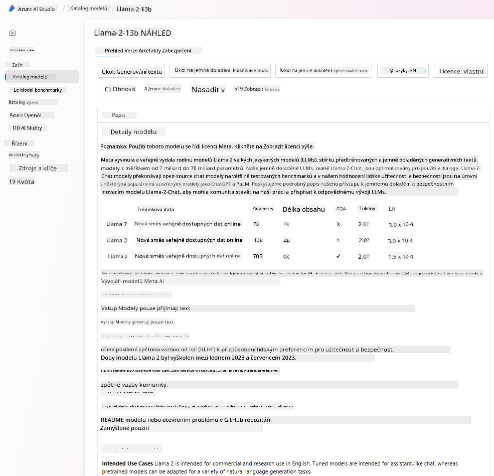

- Porovnat benchmarky napříč modely a datovými sadami dostupnými v oboru, aby bylo možné vyhodnotit, který model nejlépe vyhovuje konkrétnímu obchodnímu scénáři, prostřednictvím panelu [Model Benchmarks](https://learn.microsoft.com/azure/ai-studio/how-to/model-benchmarks?WT.mc_id=academic-105485-koreyst).

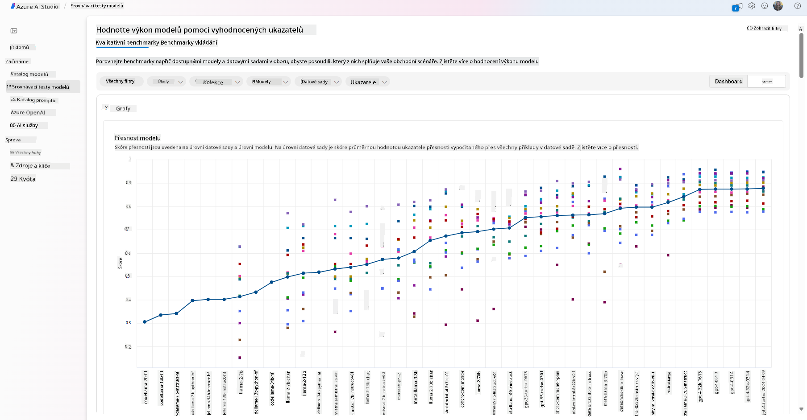

- Doladit model na vlastních tréninkových datech, aby se zlepšil výkon modelu pro konkrétní úlohu, a využít přitom možnosti experimentování a sledování v Azure AI Studio.

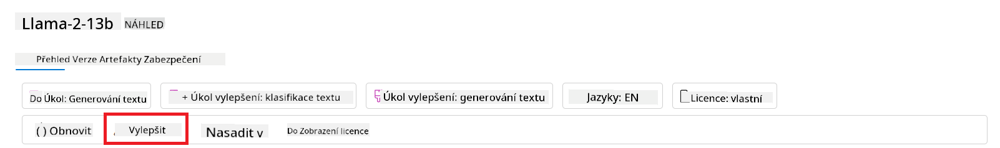

- Nasadit původní předtrénovaný model nebo jeho doladěnou verzi na vzdálený real-time inference – spravovaný výpočetní výkon – nebo serverless API endpoint – [pay-as-you-go](https://learn.microsoft.com/azure/ai-studio/how-to/model-catalog-overview#model-deployment-managed-compute-and-serverless-api-pay-as-you-go?WT.mc_id=academic-105485-koreyst) – aby aplikace mohly model využívat.

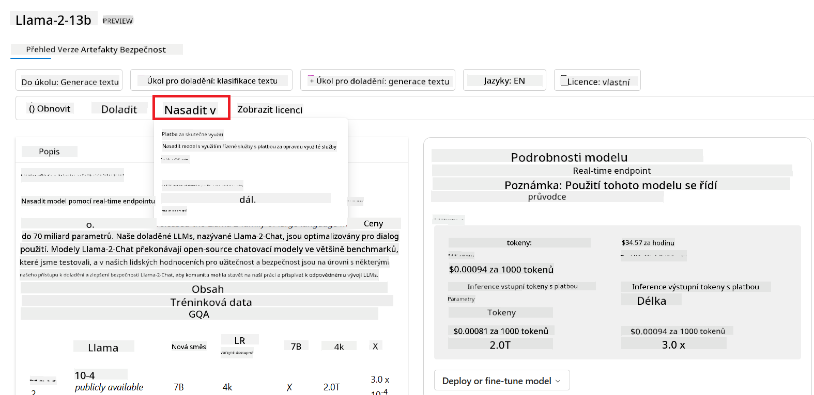

> [!NOTE]
> Ne všechny modely v katalogu jsou momentálně dostupné pro doladění a/nebo nasazení na pay-as-you-go bázi. Podrobnosti o možnostech a omezeních modelu najdete v model card.

## Zlepšování výsledků LLM

S naším startupovým týmem jsme zkoumali různé typy LLM a cloudovou platformu (Azure Machine Learning), která nám umožňuje porovnávat různé modely, hodnotit je na testovacích datech, zlepšovat jejich výkon a nasazovat je na inference endpointy.

Kdy by ale měli zvážit doladění modelu místo použití předtrénovaného? Existují i jiné způsoby, jak zlepšit výkon modelu pro konkrétní úlohy?

Podniky mohou využít několik přístupů, jak získat požadované výsledky z LLM. Při nasazení LLM do produkce lze vybrat různé typy modelů s různou mírou tréninku, různou složitostí, náklady a kvalitou. Zde jsou některé z možností:

- **Prompt engineering s kontextem**. Jde o to poskytnout dostatek kontextu v promptu, aby odpovědi odpovídaly požadavkům.

- **Retrieval Augmented Generation, RAG**. Vaše data mohou být například v databázi nebo na webovém endpointu. Aby se tato data nebo jejich část zahrnula do promptu, můžete vyhledat relevantní informace a přidat je do promptu uživatele.

- **Doladěný model**. Model je dále trénován na vlastních datech, což vede k přesnějším a citlivějším odpovědím na vaše potřeby, ale může to být nákladnější.

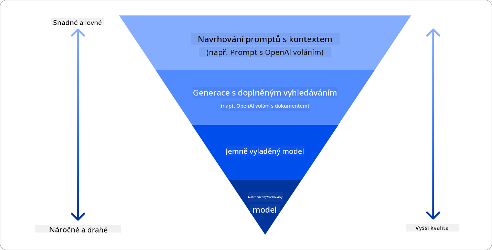

Zdroj obrázku: [Four Ways that Enterprises Deploy LLMs | Fiddler AI Blog](https://www.fiddler.ai/blog/four-ways-that-enterprises-deploy-llms?WT.mc_id=academic-105485-koreyst)

### Prompt Engineering s kontextem

Předtrénované LLM fungují velmi dobře u obecných úloh zpracování přirozeného jazyka, i když je zavoláte s krátkým promptem, například větou k doplnění nebo otázkou – tzv. „zero-shot“ učení.

Čím více uživatel dokáže svůj dotaz rámovat podrobnou žádostí a příklady – tedy kontextem – tím přesnější a blíže očekáváním uživatele bude odpověď. V tomto případě mluvíme o „one-shot“ učení, pokud prompt obsahuje pouze jeden příklad, a o „few-shot“ učení, pokud obsahuje více příkladů.
Prompt engineering s kontextem je nejefektivnější a nejlevnější způsob, jak začít.

### Retrieval Augmented Generation (RAG)

LLM mají omezení, že mohou použít pouze data, která byla použita během jejich tréninku k vytvoření odpovědi. To znamená, že neznají fakta, která nastala po jejich tréninku, a nemají přístup k neveřejným informacím (například firemním datům).
Toto omezení lze překonat pomocí RAG, techniky, která rozšiřuje prompt o externí data ve formě úryvků dokumentů, přičemž bere v úvahu limit délky promptu. Podporují to nástroje pro vektorové databáze (například [Azure Vector Search](https://learn.microsoft.com/azure/search/vector-search-overview?WT.mc_id=academic-105485-koreyst)), které vyhledávají užitečné úryvky z různých předdefinovaných zdrojů dat a přidávají je do kontextu promptu.

Tato technika je velmi užitečná, když podnik nemá dostatek dat, času nebo zdrojů na doladění LLM, ale přesto chce zlepšit výkon pro konkrétní úlohu a snížit riziko vymyšlených informací, tedy zkreslení reality nebo škodlivého obsahu.

### Doladěný model

Doladění je proces, který využívá transfer learning k „přizpůsobení“ modelu konkrétnímu úkolu nebo řešení specifického problému. Na rozdíl od few-shot učení a RAG vede k vytvoření nového modelu s aktualizovanými váhami a biasy. Vyžaduje sadu tréninkových příkladů, které obsahují vstup (prompt) a odpovídající výstup (dokončení).
Tento přístup je vhodný, pokud:

- **Používáte doladěné modely**. Podnik chce používat doladěné méně výkonné modely (například embedding modely) místo vysoce výkonných, což vede k úspornějšímu a rychlejšímu řešení.

- **Zohledňujete latenci**. Latence je důležitá pro konkrétní případ použití, takže není možné použít příliš dlouhé prompty nebo počet příkladů, které by model měl naučit, nevyhovuje limitu délky promptu.

- **Chcete být aktuální**. Podnik má velké množství kvalitních dat a správných označení a zdroje potřebné k udržování těchto dat aktuálních v čase.

### Trénovaný model

Trénování LLM od začátku je bezpochyby nejnáročnější a nejsložitější přístup, vyžadující obrovské množství dat, zkušené odborníky a odpovídající výpočetní kapacitu. Tuto možnost by měl podnik zvážit pouze v případě, že má doménově specifický případ použití a velké množství dat zaměřených na danou oblast.

## Kontrola znalostí

Co by mohl být dobrý přístup ke zlepšení výsledků dokončování LLM?

1. Prompt engineering s kontextem  
1. RAG  
1. Doladěný model

Odpověď: 3, pokud máte čas, zdroje a kvalitní data, doladění je lepší volba pro udržení aktuálnosti. Pokud ale chcete věci zlepšit a nemáte dost času, stojí za to nejdříve zvážit RAG.

## 🚀 Výzva

Přečtěte si více o tom, jak můžete [využít RAG](https://learn.microsoft.com/azure/search/retrieval-augmented-generation-overview?WT.mc_id=academic-105485-koreyst) pro vaše podnikání.

## Skvělá práce, pokračujte ve vzdělávání

Po dokončení této lekce si prohlédněte naši [kolekci Generative AI Learning](https://aka.ms/genai-collection?WT.mc_id=academic-105485-koreyst) a pokračujte ve zvyšování svých znalostí o generativní AI!

Přejděte do Lekce 3, kde se podíváme na to, jak [budovat s generativní AI zodpovědně](../03-using-generative-ai-responsibly/README.md?WT.mc_id=academic-105485-koreyst)!

**Prohlášení o vyloučení odpovědnosti**:  
Tento dokument byl přeložen pomocí AI překladatelské služby [Co-op Translator](https://github.com/Azure/co-op-translator). I když usilujeme o přesnost, mějte prosím na paměti, že automatizované překlady mohou obsahovat chyby nebo nepřesnosti. Původní dokument v jeho mateřském jazyce by měl být považován za autoritativní zdroj. Pro důležité informace se doporučuje profesionální lidský překlad. Nejsme odpovědní za jakékoliv nedorozumění nebo nesprávné výklady vyplývající z použití tohoto překladu.