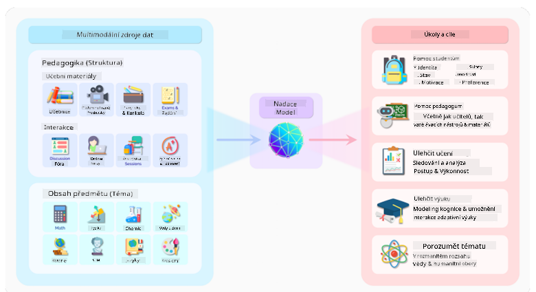
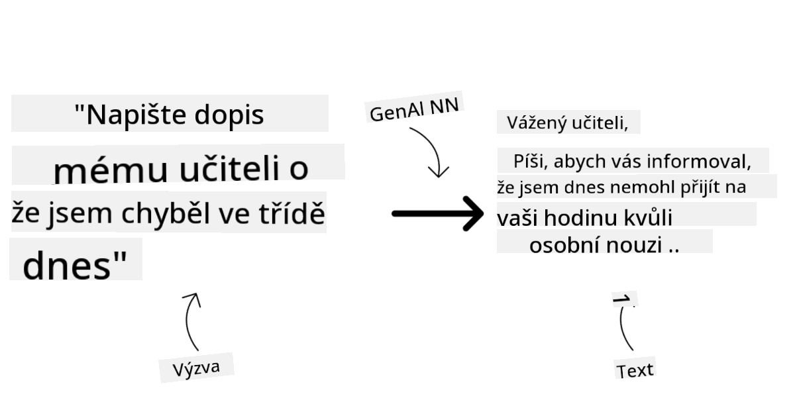
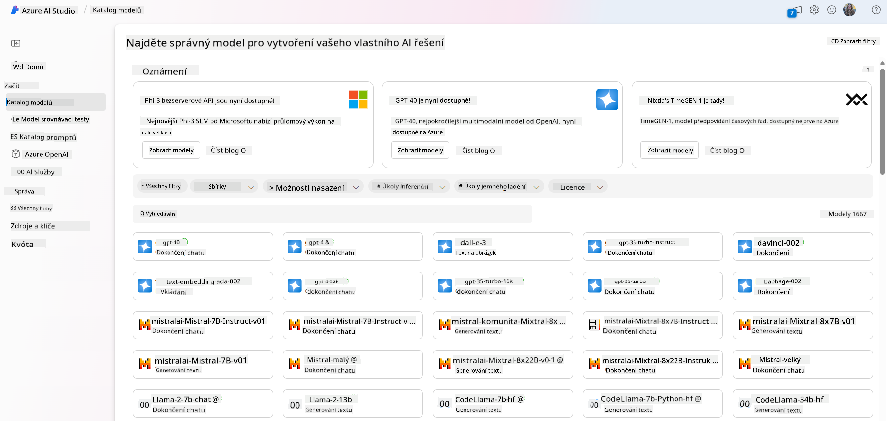
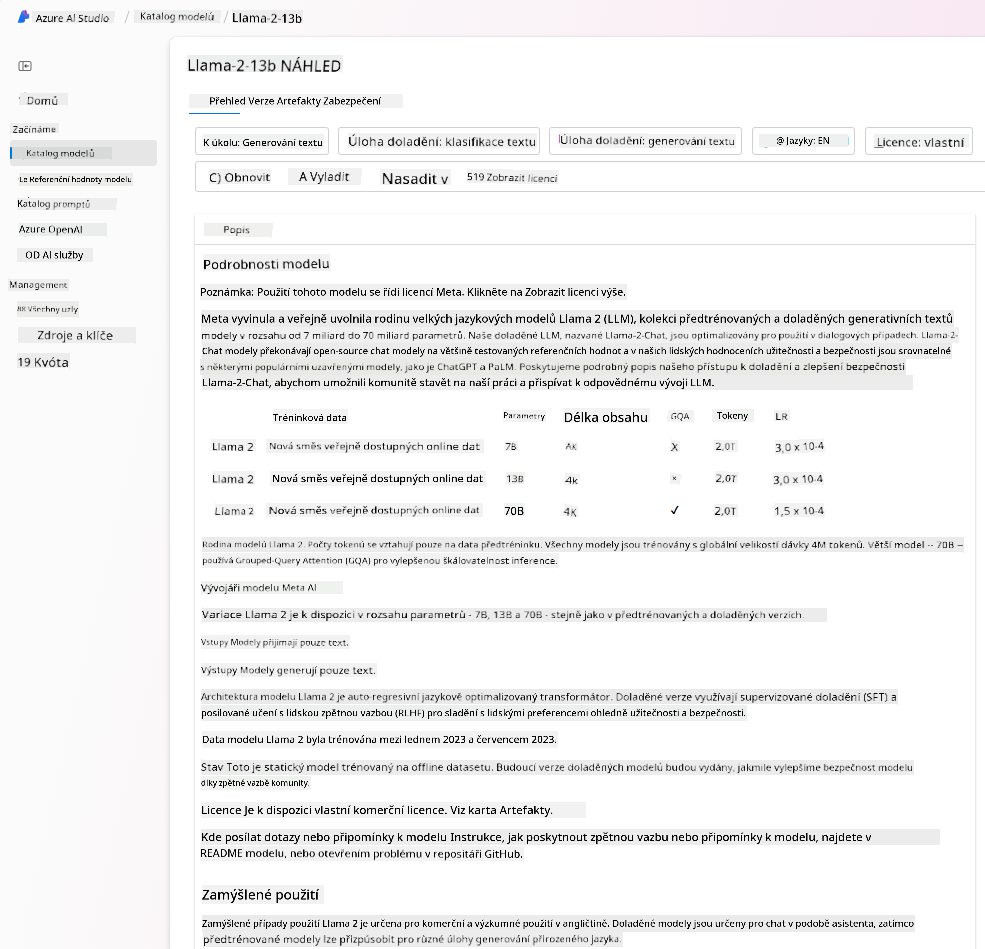
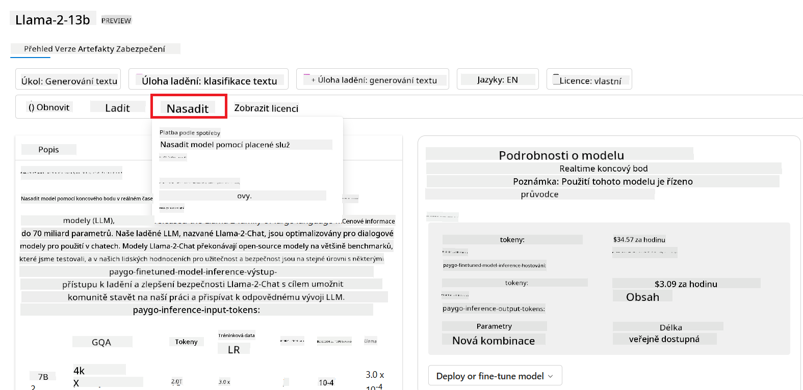

<!--
CO_OP_TRANSLATOR_METADATA:
{
  "original_hash": "e2f686f2eb794941761252ac5e8e090b",
  "translation_date": "2025-05-19T14:19:50+00:00",
  "source_file": "02-exploring-and-comparing-different-llms/README.md",
  "language_code": "cs"
}
-->
# Zkoumání a porovnávání různých LLM

> _Klikněte na obrázek výše a zhlédněte video této lekce_

V předchozí lekci jsme viděli, jak Generativní AI mění technologické prostředí, jak fungují Velké jazykové modely (LLM) a jak je může podnik - jako naše startupová firma - aplikovat na své případy použití a růst! V této kapitole se chystáme porovnat a kontrastovat různé typy velkých jazykových modelů (LLM), abychom pochopili jejich výhody a nevýhody.

Dalším krokem na cestě našeho startupu je prozkoumání aktuálního prostředí LLM a pochopení, které jsou vhodné pro náš případ použití.

## Úvod

Tato lekce se bude zabývat:

- Různými typy LLM v současném prostředí.
- Testováním, iterací a porovnáváním různých modelů pro váš případ použití v Azure.
- Jak nasadit LLM.

## Cíle učení

Po dokončení této lekce budete schopni:

- Vybrat správný model pro váš případ použití.
- Pochopit, jak testovat, iterovat a zlepšovat výkon vašeho modelu.
- Vědět, jak podniky nasazují modely.

## Porozumění různým typům LLM

LLM mohou mít několik kategorizací na základě své architektury, tréninkových dat a případu použití. Pochopení těchto rozdílů pomůže našemu startupu vybrat správný model pro daný scénář a pochopit, jak testovat, iterovat a zlepšovat výkon.

Existuje mnoho různých typů LLM modelů, vaše volba modelu závisí na tom, co máte v úmyslu s nimi dělat, na vašich datech, na tom, kolik jste ochotni zaplatit a na dalších faktorech.

V závislosti na tom, zda máte v úmyslu použít modely pro generování textu, zvuku, videa, obrázků a podobně, můžete zvolit jiný typ modelu.

- **Rozpoznávání zvuku a řeči**. Pro tento účel jsou modely typu Whisper skvělou volbou, protože jsou univerzální a zaměřené na rozpoznávání řeči. Jsou trénovány na různorodém zvuku a mohou provádět vícejazyčné rozpoznávání řeči. Více se dozvíte o [modelech typu Whisper zde](https://platform.openai.com/docs/models/whisper?WT.mc_id=academic-105485-koreyst).

- **Generování obrázků**. Pro generování obrázků jsou DALL-E a Midjourney dvě velmi známé volby. DALL-E je nabízen Azure OpenAI. [Přečtěte si více o DALL-E zde](https://platform.openai.com/docs/models/dall-e?WT.mc_id=academic-105485-koreyst) a také v kapitole 9 tohoto kurzu.

- **Generování textu**. Většina modelů je trénována na generování textu a máte velkou škálu možností od GPT-3.5 po GPT-4. Přicházejí s různými náklady, přičemž GPT-4 je nejdražší. Stojí za to podívat se na [Azure OpenAI playground](https://oai.azure.com/portal/playground?WT.mc_id=academic-105485-koreyst), abyste zhodnotili, které modely nejlépe vyhovují vašim potřebám z hlediska schopností a nákladů.

- **Multimodalita**. Pokud hledáte modely schopné zpracovávat různé typy dat v vstupu a výstupu, můžete se podívat na modely jako [gpt-4 turbo s viděním nebo gpt-4o](https://learn.microsoft.com/azure/ai-services/openai/concepts/models#gpt-4-and-gpt-4-turbo-models?WT.mc_id=academic-105485-koreyst) - nejnovější vydání modelů OpenAI - které jsou schopné kombinovat zpracování přirozeného jazyka s vizuálním porozuměním, což umožňuje interakce prostřednictvím multimodálních rozhraní.

Výběr modelu znamená, že získáte nějaké základní schopnosti, které však nemusí být dostatečné. Často máte firemní specifická data, o kterých potřebujete nějakým způsobem informovat LLM. Existuje několik různých možností, jak k tomu přistoupit, více o tom v nadcházejících sekcích.

### Základní modely versus LLM

Termín Základní model byl [vytvořen výzkumníky ze Stanfordu](https://arxiv.org/abs/2108.07258?WT.mc_id=academic-105485-koreyst) a definován jako AI model, který splňuje některá kritéria, jako například:

- **Jsou trénovány pomocí učení bez dohledu nebo samostatného učení**, což znamená, že jsou trénovány na neoznačených multimodálních datech a nevyžadují lidské anotace nebo označení dat pro svůj tréninkový proces.
- **Jsou velmi velké modely**, založené na velmi hlubokých neuronových sítích trénovaných na miliardách parametrů.
- **Jsou obvykle určeny jako 'základ' pro jiné modely**, což znamená, že mohou být použity jako výchozí bod pro další modely, které lze postavit na jejich základě, což lze provést jemným doladěním.

Zdroj obrázku: [Essential Guide to Foundation Models and Large Language Models | by Babar M Bhatti | Medium](https://thebabar.medium.com/essential-guide-to-foundation-models-and-large-language-models-27dab58f7404)

Pro další objasnění tohoto rozlišení si vezměme ChatGPT jako příklad. K vytvoření první verze ChatGPT sloužil model GPT-3.5 jako základní model. To znamená, že OpenAI použila nějaká data specifická pro chat k vytvoření laděné verze GPT-3.5, která byla specializovaná na dobrý výkon v konverzačních scénářích, jako jsou chatboti.

Zdroj obrázku: [2108.07258.pdf (arxiv.org)](https://arxiv.org/pdf/2108.07258.pdf?WT.mc_id=academic-105485-koreyst)

### Otevřené versus proprietární modely

Dalším způsobem, jak kategorizovat LLM, je, zda jsou otevřené nebo proprietární.

Otevřené modely jsou modely, které jsou zpřístupněny veřejnosti a mohou být použity kýmkoli. Často jsou zpřístupněny společností, která je vytvořila, nebo výzkumnou komunitou. Tyto modely mohou být prozkoumány, upraveny a přizpůsobeny pro různé případy použití v LLM. Nicméně nejsou vždy optimalizovány pro produkční použití a nemusí být tak výkonné jako proprietární modely. Navíc financování otevřených modelů může být omezené a nemusí být dlouhodobě udržovány nebo aktualizovány s nejnovějším výzkumem. Příklady populárních otevřených modelů zahrnují [Alpaca](https://crfm.stanford.edu/2023/03/13/alpaca.html?WT.mc_id=academic-105485-koreyst), [Bloom](https://huggingface.co/bigscience/bloom) a [LLaMA](https://llama.meta.com).

Proprietární modely jsou modely, které jsou vlastněny společností a nejsou zpřístupněny veřejnosti. Tyto modely jsou často optimalizovány pro produkční použití. Nicméně nejsou povoleny k prozkoumání, úpravám nebo přizpůsobení pro různé případy použití. Navíc nejsou vždy dostupné zdarma a mohou vyžadovat předplatné nebo platbu za použití. Uživatelé také nemají kontrolu nad daty, která jsou použita k trénování modelu, což znamená, že by měli důvěřovat vlastníkovi modelu, že zajistí závazek k ochraně dat a odpovědnému použití AI. Příklady populárních proprietárních modelů zahrnují [OpenAI modely](https://platform.openai.com/docs/models/overview?WT.mc_id=academic-105485-koreyst), [Google Bard](https://sapling.ai/llm/bard?WT.mc_id=academic-105485-koreyst) nebo [Claude 2](https://www.anthropic.com/index/claude-2?WT.mc_id=academic-105485-koreyst).

### Embedding versus Generování obrázků versus Generování textu a kódu

LLM mohou být také kategorizovány podle výstupu, který generují.

Embedování jsou sada modelů, které mohou převést text na numerickou formu, nazývanou embedování, což je numerická reprezentace vstupního textu. Embedování usnadňují strojům porozumění vztahům mezi slovy nebo větami a mohou být použity jako vstupy pro jiné modely, jako jsou klasifikační modely nebo modely pro shlukování, které mají lepší výkon na numerických datech. Embedovací modely se často používají pro transferové učení, kde je model postaven pro náhradní úkol, pro který je dostatek dat, a pak jsou váhy modelu (embedování) znovu použity pro jiné úkoly. Příkladem této kategorie je [OpenAI embedování](https://platform.openai.com/docs/models/embeddings?WT.mc_id=academic-105485-koreyst).

Modely generování obrázků jsou modely, které generují obrázky. Tyto modely se často používají pro úpravu obrázků, syntézu obrázků a překlad obrázků. Modely generování obrázků jsou často trénovány na velkých datových sadách obrázků, jako je [LAION-5B](https://laion.ai/blog/laion-5b/?WT.mc_id=academic-105485-koreyst), a mohou být použity k generování nových obrázků nebo k úpravě existujících obrázků pomocí technik doplňování, super-rozlišení a kolorování. Příklady zahrnují [DALL-E-3](https://openai.com/dall-e-3?WT.mc_id=academic-105485-koreyst) a [Stable Diffusion modely](https://github.com/Stability-AI/StableDiffusion?WT.mc_id=academic-105485-koreyst).

Modely generování textu a kódu jsou modely, které generují text nebo kód. Tyto modely se často používají pro sumarizaci textu, překlad a odpovídání na otázky. Modely generování textu jsou často trénovány na velkých datových sadách textu, jako je [BookCorpus](https://www.cv-foundation.org/openaccess/content_iccv_2015/html/Zhu_Aligning_Books_and_ICCV_2015_paper.html?WT.mc_id=academic-105485-koreyst), a mohou být použity k generování nového textu nebo k odpovídání na otázky. Modely generování kódu, jako [CodeParrot](https://huggingface.co/codeparrot?WT.mc_id=academic-105485-koreyst), jsou často trénovány na velkých datových sadách kódu, jako je GitHub, a mohou být použity k generování nového kódu nebo k opravě chyb v existujícím kódu.

### Encoder-Decoder versus pouze Decoder

Pro popis různých typů architektur LLM použijme analogii.

Představte si, že váš manažer vám dal úkol napsat kvíz pro studenty. Máte dva kolegy; jeden je zodpovědný za tvorbu obsahu a druhý za jeho revizi.

Tvůrce obsahu je jako model pouze Decoder, může se podívat na téma a vidět, co jste již napsali, a pak může napsat kurz na základě toho. Jsou velmi dobří v psaní poutavého a informativního obsahu, ale nejsou příliš dobří v porozumění tématu a učebním cílům. Některé příklady modelů Decoder jsou modely rodiny GPT, jako GPT-3.

Revizor je jako model pouze Encoder, podívá se na napsaný kurz a odpovědi, všimne si vztahu mezi nimi a pochopí kontext, ale není dobrý v generování obsahu. Příkladem modelu pouze Encoder by byl BERT.

Představte si, že bychom mohli mít někoho, kdo by mohl vytvářet i revidovat kvíz, to je model Encoder-Decoder. Některé příklady by byly BART a T5.

### Služba versus model

Nyní si povíme o rozdílu mezi službou a modelem. Služba je produkt nabízený poskytovatelem cloudových služeb a často je kombinací modelů, dat a dalších komponent. Model je jádrem služby a často je to základní model, jako LLM.

Služby jsou často optimalizovány pro produkční použití a často se snadněji používají než modely, prostřednictvím grafického uživatelského rozhraní. Nicméně služby nejsou vždy dostupné zdarma a mohou vyžadovat předplatné nebo platbu za použití, výměnou za využití vybavení a zdrojů vlastníka služby, optimalizaci nákladů a snadné škálování. Příkladem služby je [Azure OpenAI Service](https://learn.microsoft.com/azure/ai-services/openai/overview?WT.mc_id=academic-105485-koreyst), která nabízí tarifní plán pay-as-you-go, což znamená, že uživatelé jsou účtováni úměrně tomu, jak moc používají službu. Také Azure OpenAI Service nabízí podnikové zabezpečení a rámec pro odpovědnou AI nad schopnostmi modelů.

Modely jsou jen Neuronová síť s parametry, váhami a dalšími. Umožňují společnostem provozovat lokálně, avšak by bylo potřeba zakoupit vybavení, vytvořit strukturu pro škálování a zakoupit licenci nebo použít otevřený model. Model jako LLaMA je k dispozici k použití, vyžaduje výpočetní výkon pro provoz modelu.

## Jak testovat a iterovat s různými modely pro porozumění výkonu na Azure

Jakmile náš tým prozkoumal aktuální prostředí LLM a identifikoval některé dobré kandidáty pro své scénáře, dalším krokem je testování na jejich datech a na jejich pracovním zatížení. Toto je iterativní proces, prováděný experimenty a měřeními. Většina modelů, které jsme zmínili v předchozích odstavcích (OpenAI modely, otevřené modely jako Llama2 a Hugging Face transformátory) jsou dostupné v [Model Catalog](https://learn.microsoft.com/azure/ai-studio/how-to/model-catalog-overview?WT.mc_id=academic-105485-koreyst) v [Azure AI Studio](https://ai.azure.com/?WT.mc_id=academic-105485-koreyst).

[Azure AI Studio](https://learn.microsoft.com/azure/ai-studio/what-is-ai-studio?WT.mc_id=academic-105485-koreyst) je Cloud Platforma navržená pro vývojáře k vytváření aplikací generativní AI a správu celého životního cyklu vývoje - od experimentování po hodnocení - kombinováním všech Azure AI služeb do jednoho centra s praktickým GUI. Model Catalog v Azure AI Studio umožňuje uživateli:

- Najít Základní Model zájmu v katalogu - buď proprietární nebo otevřený, filtrováním podle úkolu, licence nebo jména. Pro zlepšení vyhledatelnosti jsou modely organizovány do kolekcí, jako Azure OpenAI kolekce, Hugging Face kolekce a další.

- Prozkoumat kartu modelu, včetně podrobného popisu zamýšleného použití a tréninkových dat, vzorků kódu a výsledků hodnocení na interní knihovně hodnocení.

- Porovnejte benchmarky mezi modely a datovými sadami dostupnými v průmyslu, abyste zjistili, který z nich nejlépe vyhovuje obchodnímu scénáři, pomocí panelu [Model Benchmarks](https://learn.microsoft.com/azure/ai-studio/how-to/model-benchmarks?WT.mc_id=academic-105485-koreyst).

- Doladěte model na vlastních tréninkových datech, abyste zlepšili jeho výkon v konkrétním pracovním zatížení, s využitím experimentálních a sledovacích schopností Azure AI Studio.

- Nasazujte původní předtrénovaný model nebo jeho doladěnou verzi na vzdálenou inference v reálném čase - řízené výpočetní prostředky - nebo serverless API endpoint - [platba za použití](https://learn.microsoft.com/azure/ai-studio/how-to/model-catalog-overview#model-deployment-managed-compute-and-serverless-api-pay-as-you-go?WT.mc_id=academic-105485-koreyst) - aby aplikace mohly model využívat.

> [!NOTE]
> Ne všechny modely v katalogu jsou momentálně dostupné pro doladění a/nebo nasazení s platbou za použití. Zkontrolujte kartu modelu pro podrobnosti o schopnostech a omezeních modelu.

## Zlepšování výsledků LLM

Prozkoumali jsme s naším startupovým týmem různé druhy LLM a cloudovou platformu (Azure Machine Learning), která nám umožňuje porovnávat různé modely, hodnotit je na testovacích datech, zlepšovat výkon a nasazovat je na inference endpointy.

Kdy by měli zvážit doladění modelu místo použití předtrénovaného? Existují jiné přístupy ke zlepšení výkonu modelu v konkrétních pracovních zatíženích?

Existuje několik přístupů, které může podnik použít k dosažení potřebných výsledků z LLM. Při nasazení LLM do produkce můžete vybrat různé typy modelů s různou mírou tréninku, s různou úrovní složitosti, nákladů a kvality. Zde jsou některé různé přístupy:

- **Prompt engineering s kontextem**. Myšlenka je poskytnout dostatečný kontext při zadávání, aby se zajistilo, že dostanete potřebné odpovědi.

- **Retrieval Augmented Generation, RAG**. Vaše data mohou existovat například v databázi nebo webovém endpointu, aby bylo zajištěno, že tato data nebo jejich podmnožina jsou zahrnuta při zadávání, můžete získat relevantní data a učinit je součástí uživatelského zadání.

- **Doladěný model**. Zde jste model dále trénovali na vlastních datech, což vedlo k tomu, že model je přesnější a reaguje na vaše potřeby, ale může být nákladný.

Zdroj obrázku: [Čtyři způsoby, jak podniky nasazují LLM | Fiddler AI Blog](https://www.fiddler.ai/blog/four-ways-that-enterprises-deploy-llms?WT.mc_id=academic-105485-koreyst)

### Prompt Engineering s kontextem

Předtrénované LLM fungují velmi dobře na obecné úkoly s přirozeným jazykem, dokonce i při jejich volání krátkým zadáním, jako je věta k dokončení nebo otázka – takzvané „zero-shot“ učení.

Čím více může uživatel formulovat svůj dotaz, s podrobným požadavkem a příklady – Kontext – tím přesnější a bližší očekáváním uživatele bude odpověď. V tomto případě mluvíme o „one-shot“ učení, pokud zadání obsahuje pouze jeden příklad, a „few-shot learning“, pokud obsahuje více příkladů. Prompt engineering s kontextem je nejefektivnější přístup k zahájení.

### Retrieval Augmented Generation (RAG)

LLM mají omezení, že mohou použít pouze data, která byla použita během jejich tréninku k vygenerování odpovědi. To znamená, že nevědí nic o faktech, která se stala po jejich tréninkovém procesu, a nemohou přistupovat k neveřejným informacím (jako jsou data společnosti).
To lze překonat pomocí RAG, techniky, která rozšiřuje zadání o externí data ve formě útržků dokumentů, s ohledem na omezení délky zadání. To je podporováno nástroji pro vektorové databáze (jako [Azure Vector Search](https://learn.microsoft.com/azure/search/vector-search-overview?WT.mc_id=academic-105485-koreyst)), které získávají užitečné útržky z různých předdefinovaných datových zdrojů a přidávají je do kontextu zadání.

Tato technika je velmi užitečná, když podnik nemá dostatek dat, času nebo zdrojů na doladění LLM, ale stále si přeje zlepšit výkon na konkrétním pracovním zatížení a snížit rizika fabricací, tj. mystifikace reality nebo škodlivého obsahu.

### Doladěný model

Doladění je proces, který využívá přenosové učení k „přizpůsobení“ modelu na následný úkol nebo k řešení konkrétního problému. Na rozdíl od few-shot learning a RAG vede k vytvoření nového modelu s aktualizovanými vahami a zkresleními. Vyžaduje sadu tréninkových příkladů sestávající z jediného vstupu (zadání) a jeho přidruženého výstupu (dokončení).
Toto by byl preferovaný přístup, pokud:

- **Používání doladěných modelů**. Podnik by rád používal doladěné méně schopné modely (jako modely pro embedding) místo vysoce výkonných modelů, což vede k nákladově efektivnějšímu a rychlejšímu řešení.

- **Zvažování latence**. Latence je důležitá pro konkrétní použití, takže není možné používat velmi dlouhá zadání nebo počet příkladů, které by se měl model naučit, neodpovídá limitu délky zadání.

- **Udržování aktuálnosti**. Podnik má mnoho vysoce kvalitních dat a pravdivých štítků a zdroje potřebné k udržování těchto dat aktuálních v průběhu času.

### Trénovaný model

Trénování LLM od nuly je bezpochyby nejtěžší a nejsložitější přístup, který je třeba přijmout, vyžadující obrovské množství dat, kvalifikované zdroje a odpovídající výpočetní výkon. Tuto možnost by bylo třeba zvážit pouze v situaci, kdy má podnik specifický případ použití a velké množství dat zaměřených na danou oblast.

## Kontrola znalostí

Jaký by mohl být dobrý přístup ke zlepšení výsledků dokončení LLM?

1. Prompt engineering s kontextem
1. RAG
1. Doladěný model

A:3, pokud máte čas a zdroje a vysoce kvalitní data, doladění je lepší možnost, jak zůstat aktuální. Nicméně, pokud se snažíte věci zlepšit a nemáte čas, stojí za zvážení RAG jako první.

## 🚀 Výzva

Zjistěte více o tom, jak můžete [použít RAG](https://learn.microsoft.com/azure/search/retrieval-augmented-generation-overview?WT.mc_id=academic-105485-koreyst) pro váš podnik.

## Skvělá práce, pokračujte ve svém učení

Po dokončení této lekce se podívejte na naši [Generative AI Learning collection](https://aka.ms/genai-collection?WT.mc_id=academic-105485-koreyst), abyste dále rozvíjeli své znalosti o Generative AI!

Přejděte na lekci 3, kde se podíváme na to, jak [budovat s Generative AI zodpovědně](../03-using-generative-ai-responsibly/README.md?WT.mc_id=academic-105485-koreyst)!

**Prohlášení**:  
Tento dokument byl přeložen pomocí služby AI pro překlad [Co-op Translator](https://github.com/Azure/co-op-translator). Ačkoli se snažíme o přesnost, mějte prosím na paměti, že automatické překlady mohou obsahovat chyby nebo nepřesnosti. Původní dokument v jeho rodném jazyce by měl být považován za autoritativní zdroj. Pro kritické informace se doporučuje profesionální lidský překlad. Nejsme zodpovědní za jakékoli nedorozumění nebo nesprávné interpretace vyplývající z použití tohoto překladu.