# Zkoumání a porovnávání různých LLM

> _Klikněte na obrázek výše pro zobrazení videa této lekce_

V předchozí lekci jsme viděli, jak Generativní AI mění technologickou krajinu, jak fungují Velké jazykové modely (LLM) a jak může podnik - jako náš startup - tyto modely použít na své případy použití a růst! V této kapitole budeme porovnávat a kontrastovat různé typy velkých jazykových modelů, abychom pochopili jejich výhody a nevýhody.

Dalším krokem na cestě našeho startupu je prozkoumat aktuální krajinu LLM a pochopit, které jsou vhodné pro náš případ použití.

## Úvod

Tato lekce pokryje:

- Různé typy LLM v aktuální krajině.
- Testování, iteraci a porovnávání různých modelů pro váš případ použití v Azure.
- Jak nasadit LLM.

## Cíle učení

Po dokončení této lekce budete schopni:

- Vybrat správný model pro váš případ použití.
- Porozumět tomu, jak testovat, iterovat a zlepšovat výkon modelu.
- Vědět, jak podniky nasazují modely.

## Porozumění různým typům LLM

LLM lze kategorizovat podle jejich architektury, tréninkových dat a případů použití. Porozumění těmto rozdílům pomůže našemu startupu vybrat správný model pro scénář a pochopit, jak testovat, iterovat a zlepšovat výkon.

Existuje mnoho různých typů LLM modelů, výběr závisí na tom, k čemu je chcete použít, vašich datech, kolik jste ochotni zaplatit a dalších faktorech.

V závislosti na tom, zda chcete modely použít pro text, audio, video, generování obrázků a podobně, můžete zvolit jiný typ modelu.

- **Rozpoznávání audia a řeči**. Whisper-style modely jsou stále užitečné obecné modely pro rozpoznávání řeči, ale v produkci jsou nyní k dispozici nové modely převodu řeči na text, jako `gpt-4o-transcribe`, `gpt-4o-mini-transcribe` a varianty diarizace. Zhodnoťte pokrytí jazyků, diarizaci, podporu v reálném čase, latenci a náklady pro váš scénář. Více se dozvíte v [OpenAI dokumentaci k převodu řeči na text](https://platform.openai.com/docs/guides/speech-to-text?WT.mc_id=academic-105485-koreyst).

- **Generování obrázků**. DALL-E a Midjourney jsou známé možnosti generování obrázků, ale současné OpenAI image API se zaměřuje na GPT image modely jako `gpt-image-2`, zatímco Stable Diffusion, Imagen, Flux a další rodiny modelů jsou také běžnou volbou. Porovnávejte dodržování promptu, podporu úprav, kontrolu stylu, požadavky na bezpečnost a licence. Více se dozvíte v [OpenAI průvodci generováním obrázků](https://platform.openai.com/docs/guides/images?WT.mc_id=academic-105485-koreyst) a v kapitole 9 tohoto kurikula.

- **Generování textu**. Textové modely nyní zahrnují špičkové modely, modely pro uvažování, menší modely s nízkou latencí a modely s otevřenými váhami. Současné příklady zahrnují OpenAI GPT-5.x modely, Anthropic Claude 4.x modely, Google Gemini 3.x modely, Meta Llama 4 modely a Mistral modely. Nevybírejte pouze podle data vydání nebo ceny; porovnejte kvalitu úkolu, latenci, kontextové okno, využití nástrojů, bezpečnostní chování, regionální dostupnost a celkové náklady. [Microsoft Foundry katalog modelů](https://ai.azure.com/catalog?WT.mc_id=academic-105485-koreyst) je dobrým místem na porovnání modelů dostupných v Azure.

- **Multimodalita**. Mnoho současných modelů dokáže zpracovávat více než text. Některé přijímají input obrázků, audia nebo videa; některé mohou volat nástroje; a specializované modely mohou generovat obrázky, audio nebo video. Například současné OpenAI modely podporují text a obrazový vstup, Gemini modely mohou podle varianty podporovat text, kód, obraz, audio a video, a Llama 4 Scout a Maverick jsou nativní multimodální modely s otevřenými váhami. Vždy si před vytvořením pracovního postupu zkontrolujte každou modelovou kartu, jaké vstupní a výstupní modality jsou podporovány.

Výběr modelu znamená získání základních schopností, které ale nemusí být dostačující. Často máte firmou specifická data, o kterých musí LLM vědět. Existuje několik různých možností, jak se k tomu postavit, více v následujících sekcích.

### Základní modely versus LLM

Termín Základní model byl [zaveden výzkumníky ze Stanfordu](https://arxiv.org/abs/2108.07258?WT.mc_id=academic-105485-koreyst) a je definován jako AI model, který splňuje určitá kritéria, například:

- **Jsou trénovány pomocí neřízeného nebo samořízeného učení**, to znamená, že jsou trénovány na netřízených multimodálních datech a pro trénink nepotřebují lidskou anotaci nebo označování dat.
- **Jsou to velmi velké modely**, založené na velmi hlubokých neuronových sítích trénovaných na miliardách parametrů.
- **Obvykle slouží jako „základ“ pro jiné modely**, což znamená, že mohou být používány jako výchozí bod, na kterém se staví další modely pomocí doladění.

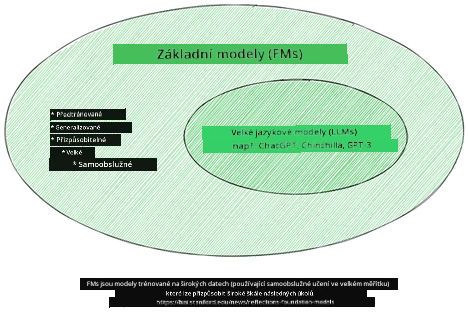

Zdroj obrázku: [Essential Guide to Foundation Models and Large Language Models | by Babar M Bhatti | Medium
](https://thebabar.medium.com/essential-guide-to-foundation-models-and-large-language-models-27dab58f7404)

Pro lepší objasnění rozdílu uveďme ChatGPT jako historický příklad. Rané verze ChatGPT používaly GPT-3.5 jako základní model. OpenAI pak použilo data specifická pro chat a techniky zarovnání k vytvoření vyladěné verze, která lépe fungovala v konverzačních scénářích, například v chatbotách. Moderní AI služby často směrují mezi několika variantami modelů, takže název služby a název základního modelu nejsou vždy totožné.

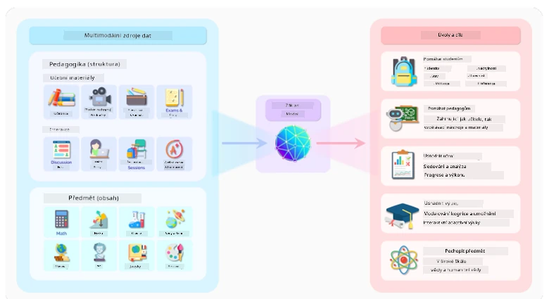

Zdroj obrázku: [2108.07258.pdf (arxiv.org)](https://arxiv.org/pdf/2108.07258.pdf?WT.mc_id=academic-105485-koreyst)

### Modely s otevřenými váhami/zdrojovým kódem versus proprietární modely

Další možnost kategorizace LLM je podle toho, jestli jsou open-weight, open-source, nebo proprietární.

Open-source a open-weight modely poskytují artefakty modelu k nahlédnutí, stažení nebo přizpůsobení, ale jejich licence se liší. Některé jsou plně otevřené z hlediska zdrojového kódu, jiné jsou open-weight modely s omezeními užití. Mohou být užitečné, když podnik potřebuje větší kontrolu nad nasazením, lokalitou dat, náklady nebo přizpůsobením. Přesto je nutné pečlivě zkontrolovat licenční podmínky, náklady na provoz, údržbu, bezpečnostní aktualizace a kvalitu hodnocení před nasazením do produkce. Příklady zahrnují [Meta Llama 4](https://ai.meta.com/blog/llama-4-multimodal-intelligence/?WT.mc_id=academic-105485-koreyst), některé [Mistral modely](https://docs.mistral.ai/models/overview?WT.mc_id=academic-105485-koreyst) a mnoho modelů hostovaných na [Hugging Face](https://huggingface.co/models?WT.mc_id=academic-105485-koreyst).

Proprietární modely vlastní a hostují poskytovatelé. Tyto modely jsou často optimalizovány pro řízené produkční použití a mohou nabízet silnou podporu, bezpečnostní systémy, integraci nástrojů a škálovatelnost. Zákazníci ale obvykle nemohou nahlížet nebo měnit váhy modelu, a musí pečlivě zkontrolovat podmínky poskytovatele ohledně ochrany soukromí, uchovávání dat, souladu a přijatelných pravidel použití. Příklady jsou [OpenAI modely](https://platform.openai.com/docs/models?WT.mc_id=academic-105485-koreyst), [Google Gemini](https://deepmind.google/models/gemini/pro/?WT.mc_id=academic-105485-koreyst) a [Anthropic Claude](https://platform.claude.com/docs/en/about-claude/models/overview?WT.mc_id=academic-105485-koreyst).

### Vkládání (Embedding) versus generování obrázků versus generování textu a kódu

LLM lze také kategorizovat podle výstupu, který generují.

Embedding jsou soubory modelů, které umí převést text do číselné formy, nazývané embedding, což je číselná reprezentace vstupního textu. Embedding usnadňuje strojům pochopit vztahy mezi slovy nebo větami a mohou být využity jako vstupy pro jiné modely, například klasifikační modely nebo shlukovací modely, jež mají lepší výkon na numerických datech. Embedding modely se často používají pro transferové učení, kdy se model staví pro náhradní úkol, pro který je k dispozici velké množství dat, a pak se váhy modelu (embeddingy) znovu využívají pro další úkoly. Příkladem této kategorie jsou [OpenAI embeddings](https://platform.openai.com/docs/models/embeddings?WT.mc_id=academic-105485-koreyst).

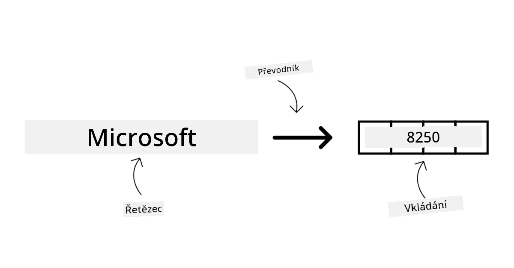

Modely generující obrázky jsou modely, které vytvářejí obrázky. Často se používají pro úpravy obrázků, syntézu obrázků a překlady obrázků. Modely generující obrázky jsou obvykle trénovány na rozsáhlých datech obrázků, jako [LAION-5B](https://laion.ai/blog/laion-5b/?WT.mc_id=academic-105485-koreyst), a mohou generovat nové obrázky nebo upravovat existující technikami jako inpainting, super-resolution a kolorování. Příklady zahrnují [GPT Image modely](https://platform.openai.com/docs/guides/images?WT.mc_id=academic-105485-koreyst), [Stable Diffusion modely](https://github.com/Stability-AI/StableDiffusion?WT.mc_id=academic-105485-koreyst) a Imagen modely.

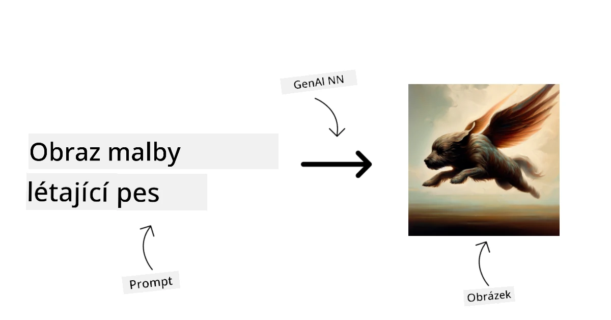

Modely generující text a kód jsou modely, které generují text nebo kód. Často se používají pro shrnutí textu, překlady a odpovídání na otázky. Modely generující text jsou obvykle trénovány na rozsáhlých textech, jako [BookCorpus](https://www.cv-foundation.org/openaccess/content_iccv_2015/html/Zhu_Aligning_Books_and_ICCV_2015_paper.html?WT.mc_id=academic-105485-koreyst), a mohou generovat nový text nebo odpovídat na otázky. Modely generující kód, jako [CodeParrot](https://huggingface.co/codeparrot?WT.mc_id=academic-105485-koreyst), jsou trénovány na velkých korpusech kódu, jako GitHub, a mohou generovat nový kód nebo opravovat chyby v existujícím kódu.

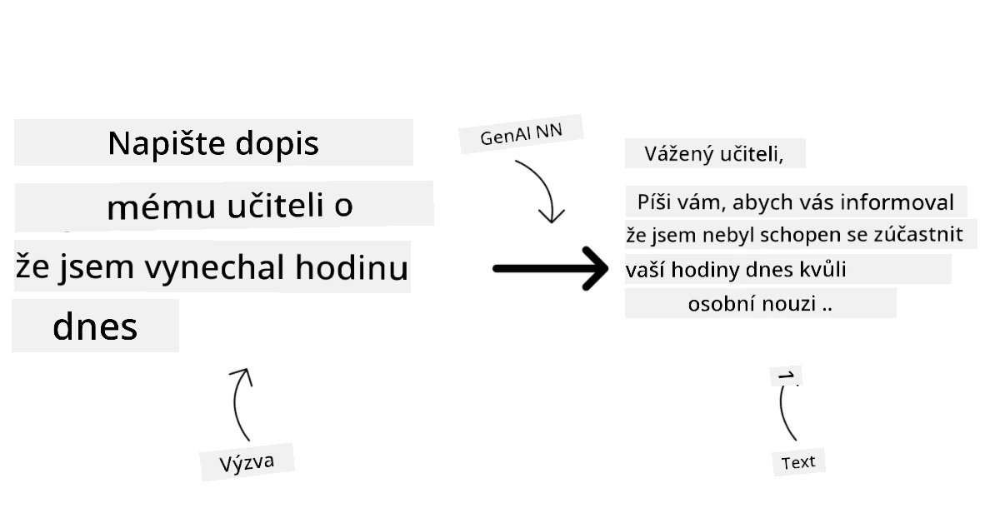

### Encoder-Decoder versus pouze Decoder

Abychom mluvili o různých architekturách LLM, použijme analogii.

Představte si, že vám váš manažer dal úkol napsat kvíz pro studenty. Máte dva kolegy; jeden dohlíží na tvorbu obsahu a druhý na jeho kontrolu.

Tvorba obsahu je jako model pouze s decoderem: může se podívat na téma, vidět, co jste už napsali, a pokračovat ve vytváření obsahu na základě tohoto kontextu. Jsou velmi dobří v psaní poutavého a informativního obsahu, ale nejsou vždy nejlepší volbou, pokud je úkolem pouze klasifikovat, vyhledat nebo zakódovat informace. Příklady rodin modelů pouze s decoderem jsou GPT a Llama modely.

Kontrolor je jako model pouze s encoderem, dívá se na napsaný kurz a odpovědi, zaznamenává vztahy mezi nimi a rozumí kontextu, ale není dobrý v generování obsahu. Příkladem modelu pouze s encoderem je BERT.

Představte si, že bychom mohli mít někoho, kdo by mohl kvíz vytvořit i zkontrolovat, to je model encoder-decoder. Některé příklady jsou BART a T5.

### Služba versus Model

Nyní pojďme hovořit o rozdílu mezi službou a modelem. Služba je produkt nabízený poskytovatelem cloudových služeb, často kombinace modelů, dat a dalších komponent. Model je základní součástí služby a často je základním modelem, jako LLM.

Služby jsou často optimalizovány pro produkční použití a jsou často snazší na používání než modely, prostřednictvím grafického uživatelského rozhraní. Služby ale nejsou vždy zdarma a mohou vyžadovat předplatné nebo platbu za použití, výměnou za využití vybavení a zdrojů vlastníka služby, optimalizaci nákladů a snadné škálování. Příkladem služby je [Azure OpenAI Service](https://learn.microsoft.com/azure/ai-foundry/openai/overview?WT.mc_id=academic-105485-koreyst), který nabízí platbu podle spotřeby, tedy uživatelé platí úměrně tomu, kolik službu používají. Azure OpenAI Service nabízí také podnikové zabezpečení a odpovědný AI rámec nad schopnostmi modelů.

Modely jsou artefakty neuronové sítě: parametry, váhy, architektura, tokenizer a podpůrná konfigurace. Spuštění modelu lokálně nebo v privátním prostředí vyžaduje vhodný hardware, infrastrukuru pro nasazení, monitoring a buď kompatibilní open-source/open-weight licenci, nebo komerční licenci. Open-weight modely, jako Llama 4 nebo Mistral modely, lze hostovat samostatně, ale i tak vyžadují výpočetní výkon a provozní zkušenosti.

## Jak testovat a iterovat s různými modely pro pochopení výkonu v Azure

Jakmile náš tým prozkoumal aktuální krajinu LLM a identifikoval několik dobrých kandidátů pro jejich scénáře, dalším krokem je testování těchto modelů na jejich datech a jejich pracovním zatížení. Jedná se o iterativní proces, prováděný pomocí experimentů a měření.
Většina modelů, které jsme zmínili v předchozích odstavcích (modely OpenAI, otevřené váhové modely jako Llama 4 a Mistral, a modely Hugging Face) je dostupná v [Microsoft Foundry Models](https://learn.microsoft.com/azure/foundry/concepts/foundry-models-overview?WT.mc_id=academic-105485-koreyst).

[Microsoft Foundry](https://learn.microsoft.com/azure/foundry/what-is-foundry?WT.mc_id=academic-105485-koreyst), dříve Azure AI Studio/Azure AI Foundry, je jednotná platforma Azure pro budování AI aplikací a agentů. Pomáhá vývojářům řídit životní cyklus od experimentování a hodnocení až po nasazení, monitorování a správu. Katalog modelů v Microsoft Foundry umožňuje uživateli:

- Najít zájmový základní model v katalogu, včetně modelů prodávaných Azure a modelů od partnerů a komunitních poskytovatelů. Uživatelé mohou filtrovat podle úkolu, poskytovatele, licence, možnosti nasazení nebo názvu.

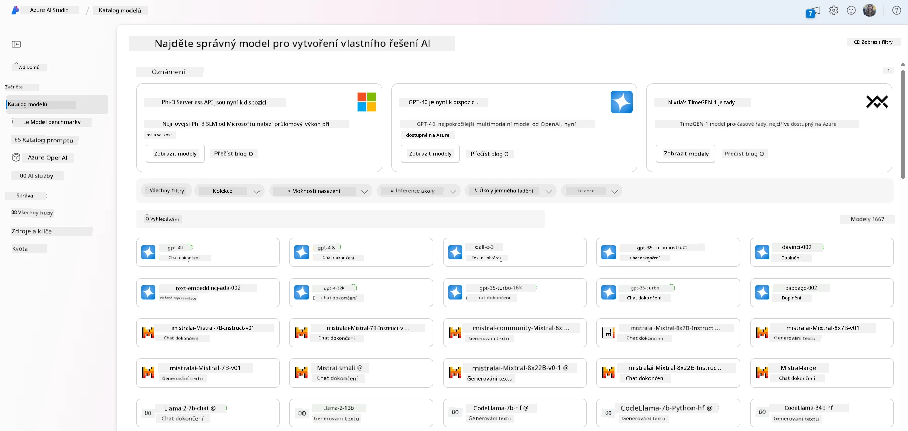

- Prohlédnout si kartu modelu, včetně podrobného popisu zamýšleného použití a tréninkových dat, ukázek kódu a výsledků hodnocení v interní knihovně hodnocení.

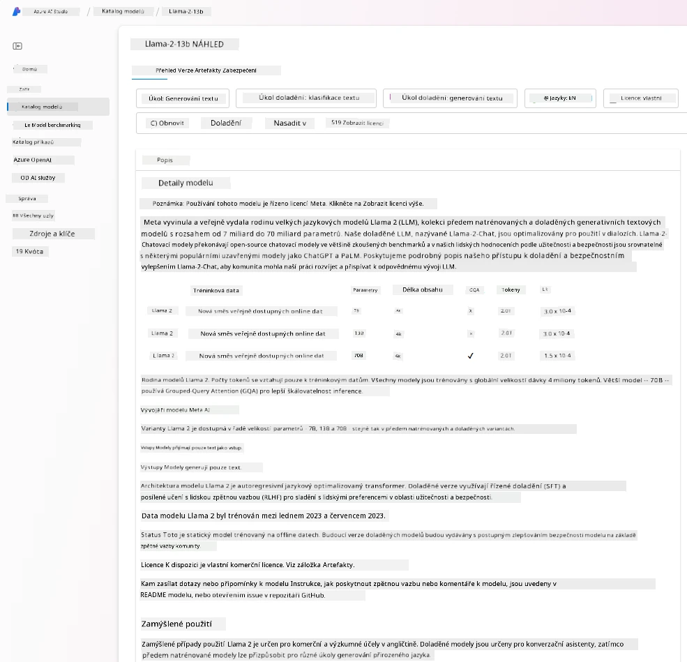

- Porovnat benchmarky mezi modely a datovými sadami dostupnými v oboru a zhodnotit, který z nich vyhovuje obchodnímu scénáři, prostřednictvím panelu [Model Benchmarks](https://learn.microsoft.com/azure/ai-foundry/concepts/model-benchmarks?WT.mc_id=academic-105485-koreyst).

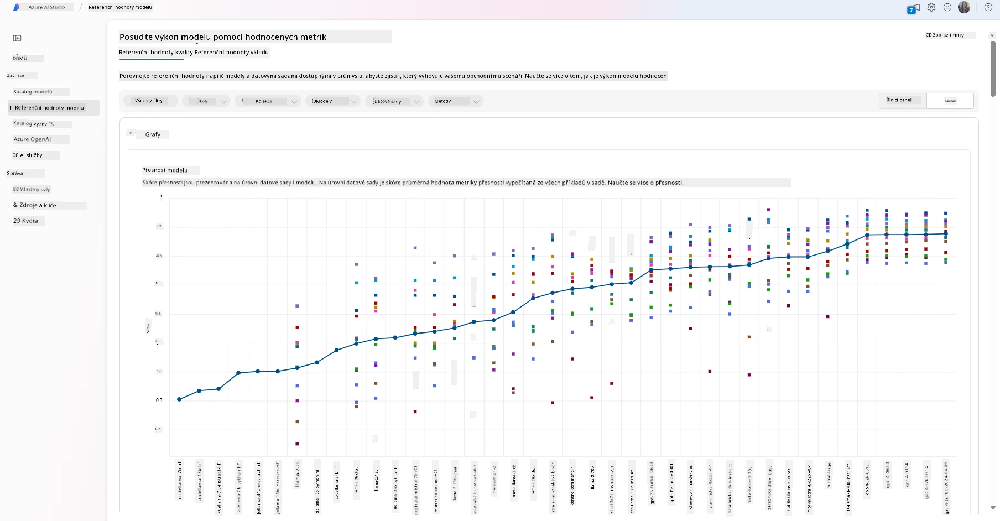

- Jemně doladit podporované modely na vlastních tréninkových datech, aby se zlepšil výkon modelu v konkrétním pracovním zatížení, s využitím možností experimentování a sledování Microsoft Foundry.

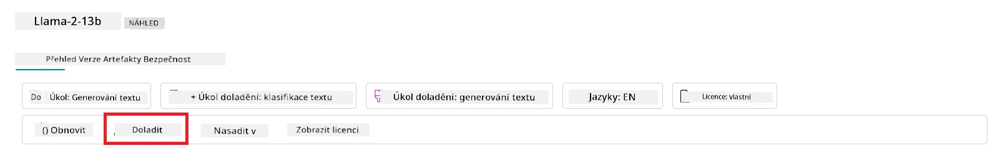

- Nasadit původní předtrénovaný model nebo doladěnou verzi na vzdálený reálný inference endpoint pomocí spravovaných výpočetních nebo serverless možností nasazení, aby aplikace mohly model používat.

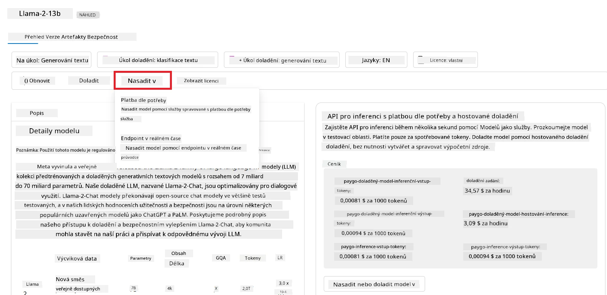

> [!NOTE]
> Ne všechny modely v katalogu jsou v současné době dostupné pro jemné doladění a/nebo nasazení na základě platby podle použití. Podrobnosti o schopnostech a omezeních modelu zjistíte na kartě modelu.

## Zlepšení výsledků LLM

Náš startupový tým prozkoumal různé druhy LLM a cloudovou platformu (Microsoft Foundry), která nám umožňuje porovnávat různé modely, hodnotit je na testovacích datech, zlepšovat výkon a nasazovat je na inference endpointy.

Kdy by však měli zvážit jemné doladění modelu namísto použití předtrénovaného? Existují i jiné přístupy, jak zlepšit výkon modelu na konkrétní pracovní zátěži?

Existuje několik přístupů, které může podnik využít k dosažení potřebných výsledků z LLM. Při nasazení LLM v produkci můžete vybrat různé typy modelů s různými stupni tréninku, s odlišnými úrovněmi složitosti, nákladů a kvality. Zde jsou některé různé přístupy:

- **Inženýrství promptů s kontextem**. Myšlenka je poskytnout dostatek kontextu při promptu, aby bylo zajištěno, že dostanete odpovědi, které potřebujete.

- **Retrieval Augmented Generation, RAG**. Vaše data mohou například existovat v databázi nebo webovém endpointu, abyste zajistili, že tato data nebo jejich podmnožina jsou zahrnuta v době promptování, můžete načíst relevantní data a udělat je součástí uživatelského promptu.

- **Jemně doladěný model**. Zde jste model dále trénovali na vlastních datech, což vede k tomu, že model je přesnější a lépe reaguje na vaše potřeby, ale může to být nákladné.

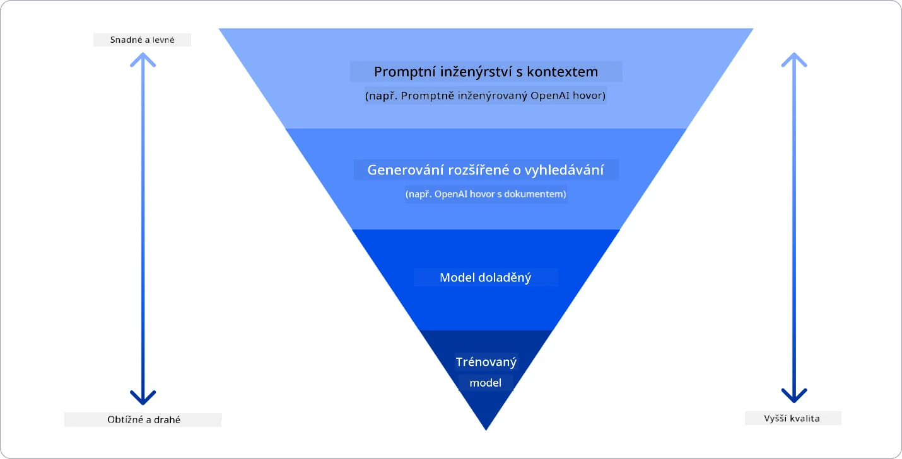

Zdroj obrázku: [Four Ways that Enterprises Deploy LLMs | Fiddler AI Blog](https://www.fiddler.ai/blog/four-ways-that-enterprises-deploy-llms?WT.mc_id=academic-105485-koreyst)

### Inženýrství promptů s kontextem

Předtrénované LLM fungují velmi dobře na obecných úlohách zpracování přirozeného jazyka, a to i při volání krátkým promptem, jako je věta k doplnění nebo otázka – tzv. "zero-shot" učení.

Čím více uživatel dokáže svým dotazem, s podrobnou žádostí a příklady – tedy kontextem – rámcovat svůj požadavek, tím přesnější a blíže očekáváním uživatele bude odpověď. V tomto případě mluvíme o "one-shot" učení, pokud prompt obsahuje pouze jeden příklad, a "few-shot" učení, pokud obsahuje více příkladů.
Inženýrství promptů s kontextem je nejúčinnější přístup na zahájení.

### Retrieval Augmented Generation (RAG)

LLM mají omezení, že mohou použít pouze data, která byla použita během jejich tréninku, ke generování odpovědi. To znamená, že nevědí nic o faktech, která se stala po jejich tréninkovém procesu, a nemají přístup k neveřejným informacím (například firemním datům).
To lze překonat pomocí RAG, techniky, která rozšiřuje prompt o externí data ve formě částí dokumentů, přičemž bere v úvahu limity délky promptu. Toto podporují nástroje s vektorovou databází (jako je [Azure Vector Search](https://learn.microsoft.com/azure/search/vector-search-overview?WT.mc_id=academic-105485-koreyst)), které vyhledávají užitečné části z různých předem definovaných zdrojů dat a přidávají je ke kontextu promptu.

Tato technika je velmi užitečná, pokud podnik nemá dostatek dat, času nebo zdrojů na jemné doladění LLM, ale přesto si přeje zlepšit výkon v konkrétním pracovním zatížení a snížit rizika chybných, zastaralých nebo nepodložených odpovědí.

### Jemně doladěný model

Jemné doladění je proces využívající přenosové učení k „přizpůsobení“ modelu konkrétnímu úkolu nebo řešení specifického problému. Na rozdíl od few-shot učení a RAG vede k vytvoření nového modelu s aktualizovanými vahami a posuny. Vyžaduje sadu tréninkových příkladů sestávajících z jednoho vstupu (promptu) a jeho odpovídajícího výstupu (doplnění).
Tento přístup by byl preferovaný, pokud:

- **Používáte menší modely zaměřené na konkrétní úkol**. Podnik by chtěl jemně doladit menší model pro úzký úkol místo opakovaného použití většího špičkového modelu, což vede k nákladově efektivnějšímu a rychlejšímu řešení.

- **Zvažujete latenci**. Latence je důležitá pro konkrétní případ použití, takže není možné použít velmi dlouhé prompty nebo počet příkladů, ze kterých by se měl model učit, neodpovídá limitu délky promptu.

- **Přizpůsobení stabilního chování**. Podnik má mnoho kvalitních příkladů a chce, aby model konzistentně dodržoval vzor úkolu, formát výstupu, tón nebo doménový styl. Pokud je hlavní problém s aktuálními fakty nebo soukromými znalostmi, které se často mění, použijte raději RAG místo spoléhání se pouze na jemné doladění.

### Trénovaný model

Trénink LLM od nuly je bezpochyby nejtěžší a nejsložitější přístup, který vyžaduje obrovské množství dat, zkušené zdroje a odpovídající výpočetní výkon. Tuto možnost byste měli zvážit pouze v situaci, kdy podnik má doménově specifický případ použití a velké množství doménově orientovaných dat.

## Kontrola znalostí

Co by mohl být dobrý přístup ke zlepšení výsledků dokončení LLM?

1. Inženýrství promptů s kontextem
1. RAG
1. Jemně doladěný model

A: Všechny tři mohou pomoci. Začněte inženýrstvím promptů a kontextem pro rychlá zlepšení a použijte RAG, když model potřebuje aktuální fakta nebo soukromá firemní data. Zvolte jemné doladění, pokud máte dostatek kvalitních příkladů a potřebujete, aby model konzistentně dodržoval vzor úkolu, formátu, tónu nebo domény.

## 🚀 Výzva

Přečtěte si více o tom, jak můžete [použít RAG](https://learn.microsoft.com/azure/search/retrieval-augmented-generation-overview?WT.mc_id=academic-105485-koreyst) pro své podnikání.

## Skvělá práce, pokračujte ve svém vzdělávání

Po dokončení této lekce si projděte naši [sbírku Generativního AI učení](https://aka.ms/genai-collection?WT.mc_id=academic-105485-koreyst), abyste pokračovali v rozšiřování svých znalostí o generativním AI!

Přesuňte se do Lekce 3, kde se podíváme, jak [budovat s generativním AI odpovědně](../03-using-generative-ai-responsibly/README.md?WT.mc_id=academic-105485-koreyst)!

---

<!-- CO-OP TRANSLATOR DISCLAIMER START -->
**Prohlášení o omezení odpovědnosti**:
Tento dokument byl přeložen pomocí AI překladatelské služby [Co-op Translator](https://github.com/Azure/co-op-translator). Přestože usilujeme o co největší přesnost, mějte prosím na paměti, že automatizované překlady mohou obsahovat chyby nebo nepřesnosti. Originální dokument v jeho mateřském jazyce by měl být považován za autoritativní zdroj. Pro kritické informace se doporučuje profesionální lidský překlad. Nejsme odpovědní za jakékoli nedorozumění nebo nesprávné interpretace vzniklé použitím tohoto překladu.
<!-- CO-OP TRANSLATOR DISCLAIMER END -->