<!--
CO_OP_TRANSLATOR_METADATA:
{
  "original_hash": "e2f686f2eb794941761252ac5e8e090b",
  "translation_date": "2025-06-25T10:58:25+00:00",
  "source_file": "02-exploring-and-comparing-different-llms/README.md",
  "language_code": "cs"
}
-->
# Zkoumání a porovnávání různých LLM

[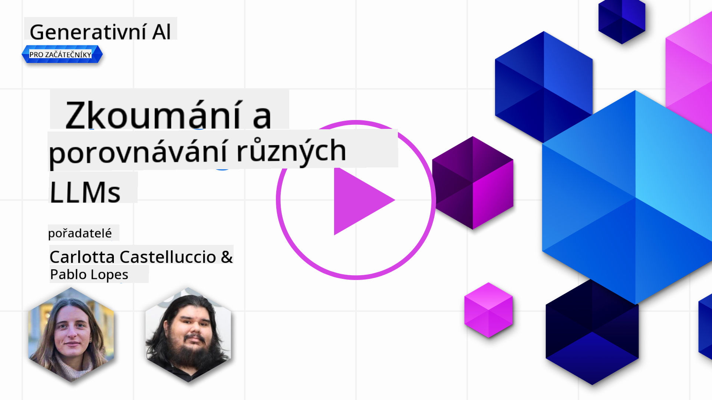](https://aka.ms/gen-ai-lesson2-gh?WT.mc_id=academic-105485-koreyst)

> _Klikněte na obrázek výše pro zhlédnutí videa této lekce_

V předchozí lekci jsme viděli, jak Generativní AI mění technologické prostředí, jak fungují velké jazykové modely (LLM) a jak je podnik - jako naše startup - může aplikovat na své případy použití a růst! V této kapitole se zaměříme na porovnání a kontrast různých typů velkých jazykových modelů (LLM), abychom pochopili jejich výhody a nevýhody.

Dalším krokem na cestě našeho startupu je prozkoumání současného prostředí LLM a pochopení, které jsou vhodné pro náš případ použití.

## Úvod

Tato lekce pokryje:

- Různé typy LLM v současném prostředí.
- Testování, iteraci a porovnávání různých modelů pro váš případ použití v Azure.
- Jak nasadit LLM.

## Cíle učení

Po dokončení této lekce budete schopni:

- Vybrat správný model pro váš případ použití.
- Pochopit, jak testovat, iterovat a zlepšovat výkon vašeho modelu.
- Vědět, jak podniky nasazují modely.

## Pochopte různé typy LLM

LLM mohou mít různé kategorizace na základě jejich architektury, tréninkových dat a případu použití. Pochopení těchto rozdílů pomůže našemu startupu vybrat správný model pro daný scénář a pochopit, jak testovat, iterovat a zlepšovat výkon.

Existuje mnoho různých typů LLM modelů, vaše volba modelu závisí na tom, co chcete s nimi dosáhnout, vašich datech, kolik jste připraveni zaplatit a dalších faktorech.

V závislosti na tom, zda chcete modely použít pro text, audio, video, generování obrázků a tak dále, můžete se rozhodnout pro jiný typ modelu.

- **Rozpoznávání zvuku a řeči**. Pro tento účel jsou modely typu Whisper skvělou volbou, protože jsou univerzální a zaměřené na rozpoznávání řeči. Jsou trénovány na různorodém zvuku a mohou provádět vícejazyčné rozpoznávání řeči. Zjistěte více o [modelech typu Whisper zde](https://platform.openai.com/docs/models/whisper?WT.mc_id=academic-105485-koreyst).

- **Generování obrázků**. Pro generování obrázků jsou dvě velmi známé volby DALL-E a Midjourney. DALL-E je nabízen Azure OpenAI. [Přečtěte si více o DALL-E zde](https://platform.openai.com/docs/models/dall-e?WT.mc_id=academic-105485-koreyst) a také v kapitole 9 tohoto kurzu.

- **Generování textu**. Většina modelů je trénována na generování textu a máte velkou škálu možností od GPT-3.5 po GPT-4. Přicházejí s různými náklady, přičemž GPT-4 je nejdražší. Stojí za to podívat se do [Azure OpenAI playground](https://oai.azure.com/portal/playground?WT.mc_id=academic-105485-koreyst) pro zhodnocení, které modely nejlépe vyhovují vašim potřebám z hlediska schopností a nákladů.

- **Multi-modalita**. Pokud chcete pracovat s více typy dat na vstupu a výstupu, můžete se podívat na modely jako [gpt-4 turbo s vizí nebo gpt-4o](https://learn.microsoft.com/azure/ai-services/openai/concepts/models#gpt-4-and-gpt-4-turbo-models?WT.mc_id=academic-105485-koreyst) - nejnovější verze modelů OpenAI - které jsou schopny kombinovat zpracování přirozeného jazyka s vizuálním porozuměním, umožňující interakce prostřednictvím multimodálních rozhraní.

Výběr modelu znamená získání základních schopností, které však nemusí být dostatečné. Často máte specifická data společnosti, která potřebujete nějakým způsobem sdělit LLM. Existuje několik různých možností, jak k tomu přistoupit, více o tom v nadcházejících sekcích.

### Základní modely versus LLM

Termín Základní model byl [vytvořen výzkumníky ze Stanfordu](https://arxiv.org/abs/2108.07258?WT.mc_id=academic-105485-koreyst) a definován jako AI model, který splňuje některá kritéria, jako například:

- **Jsou trénovány pomocí nesupervizovaného učení nebo samo-supervizovaného učení**, což znamená, že jsou trénovány na nelabelovaných multimodálních datech a nevyžadují lidskou anotaci nebo označení dat pro svůj tréninkový proces.
- **Jsou velmi velké modely**, založené na velmi hlubokých neuronových sítích trénovaných na miliardách parametrů.
- **Jsou normálně určeny jako 'základ' pro jiné modely**, což znamená, že mohou být použity jako výchozí bod pro další modely, které lze na nich postavit, což lze provést jemným doladěním.

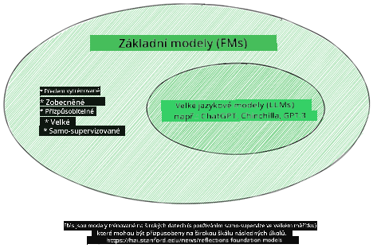

Zdroj obrázku: [Essential Guide to Foundation Models and Large Language Models | by Babar M Bhatti | Medium
](https://thebabar.medium.com/essential-guide-to-foundation-models-and-large-language-models-27dab58f7404)

Abychom tuto rozlišení dále objasnili, vezměme si jako příklad ChatGPT. K vytvoření první verze ChatGPT sloužil jako základní model model GPT-3.5. To znamená, že OpenAI použila některá data specifická pro chat k vytvoření upravené verze GPT-3.5, která byla specializována na dobrý výkon v konverzačních scénářích, jako jsou chatboti.

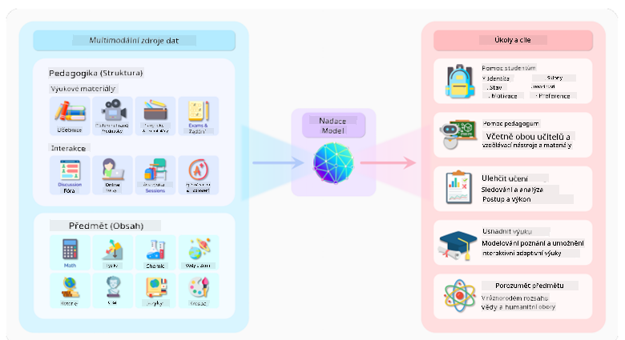

Zdroj obrázku: [2108.07258.pdf (arxiv.org)](https://arxiv.org/pdf/2108.07258.pdf?WT.mc_id=academic-105485-koreyst)

### Open Source versus Proprietární modely

Dalším způsobem, jak kategorizovat LLM, je, zda jsou open source nebo proprietární.

Open-source modely jsou modely, které jsou zpřístupněny veřejnosti a mohou být používány kýmkoliv. Často jsou zpřístupněny společností, která je vytvořila, nebo výzkumnou komunitou. Tyto modely mohou být zkoumány, modifikovány a přizpůsobeny pro různé případy použití v LLM. Nicméně nejsou vždy optimalizovány pro produkční použití a nemusí být tak výkonné jako proprietární modely. Navíc, financování pro open-source modely může být omezené a nemusí být dlouhodobě udržovány nebo aktualizovány s nejnovějším výzkumem. Příklady populárních open source modelů zahrnují [Alpaca](https://crfm.stanford.edu/2023/03/13/alpaca.html?WT.mc_id=academic-105485-koreyst), [Bloom](https://huggingface.co/bigscience/bloom) a [LLaMA](https://llama.meta.com).

Proprietární modely jsou modely, které jsou vlastněny společností a nejsou zpřístupněny veřejnosti. Tyto modely jsou často optimalizovány pro produkční použití. Nicméně, nejsou povoleny k prozkoumání, modifikaci nebo přizpůsobení pro různé případy použití. Navíc, nejsou vždy dostupné zdarma a mohou vyžadovat předplatné nebo platbu za použití. Také, uživatelé nemají kontrolu nad daty, která jsou použita k tréninku modelu, což znamená, že by měli důvěřovat vlastníkovi modelu, že zajistí závazek k ochraně dat a odpovědnému použití AI. Příklady populárních proprietárních modelů zahrnují [OpenAI modely](https://platform.openai.com/docs/models/overview?WT.mc_id=academic-105485-koreyst), [Google Bard](https://sapling.ai/llm/bard?WT.mc_id=academic-105485-koreyst) nebo [Claude 2](https://www.anthropic.com/index/claude-2?WT.mc_id=academic-105485-koreyst).

### Vkládání versus Generování obrázků versus Generování textu a kódu

LLM mohou být také kategorizovány podle výstupu, který generují.

Vkládání jsou sada modelů, které mohou převést text do numerické podoby, nazývané vkládání, což je numerická reprezentace vstupního textu. Vkládání usnadňují strojům porozumět vztahům mezi slovy nebo větami a mohou být použity jako vstupy pro jiné modely, jako jsou klasifikační modely nebo modely shlukování, které mají lepší výkon na numerických datech. Modely vkládání jsou často používány pro přenosové učení, kde je model postaven pro zástupný úkol, pro který je dostatek dat, a pak jsou váhy modelu (vkládání) znovu použity pro jiné následné úkoly. Příkladem této kategorie je [OpenAI vkládání](https://platform.openai.com/docs/models/embeddings?WT.mc_id=academic-105485-koreyst).

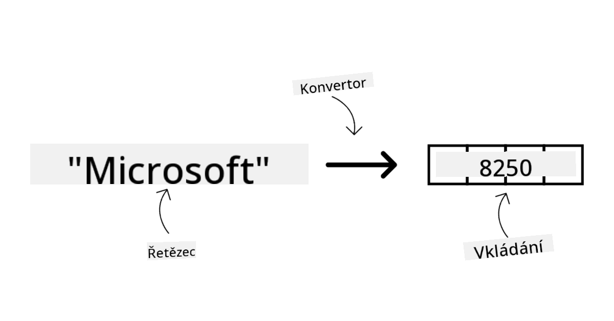

Modely generování obrázků jsou modely, které generují obrázky. Tyto modely jsou často používány pro úpravu obrázků, syntézu obrázků a překlad obrázků. Modely generování obrázků jsou často trénovány na velkých datových sadách obrázků, jako je [LAION-5B](https://laion.ai/blog/laion-5b/?WT.mc_id=academic-105485-koreyst), a mohou být použity k generování nových obrázků nebo k úpravě existujících obrázků pomocí technik jako je doplňování, superrozlišení a kolorování. Příklady zahrnují [DALL-E-3](https://openai.com/dall-e-3?WT.mc_id=academic-105485-koreyst) a [Stable Diffusion modely](https://github.com/Stability-AI/StableDiffusion?WT.mc_id=academic-105485-koreyst).

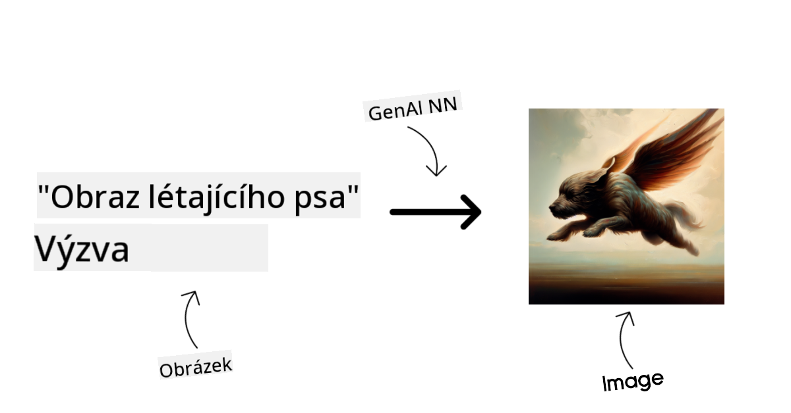

Modely generování textu a kódu jsou modely, které generují text nebo kód. Tyto modely jsou často používány pro shrnutí textu, překlad a odpovídání na otázky. Modely generování textu jsou často trénovány na velkých datových sadách textu, jako je [BookCorpus](https://www.cv-foundation.org/openaccess/content_iccv_2015/html/Zhu_Aligning_Books_and_ICCV_2015_paper.html?WT.mc_id=academic-105485-koreyst), a mohou být použity k generování nového textu nebo k odpovídání na otázky. Modely generování kódu, jako [CodeParrot](https://huggingface.co/codeparrot?WT.mc_id=academic-105485-koreyst), jsou často trénovány na velkých datových sadách kódu, jako je GitHub, a mohou být použity k generování nového kódu nebo k opravě chyb v existujícím kódu.

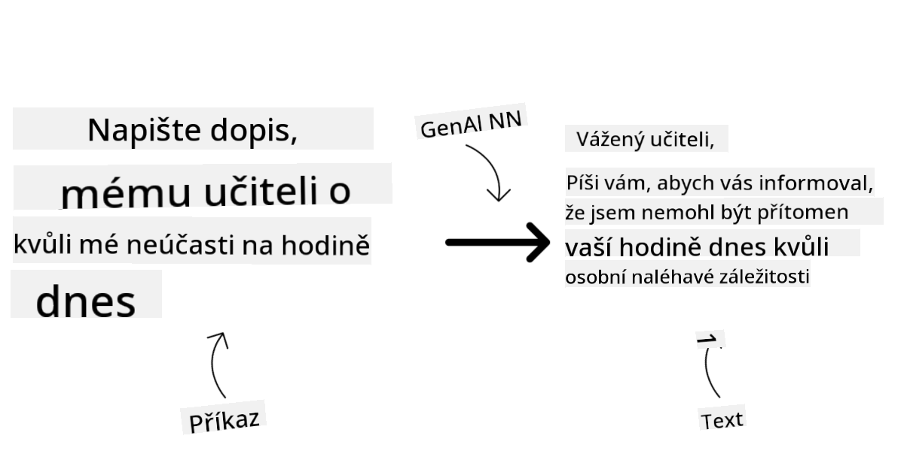

### Encoder-Decoder versus Pouze dekodér

Abychom mohli hovořit o různých typech architektur LLM, použijme analogii.

Představte si, že vám váš manažer zadal úkol napsat kvíz pro studenty. Máte dva kolegy; jeden se stará o vytváření obsahu a druhý o jeho revizi.

Tvůrce obsahu je jako model pouze dekodér, může se podívat na téma a vidět, co jste již napsali, a pak může napsat kurz na základě toho. Jsou velmi dobří ve psaní poutavého a informativního obsahu, ale nejsou příliš dobří v pochopení tématu a učebních cílů. Některé příklady modelů dekodérů jsou modely rodiny GPT, jako je GPT-3.

Recenzent je jako model pouze kodér, dívá se na napsaný kurz a odpovědi, všímá si vztahu mezi nimi a chápe kontext, ale není dobrý v generování obsahu. Příkladem modelu pouze kodér by byl BERT.

Představte si, že bychom mohli mít někoho, kdo by mohl kvíz vytvářet a recenzovat, to je model Encoder-Decoder. Některé příklady by byly BART a T5.

### Služba versus Model

Nyní si povíme o rozdílu mezi službou a modelem. Služba je produkt, který je nabízen poskytovatelem cloudových služeb a často je kombinací modelů, dat a dalších komponent. Model je hlavní součástí služby a často je to základní model, jako je LLM.

Služby jsou často optimalizovány pro produkční použití a často se snadněji používají než modely, prostřednictvím grafického uživatelského rozhraní. Nicméně, služby nejsou vždy dostupné zdarma a mohou vyžadovat předplatné nebo platbu za použití, výměnou za využití vybavení a zdrojů vlastníka služby, optimalizaci nákladů a snadné škálování. Příkladem služby je [Azure OpenAI Service](https://learn.microsoft.com/azure/ai-services/openai/overview?WT.mc_id=academic-105485-koreyst), která nabízí plán s platbou podle používání, což znamená, že uživatelé jsou účtováni proporcionálně k tomu, jak moc službu používají. Také, Azure OpenAI Service nabízí bezpečnost na podnikové úrovni a odpovědný AI rámec nad schopnostmi modelů.

Modely jsou pouze neuronové sítě, s parametry, váhami a dalšími. Umožňují společnostem provozovat místně, nicméně by potřebovaly koupit vybavení, vybudovat strukturu pro škálování a koupit licenci nebo použít open-source model. Model jako LLaMA je dostupný k použití, vyžadující výpočetní výkon k provozu modelu.

## Jak testovat a iterovat s různými modely pro pochopení výkonu na Azure

Jakmile náš tým prozkoumal současné prostředí LLM a identifikoval některé dobré kandidáty pro jejich scénáře, dalším krokem je testování na jejich datech a na jejich pracovním zatížení. Jedná se o iterativní proces, prováděný pomocí experimentů a měření.
Většina modelů, které jsme zmínili v předchozích odstavcích (OpenAI modely, open-source modely jako Llama2 a transformátory Hugging Face), jsou dostupné v [Katalogu modelů](https://learn.microsoft.com/azure/ai-studio/how-to/model-catalog-overview?WT.mc_id=academic-105485-koreyst) v [Azure AI Studio](https://ai.azure.com/?WT.mc_id=academic-105485-koreyst).

[Azure AI Studio](https://learn.microsoft.com/azure/ai-studio/what-is-ai-studio?WT.mc_id=academic-105485-koreyst) je cloudová platforma navržená pro vývojáře k vytváření generativních AI aplikací a řízení celého životního cyklu vývoje - od experimentování po hodnocení - kombinováním všech Azure AI služeb do jednoho centra s praktickým GUI. Katalog modelů v Azure AI Studio umožňuje uživateli:

- Najít Základní model zájmu v katalogu - buď proprietární nebo open-source, filtrováním podle úkolu, licence nebo jména. Pro zlepšení vyhledatelnosti jsou modely organizovány do kolekcí, jako je kolekce Azure OpenAI, kolekce Hugging Face a další.

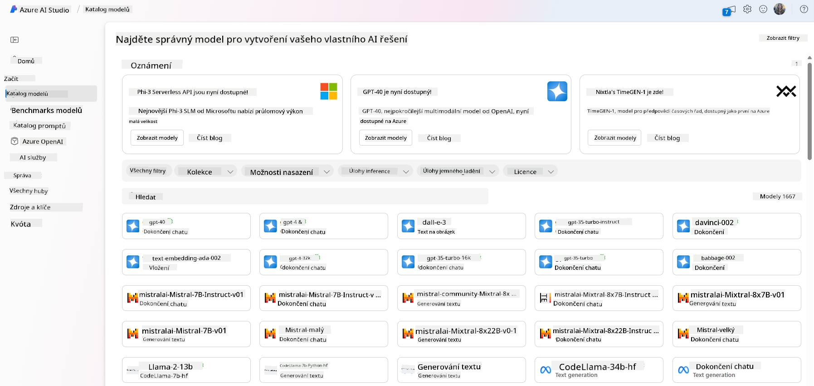

- Prohlédnout si kartu modelu, včetně podrobného popisu zamýšleného použití a tréninkových dat, ukázky kódu a výsledky hodnocení na interní knihovně hodnocení.

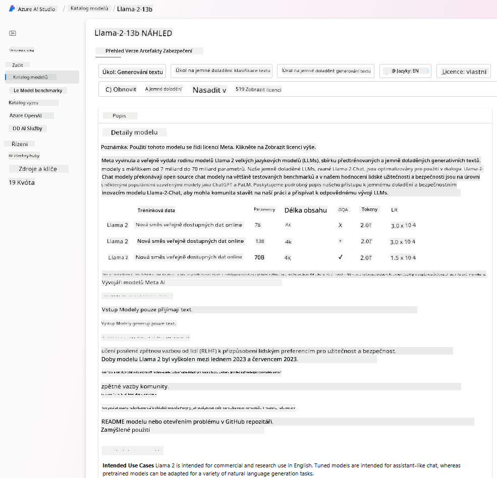
- Porovnejte benchmarky mezi modely a datovými sadami dostupnými v průmyslu, abyste zjistili, který z nich vyhovuje obchodnímu scénáři, prostřednictvím panelu [Model Benchmarks](https://learn.microsoft.com/azure/ai-studio/how-to/model-benchmarks?WT.mc_id=academic-105485-koreyst).

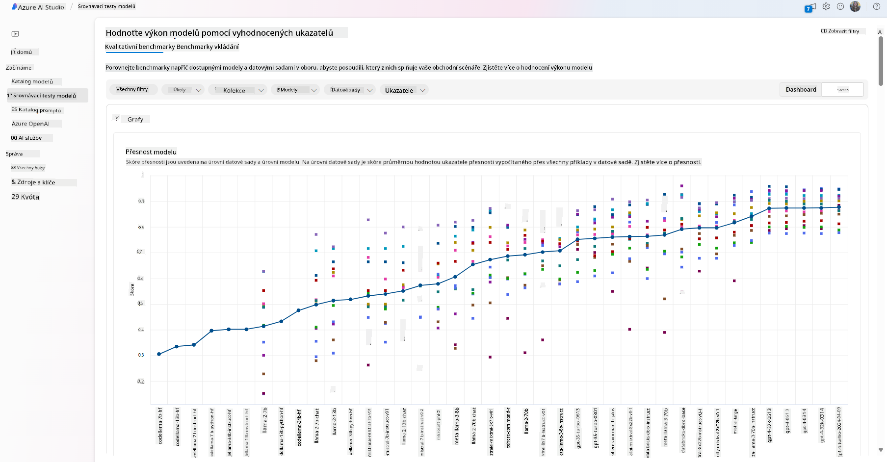

- Doladění modelu na vlastních tréninkových datech pro zlepšení výkonu modelu v konkrétním pracovním zatížení s využitím experimentačních a sledovacích funkcí Azure AI Studio.

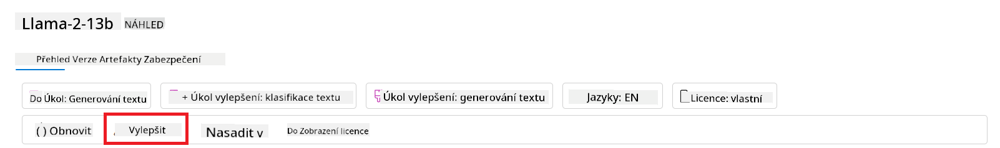

- Nasazení původního předem vytrénovaného modelu nebo doladěné verze na vzdálený real-time inferenční - spravovaný výpočetní - nebo serverless API endpoint - [pay-as-you-go](https://learn.microsoft.com/azure/ai-studio/how-to/model-catalog-overview#model-deployment-managed-compute-and-serverless-api-pay-as-you-go?WT.mc_id=academic-105485-koreyst) - aby aplikace mohly model využívat.

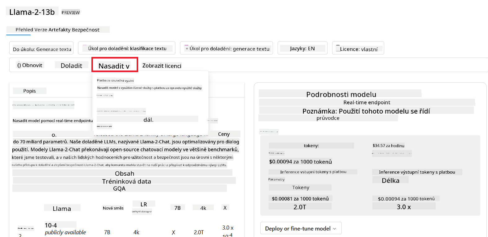

> [!NOTE]
> Ne všechny modely v katalogu jsou momentálně dostupné pro doladění a/nebo nasazení formou pay-as-you-go. Zkontrolujte kartu modelu pro podrobnosti o schopnostech a omezeních modelu.

## Zlepšení výsledků LLM

Prozkoumali jsme s naším startupovým týmem různé druhy LLM a cloudovou platformu (Azure Machine Learning), která nám umožňuje porovnávat různé modely, hodnotit je na testovacích datech, zlepšovat výkon a nasazovat je na inferenční endpointy.

Kdy by však měli zvážit doladění modelu namísto použití předem vytrénovaného? Existují jiné přístupy ke zlepšení výkonu modelu na konkrétních pracovních zatíženích?

Existuje několik přístupů, které může firma použít k dosažení požadovaných výsledků z LLM. Při nasazování LLM do produkce můžete vybírat různé typy modelů s různými stupni vytrénování, s různou úrovní složitosti, nákladů a kvality. Zde jsou některé různé přístupy:

- **Prompt engineering s kontextem**. Myšlenkou je poskytnout dostatečný kontext při zadávání promptu, aby bylo zajištěno, že dostanete požadované odpovědi.

- **Retrieval Augmented Generation, RAG**. Vaše data mohou existovat například v databázi nebo webovém endpointu. Aby bylo zajištěno, že tato data nebo jejich podmnožina jsou zahrnuta při zadávání promptu, můžete vyhledat relevantní data a zahrnout je do promptu uživatele.

- **Doladěný model**. Zde jste model dále trénovali na vlastních datech, což vedlo k tomu, že model je přesnější a lépe reaguje na vaše potřeby, ale může být nákladný.

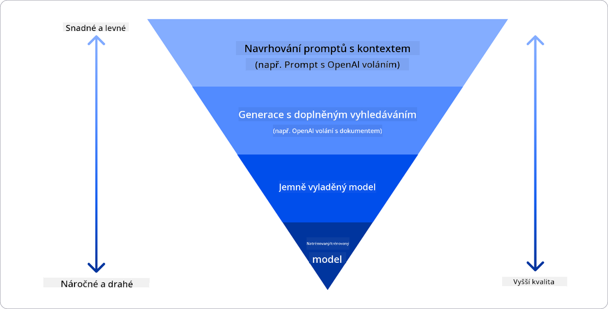

Zdroj obrázku: [Four Ways that Enterprises Deploy LLMs | Fiddler AI Blog](https://www.fiddler.ai/blog/four-ways-that-enterprises-deploy-llms?WT.mc_id=academic-105485-koreyst)

### Prompt Engineering s kontextem

Předem vytrénované LLM fungují velmi dobře na obecné úkoly v oblasti přirozeného jazyka, i když jsou volány s krátkým promptem, jako je věta k dokončení nebo otázka – takzvané „zero-shot“ učení.

Nicméně čím více může uživatel formulovat svůj dotaz, s podrobným požadavkem a příklady – Kontext – tím přesnější a bližší očekáváním uživatele bude odpověď. V tomto případě mluvíme o „one-shot“ učení, pokud prompt obsahuje pouze jeden příklad, a „few-shot učení“, pokud obsahuje více příkladů. Prompt engineering s kontextem je nejúspornější přístup k zahájení.

### Retrieval Augmented Generation (RAG)

LLM mají omezení, že mohou použít pouze data, která byla použita během jejich tréninku k generování odpovědi. To znamená, že neznají nic o faktech, která se stala po jejich tréninkovém procesu, a nemohou přistupovat k neveřejným informacím (jako jsou data společnosti).
To lze překonat prostřednictvím RAG, techniky, která rozšiřuje prompt o externí data ve formě úryvků dokumentů, s ohledem na limity délky promptu. To je podporováno nástroji pro vektorové databáze (jako [Azure Vector Search](https://learn.microsoft.com/azure/search/vector-search-overview?WT.mc_id=academic-105485-koreyst)), které vyhledávají užitečné úryvky z různých předdefinovaných datových zdrojů a přidávají je do kontextu promptu.

Tato technika je velmi užitečná, když firma nemá dostatek dat, času nebo prostředků na doladění LLM, ale stále si přeje zlepšit výkon na konkrétním pracovním zatížení a snížit riziko mystifikací, tj. zkreslení reality nebo škodlivého obsahu.

### Doladěný model

Doladění je proces, který využívá transfer learning k „přizpůsobení“ modelu pro následnou úlohu nebo k řešení konkrétního problému. Na rozdíl od few-shot učení a RAG vede k vytvoření nového modelu s aktualizovanými váhami a biasy. Vyžaduje sadu tréninkových příkladů sestávajících z jednoho vstupu (promptu) a jeho souvisejícího výstupu (dokončení).
Toto by byl preferovaný přístup, pokud:

- **Použití doladěných modelů**. Firma by chtěla používat doladěné méně schopné modely (jako embedovací modely) namísto modelů s vysokým výkonem, což by vedlo k nákladově efektivnějšímu a rychlejšímu řešení.

- **Zvažování latence**. Latence je důležitá pro konkrétní případ použití, takže není možné použít velmi dlouhé prompty nebo počet příkladů, které by se měl model naučit, neodpovídá limitu délky promptu.

- **Zůstat aktuální**. Firma má mnoho vysoce kvalitních dat a správné označení pravdy a prostředky potřebné k udržování těchto dat aktuálních v průběhu času.

### Vytrénovaný model

Trénování LLM od nuly je bezesporu nejtěžší a nejsložitější přístup k přijetí, vyžadující obrovské množství dat, kvalifikované zdroje a odpovídající výpočetní výkon. Tuto možnost by bylo vhodné zvážit pouze v případě, kdy má firma případ použití specifický pro danou doménu a velké množství dat zaměřených na danou doménu.

## Ověření znalostí

Jaký by mohl být dobrý přístup ke zlepšení výsledků dokončení LLM?

1. Prompt engineering s kontextem
1. RAG
1. Doladěný model

A:3, pokud máte čas a prostředky a kvalitní data, doladění je lepší volbou pro zůstání aktuální. Nicméně, pokud se snažíte věci zlepšit a máte nedostatek času, stojí za to nejprve zvážit RAG.

## 🚀 Výzva

Zjistěte více o tom, jak můžete [použít RAG](https://learn.microsoft.com/azure/search/retrieval-augmented-generation-overview?WT.mc_id=academic-105485-koreyst) pro vaše podnikání.

## Skvělá práce, pokračujte ve svém učení

Po dokončení této lekce se podívejte na naši [Generative AI Learning collection](https://aka.ms/genai-collection?WT.mc_id=academic-105485-koreyst) a pokračujte ve zvyšování své znalosti o Generativní AI!

Přejděte na lekci 3, kde se podíváme na to, jak [stavět s Generativní AI zodpovědně](../03-using-generative-ai-responsibly/README.md?WT.mc_id=academic-105485-koreyst)!

**Prohlášení**:  
Tento dokument byl přeložen pomocí služby pro automatizovaný překlad [Co-op Translator](https://github.com/Azure/co-op-translator). I když se snažíme o přesnost, mějte prosím na paměti, že automatizované překlady mohou obsahovat chyby nebo nepřesnosti. Původní dokument ve svém rodném jazyce by měl být považován za autoritativní zdroj. Pro důležité informace se doporučuje profesionální lidský překlad. Nejsme zodpovědní za jakékoli nedorozumění nebo nesprávné interpretace vyplývající z použití tohoto překladu.