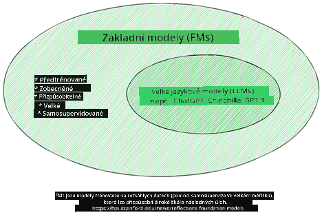
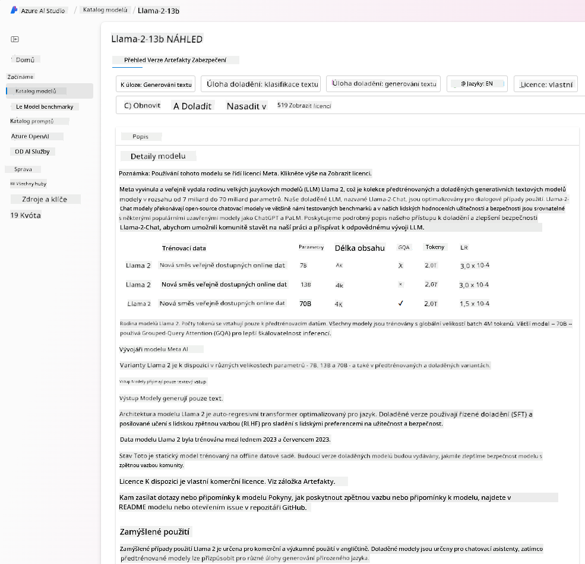
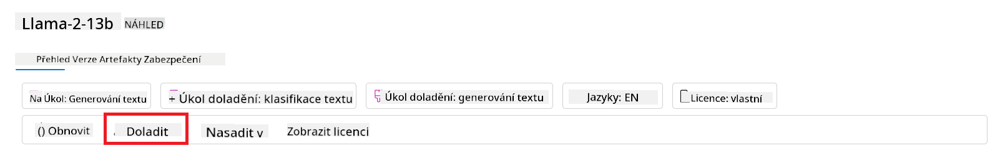
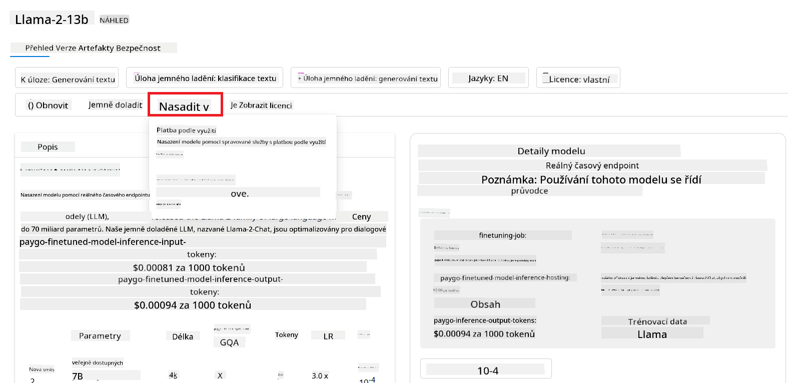

<!--
CO_OP_TRANSLATOR_METADATA:
{
  "original_hash": "6b7629b8ee4d7d874a27213e903d86a7",
  "translation_date": "2025-10-17T21:39:30+00:00",
  "source_file": "02-exploring-and-comparing-different-llms/README.md",
  "language_code": "cs"
}
-->
# Zkoumání a porovnávání různých LLM

> _Klikněte na obrázek výše pro zhlédnutí videa této lekce_

V předchozí lekci jsme viděli, jak Generativní AI mění technologické prostředí, jak fungují velké jazykové modely (LLM) a jak je může firma - jako náš startup - aplikovat na své případy použití a růst! V této kapitole se zaměříme na porovnání různých typů velkých jazykových modelů (LLM), abychom pochopili jejich výhody a nevýhody.

Dalším krokem na cestě našeho startupu je prozkoumání současného prostředí LLM a pochopení, které z nich jsou vhodné pro náš případ použití.

## Úvod

Tato lekce pokryje:

- Různé typy LLM v současném prostředí.
- Testování, iteraci a porovnávání různých modelů pro váš případ použití v Azure.
- Jak nasadit LLM.

## Cíle učení

Po dokončení této lekce budete schopni:

- Vybrat správný model pro váš případ použití.
- Pochopit, jak testovat, iterovat a zlepšovat výkon vašeho modelu.
- Vědět, jak firmy nasazují modely.

## Pochopení různých typů LLM

LLM mohou být kategorizovány podle jejich architektury, tréninkových dat a případu použití. Pochopení těchto rozdílů pomůže našemu startupu vybrat správný model pro daný scénář a pochopit, jak testovat, iterovat a zlepšovat výkon.

Existuje mnoho různých typů LLM modelů, výběr modelu závisí na tom, k čemu je chcete použít, na vašich datech, na tom, kolik jste ochotni zaplatit a dalších faktorech.

V závislosti na tom, zda chcete modely použít pro generování textu, audia, videa, obrázků a podobně, můžete zvolit jiný typ modelu.

- **Rozpoznávání zvuku a řeči**. Pro tento účel jsou modely typu Whisper skvělou volbou, protože jsou univerzální a zaměřené na rozpoznávání řeči. Jsou trénovány na různorodém zvuku a dokážou provádět vícejazyčné rozpoznávání řeči. Více o [modelech typu Whisper zde](https://platform.openai.com/docs/models/whisper?WT.mc_id=academic-105485-koreyst).

- **Generování obrázků**. Pro generování obrázků jsou dvě velmi známé volby DALL-E a Midjourney. DALL-E je nabízeno službou Azure OpenAI. [Přečtěte si více o DALL-E zde](https://platform.openai.com/docs/models/dall-e?WT.mc_id=academic-105485-koreyst) a také v kapitole 9 tohoto kurzu.

- **Generování textu**. Většina modelů je trénována na generování textu a máte širokou škálu možností od GPT-3.5 po GPT-4. Přicházejí s různými náklady, přičemž GPT-4 je nejdražší. Stojí za to podívat se na [Azure OpenAI playground](https://oai.azure.com/portal/playground?WT.mc_id=academic-105485-koreyst), abyste vyhodnotili, které modely nejlépe vyhovují vašim potřebám z hlediska schopností a nákladů.

- **Multimodalita**. Pokud chcete pracovat s více typy dat na vstupu a výstupu, můžete se podívat na modely jako [gpt-4 turbo s vizí nebo gpt-4o](https://learn.microsoft.com/azure/ai-services/openai/concepts/models#gpt-4-and-gpt-4-turbo-models?WT.mc_id=academic-105485-koreyst) - nejnovější verze modelů OpenAI - které dokážou kombinovat zpracování přirozeného jazyka s vizuálním porozuměním, což umožňuje interakce prostřednictvím multimodálních rozhraní.

Výběr modelu znamená získání základních schopností, které však nemusí být dostatečné. Často máte firemní specifická data, která nějakým způsobem potřebujete sdělit LLM. Existuje několik různých přístupů, jak to udělat, více o tom v nadcházejících sekcích.

### Základní modely versus LLM

Termín Základní model byl [zaveden výzkumníky ze Stanfordu](https://arxiv.org/abs/2108.07258?WT.mc_id=academic-105485-koreyst) a je definován jako AI model, který splňuje některá kritéria, například:

- **Jsou trénovány pomocí neřízeného učení nebo samostatně řízeného učení**, což znamená, že jsou trénovány na neoznačených multimodálních datech a nevyžadují lidské anotace nebo označování dat pro svůj tréninkový proces.
- **Jsou velmi velké modely**, založené na velmi hlubokých neuronových sítích trénovaných na miliardách parametrů.
- **Obvykle slouží jako „základ“ pro jiné modely**, což znamená, že mohou být použity jako výchozí bod pro vytvoření dalších modelů, což lze provést jemným doladěním.

Zdroj obrázku: [Essential Guide to Foundation Models and Large Language Models | by Babar M Bhatti | Medium
](https://thebabar.medium.com/essential-guide-to-foundation-models-and-large-language-models-27dab58f7404)

Pro další objasnění tohoto rozlišení si vezměme jako příklad ChatGPT. Pro vytvoření první verze ChatGPT sloužil model GPT-3.5 jako základní model. To znamená, že OpenAI použilo některá data specifická pro chat k vytvoření upravené verze GPT-3.5, která byla specializována na dobrý výkon v konverzačních scénářích, jako jsou chatboty.

Zdroj obrázku: [2108.07258.pdf (arxiv.org)](https://arxiv.org/pdf/2108.07258.pdf?WT.mc_id=academic-105485-koreyst)

### Open Source versus Proprietární modely

Dalším způsobem kategorizace LLM je, zda jsou open source nebo proprietární.

Open-source modely jsou modely, které jsou zpřístupněny veřejnosti a mohou být použity kýmkoli. Často jsou zpřístupněny společností, která je vytvořila, nebo výzkumnou komunitou. Tyto modely mohou být prohlíženy, upravovány a přizpůsobovány pro různé případy použití v LLM. Nicméně nejsou vždy optimalizovány pro produkční použití a nemusí být tak výkonné jako proprietární modely. Navíc financování open-source modelů může být omezené, nemusí být dlouhodobě udržovány nebo aktualizovány s nejnovějším výzkumem. Příklady populárních open-source modelů zahrnují [Alpaca](https://crfm.stanford.edu/2023/03/13/alpaca.html?WT.mc_id=academic-105485-koreyst), [Bloom](https://huggingface.co/bigscience/bloom) a [LLaMA](https://llama.meta.com).

Proprietární modely jsou modely, které vlastní společnost a nejsou zpřístupněny veřejnosti. Tyto modely jsou často optimalizovány pro produkční použití. Nicméně není dovoleno je prohlížet, upravovat nebo přizpůsobovat pro různé případy použití. Navíc nejsou vždy dostupné zdarma a mohou vyžadovat předplatné nebo platbu za použití. Uživatelé také nemají kontrolu nad daty, která jsou použita k trénování modelu, což znamená, že by měli důvěřovat vlastníkovi modelu, že zajistí závazek k ochraně dat a odpovědnému používání AI. Příklady populárních proprietárních modelů zahrnují [OpenAI modely](https://platform.openai.com/docs/models/overview?WT.mc_id=academic-105485-koreyst), [Google Bard](https://sapling.ai/llm/bard?WT.mc_id=academic-105485-koreyst) nebo [Claude 2](https://www.anthropic.com/index/claude-2?WT.mc_id=academic-105485-koreyst).

### Embedding versus Generování obrázků versus Generování textu a kódu

LLM mohou být také kategorizovány podle výstupu, který generují.

Embeddings jsou sada modelů, které dokážou převést text do numerické podoby, nazývané embedding, což je numerická reprezentace vstupního textu. Embeddings usnadňují strojům pochopení vztahů mezi slovy nebo větami a mohou být použity jako vstupy pro jiné modely, jako jsou klasifikační modely nebo modely shlukování, které mají lepší výkon na numerických datech. Embedding modely se často používají pro transfer learning, kde je model vytvořen pro náhradní úkol, pro který je dostatek dat, a poté jsou váhy modelu (embeddings) znovu použity pro jiné následné úkoly. Příkladem této kategorie je [OpenAI embeddings](https://platform.openai.com/docs/models/embeddings?WT.mc_id=academic-105485-koreyst).

Modely generování obrázků jsou modely, které generují obrázky. Tyto modely se často používají pro úpravy obrázků, syntézu obrázků a překlad obrázků. Modely generování obrázků jsou často trénovány na velkých datových sadách obrázků, jako je [LAION-5B](https://laion.ai/blog/laion-5b/?WT.mc_id=academic-105485-koreyst), a mohou být použity k vytváření nových obrázků nebo k úpravě existujících obrázků pomocí technik jako inpainting, super-rozlišení a kolorování. Příklady zahrnují [DALL-E-3](https://openai.com/dall-e-3?WT.mc_id=academic-105485-koreyst) a [Stable Diffusion models](https://github.com/Stability-AI/StableDiffusion?WT.mc_id=academic-105485-koreyst).

Modely generování textu a kódu jsou modely, které generují text nebo kód. Tyto modely se často používají pro sumarizaci textu, překlad a odpovídání na otázky. Modely generování textu jsou často trénovány na velkých datových sadách textu, jako je [BookCorpus](https://www.cv-foundation.org/openaccess/content_iccv_2015/html/Zhu_Aligning_Books_and_ICCV_2015_paper.html?WT.mc_id=academic-105485-koreyst), a mohou být použity k vytváření nového textu nebo k odpovídání na otázky. Modely generování kódu, jako [CodeParrot](https://huggingface.co/codeparrot?WT.mc_id=academic-105485-koreyst), jsou často trénovány na velkých datových sadách kódu, jako je GitHub, a mohou být použity k vytváření nového kódu nebo k opravě chyb v existujícím kódu.

### Encoder-Decoder versus Pouze Decoder

Abychom mohli hovořit o různých typech architektur LLM, použijme analogii.

Představte si, že vám váš nadřízený zadal úkol napsat kvíz pro studenty. Máte dva kolegy; jeden se stará o tvorbu obsahu a druhý o jeho kontrolu.

Tvůrce obsahu je jako model pouze Decoder, může se podívat na téma a na to, co jste již napsali, a na základě toho vytvořit kurz. Jsou velmi dobří v psaní poutavého a informativního obsahu, ale nejsou příliš dobří v pochopení tématu a vzdělávacích cílů. Některé příklady modelů pouze Decoder jsou modely rodiny GPT, jako je GPT-3.

Recenzent je jako model pouze Encoder, podívá se na napsaný kurz a odpovědi, všimne si vztahu mezi nimi a pochopí kontext, ale není dobrý v generování obsahu. Příkladem modelu pouze Encoder by byl BERT.

Představte si, že bychom mohli mít někoho, kdo by mohl kvíz vytvořit i zkontrolovat, to je model Encoder-Decoder. Některé příklady by byly BART a T5.

### Služba versus Model

Nyní si povíme o rozdílu mezi službou a modelem. Služba je produkt, který je nabízen poskytovatelem cloudových služeb a často je kombinací modelů, dat a dalších komponent. Model je základní součástí služby a často je základním modelem, jako je LLM.

Služby jsou často optimalizovány pro produkční použití a často se snadněji používají než modely, prostřednictvím grafického uživatelského rozhraní. Nicméně služby nejsou vždy dostupné zdarma a mohou vyžadovat předplatné nebo platbu za použití, výměnou za využití vybavení a zdrojů vlastníka služby, optimalizaci nákladů a snadné škálování. Příkladem služby je [Azure OpenAI Service](https://learn.microsoft.com/azure/ai-services/openai/overview?WT.mc_id=academic-105485-koreyst), která nabízí plán plateb podle využití, což znamená, že uživatelé jsou účtováni úměrně tomu, kolik službu využívají. Navíc Azure OpenAI Service nabízí bezpečnost na úrovni podniku a rámec odpovědné AI nad schopnostmi modelů.

Modely jsou pouze neuronová síť, s parametry, váhami a dalšími. Umožňují firmám provozovat lokálně, avšak vyžadují nákup vybavení, vytvoření struktury pro škálování a zakoupení licence nebo použití open-source modelu. Model jako LLaMA je dostupný k použití, vyžaduje však výpočetní výkon pro provoz modelu.

## Jak testovat a iterovat s různými modely pro pochopení výkonu v Azure

Jakmile náš tým prozkoumá současné prostředí LLM a identifikuje některé dobré kandidáty pro své scénáře, dalším krokem je jejich testování na vlastních datech a pracovních zátěžích. Jedná se o iterativní proces, který se provádí prostřednictvím experimentů a měření.
Většina modelů, které jsme zmínili v předchozích odstavcích (modely OpenAI, open source modely jako Llama2 a Hugging Face transformers), je dostupná v [Modelovém katalogu](https://learn.microsoft.com/azure/ai-studio/how-to/model-catalog-overview?WT.mc_id=academic-105485-koreyst) v [Azure AI Studio](https://ai.azure.com/?WT.mc_id=academic-105485-koreyst).

[Azure AI Studio](https://learn.microsoft.com/azure/ai-studio/what-is-ai-studio?WT.mc_id=academic-105485-koreyst) je cloudová platforma navržená pro vývojáře, kteří chtějí vytvářet aplikace generativní AI a spravovat celý vývojový cyklus – od experimentování po hodnocení – kombinací všech služeb Azure AI do jednoho centra s praktickým grafickým rozhraním. Modelový katalog v Azure AI Studio umožňuje uživatelům:

- Najít základní model, který je zajímá, v katalogu – ať už proprietární nebo open source, s možností filtrování podle úkolu, licence nebo názvu. Pro zlepšení vyhledávání jsou modely organizovány do kolekcí, jako je kolekce Azure OpenAI, kolekce Hugging Face a další.

- Prohlédnout si kartu modelu, která obsahuje podrobný popis zamýšleného použití a tréninkových dat, ukázky kódu a výsledky hodnocení z interní knihovny hodnocení.

- Porovnat benchmarky napříč modely a datovými sadami dostupnými v průmyslu, aby bylo možné posoudit, který model nejlépe odpovídá obchodnímu scénáři, prostřednictvím panelu [Model Benchmarks](https://learn.microsoft.com/azure/ai-studio/how-to/model-benchmarks?WT.mc_id=academic-105485-koreyst).

- Doladit model na vlastních tréninkových datech, aby se zlepšil výkon modelu v konkrétní pracovní zátěži, s využitím experimentálních a sledovacích schopností Azure AI Studio.

- Nasadit původní předtrénovaný model nebo doladěnou verzi na vzdálené rozhraní pro inferenci v reálném čase – spravovaný výpočetní výkon – nebo serverless API endpoint – [platba za použití](https://learn.microsoft.com/azure/ai-studio/how-to/model-catalog-overview#model-deployment-managed-compute-and-serverless-api-pay-as-you-go?WT.mc_id=academic-105485-koreyst) – aby aplikace mohly model využívat.

> [!NOTE]
> Ne všechny modely v katalogu jsou aktuálně dostupné pro doladění a/nebo nasazení s platbou za použití. Podrobnosti o schopnostech a omezeních modelu najdete na jeho kartě.

## Zlepšení výsledků LLM

S naším startupovým týmem jsme prozkoumali různé typy LLM a cloudovou platformu (Azure Machine Learning), která nám umožňuje porovnávat různé modely, hodnotit je na testovacích datech, zlepšovat jejich výkon a nasazovat je na inferenční endpointy.

Kdy by měli zvážit doladění modelu místo použití předtrénovaného? Existují jiné přístupy ke zlepšení výkonu modelu na specifických pracovních zátěžích?

Existuje několik přístupů, které může firma použít k dosažení požadovaných výsledků z LLM. Při nasazování LLM do produkce můžete vybírat různé typy modelů s různými stupni tréninku, s různou úrovní složitosti, nákladů a kvality. Zde jsou některé přístupy:

- **Prompt engineering s kontextem**. Cílem je poskytnout dostatek kontextu při zadávání promptu, aby bylo zajištěno, že dostanete požadované odpovědi.

- **Retrieval Augmented Generation, RAG**. Vaše data mohou být například v databázi nebo na webovém endpointu. Aby byla tato data nebo jejich podmnožina zahrnuta při zadávání promptu, můžete relevantní data načíst a přidat je do promptu uživatele.

- **Doladěný model**. Zde model dále trénujete na vlastních datech, což vede k tomu, že model je přesnější a lépe reaguje na vaše potřeby, ale může být nákladný.

Zdroj obrázku: [Čtyři způsoby, jak firmy nasazují LLM | Fiddler AI Blog](https://www.fiddler.ai/blog/four-ways-that-enterprises-deploy-llms?WT.mc_id=academic-105485-koreyst)

### Prompt engineering s kontextem

Předtrénované LLM fungují velmi dobře na obecné úkoly v oblasti přirozeného jazyka, i když je voláte s krátkým promptem, například větou k dokončení nebo otázkou – tzv. „zero-shot“ učení.

Nicméně čím více uživatel dokáže formulovat svůj dotaz, s podrobným požadavkem a příklady – tedy Kontextem – tím přesnější a bližší očekáváním uživatele bude odpověď. V tomto případě mluvíme o „one-shot“ učení, pokud prompt obsahuje pouze jeden příklad, a o „few-shot“ učení, pokud obsahuje více příkladů. Prompt engineering s kontextem je nejefektivnější přístup pro začátek.

### Retrieval Augmented Generation (RAG)

LLM mají omezení v tom, že mohou používat pouze data, která byla použita během jejich tréninku k vytvoření odpovědi. To znamená, že neznají nic o faktech, která se stala po jejich tréninkovém procesu, a nemohou přistupovat k neveřejným informacím (například firemním datům).
Toto lze překonat pomocí RAG, techniky, která rozšiřuje prompt o externí data ve formě částí dokumentů, s ohledem na limity délky promptu. To je podporováno nástroji pro vektorové databáze (jako [Azure Vector Search](https://learn.microsoft.com/azure/search/vector-search-overview?WT.mc_id=academic-105485-koreyst)), které získávají užitečné části z různých předem definovaných datových zdrojů a přidávají je do kontextu promptu.

Tato technika je velmi užitečná, když firma nemá dostatek dat, času nebo zdrojů na doladění LLM, ale přesto si přeje zlepšit výkon na specifické pracovní zátěži a snížit riziko mystifikací, tj. zkreslení reality nebo škodlivého obsahu.

### Doladěný model

Doladění je proces, který využívá transferové učení k „přizpůsobení“ modelu na konkrétní úkol nebo k řešení specifického problému. Na rozdíl od few-shot učení a RAG vede k vytvoření nového modelu s aktualizovanými váhami a biasy. Vyžaduje sadu tréninkových příkladů, které se skládají z jednoho vstupu (promptu) a jeho odpovídajícího výstupu (dokončení).
Tento přístup by byl preferován, pokud:

- **Použití doladěných modelů**. Firma by chtěla použít doladěné méně schopné modely (jako embedding modely) místo vysoce výkonných modelů, což by vedlo k nákladově efektivnějšímu a rychlejšímu řešení.

- **Zohlednění latence**. Latence je důležitá pro konkrétní případ použití, takže není možné použít velmi dlouhé prompty nebo počet příkladů, které by se měly modelu naučit, neodpovídá limitu délky promptu.

- **Aktualizace dat**. Firma má velké množství kvalitních dat a referenčních štítků a zdroje potřebné k tomu, aby tato data byla průběžně aktualizována.

### Trénovaný model

Trénování LLM od začátku je bezpochyby nejnáročnější a nejsložitější přístup, který vyžaduje obrovské množství dat, kvalifikované zdroje a odpovídající výpočetní výkon. Tuto možnost by bylo vhodné zvážit pouze v situaci, kdy má firma případ použití specifický pro danou oblast a velké množství dat zaměřených na danou oblast.

## Kontrola znalostí

Jaký by mohl být dobrý přístup ke zlepšení výsledků dokončení LLM?

1. Prompt engineering s kontextem  
1. RAG  
1. Doladěný model  

A:3, pokud máte čas, zdroje a kvalitní data, doladění je lepší možnost, jak zůstat aktuální. Nicméně pokud chcete zlepšit výsledky a nemáte dostatek času, stojí za to nejprve zvážit RAG.

## 🚀 Výzva

Zjistěte více o tom, jak můžete [použít RAG](https://learn.microsoft.com/azure/search/retrieval-augmented-generation-overview?WT.mc_id=academic-105485-koreyst) pro vaše podnikání.

## Skvělá práce, pokračujte ve svém vzdělávání

Po dokončení této lekce se podívejte na naši [kolekci Generative AI Learning](https://aka.ms/genai-collection?WT.mc_id=academic-105485-koreyst), abyste si dále rozšířili své znalosti o generativní AI!

Přejděte na lekci 3, kde se podíváme na to, jak [budovat s generativní AI odpovědně](../03-using-generative-ai-responsibly/README.md?WT.mc_id=academic-105485-koreyst)!

---

**Prohlášení**:  
Tento dokument byl přeložen pomocí služby AI pro překlad [Co-op Translator](https://github.com/Azure/co-op-translator). Ačkoli se snažíme o přesnost, mějte prosím na paměti, že automatizované překlady mohou obsahovat chyby nebo nepřesnosti. Původní dokument v jeho původním jazyce by měl být považován za autoritativní zdroj. Pro důležité informace se doporučuje profesionální lidský překlad. Neodpovídáme za žádná nedorozumění nebo nesprávné interpretace vyplývající z použití tohoto překladu.