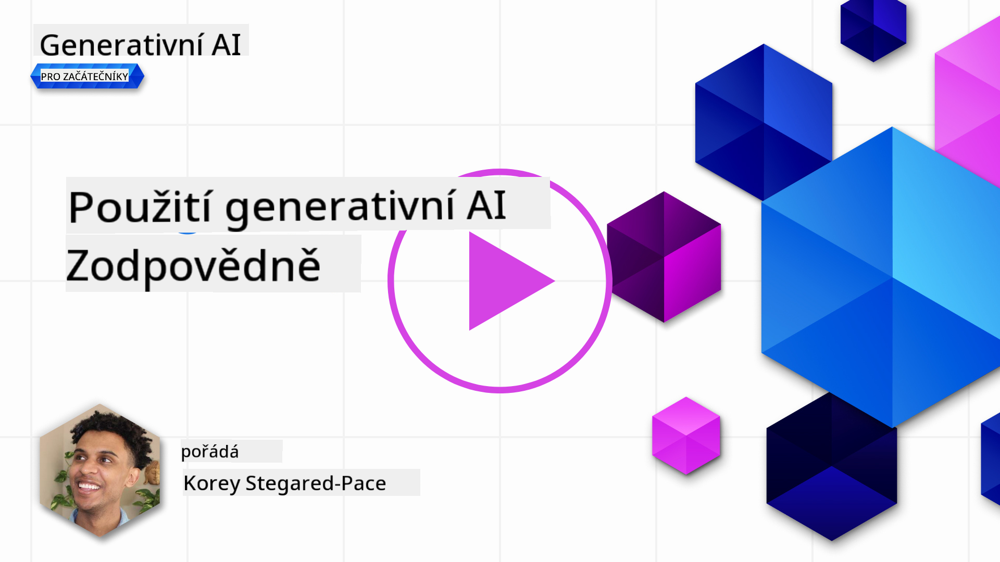
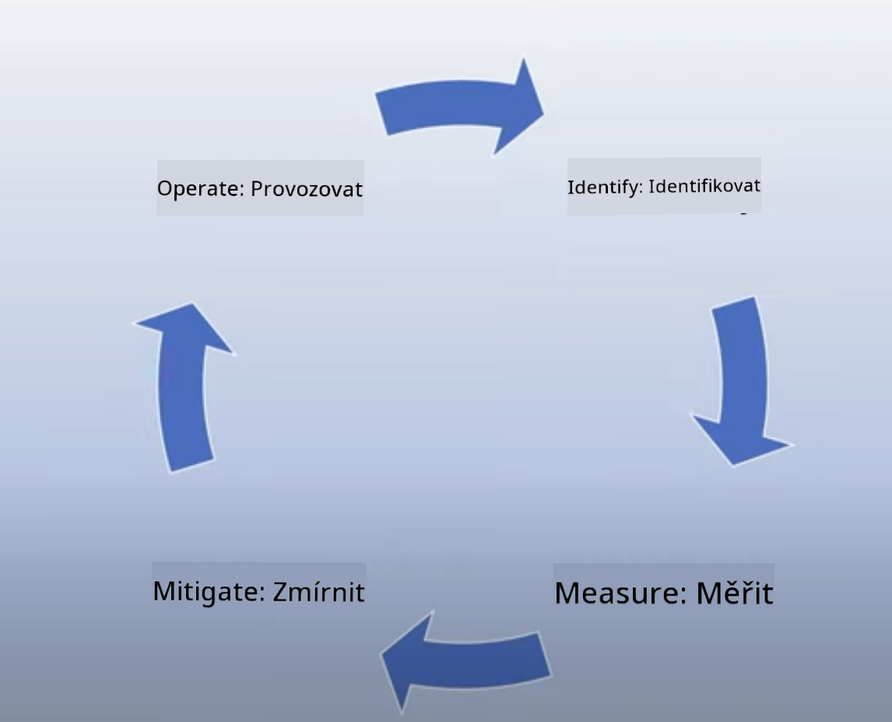
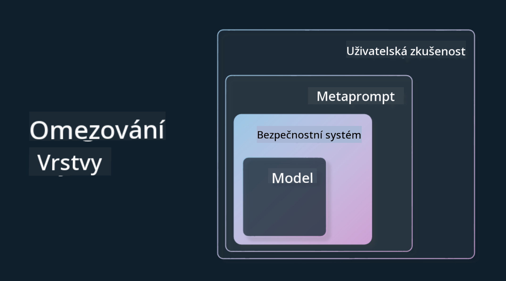

<!--
CO_OP_TRANSLATOR_METADATA:
{
  "original_hash": "7f8f4c11f8c1cb6e1794442dead414ea",
  "translation_date": "2025-07-09T09:02:10+00:00",
  "source_file": "03-using-generative-ai-responsibly/README.md",
  "language_code": "cs"
}
-->
# Používání generativní AI zodpovědně

> _Klikněte na obrázek výše pro zhlédnutí videa této lekce_

Je snadné být fascinován AI, zejména generativní AI, ale je potřeba zvážit, jak ji používat zodpovědně. Je třeba přemýšlet o tom, jak zajistit, aby výstupy byly spravedlivé, neškodné a další. Tato kapitola vám poskytne potřebný kontext, na co myslet a jak podniknout aktivní kroky ke zlepšení vašeho využívání AI.

## Úvod

Tato lekce pokryje:

- Proč byste měli upřednostňovat zodpovědnou AI při vytváření aplikací s generativní AI.
- Základní principy zodpovědné AI a jak se vztahují k generativní AI.
- Jak tyto principy zodpovědné AI uvést do praxe pomocí strategie a nástrojů.

## Cíle učení

Po dokončení této lekce budete vědět:

- Jaký význam má zodpovědná AI při vytváření aplikací s generativní AI.
- Kdy myslet na a aplikovat základní principy zodpovědné AI při vývoji generativních AI aplikací.
- Jaké nástroje a strategie máte k dispozici, abyste koncept zodpovědné AI uvedli do praxe.

## Principy zodpovědné AI

Nadšení pro generativní AI nikdy nebylo větší. Toto nadšení přilákalo mnoho nových vývojářů, pozornosti a financí do tohoto oboru. Ačkoliv je to velmi pozitivní pro každého, kdo chce budovat produkty a firmy využívající generativní AI, je také důležité postupovat zodpovědně.

V průběhu tohoto kurzu se zaměřujeme na budování našeho startupu a našeho vzdělávacího produktu v oblasti AI. Budeme používat principy zodpovědné AI: Spravedlnost, Inkluzivita, Spolehlivost/Bezpečnost, Ochrana soukromí a bezpečnost, Transparentnost a Odpovědnost. Pomocí těchto principů prozkoumáme, jak se vztahují k našemu využití generativní AI v našich produktech.

## Proč byste měli upřednostňovat zodpovědnou AI

Při tvorbě produktu vede přístup zaměřený na člověka, který má na paměti nejlepší zájmy uživatele, k nejlepším výsledkům.

Jedinečnost generativní AI spočívá v její schopnosti vytvářet užitečné odpovědi, informace, rady a obsah pro uživatele. To lze provést bez mnoha manuálních kroků, což může vést k velmi působivým výsledkům. Bez správného plánování a strategií to však může bohužel vést i k některým škodlivým výsledkům pro vaše uživatele, váš produkt a společnost jako celek.

Podívejme se na některé (ale ne všechny) z těchto potenciálně škodlivých výsledků:

### Halucinace

Halucinace je termín používaný k popisu situace, kdy LLM (velký jazykový model) vytváří obsah, který je buď zcela nesmyslný, nebo víme, že je fakticky nesprávný na základě jiných zdrojů informací.

Například vytvoříme funkci pro náš startup, která umožňuje studentům klást historické otázky modelu. Student se zeptá: `Kdo byl jediným přeživším Titaniku?`

Model vytvoří odpověď jako níže:

> _(Zdroj: [Flying bisons](https://flyingbisons.com?WT.mc_id=academic-105485-koreyst))_

Toto je velmi sebejistá a podrobná odpověď. Bohužel je nesprávná. I s minimálním výzkumem by bylo zjištěno, že přeživších katastrofy Titaniku bylo více než jeden. Pro studenta, který se teprve začíná o toto téma zajímat, může být tato odpověď natolik přesvědčivá, že ji nebude zpochybňovat a bude ji považovat za fakt. Důsledkem může být, že AI systém bude nespolehlivý a negativně ovlivní reputaci našeho startupu.

S každou novou verzí LLM jsme zaznamenali zlepšení v minimalizaci halucinací. I přes tato zlepšení musíme jako tvůrci aplikací a uživatelé zůstat vědomi těchto omezení.

### Škodlivý obsah

V předchozí části jsme se zabývali situacemi, kdy LLM vytváří nesprávné nebo nesmyslné odpovědi. Dalším rizikem, na které musíme dávat pozor, je, když model odpovídá škodlivým obsahem.

Škodlivý obsah lze definovat jako:

- Poskytování instrukcí nebo podněcování k sebepoškozování nebo poškozování určitých skupin.
- Nenávistný nebo ponižující obsah.
- Plánování jakéhokoliv útoku nebo násilných činů.
- Poskytování návodů, jak najít nelegální obsah nebo spáchat nelegální činy.
- Zobrazování sexuálně explicitního obsahu.

Pro náš startup chceme zajistit, že máme správné nástroje a strategie, které zabrání tomu, aby studenti tento typ obsahu viděli.

### Nedostatek spravedlnosti

Spravedlnost je definována jako „zajištění, že AI systém je bez předsudků a diskriminace a že zachází se všemi spravedlivě a rovnocenně.“ Ve světě generativní AI chceme zajistit, aby model nevytvářel výstupy, které by posilovaly vylučující pohledy na svět vůči marginalizovaným skupinám.

Tento typ výstupů není jen destruktivní pro vytváření pozitivních uživatelských zkušeností, ale také způsobuje další společenskou újmu. Jako tvůrci aplikací bychom měli vždy myslet na širokou a různorodou uživatelskou základnu při vytváření řešení s generativní AI.

## Jak používat generativní AI zodpovědně

Nyní, když jsme si uvědomili důležitost zodpovědné generativní AI, podívejme se na 4 kroky, které můžeme podniknout, abychom naše AI řešení budovali zodpovědně:

### Měření potenciálních škod

Při testování softwaru testujeme očekávané akce uživatele v aplikaci. Podobně je testování různorodé sady promptů, které uživatelé pravděpodobně použijí, dobrým způsobem, jak změřit potenciální škody.

Protože náš startup vytváří vzdělávací produkt, je vhodné připravit seznam promptů souvisejících se vzděláváním. Může jít o pokrytí určitého předmětu, historických faktů a promptů o studentském životě.

### Omezování potenciálních škod

Nyní je čas najít způsoby, jak zabránit nebo omezit potenciální škody způsobené modelem a jeho odpověďmi. Můžeme se na to podívat ve 4 různých vrstvách:

- **Model**. Výběr správného modelu pro daný případ použití. Větší a složitější modely jako GPT-4 mohou představovat větší riziko škodlivého obsahu, pokud jsou použity na menší a specifičtější případy. Použití vlastních tréninkových dat pro doladění modelu také snižuje riziko škodlivého obsahu.

- **Bezpečnostní systém**. Bezpečnostní systém je sada nástrojů a konfigurací na platformě, která model poskytuje, a pomáhá omezovat škody. Příkladem je systém filtrování obsahu v Azure OpenAI službě. Systémy by měly také detekovat útoky typu jailbreak a nežádoucí aktivity, jako jsou požadavky od botů.

- **Metaprompt**. Metaprompt a grounding jsou způsoby, jak můžeme model řídit nebo omezovat na základě určitých chování a informací. Může jít o použití systémových vstupů k definování určitých limitů modelu. Dále o poskytování výstupů, které jsou relevantnější pro rozsah nebo doménu systému.

Může to také znamenat použití technik jako Retrieval Augmented Generation (RAG), kdy model čerpá informace pouze z vybraných důvěryhodných zdrojů. V tomto kurzu je později lekce o [budování vyhledávacích aplikací](../08-building-search-applications/README.md?WT.mc_id=academic-105485-koreyst).

- **Uživatelská zkušenost**. Poslední vrstva je místo, kde uživatel přímo interaguje s modelem přes rozhraní naší aplikace. Zde můžeme navrhnout UI/UX tak, aby omezovalo typy vstupů, které uživatel může modelu posílat, stejně jako text nebo obrázky zobrazované uživateli. Při nasazení AI aplikace musíme být také transparentní ohledně toho, co naše generativní AI aplikace umí a neumí.

Máme celou lekci věnovanou [návrhu UX pro AI aplikace](../12-designing-ux-for-ai-applications/README.md?WT.mc_id=academic-105485-koreyst).

- **Hodnocení modelu**. Práce s LLM může být náročná, protože nemáme vždy kontrolu nad daty, na kterých byl model trénován. Přesto bychom měli vždy hodnotit výkon a výstupy modelu. Je důležité měřit přesnost modelu, podobnost, zakotvenost a relevanci výstupu. To pomáhá zajistit transparentnost a důvěru u zainteresovaných stran a uživatelů.

### Provozování zodpovědného řešení generativní AI

Vybudování provozní praxe kolem vašich AI aplikací je závěrečnou fází. To zahrnuje spolupráci s dalšími částmi našeho startupu, jako jsou právní a bezpečnostní oddělení, aby bylo zajištěno dodržování všech regulačních pravidel. Před spuštěním také chceme vytvořit plány pro doručení, řešení incidentů a návrat k předchozím verzím, abychom zabránili škodám na uživatelích.

## Nástroje

I když se práce na vývoji zodpovědných AI řešení může zdát náročná, stojí za to ji věnovat. Jak oblast generativní AI roste, vyvíjejí se i nástroje, které pomáhají vývojářům efektivně začleňovat zodpovědnost do jejich pracovních postupů. Například [Azure AI Content Safety](https://learn.microsoft.com/azure/ai-services/content-safety/overview?WT.mc_id=academic-105485-koreyst) může pomoci detekovat škodlivý obsah a obrázky prostřednictvím API požadavku.

## Kontrola znalostí

Na co je potřeba dbát, aby bylo používání AI zodpovědné?

1. Aby byla odpověď správná.
1. Aby AI nebyla používána ke kriminálním účelům.
1. Aby AI byla bez předsudků a diskriminace.

Odpověď: Správné jsou body 2 a 3. Zodpovědná AI vám pomáhá zvážit, jak zmírnit škodlivé účinky, předsudky a další.

## 🚀 Výzva

Přečtěte si o [Azure AI Content Safety](https://learn.microsoft.com/azure/ai-services/content-safety/overview?WT.mc_id=academic-105485-koreyst) a zjistěte, co můžete ve svém použití převzít.

## Skvělá práce, pokračujte ve svém vzdělávání

Po dokončení této lekce si prohlédněte naši [kolekci Generativní AI Learning](https://aka.ms/genai-collection?WT.mc_id=academic-105485-koreyst) a pokračujte ve zvyšování svých znalostí o generativní AI!

Přejděte k lekci 4, kde se podíváme na [základy prompt engineeringu](../04-prompt-engineering-fundamentals/README.md?WT.mc_id=academic-105485-koreyst)!

**Prohlášení o vyloučení odpovědnosti**:  
Tento dokument byl přeložen pomocí AI překladatelské služby [Co-op Translator](https://github.com/Azure/co-op-translator). I když usilujeme o přesnost, mějte prosím na paměti, že automatizované překlady mohou obsahovat chyby nebo nepřesnosti. Původní dokument v jeho mateřském jazyce by měl být považován za závazný zdroj. Pro důležité informace se doporučuje profesionální lidský překlad. Nejsme odpovědní za jakékoliv nedorozumění nebo nesprávné výklady vyplývající z použití tohoto překladu.