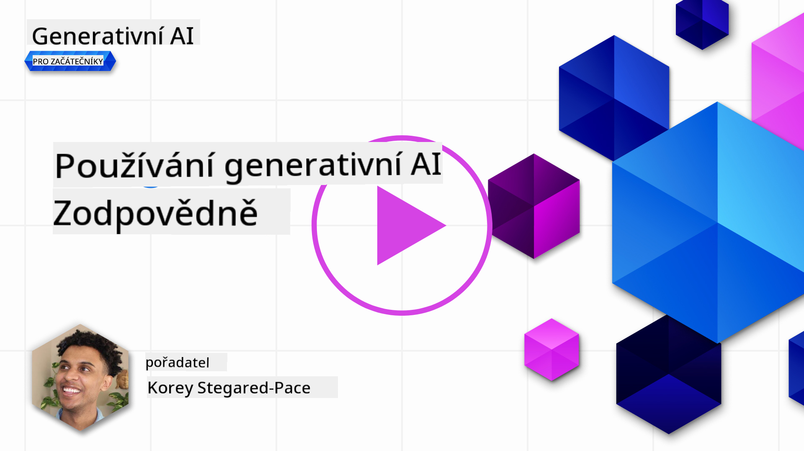
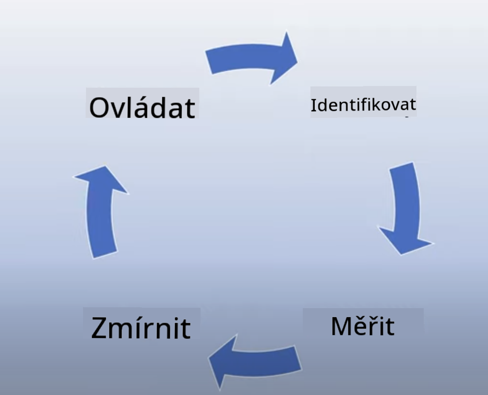
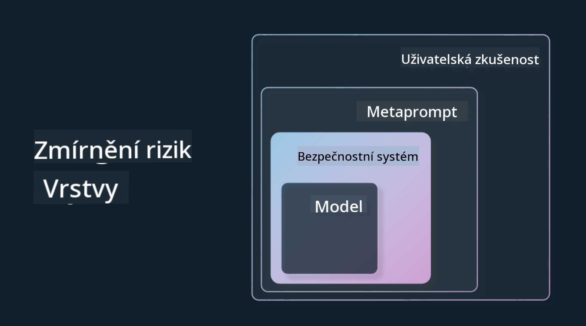

<!--
CO_OP_TRANSLATOR_METADATA:
{
  "original_hash": "13084c6321a2092841b9a081b29497ba",
  "translation_date": "2025-05-19T14:48:54+00:00",
  "source_file": "03-using-generative-ai-responsibly/README.md",
  "language_code": "cs"
}
-->
# Použití generativní AI zodpovědně

> _Klikněte na obrázek výše a zhlédněte video této lekce_

Je snadné být fascinován AI, a zejména generativní AI, ale je důležité zvážit, jak ji používat zodpovědně. Musíte uvažovat o věcech jako zajištění, že výstup je spravedlivý, neškodný a další. Tato kapitola vám poskytne uvedený kontext, co zvážit a jak podniknout aktivní kroky ke zlepšení používání AI.

## Úvod

Tato lekce se zaměří na:

- Proč byste měli upřednostňovat zodpovědnou AI při vytváření aplikací generativní AI.
- Základní principy zodpovědné AI a jak se vztahují k generativní AI.
- Jak tyto principy zodpovědné AI uvést do praxe prostřednictvím strategie a nástrojů.

## Cíle učení

Po dokončení této lekce budete vědět:

- Důležitost zodpovědné AI při vytváření aplikací generativní AI.
- Kdy uvažovat a aplikovat základní principy zodpovědné AI při vytváření aplikací generativní AI.
- Jaké nástroje a strategie máte k dispozici, abyste koncept zodpovědné AI uvedli do praxe.

## Principy zodpovědné AI

Nadšení z generativní AI nikdy nebylo vyšší. Toto nadšení přineslo mnoho nových vývojářů, pozornost a financování do této oblasti. Ačkoli je to velmi pozitivní pro každého, kdo chce vytvářet produkty a společnosti využívající generativní AI, je také důležité postupovat zodpovědně.

Během tohoto kurzu se zaměřujeme na budování našeho startupu a našeho AI vzdělávacího produktu. Použijeme principy zodpovědné AI: spravedlnost, inkluzivnost, spolehlivost/bezpečnost, zabezpečení a soukromí, transparentnost a odpovědnost. S těmito principy prozkoumáme, jak se vztahují k našemu použití generativní AI v našich produktech.

## Proč byste měli upřednostňovat zodpovědnou AI

Při vytváření produktu vede přístup zaměřený na člověka, který má na paměti nejlepší zájem uživatele, k nejlepším výsledkům.

Jedinečnost generativní AI spočívá v její schopnosti vytvářet užitečné odpovědi, informace, vedení a obsah pro uživatele. To lze provést bez mnoha manuálních kroků, což může vést k velmi působivým výsledkům. Bez řádného plánování a strategií to však může bohužel vést k některým škodlivým výsledkům pro vaše uživatele, váš produkt a společnost jako celek.

Podívejme se na některé (ale ne všechny) z těchto potenciálně škodlivých výsledků:

### Halucinace

Halucinace je termín používaný k popisu, když LLM produkuje obsah, který je buď zcela nesmyslný, nebo něco, co víme, že je fakticky špatné na základě jiných zdrojů informací.

Vezměme si například, že vytváříme funkci pro náš startup, která umožňuje studentům klást historické otázky modelu. Student položí otázku `Who was the sole survivor of Titanic?`

Model produkuje odpověď, jako je ta níže:

> _(Zdroj: [Flying bisons](https://flyingbisons.com?WT.mc_id=academic-105485-koreyst))_

Toto je velmi sebevědomá a důkladná odpověď. Bohužel je nesprávná. I s minimálním množstvím výzkumu by člověk zjistil, že bylo více než jeden přeživší katastrofy Titaniku. Pro studenta, který právě začíná zkoumat toto téma, může být tato odpověď dostatečně přesvědčivá, aby nebyla zpochybněna a považována za fakt. Důsledky toho mohou vést k tomu, že AI systém je nespolehlivý a negativně ovlivňuje reputaci našeho startupu.

S každou iterací daného LLM jsme viděli zlepšení výkonu v minimalizaci halucinací. I s tímto zlepšením musíme jako tvůrci aplikací a uživatelé zůstat si vědomi těchto omezení.

### Škodlivý obsah

V předchozí části jsme se zabývali, když LLM produkuje nesprávné nebo nesmyslné odpovědi. Dalším rizikem, které musíme mít na paměti, je, když model reaguje škodlivým obsahem.

Škodlivý obsah lze definovat jako:

- Poskytování pokynů nebo podporování sebepoškozování nebo poškozování určitých skupin.
- Nenávistný nebo ponižující obsah.
- Vedení plánování jakéhokoli typu útoku nebo násilných činů.
- Poskytování pokynů, jak najít nelegální obsah nebo spáchat nelegální činy.
- Zobrazení sexuálně explicitního obsahu.

Pro náš startup chceme zajistit, že máme správné nástroje a strategie, abychom zabránili tomu, aby tento typ obsahu byl viděn studenty.

### Nedostatek spravedlnosti

Spravedlnost je definována jako „zajištění, že AI systém je bez předsudků a diskriminace a že s každým zachází spravedlivě a rovně“. Ve světě generativní AI chceme zajistit, aby vylučující světové názory marginalizovaných skupin nebyly posilovány výstupem modelu.

Tyto typy výstupů nejsou pouze destruktivní pro budování pozitivních produktových zkušeností pro naše uživatele, ale také způsobují další společenské škody. Jako tvůrci aplikací bychom měli vždy mít na paměti širokou a rozmanitou uživatelskou základnu při vytváření řešení s generativní AI.

## Jak používat generativní AI zodpovědně

Nyní, když jsme identifikovali důležitost zodpovědné generativní AI, podívejme se na 4 kroky, které můžeme podniknout k budování našich AI řešení zodpovědně:

### Měření potenciálních škod

V testování softwaru testujeme očekávané akce uživatele na aplikaci. Podobně testování rozmanité sady dotazů, které uživatelé s největší pravděpodobností použijí, je dobrý způsob, jak měřit potenciální škodu.

Protože náš startup vytváří vzdělávací produkt, bylo by dobré připravit seznam dotazů souvisejících s vzděláním. To by mohlo pokrývat určitý předmět, historické fakty a dotazy týkající se studentského života.

### Zmírnění potenciálních škod

Nyní je čas najít způsoby, jak můžeme zabránit nebo omezit potenciální škodu způsobenou modelem a jeho odpověďmi. Můžeme se na to podívat ve 4 různých vrstvách:

- **Model**. Výběr správného modelu pro správný případ použití. Větší a složitější modely jako GPT-4 mohou způsobit větší riziko škodlivého obsahu, když jsou aplikovány na menší a specifické případy použití. Použití vašich tréninkových dat k doladění také snižuje riziko škodlivého obsahu.

- **Bezpečnostní systém**. Bezpečnostní systém je sada nástrojů a konfigurací na platformě, která slouží modelu a pomáhá zmírnit škody. Příkladem je systém filtrování obsahu na službě Azure OpenAI. Systémy by měly také detekovat útoky typu jailbreak a nežádoucí aktivitu jako požadavky od botů.

- **Metaprompt**. Metaprompty a ukotvení jsou způsoby, jak můžeme řídit nebo omezit model na základě určitých chování a informací. To by mohlo být použití systémových vstupů k definování určitých limitů modelu. Navíc poskytování výstupů, které jsou relevantnější pro rozsah nebo doménu systému.

Může to být také použití technik jako Retrieval Augmented Generation (RAG), aby model čerpal informace pouze z výběru důvěryhodných zdrojů. V této lekci je později lekce pro [budování vyhledávacích aplikací](../08-building-search-applications/README.md?WT.mc_id=academic-105485-koreyst)

- **Uživatelská zkušenost**. Poslední vrstva je, kde uživatel interaguje přímo s modelem prostřednictvím rozhraní naší aplikace nějakým způsobem. Tímto způsobem můžeme navrhnout UI/UX tak, aby omezilo uživatele na typy vstupů, které mohou poslat modelu, stejně jako text nebo obrázky zobrazené uživateli. Při nasazování AI aplikace musíme být také transparentní ohledně toho, co naše generativní AI aplikace může a nemůže dělat.

Máme celou lekci věnovanou [navrhování UX pro AI aplikace](../12-designing-ux-for-ai-applications/README.md?WT.mc_id=academic-105485-koreyst)

- **Vyhodnocení modelu**. Práce s LLM může být náročná, protože nemáme vždy kontrolu nad daty, na kterých byl model trénován. Bez ohledu na to bychom měli vždy vyhodnocovat výkon a výstupy modelu. Je stále důležité měřit přesnost, podobnost, ukotvenost a relevanci výstupu modelu. To pomáhá poskytovat transparentnost a důvěru zainteresovaným stranám a uživatelům.

### Provozování zodpovědného generativního AI řešení

Budování provozní praxe kolem vašich AI aplikací je poslední etapa. To zahrnuje spolupráci s jinými částmi našeho startupu jako právní a bezpečnostní, aby bylo zajištěno, že jsme v souladu se všemi regulačními politikami. Před spuštěním také chceme vytvořit plány kolem dodávky, řešení incidentů a rollbacku, abychom zabránili jakékoli škodě našim uživatelům z růstu.

## Nástroje

Ačkoli se práce na vývoji zodpovědných AI řešení může zdát jako hodně, je to práce, která stojí za úsilí. Jak oblast generativní AI roste, více nástrojů, které pomáhají vývojářům efektivně integrovat zodpovědnost do jejich pracovních postupů, se bude vyvíjet. Například [Azure AI Content Safety](https://learn.microsoft.com/azure/ai-services/content-safety/overview?WT.mc_id=academic-105485-koreyst) může pomoci detekovat škodlivý obsah a obrázky prostřednictvím API požadavku.

## Kontrola znalostí

Na které věci musíte dbát, abyste zajistili zodpovědné používání AI?

1. Že odpověď je správná.
2. Škodlivé použití, že AI není použita pro trestné účely.
3. Zajištění, že AI je bez předsudků a diskriminace.

A: 2 a 3 jsou správné. Zodpovědná AI vám pomáhá uvažovat o tom, jak zmírnit škodlivé účinky a předsudky a další.

## 🚀 Výzva

Přečtěte si o [Azure AI Content Safety](https://learn.microsoft.com/azure/ai-services/content-safety/overview?WT.mc_id=academic-105485-koreyst) a podívejte se, co můžete přijmout pro své použití.

## Skvělá práce, pokračujte ve svém učení

Po dokončení této lekce se podívejte na naši [kolekci učení o generativní AI](https://aka.ms/genai-collection?WT.mc_id=academic-105485-koreyst), abyste pokračovali v zvyšování své znalosti o generativní AI!

Přejděte k lekci 4, kde se podíváme na [Základy inženýrství promptů](../04-prompt-engineering-fundamentals/README.md?WT.mc_id=academic-105485-koreyst)!

**Prohlášení**:  
Tento dokument byl přeložen pomocí AI překladatelské služby [Co-op Translator](https://github.com/Azure/co-op-translator). I když se snažíme o přesnost, mějte prosím na paměti, že automatizované překlady mohou obsahovat chyby nebo nepřesnosti. Původní dokument ve svém rodném jazyce by měl být považován za autoritativní zdroj. Pro kritické informace se doporučuje profesionální lidský překlad. Nejsme zodpovědní za jakékoli nedorozumění nebo nesprávné výklady vyplývající z použití tohoto překladu.