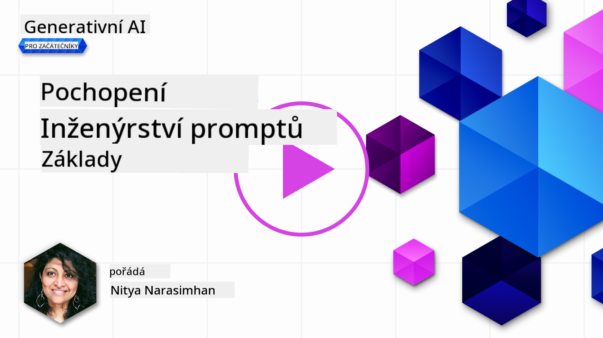
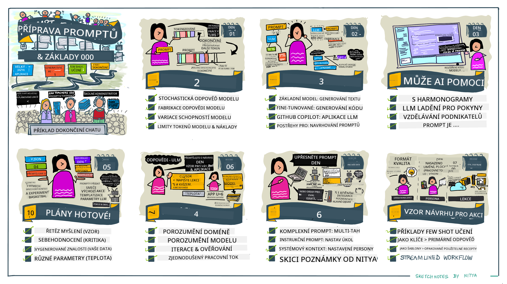
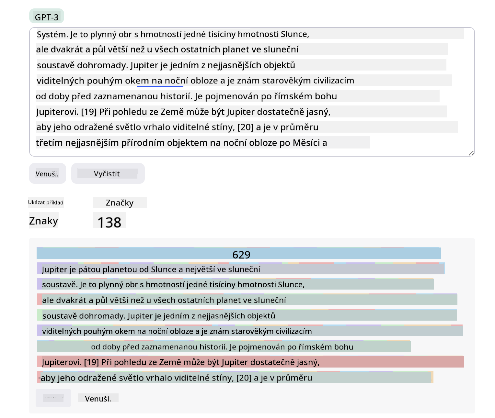
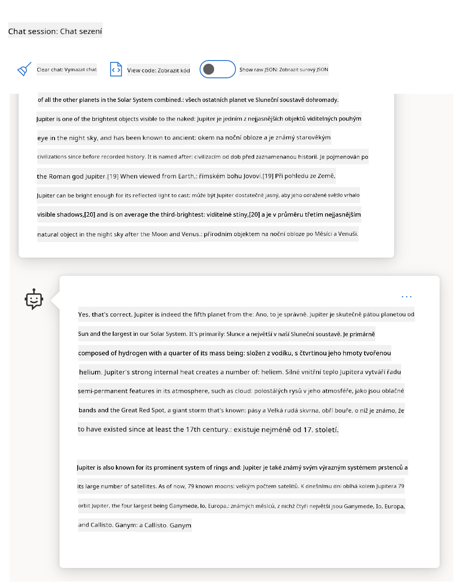
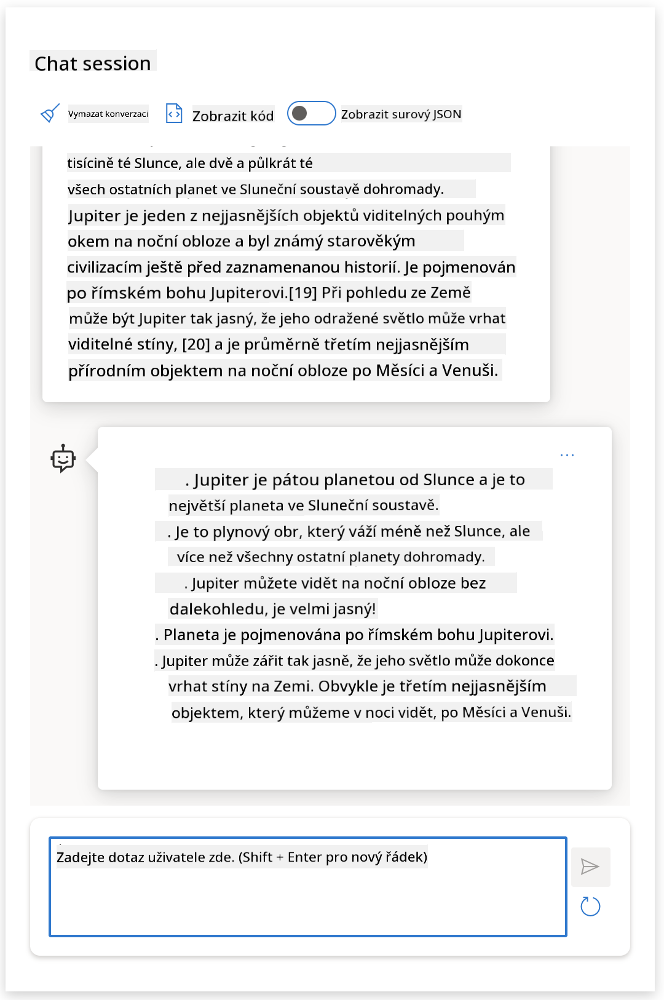
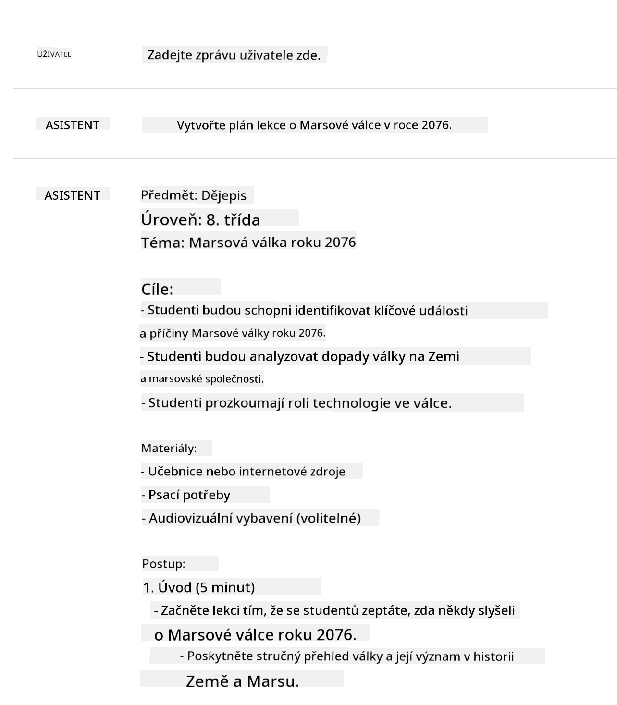
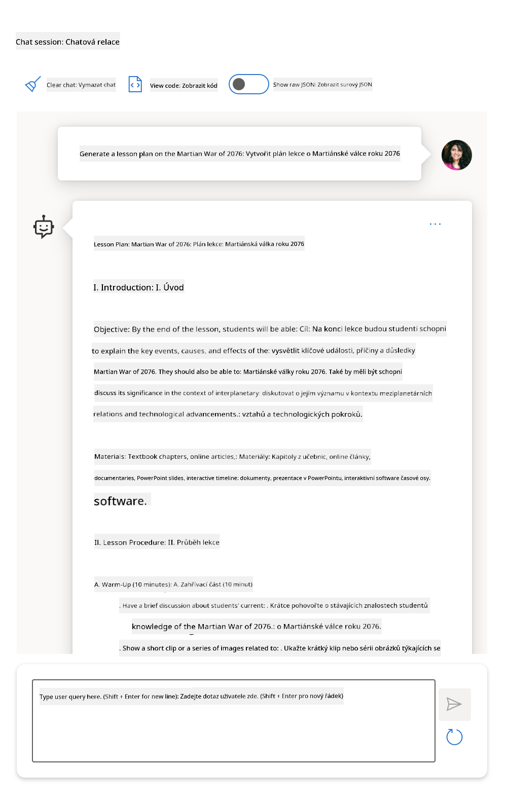
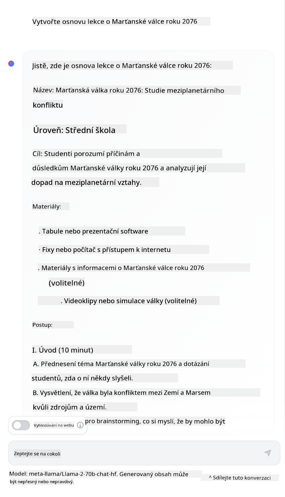

<!--
CO_OP_TRANSLATOR_METADATA:
{
  "original_hash": "dcbaaae026cb50fee071e690685b5843",
  "translation_date": "2025-08-26T19:00:11+00:00",
  "source_file": "04-prompt-engineering-fundamentals/README.md",
  "language_code": "cs"
}
-->
# Základy Prompt Engineeringu

[](https://aka.ms/gen-ai-lesson4-gh?WT.mc_id=academic-105485-koreyst)

## Úvod
Tento modul se věnuje klíčovým pojmům a technikám pro vytváření efektivních promptů v generativních AI modelech. Záleží i na tom, jak svůj prompt pro LLM napíšete. Pečlivě sestavený prompt může vést k lepší kvalitě odpovědi. Ale co vlastně znamenají pojmy jako _prompt_ a _prompt engineering_? A jak mohu vylepšit _vstupní prompt_, který posílám LLM? Na tyto otázky se pokusíme odpovědět v této a následující kapitole.

_Generativní AI_ dokáže vytvářet nový obsah (např. text, obrázky, zvuk, kód atd.) na základě požadavků uživatele. Toho dosahuje pomocí _velkých jazykových modelů_ jako je série GPT ("Generative Pre-trained Transformer") od OpenAI, které jsou trénovány na práci s přirozeným jazykem a kódem.

Uživatelé nyní mohou s těmito modely komunikovat pomocí známých rozhraní, například chatu, aniž by potřebovali technické znalosti nebo školení. Modely jsou _prompt-based_ – uživatel odešle textový vstup (prompt) a obdrží odpověď AI (completion). Poté může s AI vést iterativní konverzaci, postupně upravovat prompt, dokud odpověď neodpovídá jeho očekávání.

"Prompt" se tak stává hlavním _programovacím rozhraním_ pro generativní AI aplikace, určuje, co mají modely dělat, a ovlivňuje kvalitu jejich odpovědí. "Prompt Engineering" je rychle rostoucí obor, který se zaměřuje na _návrh a optimalizaci_ promptů, aby poskytovaly konzistentní a kvalitní odpovědi ve velkém měřítku.

## Cíle lekce

V této lekci se dozvíme, co je Prompt Engineering, proč je důležitý a jak můžeme vytvářet efektivnější prompty pro konkrétní model a cíle aplikace. Seznámíme se se základními pojmy a osvědčenými postupy pro prompt engineering – a poznáme interaktivní prostředí Jupyter Notebooks "sandbox", kde si tyto koncepty vyzkoušíme na reálných příkladech.

Na konci této lekce budeme schopni:

1. Vysvětlit, co je prompt engineering a proč je důležitý.
2. Popsat, z čeho se prompt skládá a jak se používá.
3. Naučit se osvědčené postupy a techniky pro prompt engineering.
4. Použít naučené techniky na reálných příkladech pomocí OpenAI endpointu.

## Klíčové pojmy

Prompt Engineering: Praxe navrhování a vylepšování vstupů, které vedou AI modely k požadovaným výstupům.
Tokenizace: Proces převodu textu na menší jednotky, tzv. tokeny, které model dokáže zpracovat a pochopit.
Instruction-Tuned LLMs: Velké jazykové modely (LLMs), které byly doladěny pomocí konkrétních instrukcí, aby jejich odpovědi byly přesnější a relevantnější.

## Učební sandbox

Prompt engineering je zatím spíše umění než věda. Nejlepší způsob, jak si na něj vybudovat cit, je _hodně trénovat_ a zkoušet různé přístupy, které kombinují znalosti z oboru s doporučenými technikami a optimalizacemi pro konkrétní model.

Jupyter Notebook, který tuto lekci doprovází, nabízí _sandbox_ prostředí, kde si můžete vše vyzkoušet – buď průběžně, nebo v rámci závěrečné výzvy. K provedení cvičení budete potřebovat:

1. **Azure OpenAI API klíč** – endpoint služby pro nasazený LLM.
2. **Python runtime** – prostředí, ve kterém lze notebook spustit.
3. **Lokální proměnné prostředí** – _dokončete nyní kroky v [SETUP](./../00-course-setup/02-setup-local.md?WT.mc_id=academic-105485-koreyst), abyste byli připraveni_.

Notebook obsahuje _startovací_ cvičení – ale doporučujeme přidávat vlastní sekce v _Markdownu_ (popis) i _kódu_ (prompt requesty), abyste si mohli vyzkoušet další příklady nebo nápady – a lépe si osvojili tvorbu promptů.

## Ilustrovaný průvodce

Chcete si nejdřív udělat představu, co tato lekce obsahuje? Podívejte se na tento ilustrovaný průvodce, který vám ukáže hlavní témata a klíčové poznatky, nad kterými se můžete zamyslet. Plán lekce vás provede od pochopení základních pojmů a výzev až po jejich řešení pomocí relevantních technik a osvědčených postupů prompt engineeringu. Všimněte si, že sekce "Pokročilé techniky" v tomto průvodci odkazuje na obsah, který bude probírán v _další_ kapitole tohoto kurzu.



## Náš startup

Pojďme si říct, jak _toto téma_ souvisí s naším startupovým cílem [přinést AI inovace do vzdělávání](https://educationblog.microsoft.com/2023/06/collaborating-to-bring-ai-innovation-to-education?WT.mc_id=academic-105485-koreyst). Chceme vytvářet AI aplikace pro _personalizované vzdělávání_ – zamysleme se tedy, jak různí uživatelé naší aplikace mohou "navrhovat" prompty:

- **Administrátoři** mohou požádat AI, aby _analyzovala data o kurikulu a identifikovala mezery v pokrytí_. AI může výsledky shrnout nebo vizualizovat pomocí kódu.
- **Učitelé** mohou požádat AI, aby _vytvořila plán lekce pro konkrétní cílovou skupinu a téma_. AI může sestavit personalizovaný plán ve zvoleném formátu.
- **Studenti** mohou požádat AI, aby je _doučovala v obtížném předmětu_. AI je může vést pomocí lekcí, tipů a příkladů přizpůsobených jejich úrovni.

To je jen začátek. Podívejte se na [Prompts For Education](https://github.com/microsoft/prompts-for-edu/tree/main?WT.mc_id=academic-105485-koreyst) – open-source knihovnu promptů sestavenou odborníky na vzdělávání – a získejte širší představu o možnostech! _Vyzkoušejte některé z těchto promptů v sandboxu nebo v OpenAI Playgroundu a sledujte, co se stane!_

<!--
ŠABLONA LEKCE:
Tato jednotka by měla pokrýt základní koncept #1.
Podpořte koncept příklady a odkazy.

KONCEPT #1:
Prompt Engineering.
Definujte jej a vysvětlete, proč je potřeba.
-->

## Co je Prompt Engineering?

Lekci jsme začali definicí **Prompt Engineeringu** jako procesu _navrhování a optimalizace_ textových vstupů (promptů), které mají za cíl poskytovat konzistentní a kvalitní odpovědi (completions) pro daný cíl aplikace a model. Můžeme si to představit jako dvoufázový proces:

- _navrhnout_ počáteční prompt pro daný model a cíl
- _postupně vylepšovat_ prompt, aby se zvýšila kvalita odpovědi

Jde o proces pokus–omyl, který vyžaduje intuici a úsilí uživatele, aby dosáhl optimálních výsledků. Proč je to důležité? Abychom si na to odpověděli, musíme nejdříve pochopit tři pojmy:

- _Tokenizace_ = jak model "vidí" prompt
- _Základní LLMs_ = jak základní model "zpracovává" prompt
- _Instruction-Tuned LLMs_ = jak model dokáže vnímat "úkoly"

### Tokenizace

LLM vnímá prompty jako _sekvenci tokenů_, přičemž různé modely (nebo jejich verze) mohou stejný prompt tokenizovat různě. Protože LLMs jsou trénovány na tokenech (ne na surovém textu), způsob tokenizace promptu přímo ovlivňuje kvalitu generované odpovědi.

Chcete-li si udělat představu, jak tokenizace funguje, vyzkoušejte nástroje jako [OpenAI Tokenizer](https://platform.openai.com/tokenizer?WT.mc_id=academic-105485-koreyst) zobrazený níže. Zkopírujte svůj prompt – a sledujte, jak se převede na tokeny, všímejte si, jak se zachází s mezerami a interpunkcí. Všimněte si, že tento příklad ukazuje starší LLM (GPT-3) – použití novějšího modelu může vést k jinému výsledku.



### Koncept: Základní modely

Jakmile je prompt tokenizován, hlavní funkcí ["základního LLM"](https://blog.gopenai.com/an-introduction-to-base-and-instruction-tuned-large-language-models-8de102c785a6?WT.mc_id=academic-105485-koreyst) (nebo Foundation modelu) je předpovídat další token v sekvenci. Protože LLMs jsou trénovány na obrovských textových datech, mají dobrý přehled o statistických vztazích mezi tokeny a dokážou předpovědět další s určitou jistotou. Nechápou však _význam_ slov v promptu nebo tokenu; vidí jen vzor, který mohou "dokončit" svou další předpovědí. Mohou pokračovat v predikci sekvence, dokud je uživatel nezastaví nebo dokud nenastane předem stanovená podmínka.

Chcete vidět, jak funguje dokončování na základě promptu? Zadejte výše uvedený prompt do Azure OpenAI Studio [_Chat Playground_](https://oai.azure.com/playground?WT.mc_id=academic-105485-koreyst) s výchozím nastavením. Systém je nastaven tak, aby prompty chápal jako žádosti o informace – takže byste měli vidět odpověď, která odpovídá tomuto kontextu.

Ale co když uživatel chce vidět něco konkrétního, co splňuje určité kritéria nebo cíl úkolu? Právě zde přicházejí na řadu _instruction-tuned_ LLMs.



### Koncept: Instruction Tuned LLMs

[Instruction Tuned LLM](https://blog.gopenai.com/an-introduction-to-base-and-instruction-tuned-large-language-models-8de102c785a6?WT.mc_id=academic-105485-koreyst) vychází ze základního modelu a je doladěn pomocí příkladů nebo dvojic vstup/výstup (např. vícekrokové "zprávy"), které obsahují jasné instrukce – a odpověď AI se snaží tyto instrukce dodržet.

Používají se techniky jako Reinforcement Learning with Human Feedback (RLHF), které model učí _dodržovat instrukce_ a _učit se z odezvy_, takže generuje odpovědi lépe využitelné v praxi a relevantnější pro cíle uživatele.

Vyzkoušejme si to – vezměte výše uvedený prompt, ale nyní změňte _system message_ a zadejte tuto instrukci jako kontext:

> _Shrňte obsah, který vám bude poskytnut, pro žáka druhé třídy. Výsledek udržte v jednom odstavci s 3–5 odrážkami._

Vidíte, jak je výsledek nyní přizpůsoben požadovanému cíli a formátu? Učitel může tuto odpověď rovnou použít ve svých prezentacích pro danou třídu.



## Proč potřebujeme Prompt Engineering?

Teď, když víme, jak LLMs zpracovávají prompty, pojďme si říct, _proč_ je prompt engineering potřeba. Odpověď spočívá v tom, že současné LLMs přinášejí řadu výzev, kvůli kterým je _spolehlivé a konzistentní generování odpovědí_ obtížnější bez úsilí věnovaného tvorbě a optimalizaci promptů. Například:

1. **Odpovědi modelu jsou stochastické.** _Stejný prompt_ pravděpodobně povede k různým odpovědím u různých modelů nebo verzí modelu. A dokonce může dát různé výsledky i u _stejného modelu_ v různých časech. _Techniky prompt engineeringu nám pomáhají tyto rozdíly minimalizovat nastavením lepších mantinelů._

1. **Modely mohou vymýšlet odpovědi.** Modely jsou předtrénovány na _velkých, ale konečných_ datech, takže nemají znalosti o tématech mimo tento rozsah. Výsledkem mohou být odpovědi, které jsou nepřesné, smyšlené nebo přímo odporují známým faktům. _Prompt engineering pomáhá uživatelům takové smyšlenky odhalit a omezit, např. žádostí o citace nebo vysvětlení._

1. **Schopnosti modelů se liší.** Novější modely nebo generace modelů mají širší možnosti, ale přinášejí i specifické zvláštnosti a kompromisy v ceně a složitosti. _Prompt engineering nám umožňuje vytvářet osvědčené postupy a workflow, které abstrahují rozdíly a přizpůsobují se požadavkům konkrétních modelů škálovatelně a bezproblémově._

Vyzkoušejte si to v OpenAI nebo Azure OpenAI Playgroundu:

- Použijte stejný prompt s různými LLM nasazeními (např. OpenAI, Azure OpenAI, Hugging Face) – všimli jste si rozdílů?
- Použijte stejný prompt opakovaně se _stejným_ LLM nasazením (např. Azure OpenAI playground) – jak se odpovědi lišily?

### Příklad smyšlených odpovědí

V tomto kurzu používáme pojem **"fabrication"** pro jev, kdy LLMs někdy generují fakticky nesprávné informace kvůli omezením svého tréninku nebo jiným faktorům. Možná jste se s tím setkali i pod pojmem _"halucinace"_ v populárních článcích nebo vědeckých pracích. Doporučujeme však používat termín _"fabrication"_, abychom chování modelu nepřipisovali lidské vlastnosti, které jsou ve skutečnosti výsledkem strojového procesu. To také podporuje [zásady odpovědné AI](https://www.microsoft.com/ai/responsible-ai?WT.mc_id=academic-105485-koreyst) z hlediska terminologie, protože odstraňuje výrazy, které mohou být v některých kontextech považovány za nevhodné nebo neinkluzivní.

Chcete si vyzkoušet, jak smyšlené odpovědi vznikají? Vymyslete prompt, který AI instruuje, aby vytvořila obsah na neexistující téma (aby nebylo v trénovacích datech). Například – zkusil jsem tento prompt:
# Plán lekce: Marťanská válka roku 2076

## Cíl lekce
Studenti se seznámí s hlavními událostmi, příčinami a důsledky Marťanské války roku 2076. Budou schopni analyzovat klíčové momenty konfliktu a diskutovat o jeho dopadu na budoucnost meziplanetárních vztahů.

## Úvod (10 minut)
- Stručné představení Marťanské války roku 2076
- Diskuze: Co si studenti představují pod pojmem „meziplanetární válka“?

## Historické pozadí (15 minut)
- Příčiny konfliktu mezi Zemí a Marsem
- Politické napětí, ekonomické zájmy, technologický pokrok
- Významné události vedoucí k vypuknutí války

## Průběh války (20 minut)
- Hlavní bitvy a strategie obou stran
- Role umělé inteligence a robotických jednotek
- Klíčové osobnosti a jejich rozhodnutí

## Důsledky a dopad (15 minut)
- Politické změny na Zemi i Marsu
- Vliv na meziplanetární obchod a migraci
- Etické otázky spojené s využitím nových technologií

## Skupinová aktivita (20 minut)
- Rozdělení do skupin: každá skupina analyzuje jeden aspekt války (např. technologie, diplomacie, civilní obyvatelstvo)
- Prezentace závěrů ostatním

## Závěr a reflexe (10 minut)
- Diskuze: Jak by se daly podobné konflikty v budoucnu předcházet?
- Shrnutí hlavních poznatků

## Domácí úkol
- Napsat krátkou esej na téma: „Jak Marťanská válka roku 2076 změnila pohled lidstva na vesmírné konflikty?“
Webové vyhledávání mi ukázalo, že existují fiktivní příběhy (například televizní seriály nebo knihy) o válkách na Marsu – ale žádné z roku 2076. Zdravý rozum nám také říká, že rok 2076 je _v budoucnosti_, takže nemůže být spojen s reálnou událostí.

Co se stane, když tento prompt zadáme různým poskytovatelům LLM?

> **Odpověď 1**: OpenAI Playground (GPT-35)



> **Odpověď 2**: Azure OpenAI Playground (GPT-35)



> **Odpověď 3**: Hugging Face Chat Playground (LLama-2)



Jak se dalo čekat, každý model (nebo jeho verze) generuje trochu jiné odpovědi díky stochastickému chování a rozdílům ve schopnostech modelu. Například jeden model cílí na žáky 8. třídy, zatímco druhý předpokládá středoškoláka. Ale všechny tři modely vytvořily odpovědi, které by mohly přesvědčit neinformovaného uživatele, že událost byla skutečná.

Techniky prompt engineeringu jako _metaprompting_ a _nastavení teploty_ mohou do určité míry omezit vymýšlení modelu. Nové _architektury_ prompt engineeringu také začleňují nové nástroje a postupy přímo do toku promptu, aby některé z těchto efektů zmírnily nebo omezily.

## Případová studie: GitHub Copilot

Tuto část uzavřeme pohledem na to, jak se prompt engineering používá v reálných řešeních, a to na příkladu: [GitHub Copilot](https://github.com/features/copilot?WT.mc_id=academic-105485-koreyst).

GitHub Copilot je váš „AI parťák programátor“ – převádí textové prompty na doplnění kódu a je integrován přímo do vašeho vývojového prostředí (například Visual Studio Code) pro plynulý uživatelský zážitek. Jak je popsáno v sérii blogů níže, první verze byla založena na modelu OpenAI Codex – inženýři však rychle zjistili potřebu model doladit a vyvinout lepší techniky prompt engineeringu, aby se zvýšila kvalita kódu. V červenci [představili vylepšený AI model, který překonává Codex](https://github.blog/2023-07-28-smarter-more-efficient-coding-github-copilot-goes-beyond-codex-with-improved-ai-model/?WT.mc_id=academic-105485-koreyst) a nabízí ještě rychlejší návrhy.

Čtěte příspěvky postupně, abyste sledovali jejich cestu poznání.

- **Květen 2023** | [GitHub Copilot se zlepšuje v porozumění vašemu kódu](https://github.blog/2023-05-17-how-github-copilot-is-getting-better-at-understanding-your-code/?WT.mc_id=academic-105485-koreyst)
- **Květen 2023** | [Uvnitř GitHubu: Práce s LLM za GitHub Copilotem](https://github.blog/2023-05-17-inside-github-working-with-the-llms-behind-github-copilot/?WT.mc_id=academic-105485-koreyst).
- **Červen 2023** | [Jak psát lepší prompty pro GitHub Copilot](https://github.blog/2023-06-20-how-to-write-better-prompts-for-github-copilot/?WT.mc_id=academic-105485-koreyst).
- **Červenec 2023** | [.. GitHub Copilot překonává Codex díky vylepšenému AI modelu](https://github.blog/2023-07-28-smarter-more-efficient-coding-github-copilot-goes-beyond-codex-with-improved-ai-model/?WT.mc_id=academic-105485-koreyst)
- **Červenec 2023** | [Vývojářský průvodce prompt engineeringem a LLM](https://github.blog/2023-07-17-prompt-engineering-guide-generative-ai-llms/?WT.mc_id=academic-105485-koreyst)
- **Září 2023** | [Jak vytvořit podnikové LLM aplikace: Lekce z GitHub Copilotu](https://github.blog/2023-09-06-how-to-build-an-enterprise-llm-application-lessons-from-github-copilot/?WT.mc_id=academic-105485-koreyst)

Můžete si také prohlédnout jejich [Engineering blog](https://github.blog/category/engineering/?WT.mc_id=academic-105485-koreyst) pro další příspěvky jako [tento](https://github.blog/2023-09-27-how-i-used-github-copilot-chat-to-build-a-reactjs-gallery-prototype/?WT.mc_id=academic-105485-koreyst), který ukazuje, jak jsou tyto modely a techniky _používány_ při tvorbě reálných aplikací.

---

<!--
ŠABLONA LEKCE:
Tato jednotka by měla pokrýt klíčový koncept #2.
Posilněte koncept pomocí příkladů a odkazů.

KONCEPT #2:
Návrh promptu.
Ilustrováno na příkladech.
-->

## Konstrukce promptu

Už víme, proč je prompt engineering důležitý – teď si vysvětlíme, jak se prompty _staví_, abychom mohli posoudit různé techniky pro efektivnější návrh promptů.

### Základní prompt

Začněme základním promptem: textový vstup poslaný modelu bez dalšího kontextu. Zde je příklad – když pošleme prvních pár slov americké státní hymny do OpenAI [Completion API](https://platform.openai.com/docs/api-reference/completions?WT.mc_id=academic-105485-koreyst), model okamžitě _dokončí_ odpověď dalšími řádky, což ukazuje základní predikční chování.

| Prompt (Vstup)     | Completion (Výstup)                                                                                                                        |
| :----------------- | :----------------------------------------------------------------------------------------------------------------------------------------- |
| Oh say can you see | Zdá se, že začínáte text písně „The Star-Spangled Banner“, což je státní hymna Spojených států. Celý text je ... |

### Komplexní prompt

Teď přidáme kontext a instrukce k základnímu promptu. [Chat Completion API](https://learn.microsoft.com/azure/ai-services/openai/how-to/chatgpt?WT.mc_id=academic-105485-koreyst) nám umožňuje sestavit komplexní prompt jako kolekci _zpráv_ s:

- Vstupně/výstupními páry, které odrážejí _uživatelský_ vstup a _odpověď asistenta_.
- Systémovou zprávou, která nastavuje kontext pro chování nebo osobnost asistenta.

Požadavek má nyní podobu níže, kde _tokenizace_ efektivně zachytí relevantní informace z kontextu a konverzace. Změna systémového kontextu může mít stejně velký vliv na kvalitu odpovědí jako samotné uživatelské vstupy.

```python
response = openai.chat.completions.create(
    model="gpt-3.5-turbo",
    messages=[
        {"role": "system", "content": "You are a helpful assistant."},
        {"role": "user", "content": "Who won the world series in 2020?"},
        {"role": "assistant", "content": "The Los Angeles Dodgers won the World Series in 2020."},
        {"role": "user", "content": "Where was it played?"}
    ]
)
```

### Instrukční prompt

V předchozích příkladech byl uživatelský prompt jednoduchý textový dotaz, který lze chápat jako žádost o informaci. U _instrukčních_ promptů můžeme text použít k podrobnějšímu zadání úkolu a poskytnout AI lepší vodítko. Zde je příklad:

| Prompt (Vstup)                                                                                                                                                                                                                         | Completion (Výstup)                                                                                                        | Typ instrukce       |
| :------------------------------------------------------------------------------------------------------------------------------------------------------------------------------------------------------------------------------------- | :------------------------------------------------------------------------------------------------------------------------- | :------------------ |
| Napiš popis občanské války                                                                                                                                                                      | _vrácen jednoduchý odstavec_                                                                                               | Jednoduchý          |
| Napiš popis občanské války. Uveď klíčová data a události a popiš jejich význam                                                                                                                  | _vrácen odstavec následovaný seznamem klíčových dat s popisem_                                                             | Komplexní           |
| Napiš popis občanské války v 1 odstavci. Uveď 3 odrážky s klíčovými daty a jejich významem. Uveď další 3 odrážky s klíčovými historickými osobnostmi a jejich přínosem. Výstup vrať jako JSON soubor | _vráceny podrobnější informace v textovém boxu, formátované jako JSON, který lze zkopírovat do souboru a ověřit podle potřeby_ | Komplexní. Formátovaný. |

## Primární obsah

V předchozích příkladech byl prompt stále poměrně otevřený a nechával na LLM, která část jeho předtrénovaného datasetu je relevantní. U návrhového vzoru _primární obsah_ je vstupní text rozdělen na dvě části:

- instrukci (akci)
- relevantní obsah (který ovlivňuje akci)

Zde je příklad, kde instrukce zní „shrňte to ve 2 větách“.

| Prompt (Vstup)                                                                                                                                                                                                                                                                                                                                                                                                                                                                                                                                                                                                                                                                                      | Completion (Výstup)                                                                                                                                                                                                                                                                             |
| :-------------------------------------------------------------------------------------------------------------------------------------------------------------------------------------------------------------------------------------------------------------------------------------------------------------------------------------------------------------------------------------------------------------------------------------------------------------------------------------------------------------------------------------------------------------------------------------------------------------------------------------------------------------------------------------------------- | :---------------------------------------------------------------------------------------------------------------------------------------------------------------------------------------------------------------------------------------------------------------------------------------------- |
| Jupiter je pátá planeta od Slunce a největší v naší sluneční soustavě. Je to plynný obr s hmotností tisíciny Slunce, ale dva a půlkrát větší než všechny ostatní planety dohromady. Jupiter je jedním z nejjasnějších objektů viditelných pouhým okem na noční obloze a je známý už od dávných civilizací. Je pojmenován po římském bohu Jupiterovi.[19] Při pohledu ze Země může být Jupiter tak jasný, že jeho odražené světlo vrhá viditelné stíny,[20] a je průměrně třetím nejjasnějším přírodním objektem na noční obloze po Měsíci a Venuši. <br/> **Shrňte to ve 2 krátkých větách** | Jupiter, pátá planeta od Slunce, je největší v naší sluneční soustavě a patří mezi nejjasnější objekty na noční obloze. Je pojmenován po římském bohu Jupiterovi a jako plynný obr má hmotnost dva a půlkrát větší než všechny ostatní planety dohromady. |

Segment primárního obsahu lze využít různými způsoby pro efektivnější zadávání instrukcí:

- **Příklady** – místo explicitní instrukce modelu ukážete, co má dělat, a necháte ho odvodit vzor.
- **Vodítka** – za instrukci přidáte „vodítko“, které navede model k relevantnější odpovědi.
- **Šablony** – opakovatelná „receptura“ pro prompty s proměnnými, které lze přizpůsobit daty pro konkrétní použití.

Pojďme si to ukázat v praxi.

### Použití příkladů

Tento přístup využívá primární obsah k tomu, abyste modelu „nakrmili“ několik příkladů požadovaného výstupu pro danou instrukci a nechali ho odvodit vzor požadovaného výstupu. Podle počtu příkladů rozlišujeme zero-shot prompting, one-shot prompting, few-shot prompting atd.

Prompt se nyní skládá ze tří částí:

- Popis úkolu
- Několik příkladů požadovaného výstupu
- Začátek nového příkladu (který se stává implicitním popisem úkolu)

| Typ učení   | Prompt (Vstup)                                                                                                                                        | Completion (Výstup)         |
| :---------- | :---------------------------------------------------------------------------------------------------------------------------------------------------- | :-------------------------- |
| Zero-shot   | "The Sun is Shining". Přelož do španělštiny                                                                                                          | "El Sol está brillando".    |
| One-shot    | "The Sun is Shining" => ""El Sol está brillando". <br> "It's a Cold and Windy Day" =>                                                                | "Es un día frío y ventoso". |
| Few-shot    | Hráč oběhl mety => Baseball <br/> Hráč zahrál eso => Tenis <br/> Hráč trefil šestku => Kriket <br/> Hráč provedl smeč =>                            | Basketbal                   |
|             |                                                                                                                                                       |                             |

Všimněte si, že u zero-shot promptu jsme museli zadat explicitní instrukci („Přelož do španělštiny“), ale u one-shot promptu ji model odvodil. Few-shot příklad ukazuje, že přidáním více příkladů model dokáže přesněji odvodit vzor bez dalších instrukcí.

### Vodítka v promptu

Další technikou využití primárního obsahu je poskytnout _vodítka_ místo příkladů. V tomto případě modelu „naznačíte“, jak má odpověď vypadat, tím, že ji _začnete_ formátem, který odpovídá požadovanému výstupu. Model pak „chytí vodítko“ a pokračuje v podobném duchu.

| Počet vodítek | Prompt (Vstup)                                                                                                                                                                                                                                                                                                                                                                                                                                               | Completion (Výstup)                                                                                                                                                                                                                                                                                       |
| :------------ | :----------------------------------------------------------------------------------------------------------------------------------------------------------------------------------------------------------------------------------------------------------------------------------------------------------------------------------------------------------------------------------------------------------------------------------------------------------- | :-------------------------------------------------------------------------------------------------------------------------------------------------------------------------------------------------------------------------------------------------------------------------------------------------------- |
| 0             | Jupiter je pátá planeta od Slunce a největší v naší sluneční soustavě. Je to plynný obr s hmotností tisíciny Slunce, ale dva a půlkrát větší než všechny ostatní planety dohromady. Jupiter je jedním z nejjasnějších objektů viditelných pouhým okem na noční obloze a je známý už od dávných civilizací.

**Shrnout toto**                                       | Jupiter je největší planeta naší sluneční soustavy a pátá od Slunce. Je to plynný obr s hmotností tisícinu Slunce, ale je těžší než všechny ostatní planety dohromady. Jupiter byl známý už dávným civilizacím a je snadno viditelný na noční obloze. |
| 1              | Jupiter je pátá planeta od Slunce a největší ve sluneční soustavě. Je to plynný obr s hmotností tisícinu Slunce, ale dva a půlkrát větší než všechny ostatní planety dohromady. Jupiter patří mezi nejjasnější objekty, které lze na noční obloze vidět pouhým okem, a byl známý už dávným civilizacím dávno před začátkem psané historie. <br/>**Shrnout toto** <br/> Co jsme se dozvěděli je, že Jupiter | je pátá planeta od Slunce a největší ve sluneční soustavě. Je to plynný obr s hmotností tisícinu Slunce, ale dva a půlkrát větší než všechny ostatní planety dohromady. Je snadno viditelný pouhým okem a známý už od starověku.                        |
| 2              | Jupiter je pátá planeta od Slunce a největší ve sluneční soustavě. Je to plynný obr s hmotností tisícinu Slunce, ale dva a půlkrát větší než všechny ostatní planety dohromady. Jupiter patří mezi nejjasnější objekty, které lze na noční obloze vidět pouhým okem, a byl známý už dávným civilizacím dávno před začátkem psané historie. <br/>**Shrnout toto** <br/> Top 3 fakta, která jsme se dozvěděli:         | 1. Jupiter je pátá planeta od Slunce a největší ve sluneční soustavě. <br/> 2. Je to plynný obr s hmotností tisícinu Slunce...<br/> 3. Jupiter je viditelný pouhým okem už od starověku ...                                                                       |
|                |                                                                                                                                                                                                                                                                                                                                                                                                                                                              |                                                                                                                                                                                                                                                                                                           |

### Šablony promptů

Šablona promptu je _předem připravený recept na prompt_, který lze uložit a znovu použít podle potřeby, aby bylo možné dosáhnout konzistentnějších uživatelských zkušeností ve velkém měřítku. V nejjednodušší podobě jde o sbírku příkladů promptů jako [tento od OpenAI](https://platform.openai.com/examples?WT.mc_id=academic-105485-koreyst), která obsahuje interaktivní komponenty promptu (uživatelské a systémové zprávy) i formát požadavku pro API – pro podporu opakovaného použití.

V komplexnější podobě, jako [tento příklad od LangChain](https://python.langchain.com/docs/concepts/prompt_templates/?WT.mc_id=academic-105485-koreyst), obsahuje _zástupné symboly_, které lze nahradit daty z různých zdrojů (uživatelský vstup, systémový kontext, externí datové zdroje atd.) pro dynamické generování promptu. To nám umožňuje vytvářet knihovnu opakovaně použitelných promptů, které lze programově využít pro konzistentní uživatelské zážitky ve velkém měřítku.

Skutečná hodnota šablon spočívá v možnosti vytvářet a publikovat _knihovny promptů_ pro konkrétní aplikační oblasti – kde je šablona promptu _optimalizována_ tak, aby odrážela specifický kontext aplikace nebo příklady, které činí odpovědi relevantnějšími a přesnějšími pro cílovou skupinu uživatelů. Repozitář [Prompts For Edu](https://github.com/microsoft/prompts-for-edu?WT.mc_id=academic-105485-koreyst) je skvělým příkladem tohoto přístupu, kde je kurátorována knihovna promptů pro oblast vzdělávání s důrazem na klíčové cíle jako plánování lekcí, tvorba osnov, doučování studentů atd.

## Podpůrný obsah

Pokud si představíme tvorbu promptu jako zadání úkolu (instrukce) a cíle (primární obsah), pak _sekundární obsah_ je dodatečný kontext, který poskytujeme, abychom **nějak ovlivnili výstup**. Může jít o ladicí parametry, instrukce k formátování, tematické taxonomie atd., které pomáhají modelu _přizpůsobit_ odpověď tak, aby vyhovovala požadovaným cílům nebo očekáváním uživatele.

Například: Máme katalog kurzů s rozsáhlými metadaty (název, popis, úroveň, metadata, lektor atd.) ke všem dostupným kurzům v osnově:

- můžeme zadat instrukci „shrnout katalog kurzů pro podzim 2023“
- jako primární obsah poskytneme několik příkladů požadovaného výstupu
- jako sekundární obsah určíme 5 nejdůležitějších „tagů“

Model pak může poskytnout shrnutí ve formátu ukázaném v příkladech – ale pokud má výsledek více tagů, může upřednostnit těch 5 určených v sekundárním obsahu.

---

<!--
ŠABLONA LEKCE:
Tato jednotka by měla pokrýt základní koncept #1.
Posilujte koncept pomocí příkladů a odkazů.

KONCEPT #3:
Techniky prompt engineeringu.
Jaké jsou základní techniky pro prompt engineering?
Ukažte to na cvičeních.
-->

## Nejlepší postupy pro promptování

Teď, když víme, jak lze prompty _vytvářet_, můžeme začít přemýšlet o tom, jak je _navrhovat_ podle osvědčených postupů. Můžeme to rozdělit na dvě části – mít správné _nastavení mysli_ a použít správné _techniky_.

### Nastavení mysli pro prompt engineering

Prompt engineering je proces pokus-omyl, proto mějte na paměti tři hlavní vodítka:

1. **Porozumění doméně je důležité.** Přesnost a relevance odpovědí závisí na _doméně_, ve které aplikace nebo uživatel působí. Využijte svou intuici a odborné znalosti k **dalšímu přizpůsobení technik**. Například definujte _doménově specifické osobnosti_ ve svých systémových promptech, nebo použijte _doménově specifické šablony_ ve svých uživatelských promptech. Poskytněte sekundární obsah, který odráží doménový kontext, nebo použijte _doménově specifické nápovědy a příklady_, abyste model nasměrovali k známým vzorcům použití.

2. **Porozumění modelu je důležité.** Víme, že modely jsou ze své podstaty stochastické. Ale implementace modelů se mohou lišit podle trénovacích dat (předtrénované znalosti), schopností (např. přes API nebo SDK) a typu obsahu, na který jsou optimalizovány (např. kód vs. obrázky vs. text). Poznejte silné a slabé stránky modelu, který používáte, a využijte tyto znalosti k _prioritizaci úkolů_ nebo tvorbě _přizpůsobených šablon_ optimalizovaných pro schopnosti modelu.

3. **Iterace a ověřování jsou důležité.** Modely se rychle vyvíjejí, stejně jako techniky prompt engineeringu. Jako odborník na doménu můžete mít další kontext nebo kritéria pro _vaši_ konkrétní aplikaci, která nemusí platit pro širší komunitu. Využijte nástroje a techniky prompt engineeringu k „nastartování“ tvorby promptu, pak iterujte a ověřujte výsledky podle vlastní intuice a odbornosti. Zaznamenávejte své poznatky a vytvářejte **znalostní bázi** (např. knihovny promptů), kterou mohou ostatní použít jako nový základ pro rychlejší iterace v budoucnu.

## Osvědčené postupy

Podívejme se na běžné osvědčené postupy doporučované odborníky z [OpenAI](https://help.openai.com/en/articles/6654000-best-practices-for-prompt-engineering-with-openai-api?WT.mc_id=academic-105485-koreyst) a [Azure OpenAI](https://learn.microsoft.com/azure/ai-services/openai/concepts/prompt-engineering#best-practices?WT.mc_id=academic-105485-koreyst).

| Co                              | Proč                                                                                                                                                                                                                                               |
| :-------------------------------- | :------------------------------------------------------------------------------------------------------------------------------------------------------------------------------------------------------------------------------------------------ |
| Vyhodnoťte nejnovější modely.       | Nové generace modelů pravděpodobně nabídnou lepší funkce a kvalitu – ale mohou být i dražší. Zhodnoťte jejich dopad a pak se rozhodněte, zda migrovat.                                                                                |
| Oddělujte instrukce a kontext   | Zjistěte, zda váš model/poskytovatel definuje _oddělovače_ pro jasnější rozlišení instrukcí, primárního a sekundárního obsahu. To může modelu pomoci lépe přiřazovat váhy tokenům.                                                         |
| Buďte konkrétní a jasní             | Uveďte více detailů o požadovaném kontextu, výsledku, délce, formátu, stylu atd. To zlepší kvalitu i konzistenci odpovědí. Ukládejte postupy do opakovaně použitelných šablon.                                                          |
| Buďte popisní, používejte příklady      | Modely často lépe reagují na přístup „ukaž a vysvětli“. Začněte s `zero-shot` přístupem, kdy zadáte jen instrukci (bez příkladů), pak zkuste `few-shot` jako vylepšení, kde poskytnete několik příkladů požadovaného výstupu. Používejte analogie. |
| Používejte nápovědy pro nastartování odpovědí | Nasměrujte model k požadovanému výsledku tím, že mu dáte úvodní slova nebo fráze, které může použít jako začátek odpovědi.                                                                                                               |
| Opakujte pokyny                       | Někdy je potřeba modelu instrukce zopakovat. Dejte instrukce před i po primárním obsahu, použijte instrukci i nápovědu atd. Iterujte a ověřujte, co funguje.                                                         |
| Pořadí je důležité                     | Pořadí, v jakém modelu předkládáte informace, může ovlivnit výstup, i v učebních příkladech, kvůli efektu posledních informací. Vyzkoušejte různé možnosti, co funguje nejlépe.                                                               |
| Dejte modelu „únikovou cestu“           | Dejte modelu _záložní_ odpověď, kterou může použít, pokud úkol nemůže splnit. Tím snížíte riziko, že model vygeneruje nepravdivé nebo smyšlené odpovědi.                                                         |
|                                   |                                                                                                                                                                                                                                                   |

Jako u každého osvědčeného postupu platí, že _výsledky se mohou lišit_ podle modelu, úkolu a domény. Použijte je jako výchozí bod a iterujte, abyste našli, co funguje nejlépe pro vás. Průběžně přehodnocujte svůj proces prompt engineeringu, jakmile se objeví nové modely a nástroje, se zaměřením na škálovatelnost procesu a kvalitu odpovědí.

<!--
ŠABLONA LEKCE:
Tato jednotka by měla obsahovat kódovou výzvu, pokud je to vhodné

VÝZVA:
Odkaz na Jupyter Notebook, kde jsou v instrukcích pouze komentáře (sekce s kódem jsou prázdné).

ŘEŠENÍ:
Odkaz na kopii tohoto Notebooku s vyplněnými a spuštěnými prompty, kde je ukázán jeden příklad.
-->

## Zadání

Gratulujeme! Dostali jste se na konec lekce! Je čas vyzkoušet některé z těchto konceptů a technik na skutečných příkladech!

Pro naše zadání použijeme Jupyter Notebook s cvičeními, která můžete interaktivně plnit. Notebook můžete rozšířit o vlastní Markdown a kódové buňky, abyste mohli sami zkoumat nápady a techniky.

### Jak začít, forkněte repozitář, pak

- (Doporučeno) Spusťte GitHub Codespaces
- (Alternativně) Naklonujte repozitář do svého zařízení a použijte ho s Docker Desktop
- (Alternativně) Otevřete Notebook ve svém oblíbeném prostředí pro běh Notebooků.

### Dále nastavte své proměnné prostředí

- Zkopírujte soubor `.env.copy` v kořeni repa do `.env` a vyplňte hodnoty `AZURE_OPENAI_API_KEY`, `AZURE_OPENAI_ENDPOINT` a `AZURE_OPENAI_DEPLOYMENT`. Vraťte se do [sekce Learning Sandbox](../../../04-prompt-engineering-fundamentals/04-prompt-engineering-fundamentals), kde se dozvíte jak na to.

### Poté otevřete Jupyter Notebook

- Vyberte runtime kernel. Pokud používáte možnost 1 nebo 2, stačí zvolit výchozí Python 3.10.x kernel, který poskytuje dev container.

Jste připraveni spustit cvičení. Pamatujte, že zde nejsou _správné nebo špatné_ odpovědi – jde o zkoušení možností metodou pokus-omyl a budování intuice, co funguje pro daný model a aplikační doménu.

_Z tohoto důvodu v této lekci nejsou segmenty s řešením kódu. Místo toho bude v Notebooku Markdown buňka s názvem „Moje řešení:“, která ukazuje jeden příklad výstupu pro referenci._

 <!--
ŠABLONA LEKCE:
Uzavřete sekci shrnutím a zdroji pro samostudium.
-->

## Kontrola znalostí

Který z následujících promptů je dobrý a odpovídá rozumným osvědčeným postupům?

1. Ukaž mi obrázek červeného auta
2. Ukaž mi obrázek červeného auta značky Volvo, model XC90, zaparkovaného u útesu při západu slunce
3. Ukaž mi obrázek červeného auta značky Volvo, model XC90

Odpověď: 2, je nejlepší, protože obsahuje detailní popis „co“ a jde do konkrétních detailů (ne jen jakékoliv auto, ale konkrétní značka a model) a navíc popisuje celkové prostředí. 3 je další nejlepší, protože také obsahuje hodně popisu.

## 🚀 Výzva

Zkuste využít techniku „nápovědy“ s promptem: Doplňte větu „Ukaž mi obrázek červeného auta značky Volvo a “. Co model odpoví a jak byste to vylepšili?

## Skvělá práce! Pokračujte v učení

Chcete se dozvědět více o různých konceptech Prompt Engineeringu? Navštivte [stránku pro další studium](https://aka.ms/genai-collection?WT.mc_id=academic-105485-koreyst), kde najdete další skvělé zdroje k tomuto tématu.

Pokračujte do lekce 5, kde se podíváme na [pokročilé techniky promptování](../05-advanced-prompts/README.md?WT.mc_id=academic-105485-koreyst)!

---

**Prohlášení**:  
Tento dokument byl přeložen pomocí AI překladatelské služby [Co-op Translator](https://github.com/Azure/co-op-translator). Přestože se snažíme o přesnost, mějte prosím na paměti, že automatizované překlady mohou obsahovat chyby nebo nepřesnosti. Za autoritativní zdroj by měl být považován původní dokument v jeho rodném jazyce. Pro kritické informace doporučujeme profesionální lidský překlad. Neneseme odpovědnost za jakékoli nedorozumění nebo nesprávné výklady vzniklé použitím tohoto překladu.