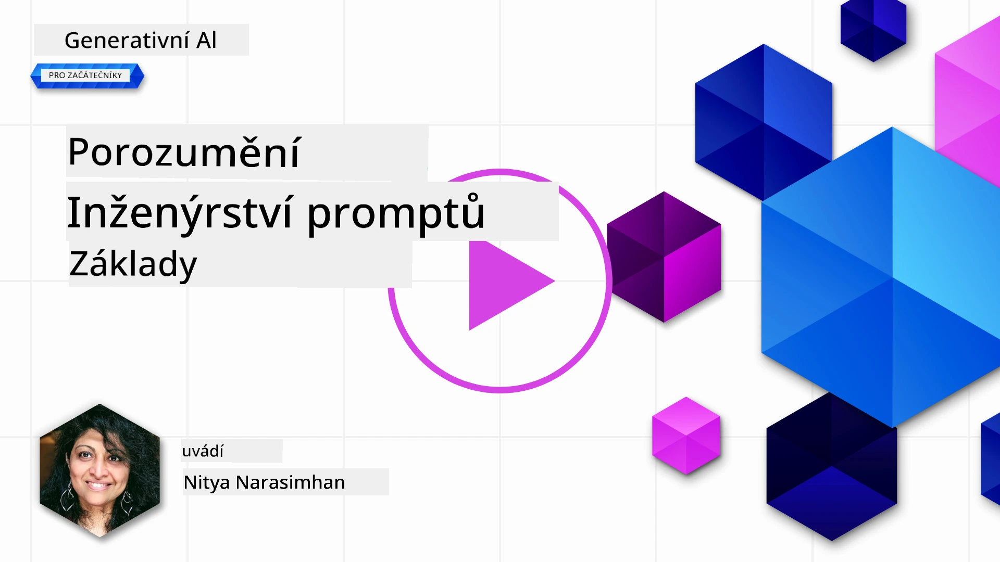
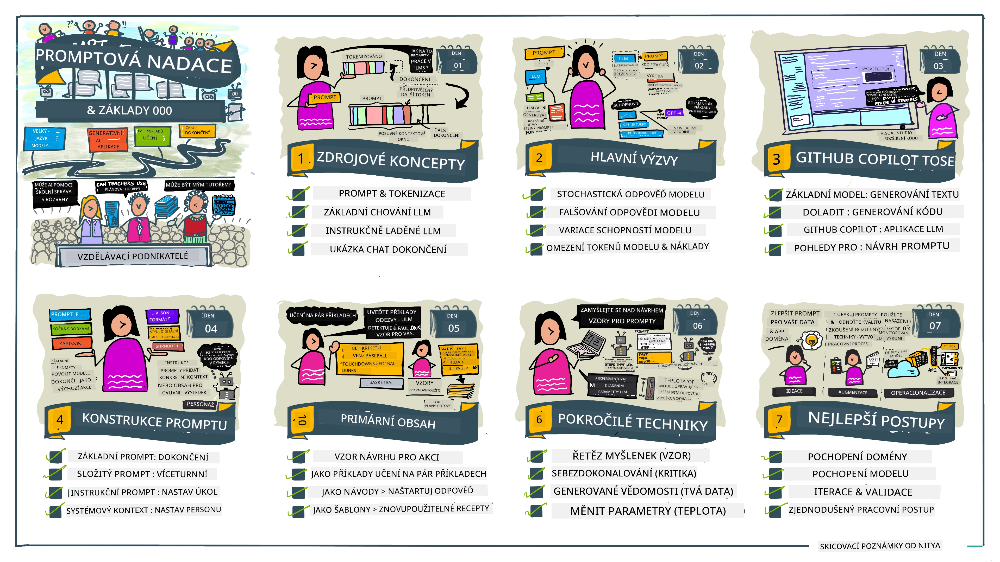
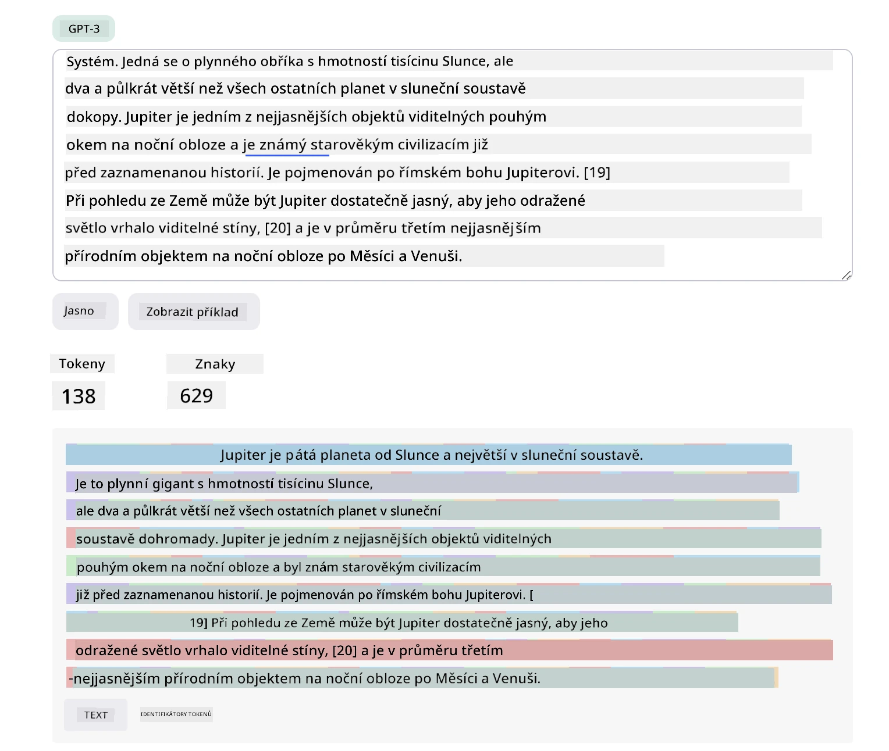
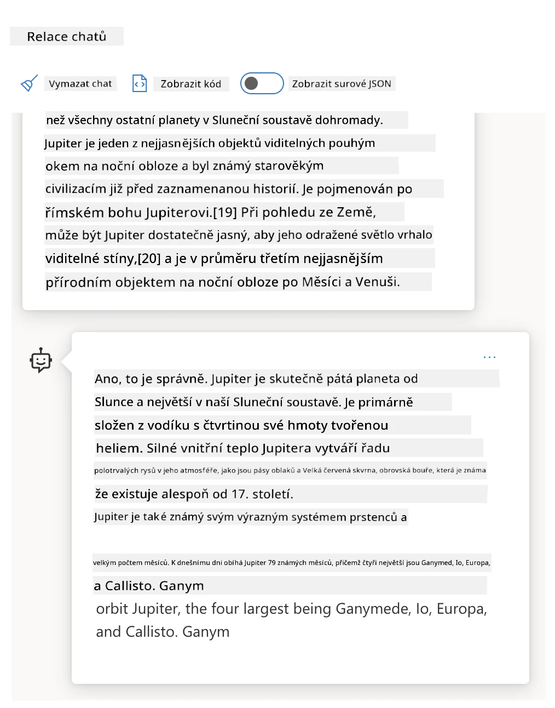
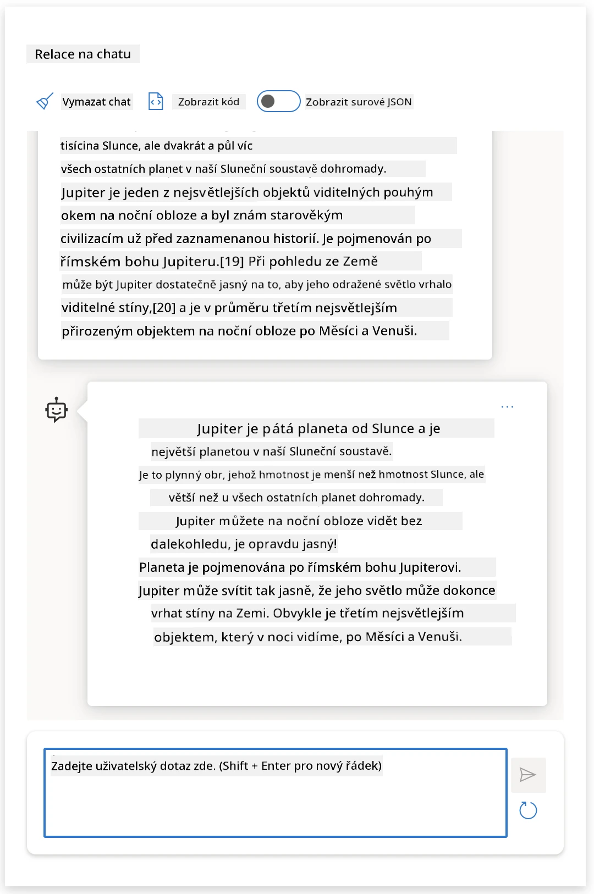
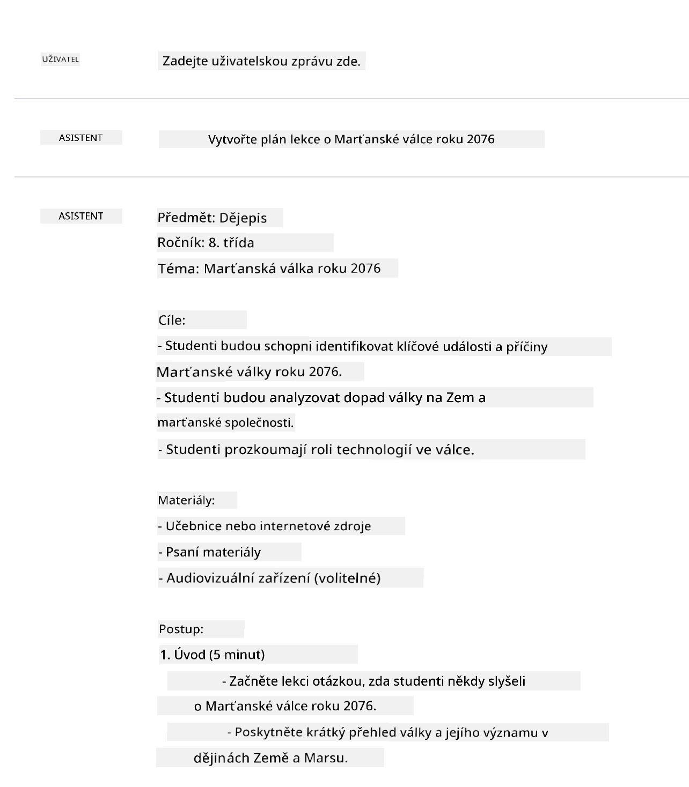
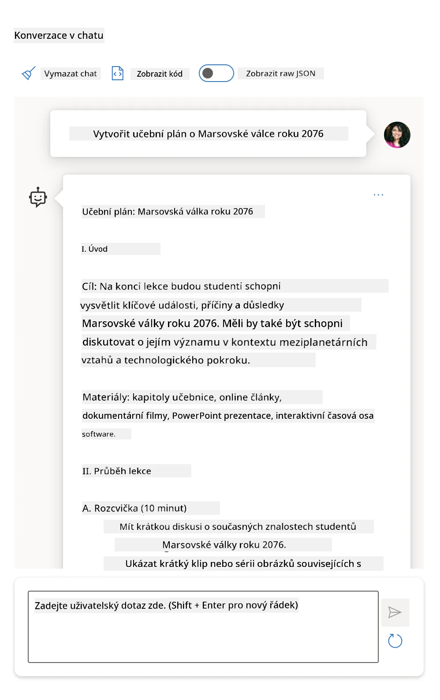
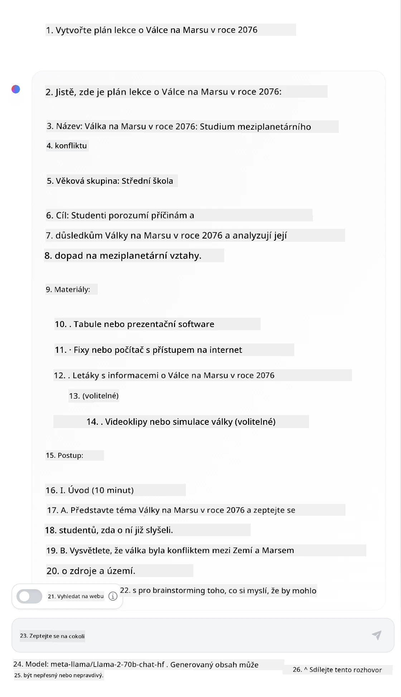

# Základy návrhu promptů

[](https://youtu.be/GElCu2kUlRs?si=qrXsBvXnCW12epb8)

## Úvod
Tento modul pokrývá základní pojmy a techniky pro vytváření efektivních promptů v generativních modelech AI. Záleží na tom, jak prompt pro velký jazykový model (LLM) napíšete. Pečlivě vytvořený prompt může vést k lepší kvalitě odpovědí. Ale co přesně znamenají pojmy jako _prompt_ a _návrh promptů_? A jak mohu zlepšit vstupní prompt, který posílám LLM? To jsou otázky, na které se pokusíme odpovědět v této kapitole a v další.

_Generativní AI_ je schopna vytvářet nový obsah (např. text, obrázky, zvuk, kód apod.) jako reakci na požadavky uživatelů. Dosahuje toho pomocí _velkých jazykových modelů_ jako je série GPT od OpenAI ("Generative Pre-trained Transformer"), které jsou trénovány na práci s přirozeným jazykem a kódem.

Uživatelé nyní mohou interagovat s těmito modely pomocí známých způsobů, jako je chat, aniž by potřebovali technické znalosti nebo školení. Modely jsou založeny na _promptech_ - uživatelé posílají textový vstup (prompt) a získávají zpět odpověď AI (kompletaci). Poté mohou s AI "konverzovat" opakovaně, ve více kolech rozhovoru, a vylepšovat svůj prompt, dokud není odpověď podle jejich očekávání.

„Prompty“ se tak stávají primárním _programovacím rozhraním_ pro generativní aplikace AI, říká modelům, co mají dělat, a ovlivňují kvalitu vrácených odpovědí. „Návrh promptů“ je rychle rostoucí oblast, která se zaměřuje na _návrh a optimalizaci_ promptů tak, aby přinášely konzistentní a kvalitní odpovědi ve velkém měřítku.

## Cíle učení

V této lekci se naučíme, co je návrh promptů, proč je důležitý a jak vytvářet efektivnější prompty pro daný model a aplikační cíl. Porozumíme základním konceptům a osvědčeným postupům návrhu promptů - a seznámíme se s interaktivním prostředím Jupyter Notebooku „sandbox“, kde uvidíme tyto koncepty aplikované na reálných příkladech.

Na konci této lekce budeme schopni:

1. Vysvětlit, co je návrh promptů a proč je důležitý.
2. Popsat komponenty promptu a jak se používají.
3. Naučit se osvědčené postupy a techniky návrhu promptů.
4. Aplikovat naučené techniky na reálných příkladech pomocí OpenAI endpointu.

## Klíčové pojmy

Návrh promptů: Praxe navrhování a zdokonalování vstupů, které vedou AI modely k produkci požadovaných výstupů.  
Tokenizace: Proces převodu textu na menší jednotky, nazývané tokeny, které model dokáže pochopit a zpracovat.  
LLMy laděné na instrukce: Velké jazykové modely (LLM), které byly speciálně doladěny pomocí konkrétních instrukcí pro zlepšení přesnosti a relevance odpovědí.

## Prostředí pro učení

Návrh promptů je v současnosti spíše umění než věda. Nejlepším způsobem, jak zlepšit naši intuici, je _více cvičit_ a přijmout přístup pokus-omyl, který kombinuje znalosti domény s doporučenými technikami a optimalizacemi specifickými pro daný model.

Jupyter Notebook, který doprovází tuto lekci, poskytuje _sandboxové_ prostředí, kde si můžete vyzkoušet, co se naučíte - za běhu nebo jako součást úkolu na konci lekce. Pro provedení cvičení budete potřebovat:

1. **API klíč Azure OpenAI** - endpoint služby pro nasazený LLM.  
2. **Python Runtime** - ve kterém lze Notebook spustit.  
3. **Lokální proměnné prostředí** - _dokončete nyní kroky v [SETUPu](./../00-course-setup/02-setup-local.md?WT.mc_id=academic-105485-koreyst), aby bylo vše připraveno_.

Notebook obsahuje _základní_ cvičení - ale jste vyzváni, abyste přidávali vlastní _Markdown_ (popisy) a _kód_ (požadavky promptů), abyste vyzkoušeli více příkladů nebo nápadů a vybudovali si intuici pro návrh promptů.

## Ilustrovaný průvodce

Chcete získat velký přehled o tom, co tato lekce pokrývá, než se do ní ponoříte? Podívejte se na tento ilustrovaný průvodce, který vám dá přehled o hlavních tématech a klíčových bodech, nad kterými byste měli přemýšlet u každého z nich. Plán lekce vás provede od porozumění ústředním konceptům a výzvám až po jejich řešení relevantními technikami a osvědčenými postupy návrhu promptů. Pozor, sekce „Pokročilé techniky“ v tomto průvodci odkazuje na obsah pokrytý v _následující_ kapitole tohoto kurikula.



## Naše startupová mise

Nyní si řekněme, jak se _toto téma_ vztahuje k naší startupové misi přinést [inovace AI do vzdělávání](https://educationblog.microsoft.com/2023/06/collaborating-to-bring-ai-innovation-to-education?WT.mc_id=academic-105485-koreyst). Chceme budovat AI aplikace pro _personalizované vzdělávání_ - zamysleme se tedy, jak by různí uživatelé naší aplikace mohli „navrhovat“ prompty:

- **Administrátoři** by mohli požádat AI o _analýzu dat učebních osnov k identifikaci mezer ve pokrytí_. AI může shrnout výsledky nebo je vizualizovat pomocí kódu.  
- **Učitelé** by mohli požádat AI o _vygenerování učebního plánu pro cílovou skupinu a téma_. AI může vytvořit personalizovaný plán ve specifikovaném formátu.  
- **Studenti** by mohli požádat AI o _doučování v obtížném předmětu_. AI nyní může studenty vést lekcemi, nápovědami a příklady přizpůsobenými jejich úrovni.

To je jen špička ledovce. Podívejte se na [Prompts For Education](https://github.com/microsoft/prompts-for-edu/tree/main?WT.mc_id=academic-105485-koreyst) - open source knihovnu promptů vytvořenou experty ze vzdělávání - abyste získali širší představu o možnostech! _Vyzkoušejte některé z těchto promptů v sandboxu nebo v OpenAI Playgroundu a uvidíte, co se stane!_

<!--
LESSON TEMPLATE:
This unit should cover core concept #1.
Reinforce the concept with examples and references.

CONCEPT #1:
Prompt Engineering.
Define it and explain why it is needed.
-->

## Co je návrh promptů?

Lekci jsme začali definováním **návrhu promptů** jako procesu _navrhování a optimalizace_ textových vstupů (promptů) tak, aby přinášely konzistentní a kvalitní odpovědi (kompletace) pro daný aplikační cíl a model. Můžeme to chápat jako dvoufázový proces:

- _navrhnout_ počáteční prompt pro daný model a cíl  
- _iterativně zdokonalovat_ prompt, aby se zlepšila kvalita odpovědi

Jde nutně o proces pokusu a omylu, který vyžaduje intuici uživatele a snahu o dosažení optimálních výsledků. Proč je to tedy důležité? Abychom na tuto otázku odpověděli, musíme nejprve pochopit tři pojmy:

- _tokenizace_ = jak model „vidí“ prompt  
- _základní LLM_ = jak základní model „zpracovává“ prompt  
- _LLMy laděné na instrukce_ = jak model nyní může vidět „úkoly“

### Tokenizace

LLM vidí prompt jako _posloupnost tokenů_, přičemž různé modely (nebo verze modelu) mohou stejný prompt tokenizovat různými způsoby. Protože jsou LLM trénovány na tokenech (a nikoli na surovém textu), způsob, jakým se prompt tokenizuje, přímo ovlivňuje kvalitu generované odpovědi.

Pro získání představy o tom, jak tokenizace funguje, vyzkoušejte nástroje jako [OpenAI Tokenizer](https://platform.openai.com/tokenizer?WT.mc_id=academic-105485-koreyst) uvedený níže. Zkopírujte do něj svůj prompt - a sledujte, jak se převede na tokeny, věnujte pozornost tomu, jak jsou zpracovány bílé znaky a interpunkce. Poznamenejte si, že tento příklad ukazuje starší LLM (GPT-3) - při použití novějšího modelu může být výsledek odlišný.



### Koncept: Základní modely

Když je prompt tokenizován, hlavní funkcí ["Base LLM"](https://blog.gopenai.com/an-introduction-to-base-and-instruction-tuned-large-language-models-8de102c785a6?WT.mc_id=academic-105485-koreyst) (tedy základního modelu) je předpovídat token v této posloupnosti. Jelikož jsou LLM trénovány na obrovských textových datech, mají dobrý přehled o statistických vztazích mezi tokeny a mohou tuto předpověď udělat s jistou mírou přesnosti. Nechápu ale _význam_ slov v promptu nebo tokenu; vidí jen vzor, který mohou „dokreslit“ následující predikcí. Mohou predikovat posloupnost dále, dokud není ukončeno uživatelským zásahem nebo nějakou předem stanovenou podmínkou.

Chcete vidět, jak funguje dokončování na základě promptu? Vložte výše uvedený prompt do Azure OpenAI Studia v [_Chat Playground_](https://oai.azure.com/playground?WT.mc_id=academic-105485-koreyst) s výchozím nastavením. Systém je nastaven tak, aby považoval prompty za požadavky na informace - takže byste měli vidět odpověď, která vyhovuje tomuto kontextu.

Ale co když uživatel chce vidět něco konkrétního, co splňuje nějaká kritéria nebo cíl úkolu? Tady do hry přicházejí _LLMy laděné na instrukce_.



### Koncept: LLMy laděné na instrukce

[LLM laděný na instrukce](https://blog.gopenai.com/an-introduction-to-base-and-instruction-tuned-large-language-models-8de102c785a6?WT.mc_id=academic-105485-koreyst) vychází ze základního modelu a doladí se pomocí příkladů nebo vstupně-výstupních párů (např. vícekrokových „zpráv“), které mohou obsahovat jasné instrukce - a odpověď AI se pokusí těmto instrukcím vyhovět.

Používá techniky jako posilované učení s lidskou zpětnou vazbou (RLHF), které mohou model naučit _řídit se instrukcemi_ a _učit se ze zpětné vazby_, aby produkoval odpovědi lépe přizpůsobené praktickým aplikacím a relevantnější pro uživatelské cíle.

Vyzkoušejme to - vezměte si výše uvedený prompt, ale změňte _systémovou zprávu_, aby poskytla tuto instrukci jako kontext:

> _Shrň obsah, který ti byl poskytnut, pro druháka. Udrž výsledek v jednom odstavci s 3-5 odrážkami._

Vidíte, jak je výsledek teď laděný tak, aby odpovídal požadovanému cíli a formátu? Učitel to může přímo použít ve svých slidách na danou hodinu.



## Proč potřebujeme návrh promptů?

Teď, když víme, jak LLM prompt zpracovávají, pojďme si říct, _proč_ potřebujeme návrh promptů. Odpověď spočívá v tom, že současné LLM představují řadu výzev, které ztěžují _dosažení spolehlivých a konzistentních odpovědí_ bez snahy o konstrukci a optimalizaci promptů. Například:

1. **Odpovědi modelů jsou stochastické.** _Stejný prompt_ pravděpodobně vygeneruje různé odpovědi u různých modelů nebo verzí modelů. A může dokonce přinést různé výsledky u _téhož modelu_ při různých spuštěních. _Techniky návrhu promptů nám mohou pomoci tato odchylky minimalizovat tím, že poskytnou lepší vodítka_.

1. **Modely mohou vymýšlet odpovědi.** Modely jsou předtrénovány na _velkých, ale omezených_ datech, což znamená, že jim chybí znalosti o věcech mimo tento tréninkový rozsah. V důsledku toho mohou produkovat odpovědi, které jsou nepřesné, smyšlené nebo přímo protichůdné známým faktům. _Techniky návrhu promptů pomáhají uživatelům odhalovat a snižovat takové smyšlenky, například tím, že vyžadují citace nebo vysvětlení od AI_.

1. **Schopnosti modelů se liší.** Novější modely nebo generace modelů mají bohatší schopnosti, ale také přinášejí jedinečné zvláštnosti a kompromisy v nákladech a složitosti. _Návrh promptů nám pomáhá rozvíjet osvědčené postupy a pracovní postupy, které abstrahují rozdíly a přizpůsobují se specifickým požadavkům modelů škálovatelným a plynulým způsobem_.

Vyzkoušejme to v praxi v OpenAI nebo Azure OpenAI Playgroundu:

- Použijte stejný prompt u různých nasazení LLM (např. OpenAI, Azure OpenAI, Hugging Face) - zaznamenali jste rozdíly?  
- Použijte stejný prompt opakovaně u _téhož_ nasazení LLM (např. Azure OpenAI playground) - jak se tyto rozdíly lišily?

### Příklad smyšlenek

V tomto kurzu používáme termín **„smyšlenka“** (fabrication) pro označení jevu, kdy LLM někdy generují fakticky nepřesné informace kvůli omezením v tréninku nebo jiným okolnostem. Můžete se s tím setkat i pod pojmem _„halucinace“_ v populárních článcích nebo výzkumných pracích. Nicméně důrazně doporučujeme používat pojem _„smyšlenka“_, abychom se vyhnuli antropomorfizaci chování, tedy přisuzování lidské vlastnosti výsledku řízenému strojem. Toto též posiluje [zásady odpovědného AI](https://www.microsoft.com/ai/responsible-ai?WT.mc_id=academic-105485-koreyst) z hlediska terminologie a vyřazuje výrazy, které by mohly být v některých kontextech považovány za urážlivé nebo nevhodné.

Chcete si udělat představu, jak smyšlenky fungují? Představte si prompt, který instruuje AI, aby vygenerovala obsah k neexistujícímu tématu (aby se zajistilo, že se v tréninkových datech nevyskytuje). Například - vyzkoušel jsem tento prompt:

> **Prompt:** vygeneruj učební plán pro Martskou válku roku 2076.
Webové vyhledávání mi ukázalo, že existovaly fiktivní příběhy (např. televizní seriály nebo knihy) o martianských válkách – ale žádné v roce 2076. Zdravý rozum nám také říká, že rok 2076 je _v budoucnosti_ a tudíž nemůže být spojen s reálnou událostí.

Co se tedy stane, když spustíme tento prompt u různých poskytovatelů LLM?

> **Odpověď 1**: OpenAI Playground (GPT-35)



> **Odpověď 2**: Azure OpenAI Playground (GPT-35)



> **Odpověď 3**: : Hugging Face Chat Playground (LLama-2)



Jak se očekávalo, každý model (nebo verze modelu) produkuje mírně odlišné odpovědi díky stochastickému chování a rozdílům v kapacitě modelu. Například jeden model cílí na publikum 8. třídy, zatímco jiný předpokládá středoškoláka. Ale všechny tři modely vytvořily odpovědi, které by mohly přesvědčit neinformovaného uživatele, že daná událost byla skutečná.

Techniky návrhu promptů jako je _metaprompting_ a _nastavení teploty_ mohou do určité míry snížit výskyt vymyšlených odpovědí modelu. Nové _architektury_ promptů také bezproblémově začleňují nové nástroje a techniky do toku promptu, aby zmírnily nebo snížily některé z těchto efektů.

## Případová studie: GitHub Copilot

Sekci uzavřeme tím, že si uděláme představu o tom, jak se prompt engineering používá v reálných řešeních, na příkladu jedné případové studie: [GitHub Copilot](https://github.com/features/copilot?WT.mc_id=academic-105485-koreyst).

GitHub Copilot je váš "AI Programovací partner" – přeměňuje textové podněty na dokončení kódu a je integrován do vašeho vývojového prostředí (např. Visual Studio Code) pro plynulý uživatelský zážitek. Jak je zdokumentováno v sérii níže uvedených blogů, nejstarší verze byla založena na modelu OpenAI Codex – přičemž inženýři rychle pochopili potřebu doladit model a vyvinout lepší techniky prompt engineeringu ke zlepšení kvality kódu. V červenci představili [vylepšený AI model, který jde nad rámec Codexu](https://github.blog/2023-07-28-smarter-more-efficient-coding-github-copilot-goes-beyond-codex-with-improved-ai-model/?WT.mc_id=academic-105485-koreyst) pro ještě rychlejší návrhy.

Čtěte příspěvky v pořadí, abyste sledovali jejich učební cestu.

- **Květen 2023** | [GitHub Copilot se lépe učí porozumět vašemu kódu](https://github.blog/2023-05-17-how-github-copilot-is-getting-better-at-understanding-your-code/?WT.mc_id=academic-105485-koreyst)
- **Květen 2023** | [Uvnitř GitHubu: Práce s LLM za GitHub Copilotem](https://github.blog/2023-05-17-inside-github-working-with-the-llms-behind-github-copilot/?WT.mc_id=academic-105485-koreyst)
- **Červen 2023** | [Jak psát lepší prompty pro GitHub Copilot](https://github.blog/2023-06-20-how-to-write-better-prompts-for-github-copilot/?WT.mc_id=academic-105485-koreyst)
- **Červenec 2023** | [.. GitHub Copilot jde nad rámec Codexu s vylepšeným AI modelem](https://github.blog/2023-07-28-smarter-more-efficient-coding-github-copilot-goes-beyond-codex-with-improved-ai-model/?WT.mc_id=academic-105485-koreyst)
- **Červenec 2023** | [Průvodce vývojáře prompt engineeringem a LLM](https://github.blog/2023-07-17-prompt-engineering-guide-generative-ai-llms/?WT.mc_id=academic-105485-koreyst)
- **Září 2023** | [Jak vybudovat podnikové LLM aplikace: Lekce od GitHub Copilota](https://github.blog/2023-09-06-how-to-build-an-enterprise-llm-application-lessons-from-github-copilot/?WT.mc_id=academic-105485-koreyst)

Můžete také procházet jejich [inženýrský blog](https://github.blog/category/engineering/?WT.mc_id=academic-105485-koreyst) pro více příspěvků jako [tento](https://github.blog/2023-09-27-how-i-used-github-copilot-chat-to-build-a-reactjs-gallery-prototype/?WT.mc_id=academic-105485-koreyst), který ukazuje, jak jsou tyto modely a techniky _aplikovány_ pro řízení reálných aplikací.

---

<!--
LESSON TEMPLATE:
This unit should cover core concept #2.
Reinforce the concept with examples and references.

CONCEPT #2:
Prompt Design.
Illustrated with examples.
-->

## Konstrukce promptu

Viděli jsme, proč je prompt engineering důležitý – nyní pochopme, jak se prompty _konstruují_, abychom mohli vyhodnotit různé techniky pro efektivnější návrh promptů.

### Základní prompt

Začneme se základním promptem: textovým vstupem poslaným do modelu bez dalšího kontextu. Zde je příklad – když pošleme první několik slov americké národní hymny do OpenAI [Completion API](https://platform.openai.com/docs/api-reference/completions?WT.mc_id=academic-105485-koreyst), okamžitě _dokončí_ odpověď dalšími několika řádky, což ilustruje základní predikční chování.

| Prompt (Input)     | Completion (Output)                                                                                                                        |
| :----------------- | :----------------------------------------------------------------------------------------------------------------------------------------- |
| Oh say can you see | Zdá se, že začínáte s textem písně "The Star-Spangled Banner", národní hymny Spojených států. Celý text je ... |

### Komplexní prompt

Nyní přidáme kontext a instrukce k základnímu promptu. [Chat Completion API](https://learn.microsoft.com/azure/ai-services/openai/how-to/chatgpt?WT.mc_id=academic-105485-koreyst) nám umožňuje sestavit komplexní prompt jako kolekci _zpráv_ s:

- vstupní/výstupními páry odrážejícími vstup _uživatele_ a odpověď _asistenta_.
- systémovou zprávou nastavující kontext chování nebo osobnosti asistenta.

Požadavek má nyní níže uvedený tvar, kde _tokenizace_ efektivně zachycuje relevantní informace z kontextu a konverzace. Změna systémového kontextu může mít stejně zásadní dopad na kvalitu dokončení, jako poskytnuté uživatelské vstupy.

```python
response = openai.chat.completions.create(
    model="gpt-3.5-turbo",
    messages=[
        {"role": "system", "content": "You are a helpful assistant."},
        {"role": "user", "content": "Who won the world series in 2020?"},
        {"role": "assistant", "content": "The Los Angeles Dodgers won the World Series in 2020."},
        {"role": "user", "content": "Where was it played?"}
    ]
)
```

### Instrukční prompt

V předchozích příkladech byl uživatelský prompt jednoduchý textový dotaz, který lze interpretovat jako žádost o informaci. S _instrukčními_ promptami můžeme tento text použít pro podrobnější specifikaci úkolu a poskytnout AI lepší vedení. Tady je příklad:

| Prompt (Input)                                                                                                                                                                                                                         | Completion (Output)                                                                                                        | Typ instrukce      |
| :------------------------------------------------------------------------------------------------------------------------------------------------------------------------------------------------------------------------------------- | :------------------------------------------------------------------------------------------------------------------------- | :------------------ |
| Napiš popis Občanské války                                                                                                                                                                                                             | _vrátil jednoduchý odstavec_                                                                                              | Jednoduchý          |
| Napiš popis Občanské války. Uveď klíčová data a události a popiš jejich význam                                                                                                                                                          | _vrátil odstavec následovaný seznamem klíčových dat událostí s popisy_                                                    | Komplexní           |
| Napiš popis Občanské války v 1 odstavci. Uveď 3 odrážky s klíčovými daty a jejich významem. Uveď dalších 3 odrážky s klíčovými historickými postavami a jejich přínosy. Výstup vrať jako JSON soubor | _vrací podrobnější informace v textovém bloku, formátovaném jako JSON, které můžete zkopírovat a ověřit podle potřeby_      | Komplexní. Formátovaný.|

## Primární obsah

V předchozích příkladech byl prompt stále poměrně otevřený, což umožňovalo LLM rozhodnout, která část jeho předem naučených dat je relevantní. Pomocí návrhového vzoru _primární obsah_ je vstupní text rozdělen na dvě části:

- instrukce (akce)
- relevantní obsah (který akci ovlivňuje)

Zde je příklad, kdy je instrukce "shrň toto ve 2 větách".

| Prompt (Input)                                                                                                                                                                                                                                                                                                                                                                                                                                                                                                                                                                                                                                                                                      | Completion (Output)                                                                                                                                                                                                                                                                             |
| :-------------------------------------------------------------------------------------------------------------------------------------------------------------------------------------------------------------------------------------------------------------------------------------------------------------------------------------------------------------------------------------------------------------------------------------------------------------------------------------------------------------------------------------------------------------------------------------------------------------------------------------------------------------------------------------------------- | :---------------------------------------------------------------------------------------------------------------------------------------------------------------------------------------------------------------------------------------------------------------------------------------------- |
| Jupiter je pátá planeta od Slunce a největší v soustavě. Je to plynného obra s hmotností tisícinu Slunce, ale dvakrát a půl větší než všechny ostatní planety v soustavě dohromady. Jupiter je jedním z nejjasnějších objektů viditelných pouhým okem na noční obloze a byl znám starověkým civilizacím již před zaznamenanou historií. Je pojmenován po římském bohu Jupiterovi.[19] Když se díváme ze Země, může být Jupiter dostatečně jasný na to, aby jeho odražené světlo vrhalo viditelné stíny,[20] a je průměrně třetím nejjasnějším přirozeným objektem noční oblohy po Měsíci a Venuši. <br/> **Shrň toto ve 2 krátkých větách** | Jupiter, pátá planeta od Slunce, je největší v soustavě a je známý jako jeden z nejjasnějších objektů na noční obloze. Pojmenován je po římském bohu Jupiterovi a je plynného obra s hmotností dvakrát a půl větší než všechny ostatní planety dohromady. |

Segment primárního obsahu lze použít různými způsoby k efektivnějšímu vedení instrukcí:

- **Příklady** – místo explicitního zadání, co má model dělat, mu poskytněte příklady, co má dělat, a nechte ho vyvodit vzor.
- **Náznaky** – následujte instrukci "návznakem", který model připraví na dokončení a nasměruje ho k relevantnějším odpovědím.
- **Šablony** – opakovatelné 'recepty' pro prompty s držáky (proměnnými), které lze přizpůsobit daty pro konkrétní použití.

Pojďme si je představit v praxi.

### Použití příkladů

Jedná se o přístup, kdy pomocí primárního obsahu „nakrmíte model“ příklady požadovaného výstupu pro danou instrukci a necháte ho vyvodit vzor požadovaného výstupu. Podle počtu poskytnutých příkladů máme zero-shot prompting, one-shot prompting, few-shot prompting atd.

Prompt nyní obsahuje tři složky:

- popis úkolu
- několik příkladů požadovaného výstupu
- začátek nového příkladu (který implicitně popisuje úkol)

| Typ učení   | Prompt (Input)                                                                                                                                        | Completion (Output)         |
| :---------- | :---------------------------------------------------------------------------------------------------------------------------------------------------- | :-------------------------- |
| Zero-shot   | "The Sun is Shining". Přelož do španělštiny                                                                                                          | "El Sol está brillando".    |
| One-shot    | "The Sun is Shining" => ""El Sol está brillando". <br> "It's a Cold and Windy Day" =>                                                                 | "Es un día frío y ventoso". |
| Few-shot    | The player ran the bases => Baseball <br/> The player hit an ace => Tennis <br/> The player hit a six => Cricket <br/> The player made a slam-dunk => | Basketbal                  |
|             |                                                                                                                                                       |                             |

Všimněte si, že u zero-shot promptingu musíme poskytnout explicitní instrukci ("Přelož do španělštiny"), ale u one-shot promptingu je už vyvozena. Few-shot příklad ukazuje, že přidání více příkladů umožňuje modelům přesnější odvození bez dalších instrukcí.

### Promptové náznaky

Další technikou použití primárního obsahu je poskytnutí _náznaků_ místo příkladů. V tomto případě dáváme modelu impuls správným směrem tím, že _začneme_ úryvkem, který odráží požadovaný formát odpovědi. Model „vezme náznak“ a pokračuje tímto směrem.

| Počet náznaků | Prompt (Input)                                                                                                                                                                                                                                                                                                                                                                                                                                               | Completion (Output)                                                                                                                                                                                                                                                                                       |
| :------------- | :----------------------------------------------------------------------------------------------------------------------------------------------------------------------------------------------------------------------------------------------------------------------------------------------------------------------------------------------------------------------------------------------------------------------------------------------------------- | :-------------------------------------------------------------------------------------------------------------------------------------------------------------------------------------------------------------------------------------------------------------------------------------------------------- |
| 0              | Jupiter je pátá planeta od Slunce a největší v soustavě. Je to plynného obra s hmotností tisícinu Slunce, ale dvakrát a půl větší než všechny ostatní planety v soustavě dohromady. Jupiter je jedním z nejjasnějších objektů viditelných pouhým okem na noční obloze a byl znám starověkým civilizacím již před zaznamenanou historií. <br/>**Shrň toto**                                       | Jupiter je největší planeta naší Sluneční soustavy a pátá od Slunce. Je to plynného obra s hmotností 1/1000 Slunce, ale je těžší než všechny ostatní planety dohromady. Starověké civilizace znal Jej dlouho a je snadno viditelný na noční obloze. |
| 1              | Jupiter je pátá planeta od Slunce a největší v sluneční soustavě. Je to plynného obra s hmotností jedné tisíciny hmotnosti Slunce, ale dvakrát a půl větší než všechny ostatní planety v sluneční soustavě dohromady. Jupiter je jeden z nejsvětlejších objektů viditelných pouhým okem na noční obloze a je známý dávným civilizacím již před zaznamenanou historií. <br/>**Shrňte toto** <br/> Co jsme se naučili je, že Jupiter | je pátá planeta od Slunce a největší v sluneční soustavě. Je to plynného obra s hmotností jedné tisíciny hmotnosti Slunce, ale dvakrát a půl větší než všechny ostatní planety dohromady. Je snadno viditelný pouhým okem a je známý od dávných dob.                        |
| 2              | Jupiter je pátá planeta od Slunce a největší v sluneční soustavě. Je to plynného obra s hmotností jedné tisíciny hmotnosti Slunce, ale dvakrát a půl větší než všechny ostatní planety v sluneční soustavě dohromady. Jupiter je jeden z nejsvětlejších objektů viditelných pouhým okem na noční obloze a je známý dávným civilizacím již před zaznamenanou historií. <br/>**Shrňte toto** <br/> Tři nejdůležitější fakta, která jsme se naučili:         | 1. Jupiter je pátá planeta od Slunce a největší v sluneční soustavě. <br/> 2. Je to plynného obra s hmotností jedné tisíciny hmotnosti Slunce...<br/> 3. Jupiter je viditelný pouhým okem od starověku ...                                                                       |
|                |                                                                                                                                                                                                                                                                                                                                                                                                                                                              |                                                                                                                                                                                                                                                                                                           |

### Šablony promptů

Šablona promptu je _předdefinovaný recept na prompt_, který může být uložen a znovu použit podle potřeby, aby se zajistila konzistentnější uživatelská zkušenost ve velkém měřítku. V nejjednodušší podobě je to jednoduše sbírka příkladů promptů jako [tento od OpenAI](https://platform.openai.com/examples?WT.mc_id=academic-105485-koreyst), která poskytuje jak interaktivní komponenty promptu (zprávy uživatele a systému), tak formát požadavku řízený API – k podpoře opakovaného použití.

Ve složitější podobě jako [tento příklad od LangChain](https://python.langchain.com/docs/concepts/prompt_templates/?WT.mc_id=academic-105485-koreyst) obsahuje _zástupné symboly_, které lze nahradit daty z různých zdrojů (uživatelský vstup, kontext systému, externí datové zdroje atd.) pro dynamickou tvorbu promptu. To nám umožňuje vytvářet knihovny znovupoužitelných promptů, které lze **programově** použít k řízení konzistentních uživatelských zážitků ve velkém.

Skutečná hodnota šablon spočívá ve schopnosti vytvářet a publikovat _knihovny promptů_ pro vertikální aplikační oblasti – kde je šablona promptu nyní _optimalizována_ tak, aby odrážela kontext aplikace nebo příklady, které činí odpovědi relevantnějšími a přesnějšími pro cílové uživatele. Repozitář [Prompts For Edu](https://github.com/microsoft/prompts-for-edu?WT.mc_id=academic-105485-koreyst) je skvělým příkladem tohoto přístupu, který shromažďuje knihovnu promptů pro oblast vzdělávání s důrazem na hlavní cíle jako plánování lekcí, návrh kurikula, doučování studentů atd.

## Podpůrný obsah

Pokud uvažujeme tvorbu promptu jako kombinaci instrukce (úkolu) a cíle (primárního obsahu), pak _sekundární obsah_ je jako další kontext, který poskytujeme k **ovlivnění výstupu nějakým způsobem**. Může to být ladicí parametry, instrukce k formátování, taxonomie témat atd., které pomáhají modelu _přizpůsobit_ svou odpověď tak, aby vyhověla požadovaným uživatelským cílům či očekáváním.

Například: Máme katalog kurzů s rozsáhlými metadaty (název, popis, úroveň, metadata tagy, instruktor atd.) ke všem dostupným kurzům v kurikulu:

- můžeme definovat instrukci „shrňte katalog kurzů pro podzim 2023“
- můžeme použít primární obsah k uvedení několika příkladů požadovaného výstupu
- můžeme použít sekundární obsah k identifikaci top 5 „tagů“ zájmu.

Nyní může model vytvořit shrnutí ve formátu zobrazeném příklady – ale pokud má výsledek více tagů, může upřednostnit těch 5 tagů uvedených v sekundárním obsahu.

---

<!--
TEMPLATE LEKCÍ:
Tento modul by měl pokrýt základní koncept #1.
Posilte koncept příklady a odkazy.

KONCEPT #3:
Techniky tvorby promptů.
Jaké jsou základní techniky tvorby promptů?
Ilustrujte to pomocí několika cvičení.
-->

## Nejlepší postupy při tvorbě promptů

Teď když víme, jak se prompt vytváří, můžeme začít přemýšlet, jak ho _navrhnout_, aby odrážel osvědčené postupy. Můžeme o tom přemýšlet ve dvou částech – mít správný _přístup_ a používat správné _techniky_.

### Přístup k tvorbě promptů

Tvorba promptů je proces pokus-omyl, proto mějte na paměti tři široce zaměřené faktory:

1. **Důležitost porozumění doméně.** Přesnost a relevance odpovědi závisí na _doméně_, ve které aplikace nebo uživatel působí. Použijte svoji intuici a odbornost k **další úpravě technik**. Například definujte _doménově specifické osobnosti_ ve svých systémových promptech, nebo použijte _šablony specifické pro doménu_ ve vašich uživatelských promptech. Poskytněte sekundární obsah odrážející kontext specifický pro doménu, nebo použijte _doménové náznaky a příklady_ k nasměrování modelu na známé vzorce použití.

2. **Důležitost porozumění modelu.** Víme, že modely jsou z podstaty stochastické. Ale implementace modelů se mohou lišit z hlediska trénovací sady dat (předtrénované znalosti), funkcí, které poskytují (např. přes API nebo SDK) a typu obsahu, na který jsou optimalizovány (např. kód vs. obraz vs. text). Pochopte silné a slabé stránky modelu, který používáte, a tuto znalost použijte k _prioritizaci úkolů_ nebo tvorbě _vlastních šablon_, které jsou optimalizovány pro schopnosti modelu.

3. **Důležitost iterace a ověřování.** Modely se rychle vyvíjejí a stejně tak i techniky tvorby promptů. Jako odborník v oboru můžete mít další kontext nebo kritéria pro _váš_ specifický případ, která nemusí platit pro širší komunitu. Použijte nástroje a techniky tvorby promptů k „rychlému startu“ tvorby promptu, potom iterujte a ověřujte výsledky pomocí vlastní intuice a odbornosti. Zaznamenejte své postřehy a vytvořte **databázi znalostí** (např. knihovny promptů), která může být použita jako nový základ ostatními pro rychlejší iterace v budoucnu.

## Nejlepší praktiky

Podívejme se nyní na běžné doporučené postupy od [OpenAI](https://help.openai.com/en/articles/6654000-best-practices-for-prompt-engineering-with-openai-api?WT.mc_id=academic-105485-koreyst) a [Azure OpenAI](https://learn.microsoft.com/azure/ai-services/openai/concepts/prompt-engineering#best-practices?WT.mc_id=academic-105485-koreyst).

| Co                               | Proč                                                                                                                                                                                                                                             |
| :-------------------------------- | :----------------------------------------------------------------------------------------------------------------------------------------------------------------------------------------------------------------------------------------------- |
| Vyhodnocujte nejnovější modely.   | Nové generace modelů pravděpodobně přinášejí vylepšené funkce a kvalitu – ale mohou také znamenat vyšší náklady. Vyhodnoťte jejich dopad a potom se rozhodněte o migraci.                                                                         |
| Oddělujte instrukce a kontext    | Zjistěte, zda váš model/poskytovatel definuje _oddělovače_ umožňující jasněji rozlišit instrukce, primární a sekundární obsah. Pomáhá to modelům přiřadit váhy tokenům přesněji.                                                                   |
| Buďte konkrétní a jasní           | Poskytněte více detailů o požadovaném kontextu, výsledku, délce, formátu, stylu atd. To zlepší kvalitu i konzistenci odpovědí. Zachyťte recepty v znovupoužitelných šablonách.                                                                  |
| Buďte popisní, používejte příklady | Modely často lépe reagují na přístup „ukázat a říct“. Začněte přístupem `zero-shot`, kde dáte instrukci (ale žádné příklady), pak zkuste `few-shot` jako vylepšení, kdy poskytnete několik příkladů požadovaného výstupu. Použijte analogie.           |
| Používejte náznaky ke spuštění dokončení | Nasměrujte model k požadovanému výsledku tím, že mu dáte úvodní slova nebo fráze, které může použít jako počátek odpovědi.                                                                                                                        |
| Opakujte, pokud je třeba          | Občas je potřeba se modelu opakovat. Dejte instrukce před i po primárním obsahu, použijte instrukci a náznak apod. Iterujte a ověřujte, co funguje.                                                                                            |
| Pořadí je důležité                | Pořadí, ve kterém modelu předkládáte informace, může ovlivnit výstup, a to i u učících příkladů díky efekty čerstvosti. Vyzkoušejte různé možnosti, abyste zjistili, co funguje nejlépe.                                                            |
| Dejte modelu možnost „východ“     | Dejte modelu _náhradní_ odpověď, kterou může poskytnout, pokud z nějakého důvodu nemůže úkol dokončit. To sníží šanci na generování nepravdivých nebo vymyšlených odpovědí.                                                                       |
|                                 |                                                                                                                                                                                                                                                 |

Jako u každého nejlepšího postupu pamatujte, že _výsledky se mohou lišit_ v závislosti na modelu, úkolu a doméně. Používejte je jako výchozí bod a iterujte, abyste našli, co vám vyhovuje. Neustále přehodnocujte svůj proces tvorby promptů, jakmile jsou k dispozici nové modely a nástroje, se zaměřením na škálovatelnost procesu a kvalitu odpovědí.

<!--
TEMPLATE LEKCÍ:
Tato jednotka by měla poskytnout úkol s kódem, pokud to je relevantní

ÚKOL:
Odkaz na Jupyter Notebook, který obsahuje v instrukcích pouze komentáře ke kódu (sekce kódu jsou prázdné).

ŘEŠENÍ:
Odkaz na kopii notebooku s vyplněnými prompty a spuštěním, ukazující jeden příklad řešení.
-->

## Úkol

Gratulujeme! Dostali jste se na konec lekce! Je čas otestovat některé z těchto konceptů a technik na reálných příkladech!

Pro náš úkol budeme používat Jupyter Notebook s cvičeními, která můžete dokončit interaktivně. Můžete také rozšířit notebook vlastními Markdown a kódovými buňkami a zkoumat tak nápady a techniky samostatně.

### Pro začátek, forkněte repozitář, pak

- (Doporučeno) Spusťte GitHub Codespaces
- (Alternativně) Naklonujte repozitář lokálně a použijte jej přes Docker Desktop
- (Alternativně) Otevřete notebook v preferovaném runtime prostředí pro notebooky.

### Dále nastavte své proměnné prostředí

- Zkopírujte soubor `.env.copy` v kořenovém adresáři repozitáře jako `.env` a vyplňte hodnoty `AZURE_OPENAI_API_KEY`, `AZURE_OPENAI_ENDPOINT` a `AZURE_OPENAI_DEPLOYMENT`. Vraťte se do sekce [Learning Sandbox](../../../04-prompt-engineering-fundamentals) a naučte se, jak na to.

### Pak otevřete Jupyter Notebook

- Vyberte runtime kernel. Pokud používáte možnosti 1 nebo 2, jednoduše vyberte výchozí Python 3.10.x kernel poskytovaný v kontejneru pro vývojáře.

Jste připraveni spustit cvičení. Upozorňujeme, že zde nejsou žádné _správné nebo špatné_ odpovědi – jde o zkoumání možností metodou pokus-omyl a budování intuice, co funguje pro daný model a aplikační oblast.

_Z tohoto důvodu zde nejsou segmenty s řešením kódu. Místo toho bude notebook obsahovat Markdown buňky s názvem "Moje řešení:", které ukážou jeden příkladový výstup pro referenci._

 <!--
TEMPLATE LEKCÍ:
Zakončete sekci shrnutím a zdroji pro samostatné učení.
-->

## Kontrola znalostí

Který z následujících promptů je dobrý podle rozumných osvědčených postupů?

1. Ukáž mi obrázek červeného auta
2. Ukáž mi obrázek červeného auta značky Volvo, model XC90 zaparkovaného u útesu při západu slunce
3. Ukáž mi obrázek červeného auta značky Volvo, model XC90

Odpověď: 2, je to nejlepší prompt, protože poskytuje detaily o „čeho“ a jde do specifik (nejde o jakékoliv auto, ale konkrétní značku a model) a zároveň popisuje celkové prostředí. 3 je druhý nejlepší, protože také obsahuje hodně popisu.

## 🚀 Výzva

Zkuste využít techniku „náznaku“ s promptem: Dokonči větu „Ukáž mi obrázek červeného auta značky Volvo a “. Co odpoví a jak byste prompt vylepšili?

## Skvělá práce! Pokračujte ve svém učení

Chcete se naučit více o různých konceptech tvorby promptů? Navštivte [pokračovací stránku s učením](https://aka.ms/genai-collection?WT.mc_id=academic-105485-koreyst) a najděte další skvělé zdroje na toto téma.

Přejděte do lekce 5, kde se podíváme na [pokročilé techniky tvorby promptů](../05-advanced-prompts/README.md?WT.mc_id=academic-105485-koreyst)!

---

<!-- CO-OP TRANSLATOR DISCLAIMER START -->
**Prohlášení o vyloučení odpovědnosti**:  
Tento dokument byl přeložen pomocí AI překladatelské služby [Co-op Translator](https://github.com/Azure/co-op-translator). Přestože usilujeme o přesnost, mějte prosím na paměti, že automatické překlady mohou obsahovat chyby nebo nepřesnosti. Původní dokument v jeho mateřském jazyce by měl být považován za závazný zdroj. Pro důležité informace se doporučuje profesionální lidský překlad. Neodpovídáme za jakékoliv nedorozumění nebo mylné výklady vzniklé použitím tohoto překladu.
<!-- CO-OP TRANSLATOR DISCLAIMER END -->