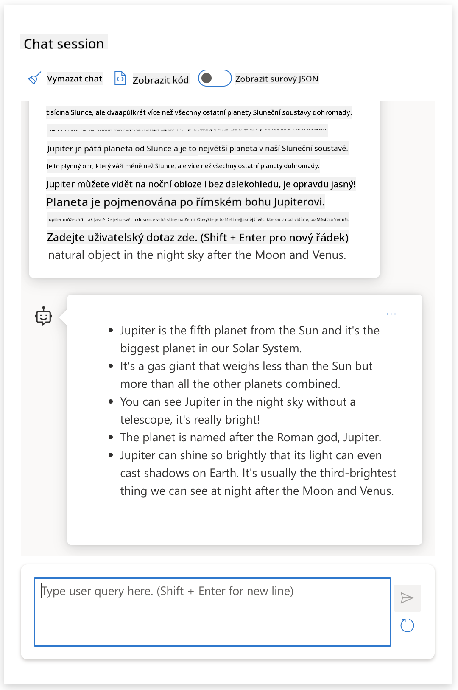
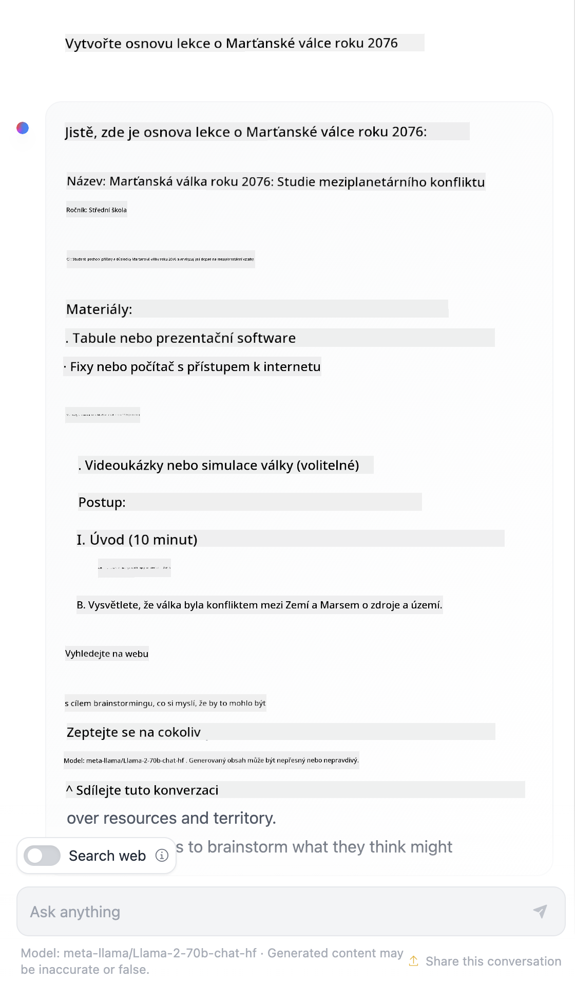

<!--
CO_OP_TRANSLATOR_METADATA:
{
  "original_hash": "8b3cb38518cf4fe7714d2f5e74dfa3eb",
  "translation_date": "2025-10-03T10:14:28+00:00",
  "source_file": "04-prompt-engineering-fundamentals/README.md",
  "language_code": "cs"
}
-->
# Základy návrhu promptů

[](https://aka.ms/gen-ai-lesson4-gh?WT.mc_id=academic-105485-koreyst)

## Úvod
Tento modul se zabývá základními koncepty a technikami pro vytváření efektivních promptů v generativních AI modelech. Způsob, jakým napíšete svůj prompt pro LLM, má také význam. PeÄlivÄ› vytvoÅ™ený prompt může dosáhnout lepší kvality odpovÄ›di. Ale co pÅ™esnÄ› znamenají pojmy jako _prompt_ a _návrh promptů_? A jak mohu zlepÅ¡it _vstupní prompt_, který posílám LLM? Na tyto otázky se pokusíme odpovÄ›dÄ›t v této kapitole a v následující.

_Generativní AI_ je schopna vytvářet nový obsah (např. text, obrázky, zvuk, kód atd.) na základě požadavků uživatele. Toho dosahuje pomocí _velkých jazykových modelů_ (Large Language Models) jako je série GPT ("Generative Pre-trained Transformer") od OpenAI, které jsou trénovány na práci s přirozeným jazykem a kódem.

Uživatelé nyní mohou s tÄ›mito modely komunikovat pomocí známých paradigmat, jako je chat, aniž by potÅ™ebovali technické znalosti nebo Å¡kolení. Modely jsou _založené na prompty_ – uživatelé posílají textový vstup (prompt) a dostávají zpÄ›t odpovÄ›Ä AI (completion). Mohou pak "chatovat s AI" iterativnÄ›, v konverzacích na více úrovních, upravovat svůj prompt, dokud odpovÄ›Ä neodpovídá jejich oÄekáváním.

"Prompty" se nyní stávají primárním _programovacím rozhraním_ pro aplikace generativní AI, které říkají modelům, co mají dělat, a ovlivňují kvalitu vrácených odpovědí. "Návrh promptů" je rychle rostoucí oblast studia, která se zaměřuje na _návrh a optimalizaci_ promptů, aby poskytovaly konzistentní a kvalitní odpovědi ve velkém měřítku.

## Cíle uÄení

V této lekci se nauÄíme, co je návrh promptů, proÄ je důležitý a jak můžeme vytvářet efektivnÄ›jší prompty pro daný model a cíle aplikace. Porozumíme základním konceptům a osvÄ›dÄeným postupům pro návrh promptů – a seznámíme se s interaktivním prostÅ™edím "sandbox" v Jupyter Notebooks, kde můžeme tyto koncepty aplikovat na skuteÄné příklady.

Na konci této lekce budeme schopni:

1. VysvÄ›tlit, co je návrh promptů a proÄ je důležitý.
2. Popsat komponenty promptu a jak se používají.
3. NauÄit se osvÄ›dÄené postupy a techniky pro návrh promptů.
4. Aplikovat nauÄené techniky na skuteÄné příklady pomocí OpenAI endpointu.

## KlíÄové pojmy

Návrh promptů: Praxe navrhování a zdokonalování vstupů, které vedou AI modely k produkci požadovaných výstupů.  
Tokenizace: Proces převodu textu na menší jednotky, nazývané tokeny, které model dokáže pochopit a zpracovat.  
LLM laděné na instrukce: Velké jazykové modely (LLMs), které byly doladěny pomocí specifických instrukcí pro zlepšení přesnosti a relevance odpovědí.

## Sandbox pro uÄení

Návrh promptů je v souÄasnosti spíše umÄ›ní než vÄ›da. Nejlepší způsob, jak zlepÅ¡it naÅ¡i intuici, je _více cviÄit_ a pÅ™ijmout přístup pokus-omyl, který kombinuje odborné znalosti v dané oblasti aplikace s doporuÄenými technikami a optimalizacemi specifickými pro model.

Jupyter Notebook, který doprovází tuto lekci, poskytuje prostÅ™edí _sandbox_, kde si můžete vyzkouÅ¡et, co se nauÄíte – buÄ průběžnÄ›, nebo jako souÄást závÄ›reÄné výzvy v kódu. K provedení cviÄení budete potÅ™ebovat:

1. **KlÃ­Ä API Azure OpenAI** – endpoint služby pro nasazený LLM.  
2. **Python Runtime** – ve kterém lze Notebook spustit.  
3. **Lokální promÄ›nné prostÅ™edí** – _dokonÄete kroky [SETUP](./../00-course-setup/02-setup-local.md?WT.mc_id=academic-105485-koreyst) nyní, abyste byli pÅ™ipraveni_.  

Notebook obsahuje _úvodní_ cviÄení – ale doporuÄujeme pÅ™idat vlastní sekce _Markdown_ (popis) a _Code_ (požadavky na prompt), abyste si mohli vyzkouÅ¡et více příkladů nebo nápadů – a budovat svou intuici pro návrh promptů.

## Ilustrovaný průvodce

Chcete získat celkový pÅ™ehled o tom, co tato lekce pokrývá, než se do ní ponoříte? Podívejte se na tento ilustrovaný průvodce, který vám poskytne pÅ™ehled hlavních témat a klíÄových poznatků, o kterých byste mÄ›li pÅ™emýšlet v každé Äásti. Plán lekce vás provede od pochopení základních konceptů a výzev k jejich Å™eÅ¡ení pomocí relevantních technik návrhu promptů a osvÄ›dÄených postupů. VÅ¡imnÄ›te si, že sekce "PokroÄilé techniky" v tomto průvodci odkazuje na obsah pokrytý v _další_ kapitole tohoto kurzu.


## Naše startupová mise

Nyní si povíme, jak _toto téma_ souvisí s naší startupovou misí [pÅ™inášet inovace AI do vzdÄ›lávání](https://educationblog.microsoft.com/2023/06/collaborating-to-bring-ai-innovation-to-education?WT.mc_id=academic-105485-koreyst). Chceme vytvářet aplikace pohánÄ›né AI pro _personalizované uÄení_ – takže se zamysleme nad tím, jak různí uživatelé naší aplikace mohou "navrhovat" prompty:

- **Administrátoři** mohou požádat AI, aby _analyzovala data kurikula a identifikovala mezery v pokrytí_. AI může výsledky shrnout nebo je vizualizovat pomocí kódu.  
- **UÄitelé** mohou požádat AI, aby _vytvoÅ™ila plán lekce pro cílové publikum a téma_. AI může vytvoÅ™it personalizovaný plán ve specifikovaném formátu.  
- **Studenti** mohou požádat AI, aby je _douÄovala v obtížném pÅ™edmÄ›tu_. AI může nyní studenty vést lekcemi, nápovÄ›dami a příklady pÅ™izpůsobenými jejich úrovni.  

To je jen Å¡piÄka ledovce. Podívejte se na [Prompty pro vzdÄ›lávání](https://github.com/microsoft/prompts-for-edu/tree/main?WT.mc_id=academic-105485-koreyst) – otevÅ™enou knihovnu promptů kurátorovanou odborníky na vzdÄ›lávání – abyste získali Å¡irší pÅ™edstavu o možnostech! _VyzkouÅ¡ejte nÄ›které z tÄ›chto promptů v sandboxu nebo pomocí OpenAI Playground a podívejte se, co se stane!_

<!--
Å ABLONA LEKCE:
Tato jednotka by měla pokrývat základní koncept #1.
Posilujte koncept pomocí příkladů a odkazů.

KONCEPT #1:
Návrh promptů.
Definujte ho a vysvÄ›tlete, proÄ je potÅ™eba.
-->

## Co je návrh promptů?

Tuto lekci jsme zaÄali definicí **návrhu promptů** jako procesu _navrhování a optimalizace_ textových vstupů (promptů) za úÄelem dosažení konzistentních a kvalitních odpovÄ›dí (completions) pro daný cíl aplikace a model. Můžeme si to pÅ™edstavit jako dvoustupňový proces:

- _navrhování_ poÄáteÄního promptu pro daný model a cíl  
- _zdokonalování_ promptu iterativnÄ› za úÄelem zlepÅ¡ení kvality odpovÄ›di  

Tento proces je nutnÄ› založen na pokusech a omylech, které vyžadují intuici uživatele a úsilí k dosažení optimálních výsledků. ProÄ je tedy důležitý? Abychom na tuto otázku odpovÄ›dÄ›li, musíme nejprve pochopit tÅ™i koncepty:

- _Tokenizace_ = jak model "vidí" prompt  
- _Základní LLM_ = jak základní model "zpracovává" prompt  
- _LLM laděné na instrukce_ = jak model nyní vidí "úkoly"  

### Tokenizace

LLM vidí prompty jako _sekvenci tokenů_, kde různé modely (nebo verze modelu) mohou tokenizovat stejný prompt různými způsoby. Protože LLM jsou trénovány na tokenech (a ne na surovém textu), způsob, jakým jsou prompty tokenizovány, má přímý dopad na kvalitu generované odpovědi.

Chcete-li získat intuici o tom, jak tokenizace funguje, vyzkouÅ¡ejte nástroje jako [OpenAI Tokenizer](https://platform.openai.com/tokenizer?WT.mc_id=academic-105485-koreyst) uvedený níže. Zkopírujte svůj prompt – a podívejte se, jak se pÅ™evádí na tokeny, pÅ™iÄemž vÄ›nujte pozornost tomu, jak jsou zpracovány znaky mezer a interpunkce. VÅ¡imnÄ›te si, že tento příklad ukazuje starší LLM (GPT-3) – takže vyzkouÅ¡ení tohoto s novÄ›jším modelem může pÅ™inést jiný výsledek.


### Koncept: Základní modely

Jakmile je prompt tokenizován, primární funkcí ["Základního LLM"](https://blog.gopenai.com/an-introduction-to-base-and-instruction-tuned-large-language-models-8de102c785a6?WT.mc_id=academic-105485-koreyst) (nebo základního modelu) je pÅ™edpovÄ›dÄ›t token v této sekvenci. Protože LLM jsou trénovány na obrovských textových datových sadách, mají dobrý pÅ™ehled o statistických vztazích mezi tokeny a mohou tuto pÅ™edpovÄ›Ä provést s urÄitou jistotou. VÅ¡imnÄ›te si, že nerozumí _významu_ slov v promptu nebo tokenu; vidí pouze vzor, který mohou "dokonÄit" svou další pÅ™edpovÄ›dí. Mohou pokraÄovat v pÅ™edpovídání sekvence, dokud je uživatel neukonÄí nebo dokud nenastane nÄ›jaká pÅ™edem stanovená podmínka.

Chcete vidÄ›t, jak funguje dokonÄování na základÄ› promptu? Zadejte výše uvedený prompt do [_Chat Playground_](https://oai.azure.com/playground?WT.mc_id=academic-105485-koreyst) v Azure OpenAI Studio s výchozím nastavením. Systém je nakonfigurován tak, aby prompty považoval za požadavky na informace – takže byste mÄ›li vidÄ›t dokonÄení, které odpovídá tomuto kontextu.

Ale co když uživatel chtěl vidět něco konkrétního, co splňuje nějaká kritéria nebo cíl úkolu? Zde přicházejí na scénu _LLM laděné na instrukce_.


### Koncept: LLM laděné na instrukce

[LLM ladÄ›né na instrukce](https://blog.gopenai.com/an-introduction-to-base-and-instruction-tuned-large-language-models-8de102c785a6?WT.mc_id=academic-105485-koreyst) zaÄíná základním modelem a doladí ho pomocí příkladů nebo párů vstup/výstup (napÅ™. vícenásobné "zprávy"), které mohou obsahovat jasné instrukce – a odpovÄ›Ä od AI se snaží tyto instrukce dodržet.

Používá techniky jako Reinforcement Learning with Human Feedback (RLHF), které mohou model nauÄit _dodržovat instrukce_ a _uÄit se z odezvy_, aby produkoval odpovÄ›di, které jsou lépe pÅ™izpůsobené praktickým aplikacím a více relevantní pro cíle uživatele.

Vyzkoušejme to – vraťte se k výše uvedenému promptu, ale nyní změňte _systémovou zprávu_, aby poskytla následující instrukci jako kontext:

> _Shrňte obsah, který vám byl poskytnut, pro žáka druhé třídy. Výsledek udržte na jednom odstavci s 3–5 odrážkami._

Vidíte, jak je výsledek nyní pÅ™izpůsoben tak, aby odrážel požadovaný cíl a formát? UÄitel může nyní tuto odpovÄ›Ä přímo použít ve svých prezentacích pro danou třídu.



## ProÄ potÅ™ebujeme návrh promptů?

Nyní, když víme, jak jsou prompty zpracovávány LLM, pojÄme si povÄ›dÄ›t, _proÄ_ potÅ™ebujeme návrh promptů. OdpovÄ›Ä spoÄívá v tom, že souÄasné LLM pÅ™edstavují Å™adu výzev, které Äiní _spolehlivé a konzistentní dokonÄení_ obtížnÄ›ji dosažitelným bez úsilí vÄ›novaného konstrukci a optimalizaci promptů. Například:

1. **OdpovÄ›di modelu jsou stochastické.** _Stejný prompt_ pravdÄ›podobnÄ› vyprodukuje různé odpovÄ›di s různými modely nebo verzemi modelů. A může dokonce produkovat různé výsledky se _stejným modelem_ v různých Äasech. _Techniky návrhu promptů nám mohou pomoci minimalizovat tyto variace tím, že poskytnou lepší mantinely_.  

1. **Modely mohou vytvářet smyÅ¡lené odpovÄ›di.** Modely jsou pÅ™edtrénovány na _velkých, ale koneÄných_ datových sadách, což znamená, že nemají znalosti o konceptech mimo tento tréninkový rozsah. Výsledkem je, že mohou produkovat dokonÄení, která jsou nepÅ™esná, smyÅ¡lená nebo přímo protichůdná známým faktům. _Techniky návrhu promptů pomáhají uživatelům identifikovat a zmírnit takové smyÅ¡lenky, napÅ™. tím, že požádají AI o citace nebo odůvodnÄ›ní_.  

1. **Schopnosti modelů se liší.** NovÄ›jší modely nebo generace modelů budou mít bohatší schopnosti, ale také pÅ™inesou jedineÄné zvláštnosti a kompromisy v nákladech a složitosti. _Návrh promptů nám může pomoci vyvinout osvÄ›dÄené postupy a pracovní postupy, které abstrahují rozdíly a pÅ™izpůsobují se požadavkům specifickým pro model Å¡kálovatelným a bezproblémovým způsobem_.  

Podívejme se na to v praxi v OpenAI nebo Azure OpenAI Playground:

- Použijte stejný prompt s různými nasazeními LLM (např. OpenAI, Azure OpenAI, Hugging Face) – viděli jste rozdíly?  
- Použijte stejný prompt opakovaně se _stejným_ nasazením LLM (např. Azure OpenAI Playground) – jak se tyto variace lišily?  

### Příklad smyšlenek

V tomto kurzu používáme termín **"smyÅ¡lenka"** k oznaÄení jevu, kdy LLM nÄ›kdy generují fakticky nesprávné informace kvůli omezením jejich tréninku nebo jiným omezením. Možná jste o tom slyÅ¡eli jako o _"halucinacích"_ v populárních Äláncích nebo výzkumných pracích. NicménÄ› důraznÄ› doporuÄujeme používat termín _"smyÅ¡lenka"_, abychom náhodnÄ› neantropomorfizovali chování tím, že bychom pÅ™isuzovali lidskou vlastnost výsledku řízenému strojem. To také posiluje [zásady odpovÄ›dné AI](https://www.microsoft.com/ai/responsible-ai?WT.mc_id=academic-105485-koreyst) z hlediska terminologie, odstraňuje termíny, které mohou být v nÄ›kterých kontextech považovány za urážlivé nebo nevhodné.

Chcete získ
Webové vyhledávání mi ukázalo, že existují fiktivní příběhy (např. televizní seriály nebo knihy) o válkách na Marsu – ale žádné z roku 2076. Zdravý rozum nám také říká, že rok 2076 je _v budoucnosti_ a tudíž nemůže být spojen s reálnou událostí.

Co se tedy stane, když tento dotaz zadáme různým poskytovatelům LLM?

> **OdpovÄ›Ä 1**: OpenAI Playground (GPT-35)


> **OdpovÄ›Ä 2**: Azure OpenAI Playground (GPT-35)


> **OdpovÄ›Ä 3**: Hugging Face Chat Playground (LLama-2)



Jak se dalo oÄekávat, každý model (nebo verze modelu) generuje mírnÄ› odliÅ¡né odpovÄ›di díky stochastickému chování a rozdílům ve schopnostech modelu. Například jeden model cílí na publikum osmého roÄníku, zatímco druhý pÅ™edpokládá studenty stÅ™ední Å¡koly. Ale vÅ¡echny tÅ™i modely vytvoÅ™ily odpovÄ›di, které by mohly pÅ™esvÄ›dÄit neinformovaného uživatele, že událost byla skuteÄná.

Techniky návrhu dotazů, jako je _metaprompting_ a _konfigurace teploty_, mohou do urÄité míry snížit výskyt smyÅ¡lených odpovÄ›dí modelu. Nové _architektury_ návrhu dotazů také bezproblémovÄ› zaÄleňují nové nástroje a techniky do toku dotazů, aby zmírnily nebo snížily nÄ›které z tÄ›chto efektů.

## Případová studie: GitHub Copilot

Tuto sekci zakonÄíme tím, že si udÄ›láme pÅ™edstavu o tom, jak se návrh dotazů používá v reálných Å™eÅ¡eních, a podíváme se na jednu případovou studii: [GitHub Copilot](https://github.com/features/copilot?WT.mc_id=academic-105485-koreyst).

GitHub Copilot je váš "AI programátorský partner" – pÅ™evádí textové dotazy na návrhy kódu a je integrován do vaÅ¡eho vývojového prostÅ™edí (napÅ™. Visual Studio Code) pro bezproblémový uživatelský zážitek. Jak je zdokumentováno v sérii níže uvedených blogů, nejranÄ›jší verze byla založena na modelu OpenAI Codex – pÅ™iÄemž inženýři rychle zjistili potÅ™ebu model doladit a vyvinout lepší techniky návrhu dotazů, aby se zlepÅ¡ila kvalita kódu. V Äervenci [pÅ™edstavili vylepÅ¡ený AI model, který jde nad rámec Codexu](https://github.blog/2023-07-28-smarter-more-efficient-coding-github-copilot-goes-beyond-codex-with-improved-ai-model/?WT.mc_id=academic-105485-koreyst) pro jeÅ¡tÄ› rychlejší návrhy.

ÄŒtÄ›te příspÄ›vky v poÅ™adí, abyste sledovali jejich cestu uÄení.

- **Květen 2023** | [GitHub Copilot se zlepšuje v porozumění vašemu kódu](https://github.blog/2023-05-17-how-github-copilot-is-getting-better-at-understanding-your-code/?WT.mc_id=academic-105485-koreyst)
- **Květen 2023** | [Uvnitř GitHubu: Práce s LLM za GitHub Copilot](https://github.blog/2023-05-17-inside-github-working-with-the-llms-behind-github-copilot/?WT.mc_id=academic-105485-koreyst).
- **Červen 2023** | [Jak psát lepší dotazy pro GitHub Copilot](https://github.blog/2023-06-20-how-to-write-better-prompts-for-github-copilot/?WT.mc_id=academic-105485-koreyst).
- **Červenec 2023** | [.. GitHub Copilot jde nad rámec Codexu s vylepšeným AI modelem](https://github.blog/2023-07-28-smarter-more-efficient-coding-github-copilot-goes-beyond-codex-with-improved-ai-model/?WT.mc_id=academic-105485-koreyst)
- **Červenec 2023** | [Průvodce návrhem dotazů a LLM pro vývojáře](https://github.blog/2023-07-17-prompt-engineering-guide-generative-ai-llms/?WT.mc_id=academic-105485-koreyst)
- **Září 2023** | [Jak vytvořit podnikovou aplikaci s LLM: Lekce z GitHub Copilot](https://github.blog/2023-09-06-how-to-build-an-enterprise-llm-application-lessons-from-github-copilot/?WT.mc_id=academic-105485-koreyst)

Můžete také procházet jejich [Engineering blog](https://github.blog/category/engineering/?WT.mc_id=academic-105485-koreyst) pro další příspěvky, jako je [tento](https://github.blog/2023-09-27-how-i-used-github-copilot-chat-to-build-a-reactjs-gallery-prototype/?WT.mc_id=academic-105485-koreyst), který ukazuje, jak jsou tyto modely a techniky _aplikovány_ pro pohon reálných aplikací.

---

<!--
Å ABLONA LEKCE:
Tato jednotka by měla pokrývat základní koncept #2.
Posílit koncept pomocí příkladů a odkazů.

KONCEPT #2:
Návrh dotazů.
Ilustrováno na příkladech.
-->

## Konstrukce dotazů

VidÄ›li jsme, proÄ je návrh dotazů důležitý – nyní pochopíme, jak jsou dotazy _konstruovány_, abychom mohli vyhodnotit různé techniky pro efektivnÄ›jší návrh dotazů.

### Základní dotaz

ZaÄnÄ›me základním dotazem: textový vstup zaslaný modelu bez dalšího kontextu. Zde je příklad – když poÅ¡leme prvních pár slov americké národní hymny do OpenAI [Completion API](https://platform.openai.com/docs/api-reference/completions?WT.mc_id=academic-105485-koreyst), okamžitÄ› _dokonÄí_ odpovÄ›Ä dalšími řádky, což ilustruje základní predikÄní chování.

| Dotaz (Vstup)     | DokonÄení (Výstup)                                                                                                                        |
| :---------------- | :----------------------------------------------------------------------------------------------------------------------------------------- |
| Oh say can you see | Zdá se, že zaÄínáte text písnÄ› "The Star-Spangled Banner", národní hymny Spojených států. Celý text je ... |

### Komplexní dotaz

Nyní přidáme kontext a instrukce k základnímu dotazu. [Chat Completion API](https://learn.microsoft.com/azure/ai-services/openai/how-to/chatgpt?WT.mc_id=academic-105485-koreyst) nám umožňuje vytvořit komplexní dotaz jako kolekci _zpráv_ s:

- Páry vstup/výstup odrážející _uživatelský_ vstup a _odpovÄ›Ä asistenta_.
- Systémovou zprávou nastavující kontext pro chování nebo osobnost asistenta.

Požadavek je nyní ve formÄ› níže, kde _tokenizace_ efektivnÄ› zachycuje relevantní informace z kontextu a konverzace. ZmÄ›na systémového kontextu může mít stejnÄ› velký dopad na kvalitu dokonÄení jako poskytnuté uživatelské vstupy.

```python
response = openai.chat.completions.create(
    model="gpt-3.5-turbo",
    messages=[
        {"role": "system", "content": "You are a helpful assistant."},
        {"role": "user", "content": "Who won the world series in 2020?"},
        {"role": "assistant", "content": "The Los Angeles Dodgers won the World Series in 2020."},
        {"role": "user", "content": "Where was it played?"}
    ]
)
```

### InstrukÄní dotaz

V pÅ™edchozích příkladech byl uživatelský dotaz jednoduchým textovým dotazem, který lze interpretovat jako žádost o informace. U _instrukÄních_ dotazů můžeme tento text použít k podrobnÄ›jšímu specifikování úkolu, Äímž poskytneme AI lepší vedení. Zde je příklad:

| Dotaz (Vstup)                                                                                                                                                                                                                         | DokonÄení (Výstup)                                                                                                        | Typ instrukce       |
| :------------------------------------------------------------------------------------------------------------------------------------------------------------------------------------------------------------------------------------- | :------------------------------------------------------------------------------------------------------------------------- | :------------------ |
| NapiÅ¡te popis obÄanské války                                                                                                                                                                                                           | _vrácen jednoduchý odstavec_                                                                                              | Jednoduchý          |
| NapiÅ¡te popis obÄanské války. UveÄte klíÄová data a události a popiÅ¡te jejich význam                                                                                                                                                    | _vrácen odstavec následovaný seznamem klíÄových dat událostí s popisy_                                                    | Komplexní           |
| NapiÅ¡te popis obÄanské války v 1 odstavci. UveÄte 3 odrážky s klíÄovými daty a jejich významem. UveÄte další 3 odrážky s klíÄovými historickými osobnostmi a jejich přínosy. Výstup vraÅ¥te jako JSON soubor                              | _vráceny rozsáhlejší detaily v textovém poli, formátované jako JSON, který můžete zkopírovat do souboru a ověřit podle potÅ™eby_ | Komplexní. Formátovaný. |

## Primární obsah

V pÅ™edchozích příkladech byl dotaz stále pomÄ›rnÄ› otevÅ™ený, což umožnilo LLM rozhodnout, která Äást jeho pÅ™edtrénovaného datasetu je relevantní. S návrhovým vzorem _primárního obsahu_ je vstupní text rozdÄ›len na dvÄ› Äásti:

- instrukci (akci)
- relevantní obsah (který ovlivňuje akci)

Zde je příklad, kde instrukce zní "shrňte to ve 2 větách".

| Dotaz (Vstup)                                                                                                                                                                                                                                                                                                                                                                                                                                                                                                                                                                                                                                                                                      | DokonÄení (Výstup)                                                                                                                                                                                                                                                                             |
| :-------------------------------------------------------------------------------------------------------------------------------------------------------------------------------------------------------------------------------------------------------------------------------------------------------------------------------------------------------------------------------------------------------------------------------------------------------------------------------------------------------------------------------------------------------------------------------------------------------------------------------------------------------------------------------------------------- | :---------------------------------------------------------------------------------------------------------------------------------------------------------------------------------------------------------------------------------------------------------------------------------------------- |
| Jupiter je pátou planetou od Slunce a nejvÄ›tší v naší SluneÄní soustavÄ›. Je to plynný obr s hmotností tisíciny hmotnosti Slunce, ale dvakrát a půl vÄ›tší než vÅ¡echny ostatní planety SluneÄní soustavy dohromady. Jupiter je jedním z nejjasnÄ›jších objektů viditelných pouhým okem na noÄní obloze a je znám starovÄ›kým civilizacím již od dob pÅ™ed zaznamenanou historií. Je pojmenován po římském bohu Jupiterovi.[19] PÅ™i pohledu ze ZemÄ› může být Jupiter dostateÄnÄ› jasný, aby jeho odražené svÄ›tlo vrhalo viditelné stíny,[20] a je průmÄ›rnÄ› tÅ™etím nejjasnÄ›jším přírodním objektem na noÄní obloze po MÄ›síci a VenuÅ¡i. <br/> **Shrňte to ve 2 krátkých vÄ›tách** | Jupiter, pátá planeta od Slunce, je nejvÄ›tší ve SluneÄní soustavÄ› a je známý jako jeden z nejjasnÄ›jších objektů na noÄní obloze. Pojmenovaný po římském bohu Jupiterovi, je to plynný obr, jehož hmotnost je dvakrát a půl vÄ›tší než hmotnost vÅ¡ech ostatních planet dohromady. |

Segment primárního obsahu lze použít různými způsoby k efektivnějšímu řízení instrukcí:

- **Příklady** – místo toho, abychom modelu explicitně říkali, co má dělat, poskytneme mu příklady požadovaného výstupu a necháme ho odvodit vzor.
- **NápovÄ›dy** – následujte instrukci "nápovÄ›dou", která navede dokonÄení, Äímž model nasmÄ›rujete k relevantnÄ›jším odpovÄ›dím.
- **Šablony** – jedná se o opakovatelné "recepty" pro dotazy s místy pro proměnné, které lze přizpůsobit daty pro konkrétní použití.

PojÄme si tyto techniky prozkoumat v praxi.

### Použití příkladů

Toto je přístup, pÅ™i kterém použijete primární obsah k "nakrmení modelu" nÄ›kolika příklady požadovaného výstupu pro danou instrukci a necháte ho odvodit vzor požadovaného výstupu. Na základÄ› poÄtu poskytnutých příkladů můžeme mít zero-shot prompting, one-shot prompting, few-shot prompting atd.

Dotaz nyní obsahuje tři komponenty:

- Popis úkolu
- Několik příkladů požadovaného výstupu
- ZaÄátek nového příkladu (který se stává implicitním popisem úkolu)

| Typ uÄení | Dotaz (Vstup)                                                                                                                                        | DokonÄení (Výstup)         |
| :-------- | :---------------------------------------------------------------------------------------------------------------------------------------------------- | :-------------------------- |
| Zero-shot | "The Sun is Shining". Přeložte do španělštiny                                                                                                         | "El Sol está brillando".    |
| One-shot  | "The Sun is Shining" => ""El Sol está brillando". <br> "It's a Cold and Windy Day" =>                                                                 | "Es un día frío y ventoso". |
| Few-shot  | HrÃ¡Ä obÄ›hl mety => Baseball <br/> HrÃ¡Ä zahrál eso => Tenis <br/> HrÃ¡Ä dal Å¡estku => Kriket <br/> HrÃ¡Ä dal smeÄ =>                                     | Basketbal                   |
|           |                                                                                                                                                       |                             |

Všimněte si, že jsme museli poskytnout explicitní instrukci ("Přeložte do španělštiny") v zero-shot promptingu, ale v příkladu one-shot promptingu se to odvodí. Příklad few-shot ukazuje, jak přidání více příkladů umožňuje modelům dělat přesnější závěry bez dalších instrukcí.

### Nápovědy v dotazech

Další technikou využití primárního obsahu je poskytnutí _nápovÄ›d_ místo příkladů. V tomto případÄ› dáváme modelu náznak správného smÄ›ru tím, že ho _nastartujeme_ úryvkem, který odráží požadovaný formát odpovÄ›di. Model pak "pÅ™evezme nápovÄ›du" a pokraÄuje v tomto duchu.

| PoÄet nápovÄ›d | Dotaz (Vstup)                                                                                                                                                                                                                                                                                                                                                                                                                                               | DokonÄení (Výstup)                                                                                                                                                                                                                                                                                       |
| :------------ | :----------------------------------------------------------------------------------------------------------------------------------------------------------------------------------------------------------------------------------------------------------------------------------------------------------------------------------------------------------------------------------------------------------------------------------------------------------- | :-------------------------------------------------------------------------------------------------------------------------------------------------------------------------------------------------------------------------------------------------------------------------------------------------------- |
| 0             | Jupiter je pátou planetou od Slunce a nejvÄ›tší v naší SluneÄní soustavÄ›. Je to plynný obr s hmotností tisíciny hmotnosti Slunce, ale dvakrát a půl vÄ›tší než vÅ¡echny ostatní planety SluneÄní soustavy dohromady. Jupiter je jedním z nejjasnÄ›jších objektů viditelných pouhým okem na noÄní obloze a je znám starovÄ›kým civilizacím již od dob pÅ™ed zaznamenanou historií. <br/>**Shrňte to**                                       | Jupiter je nejvÄ›tší planeta ve SluneÄní soustavÄ› a pátá od Slunce. Je to plynný obr, jehož hmotnost je 1/1000 hmotnosti Slunce, ale je těžší než vÅ¡echny ostatní planety dohromady. StarovÄ›ké civilizace o Jupiteru vÄ›dÄ›ly již dávno a je snadno viditelný na noÄní obloze. |
| 1              | Jupiter je pátá planeta od Slunce a nejvÄ›tší v naší SluneÄní soustavÄ›. Je to plynný obr s hmotností tisíciny hmotnosti Slunce, ale dva a půlkrát vÄ›tší než vÅ¡echny ostatní planety dohromady. Jupiter je jedním z nejjasnÄ›jších objektů viditelných pouhým okem na noÄní obloze a byl znám starovÄ›kým civilizacím již pÅ™ed zaznamenanou historií. <br/>**Shrnutí** <br/> Zjistili jsme, že Jupiter | je pátá planeta od Slunce a nejvÄ›tší v naší SluneÄní soustavÄ›. Je to plynný obr s hmotností tisíciny hmotnosti Slunce, ale dva a půlkrát vÄ›tší než vÅ¡echny ostatní planety dohromady. Je snadno viditelný pouhým okem a byl znám již od starovÄ›ku.                        |
| 2              | Jupiter je pátá planeta od Slunce a nejvÄ›tší v naší SluneÄní soustavÄ›. Je to plynný obr s hmotností tisíciny hmotnosti Slunce, ale dva a půlkrát vÄ›tší než vÅ¡echny ostatní planety dohromady. Jupiter je jedním z nejjasnÄ›jších objektů viditelných pouhým okem na noÄní obloze a byl znám starovÄ›kým civilizacím již pÅ™ed zaznamenanou historií. <br/>**Shrnutí** <br/> Top 3 fakta, která jsme zjistili:         | 1. Jupiter je pátá planeta od Slunce a nejvÄ›tší v naší SluneÄní soustavÄ›. <br/> 2. Je to plynný obr s hmotností tisíciny hmotnosti Slunce...<br/> 3. Jupiter byl viditelný pouhým okem již od starovÄ›ku ...                                                                       |
|                |                                                                                                                                                                                                                                                                                                                                                                                                                                                              |                                                                                                                                                                                                                                                                                                           |

### Šablony pro zadání

Šablona zadání je _předem definovaný recept na zadání_, který lze uložit a znovu použít podle potřeby, aby bylo možné dosáhnout konzistentnějších uživatelských zkušeností ve velkém měřítku. V nejjednodušší podobě je to jednoduše sbírka příkladů zadání, jako [tento od OpenAI](https://platform.openai.com/examples?WT.mc_id=academic-105485-koreyst), která poskytuje interaktivní komponenty zadání (zprávy uživatele a systému) a formát požadavku řízený API - pro podporu opakovaného použití.

V jeho složitější podobě, jako [tento příklad od LangChain](https://python.langchain.com/docs/concepts/prompt_templates/?WT.mc_id=academic-105485-koreyst), obsahuje _zástupné symboly_, které lze nahradit daty z různých zdrojů (uživatelský vstup, systémový kontext, externí datové zdroje atd.) pro dynamické generování zadání. To nám umožňuje vytvořit knihovnu opakovaně použitelných zadání, která lze použít k programovému dosažení konzistentních uživatelských zkušeností ve velkém měřítku.

Nakonec skuteÄná hodnota Å¡ablon spoÄívá ve schopnosti vytvářet a publikovat _knihovny zadání_ pro vertikální aplikaÄní domény - kde je Å¡ablona zadání nyní _optimalizována_ tak, aby odrážela aplikaÄnÄ› specifický kontext nebo příklady, které Äiní odpovÄ›di relevantnÄ›jšími a pÅ™esnÄ›jšími pro cílové uživatelské publikum. Repozitář [Prompts For Edu](https://github.com/microsoft/prompts-for-edu?WT.mc_id=academic-105485-koreyst) je skvÄ›lým příkladem tohoto přístupu, který kurátoruje knihovnu zadání pro vzdÄ›lávací doménu s důrazem na klíÄové cíle, jako je plánování lekcí, návrh uÄebních osnov, douÄování studentů atd.

## Podpůrný obsah

Pokud uvažujeme o konstrukci zadání jako o kombinaci instrukce (úkolu) a cíle (primárního obsahu), pak _sekundární obsah_ je jako další kontext, který poskytujeme, aby **ovlivnil výstup nÄ›jakým způsobem**. Mohou to být parametry ladÄ›ní, pokyny k formátování, taxonomie témat atd., které mohou modelu pomoci _pÅ™izpůsobit_ jeho odpovÄ›Ä tak, aby vyhovovala požadovaným uživatelským cílům nebo oÄekáváním.

Například: Vzhledem k katalogu kurzů s rozsáhlými metadaty (název, popis, úroveň, metadata, instruktor atd.) o vÅ¡ech dostupných kurzech v uÄebních osnovách:

- můžeme definovat instrukci â€shrňte katalog kurzů pro podzim 2023“
- můžeme použít primární obsah k poskytnutí několika příkladů požadovaného výstupu
- můžeme použít sekundární obsah k identifikaci 5 nejdůležitÄ›jších â€tagů“.

Nyní může model poskytnout shrnutí ve formátu ukázaném několika příklady - ale pokud má výsledek více tagů, může upřednostnit 5 tagů identifikovaných v sekundárním obsahu.

---

<!--
Å ABLONA LEKCE:
Tato jednotka by měla pokrýt základní koncept #1.
Posilněte koncept pomocí příkladů a odkazů.

KONCEPT #3:
Techniky pro tvorbu zadání.
Jaké jsou základní techniky pro tvorbu zadání?
Ilustrujte je pomocí cviÄení.
-->

## Nejlepší postupy pro tvorbu zadání

Nyní, když víme, jak lze zadání _konstruovat_, můžeme zaÄít pÅ™emýšlet o tom, jak je _navrhnout_, aby odrážela nejlepší postupy. Můžeme o tom pÅ™emýšlet ve dvou Äástech - mít správný _přístup_ a aplikovat správné _techniky_.

### Přístup k tvorbě zadání

Tvorba zadání je proces pokusů a omylů, takže mějte na paměti tři široké vodítka:

1. **Porozumění doméně je důležité.** Přesnost a relevance odpovědí závisí na _doméně_, ve které aplikace nebo uživatel operuje. Použijte svou intuici a odborné znalosti v dané doméně k **dalšímu přizpůsobení technik**. Například definujte _osobnosti specifické pro doménu_ ve svých systémových zadáních nebo použijte _šablony specifické pro doménu_ ve svých uživatelských zadáních. Poskytněte sekundární obsah, který odráží kontext specifický pro doménu, nebo použijte _narážky a příklady specifické pro doménu_, aby model směřoval k známým vzorcům použití.

2. **PorozumÄ›ní modelu je důležité.** Víme, že modely jsou ze své podstaty stochastické. Implementace modelů se vÅ¡ak mohou liÅ¡it z hlediska datových sad, které používají (pÅ™edem nauÄené znalosti), schopností, které poskytují (napÅ™. prostÅ™ednictvím API nebo SDK), a typu obsahu, pro který jsou optimalizovány (napÅ™. kód vs. obrázky vs. text). PorozumÄ›jte silným stránkám a omezením modelu, který používáte, a použijte tyto znalosti k _prioritizaci úkolů_ nebo vytvoÅ™ení _pÅ™izpůsobených Å¡ablon_, které jsou optimalizovány pro schopnosti modelu.

3. **Iterace a validace jsou důležité.** Modely se rychle vyvíjejí, stejnÄ› jako techniky pro tvorbu zadání. Jako odborník na danou doménu můžete mít jiný kontext nebo kritéria _vaší_ konkrétní aplikace, která nemusí platit pro Å¡irší komunitu. Použijte nástroje a techniky pro tvorbu zadání k â€nastartování“ konstrukce zadání, poté iterujte a validujte výsledky pomocí své vlastní intuice a odborných znalostí v dané doménÄ›. Zaznamenejte své poznatky a vytvoÅ™te **databázi znalostí** (napÅ™. knihovny zadání), kterou mohou ostatní použít jako nový základ pro rychlejší iterace v budoucnu.

## Nejlepší postupy

Nyní se podívejme na běžné nejlepší postupy doporuÄené odborníky z [OpenAI](https://help.openai.com/en/articles/6654000-best-practices-for-prompt-engineering-with-openai-api?WT.mc_id=academic-105485-koreyst) a [Azure OpenAI](https://learn.microsoft.com/azure/ai-services/openai/concepts/prompt-engineering#best-practices?WT.mc_id=academic-105485-koreyst).

| Co                               | ProÄ                                                                                                                                                                                                                                               |
| :------------------------------- | :-------------------------------------------------------------------------------------------------------------------------------------------------------------------------------------------------------------------------------------------------- |
| Hodnoťte nejnovější modely.      | Nové generace modelů pravděpodobně mají vylepšené funkce a kvalitu - ale mohou také přinést vyšší náklady. Zhodnoťte jejich dopad a poté se rozhodněte o migraci.                                                                                  |
| OddÄ›lte instrukce a kontext.     | Zkontrolujte, zda váš model/poskytovatel definuje _oddÄ›lovaÄe_ pro jasnÄ›jší rozliÅ¡ení instrukcí, primárního a sekundárního obsahu. To může modelům pomoci pÅ™esnÄ›ji pÅ™iÅ™adit váhy tokenům.                                                             |
| BuÄte konkrétní a jasní.         | PoskytnÄ›te více detailů o požadovaném kontextu, výsledku, délce, formátu, stylu atd. To zlepší kvalitu i konzistenci odpovÄ›dí. ZachyÅ¥te recepty v opakovanÄ› použitelných Å¡ablonách.                                                                  |
| BuÄte popisní, používejte příklady. | Modely mohou lépe reagovat na přístup â€ukaž a vysvÄ›tli“. ZaÄnÄ›te s přístupem `zero-shot`, kde zadáte instrukci (ale žádné příklady), poté zkuste `few-shot` jako vylepÅ¡ení, poskytnutím nÄ›kolika příkladů požadovaného výstupu. Používejte analogie. |
| Používejte narážky k nastartování odpovÄ›dí. | Směřujte model k požadovanému výsledku tím, že mu poskytnete nÄ›kolik úvodních slov nebo frází, které může použít jako výchozí bod pro odpovÄ›Ä.                                                                                                   |
| Opakujte.                        | Někdy je potřeba modelu zopakovat instrukce. Poskytněte instrukce před i po primárním obsahu, použijte instrukci a narážku atd. Iterujte a validujte, co funguje.                                                                                   |
| PoÅ™adí je důležité.              | PoÅ™adí, ve kterém modelu prezentujete informace, může ovlivnit výstup, dokonce i v uÄebních příkladech, díky efektu nedávnosti. VyzkouÅ¡ejte různé možnosti, abyste zjistili, co funguje nejlépe.                                                     |
| Dejte modelu â€Ãºnik“.             | PoskytnÄ›te modelu _záložní_ odpovÄ›Ä, kterou může poskytnout, pokud z nÄ›jakého důvodu nemůže úkol dokonÄit. To může snížit pravdÄ›podobnost, že model vygeneruje faleÅ¡né nebo smyÅ¡lené odpovÄ›di.                                                     |
|                                 |                                                                                                                                                                                                                                                   |

Stejně jako u jakéhokoli nejlepšího postupu mějte na paměti, že _vaše zkušenosti se mohou lišit_ v závislosti na modelu, úkolu a doméně. Použijte tyto postupy jako výchozí bod a iterujte, abyste zjistili, co funguje nejlépe pro vás. Neustále přehodnocujte svůj proces tvorby zadání, jakmile budou k dispozici nové modely a nástroje, s důrazem na škálovatelnost procesu a kvalitu odpovědí.

<!--
Å ABLONA LEKCE:
Tato jednotka by měla obsahovat výzvu kódování, pokud je to relevantní.

VÃZVA:
Odkaz na Jupyter Notebook pouze s komentáři v instrukcích (sekce kódu jsou prázdné).

ŘEÅ ENÃ:
Odkaz na kopii tohoto Notebooku s vyplněnými a spuštěnými zadáními, ukazující jeden příklad.
-->

## Zadání

Gratulujeme! Dostali jste se na konec lekce! Je Äas vyzkouÅ¡et nÄ›které z tÄ›chto konceptů a technik na skuteÄných příkladech!

Pro naÅ¡e zadání budeme používat Jupyter Notebook s cviÄeními, která můžete interaktivnÄ› dokonÄit. Notebook můžete také rozšířit o vlastní buňky Markdown a Code, abyste mohli sami prozkoumat nápady a techniky.

### ZaÄnÄ›te tím, že si repo forkujete, poté

- (DoporuÄeno) SpusÅ¥te GitHub Codespaces
- (Alternativně) Klonujte repo na své lokální zařízení a použijte ho s Docker Desktop
- (Alternativně) Otevřete Notebook ve svém preferovaném prostředí pro běh Notebooků.

### Dále nastavte své proměnné prostředí

- Zkopírujte soubor `.env.copy` v kořenovém adresáři repozitáře na `.env` a vyplňte hodnoty `AZURE_OPENAI_API_KEY`, `AZURE_OPENAI_ENDPOINT` a `AZURE_OPENAI_DEPLOYMENT`. Vraťte se do sekce [Learning Sandbox](../../../04-prompt-engineering-fundamentals/04-prompt-engineering-fundamentals), abyste se dozvěděli více.

### Poté otevřete Jupyter Notebook

- Vyberte runtime kernel. Pokud používáte možnosti 1 nebo 2, jednoduše vyberte výchozí kernel Python 3.10.x poskytovaný vývojovým kontejnerem.

VÅ¡e je pÅ™ipraveno k spuÅ¡tÄ›ní cviÄení. VÅ¡imnÄ›te si, že zde nejsou _správné a Å¡patné_ odpovÄ›di - jde jen o zkoumání možností metodou pokusů a omylů a budování intuice pro to, co funguje pro daný model a aplikaÄní doménu.

_Z tohoto důvodu v této lekci nejsou segmenty Å™eÅ¡ení kódu. Místo toho bude Notebook obsahovat buňky Markdown nazvané â€Moje Å™eÅ¡ení:“, které ukazují jeden příklad výstupu pro referenci._

 <!--
Å ABLONA LEKCE:
UzavÅ™ete sekci shrnutím a zdroji pro samostatné uÄení.
-->

## Kontrola znalostí

Které z následujících zadání je dobré podle rozumných nejlepších postupů?

1. Ukaž mi obrázek Äerveného auta
2. Ukaž mi obrázek Äerveného auta znaÄky Volvo a modelu XC90 zaparkovaného u útesu pÅ™i západu slunce
3. Ukaž mi obrázek Äerveného auta znaÄky Volvo a modelu XC90

OdpovÄ›Ä: 2, je to nejlepší zadání, protože poskytuje detaily o â€Äem“ a jde do specifik (ne jen jakékoliv auto, ale konkrétní znaÄka a model) a také popisuje celkové prostÅ™edí. 3 je další nejlepší, protože také obsahuje hodnÄ› popisu.

## 🚀 Výzva

Zkuste využít techniku â€narážky“ s zadáním: DokonÄete vÄ›tu â€Ukaž mi obrázek Äerveného auta znaÄky Volvo a “. Co vám model odpoví a jak byste to vylepÅ¡ili?

## SkvÄ›lá práce! PokraÄujte ve svém uÄení

Chcete se dozvÄ›dÄ›t více o různých konceptech tvorby zadání? NavÅ¡tivte [stránku pokraÄujícího uÄení](https://aka.ms/genai-collection?WT.mc_id=academic-105485-koreyst), kde najdete další skvÄ›lé zdroje na toto téma.

PÅ™ejdÄ›te na Lekci 5, kde se podíváme na [pokroÄilé techniky zadávání](../05-advanced-prompts/README.md?WT.mc_id=academic-105485-koreyst)!

---

**Prohlášení**:  
Tento dokument byl pÅ™eložen pomocí služby AI pro pÅ™eklady [Co-op Translator](https://github.com/Azure/co-op-translator). I když se snažíme o pÅ™esnost, mÄ›jte prosím na pamÄ›ti, že automatizované pÅ™eklady mohou obsahovat chyby nebo nepÅ™esnosti. Původní dokument v jeho rodném jazyce by mÄ›l být považován za autoritativní zdroj. Pro důležité informace se doporuÄuje profesionální lidský pÅ™eklad. Neodpovídáme za žádná nedorozumÄ›ní nebo nesprávné interpretace vyplývající z použití tohoto pÅ™ekladu.