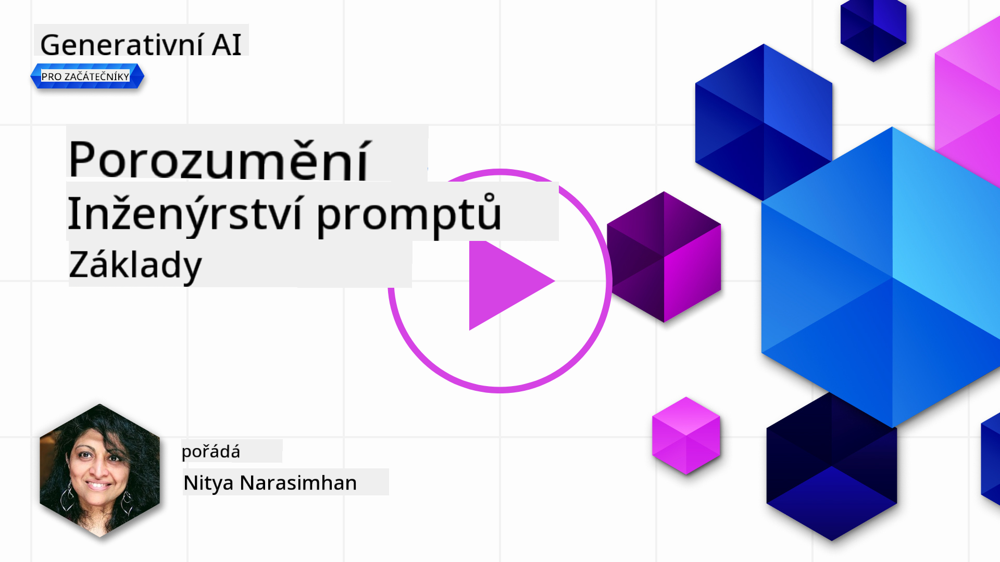
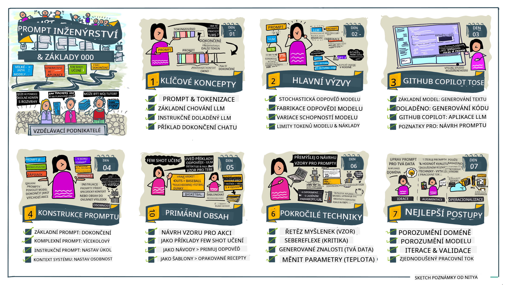

<!--
CO_OP_TRANSLATOR_METADATA:
{
  "original_hash": "dcbaaae026cb50fee071e690685b5843",
  "translation_date": "2025-08-26T19:00:11+00:00",
  "source_file": "04-prompt-engineering-fundamentals/README.md",
  "language_code": "cs"
}
-->
# Základy Prompt Engineeringu

[](https://aka.ms/gen-ai-lesson4-gh?WT.mc_id=academic-105485-koreyst)

## Úvod
Tento modul se vÄ›nuje klíÄovým pojmům a technikám pro vytváření efektivních promptů v generativních AI modelech. Záleží i na tom, jak svůj prompt pro LLM napíšete. PeÄlivÄ› sestavený prompt může vést k lepší kvalitÄ› odpovÄ›di. Ale co vlastnÄ› znamenají pojmy jako _prompt_ a _prompt engineering_? A jak mohu vylepÅ¡it _vstupní prompt_, který posílám LLM? Na tyto otázky se pokusíme odpovÄ›dÄ›t v této a následující kapitole.

_Generativní AI_ dokáže vytvářet nový obsah (např. text, obrázky, zvuk, kód atd.) na základě požadavků uživatele. Toho dosahuje pomocí _velkých jazykových modelů_ jako je série GPT ("Generative Pre-trained Transformer") od OpenAI, které jsou trénovány na práci s přirozeným jazykem a kódem.

Uživatelé nyní mohou s tÄ›mito modely komunikovat pomocí známých rozhraní, například chatu, aniž by potÅ™ebovali technické znalosti nebo Å¡kolení. Modely jsou _prompt-based_ – uživatel odeÅ¡le textový vstup (prompt) a obdrží odpovÄ›Ä AI (completion). Poté může s AI vést iterativní konverzaci, postupnÄ› upravovat prompt, dokud odpovÄ›Ä neodpovídá jeho oÄekávání.

"Prompt" se tak stává hlavním _programovacím rozhraním_ pro generativní AI aplikace, urÄuje, co mají modely dÄ›lat, a ovlivňuje kvalitu jejich odpovÄ›dí. "Prompt Engineering" je rychle rostoucí obor, který se zaměřuje na _návrh a optimalizaci_ promptů, aby poskytovaly konzistentní a kvalitní odpovÄ›di ve velkém měřítku.

## Cíle lekce

V této lekci se dozvíme, co je Prompt Engineering, proÄ je důležitý a jak můžeme vytvářet efektivnÄ›jší prompty pro konkrétní model a cíle aplikace. Seznámíme se se základními pojmy a osvÄ›dÄenými postupy pro prompt engineering – a poznáme interaktivní prostÅ™edí Jupyter Notebooks "sandbox", kde si tyto koncepty vyzkoušíme na reálných příkladech.

Na konci této lekce budeme schopni:

1. VysvÄ›tlit, co je prompt engineering a proÄ je důležitý.
2. Popsat, z Äeho se prompt skládá a jak se používá.
3. NauÄit se osvÄ›dÄené postupy a techniky pro prompt engineering.
4. Použít nauÄené techniky na reálných příkladech pomocí OpenAI endpointu.

## KlíÄové pojmy

Prompt Engineering: Praxe navrhování a vylepšování vstupů, které vedou AI modely k požadovaným výstupům.
Tokenizace: Proces převodu textu na menší jednotky, tzv. tokeny, které model dokáže zpracovat a pochopit.
Instruction-Tuned LLMs: Velké jazykové modely (LLMs), které byly doladěny pomocí konkrétních instrukcí, aby jejich odpovědi byly přesnější a relevantnější.

## UÄební sandbox

Prompt engineering je zatím spíše umÄ›ní než vÄ›da. Nejlepší způsob, jak si na nÄ›j vybudovat cit, je _hodnÄ› trénovat_ a zkouÅ¡et různé přístupy, které kombinují znalosti z oboru s doporuÄenými technikami a optimalizacemi pro konkrétní model.

Jupyter Notebook, který tuto lekci doprovází, nabízí _sandbox_ prostÅ™edí, kde si můžete vÅ¡e vyzkouÅ¡et – buÄ průběžnÄ›, nebo v rámci závÄ›reÄné výzvy. K provedení cviÄení budete potÅ™ebovat:

1. **Azure OpenAI API klíÄ** – endpoint služby pro nasazený LLM.
2. **Python runtime** – prostředí, ve kterém lze notebook spustit.
3. **Lokální promÄ›nné prostÅ™edí** – _dokonÄete nyní kroky v [SETUP](./../00-course-setup/02-setup-local.md?WT.mc_id=academic-105485-koreyst), abyste byli pÅ™ipraveni_.

Notebook obsahuje _startovací_ cviÄení – ale doporuÄujeme pÅ™idávat vlastní sekce v _Markdownu_ (popis) i _kódu_ (prompt requesty), abyste si mohli vyzkouÅ¡et další příklady nebo nápady – a lépe si osvojili tvorbu promptů.

## Ilustrovaný průvodce

Chcete si nejdřív udÄ›lat pÅ™edstavu, co tato lekce obsahuje? Podívejte se na tento ilustrovaný průvodce, který vám ukáže hlavní témata a klíÄové poznatky, nad kterými se můžete zamyslet. Plán lekce vás provede od pochopení základních pojmů a výzev až po jejich Å™eÅ¡ení pomocí relevantních technik a osvÄ›dÄených postupů prompt engineeringu. VÅ¡imnÄ›te si, že sekce "PokroÄilé techniky" v tomto průvodci odkazuje na obsah, který bude probírán v _další_ kapitole tohoto kurzu.



## Náš startup

PojÄme si říct, jak _toto téma_ souvisí s naším startupovým cílem [pÅ™inést AI inovace do vzdÄ›lávání](https://educationblog.microsoft.com/2023/06/collaborating-to-bring-ai-innovation-to-education?WT.mc_id=academic-105485-koreyst). Chceme vytvářet AI aplikace pro _personalizované vzdÄ›lávání_ – zamysleme se tedy, jak různí uživatelé naší aplikace mohou "navrhovat" prompty:

- **Administrátoři** mohou požádat AI, aby _analyzovala data o kurikulu a identifikovala mezery v pokrytí_. AI může výsledky shrnout nebo vizualizovat pomocí kódu.
- **UÄitelé** mohou požádat AI, aby _vytvoÅ™ila plán lekce pro konkrétní cílovou skupinu a téma_. AI může sestavit personalizovaný plán ve zvoleném formátu.
- **Studenti** mohou požádat AI, aby je _douÄovala v obtížném pÅ™edmÄ›tu_. AI je může vést pomocí lekcí, tipů a příkladů pÅ™izpůsobených jejich úrovni.

To je jen zaÄátek. Podívejte se na [Prompts For Education](https://github.com/microsoft/prompts-for-edu/tree/main?WT.mc_id=academic-105485-koreyst) – open-source knihovnu promptů sestavenou odborníky na vzdÄ›lávání – a získejte Å¡irší pÅ™edstavu o možnostech! _VyzkouÅ¡ejte nÄ›které z tÄ›chto promptů v sandboxu nebo v OpenAI Playgroundu a sledujte, co se stane!_

<!--
Å ABLONA LEKCE:
Tato jednotka by měla pokrýt základní koncept #1.
Podpořte koncept příklady a odkazy.

KONCEPT #1:
Prompt Engineering.
Definujte jej a vysvÄ›tlete, proÄ je potÅ™eba.
-->

## Co je Prompt Engineering?

Lekci jsme zaÄali definicí **Prompt Engineeringu** jako procesu _navrhování a optimalizace_ textových vstupů (promptů), které mají za cíl poskytovat konzistentní a kvalitní odpovÄ›di (completions) pro daný cíl aplikace a model. Můžeme si to pÅ™edstavit jako dvoufázový proces:

- _navrhnout_ poÄáteÄní prompt pro daný model a cíl
- _postupně vylepšovat_ prompt, aby se zvýšila kvalita odpovědi

Jde o proces pokus–omyl, který vyžaduje intuici a úsilí uživatele, aby dosáhl optimálních výsledků. ProÄ je to důležité? Abychom si na to odpovÄ›dÄ›li, musíme nejdříve pochopit tÅ™i pojmy:

- _Tokenizace_ = jak model "vidí" prompt
- _Základní LLMs_ = jak základní model "zpracovává" prompt
- _Instruction-Tuned LLMs_ = jak model dokáže vnímat "úkoly"

### Tokenizace

LLM vnímá prompty jako _sekvenci tokenů_, pÅ™iÄemž různé modely (nebo jejich verze) mohou stejný prompt tokenizovat různÄ›. Protože LLMs jsou trénovány na tokenech (ne na surovém textu), způsob tokenizace promptu přímo ovlivňuje kvalitu generované odpovÄ›di.

Chcete-li si udělat představu, jak tokenizace funguje, vyzkoušejte nástroje jako [OpenAI Tokenizer](https://platform.openai.com/tokenizer?WT.mc_id=academic-105485-koreyst) zobrazený níže. Zkopírujte svůj prompt – a sledujte, jak se převede na tokeny, všímejte si, jak se zachází s mezerami a interpunkcí. Všimněte si, že tento příklad ukazuje starší LLM (GPT-3) – použití novějšího modelu může vést k jinému výsledku.


### Koncept: Základní modely

Jakmile je prompt tokenizován, hlavní funkcí ["základního LLM"](https://blog.gopenai.com/an-introduction-to-base-and-instruction-tuned-large-language-models-8de102c785a6?WT.mc_id=academic-105485-koreyst) (nebo Foundation modelu) je pÅ™edpovídat další token v sekvenci. Protože LLMs jsou trénovány na obrovských textových datech, mají dobrý pÅ™ehled o statistických vztazích mezi tokeny a dokážou pÅ™edpovÄ›dÄ›t další s urÄitou jistotou. Nechápou vÅ¡ak _význam_ slov v promptu nebo tokenu; vidí jen vzor, který mohou "dokonÄit" svou další pÅ™edpovÄ›dí. Mohou pokraÄovat v predikci sekvence, dokud je uživatel nezastaví nebo dokud nenastane pÅ™edem stanovená podmínka.

Chcete vidÄ›t, jak funguje dokonÄování na základÄ› promptu? Zadejte výše uvedený prompt do Azure OpenAI Studio [_Chat Playground_](https://oai.azure.com/playground?WT.mc_id=academic-105485-koreyst) s výchozím nastavením. Systém je nastaven tak, aby prompty chápal jako žádosti o informace – takže byste mÄ›li vidÄ›t odpovÄ›Ä, která odpovídá tomuto kontextu.

Ale co když uživatel chce vidÄ›t nÄ›co konkrétního, co splňuje urÄité kritéria nebo cíl úkolu? PrávÄ› zde pÅ™icházejí na Å™adu _instruction-tuned_ LLMs.


### Koncept: Instruction Tuned LLMs

[Instruction Tuned LLM](https://blog.gopenai.com/an-introduction-to-base-and-instruction-tuned-large-language-models-8de102c785a6?WT.mc_id=academic-105485-koreyst) vychází ze základního modelu a je doladÄ›n pomocí příkladů nebo dvojic vstup/výstup (napÅ™. vícekrokové "zprávy"), které obsahují jasné instrukce – a odpovÄ›Ä AI se snaží tyto instrukce dodržet.

Používají se techniky jako Reinforcement Learning with Human Feedback (RLHF), které model uÄí _dodržovat instrukce_ a _uÄit se z odezvy_, takže generuje odpovÄ›di lépe využitelné v praxi a relevantnÄ›jší pro cíle uživatele.

Vyzkoušejme si to – vezměte výše uvedený prompt, ale nyní změňte _system message_ a zadejte tuto instrukci jako kontext:

> _Shrňte obsah, který vám bude poskytnut, pro žáka druhé třídy. Výsledek udržte v jednom odstavci s 3–5 odrážkami._

Vidíte, jak je výsledek nyní pÅ™izpůsoben požadovanému cíli a formátu? UÄitel může tuto odpovÄ›Ä rovnou použít ve svých prezentacích pro danou třídu.


## ProÄ potÅ™ebujeme Prompt Engineering?

TeÄ, když víme, jak LLMs zpracovávají prompty, pojÄme si říct, _proÄ_ je prompt engineering potÅ™eba. OdpovÄ›Ä spoÄívá v tom, že souÄasné LLMs pÅ™inášejí Å™adu výzev, kvůli kterým je _spolehlivé a konzistentní generování odpovÄ›dí_ obtížnÄ›jší bez úsilí vÄ›novaného tvorbÄ› a optimalizaci promptů. Například:

1. **OdpovÄ›di modelu jsou stochastické.** _Stejný prompt_ pravdÄ›podobnÄ› povede k různým odpovÄ›dím u různých modelů nebo verzí modelu. A dokonce může dát různé výsledky i u _stejného modelu_ v různých Äasech. _Techniky prompt engineeringu nám pomáhají tyto rozdíly minimalizovat nastavením lepších mantinelů._

1. **Modely mohou vymýšlet odpovÄ›di.** Modely jsou pÅ™edtrénovány na _velkých, ale koneÄných_ datech, takže nemají znalosti o tématech mimo tento rozsah. Výsledkem mohou být odpovÄ›di, které jsou nepÅ™esné, smyÅ¡lené nebo přímo odporují známým faktům. _Prompt engineering pomáhá uživatelům takové smyÅ¡lenky odhalit a omezit, napÅ™. žádostí o citace nebo vysvÄ›tlení._

1. **Schopnosti modelů se liší.** NovÄ›jší modely nebo generace modelů mají Å¡irší možnosti, ale pÅ™inášejí i specifické zvláštnosti a kompromisy v cenÄ› a složitosti. _Prompt engineering nám umožňuje vytvářet osvÄ›dÄené postupy a workflow, které abstrahují rozdíly a pÅ™izpůsobují se požadavkům konkrétních modelů Å¡kálovatelnÄ› a bezproblémovÄ›._

Vyzkoušejte si to v OpenAI nebo Azure OpenAI Playgroundu:

- Použijte stejný prompt s různými LLM nasazeními (např. OpenAI, Azure OpenAI, Hugging Face) – všimli jste si rozdílů?
- Použijte stejný prompt opakovaně se _stejným_ LLM nasazením (např. Azure OpenAI playground) – jak se odpovědi lišily?

### Příklad smyšlených odpovědí

V tomto kurzu používáme pojem **"fabrication"** pro jev, kdy LLMs nÄ›kdy generují fakticky nesprávné informace kvůli omezením svého tréninku nebo jiným faktorům. Možná jste se s tím setkali i pod pojmem _"halucinace"_ v populárních Äláncích nebo vÄ›deckých pracích. DoporuÄujeme vÅ¡ak používat termín _"fabrication"_, abychom chování modelu nepÅ™ipisovali lidské vlastnosti, které jsou ve skuteÄnosti výsledkem strojového procesu. To také podporuje [zásady odpovÄ›dné AI](https://www.microsoft.com/ai/responsible-ai?WT.mc_id=academic-105485-koreyst) z hlediska terminologie, protože odstraňuje výrazy, které mohou být v nÄ›kterých kontextech považovány za nevhodné nebo neinkluzivní.

Chcete si vyzkoušet, jak smyšlené odpovědi vznikají? Vymyslete prompt, který AI instruuje, aby vytvořila obsah na neexistující téma (aby nebylo v trénovacích datech). Například – zkusil jsem tento prompt:
# Plán lekce: Marťanská válka roku 2076

## Cíl lekce
Studenti se seznámí s hlavními událostmi, příÄinami a důsledky MarÅ¥anské války roku 2076. Budou schopni analyzovat klíÄové momenty konfliktu a diskutovat o jeho dopadu na budoucnost meziplanetárních vztahů.

## Úvod (10 minut)
- StruÄné pÅ™edstavení MarÅ¥anské války roku 2076
- Diskuze: Co si studenti pÅ™edstavují pod pojmem â€meziplanetární válka“?

## Historické pozadí (15 minut)
- PříÄiny konfliktu mezi Zemí a Marsem
- Politické napětí, ekonomické zájmy, technologický pokrok
- Významné události vedoucí k vypuknutí války

## Průběh války (20 minut)
- Hlavní bitvy a strategie obou stran
- Role umělé inteligence a robotických jednotek
- KlíÄové osobnosti a jejich rozhodnutí

## Důsledky a dopad (15 minut)
- Politické změny na Zemi i Marsu
- Vliv na meziplanetární obchod a migraci
- Etické otázky spojené s využitím nových technologií

## Skupinová aktivita (20 minut)
- Rozdělení do skupin: každá skupina analyzuje jeden aspekt války (např. technologie, diplomacie, civilní obyvatelstvo)
- Prezentace závěrů ostatním

## Závěr a reflexe (10 minut)
- Diskuze: Jak by se daly podobné konflikty v budoucnu předcházet?
- Shrnutí hlavních poznatků

## Domácí úkol
- Napsat krátkou esej na téma: â€Jak MarÅ¥anská válka roku 2076 zmÄ›nila pohled lidstva na vesmírné konflikty?“
Webové vyhledávání mi ukázalo, že existují fiktivní příběhy (například televizní seriály nebo knihy) o válkách na Marsu – ale žádné z roku 2076. Zdravý rozum nám také říká, že rok 2076 je _v budoucnosti_, takže nemůže být spojen s reálnou událostí.

Co se stane, když tento prompt zadáme různým poskytovatelům LLM?

> **OdpovÄ›Ä 1**: OpenAI Playground (GPT-35)


> **OdpovÄ›Ä 2**: Azure OpenAI Playground (GPT-35)


> **OdpovÄ›Ä 3**: Hugging Face Chat Playground (LLama-2)


Jak se dalo Äekat, každý model (nebo jeho verze) generuje trochu jiné odpovÄ›di díky stochastickému chování a rozdílům ve schopnostech modelu. Například jeden model cílí na žáky 8. třídy, zatímco druhý pÅ™edpokládá stÅ™edoÅ¡koláka. Ale vÅ¡echny tÅ™i modely vytvoÅ™ily odpovÄ›di, které by mohly pÅ™esvÄ›dÄit neinformovaného uživatele, že událost byla skuteÄná.

Techniky prompt engineeringu jako _metaprompting_ a _nastavení teploty_ mohou do urÄité míry omezit vymýšlení modelu. Nové _architektury_ prompt engineeringu také zaÄleňují nové nástroje a postupy přímo do toku promptu, aby nÄ›které z tÄ›chto efektů zmírnily nebo omezily.

## Případová studie: GitHub Copilot

Tuto Äást uzavÅ™eme pohledem na to, jak se prompt engineering používá v reálných Å™eÅ¡eních, a to na příkladu: [GitHub Copilot](https://github.com/features/copilot?WT.mc_id=academic-105485-koreyst).

GitHub Copilot je váš â€AI parťák programátor“ – pÅ™evádí textové prompty na doplnÄ›ní kódu a je integrován přímo do vaÅ¡eho vývojového prostÅ™edí (například Visual Studio Code) pro plynulý uživatelský zážitek. Jak je popsáno v sérii blogů níže, první verze byla založena na modelu OpenAI Codex – inženýři vÅ¡ak rychle zjistili potÅ™ebu model doladit a vyvinout lepší techniky prompt engineeringu, aby se zvýšila kvalita kódu. V Äervenci [pÅ™edstavili vylepÅ¡ený AI model, který pÅ™ekonává Codex](https://github.blog/2023-07-28-smarter-more-efficient-coding-github-copilot-goes-beyond-codex-with-improved-ai-model/?WT.mc_id=academic-105485-koreyst) a nabízí jeÅ¡tÄ› rychlejší návrhy.

Čtěte příspěvky postupně, abyste sledovali jejich cestu poznání.

- **Květen 2023** | [GitHub Copilot se zlepšuje v porozumění vašemu kódu](https://github.blog/2023-05-17-how-github-copilot-is-getting-better-at-understanding-your-code/?WT.mc_id=academic-105485-koreyst)
- **Květen 2023** | [Uvnitř GitHubu: Práce s LLM za GitHub Copilotem](https://github.blog/2023-05-17-inside-github-working-with-the-llms-behind-github-copilot/?WT.mc_id=academic-105485-koreyst).
- **Červen 2023** | [Jak psát lepší prompty pro GitHub Copilot](https://github.blog/2023-06-20-how-to-write-better-prompts-for-github-copilot/?WT.mc_id=academic-105485-koreyst).
- **Červenec 2023** | [.. GitHub Copilot překonává Codex díky vylepšenému AI modelu](https://github.blog/2023-07-28-smarter-more-efficient-coding-github-copilot-goes-beyond-codex-with-improved-ai-model/?WT.mc_id=academic-105485-koreyst)
- **Červenec 2023** | [Vývojářský průvodce prompt engineeringem a LLM](https://github.blog/2023-07-17-prompt-engineering-guide-generative-ai-llms/?WT.mc_id=academic-105485-koreyst)
- **Září 2023** | [Jak vytvořit podnikové LLM aplikace: Lekce z GitHub Copilotu](https://github.blog/2023-09-06-how-to-build-an-enterprise-llm-application-lessons-from-github-copilot/?WT.mc_id=academic-105485-koreyst)

Můžete si také prohlédnout jejich [Engineering blog](https://github.blog/category/engineering/?WT.mc_id=academic-105485-koreyst) pro další příspěvky jako [tento](https://github.blog/2023-09-27-how-i-used-github-copilot-chat-to-build-a-reactjs-gallery-prototype/?WT.mc_id=academic-105485-koreyst), který ukazuje, jak jsou tyto modely a techniky _používány_ při tvorbě reálných aplikací.

---

<!--
Å ABLONA LEKCE:
Tato jednotka by mÄ›la pokrýt klíÄový koncept #2.
Posilněte koncept pomocí příkladů a odkazů.

KONCEPT #2:
Návrh promptu.
Ilustrováno na příkladech.
-->

## Konstrukce promptu

Už víme, proÄ je prompt engineering důležitý – teÄ si vysvÄ›tlíme, jak se prompty _staví_, abychom mohli posoudit různé techniky pro efektivnÄ›jší návrh promptů.

### Základní prompt

ZaÄnÄ›me základním promptem: textový vstup poslaný modelu bez dalšího kontextu. Zde je příklad – když poÅ¡leme prvních pár slov americké státní hymny do OpenAI [Completion API](https://platform.openai.com/docs/api-reference/completions?WT.mc_id=academic-105485-koreyst), model okamžitÄ› _dokonÄí_ odpovÄ›Ä dalšími řádky, což ukazuje základní predikÄní chování.

| Prompt (Vstup)     | Completion (Výstup)                                                                                                                        |
| :----------------- | :----------------------------------------------------------------------------------------------------------------------------------------- |
| Oh say can you see | Zdá se, že zaÄínáte text písnÄ› â€The Star-Spangled Banner“, což je státní hymna Spojených států. Celý text je ... |

### Komplexní prompt

TeÄ pÅ™idáme kontext a instrukce k základnímu promptu. [Chat Completion API](https://learn.microsoft.com/azure/ai-services/openai/how-to/chatgpt?WT.mc_id=academic-105485-koreyst) nám umožňuje sestavit komplexní prompt jako kolekci _zpráv_ s:

- VstupnÄ›/výstupními páry, které odrážejí _uživatelský_ vstup a _odpovÄ›Ä asistenta_.
- Systémovou zprávou, která nastavuje kontext pro chování nebo osobnost asistenta.

Požadavek má nyní podobu níže, kde _tokenizace_ efektivně zachytí relevantní informace z kontextu a konverzace. Změna systémového kontextu může mít stejně velký vliv na kvalitu odpovědí jako samotné uživatelské vstupy.

```python
response = openai.chat.completions.create(
    model="gpt-3.5-turbo",
    messages=[
        {"role": "system", "content": "You are a helpful assistant."},
        {"role": "user", "content": "Who won the world series in 2020?"},
        {"role": "assistant", "content": "The Los Angeles Dodgers won the World Series in 2020."},
        {"role": "user", "content": "Where was it played?"}
    ]
)
```

### InstrukÄní prompt

V pÅ™edchozích příkladech byl uživatelský prompt jednoduchý textový dotaz, který lze chápat jako žádost o informaci. U _instrukÄních_ promptů můžeme text použít k podrobnÄ›jšímu zadání úkolu a poskytnout AI lepší vodítko. Zde je příklad:

| Prompt (Vstup)                                                                                                                                                                                                                         | Completion (Výstup)                                                                                                        | Typ instrukce       |
| :------------------------------------------------------------------------------------------------------------------------------------------------------------------------------------------------------------------------------------- | :------------------------------------------------------------------------------------------------------------------------- | :------------------ |
| NapiÅ¡ popis obÄanské války                                                                                                                                                                      | _vrácen jednoduchý odstavec_                                                                                               | Jednoduchý          |
| NapiÅ¡ popis obÄanské války. UveÄ klíÄová data a události a popiÅ¡ jejich význam                                                                                                                  | _vrácen odstavec následovaný seznamem klíÄových dat s popisem_                                                             | Komplexní           |
| NapiÅ¡ popis obÄanské války v 1 odstavci. UveÄ 3 odrážky s klíÄovými daty a jejich významem. UveÄ další 3 odrážky s klíÄovými historickými osobnostmi a jejich přínosem. Výstup vraÅ¥ jako JSON soubor | _vráceny podrobnÄ›jší informace v textovém boxu, formátované jako JSON, který lze zkopírovat do souboru a ověřit podle potÅ™eby_ | Komplexní. Formátovaný. |

## Primární obsah

V pÅ™edchozích příkladech byl prompt stále pomÄ›rnÄ› otevÅ™ený a nechával na LLM, která Äást jeho pÅ™edtrénovaného datasetu je relevantní. U návrhového vzoru _primární obsah_ je vstupní text rozdÄ›len na dvÄ› Äásti:

- instrukci (akci)
- relevantní obsah (který ovlivňuje akci)

Zde je příklad, kde instrukce zní â€shrňte to ve 2 vÄ›tách“.

| Prompt (Vstup)                                                                                                                                                                                                                                                                                                                                                                                                                                                                                                                                                                                                                                                                                      | Completion (Výstup)                                                                                                                                                                                                                                                                             |
| :-------------------------------------------------------------------------------------------------------------------------------------------------------------------------------------------------------------------------------------------------------------------------------------------------------------------------------------------------------------------------------------------------------------------------------------------------------------------------------------------------------------------------------------------------------------------------------------------------------------------------------------------------------------------------------------------------- | :---------------------------------------------------------------------------------------------------------------------------------------------------------------------------------------------------------------------------------------------------------------------------------------------- |
| Jupiter je pátá planeta od Slunce a nejvÄ›tší v naší sluneÄní soustavÄ›. Je to plynný obr s hmotností tisíciny Slunce, ale dva a půlkrát vÄ›tší než vÅ¡echny ostatní planety dohromady. Jupiter je jedním z nejjasnÄ›jších objektů viditelných pouhým okem na noÄní obloze a je známý už od dávných civilizací. Je pojmenován po římském bohu Jupiterovi.[19] PÅ™i pohledu ze ZemÄ› může být Jupiter tak jasný, že jeho odražené svÄ›tlo vrhá viditelné stíny,[20] a je průmÄ›rnÄ› tÅ™etím nejjasnÄ›jším přírodním objektem na noÄní obloze po MÄ›síci a VenuÅ¡i. <br/> **Shrňte to ve 2 krátkých vÄ›tách** | Jupiter, pátá planeta od Slunce, je nejvÄ›tší v naší sluneÄní soustavÄ› a patří mezi nejjasnÄ›jší objekty na noÄní obloze. Je pojmenován po římském bohu Jupiterovi a jako plynný obr má hmotnost dva a půlkrát vÄ›tší než vÅ¡echny ostatní planety dohromady. |

Segment primárního obsahu lze využít různými způsoby pro efektivnější zadávání instrukcí:

- **Příklady** – místo explicitní instrukce modelu ukážete, co má dělat, a necháte ho odvodit vzor.
- **Vodítka** – za instrukci pÅ™idáte â€vodítko“, které navede model k relevantnÄ›jší odpovÄ›di.
- **Å ablony** – opakovatelná â€receptura“ pro prompty s promÄ›nnými, které lze pÅ™izpůsobit daty pro konkrétní použití.

PojÄme si to ukázat v praxi.

### Použití příkladů

Tento přístup využívá primární obsah k tomu, abyste modelu â€nakrmili“ nÄ›kolik příkladů požadovaného výstupu pro danou instrukci a nechali ho odvodit vzor požadovaného výstupu. Podle poÄtu příkladů rozliÅ¡ujeme zero-shot prompting, one-shot prompting, few-shot prompting atd.

Prompt se nyní skládá ze tří Äástí:

- Popis úkolu
- Několik příkladů požadovaného výstupu
- ZaÄátek nového příkladu (který se stává implicitním popisem úkolu)

| Typ uÄení   | Prompt (Vstup)                                                                                                                                        | Completion (Výstup)         |
| :---------- | :---------------------------------------------------------------------------------------------------------------------------------------------------- | :-------------------------- |
| Zero-shot   | "The Sun is Shining". Přelož do španělštiny                                                                                                          | "El Sol está brillando".    |
| One-shot    | "The Sun is Shining" => ""El Sol está brillando". <br> "It's a Cold and Windy Day" =>                                                                | "Es un día frío y ventoso". |
| Few-shot    | HrÃ¡Ä obÄ›hl mety => Baseball <br/> HrÃ¡Ä zahrál eso => Tenis <br/> HrÃ¡Ä trefil Å¡estku => Kriket <br/> HrÃ¡Ä provedl smeÄ =>                            | Basketbal                   |
|             |                                                                                                                                                       |                             |

VÅ¡imnÄ›te si, že u zero-shot promptu jsme museli zadat explicitní instrukci (â€PÅ™elož do Å¡panÄ›lÅ¡tiny“), ale u one-shot promptu ji model odvodil. Few-shot příklad ukazuje, že pÅ™idáním více příkladů model dokáže pÅ™esnÄ›ji odvodit vzor bez dalších instrukcí.

### Vodítka v promptu

Další technikou využití primárního obsahu je poskytnout _vodítka_ místo příkladů. V tomto případÄ› modelu â€naznaÄíte“, jak má odpovÄ›Ä vypadat, tím, že ji _zaÄnete_ formátem, který odpovídá požadovanému výstupu. Model pak â€chytí vodítko“ a pokraÄuje v podobném duchu.

| PoÄet vodítek | Prompt (Vstup)                                                                                                                                                                                                                                                                                                                                                                                                                                               | Completion (Výstup)                                                                                                                                                                                                                                                                                       |
| :------------ | :----------------------------------------------------------------------------------------------------------------------------------------------------------------------------------------------------------------------------------------------------------------------------------------------------------------------------------------------------------------------------------------------------------------------------------------------------------- | :-------------------------------------------------------------------------------------------------------------------------------------------------------------------------------------------------------------------------------------------------------------------------------------------------------- |
| 0             | Jupiter je pátá planeta od Slunce a nejvÄ›tší v naší sluneÄní soustavÄ›. Je to plynný obr s hmotností tisíciny Slunce, ale dva a půlkrát vÄ›tší než vÅ¡echny ostatní planety dohromady. Jupiter je jedním z nejjasnÄ›jších objektů viditelných pouhým okem na noÄní obloze a je známý už od dávných civilizací.

**Shrnout toto**                                       | Jupiter je nejvÄ›tší planeta naší sluneÄní soustavy a pátá od Slunce. Je to plynný obr s hmotností tisícinu Slunce, ale je těžší než vÅ¡echny ostatní planety dohromady. Jupiter byl známý už dávným civilizacím a je snadno viditelný na noÄní obloze. |
| 1              | Jupiter je pátá planeta od Slunce a nejvÄ›tší ve sluneÄní soustavÄ›. Je to plynný obr s hmotností tisícinu Slunce, ale dva a půlkrát vÄ›tší než vÅ¡echny ostatní planety dohromady. Jupiter patří mezi nejjasnÄ›jší objekty, které lze na noÄní obloze vidÄ›t pouhým okem, a byl známý už dávným civilizacím dávno pÅ™ed zaÄátkem psané historie. <br/>**Shrnout toto** <br/> Co jsme se dozvÄ›dÄ›li je, že Jupiter | je pátá planeta od Slunce a nejvÄ›tší ve sluneÄní soustavÄ›. Je to plynný obr s hmotností tisícinu Slunce, ale dva a půlkrát vÄ›tší než vÅ¡echny ostatní planety dohromady. Je snadno viditelný pouhým okem a známý už od starovÄ›ku.                        |
| 2              | Jupiter je pátá planeta od Slunce a nejvÄ›tší ve sluneÄní soustavÄ›. Je to plynný obr s hmotností tisícinu Slunce, ale dva a půlkrát vÄ›tší než vÅ¡echny ostatní planety dohromady. Jupiter patří mezi nejjasnÄ›jší objekty, které lze na noÄní obloze vidÄ›t pouhým okem, a byl známý už dávným civilizacím dávno pÅ™ed zaÄátkem psané historie. <br/>**Shrnout toto** <br/> Top 3 fakta, která jsme se dozvÄ›dÄ›li:         | 1. Jupiter je pátá planeta od Slunce a nejvÄ›tší ve sluneÄní soustavÄ›. <br/> 2. Je to plynný obr s hmotností tisícinu Slunce...<br/> 3. Jupiter je viditelný pouhým okem už od starovÄ›ku ...                                                                       |
|                |                                                                                                                                                                                                                                                                                                                                                                                                                                                              |                                                                                                                                                                                                                                                                                                           |

### Šablony promptů

Šablona promptu je _předem připravený recept na prompt_, který lze uložit a znovu použít podle potřeby, aby bylo možné dosáhnout konzistentnějších uživatelských zkušeností ve velkém měřítku. V nejjednodušší podobě jde o sbírku příkladů promptů jako [tento od OpenAI](https://platform.openai.com/examples?WT.mc_id=academic-105485-koreyst), která obsahuje interaktivní komponenty promptu (uživatelské a systémové zprávy) i formát požadavku pro API – pro podporu opakovaného použití.

V komplexnější podobě, jako [tento příklad od LangChain](https://python.langchain.com/docs/concepts/prompt_templates/?WT.mc_id=academic-105485-koreyst), obsahuje _zástupné symboly_, které lze nahradit daty z různých zdrojů (uživatelský vstup, systémový kontext, externí datové zdroje atd.) pro dynamické generování promptu. To nám umožňuje vytvářet knihovnu opakovaně použitelných promptů, které lze programově využít pro konzistentní uživatelské zážitky ve velkém měřítku.

SkuteÄná hodnota Å¡ablon spoÄívá v možnosti vytvářet a publikovat _knihovny promptů_ pro konkrétní aplikaÄní oblasti – kde je Å¡ablona promptu _optimalizována_ tak, aby odrážela specifický kontext aplikace nebo příklady, které Äiní odpovÄ›di relevantnÄ›jšími a pÅ™esnÄ›jšími pro cílovou skupinu uživatelů. Repozitář [Prompts For Edu](https://github.com/microsoft/prompts-for-edu?WT.mc_id=academic-105485-koreyst) je skvÄ›lým příkladem tohoto přístupu, kde je kurátorována knihovna promptů pro oblast vzdÄ›lávání s důrazem na klíÄové cíle jako plánování lekcí, tvorba osnov, douÄování studentů atd.

## Podpůrný obsah

Pokud si pÅ™edstavíme tvorbu promptu jako zadání úkolu (instrukce) a cíle (primární obsah), pak _sekundární obsah_ je dodateÄný kontext, který poskytujeme, abychom **nÄ›jak ovlivnili výstup**. Může jít o ladicí parametry, instrukce k formátování, tematické taxonomie atd., které pomáhají modelu _pÅ™izpůsobit_ odpovÄ›Ä tak, aby vyhovovala požadovaným cílům nebo oÄekáváním uživatele.

Například: Máme katalog kurzů s rozsáhlými metadaty (název, popis, úroveň, metadata, lektor atd.) ke všem dostupným kurzům v osnově:

- můžeme zadat instrukci â€shrnout katalog kurzů pro podzim 2023“
- jako primární obsah poskytneme několik příkladů požadovaného výstupu
- jako sekundární obsah urÄíme 5 nejdůležitÄ›jších â€tagů“

Model pak může poskytnout shrnutí ve formátu ukázaném v příkladech – ale pokud má výsledek více tagů, může upÅ™ednostnit tÄ›ch 5 urÄených v sekundárním obsahu.

---

<!--
Å ABLONA LEKCE:
Tato jednotka by měla pokrýt základní koncept #1.
Posilujte koncept pomocí příkladů a odkazů.

KONCEPT #3:
Techniky prompt engineeringu.
Jaké jsou základní techniky pro prompt engineering?
Ukažte to na cviÄeních.
-->

## Nejlepší postupy pro promptování

TeÄ, když víme, jak lze prompty _vytvářet_, můžeme zaÄít pÅ™emýšlet o tom, jak je _navrhovat_ podle osvÄ›dÄených postupů. Můžeme to rozdÄ›lit na dvÄ› Äásti – mít správné _nastavení mysli_ a použít správné _techniky_.

### Nastavení mysli pro prompt engineering

Prompt engineering je proces pokus-omyl, proto mějte na paměti tři hlavní vodítka:

1. **Porozumění doméně je důležité.** Přesnost a relevance odpovědí závisí na _doméně_, ve které aplikace nebo uživatel působí. Využijte svou intuici a odborné znalosti k **dalšímu přizpůsobení technik**. Například definujte _doménově specifické osobnosti_ ve svých systémových promptech, nebo použijte _doménově specifické šablony_ ve svých uživatelských promptech. Poskytněte sekundární obsah, který odráží doménový kontext, nebo použijte _doménově specifické nápovědy a příklady_, abyste model nasměrovali k známým vzorcům použití.

2. **Porozumění modelu je důležité.** Víme, že modely jsou ze své podstaty stochastické. Ale implementace modelů se mohou lišit podle trénovacích dat (předtrénované znalosti), schopností (např. přes API nebo SDK) a typu obsahu, na který jsou optimalizovány (např. kód vs. obrázky vs. text). Poznejte silné a slabé stránky modelu, který používáte, a využijte tyto znalosti k _prioritizaci úkolů_ nebo tvorbě _přizpůsobených šablon_ optimalizovaných pro schopnosti modelu.

3. **Iterace a ověřování jsou důležité.** Modely se rychle vyvíjejí, stejnÄ› jako techniky prompt engineeringu. Jako odborník na doménu můžete mít další kontext nebo kritéria pro _vaÅ¡i_ konkrétní aplikaci, která nemusí platit pro Å¡irší komunitu. Využijte nástroje a techniky prompt engineeringu k â€nastartování“ tvorby promptu, pak iterujte a ověřujte výsledky podle vlastní intuice a odbornosti. Zaznamenávejte své poznatky a vytvářejte **znalostní bázi** (napÅ™. knihovny promptů), kterou mohou ostatní použít jako nový základ pro rychlejší iterace v budoucnu.

## OsvÄ›dÄené postupy

Podívejme se na běžné osvÄ›dÄené postupy doporuÄované odborníky z [OpenAI](https://help.openai.com/en/articles/6654000-best-practices-for-prompt-engineering-with-openai-api?WT.mc_id=academic-105485-koreyst) a [Azure OpenAI](https://learn.microsoft.com/azure/ai-services/openai/concepts/prompt-engineering#best-practices?WT.mc_id=academic-105485-koreyst).

| Co                              | ProÄ                                                                                                                                                                                                                                               |
| :-------------------------------- | :------------------------------------------------------------------------------------------------------------------------------------------------------------------------------------------------------------------------------------------------ |
| Vyhodnoťte nejnovější modely.       | Nové generace modelů pravděpodobně nabídnou lepší funkce a kvalitu – ale mohou být i dražší. Zhodnoťte jejich dopad a pak se rozhodněte, zda migrovat.                                                                                |
| OddÄ›lujte instrukce a kontext   | ZjistÄ›te, zda váš model/poskytovatel definuje _oddÄ›lovaÄe_ pro jasnÄ›jší rozliÅ¡ení instrukcí, primárního a sekundárního obsahu. To může modelu pomoci lépe pÅ™iÅ™azovat váhy tokenům.                                                         |
| BuÄte konkrétní a jasní             | UveÄte více detailů o požadovaném kontextu, výsledku, délce, formátu, stylu atd. To zlepší kvalitu i konzistenci odpovÄ›dí. Ukládejte postupy do opakovanÄ› použitelných Å¡ablon.                                                          |
| BuÄte popisní, používejte příklady      | Modely Äasto lépe reagují na přístup â€ukaž a vysvÄ›tli“. ZaÄnÄ›te s `zero-shot` přístupem, kdy zadáte jen instrukci (bez příkladů), pak zkuste `few-shot` jako vylepÅ¡ení, kde poskytnete nÄ›kolik příkladů požadovaného výstupu. Používejte analogie. |
| Používejte nápovÄ›dy pro nastartování odpovÄ›dí | NasmÄ›rujte model k požadovanému výsledku tím, že mu dáte úvodní slova nebo fráze, které může použít jako zaÄátek odpovÄ›di.                                                                                                               |
| Opakujte pokyny                       | Někdy je potřeba modelu instrukce zopakovat. Dejte instrukce před i po primárním obsahu, použijte instrukci i nápovědu atd. Iterujte a ověřujte, co funguje.                                                         |
| PoÅ™adí je důležité                     | PoÅ™adí, v jakém modelu pÅ™edkládáte informace, může ovlivnit výstup, i v uÄebních příkladech, kvůli efektu posledních informací. VyzkouÅ¡ejte různé možnosti, co funguje nejlépe.                                                               |
| Dejte modelu â€Ãºnikovou cestu“           | Dejte modelu _záložní_ odpovÄ›Ä, kterou může použít, pokud úkol nemůže splnit. Tím snížíte riziko, že model vygeneruje nepravdivé nebo smyÅ¡lené odpovÄ›di.                                                         |
|                                   |                                                                                                                                                                                                                                                   |

Jako u každého osvÄ›dÄeného postupu platí, že _výsledky se mohou liÅ¡it_ podle modelu, úkolu a domény. Použijte je jako výchozí bod a iterujte, abyste naÅ¡li, co funguje nejlépe pro vás. PrůběžnÄ› pÅ™ehodnocujte svůj proces prompt engineeringu, jakmile se objeví nové modely a nástroje, se zaměřením na Å¡kálovatelnost procesu a kvalitu odpovÄ›dí.

<!--
Å ABLONA LEKCE:
Tato jednotka by měla obsahovat kódovou výzvu, pokud je to vhodné

VÃZVA:
Odkaz na Jupyter Notebook, kde jsou v instrukcích pouze komentáře (sekce s kódem jsou prázdné).

ŘEÅ ENÃ:
Odkaz na kopii tohoto Notebooku s vyplněnými a spuštěnými prompty, kde je ukázán jeden příklad.
-->

## Zadání

Gratulujeme! Dostali jste se na konec lekce! Je Äas vyzkouÅ¡et nÄ›které z tÄ›chto konceptů a technik na skuteÄných příkladech!

Pro naÅ¡e zadání použijeme Jupyter Notebook s cviÄeními, která můžete interaktivnÄ› plnit. Notebook můžete rozšířit o vlastní Markdown a kódové buňky, abyste mohli sami zkoumat nápady a techniky.

### Jak zaÄít, forknÄ›te repozitář, pak

- (DoporuÄeno) SpusÅ¥te GitHub Codespaces
- (Alternativně) Naklonujte repozitář do svého zařízení a použijte ho s Docker Desktop
- (Alternativně) Otevřete Notebook ve svém oblíbeném prostředí pro běh Notebooků.

### Dále nastavte své proměnné prostředí

- Zkopírujte soubor `.env.copy` v kořeni repa do `.env` a vyplňte hodnoty `AZURE_OPENAI_API_KEY`, `AZURE_OPENAI_ENDPOINT` a `AZURE_OPENAI_DEPLOYMENT`. Vraťte se do [sekce Learning Sandbox](../../../04-prompt-engineering-fundamentals/04-prompt-engineering-fundamentals), kde se dozvíte jak na to.

### Poté otevřete Jupyter Notebook

- Vyberte runtime kernel. Pokud používáte možnost 1 nebo 2, staÄí zvolit výchozí Python 3.10.x kernel, který poskytuje dev container.

Jste pÅ™ipraveni spustit cviÄení. Pamatujte, že zde nejsou _správné nebo Å¡patné_ odpovÄ›di – jde o zkouÅ¡ení možností metodou pokus-omyl a budování intuice, co funguje pro daný model a aplikaÄní doménu.

_Z tohoto důvodu v této lekci nejsou segmenty s Å™eÅ¡ením kódu. Místo toho bude v Notebooku Markdown buňka s názvem â€Moje Å™eÅ¡ení:“, která ukazuje jeden příklad výstupu pro referenci._

 <!--
Å ABLONA LEKCE:
Uzavřete sekci shrnutím a zdroji pro samostudium.
-->

## Kontrola znalostí

Který z následujících promptů je dobrý a odpovídá rozumným osvÄ›dÄeným postupům?

1. Ukaž mi obrázek Äerveného auta
2. Ukaž mi obrázek Äerveného auta znaÄky Volvo, model XC90, zaparkovaného u útesu pÅ™i západu slunce
3. Ukaž mi obrázek Äerveného auta znaÄky Volvo, model XC90

OdpovÄ›Ä: 2, je nejlepší, protože obsahuje detailní popis â€co“ a jde do konkrétních detailů (ne jen jakékoliv auto, ale konkrétní znaÄka a model) a navíc popisuje celkové prostÅ™edí. 3 je další nejlepší, protože také obsahuje hodnÄ› popisu.

## 🚀 Výzva

Zkuste využít techniku â€nápovÄ›dy“ s promptem: Doplňte vÄ›tu â€Ukaž mi obrázek Äerveného auta znaÄky Volvo a “. Co model odpoví a jak byste to vylepÅ¡ili?

## SkvÄ›lá práce! PokraÄujte v uÄení

Chcete se dozvědět více o různých konceptech Prompt Engineeringu? Navštivte [stránku pro další studium](https://aka.ms/genai-collection?WT.mc_id=academic-105485-koreyst), kde najdete další skvělé zdroje k tomuto tématu.

PokraÄujte do lekce 5, kde se podíváme na [pokroÄilé techniky promptování](../05-advanced-prompts/README.md?WT.mc_id=academic-105485-koreyst)!

---

**Prohlášení**:  
Tento dokument byl pÅ™eložen pomocí AI pÅ™ekladatelské služby [Co-op Translator](https://github.com/Azure/co-op-translator). PÅ™estože se snažíme o pÅ™esnost, mÄ›jte prosím na pamÄ›ti, že automatizované pÅ™eklady mohou obsahovat chyby nebo nepÅ™esnosti. Za autoritativní zdroj by mÄ›l být považován původní dokument v jeho rodném jazyce. Pro kritické informace doporuÄujeme profesionální lidský pÅ™eklad. Neneseme odpovÄ›dnost za jakékoli nedorozumÄ›ní nebo nesprávné výklady vzniklé použitím tohoto pÅ™ekladu.