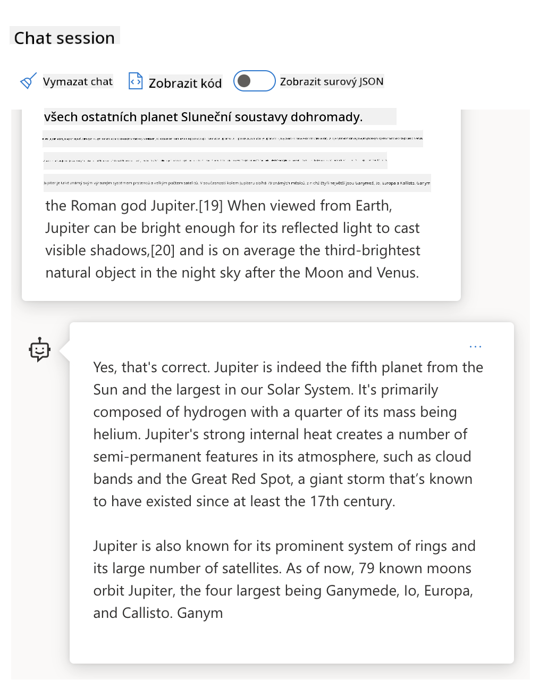

<!--
CO_OP_TRANSLATOR_METADATA:
{
  "original_hash": "a45c318dc6ebc2604f35b8b829f93af2",
  "translation_date": "2025-07-09T10:55:53+00:00",
  "source_file": "04-prompt-engineering-fundamentals/README.md",
  "language_code": "cs"
}
-->
# Základy návrhu promptů

[](https://aka.ms/gen-ai-lesson4-gh?WT.mc_id=academic-105485-koreyst)

## Úvod
Tento modul pokrývá základní pojmy a techniky pro vytváření efektivních promptů v generativních AI modelech. Způsob, jakým napíšete prompt pro LLM, je také důležitý. Pečlivě vytvořený prompt může přinést lepší kvalitu odpovědi. Ale co přesně znamenají pojmy jako _prompt_ a _prompt engineering_? A jak mohu zlepšit vstupní prompt, který posílám LLM? Na tyto otázky se pokusíme odpovědět v této kapitole a v následující.

_Generativní AI_ je schopná vytvářet nový obsah (např. text, obrázky, zvuk, kód atd.) na základě uživatelských požadavků. Dosahuje toho pomocí _velkých jazykových modelů_ jako je série GPT od OpenAI („Generative Pre-trained Transformer“), které jsou trénovány na práci s přirozeným jazykem a kódem.

Uživatelé nyní mohou s těmito modely komunikovat pomocí známých paradigmat, jako je chat, aniž by potřebovali technické znalosti nebo školení. Modely jsou _prompt-based_ – uživatelé posílají textový vstup (prompt) a dostávají zpět odpověď AI (completion). Mohou pak s AI „chatovat“ iterativně, v několika kolech, a upravovat svůj prompt, dokud odpověď neodpovídá jejich očekáváním.

„Prompty“ se tak stávají hlavním _programovacím rozhraním_ pro generativní AI aplikace, určují modelům, co mají dělat, a ovlivňují kvalitu vrácených odpovědí. „Prompt Engineering“ je rychle rostoucí oblast, která se zaměřuje na _návrh a optimalizaci_ promptů, aby bylo možné dosahovat konzistentních a kvalitních odpovědí ve velkém měřítku.

## Cíle učení

V této lekci se naučíme, co je Prompt Engineering, proč je důležitý a jak můžeme vytvořit efektivnější prompty pro daný model a cíl aplikace. Pochopíme základní pojmy a osvědčené postupy v návrhu promptů – a seznámíme se s interaktivním prostředím Jupyter Notebooku, kde si tyto koncepty vyzkoušíme na reálných příkladech.

Na konci lekce budeme schopni:

1. Vysvětlit, co je prompt engineering a proč je důležitý.
2. Popsat složky promptu a jak se používají.
3. Naučit se osvědčené postupy a techniky prompt engineeringu.
4. Aplikovat naučené techniky na reálné příklady pomocí OpenAI endpointu.

## Klíčové pojmy

Prompt Engineering: Praxe navrhování a zdokonalování vstupů, které vedou AI modely k požadovaným výstupům.  
Tokenizace: Proces převodu textu na menší jednotky, nazývané tokeny, které model dokáže zpracovat.  
Instruction-Tuned LLMs: Velké jazykové modely (LLM), které byly doladěny pomocí specifických instrukcí pro zlepšení přesnosti a relevance odpovědí.

## Výukové prostředí

Prompt engineering je zatím spíše umění než věda. Nejlepší způsob, jak si v něm zlepšit intuici, je _více cvičit_ a používat přístup pokus-omyl, který kombinuje znalosti z dané oblasti s doporučenými technikami a optimalizacemi specifickými pro model.

Jupyter Notebook, který je součástí této lekce, poskytuje _sandbox_ prostředí, kde si můžete vyzkoušet, co se naučíte – průběžně nebo jako součást závěrečného kódového úkolu. K provedení cvičení budete potřebovat:

1. **Azure OpenAI API klíč** – službu s nasazeným LLM modelem.  
2. **Python Runtime** – prostředí, ve kterém lze Notebook spustit.  
3. **Lokální proměnné prostředí** – _dokončete nyní kroky v [SETUP](./../00-course-setup/SETUP.md?WT.mc_id=academic-105485-koreyst), abyste byli připraveni_.

Notebook obsahuje _startovací_ cvičení – ale doporučujeme přidávat vlastní _Markdown_ (popisné) a _Code_ (promptové požadavky) sekce, abyste mohli zkoušet další příklady nebo nápady a budovat si intuici pro návrh promptů.

## Ilustrovaný průvodce

Chcete získat přehled o tom, co tato lekce pokrývá, než se do ní pustíte? Podívejte se na tento ilustrovaný průvodce, který vám představí hlavní témata a klíčové poznatky, nad kterými se můžete zamyslet. Plán lekce vás provede od pochopení základních konceptů a výzev až po jejich řešení pomocí relevantních technik prompt engineeringu a osvědčených postupů. Poznámka: sekce „Pokročilé techniky“ v tomto průvodci odkazuje na obsah, který je pokryt v _následující_ kapitole tohoto kurzu.


## Naše startupová mise

Nyní si povíme, jak se _toto téma_ vztahuje k naší misi startupu, která je zaměřena na [přinášení AI inovací do vzdělávání](https://educationblog.microsoft.com/2023/06/collaborating-to-bring-ai-innovation-to-education?WT.mc_id=academic-105485-koreyst). Chceme vytvářet AI aplikace pro _personalizované učení_ – pojďme tedy přemýšlet, jak by různí uživatelé naší aplikace mohli „navrhovat“ prompty:

- **Administrátoři** mohou požádat AI o _analýzu dat kurikula za účelem identifikace mezer ve výuce_. AI může shrnout výsledky nebo je vizualizovat pomocí kódu.  
- **Učitelé** mohou požádat AI o _vytvoření plánu lekce pro cílové publikum a téma_. AI může sestavit personalizovaný plán ve specifikovaném formátu.  
- **Studenti** mohou požádat AI o _doučování v obtížném předmětu_. AI je může vést lekcemi, nápovědami a příklady přizpůsobenými jejich úrovni.

To je jen špička ledovce. Podívejte se na [Prompts For Education](https://github.com/microsoft/prompts-for-edu/tree/main?WT.mc_id=academic-105485-koreyst) – open-source knihovnu promptů sestavenou odborníky na vzdělávání – a získejte širší představu o možnostech! _Vyzkoušejte některé z těchto promptů v sandboxu nebo v OpenAI Playground a uvidíte, co se stane!_

<!--
LESSON TEMPLATE:
This unit should cover core concept #1.
Reinforce the concept with examples and references.

CONCEPT #1:
Prompt Engineering.
Define it and explain why it is needed.
-->

## Co je Prompt Engineering?

Lekci jsme začali definicí **Prompt Engineering** jako procesu _navrhování a optimalizace_ textových vstupů (promptů), které mají zajistit konzistentní a kvalitní odpovědi (completion) pro daný cíl aplikace a model. Můžeme to vnímat jako dvoufázový proces:

- _navrhnout_ počáteční prompt pro daný model a cíl  
- _iterativně vylepšovat_ prompt, aby se zlepšila kvalita odpovědi

Je to nutně proces pokus-omyl, který vyžaduje uživatelskou intuici a úsilí pro dosažení optimálních výsledků. Proč je to tedy důležité? Abychom na to odpověděli, musíme nejprve pochopit tři pojmy:

- _Tokenizace_ = jak model „vidí“ prompt  
- _Základní LLM_ = jak základní model „zpracovává“ prompt  
- _Instruction-Tuned LLM_ = jak model nyní dokáže rozpoznat „úkoly“

### Tokenizace

LLM vidí prompty jako _sekvenci tokenů_, přičemž různé modely (nebo verze modelu) mohou stejný prompt tokenizovat různými způsoby. Protože LLM jsou trénovány na tokeny (a ne na surový text), způsob, jakým jsou prompty tokenizovány, přímo ovlivňuje kvalitu generované odpovědi.

Pro lepší představu, jak tokenizace funguje, vyzkoušejte nástroje jako [OpenAI Tokenizer](https://platform.openai.com/tokenizer?WT.mc_id=academic-105485-koreyst) uvedený níže. Zkopírujte svůj prompt a podívejte se, jak je převeden na tokeny, věnujte pozornost tomu, jak jsou zpracovány mezery a interpunkce. Upozorňujeme, že tento příklad ukazuje starší LLM (GPT-3) – u novějšího modelu může být výsledek odlišný.


### Koncept: Základní modely

Jakmile je prompt tokenizován, hlavní funkcí ["Base LLM"](https://blog.gopenai.com/an-introduction-to-base-and-instruction-tuned-large-language-models-8de102c785a6?WT.mc_id=academic-105485-koreyst) (základního modelu) je předpovědět další token v sekvenci. Protože LLM jsou trénovány na obrovských textových datech, mají dobrý přehled o statistických vztazích mezi tokeny a dokážou tuto předpověď provést s určitou jistotou. Nechápou však _význam_ slov v promptu nebo tokenu; vidí pouze vzor, který mohou „dokončit“ další předpovědí. Mohou pokračovat v předpovídání sekvence, dokud je uživatel nezastaví nebo nenastane nějaká předem stanovená podmínka.

Chcete vidět, jak funguje dokončování na základě promptu? Zadejte výše uvedený prompt do Azure OpenAI Studio [_Chat Playground_](https://oai.azure.com/playground?WT.mc_id=academic-105485-koreyst) s výchozím nastavením. Systém je nastaven tak, aby považoval prompty za požadavky na informace – měli byste tedy vidět odpověď, která odpovídá tomuto kontextu.

Co když ale uživatel chce vidět něco konkrétního, co splňuje určitá kritéria nebo cíl úkolu? Právě zde přicházejí na řadu _instruction-tuned_ LLM.



### Koncept: Instruction Tuned LLM

[Instruction Tuned LLM](https://blog.gopenai.com/an-introduction-to-base-and-instruction-tuned-large-language-models-8de102c785a6?WT.mc_id=academic-105485-koreyst) vychází ze základního modelu, který je doladěn na základě příkladů nebo vstupně-výstupních párů (např. vícekrokových „zpráv“), které obsahují jasné instrukce – a odpověď AI se snaží těmto instrukcím vyhovět.

Používá techniky jako Reinforcement Learning with Human Feedback (RLHF), které model naučí _řídit se instrukcemi_ a _učit se z feedbacku_, aby produkoval odpovědi lépe přizpůsobené praktickým aplikacím a relevantnější pro uživatelské cíle.

Vyzkoušejme to – vraťte se k výše uvedenému promptu, ale nyní změňte _systémovou zprávu_ tak, aby obsahovala následující instrukci jako kontext:

> _Shrň obsah, který ti poskytnu, pro žáka druhé třídy. Výsledek udrž na jednom odstavci s 3–5 odrážkami._

Vidíte, jak je výsledek nyní laděný tak, aby odpovídal požadovanému cíli a formátu? Učitel může tuto odpověď přímo použít ve svých prezentacích pro danou třídu.


## Proč potřebujeme Prompt Engineering?

Nyní, když víme, jak LLM zpracovávají prompty, pojďme si říct, _proč_ potřebujeme prompt engineering. Odpověď spočívá v tom, že současné LLM představují řadu výzev, které ztěžují dosažení _spolehlivých a konzistentních odpovědí_ bez úsilí věnovaného konstrukci a optimalizaci promptů. Například:

1. **Odpovědi modelu jsou náhodné.** _Stejný prompt_ pravděpodobně vygeneruje různé odpovědi u různých modelů nebo verzí modelu. A může dokonce produkovat různé výsledky i u _stejného modelu_ v různých časech. _Techniky prompt engineeringu nám pomáhají minimalizovat tyto odchylky tím, že poskytují lepší mantinely_.

1. **Modely mohou vytvářet nepravdivé odpovědi.** Modely jsou předtrénovány na _velkých, ale omezených_ datech, což znamená, že nemají znalosti o konceptech mimo rozsah tréninku. Výsledkem může být generování nepřesných, smyšlených nebo přímo protichůdných informací. _Techniky prompt engineeringu pomáhají uživatelům tyto nepravdivé informace odhalit a zmírnit, například žádáním AI o citace nebo zdůvodnění_.

1. **Schopnosti modelů se liší.** Novější modely nebo generace modelů mají bohatší schopnosti, ale také přinášejí specifické zvláštnosti a kompromisy v nákladech a složitosti. _Prompt engineering nám pomáhá vyvíjet osvědčené postupy a pracovní postupy, které abstrahují tyto rozdíly a přizpůsobují se požadavkům konkrétního modelu škálovatelným a plynulým způsobem_.

Podívejme se na to v praxi v OpenAI nebo Azure OpenAI Playground:

- Použijte stejný prompt u různých nasazení LLM (např. OpenAI, Azure OpenAI, Hugging Face) – viděli jste rozdíly?  
- Použijte stejný prompt opakovaně u _stejného_ nasazení LLM (např. Azure OpenAI playground) – jak se lišily výsledky?

### Příklad nepravdivých informací (fabrications)

V tomto kurzu používáme termín **„fabrication“** k označení jevu, kdy LLM někdy generují fakticky nesprávné informace kvůli omezením ve svém tréninku nebo jiným faktorům. Tento jev je v populárních článcích nebo výzkumných pracích často označován jako _„halucinace“_. Nicméně důrazně doporučujeme používat termín _„fabrication“_, abychom se vyhnuli antropomorfizaci chování a nepřisuzovali strojovému výsledku lidskou vlastnost. Tento přístup také podporuje [zásady odpovědného AI](https://www.microsoft.com/ai/responsible-ai?WT.mc_id=academic-105485-koreyst) z hlediska terminologie a odstraňuje výrazy, které mohou být v některých kontextech považovány za nevhodné nebo neinkluzivní.

Chcete si udělat představu, jak fabrication funguje? Představte si prompt, který instruuje AI, aby vytvořila obsah k neexistujícímu tématu (aby bylo jisté, že se v tréninkových datech nevyskytuje). Například – zkoušel jsem tento prompt:
# Plán lekce: Válka na Marsu v roce 2076

## Cíl lekce
Seznámit studenty s hlavními událostmi, příčinami a důsledky Války na Marsu v roce 2076.

## Délka lekce
60 minut

## Pomůcky
- Prezentace s obrázky a mapami Marsu
- Video dokument o Válce na Marsu
- Pracovní listy s otázkami a úkoly

## Struktura lekce

### 1. Úvod (10 minut)
- Krátké představení Marsu jako planety a jeho kolonizace do roku 2076.
- Diskuze: Proč by mohlo dojít k válce na Marsu?

### 2. Hlavní události Války na Marsu (20 minut)
- Popis příčin konfliktu: zdroje, politické napětí, technologie.
- Klíčové bitvy a jejich průběh.
- Role hlavních aktérů a frakcí.

### 3. Důsledky války (15 minut)
- Dopady na kolonii a Zemi.
- Změny v politice a technologii po válce.
- Diskuze o morálních a etických otázkách konfliktu.

### 4. Závěr a shrnutí (10 minut)
- Opakování klíčových bodů.
- Otázky a odpovědi.
- Zadání domácího úkolu: Napsat krátkou esej o tom, jak by se dala válka na Marsu v budoucnu zabránit.

## Domácí úkol
Napište esej (max. 300 slov) na téma: „Jak zabránit budoucím konfliktům na Marsu?“
Webové vyhledávání mi ukázalo, že existují fiktivní příběhy (např. televizní seriály nebo knihy) o válkách na Marsu – ale žádné z roku 2076. Zdravý rozum nám také říká, že rok 2076 je _v budoucnosti_ a proto nemůže být spojen s reálnou událostí.

Co se tedy stane, když tento prompt spustíme u různých poskytovatelů LLM?

> **Odpověď 1**: OpenAI Playground (GPT-35)


> **Odpověď 2**: Azure OpenAI Playground (GPT-35)


> **Odpověď 3**: : Hugging Face Chat Playground (LLama-2)


Jak se dalo očekávat, každý model (nebo jeho verze) generuje mírně odlišné odpovědi díky stochastickému chování a rozdílům v schopnostech modelu. Například jeden model cílí na publikum 8. třídy, zatímco jiný předpokládá středoškolského studenta. Ale všechny tři modely vytvořily odpovědi, které by mohly přesvědčit neinformovaného uživatele, že daná událost je skutečná.

Techniky prompt engineeringu jako _metaprompting_ a _nastavení teploty_ mohou do určité míry snížit výskyt vymyšlených informací modelem. Nové _architektury_ prompt engineeringu také bezproblémově začleňují nové nástroje a techniky do toku promptu, aby zmírnily nebo omezily některé z těchto efektů.

## Případová studie: GitHub Copilot

Tuto sekci zakončíme pohledem na to, jak se prompt engineering používá v reálných řešeních, a to na příkladu jedné případové studie: [GitHub Copilot](https://github.com/features/copilot?WT.mc_id=academic-105485-koreyst).

GitHub Copilot je váš „AI parťák programátor“ – převádí textové prompt na dokončení kódu a je integrován do vašeho vývojového prostředí (např. Visual Studio Code) pro plynulý uživatelský zážitek. Jak je zdokumentováno v sérii níže uvedených blogů, první verze byla založena na modelu OpenAI Codex – inženýři však rychle pochopili potřebu doladit model a vyvinout lepší techniky prompt engineeringu, aby se zlepšila kvalita kódu. V červenci pak [představili vylepšený AI model, který jde nad rámec Codexu](https://github.blog/2023-07-28-smarter-more-efficient-coding-github-copilot-goes-beyond-codex-with-improved-ai-model/?WT.mc_id=academic-105485-koreyst) a nabízí ještě rychlejší návrhy.

Přečtěte si příspěvky v pořadí, abyste sledovali jejich cestu učení.

- **Květen 2023** | [GitHub Copilot se zlepšuje v porozumění vašemu kódu](https://github.blog/2023-05-17-how-github-copilot-is-getting-better-at-understanding-your-code/?WT.mc_id=academic-105485-koreyst)
- **Květen 2023** | [Uvnitř GitHubu: Práce s LLM za GitHub Copilotem](https://github.blog/2023-05-17-inside-github-working-with-the-llms-behind-github-copilot/?WT.mc_id=academic-105485-koreyst)
- **Červen 2023** | [Jak psát lepší prompty pro GitHub Copilot](https://github.blog/2023-06-20-how-to-write-better-prompts-for-github-copilot/?WT.mc_id=academic-105485-koreyst)
- **Červenec 2023** | [GitHub Copilot jde nad rámec Codexu s vylepšeným AI modelem](https://github.blog/2023-07-28-smarter-more-efficient-coding-github-copilot-goes-beyond-codex-with-improved-ai-model/?WT.mc_id=academic-105485-koreyst)
- **Červenec 2023** | [Průvodce vývojáře prompt engineeringem a LLM](https://github.blog/2023-07-17-prompt-engineering-guide-generative-ai-llms/?WT.mc_id=academic-105485-koreyst)
- **Září 2023** | [Jak postavit podnikové LLM aplikace: Lekce z GitHub Copilota](https://github.blog/2023-09-06-how-to-build-an-enterprise-llm-application-lessons-from-github-copilot/?WT.mc_id=academic-105485-koreyst)

Můžete také procházet jejich [inženýrský blog](https://github.blog/category/engineering/?WT.mc_id=academic-105485-koreyst) pro další příspěvky jako [tento](https://github.blog/2023-09-27-how-i-used-github-copilot-chat-to-build-a-reactjs-gallery-prototype/?WT.mc_id=academic-105485-koreyst), který ukazuje, jak jsou tyto modely a techniky _aplikovány_ pro reálné projekty.

---

<!--
ŠABLONA LEKCE:
Tato jednotka by měla pokrýt základní koncept #2.
Podpořit koncept příklady a odkazy.

KONCEPT #2:
Návrh promptu.
Ilustrováno na příkladech.
-->

## Konstrukce promptu

Viděli jsme, proč je prompt engineering důležitý – teď si pojďme vysvětlit, jak se prompty _konstruují_, abychom mohli hodnotit různé techniky pro efektivnější návrh promptů.

### Základní prompt

Začněme se základním promptem: textovým vstupem zaslaným modelu bez dalšího kontextu. Tady je příklad – když pošleme první pár slov americké národní hymny do OpenAI [Completion API](https://platform.openai.com/docs/api-reference/completions?WT.mc_id=academic-105485-koreyst), model okamžitě _dokončí_ odpověď dalšími řádky, což ilustruje základní predikční chování.

| Prompt (vstup)     | Dokončení (výstup)                                                                                                                        |
| :----------------- | :----------------------------------------------------------------------------------------------------------------------------------------- |
| Oh say can you see | Zdá se, že začínáte text písně „The Star-Spangled Banner“, národní hymny Spojených států. Celý text je ... |

### Složitý prompt

Nyní přidáme kontext a instrukce k základnímu promptu. [Chat Completion API](https://learn.microsoft.com/azure/ai-services/openai/how-to/chatgpt?WT.mc_id=academic-105485-koreyst) nám umožňuje vytvořit složitý prompt jako sbírku _zpráv_ s:

- páry vstup/výstup odrážejícími _uživatelský_ vstup a _asistentovu_ odpověď.
- systémovou zprávou, která nastavuje kontext chování nebo osobnosti asistenta.

Požadavek má nyní podobu níže, kde _tokenizace_ efektivně zachycuje relevantní informace z kontextu a konverzace. Změna systémového kontextu může mít na kvalitu dokončení stejně velký vliv jako samotné uživatelské vstupy.

```python
response = openai.chat.completions.create(
    model="gpt-3.5-turbo",
    messages=[
        {"role": "system", "content": "You are a helpful assistant."},
        {"role": "user", "content": "Who won the world series in 2020?"},
        {"role": "assistant", "content": "The Los Angeles Dodgers won the World Series in 2020."},
        {"role": "user", "content": "Where was it played?"}
    ]
)
```

### Instrukční prompt

V předchozích příkladech byl uživatelský prompt jednoduchý textový dotaz, který lze interpretovat jako žádost o informaci. U _instrukčních_ promptů můžeme tento text použít k podrobnějšímu zadání úkolu a poskytnout AI lepší vedení. Tady je příklad:

| Prompt (vstup)                                                                                                                                                                                                                         | Dokončení (výstup)                                                                                                        | Typ instrukce      |
| :------------------------------------------------------------------------------------------------------------------------------------------------------------------------------------------------------------------------------------- | :------------------------------------------------------------------------------------------------------------------------- | :----------------- |
| Napiš popis Občanské války                                                                                                                                                                                                             | _vrátil jednoduchý odstavec_                                                                                              | Jednoduchý         |
| Napiš popis Občanské války. Uveď klíčová data a události a popiš jejich význam                                                                                                                                                         | _vrátil odstavec následovaný seznamem klíčových dat událostí s popisy_                                                    | Složitý            |
| Napiš popis Občanské války v 1 odstavci. Uveď 3 odrážky s klíčovými daty a jejich významem. Uveď 3 další odrážky s klíčovými historickými osobnostmi a jejich přínosy. Výstup vrať jako JSON soubor | _vrací podrobnější informace v textovém poli, formátované jako JSON, které lze zkopírovat do souboru a případně ověřit_      | Složitý. Formátovaný.|

## Primární obsah

V předchozích příkladech byl prompt stále poměrně otevřený, což umožňovalo LLM rozhodnout, která část jeho předtrénovaných dat je relevantní. S návrhovým vzorem _primární obsah_ je vstupní text rozdělen na dvě části:

- instrukce (akce)
- relevantní obsah (který ovlivňuje akci)

Tady je příklad, kde instrukce zní „shrň toto ve 2 větách“.

| Prompt (vstup)                                                                                                                                                                                                                                                                                                                                                                                                                                                                                                                                                                                                                                                                                      | Dokončení (výstup)                                                                                                                                                                                                                                                                             |
| :-------------------------------------------------------------------------------------------------------------------------------------------------------------------------------------------------------------------------------------------------------------------------------------------------------------------------------------------------------------------------------------------------------------------------------------------------------------------------------------------------------------------------------------------------------------------------------------------------------------------------------------------------------------------------------------------------- | :---------------------------------------------------------------------------------------------------------------------------------------------------------------------------------------------------------------------------------------------------------------------------------------------- |
| Jupiter je pátá planeta od Slunce a největší v Sluneční soustavě. Je to plynný obr s hmotností tisícinu Slunce, ale dvakrát a půl větší než všechny ostatní planety Sluneční soustavy dohromady. Jupiter je jedním z nejjasnějších objektů viditelných pouhým okem na noční obloze a je známý starověkým civilizacím už před zaznamenanou historií. Je pojmenován po římském bohu Jupiterovi.[19] Při pohledu ze Země může být Jupiter dostatečně jasný, aby jeho odražené světlo vrhalo viditelné stíny,[20] a je v průměru třetím nejjasnějším přirozeným objektem na noční obloze po Měsíci a Venuši. <br/> **Shrň toto ve 2 krátkých větách** | Jupiter, pátá planeta od Slunce, je největší v Sluneční soustavě a je známý jako jeden z nejjasnějších objektů na noční obloze. Pojmenován po římském bohu Jupiterovi, je to plynný obr s hmotností dvakrát a půl větší než všechny ostatní planety Sluneční soustavy dohromady. |

Segment primárního obsahu lze využít různými způsoby pro efektivnější zadání instrukcí:

- **Příklady** – místo explicitního zadání, co má model udělat, mu dáme příklady, co má dělat, a necháme ho odvodit vzor.
- **Náznaky** – následující instrukci doplníme „náznakem“, který připraví dokončení a nasměruje model k relevantnějším odpovědím.
- **Šablony** – opakující se „recepty“ na prompty s proměnnými (placeholders), které lze přizpůsobit daty pro konkrétní použití.

Pojďme si to ukázat v praxi.

### Použití příkladů

Toto je přístup, kdy pomocí primárního obsahu „nakrmíme model“ několika příklady požadovaného výstupu pro danou instrukci a necháme ho odvodit vzor požadovaného výstupu. Podle počtu příkladů můžeme mít zero-shot prompting, one-shot prompting, few-shot prompting atd.

Prompt nyní obsahuje tři části:

- popis úkolu
- několik příkladů požadovaného výstupu
- začátek nového příkladu (který se stává implicitním popisem úkolu)

| Typ učení   | Prompt (vstup)                                                                                                                                        | Dokončení (výstup)         |
| :---------- | :---------------------------------------------------------------------------------------------------------------------------------------------------- | :-------------------------- |
| Zero-shot   | „The Sun is Shining“. Přelož do španělštiny                                                                                                          | „El Sol está brillando“.    |
| One-shot    | „The Sun is Shining“ => „El Sol está brillando“. <br> „It's a Cold and Windy Day“ =>                                                                 | „Es un día frío y ventoso“. |
| Few-shot    | The player ran the bases => Baseball <br/> The player hit an ace => Tennis <br/> The player hit a six => Cricket <br/> The player made a slam-dunk => | Basketball                  |
|             |                                                                                                                                                       |                             |

Všimněte si, že u zero-shot promptingu jsme museli explicitně zadat instrukci („Přelož do španělštiny“), ale u one-shot promptingu už je to odvozeno z příkladu. Few-shot příklad ukazuje, jak přidání více příkladů umožňuje modelům přesněji odvodit vzory bez dalších instrukcí.

### Náznaky promptu

Další technikou využití primárního obsahu je poskytnout _náznaky_ místo příkladů. V tomto případě modelu „napovíme“ správným směrem tím, že _začneme_ úryvkem, který odráží požadovaný formát odpovědi. Model pak „chytí náznak“ a pokračuje v daném stylu.

| Počet náznaků | Prompt (vstup)                                                                                                                                                                                                                                                                                                                                                                                                                                               | Dokončení (výstup)                                                                                                                                                                                                                                                                                       |
| :------------ | :----------------------------------------------------------------------------------------------------------------------------------------------------------------------------------------------------------------------------------------------------------------------------------------------------------------------------------------------------------------------------------------------------------------------------------------------------------- | :-------------------------------------------------------------------------------------------------------------------------------------------------------------------------------------------------------------------------------------------------------------------------------------------------------- |
| 0             | Jupiter je pátá planeta od Slunce a největší v Sluneční soustavě. Je to plynný obr s hmotností tisícinu Slunce, ale dvakrát a půl větší než všechny ostatní planety Sluneční soustavy dohromady. Jupiter je jedním z nejjasnějších objektů viditelných pouhým okem na noční obloze, a je známý starověkým civilizacím už před zaznamenanou historií.

**Shrňte to**                                       | Jupiter je největší planeta naší Sluneční soustavy a pátá od Slunce. Je to plynný obr s hmotností 1/1000 Slunce, ale je těžší než všechny ostatní planety dohromady. Starověké civilizace o Jupiteru věděly už dlouho a je snadno viditelný na noční obloze. |
| 1              | Jupiter je pátá planeta od Slunce a největší v Sluneční soustavě. Je to plynný obr s hmotností jedné tisíciny Slunce, ale váží dvakrát a půl více než všechny ostatní planety Sluneční soustavy dohromady. Jupiter je jedním z nejjasnějších objektů viditelných pouhým okem na noční obloze a byl známý starověkým civilizacím už před zaznamenanou historií. <br/>**Shrňte to** <br/> Co jsme se dozvěděli, je, že Jupiter | je pátá planeta od Slunce a největší v Sluneční soustavě. Je to plynný obr s hmotností jedné tisíciny Slunce, ale váží dvakrát a půl více než všechny ostatní planety dohromady. Je snadno viditelný pouhým okem a je známý od starověku.                        |
| 2              | Jupiter je pátá planeta od Slunce a největší v Sluneční soustavě. Je to plynný obr s hmotností jedné tisíciny Slunce, ale váží dvakrát a půl více než všechny ostatní planety Sluneční soustavy dohromady. Jupiter je jedním z nejjasnějších objektů viditelných pouhým okem na noční obloze a byl známý starověkým civilizacím už před zaznamenanou historií. <br/>**Shrňte to** <br/> Tři nejdůležitější fakta, která jsme se naučili:         | 1. Jupiter je pátá planeta od Slunce a největší v Sluneční soustavě. <br/> 2. Je to plynný obr s hmotností jedné tisíciny Slunce...<br/> 3. Jupiter je viditelný pouhým okem už od starověku ...                                                                       |
|                |                                                                                                                                                                                                                                                                                                                                                                                                                                                              |                                                                                                                                                                                                                                                                                                           |

### Šablony promptů

Šablona promptu je _předem definovaný recept na prompt_, který lze uložit a znovu použít podle potřeby, aby se zajistila konzistentnější uživatelská zkušenost ve velkém měřítku. V nejjednodušší podobě je to prostě sbírka příkladů promptů, jako je [tento od OpenAI](https://platform.openai.com/examples?WT.mc_id=academic-105485-koreyst), který poskytuje jak interaktivní komponenty promptu (zprávy uživatele a systému), tak formát požadavku řízený API – pro podporu opakovaného použití.

V složitější podobě, jako je [tento příklad od LangChain](https://python.langchain.com/docs/concepts/prompt_templates/?WT.mc_id=academic-105485-koreyst), obsahuje _zástupné symboly_, které lze nahradit daty z různých zdrojů (uživatelský vstup, systémový kontext, externí datové zdroje atd.) pro dynamické generování promptu. To nám umožňuje vytvořit knihovnu znovupoužitelných promptů, které lze **programově** využívat k zajištění konzistentních uživatelských zkušeností ve velkém měřítku.

Skutečná hodnota šablon spočívá v možnosti vytvářet a publikovat _knihovny promptů_ pro vertikální aplikační oblasti – kde je šablona promptu nyní _optimalizována_ tak, aby odrážela kontext nebo příklady specifické pro danou aplikaci, což činí odpovědi relevantnějšími a přesnějšími pro cílové uživatele. Repozitář [Prompts For Edu](https://github.com/microsoft/prompts-for-edu?WT.mc_id=academic-105485-koreyst) je skvělým příkladem tohoto přístupu, který shromažďuje knihovnu promptů pro vzdělávací oblast s důrazem na klíčové cíle jako plánování lekcí, návrh osnov, doučování studentů atd.

## Podpůrný obsah

Pokud uvažujeme o konstrukci promptu jako o instrukci (úkolu) a cíli (primárním obsahu), pak _sekundární obsah_ je něco jako dodatečný kontext, který poskytujeme, abychom **nějak ovlivnili výstup**. Může to být ladicí parametry, instrukce pro formátování, taxonomie témat atd., které pomáhají modelu _přizpůsobit_ odpověď tak, aby vyhovovala požadovaným cílům nebo očekáváním uživatele.

Například: Máme katalog kurzů s rozsáhlými metadaty (název, popis, úroveň, štítky metadat, lektor atd.) o všech dostupných kurzech v osnově:

- můžeme definovat instrukci „shrň katalog kurzů pro podzim 2023“
- můžeme použít primární obsah k poskytnutí několika příkladů požadovaného výstupu
- můžeme použít sekundární obsah k identifikaci 5 nejdůležitějších „štítků“

Model pak může poskytnout shrnutí ve formátu ukázaném v příkladech – ale pokud má výsledek více štítků, může upřednostnit těch 5 identifikovaných v sekundárním obsahu.

---

<!--
ŠABLONA LEKCE:
Tato jednotka by měla pokrýt základní koncept #1.
Posilte koncept příklady a odkazy.

KONCEPT #3:
Techniky prompt engineeringu.
Jaké jsou základní techniky prompt engineeringu?
Ilustrujte je na několika cvičeních.
-->

## Nejlepší postupy při tvorbě promptů

Nyní, když víme, jak lze prompty _sestavovat_, můžeme začít přemýšlet o tom, jak je _navrhnout_ tak, aby odrážely nejlepší postupy. Můžeme to rozdělit na dvě části – mít správný _přístup_ a používat správné _techniky_.

### Přístup k prompt engineeringu

Prompt engineering je proces pokusů a omylů, proto mějte na paměti tři hlavní zásady:

1. **Důležitost znalosti domény.** Přesnost a relevance odpovědi závisí na _domeně_, ve které aplikace nebo uživatel pracuje. Použijte svou intuici a odborné znalosti domény k **dalšímu přizpůsobení technik**. Například definujte _osobnosti specifické pro doménu_ ve svých systémových promptech nebo použijte _šablony specifické pro doménu_ v uživatelských promptech. Poskytněte sekundární obsah, který odráží kontext specifický pro doménu, nebo použijte _nápovědy a příklady z dané domény_, aby model směřoval k známým vzorcům použití.

2. **Důležitost znalosti modelu.** Víme, že modely jsou z podstaty stochastické. Implementace modelů se však může lišit podle použitého tréninkového datasetu (předtrénované znalosti), schopností, které poskytují (např. přes API nebo SDK) a typu obsahu, pro který jsou optimalizovány (např. kód vs. obrázky vs. text). Pochopte silné a slabé stránky modelu, který používáte, a využijte tyto znalosti k _prioritizaci úkolů_ nebo k tvorbě _vlastních šablon_ optimalizovaných pro schopnosti modelu.

3. **Důležitost iterace a ověřování.** Modely se rychle vyvíjejí, stejně jako techniky prompt engineeringu. Jako odborník na doménu můžete mít další kontext nebo kritéria pro _vaši_ konkrétní aplikaci, která nemusí platit pro širší komunitu. Používejte nástroje a techniky prompt engineeringu k „rychlému startu“ tvorby promptů, poté iterujte a ověřujte výsledky pomocí vlastní intuice a odborných znalostí. Zaznamenávejte své poznatky a vytvářejte **databázi znalostí** (např. knihovny promptů), kterou mohou ostatní využít jako novou výchozí úroveň pro rychlejší iterace v budoucnu.

## Nejlepší postupy

Podívejme se nyní na běžné doporučené postupy od [OpenAI](https://help.openai.com/en/articles/6654000-best-practices-for-prompt-engineering-with-openai-api?WT.mc_id=academic-105485-koreyst) a [Azure OpenAI](https://learn.microsoft.com/azure/ai-services/openai/concepts/prompt-engineering#best-practices?WT.mc_id=academic-105485-koreyst).

| Co                              | Proč                                                                                                                                                                                                                                               |
| :------------------------------ | :------------------------------------------------------------------------------------------------------------------------------------------------------------------------------------------------------------------------------------------------ |
| Vyzkoušejte nejnovější modely.  | Nové generace modelů pravděpodobně přinášejí lepší funkce a kvalitu – ale mohou také znamenat vyšší náklady. Otestujte je z hlediska dopadu a pak se rozhodněte o migraci.                                                                         |
| Oddělte instrukce a kontext     | Zjistěte, zda váš model/poskytovatel definuje _oddělovače_ pro jasnější rozlišení instrukcí, primárního a sekundárního obsahu. To pomáhá modelům přesněji vážit tokeny.                                                                          |
| Buďte konkrétní a jasní          | Poskytněte více detailů o požadovaném kontextu, výsledku, délce, formátu, stylu atd. To zlepší kvalitu i konzistenci odpovědí. Zachyťte recepty v znovupoužitelných šablonách.                                                                  |
| Buďte popisní, používejte příklady | Modely často lépe reagují na přístup „ukázat a říct“. Začněte s `zero-shot` přístupem, kdy dáte instrukci (ale žádné příklady), pak zkuste `few-shot` jako vylepšení, kdy poskytnete několik příkladů požadovaného výstupu. Používejte analogie.       |
| Používejte nápovědy k nastartování dokončení | Nasměrujte model k požadovanému výsledku tím, že mu dáte několik úvodních slov nebo frází, které může použít jako výchozí bod pro odpověď.                                                                                                         |
| Opakujte, pokud je třeba        | Někdy je potřeba modelu instrukce zopakovat. Dejte instrukce před i po primárním obsahu, použijte instrukci a nápovědu atd. Iterujte a ověřujte, co funguje nejlépe.                                                                             |
| Pořadí má význam                | Pořadí, v jakém modelu předkládáte informace, může ovlivnit výstup, i v příkladech učení, kvůli efektu nedávné paměti. Vyzkoušejte různé možnosti, abyste zjistili, co funguje nejlépe.                                                             |
| Dejte modelu „východisko“       | Poskytněte modelu _záložní_ odpověď, kterou může použít, pokud z nějakého důvodu nemůže úkol dokončit. To snižuje riziko generování falešných nebo vymyšlených odpovědí.                                                                         |
|                                |                                                                                                                                                                                                                                                   |

Jako u každého nejlepšího postupu mějte na paměti, že _výsledky se mohou lišit_ v závislosti na modelu, úkolu a doméně. Používejte tyto rady jako výchozí bod a iterujte, abyste našli, co vám nejlépe vyhovuje. Neustále přehodnocujte svůj proces prompt engineeringu, jakmile jsou k dispozici nové modely a nástroje, s důrazem na škálovatelnost procesu a kvalitu odpovědí.

<!--
ŠABLONA LEKCE:
Tato jednotka by měla obsahovat kódové cvičení, pokud je to vhodné.

VÝZVA:
Odkaz na Jupyter Notebook s komentáři v kódu v instrukcích (kódové sekce jsou prázdné).

ŘEŠENÍ:
Odkaz na kopii toho Notebooku s vyplněnými prompty a spuštěním, ukazující jeden příklad výstupu.
-->

## Zadání

Gratulujeme! Dostali jste se na konec lekce! Je čas vyzkoušet některé z těchto konceptů a technik na reálných příkladech!

Pro naše zadání budeme používat Jupyter Notebook s cvičeními, která můžete dokončit interaktivně. Notebook si také můžete rozšířit o vlastní Markdown a kódové buňky, abyste mohli samostatně zkoumat nápady a techniky.

### Pro začátek si forknete repozitář, pak

- (Doporučeno) Spusťte GitHub Codespaces
- (Alternativně) Naklonujte repozitář do svého zařízení a používejte ho s Docker Desktop
- (Alternativně) Otevřete Notebook ve svém preferovaném prostředí pro Jupyter Notebooky

### Dále nastavte své proměnné prostředí

- Zkopírujte soubor `.env.copy` z kořenového adresáře repozitáře do `.env` a vyplňte hodnoty `AZURE_OPENAI_API_KEY`, `AZURE_OPENAI_ENDPOINT` a `AZURE_OPENAI_DEPLOYMENT`. Poté se vraťte do [sekce Learning Sandbox](../../../04-prompt-engineering-fundamentals/04-prompt-engineering-fundamentals), kde se naučíte, jak na to.

### Poté otevřete Jupyter Notebook

- Vyberte runtime kernel. Pokud používáte možnosti 1 nebo 2, jednoduše vyberte výchozí kernel Python 3.10.x, který poskytuje vývojové prostředí.

Jste připraveni spustit cvičení. Všimněte si, že zde nejsou žádné _správné nebo špatné_ odpovědi – jde o zkoumání možností metodou pokus-omyl a budování intuice, co funguje pro daný model a aplikační oblast.

_Proto v této lekci nejsou žádné segmenty s řešením kódu. Místo toho budou v Notebooku Markdown buňky s názvem „Moje řešení:“, které ukazují jeden příklad výstupu pro referenci._

<!--
ŠABLONA LEKCE:
Zakončete sekci shrnutím a zdroji pro samostatné učení.
-->

## Kontrola znalostí

Který z následujících promptů je dobrý a odpovídá rozumným nejlepším postupům?

1. Ukáž mi obrázek červeného auta
2. Ukáž mi obrázek červeného auta značky Volvo a modelu XC90 zaparkovaného u útesu při západu slunce
3. Ukáž mi obrázek červeného auta značky Volvo a modelu XC90

Odpověď: 2, je to nejlepší prompt, protože poskytuje detaily o „co“ a jde do konkrétností (nejde jen o jakékoliv auto, ale o konkrétní značku a model) a také popisuje celkové prostředí. 3 je druhý nejlepší, protože také obsahuje hodně popisu.

## 🚀 Výzva

Zkuste využít techniku „nápovědy“ s promptem: Dokonči větu „Ukáž mi obrázek červeného auta značky Volvo a “. Co odpoví a jak byste prompt vylepšili?

## Skvělá práce! Pokračujte ve svém učení

Chcete se dozvědět více o různých konceptech Prompt Engineeringu? Navštivte [stránku s dalším učením](https://aka.ms/genai-collection?WT.mc_id=academic-105485-koreyst), kde najdete další skvělé zdroje na toto téma.

Přejděte do Lekce 5, kde se podíváme na [pokročilé techniky promptování](../05-advanced-prompts/README.md?WT.mc_id=academic-105485-koreyst)!

**Prohlášení o vyloučení odpovědnosti**:  
Tento dokument byl přeložen pomocí AI překladatelské služby [Co-op Translator](https://github.com/Azure/co-op-translator). I když usilujeme o přesnost, mějte prosím na paměti, že automatické překlady mohou obsahovat chyby nebo nepřesnosti. Původní dokument v jeho mateřském jazyce by měl být považován za závazný zdroj. Pro důležité informace se doporučuje profesionální lidský překlad. Nejsme odpovědní za jakékoliv nedorozumění nebo nesprávné výklady vyplývající z použití tohoto překladu.