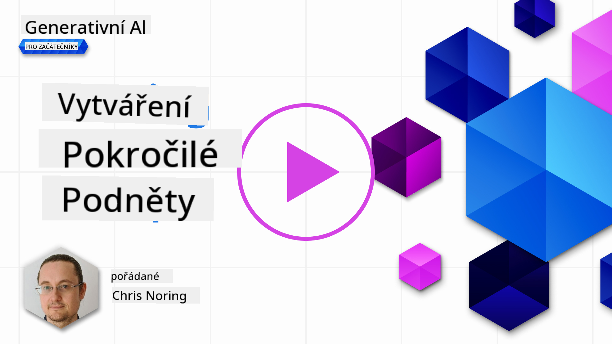

<!--
CO_OP_TRANSLATOR_METADATA:
{
  "original_hash": "b2651fb16bcfbc62b8e518751ed90fdb",
  "translation_date": "2025-10-17T21:35:05+00:00",
  "source_file": "05-advanced-prompts/README.md",
  "language_code": "cs"
}
-->
# Vytváření pokročilých promptů

[](https://youtu.be/BAjzkaCdRok?si=NmUIyRf7-cDgbjtt)

Pojďme si zopakovat některé poznatky z předchozí kapitoly:

> Prompt _engineering_ je proces, kterým **směřujeme model k relevantnějším odpovědím** tím, že poskytujeme užitečnější instrukce nebo kontext.

Existují také dva kroky při psaní promptů: konstrukce promptu, tedy poskytování relevantního kontextu, a _optimalizace_, tedy postupné zlepšování promptu.

V tuto chvíli máme základní představu o tom, jak psát prompty, ale potřebujeme jít hlouběji. V této kapitole přejdete od zkoušení různých promptů k pochopení, proč je jeden prompt lepší než druhý. Naučíte se, jak konstruovat prompty podle základních technik, které lze aplikovat na jakýkoli LLM.

## Úvod

V této kapitole se budeme zabývat následujícími tématy:

- Rozšíření znalostí o prompt engineeringu aplikací různých technik na vaše prompty.
- Konfigurace promptů pro různé výstupy.

## Cíle učení

Po dokončení této lekce budete schopni:

- Použít techniky prompt engineeringu, které zlepšují výsledky vašich promptů.
- Provádět prompting, který je buď variabilní, nebo deterministický.

## Prompt engineering

Prompt engineering je proces vytváření promptů, které přinesou požadovaný výsledek. Prompt engineering není jen o psaní textových promptů. Nejedná se o inženýrskou disciplínu, ale spíše o soubor technik, které můžete použít k dosažení požadovaného výsledku.

### Příklad promptu

Podívejme se na základní prompt, jako je tento:

> Vytvořte 10 otázek na téma geografie.

V tomto promptu vlastně aplikujete sadu různých technik promptů.

Rozložme si to.

- **Kontext**, specifikujete, že by se mělo jednat o "geografii".
- **Omezení výstupu**, chcete maximálně 10 otázek.

### Omezení jednoduchého promptingu

Možná dostanete požadovaný výsledek, možná ne. Otázky budou vygenerovány, ale geografie je široké téma a možná nedostanete to, co chcete, z následujících důvodů:

- **Široké téma**, nevíte, zda se bude jednat o země, hlavní města, řeky a podobně.
- **Formát**, co když chcete, aby otázky byly formátovány určitým způsobem?

Jak vidíte, při vytváření promptů je třeba zvážit mnoho věcí.

Doposud jsme viděli jednoduchý příklad promptu, ale generativní AI je schopna mnohem více, aby pomohla lidem v různých rolích a odvětvích. Pojďme si nyní prozkoumat některé základní techniky.

### Techniky pro prompting

Nejprve musíme pochopit, že prompting je _emergentní_ vlastnost LLM, což znamená, že to není funkce zabudovaná do modelu, ale spíše něco, co objevujeme při jeho používání.

Existuje několik základních technik, které můžeme použít k promptování LLM. Pojďme si je prozkoumat.

- **Zero-shot prompting**, to je nejzákladnější forma promptingu. Jedná se o jediný prompt, který žádá odpověď od LLM pouze na základě jeho tréninkových dat.
- **Few-shot prompting**, tento typ promptingu vede LLM tím, že poskytuje 1 nebo více příkladů, na které se může spolehnout při generování odpovědi.
- **Chain-of-thought**, tento typ promptingu říká LLM, jak rozdělit problém na jednotlivé kroky.
- **Generated knowledge**, pro zlepšení odpovědi promptu můžete k promptu přidat generovaná fakta nebo znalosti.
- **Least to most**, podobně jako chain-of-thought, tato technika spočívá v rozdělení problému na sérii kroků a následném požádání o jejich provedení v pořadí.
- **Self-refine**, tato technika spočívá v kritice výstupu LLM a následném požádání o jeho zlepšení.
- **Maieutic prompting**, zde chcete zajistit, že odpověď LLM je správná, a požádáte ho, aby vysvětlilo různé části odpovědi. Jedná se o formu self-refine.

### Zero-shot prompting

Tento styl promptingu je velmi jednoduchý, skládá se z jediného promptu. Tuto techniku pravděpodobně používáte, když se začínáte učit o LLM. Zde je příklad:

- Prompt: "Co je algebra?"
- Odpověď: "Algebra je odvětví matematiky, které studuje matematické symboly a pravidla pro manipulaci s těmito symboly."

### Few-shot prompting

Tento styl promptingu pomáhá modelu tím, že poskytuje několik příkladů spolu s požadavkem. Skládá se z jediného promptu s dalšími daty specifickými pro úkol. Zde je příklad:

- Prompt: "Napište báseň ve stylu Shakespeara. Zde je několik příkladů Shakespearových sonetů:
  Sonet 18: 'Mám tě přirovnat k letnímu dni? Jsi krásnější a mírnější...'
  Sonet 116: 'Nedovolím překážky v manželství pravých myslí. Láska není láskou, která se mění, když se mění okolnosti...'
  Sonet 132: 'Tvé oči miluji, a ony, jakoby mě litovaly, Znají tvé srdce, které mě trápí pohrdáním,...'
  Nyní napište sonet o kráse měsíce."
- Odpověď: "Na nebi měsíc tiše září, V stříbrném světle, které vrhá svou jemnou krásu,..."

Příklady poskytují LLM kontext, formát nebo styl požadovaného výstupu. Pomáhají modelu pochopit konkrétní úkol a generovat přesnější a relevantnější odpovědi.

### Chain-of-thought

Chain-of-thought je velmi zajímavá technika, protože jde o to, jak provést LLM sérií kroků. Myšlenka je instruovat LLM takovým způsobem, aby pochopilo, jak něco udělat. Zvažte následující příklad, s a bez chain-of-thought:

    - Prompt: "Alice má 5 jablek, vyhodí 3 jablka, dá 2 Bobovi a Bob jí jedno vrátí, kolik jablek má Alice?"
    - Odpověď: 5

LLM odpoví 5, což je nesprávné. Správná odpověď je 1 jablko, podle výpočtu (5 -3 -2 + 1 = 1).

Jak můžeme naučit LLM, aby to udělalo správně?

Zkusme chain-of-thought. Použití chain-of-thought znamená:

1. Poskytnout LLM podobný příklad.
1. Ukázat výpočet a jak ho správně vypočítat.
1. Poskytnout původní prompt.

Zde je postup:

- Prompt: "Lisa má 7 jablek, vyhodí 1 jablko, dá 4 jablka Bartovi a Bart jí jedno vrátí:
  7 -1 = 6
  6 -4 = 2
  2 +1 = 3  
  Alice má 5 jablek, vyhodí 3 jablka, dá 2 Bobovi a Bob jí jedno vrátí, kolik jablek má Alice?"
  Odpověď: 1

Všimněte si, jak píšeme podstatně delší prompt s dalším příkladem, výpočtem a poté původním promptem, a dospějeme ke správné odpovědi 1.

Jak vidíte, chain-of-thought je velmi silná technika.

### Generated knowledge

Často, když chcete vytvořit prompt, chcete to udělat pomocí dat vaší vlastní společnosti. Chcete, aby část promptu pocházela od společnosti a druhá část by měla být skutečný prompt, který vás zajímá.

Například, pokud pracujete v pojišťovnictví, váš prompt může vypadat takto:

```text
{{company}}: {{company_name}}
{{products}}:
{{products_list}}
Please suggest an insurance given the following budget and requirements:
Budget: {{budget}}
Requirements: {{requirements}}
```

Výše vidíte, jak je prompt vytvořen pomocí šablony. V šabloně je několik proměnných, označených `{{variable}}`, které budou nahrazeny skutečnými hodnotami z firemního API.

Zde je příklad, jak by mohl prompt vypadat, jakmile budou proměnné nahrazeny obsahem z vaší společnosti:

```text
Insurance company: ACME Insurance
Insurance products (cost per month):
- Car, cheap, 500 USD
- Car, expensive, 1100 USD
- Home, cheap, 600 USD
- Home, expensive, 1200 USD
- Life, cheap, 100 USD

Please suggest an insurance given the following budget and requirements:
Budget: $1000
Requirements: Car, Home, and Life insurance
```

Pokud tento prompt spustíte přes LLM, získáte odpověď jako:

```output
Given the budget and requirements, we suggest the following insurance package from ACME Insurance:
- Car, cheap, 500 USD
- Home, cheap, 600 USD
- Life, cheap, 100 USD
Total cost: $1,200 USD
```

Jak vidíte, také navrhuje životní pojištění, což by nemělo. Tento výsledek naznačuje, že musíme optimalizovat prompt tím, že ho upravíme, aby byl jasnější ohledně toho, co je povoleno. Po několika _pokusích a omylech_ dospějeme k následujícímu promptu:

```text
Insurance company: ACME Insurance
Insurance products (cost per month):
- type: Car, cheap, cost: 500 USD
- type: Car, expensive, cost: 1100 USD
- type: Home, cheap, cost: 600 USD
- type: Home, expensive, cost: 1200 USD
- type: Life, cheap, cost: 100 USD

Please suggest an insurance given the following budget and requirements:
Budget: $1000 restrict choice to types: Car, Home
```

Všimněte si, jak přidání _type_ a _cost_ a také použití klíčového slova _restrict_ pomáhá LLM pochopit, co chceme.

Nyní dostaneme následující odpověď:

```output
Given the budget and requirements, we suggest the Car, Cheap insurance product which costs 500 USD per month.
```

Cílem tohoto příkladu bylo ukázat, že i když používáme základní techniku jako _generated knowledge_, stále musíme ve většině případů optimalizovat prompt, abychom dosáhli požadovaného výsledku.

### Least-to-most

Myšlenka techniky Least-to-most je rozdělit větší problém na dílčí problémy. Tím pomáháte LLM "dobýt" větší problém. Dobrým příkladem může být datová analýza, kde můžete požádat LLM, aby rozdělilo problém takto:

> Prompt: Jak provést datovou analýzu v 5 krocích?

Vaše AI asistent odpoví:

1. Sbírejte data
1. Vyčistěte data
1. Analyzujte data
1. Vytvořte grafy
1. Prezentujte data

### Self-refine, kritika výsledků

U generativních AI a LLM nemůžete důvěřovat výstupu. Musíte ho ověřit. Koneckonců, LLM vám pouze prezentuje, co je nejpravděpodobnější říci dál, ne co je správné. Proto je dobrý nápad požádat LLM, aby se samo zkritizovalo, což nás přivádí k technice self-refine.

Jak to funguje:

1. Počáteční prompt, který žádá LLM o vyřešení problému.
1. LLM odpoví.
1. Kritizujete odpověď a požádáte AI o zlepšení.
1. LLM odpoví znovu, tentokrát zohlední kritiku a navrhne řešení, která vymyslelo.

Tento proces můžete opakovat tolikrát, kolikrát chcete.

Zde je příklad použití této techniky:

> Prompt: "Vytvořte Python Web API s routami products a customers"

Odpověď AI:

```python
import flask
app = Flask(__name__)

@app.route('/products')
def products():
    return 'Products'

@app.route('/customers')
def customers():
    return 'Customers'
```

> Prompt: Navrhněte 3 vylepšení výše uvedeného kódu

Odpověď AI:

```text
Sure, here are three suggestions to improve the code:

Import the correct module: The first line should import Flask instead of flask. The correct import statement should be from flask import Flask.

Add a main function: Add a if __name__ == '__main__': block to the end of the file to run the application when the file is executed.

Use f-strings: Use f-strings to format the return statements in the route functions. For example, return 'Products' can be changed to return f'This is the {request.path} page'.
```

```python
from flask import Flask, request

app = Flask(__name__)

@app.route('/products')
def products():
    return f'This is the {request.path} page'

@app.route('/customers')
def customers():
    return f'This is the {request.path} page'

if __name__ == '__main__':
    app.run()
```

Jak vidíte, výše uvedená odpověď AI zlepšuje první navržený kód díky kritice první odpovědi.

### Maieutic prompting

Maieutic prompting je technika, která je podobná self-refine, ale více se zaměřuje na to, aby LLM vysvětlilo samo sebe. Cílem je snížit nekonzistence ve výstupu LLM, aby bylo zajištěno, že dospěje ke správné odpovědi. Postup je následující:

1. Požádejte LLM, aby odpovědělo na otázku.
1. U každé části odpovědi požádejte LLM, aby ji podrobněji vysvětlilo.
1. Pokud jsou nekonzistence, odstraňte části, které jsou nekonzistentní.

Opakujte kroky 2 a 3, dokud neprojdete všechny části a nebudete spokojeni s odpovědí.

Zde je příklad promptu:

> prompt: Jak mohu vytvořit krizový plán pro zmírnění pandemie v 5 krocích?
> Odpověď LLM:

```text
1. Identify the risks
1. Identify the stakeholders
1. Identify the resources
1. Identify the actions
1. Identify the communication channels
```

Identifikovalo 5 kroků, ale můžeme určit, zda je to správné? Požádejme LLM, aby vysvětlilo každý krok:

> prompt: Vysvětlete první krok podrobněji, jaké jsou podrobné rizika pandemie?

```text
The risks are the following:

- Loss of life
- Loss of business
- Loss of reputation
- Loss of customers
- Loss of employees
```

V tuto chvíli chceme zajistit, že LLM je správné, takže ho požádáme, aby vysvětlilo první riziko podrobněji a doufáme, že je konzistentní s výše uvedenou odpovědí:

> prompt: V pandemii, jaké je největší riziko a proč?

```text
The biggest risk is loss of life because it's the most important thing to protect.
```

> Jaká jsou dvě největší rizika v pandemii?

```text
The two biggest risks are loss of life and loss of business.
```

V tuto chvíli je LLM konzistentní a zmiňuje "život" a "byznys" jako dvě největší rizika. Nyní můžeme pokračovat k dalšímu kroku a cítit se poměrně jistě. Nicméně bychom neměli LLM slepě důvěřovat, vždy bychom měli ověřit výstup.

## Variabilita výstupu

LLM jsou svou povahou nedeterministické, což znamená, že pokaždé, když spustíte stejný prompt, dostanete různé výsledky. Zkuste například následující prompt:

> "Vygenerujte kód pro Python Web API"

```python
# Import necessary modules
import flask
from flask import request, jsonify

# Create a Flask app
app = flask.Flask(__name__)

# Create a route for the API
@app.route('/api', methods=['GET'])
def api():
    # Get the data from the request
    data = request.args

    # Process the data
    result = process_data(data)

    # Return the result as JSON
    return jsonify(result)

# Function to process the data
def process_data(data):
    # Do something with the data
    result = data + 1

    # Return the result
    return result

# Run the app
if __name__ == '__main__':
    app.run()

```

Pokud spustíte stejný prompt znovu, získáte mírně odlišnou odpověď:

```python
#import necessary packages
import flask
from flask import request, jsonify

#create the Flask application
app = flask.Flask(__name__)
app.config["DEBUG"] = True

#create a list of books
books = [
    {'id': 0,
     'title': 'A Fire Upon the Deep',
     'author': 'Vernor Vinge',
     'first_sentence': 'The coldsleep itself was dreamless.',
     'year_published': '1992'},
    {'id': 1,
     'title': 'The Ones Who Walk Away From Omelas',
     'author': 'Ursula K. Le Guin',
     'first_sentence': 'With a clamor of bells that set the swallows soaring, the Festival of Summer came to the city Omelas, bright-towered by the sea.',
     'published': '1973'},
    {'id': 2,
     'title': 'Dhalgren',
     'author': 'Samuel R. Delany',
     'first_sentence': 'to wound the autumnal city.',
     'published': '1975'}
]

#create an endpoint for the API
@app.route('/', methods=['GET'])
def home():
    return '''<h1>Books API</h1>
<p>A prototype API for retrieving books.</p>'''

#create an endpoint to return all books
@app.route('/api/v1/resources/books/all', methods=['GET'])
def api_all():
    return jsonify(books)

#create an endpoint to return a single book
@app.route('/api/v1/resources/books', methods=['GET'])
def api_id():
    #check if an ID was provided as part of the URL
    #if ID is provided, assign it to a variable
    #if no ID is provided, display an error
    if 'id' in request.args:
        id = int(request.args['id'])
    else:
        return "Error: No id field provided. Please specify an id."

    #create an empty list for our results
    results = []

    #loop through the data and match results that fit the requested ID
    #IDs are unique, but other fields might return many results
    for book in books:
        if book['id'] == id:
            results.append(book)

    #use the jsonify function from Flask to convert our list of
    #Python dictionaries to the JSON format
    return jsonify(results)

app.run()
```

> Je variabilní výstup problém?

Záleží na tom, co se snažíte udělat. Pokud chcete konkrétní odpověď, pak je to problém. Pokud vám nevadí variabilní výstup, jako například "Vygenerujte libovolné 3 otázky na téma geografie", pak to problém není.

### Použití teploty pro variabilitu výstupu

Dobře, rozhodli jsme se, že chceme omezit výstup, aby byl předvídatelnější, tedy více deterministický. Jak to udělat?

Teplota je hodnota mezi 0 a 1, kde 0 je nejvíce deterministická a 1 je nejvíce variabilní. Výchozí hodnota je 0.7. Podívejme se, co se stane při dvou spuštěních stejného promptu s teplotou nastavenou na 0.1:

> "Vygenerujte kód pro Python Web API"

```python
#import necessary libraries
import flask
from flask import request, jsonify

#create an instance of the Flask class
app = flask.Flask(__name__)

#create an endpoint for the API
@app.route('/api/v1/endpoint', methods=['GET'])
def api_endpoint():
    #get the request data
    data = request.get_json()

    #process the data
    result = process_data(data)

    #return the result
    return jsonify(result)

#function to process the data
def process_data(data):
    #process the data
    result = {'result': 'success'}

    #return the result
    return result

#run the Flask app
if __name__ == '__main__':
    app.run()

```

Pokud prompt spustíme znovu, získáme tento výsledek:

```python
#import necessary libraries
import flask
from flask import request, jsonify

#create a Flask app
app = flask.Flask(__name__)

#create a route for the API
@app.route('/api', methods=['GET'])
def api_call():
    #get the data from the request
    data = request.get_json()

    #process the data
    result = process_data(data)

    #return the result
    return jsonify(result)

#define the process_data function
def process_data(data):
    #do something with the data
    result = data + 1

    #return the result
    return result

#run the app
if __name__ == '__main__':
    app.run()

```

Mezi těmito dvěma výstupy je jen malý rozdíl. Tentokrát udělejme opak, nastavme teplotu na 0.9:

```python
# Import necessary libraries
import flask
from flask import request, jsonify

# Create a Flask app
app = flask.Flask(__name__)

# Create a route for the API
@app.route('/api', methods=['GET'])
def api_call():
    # Get the data from the request
    data = request.args

    # Process the data
    result = process_data(data)

    # Return the result
    return jsonify(result)

# Function to process the data
def process_data(data):
    # Do something with the data
    result = data + 1

    # Return the result
    return result

# Run the app
if __name__ == '__main__':
    app.run()

```

a druhý pokus s hodnotou teploty 0.9:

```python
import flask
from flask import request, jsonify

# create the Flask app
app = flask.Flask(__name__)
app.config['DEBUG'] = True

# create some test data
books = [
    {'id': 0, 'title': 'A Fire Upon The Deep', 'author': 'Vernor Vinge', 'first_sentence': 'The coldsleep itself was dreamless.', 'year_published': '1992'},
    {'id': 1, 'title': 'The Ones Who Walk Away From Omelas', 'author': 'Ursula K. Le Guin', 'first_sentence': 'With a clamor of bells that set the swallows soaring, the Festival of Summer came to the city Omelas, bright-towered by the sea.', 'published': '1973'},
    {'id': 2, 'title': 'Dhalgren', 'author': 'Samuel R. Delany', 'first_sentence': 'to wound the autumnal city.', 'published': '1975'}
]

# create an endpoint
@app.route('/', methods=['GET'])
def home():
    return '''<h1>Welcome to our book API!</h1>'''

@app.route('/api/v1/resources/books

```

Jak vidíte, výsledky nemohly být rozmanitější.

> Všimněte si, že existuje více parametrů, které můžete změnit, aby se výstup lišil, jako například top-k, top-p, penalizace opakování, penalizace délky a penalizace rozmanitosti, ale tyto parametry jsou mimo rozsah tohoto kurzu.

## Dobré praktiky

Existuje mnoho postupů, které můžete použít, abyste dosáhli požadovaného výsledku. Jak budete více a více používat promptování, najdete svůj vlastní styl.

Kromě technik, které jsme probrali, je třeba zvážit některé dobré praktiky při promptování LLM.

Zde jsou některé dobré praktiky, které je třeba zvážit:

- **Specifikujte kontext**. Kontext je důležitý, čím více můžete specifikovat, například doménu, téma atd., tím lépe.
- Omezte výstup. Pokud chcete konkrétní počet položek nebo konkrétní délku, specifikujte to.
- **Specifikujte co a jak**. Nezapomeňte zmínit nejen co chcete, ale i jak to chcete, například "Vytvoř Python Web API s routami products a customers, rozděl ho do 3 souborů".
- **Používejte šablony**. Často budete chtít obohatit své prompty daty z vaší společnosti. Používejte šablony k tomu. Šablony mohou obsahovat proměnné, které nahradíte skutečnými daty.
- **Pište správně**. LLM vám může poskytnout správnou odpověď, ale pokud budete psát správně, dostanete lepší odpověď.

## Úkol

Zde je kód v Pythonu, který ukazuje, jak vytvořit jednoduché API pomocí Flask:

```python
from flask import Flask, request

app = Flask(__name__)

@app.route('/')
def hello():
    name = request.args.get('name', 'World')
    return f'Hello, {name}!'

if __name__ == '__main__':
    app.run()
```

Použijte AI asistenta, jako je GitHub Copilot nebo ChatGPT, a aplikujte techniku "self-refine" k vylepšení kódu.

## Řešení

Pokuste se vyřešit úkol přidáním vhodných promptů do kódu.

> [!TIP]
> Formulujte prompt tak, aby požádal o vylepšení, je dobré omezit počet vylepšení. Můžete také požádat o vylepšení určitým způsobem, například architektura, výkon, bezpečnost atd.

[Řešení](../../../05-advanced-prompts/python/aoai-solution.py)

## Kontrola znalostí

Proč bych měl použít chain-of-thought promptování? Ukažte mi 1 správnou odpověď a 2 nesprávné odpovědi.

1. Naučit LLM, jak vyřešit problém.
1. B, Naučit LLM hledat chyby v kódu.
1. C, Instruovat LLM, aby přišlo s různými řešeními.

A: 1, protože chain-of-thought je o tom, jak ukázat LLM, jak vyřešit problém poskytnutím série kroků, podobných problémů a způsobů, jak byly vyřešeny.

## 🚀 Výzva

Právě jste použili techniku self-refine v úkolu. Vezměte jakýkoli program, který jste vytvořili, a zvažte, jaká vylepšení byste na něj chtěli aplikovat. Nyní použijte techniku self-refine k aplikaci navržených změn. Co si myslíte o výsledku, je lepší nebo horší?

## Skvělá práce! Pokračujte v učení

Po dokončení této lekce se podívejte na naši [Generative AI Learning collection](https://aka.ms/genai-collection?WT.mc_id=academic-105485-koreyst), abyste pokračovali ve zvyšování svých znalostí o generativní AI!

Přejděte na Lekci 6, kde využijeme naše znalosti o Prompt Engineering k [vytvoření aplikací pro generování textu](../06-text-generation-apps/README.md?WT.mc_id=academic-105485-koreyst)

---

**Prohlášení**:  
Tento dokument byl přeložen pomocí služby AI pro překlady [Co-op Translator](https://github.com/Azure/co-op-translator). Ačkoli se snažíme o přesnost, mějte prosím na paměti, že automatizované překlady mohou obsahovat chyby nebo nepřesnosti. Původní dokument v jeho původním jazyce by měl být považován za autoritativní zdroj. Pro důležité informace se doporučuje profesionální lidský překlad. Neodpovídáme za žádná nedorozumění nebo nesprávné interpretace vyplývající z použití tohoto překladu.