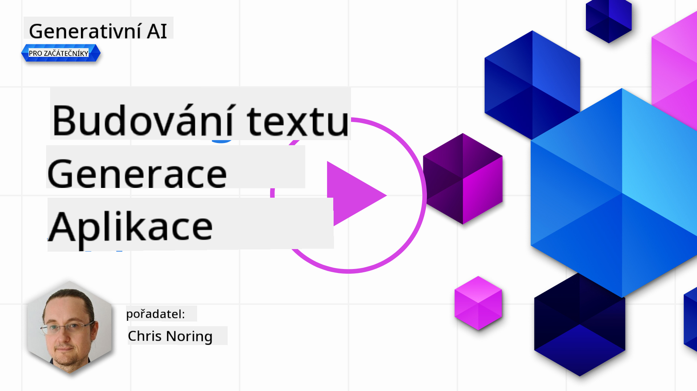

<!--
CO_OP_TRANSLATOR_METADATA:
{
  "original_hash": "5ec6c92b629564538ef397c550adb73e",
  "translation_date": "2025-05-19T17:16:29+00:00",
  "source_file": "06-text-generation-apps/README.md",
  "language_code": "cs"
}
-->
# Vytváření aplikací pro generování textu

[](https://aka.ms/gen-ai-lesson6-gh?WT.mc_id=academic-105485-koreyst)

> _(Klikněte na obrázek výše pro zhlédnutí videa této lekce)_

V tomto kurzu jste již viděli, že existují základní koncepty jako výzvy a dokonce celé odvětví nazývané "inženýrství výzev". Mnoho nástrojů, se kterými můžete pracovat, jako ChatGPT, Office 365, Microsoft Power Platform a další, podporuje používání výzev k dosažení něčeho.

Abyste mohli přidat takovou zkušenost do aplikace, musíte rozumět konceptům jako výzvy, dokončení a vybrat knihovnu, se kterou budete pracovat. Přesně to se naučíte v této kapitole.

## Úvod

V této kapitole se naučíte:

- Zjistit o knihovně openai a jejích základních konceptech.
- Vytvořit aplikaci pro generování textu pomocí openai.
- Pochopit, jak používat koncepty jako výzva, teplota a tokeny pro vytvoření aplikace pro generování textu.

## Cíle učení

Na konci této lekce budete schopni:

- Vysvětlit, co je aplikace pro generování textu.
- Vytvořit aplikaci pro generování textu pomocí openai.
- Konfigurovat svou aplikaci tak, aby používala více či méně tokenů a také měnit teplotu pro různé výsledky.

## Co je aplikace pro generování textu?

Obvykle, když vytváříte aplikaci, má nějaký druh rozhraní jako následující:

- Na příkazové bázi. Konzolové aplikace jsou typické aplikace, kde zadáte příkaz a provede se úkol. Například `git` je aplikace na příkazové bázi.
- Uživatelské rozhraní (UI). Některé aplikace mají grafická uživatelská rozhraní (GUI), kde klikáte na tlačítka, zadáváte text, vybíráte možnosti a další.

### Konzolové a UI aplikace jsou omezené

Porovnejte to s aplikací na příkazové bázi, kde zadáváte příkaz:

- **Je to omezené**. Nemůžete zadat libovolný příkaz, pouze ty, které aplikace podporuje.
- **Jazykově specifické**. Některé aplikace podporují mnoho jazyků, ale ve výchozím nastavení je aplikace vytvořena pro konkrétní jazyk, i když můžete přidat další jazykovou podporu.

### Výhody aplikací pro generování textu

Takže jak se aplikace pro generování textu liší?

V aplikaci pro generování textu máte větší flexibilitu, nejste omezeni na sadu příkazů nebo konkrétní vstupní jazyk. Místo toho můžete používat přirozený jazyk k interakci s aplikací. Další výhodou je, že protože již interagujete se zdrojem dat, který byl vycvičen na obrovském korpusu informací, zatímco tradiční aplikace může být omezená na to, co je v databázi.

### Co mohu vytvořit s aplikací pro generování textu?

Existuje mnoho věcí, které můžete vytvořit. Například:

- **Chatbot**. Chatbot odpovídající na otázky o tématech, jako je vaše společnost a její produkty, by mohl být dobrým řešením.
- **Pomocník**. LLM jsou skvělé na věci jako shrnutí textu, získání poznatků z textu, vytváření textu jako životopisů a další.
- **Asistent pro kód**. V závislosti na jazykovém modelu, který používáte, můžete vytvořit asistenta pro kód, který vám pomůže psát kód. Například můžete použít produkt jako GitHub Copilot i ChatGPT, aby vám pomohly psát kód.

## Jak mohu začít?

Musíte najít způsob, jak se integrovat s LLM, což obvykle zahrnuje následující dva přístupy:

- Použít API. Zde vytváříte webové požadavky s vaší výzvou a získáváte zpět generovaný text.
- Použít knihovnu. Knihovny pomáhají zapouzdřit API volání a usnadnit jejich použití.

## Knihovny/SDK

Existuje několik známých knihoven pro práci s LLM, jako například:

- **openai**, tato knihovna usnadňuje připojení k vašemu modelu a odesílání výzev.

Pak existují knihovny, které fungují na vyšší úrovni, jako například:

- **Langchain**. Langchain je dobře známý a podporuje Python.
- **Semantic Kernel**. Semantic Kernel je knihovna od Microsoftu podporující jazyky C#, Python a Java.

## První aplikace pomocí openai

Podívejme se, jak můžeme vytvořit naši první aplikaci, jaké knihovny potřebujeme, kolik je potřeba a tak dále.

### Instalace openai

Existuje mnoho knihoven pro interakci s OpenAI nebo Azure OpenAI. Je možné použít různé programovací jazyky jako C#, Python, JavaScript, Java a další. Vybrali jsme použití `openai` Python knihovny, takže použijeme `pip` k její instalaci.

```bash
pip install openai
```

### Vytvoření zdroje

Musíte provést následující kroky:

- Vytvořit účet na Azure [https://azure.microsoft.com/free/](https://azure.microsoft.com/free/?WT.mc_id=academic-105485-koreyst).
- Získat přístup k Azure OpenAI. Přejděte na [https://learn.microsoft.com/azure/ai-services/openai/overview#how-do-i-get-access-to-azure-openai](https://learn.microsoft.com/azure/ai-services/openai/overview#how-do-i-get-access-to-azure-openai?WT.mc_id=academic-105485-koreyst) a požádejte o přístup.

  > [!NOTE]
  > V době psaní je potřeba požádat o přístup k Azure OpenAI.

- Nainstalovat Python <https://www.python.org/>
- Vytvořit Azure OpenAI Service zdroj. Podívejte se na tento průvodce, jak [vytvořit zdroj](https://learn.microsoft.com/azure/ai-services/openai/how-to/create-resource?pivots=web-portal?WT.mc_id=academic-105485-koreyst).

### Najít API klíč a koncový bod

V tomto bodě musíte říct své `openai` knihovně, jaký API klíč použít. Chcete-li najít svůj API klíč, přejděte do sekce "Keys and Endpoint" svého Azure OpenAI zdroje a zkopírujte hodnotu "Key 1".


Nyní, když máte tyto informace zkopírovány, pojďme instruovat knihovny, aby je použily.

> [!NOTE]
> Je vhodné oddělit váš API klíč od vašeho kódu. Můžete to udělat pomocí proměnných prostředí.
>
> - Nastavte proměnnou prostředí `OPENAI_API_KEY` to your API key.
>   `export OPENAI_API_KEY='sk-...'`

### Nastavení konfigurace Azure

Pokud používáte Azure OpenAI, zde je návod, jak nastavit konfiguraci:

```python
openai.api_type = 'azure'
openai.api_key = os.environ["OPENAI_API_KEY"]
openai.api_version = '2023-05-15'
openai.api_base = os.getenv("API_BASE")
```

Výše nastavujeme následující:

- `api_type` to `azure`. This tells the library to use Azure OpenAI and not OpenAI.
- `api_key`, this is your API key found in the Azure Portal.
- `api_version`, this is the version of the API you want to use. At the time of writing, the latest version is `2023-05-15`.
- `api_base`, this is the endpoint of the API. You can find it in the Azure Portal next to your API key.

> [!NOTE] > `os.getenv` is a function that reads environment variables. You can use it to read environment variables like `OPENAI_API_KEY` and `API_BASE`. Set these environment variables in your terminal or by using a library like `dotenv`.

## Generate text

The way to generate text is to use the `Completion` třídu. Zde je příklad:

```python
prompt = "Complete the following: Once upon a time there was a"

completion = openai.Completion.create(model="davinci-002", prompt=prompt)
print(completion.choices[0].text)
```

V výše uvedeném kódu vytváříme objekt dokončení a předáváme model, který chceme použít, a výzvu. Poté tiskneme generovaný text.

### Dokončení chatu

Dosud jste viděli, jak jsme používali `Completion` to generate text. But there's another class called `ChatCompletion`, který je více vhodný pro chatboty. Zde je příklad jeho použití:

```python
import openai

openai.api_key = "sk-..."

completion = openai.ChatCompletion.create(model="gpt-3.5-turbo", messages=[{"role": "user", "content": "Hello world"}])
print(completion.choices[0].message.content)
```

Více o této funkci v nadcházející kapitole.

## Cvičení - vaše první aplikace pro generování textu

Nyní, když jsme se naučili, jak nastavit a konfigurovat openai, je čas vytvořit vaši první aplikaci pro generování textu. Chcete-li vytvořit svou aplikaci, postupujte podle těchto kroků:

1. Vytvořte virtuální prostředí a nainstalujte openai:

   ```bash
   python -m venv venv
   source venv/bin/activate
   pip install openai
   ```

   > [!NOTE]
   > Pokud používáte Windows, zadejte `venv\Scripts\activate` instead of `source venv/bin/activate`.

   > [!NOTE]
   > Locate your Azure OpenAI key by going to [https://portal.azure.com/](https://portal.azure.com/?WT.mc_id=academic-105485-koreyst) and search for `Open AI` and select the `Open AI resource` and then select `Keys and Endpoint` and copy the `Key 1` hodnotu.

1. Vytvořte soubor _app.py_ a vložte do něj následující kód:

   ```python
   import openai

   openai.api_key = "<replace this value with your open ai key or Azure OpenAI key>"

   openai.api_type = 'azure'
   openai.api_version = '2023-05-15'
   openai.api_base = "<endpoint found in Azure Portal where your API key is>"
   deployment_name = "<deployment name>"

   # add your completion code
   prompt = "Complete the following: Once upon a time there was a"
   messages = [{"role": "user", "content": prompt}]

   # make completion
   completion = openai.chat.completions.create(model=deployment_name, messages=messages)

   # print response
   print(completion.choices[0].message.content)
   ```

   > [!NOTE]
   > Pokud používáte Azure OpenAI, musíte nastavit `api_type` to `azure` and set the `api_key` na váš Azure OpenAI klíč.

   Měli byste vidět výstup podobný následujícímu:

   ```output
    very unhappy _____.

   Once upon a time there was a very unhappy mermaid.
   ```

## Různé typy výzev pro různé věci

Nyní jste viděli, jak generovat text pomocí výzvy. Dokonce máte program, který můžete upravit a změnit pro generování různých typů textu.

Výzvy lze použít pro různé úkoly. Například:

- **Generovat typ textu**. Například můžete generovat báseň, otázky pro kvíz atd.
- **Vyhledávání informací**. Můžete použít výzvy k hledání informací jako například 'Co znamená CORS ve webovém vývoji?'.
- **Generovat kód**. Můžete použít výzvy k generování kódu, například vývoj regulárního výrazu pro ověření e-mailů nebo proč ne generovat celý program, jako webovou aplikaci?

## Praktické použití: generátor receptů

Představte si, že máte doma ingredience a chcete něco uvařit. K tomu potřebujete recept. Způsob, jak najít recepty, je použít vyhledávač nebo můžete použít LLM k tomu.

Můžete napsat výzvu takto:

> "Ukaž mi 5 receptů na pokrm s následujícími ingrediencemi: kuře, brambory a mrkev. Pro každý recept uveďte všechny použité ingredience"

Na základě výše uvedené výzvy můžete dostat odpověď podobnou:

```output
1. Roasted Chicken and Vegetables:
Ingredients:
- 4 chicken thighs
- 2 potatoes, cut into cubes
- 2 carrots, cut into cubes
- 2 tablespoons olive oil
- 2 cloves garlic, minced
- 1 teaspoon dried thyme
- 1 teaspoon dried oregano
- Salt and pepper, to taste

2. Chicken and Potato Stew:
Ingredients:
- 2 tablespoons olive oil
- 1 onion, diced
- 2 cloves garlic, minced
- 2 chicken breasts, cut into cubes
- 2 potatoes, cut into cubes
- 2 carrots, cut into cubes
- 1 teaspoon dried oregano
- 1 teaspoon dried thyme
- 1 cup chicken broth
- Salt and pepper, to taste

3. Chicken and Potato Bake:
Ingredients:
- 2 tablespoons olive oil
- 2 chicken breasts, cut into cubes
- 2 potatoes, cut into cubes
- 2 carrots, cut into cubes
- 1 onion, diced
- 2 cloves garlic, minced
- 1 teaspoon dried oregano
- 1 teaspoon dried thyme
- 1 cup chicken broth
- Salt and pepper, to taste

4. Chicken and Potato Soup:
Ingredients:
- 2 tablespoons olive oil
- 1 onion, diced
- 2 cloves garlic, minced
- 2 chicken breasts, cut into cubes
- 2 potatoes, cut into cubes
- 2 carrots, cut into cubes
- 1 teaspoon dried oregano
- 1 teaspoon dried thyme
- 4 cups chicken broth
- Salt and pepper, to taste

5. Chicken and Potato Hash:
Ingredients:
- 2 tablespoons olive oil
- 2 chicken breasts, cut into cubes
- 2 potatoes, cut into cubes
- 2 carrots, cut into cubes
- 1 onion, diced
- 2 cloves garlic, minced
- 1 teaspoon dried oregano
```

Tento výsledek je skvělý, vím, co vařit. V tomto bodě by mohly být užitečné následující vylepšení:

- Filtrace ingrediencí, které nemám rád nebo na které jsem alergický.
- Vytvoření nákupního seznamu, pokud nemám všechny ingredience doma.

Pro výše uvedené případy přidejme další výzvu:

> "Prosím, odstraňte recepty s česnekem, protože jsem alergický, a nahraďte ho něčím jiným. Také prosím vytvořte nákupní seznam pro recepty, s ohledem na to, že už mám doma kuře, brambory a mrkev."

Nyní máte nový výsledek, totiž:

```output
1. Roasted Chicken and Vegetables:
Ingredients:
- 4 chicken thighs
- 2 potatoes, cut into cubes
- 2 carrots, cut into cubes
- 2 tablespoons olive oil
- 1 teaspoon dried thyme
- 1 teaspoon dried oregano
- Salt and pepper, to taste

2. Chicken and Potato Stew:
Ingredients:
- 2 tablespoons olive oil
- 1 onion, diced
- 2 chicken breasts, cut into cubes
- 2 potatoes, cut into cubes
- 2 carrots, cut into cubes
- 1 teaspoon dried oregano
- 1 teaspoon dried thyme
- 1 cup chicken broth
- Salt and pepper, to taste

3. Chicken and Potato Bake:
Ingredients:
- 2 tablespoons olive oil
- 2 chicken breasts, cut into cubes
- 2 potatoes, cut into cubes
- 2 carrots, cut into cubes
- 1 onion, diced
- 1 teaspoon dried oregano
- 1 teaspoon dried thyme
- 1 cup chicken broth
- Salt and pepper, to taste

4. Chicken and Potato Soup:
Ingredients:
- 2 tablespoons olive oil
- 1 onion, diced
- 2 chicken breasts, cut into cubes
- 2 potatoes, cut into cubes
- 2 carrots, cut into cubes
- 1 teaspoon dried oregano
- 1 teaspoon dried thyme
- 4 cups chicken broth
- Salt and pepper, to taste

5. Chicken and Potato Hash:
Ingredients:
- 2 tablespoons olive oil
- 2 chicken breasts, cut into cubes
- 2 potatoes, cut into cubes
- 2 carrots, cut into cubes
- 1 onion, diced
- 1 teaspoon dried oregano

Shopping List:
- Olive oil
- Onion
- Thyme
- Oregano
- Salt
- Pepper
```

To jsou vaše pět receptů, bez zmínky o česneku a máte také nákupní seznam s ohledem na to, co už máte doma.

## Cvičení - vytvoření generátoru receptů

Nyní, když jsme si prošli scénář, napišme kód, který odpovídá demonstrovanému scénáři. Chcete-li to udělat, postupujte podle těchto kroků:

1. Použijte existující soubor _app.py_ jako výchozí bod
1. Najděte proměnnou `prompt` a změňte její kód na následující:

   ```python
   prompt = "Show me 5 recipes for a dish with the following ingredients: chicken, potatoes, and carrots. Per recipe, list all the ingredients used"
   ```

   Pokud nyní spustíte kód, měli byste vidět výstup podobný:

   ```output
   -Chicken Stew with Potatoes and Carrots: 3 tablespoons oil, 1 onion, chopped, 2 cloves garlic, minced, 1 carrot, peeled and chopped, 1 potato, peeled and chopped, 1 bay leaf, 1 thyme sprig, 1/2 teaspoon salt, 1/4 teaspoon black pepper, 1 1/2 cups chicken broth, 1/2 cup dry white wine, 2 tablespoons chopped fresh parsley, 2 tablespoons unsalted butter, 1 1/2 pounds boneless, skinless chicken thighs, cut into 1-inch pieces
   -Oven-Roasted Chicken with Potatoes and Carrots: 3 tablespoons extra-virgin olive oil, 1 tablespoon Dijon mustard, 1 tablespoon chopped fresh rosemary, 1 tablespoon chopped fresh thyme, 4 cloves garlic, minced, 1 1/2 pounds small red potatoes, quartered, 1 1/2 pounds carrots, quartered lengthwise, 1/2 teaspoon salt, 1/4 teaspoon black pepper, 1 (4-pound) whole chicken
   -Chicken, Potato, and Carrot Casserole: cooking spray, 1 large onion, chopped, 2 cloves garlic, minced, 1 carrot, peeled and shredded, 1 potato, peeled and shredded, 1/2 teaspoon dried thyme leaves, 1/4 teaspoon salt, 1/4 teaspoon black pepper, 2 cups fat-free, low-sodium chicken broth, 1 cup frozen peas, 1/4 cup all-purpose flour, 1 cup 2% reduced-fat milk, 1/4 cup grated Parmesan cheese

   -One Pot Chicken and Potato Dinner: 2 tablespoons olive oil, 1 pound boneless, skinless chicken thighs, cut into 1-inch pieces, 1 large onion, chopped, 3 cloves garlic, minced, 1 carrot, peeled and chopped, 1 potato, peeled and chopped, 1 bay leaf, 1 thyme sprig, 1/2 teaspoon salt, 1/4 teaspoon black pepper, 2 cups chicken broth, 1/2 cup dry white wine

   -Chicken, Potato, and Carrot Curry: 1 tablespoon vegetable oil, 1 large onion, chopped, 2 cloves garlic, minced, 1 carrot, peeled and chopped, 1 potato, peeled and chopped, 1 teaspoon ground coriander, 1 teaspoon ground cumin, 1/2 teaspoon ground turmeric, 1/2 teaspoon ground ginger, 1/4 teaspoon cayenne pepper, 2 cups chicken broth, 1/2 cup dry white wine, 1 (15-ounce) can chickpeas, drained and rinsed, 1/2 cup raisins, 1/2 cup chopped fresh cilantro
   ```

   > NOTE, váš LLM je nedeterministický, takže můžete dostat různé výsledky pokaždé, když spustíte program.

   Skvělé, podívejme se, jak můžeme věci zlepšit. Abychom věci zlepšili, chceme se ujistit, že kód je flexibilní, takže ingredience a počet receptů mohou být zlepšeny a změněny.

1. Změňme kód následujícím způsobem:

   ```python
   no_recipes = input("No of recipes (for example, 5): ")

   ingredients = input("List of ingredients (for example, chicken, potatoes, and carrots): ")

   # interpolate the number of recipes into the prompt an ingredients
   prompt = f"Show me {no_recipes} recipes for a dish with the following ingredients: {ingredients}. Per recipe, list all the ingredients used"
   ```

   Testování kódu může vypadat takto:

   ```output
   No of recipes (for example, 5): 3
   List of ingredients (for example, chicken, potatoes, and carrots): milk,strawberries

   -Strawberry milk shake: milk, strawberries, sugar, vanilla extract, ice cubes
   -Strawberry shortcake: milk, flour, baking powder, sugar, salt, unsalted butter, strawberries, whipped cream
   -Strawberry milk: milk, strawberries, sugar, vanilla extract
   ```

### Vylepšení přidáním filtru a nákupního seznamu

Nyní máme funkční aplikaci schopnou vytvářet recepty a je flexibilní, protože se spoléhá na vstupy od uživatele, jak na počet receptů, tak i na použité ingredience.

Abychom to dále zlepšili, chceme přidat následující:

- **Filtrování ingrediencí**. Chceme být schopni filtrovat ingredience, které nemáme rádi nebo na které jsme alergičtí. Abychom tuto změnu provedli, můžeme upravit naši existující výzvu a přidat podmínku filtru na její konec takto:

  ```python
  filter = input("Filter (for example, vegetarian, vegan, or gluten-free): ")

  prompt = f"Show me {no_recipes} recipes for a dish with the following ingredients: {ingredients}. Per recipe, list all the ingredients used, no {filter}"
  ```

  Výše přidáváme `{filter}` na konec výzvy a také zachycujeme hodnotu filtru od uživatele.

  Příklad vstupu při spuštění programu může nyní vypadat takto:

  ```output
  No of recipes (for example, 5): 3
  List of ingredients (for example, chicken, potatoes, and carrots): onion,milk
  Filter (for example, vegetarian, vegan, or gluten-free): no milk

  1. French Onion Soup

  Ingredients:

  -1 large onion, sliced
  -3 cups beef broth
  -1 cup milk
  -6 slices french bread
  -1/4 cup shredded Parmesan cheese
  -1 tablespoon butter
  -1 teaspoon dried thyme
  -1/4 teaspoon salt
  -1/4 teaspoon black pepper

  Instructions:

  1. In a large pot, sauté onions in butter until golden brown.
  2. Add beef broth, milk, thyme, salt, and pepper. Bring to a boil.
  3. Reduce heat and simmer for 10 minutes.
  4. Place french bread slices on soup bowls.
  5. Ladle soup over bread.
  6. Sprinkle with Parmesan cheese.

  2. Onion and Potato Soup

  Ingredients:

  -1 large onion, chopped
  -2 cups potatoes, diced
  -3 cups vegetable broth
  -1 cup milk
  -1/4 teaspoon black pepper

  Instructions:

  1. In a large pot, sauté onions in butter until golden brown.
  2. Add potatoes, vegetable broth, milk, and pepper. Bring to a boil.
  3. Reduce heat and simmer for 10 minutes.
  4. Serve hot.

  3. Creamy Onion Soup

  Ingredients:

  -1 large onion, chopped
  -3 cups vegetable broth
  -1 cup milk
  -1/4 teaspoon black pepper
  -1/4 cup all-purpose flour
  -1/2 cup shredded Parmesan cheese

  Instructions:

  1. In a large pot, sauté onions in butter until golden brown.
  2. Add vegetable broth, milk, and pepper. Bring to a boil.
  3. Reduce heat and simmer for 10 minutes.
  4. In a small bowl, whisk together flour and Parmesan cheese until smooth.
  5. Add to soup and simmer for an additional 5 minutes, or until soup has thickened.
  ```

  Jak vidíte, všechny recepty s mlékem byly filtrovány. Ale pokud jste intolerantní na laktózu, možná budete chtít filtrovat i recepty s sýrem, takže je potřeba být jasný.

- **Vytvoření nákupního seznamu**. Chceme vytvořit nákupní seznam s ohledem na to, co už máme doma.

  Pro tuto funkci bychom mohli buď zkusit vyřešit vše v jedné výzvě, nebo bychom to mohli rozdělit na dvě výzvy. Zkusme druhý přístup. Zde navrhujeme přidat další výzvu, ale aby to fungovalo, musíme přidat výsledek první výzvy jako kontext pro druhou výzvu.

  Najděte část kódu, která tiskne výsledek první výzvy a přidejte následující kód níže:

  ```python
  old_prompt_result = completion.choices[0].message.content
  prompt = "Produce a shopping list for the generated recipes and please don't include ingredients that I already have."

  new_prompt = f"{old_prompt_result} {prompt}"
  messages = [{"role": "user", "content": new_prompt}]
  completion = openai.Completion.create(engine=deployment_name, messages=messages, max_tokens=1200)

  # print response
  print("Shopping list:")
  print(completion.choices[0].message.content)
  ```

  Poznamenejte si následující:

  1. Konstruujeme novou výzvu přidáním výsledku z první výzvy do nové výzvy:

     ```python
     new_prompt = f"{old_prompt_result} {prompt}"
     ```

  1. Děláme nový požadavek, ale také s ohledem na počet tokenů, které jsme požádali v první výzvě, takže tentokrát říkáme `max_tokens` je 1200.

     ```python
     completion = openai.Completion.create(engine=deployment_name, prompt=new_prompt, max_tokens=1200)
     ```

     Testování tohoto kódu nás nyní přivádí k následujícímu výstupu:

     ```output
     No of recipes (for example, 5): 2
     List of ingredients (for example, chicken, potatoes, and carrots): apple,flour
     Filter (for example, vegetarian, vegan, or gluten-free): sugar


     -Apple and flour pancakes: 1 cup flour, 1/2 tsp baking powder, 1/2 tsp baking soda, 1/4 tsp salt, 1 tbsp sugar, 1 egg, 1 cup buttermilk or sour milk, 1/4 cup melted butter, 1 Granny Smith apple, peeled and grated
     -Apple fritters: 1-1/2 cups flour, 1 tsp baking powder, 1/4 tsp salt, 1/4 tsp baking soda, 1/4 tsp nutmeg, 1/4 tsp cinnamon, 1/4 tsp allspice, 1/4 cup sugar, 1/4 cup vegetable shortening, 1/4 cup milk, 1 egg, 2 cups shredded, peeled apples
     Shopping list:
     -Flour, baking powder, baking soda, salt, sugar, egg, buttermilk, butter, apple, nutmeg, cinnamon, allspice
     ```

## Zlepšení vašeho nastavení

Co máme dosud, je kód, který funguje, ale existují některé úpravy, které bychom měli udělat, abychom věci dále zlepšili. Některé věci, které bychom měli udělat, jsou:

- **Oddělit tajemství od kódu**, jako je API klíč. Tajemství nepatří do kódu a měla by být uložena na bezpečném místě. Abychom oddělili tajemství od kódu, můžeme použít proměnné prostředí a knihovny jako `python-dotenv` to load them from a file. Here's how that would look like in code:

  1. Create a `.env` soubor s následujícím obsahem:

     ```bash
     OPENAI_API_KEY=sk-...
     ```

     > Poznámka, pro Azure, musíte nastavit následující proměnné prostředí:

     ```bash
     OPENAI_API_TYPE=azure
     OPENAI_API_VERSION=2023-05-15
     OPENAI_API_BASE=<replace>
     ```

     V kódu byste načetli proměnné prostředí takto:

     ```python
     from dotenv import load_dotenv

     load_dotenv()

     openai.api_key = os.environ["OPENAI_API_KEY"]
     ```

- **Slovo o délce tokenů**. Měli bychom zvážit, kolik tokenů potřebujeme k vygenerování textu, který chceme. Tokeny stojí peníze, takže kde je to možné, měli bychom se snažit být ekonomičtí s počtem tokenů, které používáme. Například, můžeme formulovat výzvu tak, abychom mohli použít méně tokenů?

  Chcete-li změnit použité tokeny, můžete použít parametr `max_tokens`. Například

**Prohlášení**:  
Tento dokument byl přeložen pomocí služby pro automatický překlad [Co-op Translator](https://github.com/Azure/co-op-translator). Přestože se snažíme o přesnost, mějte na paměti, že automatické překlady mohou obsahovat chyby nebo nepřesnosti. Původní dokument v jeho původním jazyce by měl být považován za závazný zdroj. Pro důležité informace doporučujeme profesionální lidský překlad. Nejsme odpovědní za žádná nedorozumění nebo nesprávné interpretace vyplývající z použití tohoto překladu.