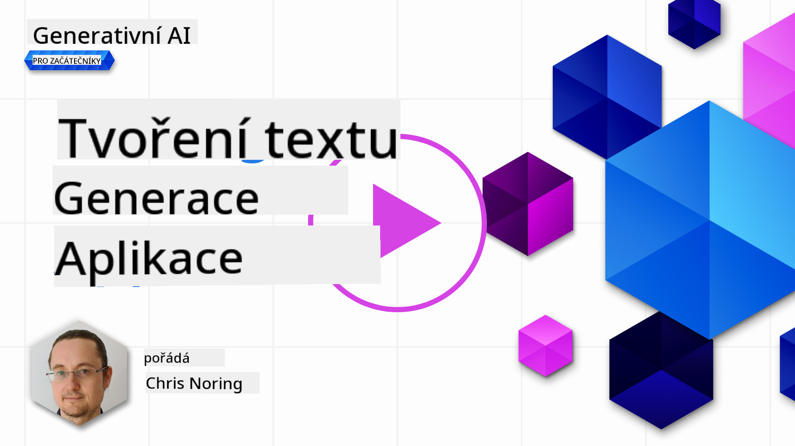

<!--
CO_OP_TRANSLATOR_METADATA:
{
  "original_hash": "5ec6c92b629564538ef397c550adb73e",
  "translation_date": "2025-06-25T14:45:44+00:00",
  "source_file": "06-text-generation-apps/README.md",
  "language_code": "cs"
}
-->
# Vytváření aplikací pro generování textu

[](https://aka.ms/gen-ai-lesson6-gh?WT.mc_id=academic-105485-koreyst)

> _(Klikněte na obrázek výše pro zhlédnutí videa této lekce)_

V tomto kurzu jste se již setkali se základními koncepty jako jsou prompty a dokonce i celou disciplínou zvanou "prompt engineering". Mnoho nástrojů, se kterými můžete interagovat, jako ChatGPT, Office 365, Microsoft Power Platform a další, vás podporuje v používání promptů k dosažení něčeho.

Abyste mohli přidat takovou zkušenost do aplikace, musíte pochopit koncepty jako prompty, dokončení a vybrat knihovnu, se kterou budete pracovat. Přesně to se naučíte v této kapitole.

## Úvod

V této kapitole se dozvíte:

- O knihovně openai a jejích základních konceptech.
- Jak vytvořit aplikaci pro generování textu pomocí openai.
- Jak používat koncepty jako prompt, teplota a tokeny k vytvoření aplikace pro generování textu.

## Cíle učení

Na konci této lekce budete schopni:

- Vysvětlit, co je aplikace pro generování textu.
- Vytvořit aplikaci pro generování textu pomocí openai.
- Konfigurovat svou aplikaci tak, aby používala více nebo méně tokenů a také měnit teplotu pro různorodý výstup.

## Co je to aplikace pro generování textu?

Normálně, když vytváříte aplikaci, má nějaký druh rozhraní, jako například:

- Na příkazech založené. Konzolové aplikace jsou typické aplikace, kde zadáváte příkaz a ten vykoná úkol. Například `git` je aplikace založená na příkazech.
- Uživatelské rozhraní (UI). Některé aplikace mají grafické uživatelské rozhraní (GUI), kde klikáte na tlačítka, zadáváte text, vybíráte možnosti a další.

### Konzolové a UI aplikace jsou omezené

Porovnejte to s aplikací založenou na příkazech, kde zadáváte příkaz:

- **Je omezená**. Nemůžete zadat libovolný příkaz, pouze ty, které aplikace podporuje.
- **Jazykově specifická**. Některé aplikace podporují mnoho jazyků, ale ve výchozím nastavení je aplikace vytvořena pro konkrétní jazyk, i když můžete přidat další jazykovou podporu.

### Výhody aplikací pro generování textu

Jak se tedy aplikace pro generování textu liší?

V aplikaci pro generování textu máte větší flexibilitu, nejste omezeni na sadu příkazů nebo konkrétní vstupní jazyk. Místo toho můžete používat přirozený jazyk k interakci s aplikací. Další výhodou je, že protože již interagujete se zdrojem dat, který byl vyškolen na rozsáhlém korpusu informací, tradiční aplikace může být omezena na to, co je v databázi.

### Co mohu vytvořit s aplikací pro generování textu?

Existuje mnoho věcí, které můžete vytvořit. Například:

- **Chatbot**. Chatbot odpovídající na otázky o tématech, jako je vaše společnost a její produkty, by mohl být dobrým příkladem.
- **Pomocník**. LLM jsou skvělé pro věci jako shrnutí textu, získání poznatků z textu, produkci textu jako životopisy a další.
- **Asistent pro kódování**. V závislosti na jazykovém modelu, který používáte, můžete vytvořit asistenta pro kódování, který vám pomůže psát kód. Například můžete použít produkt jako GitHub Copilot stejně jako ChatGPT k pomoci s psaním kódu.

## Jak mohu začít?

Musíte najít způsob, jak se integrovat s LLM, což obvykle zahrnuje následující dva přístupy:

- Použijte API. Zde vytváříte webové požadavky se svým promptem a získáváte vygenerovaný text zpět.
- Použijte knihovnu. Knihovny pomáhají zapouzdřit volání API a usnadnit jejich použití.

## Knihovny/SDK

Existuje několik dobře známých knihoven pro práci s LLM jako:

- **openai**, tato knihovna usnadňuje připojení k vašemu modelu a odesílání promptů.

Pak jsou knihovny, které fungují na vyšší úrovni jako:

- **Langchain**. Langchain je dobře známý a podporuje Python.
- **Semantic Kernel**. Semantic Kernel je knihovna od Microsoftu podporující jazyky C#, Python a Java.

## První aplikace pomocí openai

Podívejme se, jak můžeme vytvořit naši první aplikaci, jaké knihovny potřebujeme, kolik je potřeba a tak dále.

### Instalace openai

Existuje mnoho knihoven pro interakci s OpenAI nebo Azure OpenAI. Je možné použít různé programovací jazyky jako C#, Python, JavaScript, Java a další. Rozhodli jsme se použít knihovnu `openai` Python, takže použijeme `pip` k její instalaci.

```bash
pip install openai
```

### Vytvoření zdroje

Musíte provést následující kroky:

- Vytvořte si účet na Azure [https://azure.microsoft.com/free/](https://azure.microsoft.com/free/?WT.mc_id=academic-105485-koreyst).
- Získejte přístup k Azure OpenAI. Přejděte na [https://learn.microsoft.com/azure/ai-services/openai/overview#how-do-i-get-access-to-azure-openai](https://learn.microsoft.com/azure/ai-services/openai/overview#how-do-i-get-access-to-azure-openai?WT.mc_id=academic-105485-koreyst) a požádejte o přístup.

  > [!NOTE]
  > V době psaní je třeba požádat o přístup k Azure OpenAI.

- Nainstalujte Python <https://www.python.org/>
- Vytvořte si zdroj služby Azure OpenAI. Podívejte se na tento návod, jak [vytvořit zdroj](https://learn.microsoft.com/azure/ai-services/openai/how-to/create-resource?pivots=web-portal?WT.mc_id=academic-105485-koreyst).

### Najděte API klíč a koncový bod

V tomto bodě musíte sdělit vaší knihovně `openai`, jaký API klíč použít. Chcete-li najít svůj API klíč, přejděte do sekce "Keys and Endpoint" ve vašem Azure OpenAI zdroji a zkopírujte hodnotu "Key 1".


Nyní, když máte tyto informace zkopírované, pojďme instruovat knihovny, aby je používaly.

> [!NOTE]
> Stojí za to oddělit váš API klíč od vašeho kódu. Můžete to udělat pomocí proměnných prostředí.
>
> - Nastavte proměnnou prostředí `OPENAI_API_KEY` to your API key.
>   `export OPENAI_API_KEY='sk-...'`

### Nastavení konfigurace Azure

Pokud používáte Azure OpenAI, zde je, jak nastavit konfiguraci:

```python
openai.api_type = 'azure'
openai.api_key = os.environ["OPENAI_API_KEY"]
openai.api_version = '2023-05-15'
openai.api_base = os.getenv("API_BASE")
```

Výše nastavujeme následující:

- `api_type` to `azure`. This tells the library to use Azure OpenAI and not OpenAI.
- `api_key`, this is your API key found in the Azure Portal.
- `api_version`, this is the version of the API you want to use. At the time of writing, the latest version is `2023-05-15`.
- `api_base`, this is the endpoint of the API. You can find it in the Azure Portal next to your API key.

> [!NOTE] > `os.getenv` is a function that reads environment variables. You can use it to read environment variables like `OPENAI_API_KEY` and `API_BASE`. Set these environment variables in your terminal or by using a library like `dotenv`.

## Generate text

The way to generate text is to use the `Completion` třída. Zde je příklad:

```python
prompt = "Complete the following: Once upon a time there was a"

completion = openai.Completion.create(model="davinci-002", prompt=prompt)
print(completion.choices[0].text)
```

V kódu výše vytvoříme objekt dokončení a předáme mu model, který chceme použít, a prompt. Poté vytiskneme vygenerovaný text.

### Dokončení chatu

Doposud jste viděli, jak jsme používali `Completion` to generate text. But there's another class called `ChatCompletion`, což je více vhodné pro chatboty. Zde je příklad jeho použití:

```python
import openai

openai.api_key = "sk-..."

completion = openai.ChatCompletion.create(model="gpt-3.5-turbo", messages=[{"role": "user", "content": "Hello world"}])
print(completion.choices[0].message.content)
```

Více o této funkci v nadcházející kapitole.

## Cvičení - vaše první aplikace pro generování textu

Nyní, když jsme se naučili, jak nastavit a konfigurovat openai, je čas vytvořit vaši první aplikaci pro generování textu. Postupujte podle těchto kroků:

1. Vytvořte virtuální prostředí a nainstalujte openai:

   ```bash
   python -m venv venv
   source venv/bin/activate
   pip install openai
   ```

   > [!NOTE]
   > Pokud používáte Windows, napište `venv\Scripts\activate` instead of `source venv/bin/activate`.

   > [!NOTE]
   > Locate your Azure OpenAI key by going to [https://portal.azure.com/](https://portal.azure.com/?WT.mc_id=academic-105485-koreyst) and search for `Open AI` and select the `Open AI resource` and then select `Keys and Endpoint` and copy the `Key 1` hodnotu.

1. Vytvořte soubor _app.py_ a vložte do něj následující kód:

   ```python
   import openai

   openai.api_key = "<replace this value with your open ai key or Azure OpenAI key>"

   openai.api_type = 'azure'
   openai.api_version = '2023-05-15'
   openai.api_base = "<endpoint found in Azure Portal where your API key is>"
   deployment_name = "<deployment name>"

   # add your completion code
   prompt = "Complete the following: Once upon a time there was a"
   messages = [{"role": "user", "content": prompt}]

   # make completion
   completion = openai.chat.completions.create(model=deployment_name, messages=messages)

   # print response
   print(completion.choices[0].message.content)
   ```

   > [!NOTE]
   > Pokud používáte Azure OpenAI, musíte nastavit `api_type` to `azure` and set the `api_key` na váš Azure OpenAI klíč.

   Měli byste vidět výstup podobný následujícímu:

   ```output
    very unhappy _____.

   Once upon a time there was a very unhappy mermaid.
   ```

## Různé typy promptů pro různé věci

Nyní jste viděli, jak generovat text pomocí promptu. Dokonce máte spuštěný program, který můžete upravit a změnit pro generování různých typů textu.

Prompty lze použít pro všechny druhy úkolů. Například:

- **Generování typu textu**. Například můžete generovat báseň, otázky pro kvíz atd.
- **Vyhledávání informací**. Můžete použít prompty k vyhledávání informací, například 'Co znamená CORS ve webovém vývoji?'.
- **Generování kódu**. Můžete použít prompty k generování kódu, například vývoj regulárního výrazu používaného k validaci e-mailů nebo proč ne generovat celý program, jako je webová aplikace?

## Praktické použití: generátor receptů

Představte si, že máte doma ingredience a chcete něco uvařit. K tomu potřebujete recept. Jedním ze způsobů, jak najít recepty, je použít vyhledávač, nebo můžete použít LLM.

Můžete napsat prompt jako:

> "Ukaž mi 5 receptů na jídlo s následujícími ingrediencemi: kuře, brambory a mrkev. U každého receptu uveď všechny použité ingredience"

Na základě výše uvedeného promptu můžete dostat odpověď podobnou:

```output
1. Roasted Chicken and Vegetables:
Ingredients:
- 4 chicken thighs
- 2 potatoes, cut into cubes
- 2 carrots, cut into cubes
- 2 tablespoons olive oil
- 2 cloves garlic, minced
- 1 teaspoon dried thyme
- 1 teaspoon dried oregano
- Salt and pepper, to taste

2. Chicken and Potato Stew:
Ingredients:
- 2 tablespoons olive oil
- 1 onion, diced
- 2 cloves garlic, minced
- 2 chicken breasts, cut into cubes
- 2 potatoes, cut into cubes
- 2 carrots, cut into cubes
- 1 teaspoon dried oregano
- 1 teaspoon dried thyme
- 1 cup chicken broth
- Salt and pepper, to taste

3. Chicken and Potato Bake:
Ingredients:
- 2 tablespoons olive oil
- 2 chicken breasts, cut into cubes
- 2 potatoes, cut into cubes
- 2 carrots, cut into cubes
- 1 onion, diced
- 2 cloves garlic, minced
- 1 teaspoon dried oregano
- 1 teaspoon dried thyme
- 1 cup chicken broth
- Salt and pepper, to taste

4. Chicken and Potato Soup:
Ingredients:
- 2 tablespoons olive oil
- 1 onion, diced
- 2 cloves garlic, minced
- 2 chicken breasts, cut into cubes
- 2 potatoes, cut into cubes
- 2 carrots, cut into cubes
- 1 teaspoon dried oregano
- 1 teaspoon dried thyme
- 4 cups chicken broth
- Salt and pepper, to taste

5. Chicken and Potato Hash:
Ingredients:
- 2 tablespoons olive oil
- 2 chicken breasts, cut into cubes
- 2 potatoes, cut into cubes
- 2 carrots, cut into cubes
- 1 onion, diced
- 2 cloves garlic, minced
- 1 teaspoon dried oregano
```

Tento výsledek je skvělý, vím, co vařit. V tomto bodě by užitečnými vylepšeními mohly být:

- Filtrování ingrediencí, které nemám rád nebo na které mám alergii.
- Vytvoření nákupního seznamu, pokud nemám všechny ingredience doma.

Pro výše uvedené případy přidáme další prompt:

> "Prosím, odstraňte recepty s česnekem, protože jsem na něj alergický, a nahraďte ho něčím jiným. Také prosím vytvořte nákupní seznam pro recepty, s ohledem na to, že již mám doma kuře, brambory a mrkev."

Nyní máte nový výsledek, konkrétně:

```output
1. Roasted Chicken and Vegetables:
Ingredients:
- 4 chicken thighs
- 2 potatoes, cut into cubes
- 2 carrots, cut into cubes
- 2 tablespoons olive oil
- 1 teaspoon dried thyme
- 1 teaspoon dried oregano
- Salt and pepper, to taste

2. Chicken and Potato Stew:
Ingredients:
- 2 tablespoons olive oil
- 1 onion, diced
- 2 chicken breasts, cut into cubes
- 2 potatoes, cut into cubes
- 2 carrots, cut into cubes
- 1 teaspoon dried oregano
- 1 teaspoon dried thyme
- 1 cup chicken broth
- Salt and pepper, to taste

3. Chicken and Potato Bake:
Ingredients:
- 2 tablespoons olive oil
- 2 chicken breasts, cut into cubes
- 2 potatoes, cut into cubes
- 2 carrots, cut into cubes
- 1 onion, diced
- 1 teaspoon dried oregano
- 1 teaspoon dried thyme
- 1 cup chicken broth
- Salt and pepper, to taste

4. Chicken and Potato Soup:
Ingredients:
- 2 tablespoons olive oil
- 1 onion, diced
- 2 chicken breasts, cut into cubes
- 2 potatoes, cut into cubes
- 2 carrots, cut into cubes
- 1 teaspoon dried oregano
- 1 teaspoon dried thyme
- 4 cups chicken broth
- Salt and pepper, to taste

5. Chicken and Potato Hash:
Ingredients:
- 2 tablespoons olive oil
- 2 chicken breasts, cut into cubes
- 2 potatoes, cut into cubes
- 2 carrots, cut into cubes
- 1 onion, diced
- 1 teaspoon dried oregano

Shopping List:
- Olive oil
- Onion
- Thyme
- Oregano
- Salt
- Pepper
```

To je vašich pět receptů, bez zmínky o česneku a také máte nákupní seznam s ohledem na to, co již máte doma.

## Cvičení - vytvořte generátor receptů

Nyní, když jsme si zahráli scénář, napišme kód, který odpovídá předvedenému scénáři. Postupujte podle těchto kroků:

1. Použijte existující soubor _app.py_ jako výchozí bod
1. Najděte proměnnou `prompt` a změňte její kód na následující:

   ```python
   prompt = "Show me 5 recipes for a dish with the following ingredients: chicken, potatoes, and carrots. Per recipe, list all the ingredients used"
   ```

   Pokud nyní spustíte kód, měli byste vidět výstup podobný:

   ```output
   -Chicken Stew with Potatoes and Carrots: 3 tablespoons oil, 1 onion, chopped, 2 cloves garlic, minced, 1 carrot, peeled and chopped, 1 potato, peeled and chopped, 1 bay leaf, 1 thyme sprig, 1/2 teaspoon salt, 1/4 teaspoon black pepper, 1 1/2 cups chicken broth, 1/2 cup dry white wine, 2 tablespoons chopped fresh parsley, 2 tablespoons unsalted butter, 1 1/2 pounds boneless, skinless chicken thighs, cut into 1-inch pieces
   -Oven-Roasted Chicken with Potatoes and Carrots: 3 tablespoons extra-virgin olive oil, 1 tablespoon Dijon mustard, 1 tablespoon chopped fresh rosemary, 1 tablespoon chopped fresh thyme, 4 cloves garlic, minced, 1 1/2 pounds small red potatoes, quartered, 1 1/2 pounds carrots, quartered lengthwise, 1/2 teaspoon salt, 1/4 teaspoon black pepper, 1 (4-pound) whole chicken
   -Chicken, Potato, and Carrot Casserole: cooking spray, 1 large onion, chopped, 2 cloves garlic, minced, 1 carrot, peeled and shredded, 1 potato, peeled and shredded, 1/2 teaspoon dried thyme leaves, 1/4 teaspoon salt, 1/4 teaspoon black pepper, 2 cups fat-free, low-sodium chicken broth, 1 cup frozen peas, 1/4 cup all-purpose flour, 1 cup 2% reduced-fat milk, 1/4 cup grated Parmesan cheese

   -One Pot Chicken and Potato Dinner: 2 tablespoons olive oil, 1 pound boneless, skinless chicken thighs, cut into 1-inch pieces, 1 large onion, chopped, 3 cloves garlic, minced, 1 carrot, peeled and chopped, 1 potato, peeled and chopped, 1 bay leaf, 1 thyme sprig, 1/2 teaspoon salt, 1/4 teaspoon black pepper, 2 cups chicken broth, 1/2 cup dry white wine

   -Chicken, Potato, and Carrot Curry: 1 tablespoon vegetable oil, 1 large onion, chopped, 2 cloves garlic, minced, 1 carrot, peeled and chopped, 1 potato, peeled and chopped, 1 teaspoon ground coriander, 1 teaspoon ground cumin, 1/2 teaspoon ground turmeric, 1/2 teaspoon ground ginger, 1/4 teaspoon cayenne pepper, 2 cups chicken broth, 1/2 cup dry white wine, 1 (15-ounce) can chickpeas, drained and rinsed, 1/2 cup raisins, 1/2 cup chopped fresh cilantro
   ```

   > POZNÁMKA, váš LLM je nedeterministický, takže můžete dostat různé výsledky pokaždé, když program spustíte.

   Skvělé, podívejme se, jak můžeme věci vylepšit. Abychom věci vylepšili, chceme zajistit, že kód je flexibilní, takže ingredience a počet receptů mohou být vylepšeny a změněny.

1. Změňme kód následujícím způsobem:

   ```python
   no_recipes = input("No of recipes (for example, 5): ")

   ingredients = input("List of ingredients (for example, chicken, potatoes, and carrots): ")

   # interpolate the number of recipes into the prompt an ingredients
   prompt = f"Show me {no_recipes} recipes for a dish with the following ingredients: {ingredients}. Per recipe, list all the ingredients used"
   ```

   Vzít kód na testovací jízdu může vypadat takto:

   ```output
   No of recipes (for example, 5): 3
   List of ingredients (for example, chicken, potatoes, and carrots): milk,strawberries

   -Strawberry milk shake: milk, strawberries, sugar, vanilla extract, ice cubes
   -Strawberry shortcake: milk, flour, baking powder, sugar, salt, unsalted butter, strawberries, whipped cream
   -Strawberry milk: milk, strawberries, sugar, vanilla extract
   ```

### Vylepšení přidáním filtru a nákupního seznamu

Nyní máme funkční aplikaci schopnou produkovat recepty a je flexibilní, protože se spoléhá na vstupy od uživatele, jak na počet receptů, tak na použité ingredience.

Abychom to dále vylepšili, chceme přidat následující:

- **Filtrování ingrediencí**. Chceme mít možnost filtrovat ingredience, které nemáme rádi nebo na které máme alergii. Abychom tuto změnu dosáhli, můžeme upravit náš existující prompt a přidat podmínku filtru na jeho konec takto:

  ```python
  filter = input("Filter (for example, vegetarian, vegan, or gluten-free): ")

  prompt = f"Show me {no_recipes} recipes for a dish with the following ingredients: {ingredients}. Per recipe, list all the ingredients used, no {filter}"
  ```

  Výše přidáváme `{filter}` na konec promptu a také zachycujeme hodnotu filtru od uživatele.

  Příklad vstupu při spuštění programu nyní může vypadat takto:

  ```output
  No of recipes (for example, 5): 3
  List of ingredients (for example, chicken, potatoes, and carrots): onion,milk
  Filter (for example, vegetarian, vegan, or gluten-free): no milk

  1. French Onion Soup

  Ingredients:

  -1 large onion, sliced
  -3 cups beef broth
  -1 cup milk
  -6 slices french bread
  -1/4 cup shredded Parmesan cheese
  -1 tablespoon butter
  -1 teaspoon dried thyme
  -1/4 teaspoon salt
  -1/4 teaspoon black pepper

  Instructions:

  1. In a large pot, sauté onions in butter until golden brown.
  2. Add beef broth, milk, thyme, salt, and pepper. Bring to a boil.
  3. Reduce heat and simmer for 10 minutes.
  4. Place french bread slices on soup bowls.
  5. Ladle soup over bread.
  6. Sprinkle with Parmesan cheese.

  2. Onion and Potato Soup

  Ingredients:

  -1 large onion, chopped
  -2 cups potatoes, diced
  -3 cups vegetable broth
  -1 cup milk
  -1/4 teaspoon black pepper

  Instructions:

  1. In a large pot, sauté onions in butter until golden brown.
  2. Add potatoes, vegetable broth, milk, and pepper. Bring to a boil.
  3. Reduce heat and simmer for 10 minutes.
  4. Serve hot.

  3. Creamy Onion Soup

  Ingredients:

  -1 large onion, chopped
  -3 cups vegetable broth
  -1 cup milk
  -1/4 teaspoon black pepper
  -1/4 cup all-purpose flour
  -1/2 cup shredded Parmesan cheese

  Instructions:

  1. In a large pot, sauté onions in butter until golden brown.
  2. Add vegetable broth, milk, and pepper. Bring to a boil.
  3. Reduce heat and simmer for 10 minutes.
  4. In a small bowl, whisk together flour and Parmesan cheese until smooth.
  5. Add to soup and simmer for an additional 5 minutes, or until soup has thickened.
  ```

  Jak vidíte, všechny recepty s mlékem v nich byly vyfiltrovány. Ale pokud jste laktózově intolerantní, možná budete chtít vyfiltrovat recepty s sýrem v nich, takže je potřeba být jasný.

- **Vytvoření nákupního seznamu**. Chceme vytvořit nákupní seznam s ohledem na to, co již máme doma.

  Pro tuto funkci bychom mohli buď zkusit vyřešit vše v jednom promptu, nebo bychom to mohli rozdělit na dva prompty. Zkusme druhý přístup. Zde navrhujeme přidání dalšího promptu, ale aby to fungovalo, musíme přidat výsledek prvního promptu jako kontext k druhému promptu.

  Najděte část kódu, která tiskne výsledek z prvního promptu, a přidejte následující kód níže:

  ```python
  old_prompt_result = completion.choices[0].message.content
  prompt = "Produce a shopping list for the generated recipes and please don't include ingredients that I already have."

  new_prompt = f"{old_prompt_result} {prompt}"
  messages = [{"role": "user", "content": new_prompt}]
  completion = openai.Completion.create(engine=deployment_name, messages=messages, max_tokens=1200)

  # print response
  print("Shopping list:")
  print(completion.choices[0].message.content)
  ```

  Všimněte si následujícího:

  1. Vytváříme nový prompt přidáním výsledku z prvního promptu k novému promptu:

     ```python
     new_prompt = f"{old_prompt_result} {prompt}"
     ```

  1. Děláme nový požadavek, ale také s ohledem na počet tokenů, které jsme požádali v prvním promptu, takže tentokrát říkáme, že `max_tokens` je 1200.

     ```python
     completion = openai.Completion.create(engine=deployment_name, prompt=new_prompt, max_tokens=1200)
     ```

     Při testování tohoto kódu nyní dosáhneme následujícího výstupu:

     ```output
     No of recipes (for example, 5): 2
     List of ingredients (for example, chicken, potatoes, and carrots): apple,flour
     Filter (for example, vegetarian, vegan, or gluten-free): sugar


     -Apple and flour pancakes: 1 cup flour, 1/2 tsp baking powder, 1/2 tsp baking soda, 1/4 tsp salt, 1 tbsp sugar, 1 egg, 1 cup buttermilk or sour milk, 1/4 cup melted butter, 1 Granny Smith apple, peeled and grated
     -Apple fritters: 1-1/2 cups flour, 1 tsp baking powder, 1/4 tsp salt, 1/4 tsp baking soda, 1/4 tsp nutmeg, 1/4 tsp cinnamon, 1/4 tsp allspice, 1/4 cup sugar, 1/4 cup vegetable shortening, 1/4 cup milk, 1 egg, 2 cups shredded, peeled apples
     Shopping list:
     -Flour, baking powder, baking soda, salt, sugar, egg, buttermilk, butter, apple, nutmeg, cinnamon, allspice
     ```

## Vylepšení nastavení

Co máme zatím, je kód, který funguje, ale existují některé úpravy, které bychom měli udělat, abychom věci dále vylepšili. Některé věci, které bychom měli udělat, jsou:

- **Oddělit tajemství od kódu**, jako je API klíč. Tajemství nepatří do kódu a měla by být uložena na bezpečném místě. Abychom oddělili tajemství od kódu, můžeme použít proměnné prostředí a knihovny jako `python-dotenv` to load them from a file. Here's how that would look like in code:

  1. Create a `.env` soubor s následujícím obsahem:

     ```bash
     OPENAI_API_KEY=sk-...
     ```

     > Poznámka, pro Azure musíte nastavit následující proměnné prostředí:

     ```bash
     OPENAI_API_TYPE=azure
     OPENAI_API_VERSION=2023-05-15
     OPENAI_API_BASE=<replace>
     ```

     V kódu byste načítali proměnné prostředí takto:

     ```python
     from dotenv import load_dotenv

     load_dotenv()

     openai.api_key = os.environ["OPENAI_API_KEY"]
     ```

- **Slovo o délce tokenů**. Měli bychom zvážit, kolik tokenů potřebujeme ke generování textu, který chceme. Tokeny stojí peníze, takže pokud je to možné, měli bychom se snažit být ekonomičtí s počtem tokenů, které používáme. Například, můžeme formulovat prompt tak, abychom mohli použít méně tokenů?

  Pro změnu použitých tokenů můžete použít parametr `max_tokens`. Například pokud chcete použít 100 tokenů, udělali byste

**Prohlášení:**
Tento dokument byl přeložen pomocí AI překladatelské služby [Co-op Translator](https://github.com/Azure/co-op-translator). Ačkoli se snažíme o přesnost, vezměte prosím na vědomí, že automatické překlady mohou obsahovat chyby nebo nepřesnosti. Původní dokument v jeho rodném jazyce by měl být považován za autoritativní zdroj. Pro důležité informace se doporučuje profesionální lidský překlad. Nezodpovídáme za žádné nedorozumění nebo nesprávné interpretace vyplývající z použití tohoto překladu.