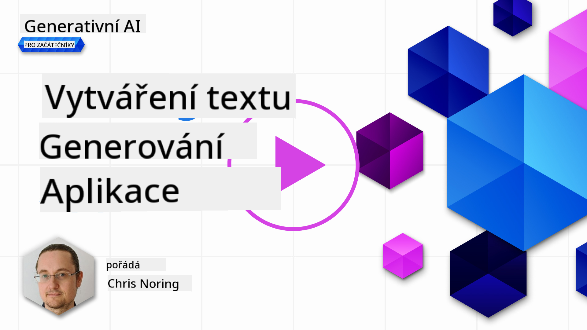

<!--
CO_OP_TRANSLATOR_METADATA:
{
  "original_hash": "ce8224073b86b728ed52b19bed7932fd",
  "translation_date": "2025-07-09T12:06:44+00:00",
  "source_file": "06-text-generation-apps/README.md",
  "language_code": "cs"
}
-->
# Tvorba aplikací pro generování textu

[](https://aka.ms/gen-ai-lesson6-gh?WT.mc_id=academic-105485-koreyst)

> _(Klikněte na obrázek výše pro zhlédnutí videa této lekce)_

V tomto kurzu jste se již seznámili se základními pojmy, jako jsou prompty, a dokonce i s celou disciplínou nazvanou „prompt engineering“. Mnoho nástrojů, se kterými můžete pracovat, jako ChatGPT, Office 365, Microsoft Power Platform a další, vás podporuje v používání promptů k dosažení určitého cíle.

Abyste mohli takovou zkušenost přidat do aplikace, musíte pochopit pojmy jako prompt, completion a vybrat si knihovnu, se kterou budete pracovat. Právě to se naučíte v této kapitole.

## Úvod

V této kapitole se naučíte:

- Seznámit se s knihovnou openai a jejími základními koncepty.
- Vytvořit aplikaci pro generování textu pomocí openai.
- Pochopit, jak používat pojmy jako prompt, temperature a tokens k vytvoření aplikace pro generování textu.

## Cíle učení

Na konci této lekce budete schopni:

- Vysvětlit, co je aplikace pro generování textu.
- Vytvořit aplikaci pro generování textu pomocí openai.
- Nakonfigurovat aplikaci tak, aby používala více či méně tokenů a také změnit temperature pro různorodý výstup.

## Co je aplikace pro generování textu?

Obvykle, když vytváříte aplikaci, má nějaké uživatelské rozhraní, například:

- Na příkazovém řádku. Konzolové aplikace jsou typické aplikace, kde zadáváte příkaz a aplikace vykoná úkol. Například `git` je aplikace založená na příkazech.
- Uživatelské rozhraní (UI). Některé aplikace mají grafické uživatelské rozhraní (GUI), kde klikáte na tlačítka, zadáváte text, vybíráte možnosti a podobně.

### Konzolové a UI aplikace mají omezení

Porovnejte to s aplikací založenou na příkazech, kde zadáváte příkaz:

- **Je omezená**. Nemůžete zadat libovolný příkaz, pouze ty, které aplikace podporuje.
- **Jazykově specifická**. Některé aplikace podporují více jazyků, ale ve výchozím nastavení jsou vytvořeny pro konkrétní jazyk, i když můžete přidat podporu dalších jazyků.

### Výhody aplikací pro generování textu

Jak se tedy aplikace pro generování textu liší?

V aplikaci pro generování textu máte větší flexibilitu, nejste omezeni na sadu příkazů nebo konkrétní vstupní jazyk. Místo toho můžete používat přirozený jazyk k interakci s aplikací. Další výhodou je, že pracujete s datovým zdrojem, který byl natrénován na rozsáhlém korpusu informací, zatímco tradiční aplikace může být omezená na data v databázi.

### Co mohu vytvořit s aplikací pro generování textu?

Existuje mnoho možností, například:

- **Chatbot**. Chatbot odpovídající na otázky o tématech, jako je vaše firma a její produkty, může být skvělým řešením.
- **Pomocník**. Velké jazykové modely (LLM) jsou skvělé na úkoly jako shrnutí textu, získávání poznatků z textu, tvorbu textů jako životopisy a další.
- **Asistent pro kódování**. V závislosti na použitém jazykovém modelu můžete vytvořit asistenta, který vám pomůže psát kód. Například můžete použít produkty jako GitHub Copilot nebo ChatGPT.

## Jak začít?

Potřebujete najít způsob, jak se integrovat s LLM, což obvykle znamená dvě možnosti:

- Použít API. Zde sestavujete webové požadavky s vaším promptem a dostáváte zpět generovaný text.
- Použít knihovnu. Knihovny pomáhají zabalit volání API a usnadňují jejich použití.

## Knihovny/SDK

Existuje několik známých knihoven pro práci s LLM, například:

- **openai**, tato knihovna usnadňuje připojení k vašemu modelu a odesílání promptů.

Dále jsou knihovny, které pracují na vyšší úrovni, například:

- **Langchain**. Langchain je dobře známý a podporuje Python.
- **Semantic Kernel**. Semantic Kernel je knihovna od Microsoftu podporující jazyky C#, Python a Java.

## První aplikace s openai

Podívejme se, jak můžeme vytvořit naši první aplikaci, jaké knihovny potřebujeme, kolik toho je potřeba a tak dále.

### Instalace openai

Existuje mnoho knihoven pro interakci s OpenAI nebo Azure OpenAI. Je možné použít různé programovací jazyky jako C#, Python, JavaScript, Java a další. My jsme si vybrali knihovnu `openai` pro Python, takže ji nainstalujeme pomocí `pip`.

```bash
pip install openai
```

### Vytvoření zdroje

Musíte provést následující kroky:

- Vytvořit účet na Azure [https://azure.microsoft.com/free/](https://azure.microsoft.com/free/?WT.mc_id=academic-105485-koreyst).
- Získat přístup k Azure OpenAI. Přejděte na [https://learn.microsoft.com/azure/ai-services/openai/overview#how-do-i-get-access-to-azure-openai](https://learn.microsoft.com/azure/ai-services/openai/overview#how-do-i-get-access-to-azure-openai?WT.mc_id=academic-105485-koreyst) a požádejte o přístup.

  > [!NOTE]
  > V době psaní je potřeba požádat o přístup k Azure OpenAI.

- Nainstalovat Python <https://www.python.org/>
- Vytvořit Azure OpenAI Service resource. Podívejte se na tento návod, jak [vytvořit zdroj](https://learn.microsoft.com/azure/ai-services/openai/how-to/create-resource?pivots=web-portal?WT.mc_id=academic-105485-koreyst).

### Najděte API klíč a endpoint

Nyní musíte knihovně `openai` sdělit, jaký API klíč má použít. Pro nalezení API klíče přejděte do sekce „Keys and Endpoint“ ve vašem Azure OpenAI zdroji a zkopírujte hodnotu „Key 1“.


Jakmile máte tyto informace zkopírované, nastavme knihovny, aby je používaly.

> [!NOTE]
> Je vhodné oddělit váš API klíč od kódu. Můžete to udělat pomocí proměnných prostředí.
>
> - Nastavte proměnnou prostředí `OPENAI_API_KEY` na váš API klíč.
>   `export OPENAI_API_KEY='sk-...'`

### Nastavení konfigurace pro Azure

Pokud používáte Azure OpenAI, zde je návod, jak nastavit konfiguraci:

```python
openai.api_type = 'azure'
openai.api_key = os.environ["OPENAI_API_KEY"]
openai.api_version = '2023-05-15'
openai.api_base = os.getenv("API_BASE")
```

Výše nastavujeme:

- `api_type` na `azure`. To říká knihovně, aby používala Azure OpenAI a ne OpenAI.
- `api_key`, což je váš API klíč nalezený v Azure Portalu.
- `api_version`, což je verze API, kterou chcete použít. V době psaní je nejnovější verze `2023-05-15`.
- `api_base`, což je endpoint API. Najdete ho v Azure Portalu vedle vašeho API klíče.

> [!NOTE] > `os.getenv` je funkce, která čte proměnné prostředí. Můžete ji použít k načtení proměnných jako `OPENAI_API_KEY` a `API_BASE`. Tyto proměnné nastavte ve vašem terminálu nebo pomocí knihovny jako `dotenv`.

## Generování textu

Text generujete pomocí třídy `Completion`. Zde je příklad:

```python
prompt = "Complete the following: Once upon a time there was a"

completion = openai.Completion.create(model="davinci-002", prompt=prompt)
print(completion.choices[0].text)
```

V uvedeném kódu vytvoříme objekt completion, předáme model, který chceme použít, a prompt. Poté vytiskneme vygenerovaný text.

### Chat completions

Doposud jste viděli, jak používáme `Completion` k generování textu. Existuje však další třída `ChatCompletion`, která je vhodnější pro chatboty. Zde je příklad jejího použití:

```python
import openai

openai.api_key = "sk-..."

completion = openai.ChatCompletion.create(model="gpt-3.5-turbo", messages=[{"role": "user", "content": "Hello world"}])
print(completion.choices[0].message.content)
```

Více o této funkci v nadcházející kapitole.

## Cvičení – vaše první aplikace pro generování textu

Nyní, když jsme se naučili, jak nastavit a nakonfigurovat openai, je čas vytvořit vaši první aplikaci pro generování textu. Postupujte podle těchto kroků:

1. Vytvořte virtuální prostředí a nainstalujte openai:

   ```bash
   python -m venv venv
   source venv/bin/activate
   pip install openai
   ```

   > [!NOTE]
   > Pokud používáte Windows, zadejte `venv\Scripts\activate` místo `source venv/bin/activate`.

   > [!NOTE]
   > Najděte svůj Azure OpenAI klíč tak, že přejdete na [https://portal.azure.com/](https://portal.azure.com/?WT.mc_id=academic-105485-koreyst), vyhledejte `Open AI`, vyberte `Open AI resource`, poté `Keys and Endpoint` a zkopírujte hodnotu `Key 1`.

1. Vytvořte soubor _app.py_ a vložte do něj následující kód:

   ```python
   import openai

   openai.api_key = "<replace this value with your open ai key or Azure OpenAI key>"

   openai.api_type = 'azure'
   openai.api_version = '2023-05-15'
   openai.api_base = "<endpoint found in Azure Portal where your API key is>"
   deployment_name = "<deployment name>"

   # add your completion code
   prompt = "Complete the following: Once upon a time there was a"
   messages = [{"role": "user", "content": prompt}]

   # make completion
   completion = openai.chat.completions.create(model=deployment_name, messages=messages)

   # print response
   print(completion.choices[0].message.content)
   ```

   > [!NOTE]
   > Pokud používáte Azure OpenAI, musíte nastavit `api_type` na `azure` a `api_key` na váš Azure OpenAI klíč.

   Měli byste vidět výstup podobný tomuto:

   ```output
    very unhappy _____.

   Once upon a time there was a very unhappy mermaid.
   ```

## Různé typy promptů pro různé účely

Nyní jste viděli, jak generovat text pomocí promptu. Dokonce máte program, který běží a který můžete upravovat a měnit pro generování různých typů textu.

Promptů lze použít pro různé úkoly, například:

- **Generování určitého typu textu**. Například můžete generovat báseň, otázky do kvízu apod.
- **Vyhledávání informací**. Můžete použít prompt k vyhledání informací, například „Co znamená CORS ve webovém vývoji?“.
- **Generování kódu**. Prompt můžete použít k vytvoření kódu, například regulárního výrazu pro validaci e-mailů nebo dokonce celého programu, jako je webová aplikace.

## Praktický příklad: generátor receptů

Představte si, že máte doma ingredience a chcete něco uvařit. K tomu potřebujete recept. Recepty můžete hledat ve vyhledávači, nebo můžete použít LLM.

Můžete napsat prompt například takto:

> „Ukaž mi 5 receptů na jídlo s následujícími ingrediencemi: kuře, brambory a mrkev. U každého receptu vyjmenuj všechny použité ingredience.“

Na základě tohoto promptu můžete dostat odpověď podobnou:

```output
1. Roasted Chicken and Vegetables:
Ingredients:
- 4 chicken thighs
- 2 potatoes, cut into cubes
- 2 carrots, cut into cubes
- 2 tablespoons olive oil
- 2 cloves garlic, minced
- 1 teaspoon dried thyme
- 1 teaspoon dried oregano
- Salt and pepper, to taste

2. Chicken and Potato Stew:
Ingredients:
- 2 tablespoons olive oil
- 1 onion, diced
- 2 cloves garlic, minced
- 2 chicken breasts, cut into cubes
- 2 potatoes, cut into cubes
- 2 carrots, cut into cubes
- 1 teaspoon dried oregano
- 1 teaspoon dried thyme
- 1 cup chicken broth
- Salt and pepper, to taste

3. Chicken and Potato Bake:
Ingredients:
- 2 tablespoons olive oil
- 2 chicken breasts, cut into cubes
- 2 potatoes, cut into cubes
- 2 carrots, cut into cubes
- 1 onion, diced
- 2 cloves garlic, minced
- 1 teaspoon dried oregano
- 1 teaspoon dried thyme
- 1 cup chicken broth
- Salt and pepper, to taste

4. Chicken and Potato Soup:
Ingredients:
- 2 tablespoons olive oil
- 1 onion, diced
- 2 cloves garlic, minced
- 2 chicken breasts, cut into cubes
- 2 potatoes, cut into cubes
- 2 carrots, cut into cubes
- 1 teaspoon dried oregano
- 1 teaspoon dried thyme
- 4 cups chicken broth
- Salt and pepper, to taste

5. Chicken and Potato Hash:
Ingredients:
- 2 tablespoons olive oil
- 2 chicken breasts, cut into cubes
- 2 potatoes, cut into cubes
- 2 carrots, cut into cubes
- 1 onion, diced
- 2 cloves garlic, minced
- 1 teaspoon dried oregano
```

Tento výsledek je skvělý, vím, co uvařit. V tuto chvíli by mohly být užitečné následující vylepšení:

- Filtrování ingrediencí, které nemám rád nebo na které jsem alergický.
- Vytvoření nákupního seznamu, pokud doma nemám všechny ingredience.

Pro tyto případy přidáme další prompt:

> „Prosím, odstraň recepty s česnekem, protože jsem na něj alergický, a nahraď ho něčím jiným. Také prosím vytvoř nákupní seznam pro tyto recepty, s ohledem na to, že doma už mám kuře, brambory a mrkev.“

Nyní máte nový výsledek, konkrétně:

```output
1. Roasted Chicken and Vegetables:
Ingredients:
- 4 chicken thighs
- 2 potatoes, cut into cubes
- 2 carrots, cut into cubes
- 2 tablespoons olive oil
- 1 teaspoon dried thyme
- 1 teaspoon dried oregano
- Salt and pepper, to taste

2. Chicken and Potato Stew:
Ingredients:
- 2 tablespoons olive oil
- 1 onion, diced
- 2 chicken breasts, cut into cubes
- 2 potatoes, cut into cubes
- 2 carrots, cut into cubes
- 1 teaspoon dried oregano
- 1 teaspoon dried thyme
- 1 cup chicken broth
- Salt and pepper, to taste

3. Chicken and Potato Bake:
Ingredients:
- 2 tablespoons olive oil
- 2 chicken breasts, cut into cubes
- 2 potatoes, cut into cubes
- 2 carrots, cut into cubes
- 1 onion, diced
- 1 teaspoon dried oregano
- 1 teaspoon dried thyme
- 1 cup chicken broth
- Salt and pepper, to taste

4. Chicken and Potato Soup:
Ingredients:
- 2 tablespoons olive oil
- 1 onion, diced
- 2 chicken breasts, cut into cubes
- 2 potatoes, cut into cubes
- 2 carrots, cut into cubes
- 1 teaspoon dried oregano
- 1 teaspoon dried thyme
- 4 cups chicken broth
- Salt and pepper, to taste

5. Chicken and Potato Hash:
Ingredients:
- 2 tablespoons olive oil
- 2 chicken breasts, cut into cubes
- 2 potatoes, cut into cubes
- 2 carrots, cut into cubes
- 1 onion, diced
- 1 teaspoon dried oregano

Shopping List:
- Olive oil
- Onion
- Thyme
- Oregano
- Salt
- Pepper
```

To jsou vaše pět receptů bez česneku a také máte nákupní seznam s ohledem na to, co už doma máte.

## Cvičení – vytvořte generátor receptů

Nyní, když jsme si scénář vyzkoušeli, napišme kód, který odpovídá tomuto scénáři. Postupujte podle těchto kroků:

1. Použijte existující soubor _app.py_ jako výchozí bod.
1. Najděte proměnnou `prompt` a změňte její obsah na následující:

   ```python
   prompt = "Show me 5 recipes for a dish with the following ingredients: chicken, potatoes, and carrots. Per recipe, list all the ingredients used"
   ```

   Pokud nyní spustíte kód, měli byste vidět výstup podobný tomuto:

   ```output
   -Chicken Stew with Potatoes and Carrots: 3 tablespoons oil, 1 onion, chopped, 2 cloves garlic, minced, 1 carrot, peeled and chopped, 1 potato, peeled and chopped, 1 bay leaf, 1 thyme sprig, 1/2 teaspoon salt, 1/4 teaspoon black pepper, 1 1/2 cups chicken broth, 1/2 cup dry white wine, 2 tablespoons chopped fresh parsley, 2 tablespoons unsalted butter, 1 1/2 pounds boneless, skinless chicken thighs, cut into 1-inch pieces
   -Oven-Roasted Chicken with Potatoes and Carrots: 3 tablespoons extra-virgin olive oil, 1 tablespoon Dijon mustard, 1 tablespoon chopped fresh rosemary, 1 tablespoon chopped fresh thyme, 4 cloves garlic, minced, 1 1/2 pounds small red potatoes, quartered, 1 1/2 pounds carrots, quartered lengthwise, 1/2 teaspoon salt, 1/4 teaspoon black pepper, 1 (4-pound) whole chicken
   -Chicken, Potato, and Carrot Casserole: cooking spray, 1 large onion, chopped, 2 cloves garlic, minced, 1 carrot, peeled and shredded, 1 potato, peeled and shredded, 1/2 teaspoon dried thyme leaves, 1/4 teaspoon salt, 1/4 teaspoon black pepper, 2 cups fat-free, low-sodium chicken broth, 1 cup frozen peas, 1/4 cup all-purpose flour, 1 cup 2% reduced-fat milk, 1/4 cup grated Parmesan cheese

   -One Pot Chicken and Potato Dinner: 2 tablespoons olive oil, 1 pound boneless, skinless chicken thighs, cut into 1-inch pieces, 1 large onion, chopped, 3 cloves garlic, minced, 1 carrot, peeled and chopped, 1 potato, peeled and chopped, 1 bay leaf, 1 thyme sprig, 1/2 teaspoon salt, 1/4 teaspoon black pepper, 2 cups chicken broth, 1/2 cup dry white wine

   -Chicken, Potato, and Carrot Curry: 1 tablespoon vegetable oil, 1 large onion, chopped, 2 cloves garlic, minced, 1 carrot, peeled and chopped, 1 potato, peeled and chopped, 1 teaspoon ground coriander, 1 teaspoon ground cumin, 1/2 teaspoon ground turmeric, 1/2 teaspoon ground ginger, 1/4 teaspoon cayenne pepper, 2 cups chicken broth, 1/2 cup dry white wine, 1 (15-ounce) can chickpeas, drained and rinsed, 1/2 cup raisins, 1/2 cup chopped fresh cilantro
   ```

   > POZNÁMKA: váš LLM není deterministický, takže můžete při každém spuštění programu dostat jiné výsledky.

   Skvěle, podívejme se, jak věci vylepšit. Chceme, aby byl kód flexibilní, takže ingredience i počet receptů lze snadno měnit.

1. Změňme kód následovně:

   ```python
   no_recipes = input("No of recipes (for example, 5): ")

   ingredients = input("List of ingredients (for example, chicken, potatoes, and carrots): ")

   # interpolate the number of recipes into the prompt an ingredients
   prompt = f"Show me {no_recipes} recipes for a dish with the following ingredients: {ingredients}. Per recipe, list all the ingredients used"
   ```

   Testovací spuštění kódu by mohlo vypadat takto:

   ```output
   No of recipes (for example, 5): 3
   List of ingredients (for example, chicken, potatoes, and carrots): milk,strawberries

   -Strawberry milk shake: milk, strawberries, sugar, vanilla extract, ice cubes
   -Strawberry shortcake: milk, flour, baking powder, sugar, salt, unsalted butter, strawberries, whipped cream
   -Strawberry milk: milk, strawberries, sugar, vanilla extract
   ```

### Vylepšení přidáním filtru a nákupního seznamu

Nyní máme funkční aplikaci schopnou generovat recepty a je flexibilní, protože závisí na vstupu uživatele, jak v počtu receptů, tak v použitých ingrediencích.

Pro další vylepšení chceme přidat:

- **Filtrování ingrediencí**. Chceme mít možnost filtrovat ingredience, které nemáme rádi nebo na které jsme alergičtí. K tomu upravíme náš existující prompt a na jeho konec přidáme podmínku filtru takto:

  ```python
  filter = input("Filter (for example, vegetarian, vegan, or gluten-free): ")

  prompt = f"Show me {no_recipes} recipes for a dish with the following ingredients: {ingredients}. Per recipe, list all the ingredients used, no {filter}"
  ```

  Výše přidáváme `{filter}` na konec promptu a zároveň zachytáváme hodnotu filtru od uživatele.

  Příklad vstupu při spuštění programu může nyní vypadat takto:

  ```output
  No of recipes (for example, 5): 3
  List of ingredients (for example, chicken, potatoes, and carrots): onion,milk
  Filter (for example, vegetarian, vegan, or gluten-free): no milk

  1. French Onion Soup

  Ingredients:

  -1 large onion, sliced
  -3 cups beef broth
  -1 cup milk
  -6 slices french bread
  -1/4 cup shredded Parmesan cheese
  -1 tablespoon butter
  -1 teaspoon dried thyme
  -1/4 teaspoon salt
  -1/4 teaspoon black pepper

  Instructions:

  1. In a large pot, sauté onions in butter until golden brown.
  2. Add beef broth, milk, thyme, salt, and pepper. Bring to a boil.
  3. Reduce heat and simmer for 10 minutes.
  4. Place french bread slices on soup bowls.
  5. Ladle soup over bread.
  6. Sprinkle with Parmesan cheese.

  2. Onion and Potato Soup

  Ingredients:

  -1 large onion, chopped
  -2 cups potatoes, diced
  -3 cups vegetable broth
  -1 cup milk
  -1/4 teaspoon black pepper

  Instructions:

  1. In a large pot, sauté onions in butter until golden brown.
  2. Add potatoes, vegetable broth, milk, and pepper. Bring to a boil.
  3. Reduce heat and simmer for 10 minutes.
  4. Serve hot.

  3. Creamy Onion Soup

  Ingredients:

  -1 large onion, chopped
  -3 cups vegetable broth
  -1 cup milk
  -1/4 teaspoon black pepper
  -1/4 cup all-purpose flour
  -1/2 cup shredded Parmesan cheese

  Instructions:

  1. In a large pot, sauté onions in butter until golden brown.
  2. Add vegetable broth, milk, and pepper. Bring to a boil.
  3. Reduce heat and simmer for 10 minutes.
  4. In a small bowl, whisk together flour and Parmesan cheese until smooth.
  5. Add to soup and simmer for an additional 5 minutes, or until soup has thickened.
  ```

  Jak vidíte, recepty obsahující mléko byly vyfiltrovány. Pokud jste například laktózově intolerantní, možná budete chtít filtrovat i recepty sýrů, takže je potřeba být konkrétní.

- **Vytvoření nákupního seznamu**. Chceme vytvořit nákupní seznam s ohledem na to, co už doma máme.

  Pro tuto funkci můžeme buď zkusit vyřešit vše v jednom promptu, nebo to rozdělit do dvou promptů. Zkusme druhý přístup. Navrhujeme přidat další prompt, ale aby to fungovalo, musíme výsledek prvního promptu přidat jako kontext k druhému promptu.

  Najděte část kódu, která tiskne výsledek z prvního promptu, a přidejte pod ní následující kód:

  ```python
  old_prompt_result = completion.choices[0].message.content
  prompt = "Produce a shopping list for the generated recipes and please don't include ingredients that I already have."

  new_prompt = f"{old_prompt_result} {prompt}"
  messages = [{"role": "user", "content": new_prompt}]
  completion = openai.Completion.create(engine=deployment_name, messages=messages, max_tokens=1200)

  # print response
  print("Shopping list:")
  print(completion.choices[0].message.content)
  ```

  Všimněte si následujícího:

  1. Vytváříme nový prompt přidáním výsledku z prvního promptu do nového promptu:

     ```python
     new_prompt = f"{old_prompt_result} {prompt}"
     ```
1. Vytvoříme nový požadavek, ale také vezmeme v úvahu počet tokenů, o které jsme žádali v prvním promptu, takže tentokrát nastavíme `max_tokens` na 1200.

```python
     completion = openai.Completion.create(engine=deployment_name, prompt=new_prompt, max_tokens=1200)
     ```

Když tento kód spustíme, dostaneme následující výstup:

```output
     No of recipes (for example, 5): 2
     List of ingredients (for example, chicken, potatoes, and carrots): apple,flour
     Filter (for example, vegetarian, vegan, or gluten-free): sugar


     -Apple and flour pancakes: 1 cup flour, 1/2 tsp baking powder, 1/2 tsp baking soda, 1/4 tsp salt, 1 tbsp sugar, 1 egg, 1 cup buttermilk or sour milk, 1/4 cup melted butter, 1 Granny Smith apple, peeled and grated
     -Apple fritters: 1-1/2 cups flour, 1 tsp baking powder, 1/4 tsp salt, 1/4 tsp baking soda, 1/4 tsp nutmeg, 1/4 tsp cinnamon, 1/4 tsp allspice, 1/4 cup sugar, 1/4 cup vegetable shortening, 1/4 cup milk, 1 egg, 2 cups shredded, peeled apples
     Shopping list:
     -Flour, baking powder, baking soda, salt, sugar, egg, buttermilk, butter, apple, nutmeg, cinnamon, allspice
     ```

## Vylepšete své nastavení

To, co máme zatím, je funkční kód, ale je tu pár úprav, které bychom měli udělat, aby to fungovalo ještě lépe. Některé věci, které bychom měli udělat, jsou:

- **Oddělit tajné údaje od kódu**, například API klíč. Tajné údaje nepatří přímo do kódu a měly by být uloženy na bezpečném místě. Pro oddělení tajných údajů od kódu můžeme použít proměnné prostředí a knihovny jako `python-dotenv`, které je načtou ze souboru. Takto by to v kódu mohlo vypadat:

  1. Vytvořte soubor `.env` s následujícím obsahem:

     ```bash
     OPENAI_API_KEY=sk-...
     ```

     
> Poznámka, pro Azure je potřeba nastavit tyto proměnné prostředí:

     ```bash
     OPENAI_API_TYPE=azure
     OPENAI_API_VERSION=2023-05-15
     OPENAI_API_BASE=<replace>
     ```

     V kódu pak proměnné prostředí načtete takto:

     ```python
     from dotenv import load_dotenv

     load_dotenv()

     openai.api_key = os.environ["OPENAI_API_KEY"]
     ```

- **Slovo o délce tokenů**. Měli bychom zvážit, kolik tokenů potřebujeme k vygenerování požadovaného textu. Tokeny něco stojí, takže kde to jde, měli bychom být co nejúspornější s jejich počtem. Například, můžeme prompt formulovat tak, abychom použili méně tokenů?

  Pro změnu počtu tokenů použijte parametr `max_tokens`. Například pokud chcete použít 100 tokenů, uděláte to takto:

  ```python
  completion = client.chat.completions.create(model=deployment, messages=messages, max_tokens=100)
  ```

- **Experimentování s teplotou**. Teplota je parametr, o kterém jsme zatím nemluvili, ale je důležitý pro to, jak program funguje. Čím vyšší je hodnota teploty, tím náhodnější bude výstup. Naopak čím nižší teplota, tím předvídatelnější výstup. Zvažte, zda chcete mít ve výstupu větší variabilitu, nebo ne.

  Pro změnu teploty použijte parametr `temperature`. Například pokud chcete nastavit teplotu na 0,5, uděláte to takto:

  ```python
  completion = client.chat.completions.create(model=deployment, messages=messages, temperature=0.5)
  ```

  > Poznámka, čím blíže k 1.0, tím pestřejší výstup.

## Zadání

Pro toto zadání si můžete vybrat, co chcete vytvořit.

Tady je pár tipů:

- Vylepšete aplikaci na generování receptů. Experimentujte s hodnotami teploty a promptů a uvidíte, co vymyslíte.
- Vytvořte „studijního parťáka“. Tato aplikace by měla umět odpovídat na otázky o nějakém tématu, například Python. Můžete mít prompty jako „Co je to určitý pojem v Pythonu?“ nebo prompt, který říká „ukaž mi kód k určitému tématu“ atd.
- Historický bot – oživte historii, nechte bota hrát roli určité historické postavy a ptejte se ho na její život a dobu.

## Řešení

### Studijní parťák

Níže je výchozí prompt, zkuste si ho upravit podle sebe.

```text
- "You're an expert on the Python language

    Suggest a beginner lesson for Python in the following format:

    Format:
    - concepts:
    - brief explanation of the lesson:
    - exercise in code with solutions"
```

### Historický bot

Tady je pár promptů, které můžete použít:

```text
- "You are Abe Lincoln, tell me about yourself in 3 sentences, and respond using grammar and words like Abe would have used"
- "You are Abe Lincoln, respond using grammar and words like Abe would have used:

   Tell me about your greatest accomplishments, in 300 words"
```

## Kontrola znalostí

Co dělá parametr teplota?

1. Řídí, jak náhodný bude výstup.
1. Řídí, jak dlouhá bude odpověď.
1. Řídí, kolik tokenů se použije.

## 🚀 Výzva

Při práci na zadání zkuste měnit teplotu, nastavte ji na 0, 0,5 a 1. Pamatujte, že 0 znamená nejméně variabilní výstup a 1 nejvíce. Která hodnota funguje nejlépe pro vaši aplikaci?

## Skvělá práce! Pokračujte ve vzdělávání

Po dokončení této lekce se podívejte na naši [kolekci Generative AI Learning](https://aka.ms/genai-collection?WT.mc_id=academic-105485-koreyst), kde můžete dál rozvíjet své znalosti o generativní AI!

Přejděte do Lekce 7, kde se podíváme na to, jak [vytvářet chatovací aplikace](../07-building-chat-applications/README.md?WT.mc_id=academic-105485-koreyst)!

**Prohlášení o vyloučení odpovědnosti**:  
Tento dokument byl přeložen pomocí AI překladatelské služby [Co-op Translator](https://github.com/Azure/co-op-translator). I když usilujeme o přesnost, mějte prosím na paměti, že automatické překlady mohou obsahovat chyby nebo nepřesnosti. Původní dokument v jeho mateřském jazyce by měl být považován za závazný zdroj. Pro důležité informace se doporučuje profesionální lidský překlad. Nejsme odpovědní za jakékoliv nedorozumění nebo nesprávné výklady vyplývající z použití tohoto překladu.