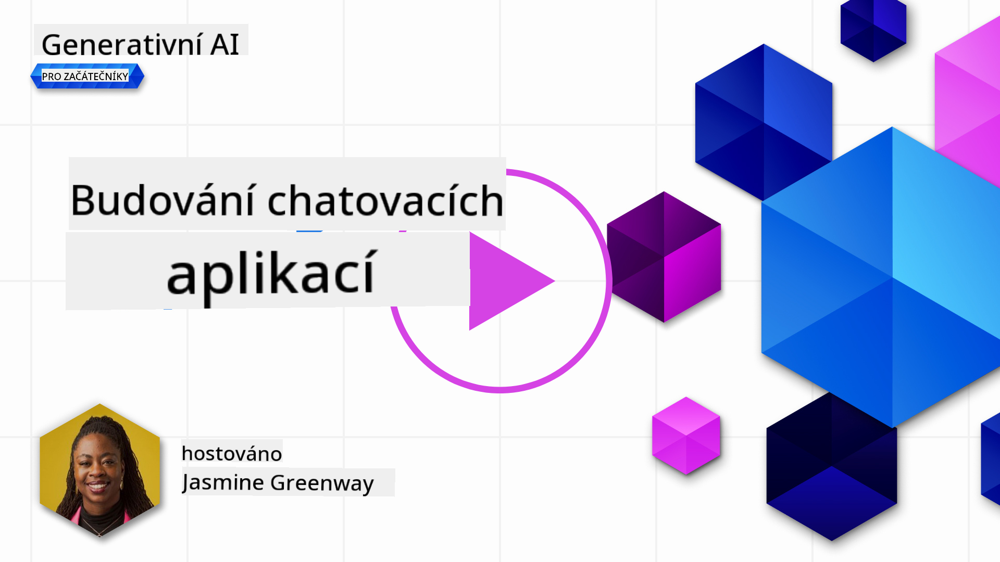
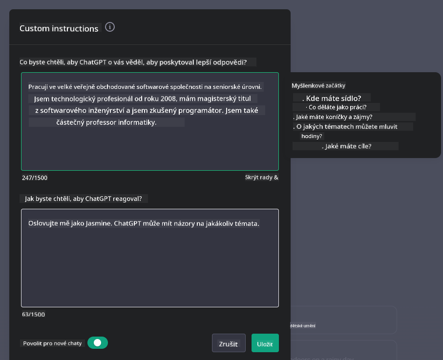
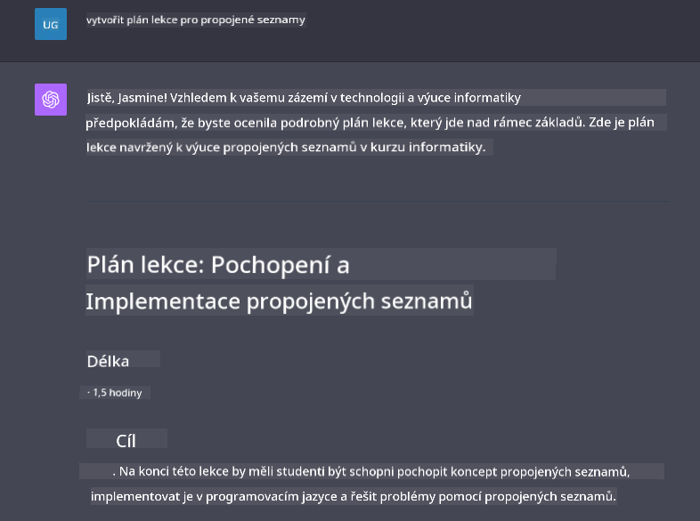

<!--
CO_OP_TRANSLATOR_METADATA:
{
  "original_hash": "ea4bbe640847aafbbba14dae4625e9af",
  "translation_date": "2025-05-19T18:07:13+00:00",
  "source_file": "07-building-chat-applications/README.md",
  "language_code": "cs"
}
-->
# Vytváření chatovacích aplikací s generativní AI

[](https://aka.ms/gen-ai-lessons7-gh?WT.mc_id=academic-105485-koreyst)

> _(Klikněte na obrázek výše pro zhlédnutí videa této lekce)_

Nyní, když jsme viděli, jak můžeme vytvářet aplikace pro generování textu, podívejme se na chatovací aplikace.

Chatovací aplikace se staly nedílnou součástí našich každodenních životů a nabízejí více než jen prostředek pro neformální konverzaci. Jsou integrálními součástmi zákaznického servisu, technické podpory a dokonce i sofistikovaných poradenských systémů. Pravděpodobně jste nedávno získali pomoc od chatovací aplikace. Jak začleňujeme pokročilejší technologie jako generativní AI do těchto platforem, složitost roste a s ní i výzvy.

Některé otázky, na které potřebujeme odpovědi, jsou:

- **Vytváření aplikace**. Jak efektivně vytvářet a bezproblémově integrovat tyto AI poháněné aplikace pro konkrétní případy použití?
- **Monitorování**. Jak můžeme po nasazení monitorovat a zajistit, že aplikace fungují na nejvyšší úrovni kvality, jak z hlediska funkčnosti, tak dodržování [šesti principů odpovědné AI](https://www.microsoft.com/ai/responsible-ai?WT.mc_id=academic-105485-koreyst)?

Jak se posouváme dále do věku definovaného automatizací a bezproblémovou interakcí mezi člověkem a strojem, stává se klíčovým porozumění tomu, jak generativní AI transformuje rozsah, hloubku a přizpůsobivost chatovacích aplikací. Tato lekce prozkoumá aspekty architektury, které podporují tyto složité systémy, ponoří se do metodologií pro jejich doladění pro úkoly specifické pro danou oblast a zhodnotí metriky a úvahy relevantní pro zajištění odpovědného nasazení AI.

## Úvod

Tato lekce pokrývá:

- Techniky pro efektivní vytváření a integraci chatovacích aplikací.
- Jak aplikovat přizpůsobení a doladění aplikací.
- Strategie a úvahy pro efektivní monitorování chatovacích aplikací.

## Cíle učení

Na konci této lekce budete schopni:

- Popsat úvahy pro vytváření a integraci chatovacích aplikací do stávajících systémů.
- Přizpůsobit chatovací aplikace pro konkrétní případy použití.
- Identifikovat klíčové metriky a úvahy pro efektivní monitorování a udržování kvality chatovacích aplikací poháněných AI.
- Zajistit, aby chatovací aplikace využívaly AI odpovědně.

## Integrace generativní AI do chatovacích aplikací

Zvýšení úrovně chatovacích aplikací prostřednictvím generativní AI není pouze o tom, aby byly chytřejší; jde o optimalizaci jejich architektury, výkonu a uživatelského rozhraní, aby poskytovaly kvalitní uživatelský zážitek. To zahrnuje zkoumání architektonických základů, integrací API a úvah o uživatelském rozhraní. Tato sekce vám nabídne komplexní plán pro navigaci v těchto složitých oblastech, ať už je zapojujete do stávajících systémů, nebo je stavíte jako samostatné platformy.

Na konci této sekce budete vybaveni odbornými znalostmi potřebnými pro efektivní konstrukci a začlenění chatovacích aplikací.

### Chatbot nebo chatovací aplikace?

Než se ponoříme do vytváření chatovacích aplikací, porovnejme 'chatboty' a 'AI poháněné chatovací aplikace', které slouží odlišným rolím a funkcionalitám. Hlavním účelem chatbota je automatizovat specifické konverzační úkoly, jako je odpovídání na často kladené otázky nebo sledování balíčku. Obvykle je řízen logikou založenou na pravidlech nebo složitými AI algoritmy. Naproti tomu AI poháněná chatovací aplikace je mnohem rozsáhlejším prostředím určeným k usnadnění různých forem digitální komunikace, jako je text, hlas a video chaty mezi lidskými uživateli. Její definující vlastností je integrace generativního AI modelu, který simuluje nuancované, lidsky podobné konverzace, generuje odpovědi na základě široké škály vstupů a kontextových nápověd. Generativní AI poháněná chatovací aplikace může zapojit do otevřených diskuzí, přizpůsobit se vyvíjejícím se konverzačním kontextům a dokonce produkovat kreativní nebo složité dialogy.

Tabulka níže uvádí klíčové rozdíly a podobnosti, které nám pomohou pochopit jejich jedinečné role v digitální komunikaci.

| Chatbot                               | Generativní AI-Poháněná Chatovací Aplikace |
| ------------------------------------- | ------------------------------------------ |
| Zaměřený na úkoly a řízený pravidly   | Vědomý kontextu                            |
| Často integrován do větších systémů   | Může hostit jeden nebo více chatbotů       |
| Omezen na naprogramované funkce       | Zahrnuje generativní AI modely             |
| Specializované a strukturované interakce | Schopný otevřených diskuzí                  |

### Využití předem připravených funkcí pomocí SDK a API

Při vytváření chatovací aplikace je skvělým prvním krokem zhodnotit, co už je k dispozici. Použití SDK a API pro vytváření chatovacích aplikací je výhodnou strategií z různých důvodů. Integrací dobře zdokumentovaných SDK a API strategicky umisťujete svou aplikaci pro dlouhodobý úspěch, řešíte obavy o škálovatelnost a údržbu.

- **Zrychluje vývojový proces a snižuje režii**: Spoléhání se na předem připravené funkce namísto nákladného procesu jejich vytváření vám umožňuje soustředit se na další aspekty vaší aplikace, které můžete považovat za důležitější, jako je obchodní logika.
- **Lepší výkon**: Když vytváříte funkčnost od nuly, nakonec se sami sebe zeptáte "Jak to škáluje? Je tato aplikace schopná zvládnout náhlý příliv uživatelů?" Dobře udržované SDK a API často mají zabudovaná řešení pro tyto obavy.
- **Snazší údržba**: Aktualizace a vylepšení se snadněji spravují, protože většina API a SDK vyžaduje pouze aktualizaci knihovny, když je vydána nová verze.
- **Přístup k nejmodernější technologii**: Využití modelů, které byly doladěny a trénovány na rozsáhlých datových sadách, poskytuje vaší aplikaci schopnosti přirozeného jazyka.

Přístup k funkcionalitě SDK nebo API obvykle zahrnuje získání oprávnění k používání poskytovaných služeb, což je často prostřednictvím použití jedinečného klíče nebo autentizačního tokenu. Použijeme knihovnu OpenAI Python Library, abychom prozkoumali, jak to vypadá. Můžete si to také vyzkoušet sami v následujícím [notebooku pro OpenAI](../../../07-building-chat-applications/python/oai-assignment.ipynb) nebo [notebooku pro Azure OpenAI Services](../../../07-building-chat-applications/python/aoai-assignment.ipynb) pro tuto lekci.

```python
import os
from openai import OpenAI

API_KEY = os.getenv("OPENAI_API_KEY","")

client = OpenAI(
    api_key=API_KEY
    )

chat_completion = client.chat.completions.create(model="gpt-3.5-turbo", messages=[{"role": "user", "content": "Suggest two titles for an instructional lesson on chat applications for generative AI."}])
```

Výše uvedený příklad používá model GPT-3.5 Turbo k dokončení výzvy, ale všimněte si, že API klíč je nastaven před tím, než tak učiníte. Pokud byste klíč nenastavili, obdrželi byste chybu.

## Uživatelská zkušenost (UX)

Obecné principy UX platí pro chatovací aplikace, ale zde jsou některé další úvahy, které se stávají zvláště důležitými kvůli komponentům strojového učení.

- **Mechanismus pro řešení nejednoznačnosti**: Generativní AI modely občas generují nejednoznačné odpovědi. Funkce, která umožňuje uživatelům požádat o upřesnění, může být užitečná, pokud se s tímto problémem setkají.
- **Udržení kontextu**: Pokročilé generativní AI modely mají schopnost si pamatovat kontext v rámci konverzace, což může být nezbytným přínosem pro uživatelskou zkušenost. Dát uživatelům možnost kontrolovat a spravovat kontext zlepšuje uživatelskou zkušenost, ale zavádí riziko uchovávání citlivých uživatelských informací. Úvahy o tom, jak dlouho jsou tyto informace uloženy, například zavedením politiky uchovávání, mohou vyvážit potřebu kontextu proti ochraně soukromí.
- **Personalizace**: S možností učit se a přizpůsobovat se nabízejí AI modely individualizovaný zážitek pro uživatele. Přizpůsobení uživatelské zkušenosti prostřednictvím funkcí jako uživatelské profily nejenže činí uživatele pocitem, že jsou pochopeni, ale také pomáhá jejich snaze najít konkrétní odpovědi, čímž vytváří efektivnější a uspokojivější interakci.

Jedním z příkladů personalizace jsou nastavení "Vlastní instrukce" v OpenAI's ChatGPT. Umožňuje vám poskytnout informace o sobě, které mohou být důležitým kontextem pro vaše výzvy. Zde je příklad vlastní instrukce.



Tento "profil" vyzývá ChatGPT k vytvoření plánu lekce o spojených seznamech. Všimněte si, že ChatGPT bere v úvahu, že uživatel může chtít podrobnější plán lekce na základě svých zkušeností.



### Rámec systémových zpráv Microsoftu pro velké jazykové modely

[Microsoft poskytl pokyny](https://learn.microsoft.com/azure/ai-services/openai/concepts/system-message#define-the-models-output-format?WT.mc_id=academic-105485-koreyst) pro psaní efektivních systémových zpráv při generování odpovědí z LLM rozdělené do 4 oblastí:

1. Definování, pro koho je model určen, stejně jako jeho schopnosti a omezení.
2. Definování formátu výstupu modelu.
3. Poskytnutí konkrétních příkladů, které demonstrují zamýšlené chování modelu.
4. Poskytnutí dalších behaviorálních mantinelů.

### Přístupnost

Ať už má uživatel zrakové, sluchové, motorické nebo kognitivní postižení, dobře navržená chatovací aplikace by měla být použitelná pro všechny. Následující seznam rozděluje specifické funkce zaměřené na zlepšení přístupnosti pro různé uživatelské postižení.

- **Funkce pro zrakové postižení**: Vysoce kontrastní témata a přizpůsobitelný text, kompatibilita s čtečkami obrazovky.
- **Funkce pro sluchové postižení**: Funkce převodu textu na řeč a řeči na text, vizuální nápovědy pro zvuková upozornění.
- **Funkce pro motorické postižení**: Podpora navigace pomocí klávesnice, hlasové příkazy.
- **Funkce pro kognitivní postižení**: Možnosti zjednodušeného jazyka.

## Přizpůsobení a doladění pro jazykové modely specifické pro doménu

Představte si chatovací aplikaci, která rozumí žargonu vaší společnosti a předvídá specifické dotazy, které má její uživatelská základna běžně. Existuje několik přístupů, které stojí za zmínku:

- **Využití DSL modelů**. DSL znamená jazyk specifický pro doménu. Můžete využít tzv. DSL model trénovaný na konkrétní doménu, aby porozuměl jejím konceptům a scénářům.
- **Aplikace doladění**. Doladění je proces dalšího trénování vašeho modelu s konkrétními daty.

## Přizpůsobení: Použití DSL

Využití modelů jazyků specifických pro doménu (DSL modely) může zvýšit angažovanost uživatelů poskytováním specializovaných, kontextově relevantních interakcí. Je to model, který je trénován nebo doladěn, aby porozuměl a generoval text související s konkrétním oborem, průmyslem nebo předmětem. Možnosti použití DSL modelu se mohou lišit od trénování jednoho od nuly až po použití již existujících prostřednictvím SDK a API. Další možností je doladění, které zahrnuje vzít existující předtrénovaný model a přizpůsobit ho pro konkrétní doménu.

## Přizpůsobení: Aplikace doladění

Doladění je často zvažováno, když předtrénovaný model nestačí ve specializované doméně nebo specifickém úkolu.

Například lékařské dotazy jsou složité a vyžadují mnoho kontextu. Když lékař diagnostikuje pacienta, je to založeno na různých faktorech, jako je životní styl nebo předchozí zdravotní stavy, a může se dokonce spoléhat na nedávné lékařské časopisy k ověření své diagnózy. V takových nuancovaných scénářích nemůže být obecný AI chatovací aplikace spolehlivým zdrojem.

### Scénář: lékařská aplikace

Zvažte chatovací aplikaci navrženou tak, aby pomáhala lékařům poskytováním rychlých odkazů na léčebné pokyny, interakce s léky nebo nedávné výzkumné poznatky.

Obecný model by mohl být dostatečný pro odpovídání na základní lékařské otázky nebo poskytování obecných rad, ale může mít potíže s následujícím:

- **Vysoce specifické nebo složité případy**. Například neurolog může aplikaci položit otázku: "Jaké jsou aktuální nejlepší postupy pro řízení lékům odolné epilepsie u pediatrických pacientů?"
- **Chybějící nedávné pokroky**. Obecný model by mohl mít potíže poskytnout aktuální odpověď, která zahrnuje nejnovější pokroky v neurologii a farmakologii.

V takových případech může doladění modelu se specializovanou lékařskou datovou sadou významně zlepšit jeho schopnost řešit tyto složité lékařské dotazy přesněji a spolehlivěji. To vyžaduje přístup k rozsáhlé a relevantní datové sadě, která představuje doménově specifické výzvy a otázky, které je třeba řešit.

## Úvahy pro vysoce kvalitní chatovací zážitek poháněný AI

Tato sekce popisuje kritéria pro "vysoce kvalitní" chatovací aplikace, které zahrnují zachycení akčních metrik a dodržování rámce, který odpovědně využívá AI technologii.

### Klíčové metriky

Pro udržení vysoké kvality výkonu aplikace je zásadní sledovat klíčové metriky a úvahy. Tyto měření nejen zajišťují funkčnost aplikace, ale také hodnotí kvalitu AI modelu a uživatelského zážitku. Níže je uveden seznam, který pokrývá základní, AI a uživatelské metriky, které je třeba zvážit.

| Metrika                        | Definice                                                                                                             | Úvahy pro vývojáře chatovacích aplikací                                   |
| ----------------------------- | ---------------------------------------------------------------------------------------------------------------------- | ------------------------------------------------------------------------- |
| **Dostupnost**                | Měří čas, po který je aplikace funkční a přístupná uživatelům.                                                        | Jak minimalizujete výpadky?                                               |
| **Doba odezvy**               | Čas, který aplikaci trvá odpově

**Upozornění**:  
Tento dokument byl přeložen pomocí služby AI pro překlad [Co-op Translator](https://github.com/Azure/co-op-translator). I když se snažíme o přesnost, mějte na paměti, že automatizované překlady mohou obsahovat chyby nebo nepřesnosti. Původní dokument v jeho rodném jazyce by měl být považován za autoritativní zdroj. Pro důležité informace se doporučuje profesionální lidský překlad. Nejsme odpovědní za žádná nedorozumění nebo mylné interpretace vyplývající z použití tohoto překladu.