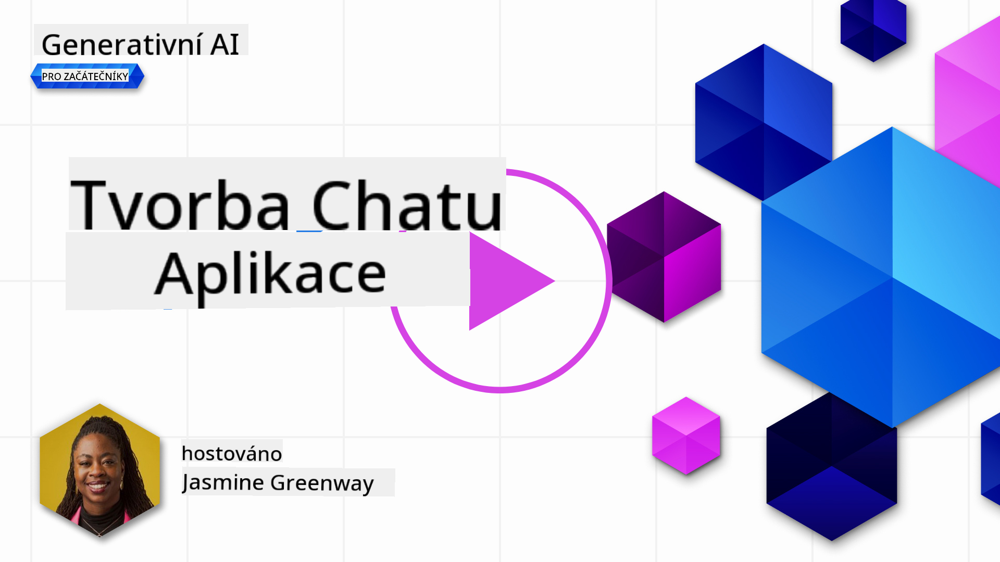
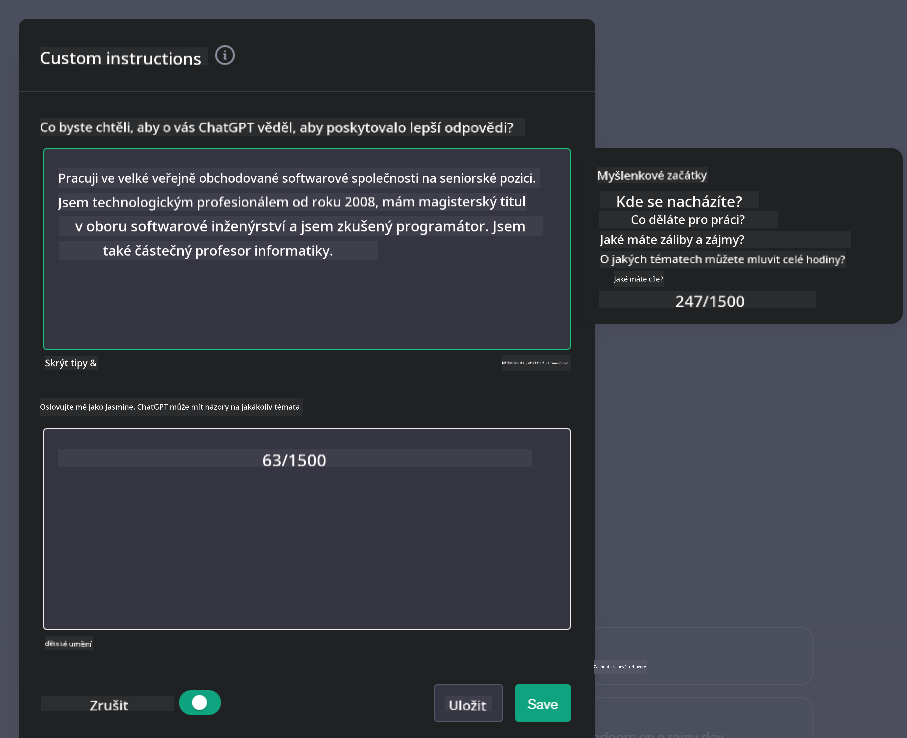
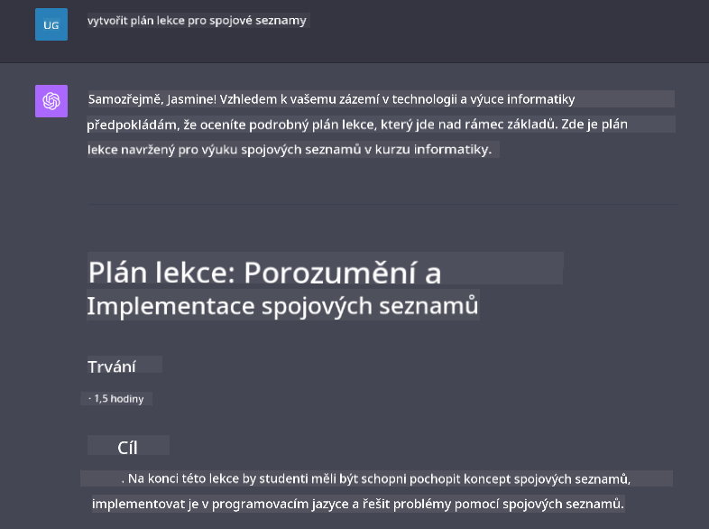

<!--
CO_OP_TRANSLATOR_METADATA:
{
  "original_hash": "ea4bbe640847aafbbba14dae4625e9af",
  "translation_date": "2025-06-25T15:54:04+00:00",
  "source_file": "07-building-chat-applications/README.md",
  "language_code": "cs"
}
-->
# Vytváření chatovacích aplikací s generativní AI

[](https://aka.ms/gen-ai-lessons7-gh?WT.mc_id=academic-105485-koreyst)

> _(Klikněte na obrázek výše pro zhlédnutí videa této lekce)_

Nyní, když jsme viděli, jak můžeme vytvářet aplikace pro generování textu, podívejme se na chatovací aplikace.

Chatovací aplikace se staly součástí našich každodenních životů, nabízejí více než jen prostředek pro neformální konverzaci. Jsou nedílnou součástí zákaznického servisu, technické podpory a dokonce i sofistikovaných poradenských systémů. Je pravděpodobné, že jste nedávno dostali nějakou pomoc od chatovací aplikace. Jak integrujeme pokročilejší technologie, jako je generativní AI, do těchto platforem, složitost roste a stejně tak i výzvy.

Některé otázky, na které potřebujeme odpovědi, jsou:

- **Vytváření aplikace**. Jak efektivně budovat a bezproblémově integrovat tyto aplikace poháněné AI pro specifické případy použití?
- **Monitorování**. Jakmile jsou nasazeny, jak můžeme monitorovat a zajistit, že aplikace fungují na nejvyšší úrovni kvality, jak z hlediska funkčnosti, tak dodržování [šesti principů zodpovědné AI](https://www.microsoft.com/ai/responsible-ai?WT.mc_id=academic-105485-koreyst)?

Jak se posouváme dál do éry definované automatizací a plynulou interakcí mezi lidmi a stroji, je pochopení, jak generativní AI transformuje rozsah, hloubku a přizpůsobivost chatovacích aplikací, zásadní. Tato lekce prozkoumá aspekty architektury, které podporují tyto složité systémy, ponoří se do metodologií pro jejich doladění pro úkoly specifické pro danou oblast a zhodnotí metriky a úvahy důležité pro zajištění zodpovědného nasazení AI.

## Úvod

Tato lekce zahrnuje:

- Techniky pro efektivní vytváření a integraci chatovacích aplikací.
- Jak aplikovat přizpůsobení a doladění na aplikace.
- Strategie a úvahy pro efektivní monitorování chatovacích aplikací.

## Cíle učení

Na konci této lekce budete schopni:

- Popsat úvahy pro budování a integraci chatovacích aplikací do stávajících systémů.
- Přizpůsobit chatovací aplikace pro specifické případy použití.
- Identifikovat klíčové metriky a úvahy pro efektivní monitorování a udržování kvality chatovacích aplikací poháněných AI.
- Zajistit, že chatovací aplikace využívají AI zodpovědně.

## Integrace generativní AI do chatovacích aplikací

Zvýšení úrovně chatovacích aplikací pomocí generativní AI není jen o tom, aby byly chytřejší; jde o optimalizaci jejich architektury, výkonu a uživatelského rozhraní pro zajištění kvalitního uživatelského zážitku. To zahrnuje zkoumání architektonických základů, integrací API a úvah o uživatelském rozhraní. Tato sekce vám nabízí komplexní plán pro navigaci v těchto složitých oblastech, ať už je připojujete ke stávajícím systémům nebo je budujete jako samostatné platformy.

Na konci této sekce budete vybaveni odborností potřebnou k efektivnímu vytváření a začleňování chatovacích aplikací.

### Chatbot nebo chatovací aplikace?

Než se ponoříme do vytváření chatovacích aplikací, pojďme porovnat 'chatboty' s 'chatovacími aplikacemi poháněnými AI', které slouží odlišným rolím a funkcím. Hlavním účelem chatbota je automatizovat specifické konverzační úkoly, jako je odpovídání na často kladené otázky nebo sledování balíčku. Obvykle je řízen logikou založenou na pravidlech nebo složitými algoritmy AI. Naopak, chatovací aplikace poháněná AI je mnohem rozsáhlejší prostředí navržené k usnadnění různých forem digitální komunikace, jako jsou textové, hlasové a video chaty mezi lidskými uživateli. Jejím definujícím rysem je integrace generativního AI modelu, který simuluje nuancované, lidsky podobné konverzace, generující odpovědi na základě široké škály vstupů a kontextových podnětů. Chatovací aplikace poháněná generativní AI může vést diskuse v otevřené doméně, přizpůsobit se měnícím se konverzačním kontextům a dokonce produkovat kreativní nebo složité dialogy.

Následující tabulka uvádí klíčové rozdíly a podobnosti, které nám pomáhají pochopit jejich jedinečné role v digitální komunikaci.

| Chatbot                               | Chatovací aplikace poháněná generativní AI |
| ------------------------------------- | ------------------------------------------ |
| Zaměřený na úkoly a založený na pravidlech | Kontextově uvědomělý                      |
| Často integrován do větších systémů   | Může hostit jeden nebo více chatbotů       |
| Omezen na naprogramované funkce       | Zahrnuje generativní AI modely             |
| Specializované a strukturované interakce | Schopnost diskusí v otevřené doméně       |

### Využití předem vytvořených funkcí pomocí SDK a API

Při vytváření chatovací aplikace je skvělým prvním krokem zhodnotit, co už existuje. Používání SDK a API k vytváření chatovacích aplikací je výhodná strategie z několika důvodů. Integrací dobře dokumentovaných SDK a API strategicky umísťujete svou aplikaci pro dlouhodobý úspěch, řešíte obavy ohledně škálovatelnosti a údržby.

- **Zrychluje vývojový proces a snižuje režii**: Spoléhání se na předem vytvořené funkce namísto nákladného procesu jejich vytváření vám umožňuje soustředit se na jiné aspekty vaší aplikace, které můžete považovat za důležitější, jako je obchodní logika.
- **Lepší výkon**: Při vytváření funkčnosti od nuly se nakonec zeptáte sami sebe "Jak to škáluje? Je tato aplikace schopna zvládnout náhlý příliv uživatelů?" Dobře udržované SDK a API často mají vestavěná řešení pro tyto obavy.
- **Snazší údržba**: Aktualizace a vylepšení jsou snazší na správu, protože většina API a SDK vyžaduje pouze aktualizaci knihovny, když je vydána novější verze.
- **Přístup k nejmodernější technologii**: Využití modelů, které byly jemně doladěny a trénovány na rozsáhlých datových sadách, poskytuje vaší aplikaci schopnosti přirozeného jazyka.

Přístup k funkcionalitě SDK nebo API obvykle zahrnuje získání povolení k používání poskytovaných služeb, což je často prostřednictvím použití unikátního klíče nebo autentizačního tokenu. Použijeme knihovnu OpenAI Python Library, abychom prozkoumali, jak to vypadá. Můžete si to také sami vyzkoušet v následujícím [notebooku pro OpenAI](../../../07-building-chat-applications/python/oai-assignment.ipynb) nebo [notebooku pro Azure OpenAI Services](../../../07-building-chat-applications/python/aoai-assignment.ipynb) pro tuto lekci.

```python
import os
from openai import OpenAI

API_KEY = os.getenv("OPENAI_API_KEY","")

client = OpenAI(
    api_key=API_KEY
    )

chat_completion = client.chat.completions.create(model="gpt-3.5-turbo", messages=[{"role": "user", "content": "Suggest two titles for an instructional lesson on chat applications for generative AI."}])
```

Výše uvedený příklad používá model GPT-3.5 Turbo k dokončení výzvy, ale všimněte si, že klíč API je nastaven před tím. Pokud byste klíč nenastavili, obdrželi byste chybu.

## Uživatelský zážitek (UX)

Obecné principy UX platí pro chatovací aplikace, ale zde jsou některé další úvahy, které se stávají obzvláště důležitými kvůli komponentám strojového učení.

- **Mechanismus pro řešení nejednoznačnosti**: Generativní AI modely občas generují nejednoznačné odpovědi. Funkce, která uživatelům umožňuje požádat o objasnění, může být užitečná, pokud na tento problém narazí.
- **Udržování kontextu**: Pokročilé generativní AI modely mají schopnost zapamatovat si kontext v rámci konverzace, což může být nezbytným přínosem pro uživatelský zážitek. Poskytnutí uživatelům možnosti ovládat a spravovat kontext zlepšuje uživatelský zážitek, ale zavádí riziko uchovávání citlivých uživatelských informací. Úvahy o tom, jak dlouho jsou tyto informace uchovávány, jako je zavedení politiky uchovávání, mohou vyvážit potřebu kontextu proti ochraně soukromí.
- **Personalizace**: S možností učit se a přizpůsobovat nabízejí AI modely individuální zážitek pro uživatele. Přizpůsobení uživatelského zážitku pomocí funkcí jako uživatelské profily nejenže činí uživatele pochopeným, ale také pomáhá při hledání konkrétních odpovědí, čímž vytváří efektivnější a uspokojivější interakci.

Jedním z takových příkladů personalizace je nastavení "Vlastní instrukce" v OpenAI ChatGPT. Umožňuje vám poskytnout informace o sobě, které mohou být důležitým kontextem pro vaše výzvy. Zde je příklad vlastní instrukce.



Tento "profil" vybízí ChatGPT k vytvoření plánu lekce o spojených seznamech. Všimněte si, že ChatGPT bere v úvahu, že uživatel může chtít podrobnější plán lekce na základě jejích zkušeností.



### Microsoftův rámec systémových zpráv pro velké jazykové modely

[Microsoft poskytl pokyny](https://learn.microsoft.com/azure/ai-services/openai/concepts/system-message#define-the-models-output-format?WT.mc_id=academic-105485-koreyst) pro psaní efektivních systémových zpráv při generování odpovědí z LLM, rozdělených do 4 oblastí:

1. Definování, pro koho je model určen, stejně jako jeho schopnosti a omezení.
2. Definování formátu výstupu modelu.
3. Poskytování konkrétních příkladů, které demonstrují zamýšlené chování modelu.
4. Poskytování dalších ochranných opatření pro chování.

### Přístupnost

Ať už má uživatel zrakové, sluchové, motorické nebo kognitivní postižení, dobře navržená chatovací aplikace by měla být použitelná pro všechny. Následující seznam rozděluje konkrétní funkce zaměřené na zlepšení přístupnosti pro různé uživatelské postižení.

- **Funkce pro zrakové postižení**: Vysokokontrastní témata a možnost zvětšování textu, kompatibilita se čtečkami obrazovky.
- **Funkce pro sluchové postižení**: Funkce převodu textu na řeč a řeči na text, vizuální upozornění na zvukové notifikace.
- **Funkce pro motorické postižení**: Podpora navigace pomocí klávesnice, hlasové příkazy.
- **Funkce pro kognitivní postižení**: Možnosti zjednodušeného jazyka.

## Přizpůsobení a doladění pro jazykové modely specifické pro danou oblast

Představte si chatovací aplikaci, která rozumí žargonu vaší společnosti a předvídá konkrétní dotazy, které má její uživatelská základna obvykle. Existuje několik přístupů, které stojí za zmínku:

- **Využití modelů DSL**. DSL znamená jazyk specifický pro danou oblast. Můžete využít tzv. model DSL trénovaný na konkrétní oblasti, aby porozuměl jejím konceptům a scénářům.
- **Aplikace doladění**. Doladění je proces dalšího trénování vašeho modelu s konkrétními daty.

## Přizpůsobení: Použití DSL

Využití jazykových modelů specifických pro danou oblast (DSL modely) může zlepšit zapojení uživatelů a poskytovat specializované, kontextově relevantní interakce. Je to model, který je trénován nebo doladěn k porozumění a generování textu souvisejícího s konkrétní oblastí, průmyslem nebo tématem. Možnosti použití modelu DSL se mohou lišit od trénování jednoho od nuly po použití již existujících modelů prostřednictvím SDK a API. Další možností je doladění, které zahrnuje převzetí již existujícího předtrénovaného modelu a jeho přizpůsobení pro konkrétní oblast.

## Přizpůsobení: Aplikace doladění

Doladění se často zvažuje, když předtrénovaný model nestačí ve specializované oblasti nebo konkrétním úkolu.

Například lékařské dotazy jsou složité a vyžadují hodně kontextu. Když lékař diagnostikuje pacienta, je to založeno na různých faktorech, jako je životní styl nebo předchozí zdravotní stav, a může dokonce spoléhat na nedávné lékařské časopisy, aby potvrdil svou diagnózu. V takových nuancovaných scénářích nemůže být obecný AI chatovací aplikace spolehlivým zdrojem.

### Scénář: lékařská aplikace

Představte si chatovací aplikaci navrženou k pomoci lékařům tím, že poskytuje rychlé odkazy na pokyny k léčbě, interakce léků nebo nedávné výzkumné nálezy.

Obecný model může být dostatečný pro zodpovězení základních lékařských otázek nebo poskytování obecných rad, ale může mít potíže s následujícím:

- **Vysoce specifické nebo složité případy**. Například neurolog by se mohl zeptat aplikace: "Jaké jsou současné osvědčené postupy pro řízení léků odolných epilepsií u pediatrických pacientů?"
- **Chybějící nedávné pokroky**. Obecný model by mohl mít potíže s poskytnutím aktuální odpovědi, která zahrnuje nejnovější pokroky v neurologii a farmakologii.

V takových případech může doladění modelu s specializovanou lékařskou datovou sadou významně zlepšit jeho schopnost zvládat tyto složité lékařské dotazy přesněji a spolehlivěji. To vyžaduje přístup k rozsáhlé a relevantní datové sadě, která představuje výzvy a otázky specifické pro danou oblast, které je třeba řešit.

## Úvahy pro vysoce kvalitní chatovací zážitek poháněný AI

Tato sekce uvádí kritéria pro "vysoce kvalitní" chatovací aplikace, která zahrnují zachycení akčních metrik a dodržování rámce, který zodpovědně využívá AI technologii.

### Klíčové metriky

Aby byla zachována vysoce kvalitní výkonnost aplikace, je zásadní sledovat klíčové metriky a úvahy. Tyto měření nejenže zajišťují funkčnost aplikace, ale také hodnotí kvalitu AI modelu a uživatelského zážitku. Níže je uveden seznam, který pokrývá základní, AI a uživatelské metriky, které je třeba zvážit.

| Metrika                      | Definice                                                                                                           | Úvahy pro vývojáře chatovacích aplikací                                 |
| ----------------------------- | ------------------------------------------------------------------------------------------------------------------ | ------------------------------------------------------------------------ |
| **Dostupnost**               | Měří dobu, po kterou je aplikace funkční a přístupná uživatelům.                                                  | Jak minimalizujete výpadky?                                              |
| **Doba odezvy**              | Čas,

**Prohlášení:**
Tento dokument byl přeložen pomocí AI překladové služby [Co-op Translator](https://github.com/Azure/co-op-translator). Ačkoli se snažíme o přesnost, mějte prosím na paměti, že automatizované překlady mohou obsahovat chyby nebo nepřesnosti. Původní dokument v jeho rodném jazyce by měl být považován za autoritativní zdroj. Pro kritické informace se doporučuje profesionální lidský překlad. Nejsme zodpovědní za jakékoli nedorozumění nebo nesprávné interpretace vyplývající z použití tohoto překladu.