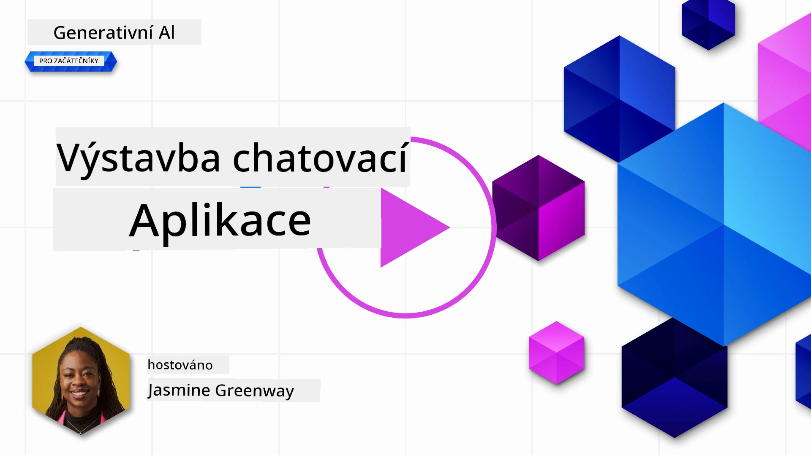
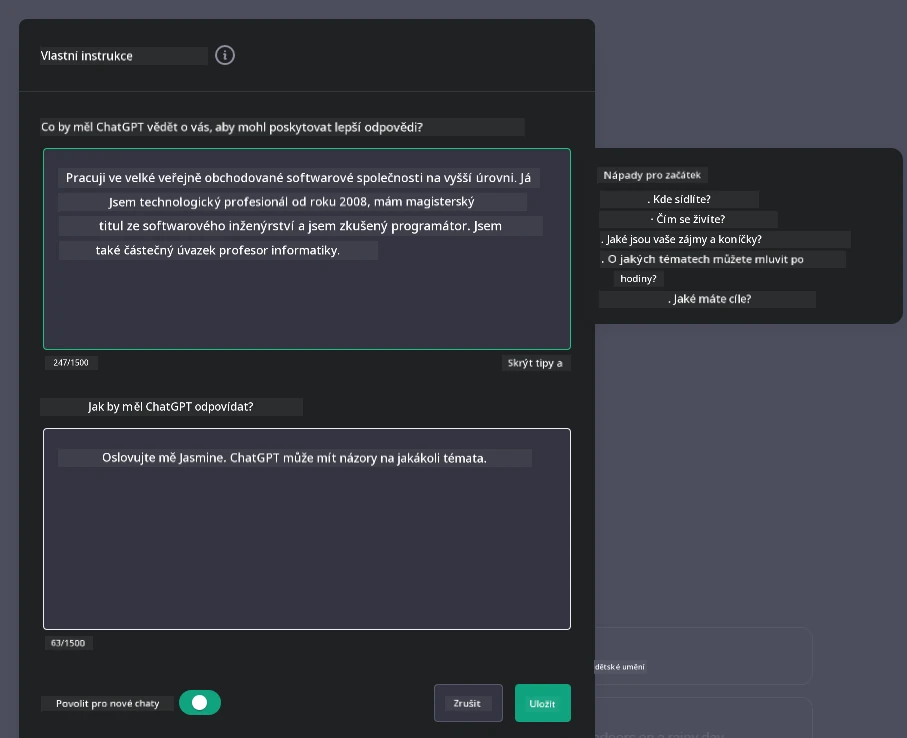
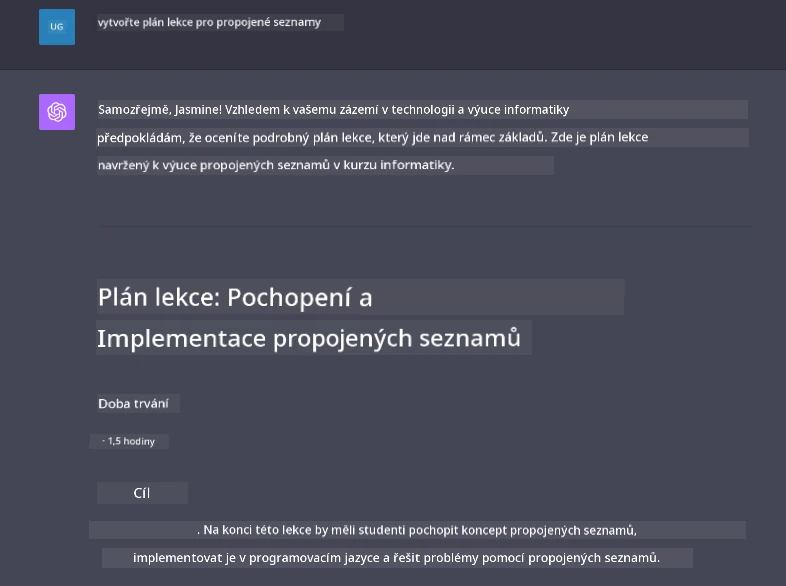

# Vytváření chatovacích aplikací poháněných generativní umělou inteligencí

[](https://youtu.be/R9V0ZY1BEQo?si=IHuU-fS9YWT8s4sA)

> _(Klikněte na obrázek výše pro zobrazení videa této lekce)_

Nyní, když jsme viděli, jak můžeme vytvářet aplikace pro generování textu, pojďme se podívat na chatovací aplikace.

Chatovací aplikace se staly nedílnou součástí našeho každodenního života, nabízející více než jen způsob pro neformální konverzaci. Jsou klíčovou součástí zákaznické podpory, technické asistence a dokonce i sofistikovaných poradenských systémů. Je pravděpodobné, že jste nedávno obdrželi pomoc od chatovací aplikace. Jak do těchto platforem začleňujeme pokročilejší technologie, jako je generativní umělá inteligence, zvyšuje se složitost i výzvy.

Některé otázky, na které potřebujeme odpovědi, jsou:

- **Vytváření aplikace**. Jak efektivně vytvořit a bezproblémově integrovat tyto aplikace poháněné umělou inteligencí pro konkrétní použití?
- **Monitorování**. Jak po nasazení sledovat a zajistit, že aplikace fungují na nejvyšší úrovni kvality, jak z hlediska funkčnosti, tak dodržování [šesti principů odpovědné AI](https://www.microsoft.com/ai/responsible-ai?WT.mc_id=academic-105485-koreyst)?

Jak postupujeme dále do věku definovaného automatizací a bezproblémovou interakcí mezi člověkem a strojem, je nezbytné pochopit, jak generativní AI mění rozsah, hloubku a přizpůsobivost chatovacích aplikací. Tato lekce prozkoumá aspekty architektury podporující tyto složité systémy, metodiky jemného doladění pro specifické domény a zhodnotí metriky a úvahy nezbytné k zajištění odpovědného nasazení AI.

## Úvod

Tato lekce pokrývá:

- Techniky pro efektivní vytváření a integraci chatovacích aplikací.
- Jak aplikovat přizpůsobení a jemné doladění aplikací.
- Strategie a úvahy pro efektivní monitorování chatovacích aplikací.

## Cíle učení

Na konci této lekce budete schopni:

- Popsat úvahy při vytváření a integraci chatovacích aplikací do existujících systémů.
- Přizpůsobit chatovací aplikace pro specifické případy použití.
- Identifikovat klíčové metriky a úvahy pro efektivní monitorování a udržování kvality chatovacích aplikací poháněných AI.
- Zajistit, aby chatovací aplikace využívaly AI odpovědně.

## Integrace generativní AI do chatovacích aplikací

Pozvednutí chatovacích aplikací pomocí generativní AI nespočívá jen v jejich „chytřejším“ fungování; jde o optimalizaci jejich architektury, výkonu a uživatelského rozhraní pro zajištění kvalitního uživatelského zážitku. To zahrnuje zkoumání architektonických základů, integrace API a uživatelských rozhraní. Tato část si klade za cíl poskytnout vám komplexní průvodce navigací v této složité problematice, ať už je připojujete k existujícím systémům, nebo je budujete jako samostatné platformy.

Na konci této části budete vybaveni odbornými znalostmi potřebnými k efektivnímu vytváření a začlenění chatovacích aplikací.

### Chatbot nebo chatovací aplikace?

Než se pustíme do tvorby chatovacích aplikací, porovnejme 'chatboty' a 'chatovací aplikace poháněné AI', které slouží odlišným rolím a funkcím. Hlavním účelem chatbotu je automatizovat konkrétní konverzační úkoly, jako je odpovídání na často kladené otázky nebo sledování zásilky. Obvykle je řízen pravidlovou logikou nebo složitými algoritmy AI. Naproti tomu chatovací aplikace poháněná AI je mnohem rozsáhlejší prostředí navržené k usnadnění různých forem digitální komunikace, jako jsou textové, hlasové a videohovory mezi lidskými uživateli. Její klíčovou vlastností je integrace generativního AI modelu, který simuluje jemné, lidsky podobné konverzace a generuje odpovědi na základě širokého spektra vstupů a kontextových podnětů. Chatovací aplikace s generativní AI se může zapojit do diskuzí otevřeného tématu, přizpůsobovat se vyvíjejícím konverzačním kontextům a dokonce vytvářet kreativní či složité dialogy.

Tabulka níže shrnuje klíčové rozdíly a podobnosti, aby nám pomohla pochopit jejich jedinečné role v digitální komunikaci.

| Chatbot                               | Chatovací aplikace poháněná generativní AI           |
| ------------------------------------- | --------------------------------------               |
| Zaměřený na úkoly a na pravidlech     | Kontextuálně orientovaný                             |
| Často integrován do větších systémů   | Může obsahovat jeden či více chatbotů                 |
| Omezen na naprogramované funkce        | Zahrnuje generativní AI modely                         |
| Specializované a strukturované interakce | Schopen diskuzí otevřeného tématu                       |

### Využití předpřipravených funkcionalit prostřednictvím SDK a API

Při vytváření chatovací aplikace je skvělým prvním krokem zjistit, co už je k dispozici. Využití SDK a API pro vytváření chatovacích aplikací je výhodná strategie z různých důvodů. Integrací dobře zdokumentovaných SDK a API strategicky připravujete svou aplikaci na dlouhodobý úspěch a řešíte otázky škálovatelnosti a údržby.

- **Urychluje vývojový proces a snižuje režii**: Spoléhání se na předpřipravené funkce místo nákladného vývoje od nuly vám umožní soustředit se na jiné aspekty aplikace, které můžete považovat za důležitější, například obchodní logiku.
- **Lepší výkon**: Při budování funkčnosti od nuly se nakonec zeptáte „Jak to škáluje? Je aplikace schopná zvládnout náhlý příliv uživatelů?“ Dobře udržované SDK a API mají často zabudovaná řešení těchto problémů.
- **Snazší údržba**: Aktualizace a vylepšení se spravují jednodušeji, protože většina API a SDK vyžaduje pouze aktualizaci knihovny při vydání nové verze.
- **Přístup k nejmodernější technologii**: Využití modelů doladěných a trénovaných na rozsáhlých datech dodává vaší aplikaci schopnosti přirozeného jazyka.

Přístup k funkcionalitě SDK či API obvykle vyžaduje získání oprávnění k používání poskytnutých služeb, což často probíhá pomocí unikátního klíče nebo autentizačního tokenu. Použijeme knihovnu OpenAI pro Python, abychom si ukázali, jak to vypadá. Můžete si to také sami vyzkoušet v následujícím [notebooku pro OpenAI](./python/oai-assignment.ipynb?WT.mc_id=academic-105485-koreyst) nebo [notebooku pro Azure OpenAI Services](./python/aoai-assignment.ipynb?WT.mc_id=academic-105485-koreys) pro tuto lekci.

```python
import os
from openai import OpenAI

API_KEY = os.getenv("OPENAI_API_KEY","")

client = OpenAI(
    api_key=API_KEY
    )

response = client.responses.create(model="gpt-5-mini", input="Suggest two titles for an instructional lesson on chat applications for generative AI.", store=False)
print(response.output_text)
```

Výše uvedený příklad používá mini model GPT-5 s API pro odpovědi k dokončení promptu, ale všimněte si, že klíč API je nastaven předem. Bez nastavení klíče byste obdrželi chybu.

## Uživatelský zážitek (UX)

Obecné principy UX platí i pro chatovací aplikace, ale zde je několik dalších úvah, které jsou obzvlášť důležité kvůli součástem strojového učení.

- **Mechanismus pro řešení nejasností**: Generativní AI modely občas generují nejednoznačné odpovědi. Funkce, která uživatelům umožní vyžádat si upřesnění, může být užitečná, pokud se s tímto problémem setkají.
- **Uchování kontextu**: Pokročilé generativní AI modely mají schopnost pamatovat si kontext v rámci konverzace, což může být pro uživatelský zážitek nezbytné. Umožnění uživatelům ovládat a spravovat kontext zlepšuje zážitek, ale zároveň přináší riziko uchovávání citlivých informací. Úvahy o tom, jak dlouho jsou tyto informace uchovávány, například zavedení politiky uchovávání, mohou vyvážit potřebu kontextu a soukromí.
- **Personalizace**: Díky schopnosti učit se a přizpůsobovat AI modely nabízejí uživateli individuální zážitek. Přizpůsobení uživatelského zážitku prostřednictvím funkcí jako jsou uživatelské profily nejen vytváří pocit, že je uživatel pochopen, ale také usnadňuje hledání specifických odpovědí a vytváří efektivnější a uspokojivější interakce.

Příkladem personalizace je nastavení "Vlastní instrukce" v ChatGPT od OpenAI. Umožňuje vám poskytnout informace o sobě, které mohou být důležitým kontextem pro vaše promptování. Zde je příklad vlastní instrukce.



Tento „profil“ vybízí ChatGPT, aby vytvořil plán lekce o spojových seznamech. Všimněte si, že ChatGPT bere v úvahu, že uživatel může chtít podrobnější plán na základě její zkušenosti.



### Microsoft Framework systémových zpráv pro velké jazykové modely

[Microsoft poskytl pokyny](https://learn.microsoft.com/azure/ai-foundry/openai/concepts/system-message#define-the-models-output-format?WT.mc_id=academic-105485-koreyst) pro psaní efektivních systémových zpráv při generování odpovědí z LLM rozdělených do 4 oblastí:

1. Definování, pro koho je model určen, jeho schopností a omezení.
2. Definování formátu výstupu modelu.
3. Poskytnutí konkrétních příkladů, které demonstrují zamýšlené chování modelu.
4. Poskytnutí dodatečných ochranných opatření chování.

### Přístupnost

Ať už má uživatel vizuální, sluchové, motorické nebo kognitivní postižení, dobře navržená chatovací aplikace by měla být použitelná pro všechny. Následující seznam rozděluje konkrétní funkce zaměřené na zlepšení přístupnosti pro různé druhy postižení uživatelů.

- **Funkce pro zrakové postižení**: Motivy s vysokým kontrastem a možnost změny velikosti textu, kompatibilita se čtečkami obrazovky.
- **Funkce pro sluchové postižení**: Funkce převodu textu na řeč a řeči na text, vizuální upozornění na zvukové notifikace.
- **Funkce pro motorické postižení**: Podpora navigace pomocí klávesnice, hlasové příkazy.
- **Funkce pro kognitivní postižení**: Možnosti zjednodušeného jazyka.

## Přizpůsobení a jemné doladění pro doménově specifické jazykové modely

Představte si chatovací aplikaci, která rozumí žargonu vaší společnosti a předjímají konkrétní dotazy, které obvykle uživatelé kladou. Existuje několik přístupů, které stojí za zmínku:

- **Využití DSL modelů**. DSL znamená doménově specifický jazyk. Můžete využít tzv. DSL modelu vytrénovaného na konkrétní doméně, aby rozuměl jejím konceptům a scénářům.
- **Použití jemného doladění**. Jemné doladění je proces dalšího tréninku modelu na konkrétních datech.

## Přizpůsobení: Použití DSL

Využití doménově specifických jazykových modelů (DSL modelů) může zvýšit zapojení uživatelů tím, že poskytne specializované, kontextově relevantní interakce. Jedná se o model, který je vytrénován nebo jemně doladěn, aby rozuměl a generoval text související s konkrétní oblastí, průmyslem nebo tématem. Možnosti použití DSL modelu sahají od tréninku od nuly po používání již existujících prostřednictvím SDK a API. Další možností je jemné doladění, které spočívá v přizpůsobení existujícího předtrénovaného modelu pro konkrétní doménu.

## Přizpůsobení: Použití jemného doladění

Jemné doladění se často zvažuje, když předtrénovaný model nestačí v nějaké specializované doméně nebo konkrétním úkolu.

Například lékařské dotazy jsou složité a vyžadují hodně kontextu. Když lékař diagnostikuje pacienta, vychází z různých faktorů, jako je životní styl nebo předchozí onemocnění, a může se spoléhat i na aktuální lékařské časopisy pro ověření diagnózy. V takto jemných scénářích nelze obecnou AI chatovací aplikaci považovat za spolehlivý zdroj.

### Scénář: lékařská aplikace

Zvažte chatovací aplikaci navrženou k pomoci lékařům rychlým poskytováním referencí na léčebné směrnice, lékové interakce nebo nejnovější vědecké poznatky.

Obecný model může být dostatečný pro základní lékařské dotazy nebo obecné rady, ale může mít problém s následujícím:

- **Velmi specifické nebo složité případy**. Například neurolog může položit aplikaci otázku: „Jaké jsou současné nejlepší postupy pro léčbu farmakorezistentní epilepsie u dětských pacientů?“
- **Nedostatek nejnovějších pokroků**. Obecný model by mohl mít problém poskytnout aktuální odpověď zahrnující nejnovější pokroky v neurologii a farmacii.

V těchto případech může jemné doladění modelu specializovaným lékařským souborem dat významně zlepšit jeho schopnost přesně a spolehlivě zvládat složité lékařské dotazy. To vyžaduje přístup k velkému a relevantnímu datasetu představujícímu specifické problémy a otázky dané domény.

## Úvahy pro vysoce kvalitní AI řízený chatovací zážitek

Tato část popisuje kritéria „vysoce kvalitních“ chatovacích aplikací, což zahrnuje zachycení akčních metrik a dodržování rámce, který zodpovědně využívá technologii AI.

### Klíčové metriky

Aby bylo možné udržet vysokou kvalitu výkonu aplikace, je nezbytné sledovat klíčové metriky a úvahy. Tyto měření nejen zajišťují funkčnost aplikace, ale také hodnotí kvalitu AI modelu a uživatelský zážitek. Níže je seznam základních metrik AI a metrik uživatelského zážitku, které je třeba zvážit.

| Metrika                      | Definice                                                                                                      | Úvahy pro vývojáře chatovací aplikace                  |
| ---------------------------- | ------------------------------------------------------------------------------------------------------------- | ------------------------------------------------------ |
| **Doba provozu (Uptime)**    | Měří dobu, po kterou je aplikace v provozu a dostupná uživatelům.                                            | Jak minimalizujete nefunkčnost aplikace?               |
| **Doba odezvy**              | Čas, který aplikace potřebuje na odpověď na dotaz uživatele.                                                  | Jak optimalizujete zpracování dotazu pro zlepšení doby odezvy? |
| **Přesnost (Precision)**     | Poměr pravdivých pozitivních predikcí k celkovému počtu pozitivních predikcí.                                | Jak budete validovat přesnost modelu?                   |
| **Recall (citlivost)**       | Poměr pravdivých pozitivních predikcí k skutečnému počtu pozitivních případů.                                 | Jak budete měřit a zlepšovat recall?                    |
| **F1 skóre**                 | Harmonický průměr přesnosti a recall, který vyvažuje kompromis mezi oběma.                                  | Jaké je vaše cílové F1 skóre? Jak vyvážíte přesnost a recall? |
| **Perplexita**               | Měří, jak dobře pravděpodobnostní rozdělení předpovězené modelem odpovídá skutečnému rozdělení dat.           | Jak minimalizujete perplexitu?                          |
| **Metriky spokojenosti uživatelů** | Měří vnímání aplikace uživatelem, často zaznamenávané prostřednictvím průzkumů.                             | Jak často budete sbírat zpětnou vazbu? Jak se podle ní přizpůsobíte?  |
| **Míra chybovosti**          | Míra, s jakou model dělá chyby při porozumění nebo generování výstupu.                                       | Jaké strategie máte na snížení chybovosti?              |
| **Cyklus přeškolování**      | Frekvence, s jakou je model aktualizován pro začlenění nových dat a poznatků.                                 | Jak často budete model přeškolovat? Co spouští cyklus přeškolování? |

| **Detekce anomálií**         | Nástroje a techniky pro identifikaci neobvyklých vzorců, které neodpovídají očekávanému chování.                        | Jak budete reagovat na anomálie?                                        |

### Implementace odpovědných praktik AI v chatovacích aplikacích

Přístup Microsoftu k odpovědné AI identifikoval šest principů, které by měly řídit vývoj a použití AI. Níže jsou uvedeny principy, jejich definice a věci, které by měl vývojář chatovací aplikace zvážit a proč by je měl brát vážně.

| Principy              | Definice Microsoftu                                  | Úvahy pro vývojáře chatovací aplikace                                | Proč je to důležité                                                                 |
| ---------------------- | --------------------------------------------------- | ------------------------------------------------------------------- | ----------------------------------------------------------------------------------- |
| Spravedlnost           | AI systémy by měly jednat spravedlivě se všemi lidmi. | Zajistit, aby chatovací aplikace nediskriminovala na základě uživatelských dat. | K budování důvěry a inkluzivity mezi uživateli; zabraňuje právním důsledkům.       |
| Spolehlivost a bezpečnost | AI systémy by měly fungovat spolehlivě a bezpečně. | Implementovat testování a ochranné mechanismy ke snížení chyb a rizik. | Zajišťuje spokojenost uživatelů a předchází možným škodám.                           |
| Soukromí a bezpečnost  | AI systémy by měly být bezpečné a respektovat soukromí. | Zavést silné šifrování a opatření na ochranu dat.                    | K ochraně citlivých uživatelských dat a dodržování zákonů o ochraně soukromí.       |
| Inkluzivita            | AI systémy by měly posilovat každého a zapojovat lidi. | Navrhnout UI/UX, které je přístupné a snadno použitelné pro různorodé publikum. | Zajišťuje, že aplikaci může efektivně používat širší spektrum lidí.                  |
| Transparentnost        | AI systémy by měly být srozumitelné.                 | Poskytnout jasnou dokumentaci a zdůvodnění odpovědí AI.              | Uživatelé více důvěřují systému, pokud rozumí rozhodovacím procesům.                 |
| Odpovědnost            | Za AI systémy by měli být lidé odpovědní.             | Zavést jasný proces auditu a zlepšování rozhodnutí AI.               | Umožňuje průběžné zlepšování a nápravná opatření v případě chyb.                    |

## Zadání

Podívejte se na [zadání](../../../07-building-chat-applications/python). Provede vás sérií cvičení od spuštění prvních chatových výzev, klasifikace a shrnutí textu a dalších. Všimněte si, že zadání jsou dostupná v různých programovacích jazycích!

## Skvělá práce! Pokračujte v cestě

Po dokončení této lekce si prohlédněte naši [sbírku Generative AI Learning](https://aka.ms/genai-collection?WT.mc_id=academic-105485-koreyst), abyste pokračovali v rozšiřování svých znalostí o Generative AI!

Přejděte na Lekci 8, kde zjistíte, jak můžete začít [vytvářet vyhledávací aplikace](../08-building-search-applications/README.md?WT.mc_id=academic-105485-koreyst)!

---

<!-- CO-OP TRANSLATOR DISCLAIMER START -->
**Prohlášení o omezení odpovědnosti**:
Tento dokument byl přeložen pomocí AI překladatelské služby [Co-op Translator](https://github.com/Azure/co-op-translator). Přestože usilujeme o co největší přesnost, mějte prosím na paměti, že automatizované překlady mohou obsahovat chyby nebo nepřesnosti. Originální dokument v jeho mateřském jazyce by měl být považován za autoritativní zdroj. Pro kritické informace se doporučuje profesionální lidský překlad. Nejsme odpovědní za jakékoli nedorozumění nebo nesprávné interpretace vzniklé použitím tohoto překladu.
<!-- CO-OP TRANSLATOR DISCLAIMER END -->