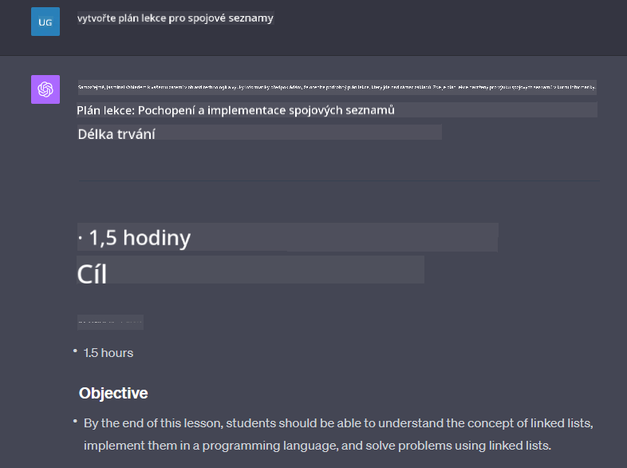

<!--
CO_OP_TRANSLATOR_METADATA:
{
  "original_hash": "ea4bbe640847aafbbba14dae4625e9af",
  "translation_date": "2025-07-09T12:38:20+00:00",
  "source_file": "07-building-chat-applications/README.md",
  "language_code": "cs"
}
-->
# Vytváření chatovacích aplikací poháněných generativní AI

[](https://aka.ms/gen-ai-lessons7-gh?WT.mc_id=academic-105485-koreyst)

> _(Klikněte na obrázek výše pro zhlédnutí videa této lekce)_

Nyní, když jsme viděli, jak můžeme vytvářet aplikace pro generování textu, podívejme se na chatovací aplikace.

Chatovací aplikace se staly nedílnou součástí našeho každodenního života a nabízejí mnohem víc než jen možnost neformální konverzace. Jsou klíčovou součástí zákaznické podpory, technické asistence a dokonce i sofistikovaných poradenských systémů. Je pravděpodobné, že jste v nedávné době využili pomoc chatovací aplikace. S integrací pokročilejších technologií, jako je generativní AI, do těchto platforem roste i jejich složitost a s ní i výzvy.

Některé otázky, na které potřebujeme odpovědi, jsou:

- **Vytvoření aplikace**. Jak efektivně vyvinout a bezproblémově integrovat tyto AI-poháněné aplikace pro konkrétní případy použití?
- **Monitorování**. Jak po nasazení sledovat a zajistit, aby aplikace fungovaly na nejvyšší úrovni kvality, jak z hlediska funkčnosti, tak dodržování [šesti principů odpovědné AI](https://www.microsoft.com/ai/responsible-ai?WT.mc_id=academic-105485-koreyst)?

Jak postupujeme dále do éry definované automatizací a plynulou interakcí člověk-stroj, je klíčové pochopit, jak generativní AI mění rozsah, hloubku a přizpůsobivost chatovacích aplikací. Tato lekce prozkoumá aspekty architektury podporující tyto složité systémy, metodiky jejich doladění pro specifické úkoly a zhodnotí metriky a úvahy důležité pro odpovědné nasazení AI.

## Úvod

Tato lekce zahrnuje:

- Techniky pro efektivní vytváření a integraci chatovacích aplikací.
- Jak aplikovat přizpůsobení a doladění aplikací.
- Strategie a úvahy pro efektivní monitorování chatovacích aplikací.

## Cíle učení

Na konci této lekce budete schopni:

- Popsat úvahy při vytváření a integraci chatovacích aplikací do stávajících systémů.
- Přizpůsobit chatovací aplikace pro konkrétní případy použití.
- Identifikovat klíčové metriky a úvahy pro efektivní monitorování a udržování kvality AI-poháněných chatovacích aplikací.
- Zajistit, aby chatovací aplikace využívaly AI odpovědně.

## Integrace generativní AI do chatovacích aplikací

Vylepšení chatovacích aplikací pomocí generativní AI není jen o tom, aby byly chytřejší; jde o optimalizaci jejich architektury, výkonu a uživatelského rozhraní tak, aby poskytovaly kvalitní uživatelský zážitek. To zahrnuje zkoumání architektonických základů, integrace API a úvah o uživatelském rozhraní. Tato část vám poskytne komplexní plán, jak se orientovat v těchto složitých oblastech, ať už je připojujete ke stávajícím systémům, nebo vytváříte samostatné platformy.

Na konci této části budete vybaveni znalostmi potřebnými k efektivnímu vytváření a začlenění chatovacích aplikací.

### Chatbot nebo chatovací aplikace?

Než se pustíme do tvorby chatovacích aplikací, porovnejme „chatboty“ a „AI-poháněné chatovací aplikace“, které plní odlišné role a funkce. Hlavním účelem chatbota je automatizovat konkrétní konverzační úkoly, jako je odpovídání na často kladené otázky nebo sledování zásilky. Obvykle je řízen pravidly nebo složitými AI algoritmy. Naproti tomu AI-poháněná chatovací aplikace je mnohem rozsáhlejší prostředí určené k usnadnění různých forem digitální komunikace, jako jsou textové, hlasové a video chaty mezi lidmi. Její klíčovou vlastností je integrace generativního AI modelu, který simuluje jemné, lidsky podobné konverzace a generuje odpovědi na základě široké škály vstupů a kontextových podnětů. Chatovací aplikace poháněná generativní AI může vést otevřené diskuse, přizpůsobovat se měnícím se konverzačním kontextům a dokonce vytvářet kreativní či složité dialogy.

Následující tabulka shrnuje klíčové rozdíly a podobnosti, které nám pomohou pochopit jejich jedinečné role v digitální komunikaci.

| Chatbot                               | Chatovací aplikace poháněná generativní AI |
| ------------------------------------- | ------------------------------------------ |
| Zaměřený na úkoly a založený na pravidlech | Kontextově uvědomělý                      |
| Často integrovaný do větších systémů  | Může hostit jeden nebo více chatbotů       |
| Omezený na naprogramované funkce      | Zahrnuje generativní AI modely             |
| Specializované a strukturované interakce | Schopen otevřených diskuzí                  |

### Využití předpřipravených funkcí pomocí SDK a API

Při tvorbě chatovací aplikace je dobrým prvním krokem zjistit, co už je k dispozici. Používání SDK a API pro vývoj chatovacích aplikací je výhodná strategie z několika důvodů. Integrací dobře zdokumentovaných SDK a API strategicky nastavujete svou aplikaci na dlouhodobý úspěch, řešíte škálovatelnost a údržbu.

- **Zrychluje vývoj a snižuje náklady**: Spoléhání se na předpřipravené funkce místo nákladného vývoje od nuly vám umožní soustředit se na jiné důležité části aplikace, například obchodní logiku.
- **Lepší výkon**: Při vývoji funkcí od začátku si nakonec položíte otázku „Jak to škáluje? Je aplikace schopná zvládnout náhlý příliv uživatelů?“ Dobře udržovaná SDK a API často obsahují vestavěná řešení těchto problémů.
- **Snazší údržba**: Aktualizace a vylepšení jsou jednodušší, protože většina API a SDK vyžaduje pouze aktualizaci knihovny při vydání nové verze.
- **Přístup k nejmodernější technologii**: Využití modelů, které byly doladěny a trénovány na rozsáhlých datech, poskytuje vaší aplikaci schopnosti přirozeného jazyka.

Přístup k funkcím SDK nebo API obvykle vyžaduje získání oprávnění k používání služeb, často prostřednictvím unikátního klíče nebo autentizačního tokenu. Prozkoumáme to pomocí OpenAI Python Library. Můžete si to také vyzkoušet sami v následujícím [notebooku pro OpenAI](python/oai-assignment.ipynb) nebo [notebooku pro Azure OpenAI Services](python/aoai-assignment.ipynb) k této lekci.

```python
import os
from openai import OpenAI

API_KEY = os.getenv("OPENAI_API_KEY","")

client = OpenAI(
    api_key=API_KEY
    )

chat_completion = client.chat.completions.create(model="gpt-3.5-turbo", messages=[{"role": "user", "content": "Suggest two titles for an instructional lesson on chat applications for generative AI."}])
```

Výše uvedený příklad používá model GPT-3.5 Turbo k dokončení promptu, ale všimněte si, že API klíč je nastaven před tímto krokem. Bez nastavení klíče byste obdrželi chybu.

## Uživatelská zkušenost (UX)

Obecné principy UX platí i pro chatovací aplikace, ale zde jsou některé další úvahy, které jsou zvlášť důležité kvůli komponentám strojového učení.

- **Mechanismus pro řešení nejasností**: Generativní AI modely občas generují nejednoznačné odpovědi. Funkce, která uživatelům umožní požádat o upřesnění, může být užitečná, pokud na tento problém narazí.
- **Uchovávání kontextu**: Pokročilé generativní AI modely mají schopnost pamatovat si kontext v rámci konverzace, což může být pro uživatelský zážitek nezbytné. Umožnění uživatelům ovládat a spravovat kontext zlepšuje uživatelský zážitek, ale zároveň přináší riziko uchovávání citlivých informací. Úvahy o tom, jak dlouho jsou tyto informace uchovávány, například zavedení politiky uchovávání, mohou vyvážit potřebu kontextu a ochranu soukromí.
- **Personalizace**: Díky schopnosti učit se a přizpůsobovat se nabízejí AI modely individualizovaný zážitek pro uživatele. Přizpůsobení uživatelského zážitku pomocí funkcí jako uživatelské profily nejenže dává uživateli pocit, že je chápán, ale také mu pomáhá rychleji najít konkrétní odpovědi, čímž vytváří efektivnější a uspokojivější interakci.

Příkladem personalizace jsou „Vlastní instrukce“ v ChatGPT od OpenAI. Umožňují vám poskytnout informace o sobě, které mohou být důležitým kontextem pro vaše promptování. Zde je příklad vlastní instrukce.


Tento „profil“ vybízí ChatGPT k vytvoření plánu lekce o spojových seznamech. Všimněte si, že ChatGPT bere v úvahu, že uživatel může chtít podrobnější plán lekce na základě svých zkušeností.



### Microsoft Framework systémových zpráv pro velké jazykové modely

[Microsoft poskytl doporučení](https://learn.microsoft.com/azure/ai-services/openai/concepts/system-message#define-the-models-output-format?WT.mc_id=academic-105485-koreyst) pro psaní efektivních systémových zpráv při generování odpovědí z LLM, rozdělených do 4 oblastí:

1. Definování, pro koho je model určen, jeho schopností a omezení.
2. Definování formátu výstupu modelu.
3. Poskytnutí konkrétních příkladů, které demonstrují zamýšlené chování modelu.
4. Poskytnutí dalších pravidel chování (guardrails).

### Přístupnost

Ať už má uživatel zrakové, sluchové, motorické nebo kognitivní postižení, dobře navržená chatovací aplikace by měla být použitelná pro všechny. Následující seznam rozděluje specifické funkce zaměřené na zlepšení přístupnosti pro různé typy postižení.

- **Funkce pro zrakové postižení**: Vysoký kontrast témat a možnost zvětšení textu, kompatibilita s čtečkami obrazovky.
- **Funkce pro sluchové postižení**: Funkce převodu textu na řeč a řeči na text, vizuální upozornění na zvukové notifikace.
- **Funkce pro motorické postižení**: Podpora navigace pomocí klávesnice, hlasové příkazy.
- **Funkce pro kognitivní postižení**: Možnosti zjednodušeného jazyka.

## Přizpůsobení a doladění pro doménově specifické jazykové modely

Představte si chatovací aplikaci, která rozumí žargonu vaší firmy a předvídá konkrétní dotazy, které uživatelé často kladou. Existuje několik přístupů, které stojí za zmínku:

- **Využití DSL modelů**. DSL znamená doménově specifický jazyk. Můžete využít tzv. DSL model, který je trénován na konkrétní doménu, aby rozuměl jejím pojmům a scénářům.
- **Aplikace doladění (fine-tuning)**. Doladění je proces dalšího tréninku modelu na specifických datech.

## Přizpůsobení: Použití DSL

Využití doménově specifických jazykových modelů (DSL modelů) může zvýšit zapojení uživatelů tím, že poskytne specializované, kontextově relevantní interakce. Jedná se o model, který je trénován nebo doladěn tak, aby rozuměl a generoval text týkající se konkrétního oboru, průmyslu nebo tématu. Možnosti použití DSL modelu se pohybují od tréninku modelu od začátku až po využití již existujících modelů přes SDK a API. Další možností je doladění, které spočívá v přizpůsobení existujícího předtrénovaného modelu pro konkrétní doménu.

## Přizpůsobení: Aplikace doladění

Doladění se často zvažuje, když předtrénovaný model nestačí v specializované doméně nebo pro konkrétní úkol.

Například lékařské dotazy jsou složité a vyžadují hodně kontextu. Když lékař diagnostikuje pacienta, vychází z různých faktorů, jako je životní styl nebo předchozí onemocnění, a může se spoléhat i na nejnovější lékařské studie k ověření diagnózy. V takto jemných situacích nemůže být obecná AI chatovací aplikace spolehlivým zdrojem.

### Scénář: lékařská aplikace

Představte si chatovací aplikaci navrženou k pomoci lékařům tím, že poskytuje rychlé odkazy na léčebné směrnice, interakce léků nebo nejnovější výzkumné poznatky.

Obecný model může být dostačující pro odpovědi na základní lékařské otázky nebo obecné rady, ale může mít potíže s:

- **Vysoce specifickými nebo složitými případy**. Například neurolog může aplikaci položit otázku: „Jaké jsou aktuální nejlepší postupy při léčbě farmakorezistentní epilepsie u dětských pacientů?“
- **Nedostatkem nejnovějších poznatků**. Obecný model může mít problém poskytnout aktuální odpověď, která zahrnuje nejnovější pokroky v neurologii a farmakologii.

V takových případech může doladění modelu na specializovaném lékařském datasetu výrazně zlepšit jeho schopnost přesně a spolehlivě zpracovávat tyto složité lékařské dotazy. To vyžaduje přístup k rozsáhlému a relevantnímu datasetu, který reprezentuje doménově specifické výzvy a otázky, jež je třeba řešit.

## Úvahy pro vysoce kvalitní AI-řízený chatovací zážitek

Tato část popisuje kritéria pro „vysoce kvalitní“ chatovací aplikace, která zahrnují sběr měřitelných metrik a dodržování rámce odpovědného využívání AI technologie.

### Klíčové metriky

Pro udržení vysoké kvality výkonu aplikace je nezbytné sledovat klíčové metriky a úvahy. Tyto ukazatele nejen zajišťují funkčnost aplikace, ale také hodnotí kvalitu AI modelu a uživatelský zážitek. Níže je seznam základních, AI a UX metrik, které je třeba zvážit.

| Metrika                      | Definice                                                                                                              | Úvahy pro vývojáře chatovací aplikace                              |
| ---------------------------- | --------------------------------------------------------------------------------------------------------------------- | ------------------------------------------------------------------ |
| **Dostupnost (Uptime)**      | Měří dobu, po kterou je aplikace v provozu a přístupná uživatelům.                                                   | Jak minimalizujete výpadky?                                        |
| **Doba odezvy**              | Čas, který aplikace potřebuje k odpovědi na dotaz uživatele.                                                          | Jak optimalizujete zpracování dotazů pro zlepšení doby odezvy?     |
| **Přesnost (Precision)**     | Poměr správně pozitivních předpovědí k celkovému počtu pozitivních předpovědí.                                        | Jak ověříte přesnost svého modelu?                                |
| **Recall (Citlivost)**       | Poměr správně pozitivních předpovědí k skutečnému počtu pozitivních případů.                                          | Jak budete měřit a zlepšovat recall?                              |
| **F1 skóre**                 | Harmonický průměr
| **Detekce anomálií**         | Nástroje a techniky pro identifikaci neobvyklých vzorců, které neodpovídají očekávanému chování.                        | Jak budete reagovat na anomálie?                                        |

### Implementace zásad odpovědné AI v chatovacích aplikacích

Přístup Microsoftu k odpovědné AI vymezil šest principů, které by měly řídit vývoj a používání AI. Níže jsou uvedeny principy, jejich definice a věci, které by měl vývojář chatu zvážit a proč by je měl brát vážně.

| Principy               | Definice Microsoftu                                  | Úvahy pro vývojáře chatu                                            | Proč je to důležité                                                                    |
| ---------------------- | --------------------------------------------------- | ------------------------------------------------------------------ | -------------------------------------------------------------------------------------- |
| Spravedlnost           | AI systémy by měly zacházet se všemi lidmi spravedlivě. | Zajistit, aby chatovací aplikace nediskriminovala na základě uživatelských dat. | Budování důvěry a inkluzivity mezi uživateli; předchází právním problémům.             |
| Spolehlivost a bezpečnost | AI systémy by měly fungovat spolehlivě a bezpečně. | Zavést testování a bezpečnostní opatření pro minimalizaci chyb a rizik. | Zajišťuje spokojenost uživatelů a předchází možným škodám.                             |
| Soukromí a bezpečnost  | AI systémy by měly být bezpečné a respektovat soukromí. | Implementovat silné šifrování a opatření na ochranu dat.           | Ochrana citlivých uživatelských dat a dodržování zákonů o ochraně soukromí.            |
| Inkluzivita            | AI systémy by měly posilovat všechny a zapojovat lidi. | Navrhnout UI/UX, které je přístupné a snadno použitelné pro různé skupiny uživatelů. | Zajišťuje, že aplikaci může efektivně používat širší spektrum lidí.                    |
| Transparentnost        | AI systémy by měly být srozumitelné.                | Poskytnout jasnou dokumentaci a vysvětlení AI odpovědí.            | Uživatelé více důvěřují systému, pokud rozumí, jak jsou rozhodnutí přijímána.         |
| Odpovědnost            | Lidé by měli být odpovědní za AI systémy.            | Zavést jasný proces pro audit a zlepšování AI rozhodnutí.          | Umožňuje průběžné zlepšování a nápravu v případě chyb.                               |

## Zadání

Podívejte se na [assignment](../../../07-building-chat-applications/python), který vás provede sérií cvičení od spuštění prvních chatovacích promptů, přes klasifikaci a shrnutí textu až po další úkoly. Všimněte si, že zadání jsou dostupná v různých programovacích jazycích!

## Skvělá práce! Pokračujte v cestě

Po dokončení této lekce si prohlédněte naši [kolekci Generative AI Learning](https://aka.ms/genai-collection?WT.mc_id=academic-105485-koreyst), kde můžete dále rozvíjet své znalosti o generativní AI!

Přejděte k lekci 8 a zjistěte, jak můžete začít [vytvářet vyhledávací aplikace](../08-building-search-applications/README.md?WT.mc_id=academic-105485-koreyst)!

**Prohlášení o vyloučení odpovědnosti**:  
Tento dokument byl přeložen pomocí AI překladatelské služby [Co-op Translator](https://github.com/Azure/co-op-translator). I když usilujeme o přesnost, mějte prosím na paměti, že automatizované překlady mohou obsahovat chyby nebo nepřesnosti. Původní dokument v jeho mateřském jazyce by měl být považován za autoritativní zdroj. Pro důležité informace se doporučuje profesionální lidský překlad. Nejsme odpovědní za jakékoliv nedorozumění nebo nesprávné výklady vyplývající z použití tohoto překladu.