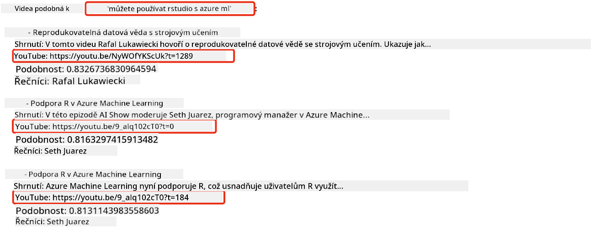
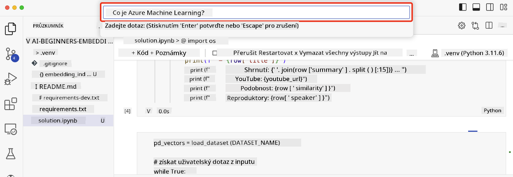

<!--
CO_OP_TRANSLATOR_METADATA:
{
  "original_hash": "d46aad0917a1a342d613e2c13d457da5",
  "translation_date": "2025-05-19T18:41:09+00:00",
  "source_file": "08-building-search-applications/README.md",
  "language_code": "cs"
}
-->
# Budování vyhledávacích aplikací

[](https://aka.ms/gen-ai-lesson8-gh?WT.mc_id=academic-105485-koreyst)

> > _Klikněte na obrázek výše pro zhlédnutí videa této lekce_

LLM nabízejí víc než jen chatboty a generování textu. Je také možné vytvářet vyhledávací aplikace pomocí vektorových reprezentací známých jako Embeddings. Tyto numerické reprezentace dat lze použít pro sémantické vyhledávání.

V této lekci vytvoříte vyhledávací aplikaci pro náš vzdělávací startup. Naše organizace je nezisková a poskytuje zdarma vzdělání studentům v rozvojových zemích. Máme mnoho YouTube videí, která studenti mohou použít k učení o AI. Chceme vytvořit vyhledávací aplikaci, která studentům umožní hledat YouTube videa zadáním otázky.

Například student může zadat 'Co jsou Jupyter Notebooks?' nebo 'Co je Azure ML' a vyhledávací aplikace vrátí seznam relevantních YouTube videí a ještě lépe, odkaz na místo ve videu, kde je odpověď na otázku.

## Úvod

V této lekci se budeme věnovat:

- Rozdílu mezi sémantickým a klíčovým vyhledáváním.
- Co jsou textové vektorové reprezentace.
- Vytváření indexu textových vektorových reprezentací.
- Vyhledávání v indexu textových vektorových reprezentací.

## Cíle učení

Po dokončení této lekce budete schopni:

- Rozlišit mezi sémantickým a klíčovým vyhledáváním.
- Vysvětlit, co jsou textové vektorové reprezentace.
- Vytvořit aplikaci využívající vektorové reprezentace pro vyhledávání dat.

## Proč vytvářet vyhledávací aplikaci?

Vytvoření vyhledávací aplikace vám pomůže pochopit, jak používat vektorové reprezentace pro vyhledávání dat. Naučíte se také, jak vytvořit vyhledávací aplikaci, kterou mohou studenti použít k rychlému nalezení informací.

Lekce obsahuje index vektorových reprezentací přepisů YouTube kanálu Microsoft [AI Show](https://www.youtube.com/playlist?list=PLlrxD0HtieHi0mwteKBOfEeOYf0LJU4O1). AI Show je kanál, který vás učí o AI a strojovém učení. Index obsahuje vektorové reprezentace pro každý přepis až do října 2023. Použijete tento index k vytvoření vyhledávací aplikace pro náš startup. Aplikace vrací odkaz na místo ve videu, kde se nachází odpověď na otázku. To je skvělý způsob, jak studenti mohou rychle najít potřebné informace.

Následuje příklad sémantického dotazu na otázku 'můžete použít rstudio s azure ml?'. Podívejte se na URL YouTube, uvidíte, že obsahuje časový údaj, který vás zavede na místo ve videu, kde je odpověď.



## Co je sémantické vyhledávání?

Možná se ptáte, co je sémantické vyhledávání? Sémantické vyhledávání je technika, která používá význam slov v dotazu k vrácení relevantních výsledků.

Zde je příklad sémantického vyhledávání. Řekněme, že chcete koupit auto, můžete hledat 'mé vysněné auto', sémantické vyhledávání chápe, že nehledáte `dreaming` o autě, ale spíše se snažíte koupit vaše `ideal` auto. Sémantické vyhledávání chápe váš záměr a vrací relevantní výsledky. Alternativa je `keyword search`, která by doslova hledala sny o autech a často vracela nerelevantní výsledky.

## Co jsou textové vektorové reprezentace?

[Textové vektorové reprezentace](https://en.wikipedia.org/wiki/Word_embedding?WT.mc_id=academic-105485-koreyst) jsou technikou reprezentace textu používanou v [zpracování přirozeného jazyka](https://en.wikipedia.org/wiki/Natural_language_processing?WT.mc_id=academic-105485-koreyst). Jsou to sémantické numerické reprezentace textu. Vektorové reprezentace se používají k reprezentaci dat způsobem, který je snadno pochopitelný pro stroj. Existuje mnoho modelů pro vytváření textových vektorových reprezentací, v této lekci se zaměříme na generování vektorů pomocí OpenAI Embedding Model.

Zde je příklad, představte si, že následující text je v přepisu z jedné epizody na YouTube kanálu AI Show:

```text
Today we are going to learn about Azure Machine Learning.
```

Text bychom předali OpenAI Embedding API a vrátil by se následující vektor složený z 1536 čísel, což je vektor. Každé číslo ve vektoru představuje jiný aspekt textu. Pro stručnost zde jsou první 10 čísel ve vektoru.

```python
[-0.006655829958617687, 0.0026128944009542465, 0.008792596869170666, -0.02446001023054123, -0.008540431968867779, 0.022071078419685364, -0.010703742504119873, 0.003311325330287218, -0.011632772162556648, -0.02187200076878071, ...]
```

## Jak je vytvořen index vektorů?

Index vektorů pro tuto lekci byl vytvořen pomocí řady Python skriptů. Skripty spolu s instrukcemi najdete v [README](./scripts/README.md?WT.mc_id=academic-105485-koreyst) ve složce 'scripts' pro tuto lekci. K dokončení této lekce nemusíte tyto skripty spouštět, protože index je pro vás připraven.

Skripty provádějí následující operace:

1. Přepis pro každé YouTube video v playlistu [AI Show](https://www.youtube.com/playlist?list=PLlrxD0HtieHi0mwteKBOfEeOYf0LJU4O1) je stažen.
2. Pomocí [OpenAI Functions](https://learn.microsoft.com/azure/ai-services/openai/how-to/function-calling?WT.mc_id=academic-105485-koreyst) se pokusíme extrahovat jméno mluvčího z prvních 3 minut přepisu YouTube. Jméno mluvčího pro každé video je uloženo v indexu vektorů pojmenovaném `embedding_index_3m.json`.
3. Text přepisu je poté rozdělen na **3minutové textové segmenty**. Segment obsahuje přibližně 20 slov překrývajících se z dalšího segmentu, aby se zajistilo, že vektor pro segment není přerušen a poskytuje lepší kontext vyhledávání.
4. Každý textový segment je poté předán OpenAI Chat API pro shrnutí textu do 60 slov. Shrnutí je také uloženo v indexu vektorů `embedding_index_3m.json`.
5. Nakonec je text segmentu předán OpenAI Embedding API. Embedding API vrací vektor 1536 čísel, která představují sémantický význam segmentu. Segment spolu s vektorem OpenAI Embedding je uložen v indexu vektorů `embedding_index_3m.json`.

### Vektorové databáze

Pro zjednodušení lekce je index vektorů uložen v JSON souboru pojmenovaném `embedding_index_3m.json` a načten do Pandas DataFrame. Nicméně, v produkci by byl index uložen ve vektorové databázi, jako je [Azure Cognitive Search](https://learn.microsoft.com/training/modules/improve-search-results-vector-search?WT.mc_id=academic-105485-koreyst), [Redis](https://cookbook.openai.com/examples/vector_databases/redis/readme?WT.mc_id=academic-105485-koreyst), [Pinecone](https://cookbook.openai.com/examples/vector_databases/pinecone/readme?WT.mc_id=academic-105485-koreyst), [Weaviate](https://cookbook.openai.com/examples/vector_databases/weaviate/readme?WT.mc_id=academic-105485-koreyst), abychom jmenovali alespoň některé.

## Porozumění kosinové podobnosti

Naučili jsme se o textových vektorových reprezentacích, dalším krokem je naučit se, jak používat textové vektorové reprezentace k vyhledávání dat a zejména jak najít nejpodobnější vektory k danému dotazu pomocí kosinové podobnosti.

### Co je kosinová podobnost?

Kosinová podobnost je míra podobnosti mezi dvěma vektory, často se setkáte s termínem `nearest neighbor search`. K provedení vyhledávání pomocí kosinové podobnosti potřebujete _vektorizovat_ text _dotazu_ pomocí OpenAI Embedding API. Poté vypočítat _kosinovou podobnost_ mezi vektorem dotazu a každým vektorem v indexu vektorů. Pamatujte, že index vektorů má vektor pro každý textový segment přepisu YouTube. Nakonec výsledky seřaďte podle kosinové podobnosti a textové segmenty s nejvyšší kosinovou podobností jsou nejpodobnější dotazu.

Z matematického pohledu měří kosinová podobnost kosinus úhlu mezi dvěma vektory projektovanými v vícerozměrném prostoru. Toto měření je výhodné, protože pokud jsou dva dokumenty daleko od sebe podle Euklidovské vzdálenosti kvůli velikosti, mohly by stále mít menší úhel mezi nimi a tím pádem vyšší kosinovou podobnost. Pro více informací o rovnicích kosinové podobnosti se podívejte na [Kosinová podobnost](https://en.wikipedia.org/wiki/Cosine_similarity?WT.mc_id=academic-105485-koreyst).

## Budování vaší první vyhledávací aplikace

Nyní se naučíme, jak vytvořit vyhledávací aplikaci pomocí vektorových reprezentací. Vyhledávací aplikace umožní studentům hledat video zadáním otázky. Vyhledávací aplikace vrátí seznam videí, která jsou relevantní k otázce. Vyhledávací aplikace také vrátí odkaz na místo ve videu, kde se nachází odpověď na otázku.

Toto řešení bylo vytvořeno a testováno na Windows 11, macOS a Ubuntu 22.04 pomocí Pythonu 3.10 nebo novějšího. Python si můžete stáhnout z [python.org](https://www.python.org/downloads/?WT.mc_id=academic-105485-koreyst).

## Úkol - vytvoření vyhledávací aplikace, která umožní studentům

Na začátku této lekce jsme představili náš startup. Nyní je čas umožnit studentům vytvořit vyhledávací aplikaci pro jejich hodnocení.

V tomto úkolu vytvoříte Azure OpenAI Services, které budou použity k vytvoření vyhledávací aplikace. Vytvoříte následující Azure OpenAI Services. Budete potřebovat předplatné Azure k dokončení tohoto úkolu.

### Spusťte Azure Cloud Shell

1. Přihlaste se do [Azure portálu](https://portal.azure.com/?WT.mc_id=academic-105485-koreyst).
2. Vyberte ikonu Cloud Shell v pravém horním rohu Azure portálu.
3. Vyberte **Bash** pro typ prostředí.

#### Vytvořte skupinu prostředků

> Pro tyto instrukce používáme skupinu prostředků pojmenovanou "semantic-video-search" v East US.
> Můžete změnit název skupiny prostředků, ale při změně umístění pro prostředky,
> zkontrolujte [tabulku dostupnosti modelů](https://aka.ms/oai/models?WT.mc_id=academic-105485-koreyst).

```shell
az group create --name semantic-video-search --location eastus
```

#### Vytvořte zdroj služby Azure OpenAI

Z Azure Cloud Shell spusťte následující příkaz pro vytvoření zdroje služby Azure OpenAI.

```shell
az cognitiveservices account create --name semantic-video-openai --resource-group semantic-video-search \
    --location eastus --kind OpenAI --sku s0
```

#### Získejte koncový bod a klíče pro použití v této aplikaci

Z Azure Cloud Shell spusťte následující příkazy pro získání koncového bodu a klíčů pro zdroj služby Azure OpenAI.

```shell
az cognitiveservices account show --name semantic-video-openai \
   --resource-group  semantic-video-search | jq -r .properties.endpoint
az cognitiveservices account keys list --name semantic-video-openai \
   --resource-group semantic-video-search | jq -r .key1
```

#### Nasazení modelu OpenAI Embedding

Z Azure Cloud Shell spusťte následující příkaz pro nasazení modelu OpenAI Embedding.

```shell
az cognitiveservices account deployment create \
    --name semantic-video-openai \
    --resource-group  semantic-video-search \
    --deployment-name text-embedding-ada-002 \
    --model-name text-embedding-ada-002 \
    --model-version "2"  \
    --model-format OpenAI \
    --sku-capacity 100 --sku-name "Standard"
```

## Řešení

Otevřete [řešení v notebooku](../../../08-building-search-applications/python/aoai-solution.ipynb) v GitHub Codespaces a postupujte podle instrukcí v Jupyter Notebooku.

Když spustíte notebook, budete vyzváni k zadání dotazu. Vstupní pole bude vypadat takto:



## Skvělá práce! Pokračujte ve svém učení

Po dokončení této lekce se podívejte na naši [sbírku učení o generativní AI](https://aka.ms/genai-collection?WT.mc_id=academic-105485-koreyst) a pokračujte ve zvyšování svých znalostí o generativní AI!

Pokračujte do Lekce 9, kde se podíváme, jak [vytvářet aplikace pro generování obrázků](../09-building-image-applications/README.md?WT.mc_id=academic-105485-koreyst)!

**Prohlášení**:  
Tento dokument byl přeložen pomocí služby AI pro překlad [Co-op Translator](https://github.com/Azure/co-op-translator). I když se snažíme o přesnost, vezměte prosím na vědomí, že automatizované překlady mohou obsahovat chyby nebo nepřesnosti. Původní dokument v jeho rodném jazyce by měl být považován za závazný zdroj. Pro důležité informace se doporučuje profesionální lidský překlad. Nejsme zodpovědní za jakékoli nedorozumění nebo nesprávné výklady vyplývající z použití tohoto překladu.