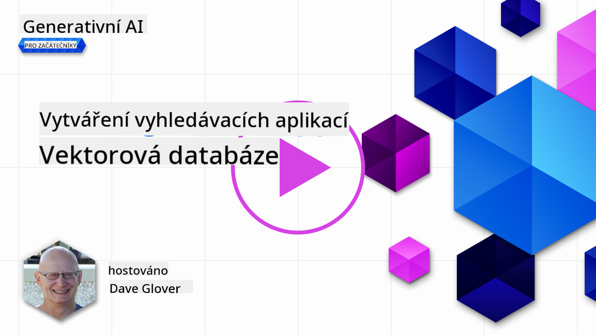
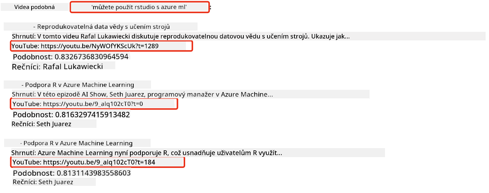
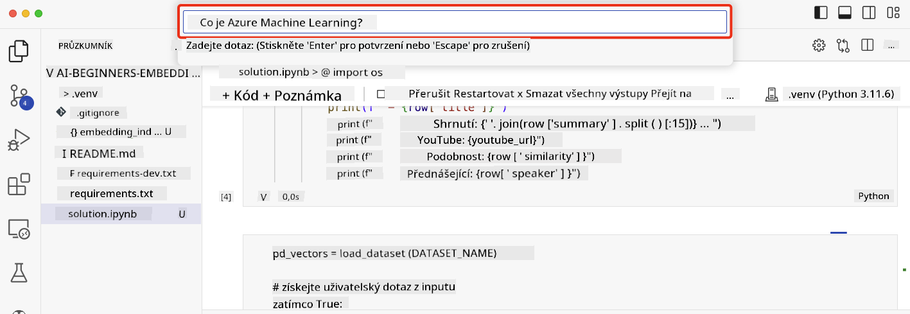

<!--
CO_OP_TRANSLATOR_METADATA:
{
  "original_hash": "d46aad0917a1a342d613e2c13d457da5",
  "translation_date": "2025-06-25T16:40:49+00:00",
  "source_file": "08-building-search-applications/README.md",
  "language_code": "cs"
}
-->
# Vytváření vyhledávacích aplikací

[](https://aka.ms/gen-ai-lesson8-gh?WT.mc_id=academic-105485-koreyst)

> > _Klikněte na obrázek výše pro zobrazení videa této lekce_

LLM nabízí více než jen chatboty a generování textu. Je také možné vytvořit vyhledávací aplikace pomocí vektorových reprezentací známých jako Embeddings. Embeddings jsou číselné reprezentace dat, známé také jako vektory, a lze je použít pro sémantické vyhledávání dat.

V této lekci vytvoříte vyhledávací aplikaci pro naši vzdělávací startup. Naše startup je nezisková organizace, která poskytuje bezplatné vzdělání studentům v rozvojových zemích. Máme velké množství YouTube videí, které studenti mohou použít k učení o AI. Naše startup chce vytvořit vyhledávací aplikaci, která umožní studentům vyhledávat YouTube video zadáním otázky.

Například, student může zadat 'Co jsou Jupyter Notebooks?' nebo 'Co je Azure ML' a vyhledávací aplikace vrátí seznam YouTube videí, která jsou relevantní k otázce, a ještě lépe, vyhledávací aplikace vrátí odkaz na místo ve videu, kde je odpověď na otázku.

## Úvod

V této lekci pokryjeme:

- Sémantické vs. klíčové vyhledávání.
- Co jsou textové embeddings.
- Vytvoření indexu textových embeddings.
- Vyhledávání v indexu textových embeddings.

## Cíle učení

Po dokončení této lekce budete schopni:

- Rozlišit mezi sémantickým a klíčovým vyhledáváním.
- Vysvětlit, co jsou textové embeddings.
- Vytvořit aplikaci používající embeddings k vyhledávání dat.

## Proč vytvářet vyhledávací aplikaci?

Vytvoření vyhledávací aplikace vám pomůže pochopit, jak používat embeddings k vyhledávání dat. Také se naučíte, jak vytvořit vyhledávací aplikaci, kterou mohou studenti použít k rychlému nalezení informací.

Lekce obsahuje index embeddings přepisů YouTube pro kanál Microsoft [AI Show](https://www.youtube.com/playlist?list=PLlrxD0HtieHi0mwteKBOfEeOYf0LJU4O1). AI Show je YouTube kanál, který vás učí o AI a strojovém učení. Index embeddings obsahuje embeddings pro každý z přepisů YouTube až do října 2023. Použijete index embeddings k vytvoření vyhledávací aplikace pro naši startup. Vyhledávací aplikace vrací odkaz na místo ve videu, kde je odpověď na otázku. To je skvělý způsob, jak studenti mohou rychle najít potřebné informace.

Následuje příklad sémantického dotazu na otázku 'můžete použít rstudio s azure ml?'. Podívejte se na URL YouTube, uvidíte, že URL obsahuje časové razítko, které vás zavede na místo ve videu, kde je odpověď na otázku.



## Co je sémantické vyhledávání?

Možná se teď ptáte, co je sémantické vyhledávání? Sémantické vyhledávání je technika vyhledávání, která používá sémantiku, nebo význam, slov v dotazu k vrácení relevantních výsledků.

Zde je příklad sémantického vyhledávání. Řekněme, že chcete koupit auto, můžete vyhledávat 'moje vysněné auto', sémantické vyhledávání chápe, že nehledáte `dreaming` o autě, ale spíše chcete koupit své `ideal` auto. Sémantické vyhledávání chápe váš záměr a vrací relevantní výsledky. Alternativou je `keyword search`, která by doslova vyhledávala sny o autech a často vrací nerelevantní výsledky.

## Co jsou textové embeddings?

[Textové embeddings](https://en.wikipedia.org/wiki/Word_embedding?WT.mc_id=academic-105485-koreyst) jsou technika reprezentace textu používaná v [zpracování přirozeného jazyka](https://en.wikipedia.org/wiki/Natural_language_processing?WT.mc_id=academic-105485-koreyst). Textové embeddings jsou sémantické číselné reprezentace textu. Embeddings se používají k reprezentaci dat způsobem, který je pro stroj snadno pochopitelný. Existuje mnoho modelů pro vytváření textových embeddings, v této lekci se zaměříme na generování embeddings pomocí OpenAI Embedding Model.

Zde je příklad, představte si, že následující text je v přepisu jedné z epizod na YouTube kanálu AI Show:

```text
Today we are going to learn about Azure Machine Learning.
```

Text bychom předali OpenAI Embedding API a vrátil by se následující embedding skládající se z 1536 čísel, známých také jako vektor. Každé číslo ve vektoru představuje jiný aspekt textu. Pro stručnost, zde jsou první 10 čísel ve vektoru.

```python
[-0.006655829958617687, 0.0026128944009542465, 0.008792596869170666, -0.02446001023054123, -0.008540431968867779, 0.022071078419685364, -0.010703742504119873, 0.003311325330287218, -0.011632772162556648, -0.02187200076878071, ...]
```

## Jak je vytvořen index embeddings?

Index embeddings pro tuto lekci byl vytvořen pomocí série Python skriptů. Skripty spolu s instrukcemi najdete v [README](./scripts/README.md?WT.mc_id=academic-105485-koreyst) ve složce 'scripts' pro tuto lekci. Tyto skripty nemusíte spouštět, abyste dokončili tuto lekci, protože index embeddings je pro vás připraven.

Skripty provádějí následující operace:

1. Přepis pro každé YouTube video v playlistu [AI Show](https://www.youtube.com/playlist?list=PLlrxD0HtieHi0mwteKBOfEeOYf0LJU4O1) je stažen.
2. Pomocí [OpenAI Functions](https://learn.microsoft.com/azure/ai-services/openai/how-to/function-calling?WT.mc_id=academic-105485-koreyst) je učiněn pokus o extrakci jména řečníka z prvních 3 minut přepisu YouTube. Jméno řečníka pro každé video je uloženo v indexu embeddings pojmenovaném `embedding_index_3m.json`.
3. Text přepisu je poté rozdělen na **3 minutové textové segmenty**. Segment zahrnuje asi 20 slov překrývajících se z dalšího segmentu, aby bylo zajištěno, že embedding pro segment není přerušen a poskytuje lepší kontext pro vyhledávání.
4. Každý textový segment je poté předán OpenAI Chat API k shrnutí textu do 60 slov. Shrnutí je také uloženo v indexu embeddings `embedding_index_3m.json`.
5. Nakonec je text segmentu předán OpenAI Embedding API. Embedding API vrací vektor 1536 čísel, který reprezentuje sémantický význam segmentu. Segment spolu s OpenAI embedding vektorem je uložen v indexu embeddings `embedding_index_3m.json`.

### Vektorové databáze

Pro zjednodušení lekce je index embeddings uložen v JSON souboru pojmenovaném `embedding_index_3m.json` a načten do Pandas DataFrame. Nicméně v produkčním prostředí by byl index embeddings uložen ve vektorové databázi, jako je [Azure Cognitive Search](https://learn.microsoft.com/training/modules/improve-search-results-vector-search?WT.mc_id=academic-105485-koreyst), [Redis](https://cookbook.openai.com/examples/vector_databases/redis/readme?WT.mc_id=academic-105485-koreyst), [Pinecone](https://cookbook.openai.com/examples/vector_databases/pinecone/readme?WT.mc_id=academic-105485-koreyst), [Weaviate](https://cookbook.openai.com/examples/vector_databases/weaviate/readme?WT.mc_id=academic-105485-koreyst), abychom jmenovali alespoň několik.

## Porozumění kosinové podobnosti

Naučili jsme se o textových embeddings, dalším krokem je naučit se, jak používat textové embeddings k vyhledávání dat a konkrétně najít nejpodobnější embeddings k danému dotazu pomocí kosinové podobnosti.

### Co je kosinová podobnost?

Kosinová podobnost je míra podobnosti mezi dvěma vektory, také se o ní mluví jako o `nearest neighbor search`. K provedení vyhledávání pomocí kosinové podobnosti je třeba _vektorizovat_ text _dotazu_ pomocí OpenAI Embedding API. Poté vypočítat _kosinovou podobnost_ mezi vektorem dotazu a každým vektorem v indexu embeddings. Pamatujte, že index embeddings má vektor pro každý textový segment přepisu YouTube. Nakonec seřadit výsledky podle kosinové podobnosti a textové segmenty s nejvyšší kosinovou podobností jsou nejpodobnější dotazu.

Z matematického hlediska měří kosinová podobnost kosinus úhlu mezi dvěma vektory promítnutými v vícerozměrném prostoru. Toto měření je užitečné, protože pokud jsou dva dokumenty daleko od sebe podle euklidovské vzdálenosti kvůli velikosti, mohou mít stále menší úhel mezi sebou a tedy vyšší kosinovou podobnost. Pro více informací o rovnicích kosinové podobnosti viz [Kosinová podobnost](https://en.wikipedia.org/wiki/Cosine_similarity?WT.mc_id=academic-105485-koreyst).

## Vytváření vaší první vyhledávací aplikace

Dále se naučíme, jak vytvořit vyhledávací aplikaci pomocí embeddings. Vyhledávací aplikace umožní studentům vyhledávat video zadáním otázky. Vyhledávací aplikace vrátí seznam videí, která jsou relevantní k otázce. Vyhledávací aplikace také vrátí odkaz na místo ve videu, kde je odpověď na otázku.

Toto řešení bylo vytvořeno a testováno na Windows 11, macOS a Ubuntu 22.04 pomocí Python 3.10 nebo novějšího. Python si můžete stáhnout z [python.org](https://www.python.org/downloads/?WT.mc_id=academic-105485-koreyst).

## Zadání - vytváření vyhledávací aplikace, umožnění studentům

Na začátku této lekce jsme představili naši startup. Nyní je čas umožnit studentům vytvořit vyhledávací aplikaci pro jejich hodnocení.

V tomto zadání vytvoříte služby Azure OpenAI, které budou použity k vytvoření vyhledávací aplikace. Vytvoříte následující služby Azure OpenAI. K dokončení tohoto zadání budete potřebovat předplatné Azure.

### Spuštění Azure Cloud Shell

1. Přihlaste se do [Azure portálu](https://portal.azure.com/?WT.mc_id=academic-105485-koreyst).
2. Vyberte ikonu Cloud Shell v pravém horním rohu Azure portálu.
3. Vyberte **Bash** pro typ prostředí.

#### Vytvoření skupiny zdrojů

> Pro tyto instrukce používáme skupinu zdrojů pojmenovanou "semantic-video-search" ve východních USA.
> Můžete změnit název skupiny zdrojů, ale při změně umístění pro zdroje,
> zkontrolujte [tabulku dostupnosti modelů](https://aka.ms/oai/models?WT.mc_id=academic-105485-koreyst).

```shell
az group create --name semantic-video-search --location eastus
```

#### Vytvoření zdroje služby Azure OpenAI

Z Azure Cloud Shell spusťte následující příkaz k vytvoření zdroje služby Azure OpenAI.

```shell
az cognitiveservices account create --name semantic-video-openai --resource-group semantic-video-search \
    --location eastus --kind OpenAI --sku s0
```

#### Získání koncového bodu a klíčů pro použití v této aplikaci

Z Azure Cloud Shell spusťte následující příkazy k získání koncového bodu a klíčů pro zdroj služby Azure OpenAI.

```shell
az cognitiveservices account show --name semantic-video-openai \
   --resource-group  semantic-video-search | jq -r .properties.endpoint
az cognitiveservices account keys list --name semantic-video-openai \
   --resource-group semantic-video-search | jq -r .key1
```

#### Nasazení modelu OpenAI Embedding

Z Azure Cloud Shell spusťte následující příkaz k nasazení modelu OpenAI Embedding.

```shell
az cognitiveservices account deployment create \
    --name semantic-video-openai \
    --resource-group  semantic-video-search \
    --deployment-name text-embedding-ada-002 \
    --model-name text-embedding-ada-002 \
    --model-version "2"  \
    --model-format OpenAI \
    --sku-capacity 100 --sku-name "Standard"
```

## Řešení

Otevřete [řešení notebooku](../../../08-building-search-applications/python/aoai-solution.ipynb) v GitHub Codespaces a postupujte podle pokynů v Jupyter Notebooku.

Když spustíte notebook, budete vyzváni k zadání dotazu. Vstupní pole bude vypadat takto:



## Skvělá práce! Pokračujte ve svém učení

Po dokončení této lekce se podívejte na naši [sbírku učení o generativní AI](https://aka.ms/genai-collection?WT.mc_id=academic-105485-koreyst), abyste pokračovali ve zvyšování svých znalostí o generativní AI!

Přejděte na lekci 9, kde se podíváme, jak [vytvářet aplikace pro generování obrázků](../09-building-image-applications/README.md?WT.mc_id=academic-105485-koreyst)!

**Prohlášení o vyloučení odpovědnosti**:  
Tento dokument byl přeložen pomocí AI překladové služby [Co-op Translator](https://github.com/Azure/co-op-translator). Ačkoli se snažíme o přesnost, mějte na paměti, že automatizované překlady mohou obsahovat chyby nebo nepřesnosti. Původní dokument v jeho rodném jazyce by měl být považován za autoritativní zdroj. Pro důležité informace se doporučuje profesionální lidský překlad. Nejsme odpovědní za žádná nedorozumění nebo nesprávné interpretace vyplývající z použití tohoto překladu.