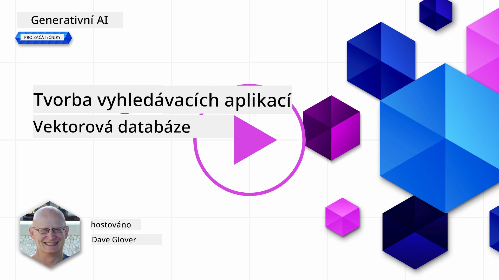
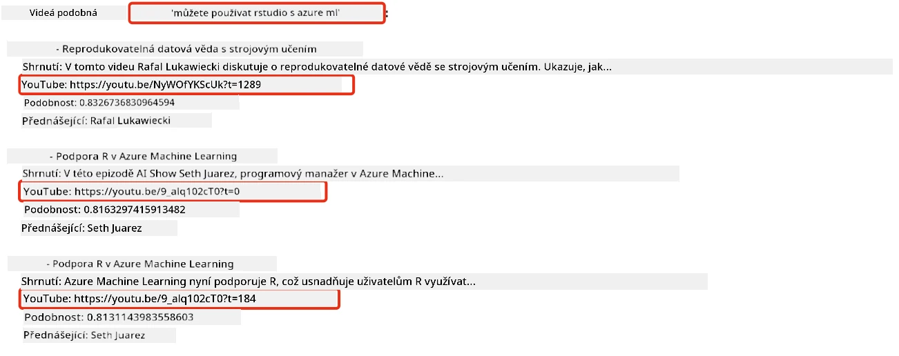
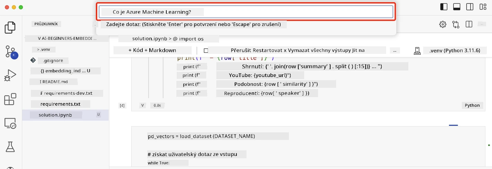

# Vytváření vyhledávacích aplikací

[](https://youtu.be/W0-nzXjOjr0?si=GcsqiTTvd7RKbo7V)

> > _Klikněte na obrázek výše pro zhlédnutí videa této lekce_

Velké jazykové modely (LLM) nejsou jen o chatbotů a generování textu. Je také možné vytvářet vyhledávací aplikace pomocí embeddingů. Embeddingy jsou číselné reprezentace dat, také známé jako vektory, a mohou být použity pro sémantické vyhledávání dat.

V této lekci vytvoříte vyhledávací aplikaci pro náš vzdělávací startup. Náš startup je nezisková organizace poskytující zdarma vzdělání studentům v rozvojových zemích. Náš startup má velké množství videí na YouTube, která studenti mohou používat k učení o AI. Startup chce vytvořit vyhledávací aplikaci, která umožní studentům vyhledávat YouTube videa zadáním otázky.

Například student může napsat „Co jsou Jupyter Notebooky?“ nebo „Co je Azure ML“ a vyhledávací aplikace vrátí seznam YouTube videí relevantních k otázce. Navíc vyhledávací aplikace vrátí odkaz na místo ve videu, kde se nachází odpověď na otázku.

## Úvod

V této lekci pokryjeme:

- Sémantické vs klíčové vyhledávání.
- Co jsou textové embeddingy.
- Vytvoření indexu textových embeddingů.
- Vyhledávání v indexu textových embeddingů.

## Cíle učení

Po dokončení této lekce budete schopni:

- Rozlišit sémantické a klíčové vyhledávání.
- Vysvětlit, co jsou textové embeddingy.
- Vytvořit aplikaci používající embeddingy pro vyhledávání dat.

## Proč vytvářet vyhledávací aplikaci?

Vytvoření vyhledávací aplikace vám pomůže pochopit, jak používat embeddingy k vyhledávání dat. Také se naučíte, jak vytvořit vyhledávací aplikaci, kterou mohou studenti použít k rychlému nalezení informací.

Lekce obsahuje index embeddingů přepisů YouTube videí z Microsoft [AI Show](https://www.youtube.com/playlist?list=PLlrxD0HtieHi0mwteKBOfEeOYf0LJU4O1) kanálu. AI Show je YouTube kanál, který vás učí o AI a strojovém učení. Index embeddingů obsahuje embeddingy pro každý přepis videa až do října 2023. Tento index embeddingů použijete k vytvoření vyhledávací aplikace pro náš startup. Vyhledávací aplikace vrací odkaz na místo ve videu, kde je odpověď na otázku. Je to skvělý způsob, jak studenti rychle najdou potřebné informace.

Následuje příklad sémantického dotazu na otázku „můžete používat rstudio s Azure ML?“. Podívejte se na URL YouTube, uvidíte, že URL obsahuje časový údaj, který vás přenese na místo ve videu, kde je odpověď na otázku.



## Co je sémantické vyhledávání?

Možná se ptáte, co je to sémantické vyhledávání? Sémantické vyhledávání je technika vyhledávání, která využívá sémantiku, tj. význam slov v dotazu, k vrácení relevantních výsledků.

Zde je příklad sémantického vyhledávání. Řekněme, že hledáte auto, můžete vyhledat „můj vysněný vůz“. Sémantické vyhledávání rozumí, že o autě nesníte, ale hledáte své ideální auto. Sémantické vyhledávání chápe váš záměr a vrací relevantní výsledky. Alternativou je klíčové vyhledávání, které by doslova hledalo sny o autech a často vracelo nerelevantní výsledky.

## Co jsou textové embeddingy?

[Textové embeddingy](https://en.wikipedia.org/wiki/Word_embedding?WT.mc_id=academic-105485-koreyst) jsou technikou reprezentace textu využívanou v [zpracování přirozeného jazyka](https://en.wikipedia.org/wiki/Natural_language_processing?WT.mc_id=academic-105485-koreyst). Textové embeddingy jsou sémantické číselné reprezentace textu. Embeddingy slouží k reprezentaci dat způsobem snadno pochopitelným strojem. Existuje mnoho modelů pro tvorbu textových embeddingů, v této lekci se zaměříme na generování embeddingů pomocí OpenAI Embedding Modelu.

Zde je příklad, představte si následující text v přepisu jednoho z dílů AI Show kanálu na YouTube:

```text
Today we are going to learn about Azure Machine Learning.
```

Text předáme OpenAI Embedding API a to vrátí následující embedding složený z 1536 čísel, tj. vektor. Každé číslo ve vektoru představuje jiný aspekt textu. Pro stručnost zde uvádíme prvních 10 čísel ve vektoru.

```python
[-0.006655829958617687, 0.0026128944009542465, 0.008792596869170666, -0.02446001023054123, -0.008540431968867779, 0.022071078419685364, -0.010703742504119873, 0.003311325330287218, -0.011632772162556648, -0.02187200076878071, ...]
```

## Jak je vytvořen index embeddingů?

Index embeddingů pro tuto lekci byl vytvořen sérií Python skriptů. Skripty najdete spolu s instrukcemi v [README](./scripts/README.md?WT.mc_id=academic-105485-koreyst) ve složce `scripts` této lekce. Nemusíte spouštět tyto skripty k dokončení lekce, protože index embeddingů je pro vás již připraven.

Skripty provádějí následující operace:

1. Přepis každého YouTube videa z playlistu [AI Show](https://www.youtube.com/playlist?list=PLlrxD0HtieHi0mwteKBOfEeOYf0LJU4O1) je stažen.
2. Pomocí [OpenAI Functions](https://learn.microsoft.com/azure/ai-foundry/openai/how-to/function-calling?WT.mc_id=academic-105485-koreyst) se pokusí extrahovat jméno mluvčího z prvních 3 minut přepisu videa. Jméno mluvčího je uloženo v indexu embeddingů s názvem `embedding_index_3m.json`.
3. Text přepisu je poté rozdělen na **3minutové textové segmenty**. Segment obsahuje asi 20 slov překrývajících se s dalším segmentem, aby embedding segmentu nebyl přerušen a poskytl lepší vyhledávací kontext.
4. Každý textový segment se předá do OpenAI Chat API, které text shrne na 60 slov. Shrnutí se také uloží do indexu embeddingů `embedding_index_3m.json`.
5. Nakonec se text segmentu předá OpenAI Embedding API. Embedding API vrátí vektor o délce 1536 čísel, který reprezentuje sémantický význam segmentu. Segment spolu s OpenAI embedding vektorem jsou uložené v indexu embeddingů `embedding_index_3m.json`.

### Vektorové databáze

Pro jednoduchost lekce je index embeddingů uložen v JSON souboru `embedding_index_3m.json` a načítán do Pandas DataFrame. V produkci by však index embeddingů byl uložen ve vektorové databázi, jako je například [Azure Cognitive Search](https://learn.microsoft.com/training/modules/improve-search-results-vector-search?WT.mc_id=academic-105485-koreyst), [Redis](https://cookbook.openai.com/examples/vector_databases/redis/readme?WT.mc_id=academic-105485-koreyst), [Pinecone](https://cookbook.openai.com/examples/vector_databases/pinecone/readme?WT.mc_id=academic-105485-koreyst), [Weaviate](https://cookbook.openai.com/examples/vector_databases/weaviate/readme?WT.mc_id=academic-105485-koreyst) a další.

## Pochopení kosínové podobnosti

Naučili jsme se o textových embeddingech, dalším krokem je naučit se, jak používat textové embeddingy k vyhledávání dat a konkrétně najít nejosobnější embeddingy k danému dotazu pomocí kosínové podobnosti.

### Co je kosínová podobnost?

Kosínová podobnost je měřítko podobnosti mezi dvěma vektory, někdy označované jako `vyhledávání nejbližšího souseda`. Pro provedení vyhledávání založeného na kosínové podobnosti je potřeba _vektorově zpracovat_ text dotazu pomocí OpenAI Embedding API. Pak vypočítat _kosínovou podobnost_ mezi vektorovým dotazem a každým vektorem v indexu embeddingů. Pamatujte, že index embeddingů má vektor pro každý textový segment přepisu YouTube videa. Nakonec výsledky seřadíte dle kosínové podobnosti a textové segmenty s nejvyšší kosínovou podobností jsou nejpodobnější dotazu.

Z matematického pohledu kosínová podobnost měří kosínus úhlu mezi dvěma vektory promítnutými v multidimenzionálním prostoru. Toto měření je užitečné, protože pokud jsou dva dokumenty vzdálené v eukleidovské vzdálenosti kvůli velikosti, mohou mít stále menší úhel mezi sebou a tedy vyšší kosínovou podobnost. Pro více informací o rovnicích kosínové podobnosti viz [Kosínová podobnost](https://en.wikipedia.org/wiki/Cosine_similarity?WT.mc_id=academic-105485-koreyst).

## Vytvoření vaší první vyhledávací aplikace

Dále se naučíme, jak vytvořit vyhledávací aplikaci pomocí embeddingů. Vyhledávací aplikace umožní studentům vyhledávat video zadáním otázky. Aplikace vrátí seznam videí, která jsou relevantní k otázce, a také odkaz na místo ve videu, kde je odpověď umístěna.

Toto řešení bylo vytvořeno a testováno na Windows 11, macOS a Ubuntu 22.04 s Pythonem 3.10 nebo novějším. Python si můžete stáhnout z [python.org](https://www.python.org/downloads/?WT.mc_id=academic-105485-koreyst).

## Zadání – vytvoření vyhledávací aplikace pro studenty

Na začátku lekce jsme představili náš startup. Nyní je čas umožnit studentům vytvořit vyhledávací aplikaci pro jejich úkoly.

V tomto zadání vytvoříte Azure OpenAI služby, které budou použity k vytvoření vyhledávací aplikace. Vytvoříte následující Azure OpenAI služby. K dokončení zadání budete potřebovat předplatné Azure.

### Spuštění Azure Cloud Shell

1. Přihlaste se do [Azure portálu](https://portal.azure.com/?WT.mc_id=academic-105485-koreyst).
2. Vyberte ikonu Cloud Shell v pravém horním rohu Azure portálu.
3. Zvolte **Bash** jako typ prostředí.

#### Vytvoření skupiny prostředků

> Pro tyto instrukce používáme skupinu prostředků s názvem „semantic-video-search“ ve východních USA.
> Název skupiny prostředků můžete změnit, ale při změně umístění prostředků
> zkontrolujte [tabulku dostupnosti modelů](https://aka.ms/oai/models?WT.mc_id=academic-105485-koreyst).

```shell
az group create --name semantic-video-search --location eastus
```

#### Vytvoření Azure OpenAI Service prostředku

V Azure Cloud Shell spusťte následující příkaz pro vytvoření Azure OpenAI Service prostředku.

```shell
az cognitiveservices account create --name semantic-video-openai --resource-group semantic-video-search \
    --location eastus --kind OpenAI --sku s0
```

#### Získání koncového bodu a klíčů pro použití v aplikaci

V Azure Cloud Shell spusťte následující příkazy pro získání koncového bodu a klíčů pro Azure OpenAI Service prostředek.

```shell
az cognitiveservices account show --name semantic-video-openai \
   --resource-group  semantic-video-search | jq -r .properties.endpoint
az cognitiveservices account keys list --name semantic-video-openai \
   --resource-group semantic-video-search | jq -r .key1
```

#### Nasazení OpenAI Embedding modelu

V Azure Cloud Shell spusťte následující příkaz pro nasazení OpenAI Embedding modelu.

```shell
az cognitiveservices account deployment create \
    --name semantic-video-openai \
    --resource-group  semantic-video-search \
    --deployment-name text-embedding-ada-002 \
    --model-name text-embedding-ada-002 \
    --model-version "2"  \
    --model-format OpenAI \
    --sku-capacity 100 --sku-name "Standard"
```

## Řešení

Otevřete [řešení notebooku](./python/aoai-solution.ipynb?WT.mc_id=academic-105485-koreyst) v GitHub Codespaces a postupujte podle instrukcí v Jupyter Notebooku.

Po spuštění notebooku budete vyzváni k zadání dotazu. Vstupní pole bude vypadat takto:



## Skvělá práce! Pokračujte ve vzdělávání

Po dokončení této lekce si prohlédněte naši [kolekci pro učení o generativní AI](https://aka.ms/genai-collection?WT.mc_id=academic-105485-koreyst), abyste dále rozvíjeli své znalosti o generativní AI!

Přejděte na lekci 9, kde se podíváme, jak [vytvářet aplikace pro generování obrázků](../09-building-image-applications/README.md?WT.mc_id=academic-105485-koreyst)!

---

<!-- CO-OP TRANSLATOR DISCLAIMER START -->
**Prohlášení o omezení odpovědnosti**:
Tento dokument byl přeložen pomocí AI překladatelské služby [Co-op Translator](https://github.com/Azure/co-op-translator). Přestože usilujeme o co největší přesnost, mějte prosím na paměti, že automatizované překlady mohou obsahovat chyby nebo nepřesnosti. Originální dokument v jeho mateřském jazyce by měl být považován za autoritativní zdroj. Pro kritické informace se doporučuje profesionální lidský překlad. Nejsme odpovědní za jakékoli nedorozumění nebo nesprávné interpretace vzniklé použitím tohoto překladu.
<!-- CO-OP TRANSLATOR DISCLAIMER END -->