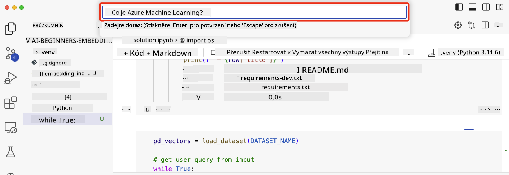

<!--
CO_OP_TRANSLATOR_METADATA:
{
  "original_hash": "d46aad0917a1a342d613e2c13d457da5",
  "translation_date": "2025-07-09T13:01:15+00:00",
  "source_file": "08-building-search-applications/README.md",
  "language_code": "cs"
}
-->
# Vytváření vyhledávacích aplikací

[](https://aka.ms/gen-ai-lesson8-gh?WT.mc_id=academic-105485-koreyst)

> > _Klikněte na obrázek výše pro zhlédnutí videa k této lekci_

LLM nejsou jen o chatbotech a generování textu. Je také možné vytvářet vyhledávací aplikace pomocí Embeddings. Embeddings jsou číselné reprezentace dat, známé také jako vektory, a lze je použít pro sémantické vyhledávání dat.

V této lekci si vytvoříte vyhledávací aplikaci pro náš vzdělávací startup. Náš startup je nezisková organizace, která poskytuje bezplatné vzdělání studentům v rozvojových zemích. Máme velké množství videí na YouTube, která studenti mohou využít k učení o AI. Náš startup chce vytvořit vyhledávací aplikaci, která umožní studentům vyhledávat YouTube videa zadáním otázky.

Například student může zadat „Co jsou Jupyter Notebooks?“ nebo „Co je Azure ML“ a vyhledávací aplikace vrátí seznam YouTube videí relevantních k otázce, a ještě lépe, aplikace vrátí odkaz na místo ve videu, kde se odpověď na otázku nachází.

## Úvod

V této lekci se naučíme:

- Sémantické vs. klíčové vyhledávání.
- Co jsou Text Embeddings.
- Vytvoření indexu Text Embeddings.
- Vyhledávání v indexu Text Embeddings.

## Cíle učení

Po dokončení této lekce budete schopni:

- Rozlišit mezi sémantickým a klíčovým vyhledáváním.
- Vysvětlit, co jsou Text Embeddings.
- Vytvořit aplikaci využívající Embeddings pro vyhledávání dat.

## Proč vytvářet vyhledávací aplikaci?

Vytvoření vyhledávací aplikace vám pomůže pochopit, jak používat Embeddings k vyhledávání dat. Naučíte se také, jak postavit aplikaci, kterou mohou studenti využít k rychlému nalezení informací.

Lekce obsahuje Embedding Index přepisů YouTube videí z kanálu Microsoft [AI Show](https://www.youtube.com/playlist?list=PLlrxD0HtieHi0mwteKBOfEeOYf0LJU4O1). AI Show je YouTube kanál, který vás učí o AI a strojovém učení. Embedding Index obsahuje Embeddings pro každý přepis videí až do října 2023. Tento index použijete k vytvoření vyhledávací aplikace pro náš startup. Aplikace vrací odkaz na místo ve videu, kde je odpověď na otázku. To je skvělý způsob, jak studenti rychle najdou potřebné informace.

Následuje příklad sémantického dotazu na otázku „můžete použít rstudio s Azure ML?“. Podívejte se na URL YouTube, uvidíte, že obsahuje časový údaj, který vás zavede přímo na místo ve videu, kde je odpověď.


## Co je sémantické vyhledávání?

Možná se ptáte, co je sémantické vyhledávání? Sémantické vyhledávání je technika, která využívá význam slov v dotazu k vrácení relevantních výsledků.

Zde je příklad sémantického vyhledávání. Řekněme, že hledáte auto, můžete zadat „moje vysněné auto“. Sémantické vyhledávání chápe, že nesníte o autě, ale hledáte své ideální auto. Chápe váš záměr a vrací relevantní výsledky. Alternativou je klíčové vyhledávání, které by doslovně hledalo sny o autech a často by vrátilo nerelevantní výsledky.

## Co jsou Text Embeddings?

[Text embeddings](https://en.wikipedia.org/wiki/Word_embedding?WT.mc_id=academic-105485-koreyst) jsou technika reprezentace textu používaná v [zpracování přirozeného jazyka](https://en.wikipedia.org/wiki/Natural_language_processing?WT.mc_id=academic-105485-koreyst). Text embeddings jsou sémantické číselné reprezentace textu. Embeddings slouží k reprezentaci dat tak, aby jim stroj snadno porozuměl. Existuje mnoho modelů pro tvorbu textových embeddings, v této lekci se zaměříme na generování embeddings pomocí OpenAI Embedding Modelu.

Příklad: představte si, že následující text je z přepisu jednoho z dílů na YouTube kanálu AI Show:

```text
Today we are going to learn about Azure Machine Learning.
```

Text předáme OpenAI Embedding API, které vrátí embedding složený z 1536 čísel, tedy vektor. Každé číslo ve vektoru reprezentuje jiný aspekt textu. Pro stručnost zde uvádíme prvních 10 čísel ve vektoru.

```python
[-0.006655829958617687, 0.0026128944009542465, 0.008792596869170666, -0.02446001023054123, -0.008540431968867779, 0.022071078419685364, -0.010703742504119873, 0.003311325330287218, -0.011632772162556648, -0.02187200076878071, ...]
```

## Jak se vytváří Embedding index?

Embedding index pro tuto lekci byl vytvořen pomocí série Python skriptů. Skripty a instrukce najdete v [README](./scripts/README.md?WT.mc_id=academic-105485-koreyst) ve složce `scripts` této lekce. Pro dokončení lekce není nutné tyto skripty spouštět, protože Embedding Index je již připravený.

Skripty provádí následující kroky:

1. Stáhne přepis každého YouTube videa z playlistu [AI Show](https://www.youtube.com/playlist?list=PLlrxD0HtieHi0mwteKBOfEeOYf0LJU4O1).
2. Pomocí [OpenAI Functions](https://learn.microsoft.com/azure/ai-services/openai/how-to/function-calling?WT.mc_id=academic-105485-koreyst) se pokusí extrahovat jméno mluvčího z prvních 3 minut přepisu. Jméno mluvčího pro každé video je uloženo v Embedding Indexu s názvem `embedding_index_3m.json`.
3. Přepis je rozdělen na **3minutové textové segmenty**. Segmenty obsahují asi 20 slov překrývajících se s následujícím segmentem, aby embedding nebyl přerušen a aby bylo zajištěno lepší kontextové vyhledávání.
4. Každý segment je předán OpenAI Chat API, které text shrne do 60 slov. Shrnutí je také uloženo v Embedding Indexu `embedding_index_3m.json`.
5. Nakonec je text segmentu předán OpenAI Embedding API, které vrátí vektor o délce 1536 čísel reprezentující sémantický význam segmentu. Segment spolu s vektorem je uložen v Embedding Indexu `embedding_index_3m.json`.

### Vektorové databáze

Pro jednoduchost lekce je Embedding Index uložen v JSON souboru `embedding_index_3m.json` a načítán do Pandas DataFrame. V produkčním prostředí by však byl Embedding Index uložen ve vektorové databázi, jako je například [Azure Cognitive Search](https://learn.microsoft.com/training/modules/improve-search-results-vector-search?WT.mc_id=academic-105485-koreyst), [Redis](https://cookbook.openai.com/examples/vector_databases/redis/readme?WT.mc_id=academic-105485-koreyst), [Pinecone](https://cookbook.openai.com/examples/vector_databases/pinecone/readme?WT.mc_id=academic-105485-koreyst), [Weaviate](https://cookbook.openai.com/examples/vector_databases/weaviate/readme?WT.mc_id=academic-105485-koreyst) a další.

## Porozumění kosinové podobnosti

Naučili jsme se o textových embeddings, dalším krokem je naučit se, jak je použít k vyhledávání dat a konkrétně najít nejpodobnější embeddings k danému dotazu pomocí kosinové podobnosti.

### Co je kosinová podobnost?

Kosinová podobnost je míra podobnosti mezi dvěma vektory, často označovaná jako `nearest neighbor search` (vyhledávání nejbližšího souseda). Pro vyhledávání pomocí kosinové podobnosti je potřeba _vektorovat_ text dotazu pomocí OpenAI Embedding API. Poté se spočítá _kosinová podobnost_ mezi vektorovým dotazem a každým vektorem v Embedding Indexu. Pamatujte, že Embedding Index obsahuje vektor pro každý textový segment přepisu YouTube videa. Nakonec se výsledky seřadí podle kosinové podobnosti a textové segmenty s nejvyšší hodnotou jsou nejpodobnější dotazu.

Z matematického hlediska kosinová podobnost měří kosinus úhlu mezi dvěma vektory v mnohorozměrném prostoru. Toto měření je užitečné, protože i když jsou dva dokumenty vzdálené podle Eukleidovské vzdálenosti kvůli velikosti, mohou mít menší úhel mezi sebou a tedy vyšší kosinovou podobnost. Více informací o rovnicích kosinové podobnosti najdete na [Cosine similarity](https://en.wikipedia.org/wiki/Cosine_similarity?WT.mc_id=academic-105485-koreyst).

## Vytvoření první vyhledávací aplikace

Nyní se naučíme, jak vytvořit vyhledávací aplikaci pomocí Embeddings. Aplikace umožní studentům vyhledávat video zadáním otázky. Aplikace vrátí seznam videí relevantních k otázce a také odkaz na místo ve videu, kde je odpověď.

Řešení bylo vyvinuto a testováno na Windows 11, macOS a Ubuntu 22.04 s Pythonem 3.10 nebo novějším. Python si můžete stáhnout na [python.org](https://www.python.org/downloads/?WT.mc_id=academic-105485-koreyst).

## Zadání – vytvoření vyhledávací aplikace pro studenty

Na začátku lekce jsme představili náš startup. Nyní je čas umožnit studentům vytvořit vyhledávací aplikaci pro jejich hodnocení.

V tomto zadání vytvoříte Azure OpenAI služby, které budou použity k vytvoření vyhledávací aplikace. Vytvoříte následující Azure OpenAI služby. K dokončení zadání budete potřebovat Azure předplatné.

### Spuštění Azure Cloud Shell

1. Přihlaste se do [Azure portálu](https://portal.azure.com/?WT.mc_id=academic-105485-koreyst).
2. V pravém horním rohu portálu klikněte na ikonu Cloud Shell.
3. Vyberte **Bash** jako typ prostředí.

#### Vytvoření resource group

> Pro tyto instrukce používáme resource group s názvem „semantic-video-search“ v regionu East US.
> Název resource group můžete změnit, ale pokud měníte lokaci zdrojů,
> zkontrolujte [tabulku dostupnosti modelů](https://aka.ms/oai/models?WT.mc_id=academic-105485-koreyst).

```shell
az group create --name semantic-video-search --location eastus
```

#### Vytvoření Azure OpenAI Service resource

V Azure Cloud Shell spusťte následující příkaz pro vytvoření Azure OpenAI Service resource.

```shell
az cognitiveservices account create --name semantic-video-openai --resource-group semantic-video-search \
    --location eastus --kind OpenAI --sku s0
```

#### Získání endpointu a klíčů pro použití v aplikaci

V Azure Cloud Shell spusťte následující příkazy pro získání endpointu a klíčů pro Azure OpenAI Service resource.

```shell
az cognitiveservices account show --name semantic-video-openai \
   --resource-group  semantic-video-search | jq -r .properties.endpoint
az cognitiveservices account keys list --name semantic-video-openai \
   --resource-group semantic-video-search | jq -r .key1
```

#### Nasazení OpenAI Embedding modelu

V Azure Cloud Shell spusťte následující příkaz pro nasazení OpenAI Embedding modelu.

```shell
az cognitiveservices account deployment create \
    --name semantic-video-openai \
    --resource-group  semantic-video-search \
    --deployment-name text-embedding-ada-002 \
    --model-name text-embedding-ada-002 \
    --model-version "2"  \
    --model-format OpenAI \
    --sku-capacity 100 --sku-name "Standard"
```

## Řešení

Otevřete [řešení v notebooku](../../../08-building-search-applications/python/aoai-solution.ipynb) v GitHub Codespaces a postupujte podle instrukcí v Jupyter Notebooku.

Po spuštění notebooku budete vyzváni k zadání dotazu. Vstupní pole bude vypadat takto:



## Skvělá práce! Pokračujte ve vzdělávání

Po dokončení této lekce si prohlédněte naši [kolekci Generative AI Learning](https://aka.ms/genai-collection?WT.mc_id=academic-105485-koreyst) a pokračujte v rozšiřování svých znalostí o generativní AI!

Přejděte k lekci 9, kde se podíváme, jak [vytvářet aplikace pro generování obrázků](../09-building-image-applications/README.md?WT.mc_id=academic-105485-koreyst)!

**Prohlášení o vyloučení odpovědnosti**:  
Tento dokument byl přeložen pomocí AI překladatelské služby [Co-op Translator](https://github.com/Azure/co-op-translator). I když usilujeme o přesnost, mějte prosím na paměti, že automatizované překlady mohou obsahovat chyby nebo nepřesnosti. Původní dokument v jeho mateřském jazyce by měl být považován za autoritativní zdroj. Pro důležité informace se doporučuje profesionální lidský překlad. Nejsme odpovědní za jakékoliv nedorozumění nebo nesprávné výklady vyplývající z použití tohoto překladu.