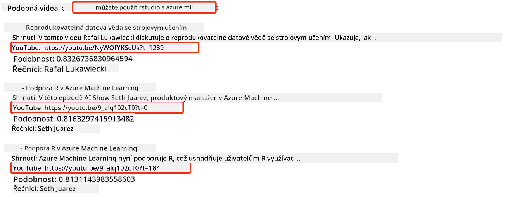

<!--
CO_OP_TRANSLATOR_METADATA:
{
  "original_hash": "58953c08b8ba7073b836d4270ea0fe86",
  "translation_date": "2025-10-17T21:36:40+00:00",
  "source_file": "08-building-search-applications/README.md",
  "language_code": "cs"
}
-->
# Vytváření vyhledávacích aplikací

[](https://youtu.be/W0-nzXjOjr0?si=GcsqiTTvd7RKbo7V)

> > _Klikněte na obrázek výše pro zhlédnutí videa k této lekci_

LLM (velké jazykové modely) nejsou jen o chatbotech a generování textu. Je také možné vytvářet vyhledávací aplikace pomocí vektorových reprezentací dat, známých jako embeddings. Tyto embeddings lze použít pro sémantické vyhledávání dat.

V této lekci vytvoříte vyhledávací aplikaci pro náš vzdělávací startup. Náš startup je nezisková organizace, která poskytuje bezplatné vzdělání studentům v rozvojových zemích. Máme velké množství videí na YouTube, která mohou studenti využít k učení o AI. Chceme vytvořit vyhledávací aplikaci, která studentům umožní vyhledávat videa na YouTube zadáním otázky.

Například student může zadat otázku „Co jsou Jupyter Notebooks?“ nebo „Co je Azure ML?“ a vyhledávací aplikace vrátí seznam videí na YouTube, která jsou relevantní k otázce. A co víc, aplikace vrátí odkaz na místo ve videu, kde se nachází odpověď na otázku.

## Úvod

V této lekci se budeme zabývat:

- Sémantické vs. klíčové vyhledávání.
- Co jsou textové embeddings.
- Vytvoření indexu textových embeddings.
- Vyhledávání v indexu textových embeddings.

## Cíle učení

Po dokončení této lekce budete schopni:

- Rozlišit mezi sémantickým a klíčovým vyhledáváním.
- Vysvětlit, co jsou textové embeddings.
- Vytvořit aplikaci, která využívá embeddings k vyhledávání dat.

## Proč vytvářet vyhledávací aplikaci?

Vytvoření vyhledávací aplikace vám pomůže pochopit, jak používat embeddings k vyhledávání dat. Také se naučíte, jak vytvořit vyhledávací aplikaci, kterou mohou studenti využít k rychlému nalezení informací.

Lekce obsahuje index embeddings přepisů z YouTube kanálu Microsoft [AI Show](https://www.youtube.com/playlist?list=PLlrxD0HtieHi0mwteKBOfEeOYf0LJU4O1). AI Show je YouTube kanál, který vás učí o AI a strojovém učení. Index embeddings obsahuje embeddings pro každý z přepisů na YouTube až do října 2023. Tento index použijete k vytvoření vyhledávací aplikace pro náš startup. Vyhledávací aplikace vrátí odkaz na místo ve videu, kde se nachází odpověď na otázku. To je skvělý způsob, jak mohou studenti rychle najít potřebné informace.

Následuje příklad sémantického dotazu na otázku „Můžete použít rstudio s azure ml?“. Podívejte se na URL YouTube, uvidíte, že obsahuje časovou značku, která vás zavede na místo ve videu, kde se nachází odpověď na otázku.



## Co je sémantické vyhledávání?

Možná vás zajímá, co je to sémantické vyhledávání? Sémantické vyhledávání je technika vyhledávání, která využívá sémantiku, tedy význam slov v dotazu, k vrácení relevantních výsledků.

Zde je příklad sémantického vyhledávání. Řekněme, že hledáte auto ke koupi, můžete zadat „moje vysněné auto“. Sémantické vyhledávání chápe, že nemyslíte na „snění“ o autě, ale spíše hledáte své „ideální“ auto. Sémantické vyhledávání chápe váš záměr a vrací relevantní výsledky. Alternativou je „klíčové vyhledávání“, které by doslova hledalo sny o autech a často by vracelo nerelevantní výsledky.

## Co jsou textové embeddings?

[Textové embeddings](https://en.wikipedia.org/wiki/Word_embedding?WT.mc_id=academic-105485-koreyst) jsou technikou reprezentace textu používanou v [zpracování přirozeného jazyka](https://en.wikipedia.org/wiki/Natural_language_processing?WT.mc_id=academic-105485-koreyst). Textové embeddings jsou sémantické číselné reprezentace textu. Embeddings se používají k reprezentaci dat způsobem, který je snadno pochopitelný pro stroj. Existuje mnoho modelů pro vytváření textových embeddings, v této lekci se zaměříme na generování embeddings pomocí modelu OpenAI Embedding.

Zde je příklad: představte si, že následující text je v přepisu z jedné z epizod na YouTube kanálu AI Show:

```text
Today we are going to learn about Azure Machine Learning.
```

Tento text bychom předali OpenAI Embedding API a to by vrátilo následující embedding, který se skládá z 1536 čísel, známých jako vektor. Každé číslo ve vektoru představuje jiný aspekt textu. Pro stručnost zde uvádíme prvních 10 čísel ve vektoru.

```python
[-0.006655829958617687, 0.0026128944009542465, 0.008792596869170666, -0.02446001023054123, -0.008540431968867779, 0.022071078419685364, -0.010703742504119873, 0.003311325330287218, -0.011632772162556648, -0.02187200076878071, ...]
```

## Jak je vytvořen index embeddings?

Index embeddings pro tuto lekci byl vytvořen pomocí série Python skriptů. Skripty spolu s instrukcemi najdete v souboru [README](./scripts/README.md?WT.mc_id=academic-105485-koreyst) ve složce 'scripts' pro tuto lekci. Tyto skripty není nutné spouštět pro dokončení této lekce, protože index embeddings je vám k dispozici.

Skripty provádějí následující operace:

1. Stáhnou přepis každého videa na YouTube z playlistu [AI Show](https://www.youtube.com/playlist?list=PLlrxD0HtieHi0mwteKBOfEeOYf0LJU4O1).
2. Pomocí [OpenAI Functions](https://learn.microsoft.com/azure/ai-services/openai/how-to/function-calling?WT.mc_id=academic-105485-koreyst) se pokusí extrahovat jméno mluvčího z prvních 3 minut přepisu videa. Jméno mluvčího pro každé video je uloženo v indexu embeddings s názvem `embedding_index_3m.json`.
3. Text přepisu je poté rozdělen na **3minutové textové segmenty**. Segment zahrnuje asi 20 slov překrývajících se s dalším segmentem, aby se zajistilo, že embedding segmentu nebude přerušen a poskytne lepší kontext pro vyhledávání.
4. Každý textový segment je poté předán OpenAI Chat API, aby shrnul text do 60 slov. Shrnutí je také uloženo v indexu embeddings `embedding_index_3m.json`.
5. Nakonec je text segmentu předán OpenAI Embedding API. Embedding API vrátí vektor o 1536 číslech, který reprezentuje sémantický význam segmentu. Segment spolu s vektorem OpenAI Embedding je uložen v indexu embeddings `embedding_index_3m.json`.

### Vektorové databáze

Pro zjednodušení lekce je index embeddings uložen v souboru JSON s názvem `embedding_index_3m.json` a načten do Pandas DataFrame. Nicméně v produkčním prostředí by byl index embeddings uložen ve vektorové databázi, jako je [Azure Cognitive Search](https://learn.microsoft.com/training/modules/improve-search-results-vector-search?WT.mc_id=academic-105485-koreyst), [Redis](https://cookbook.openai.com/examples/vector_databases/redis/readme?WT.mc_id=academic-105485-koreyst), [Pinecone](https://cookbook.openai.com/examples/vector_databases/pinecone/readme?WT.mc_id=academic-105485-koreyst), [Weaviate](https://cookbook.openai.com/examples/vector_databases/weaviate/readme?WT.mc_id=academic-105485-koreyst), a další.

## Pochopení kosinové podobnosti

Naučili jsme se o textových embeddings, dalším krokem je naučit se, jak používat textové embeddings k vyhledávání dat, a konkrétně najít nejpodobnější embeddings k danému dotazu pomocí kosinové podobnosti.

### Co je kosinová podobnost?

Kosinová podobnost je míra podobnosti mezi dvěma vektory, často označovaná jako `vyhledávání nejbližšího souseda`. Pro provedení vyhledávání pomocí kosinové podobnosti je třeba _vektorizovat_ text _dotazu_ pomocí OpenAI Embedding API. Poté vypočítat _kosinovou podobnost_ mezi vektorem dotazu a každým vektorem v indexu embeddings. Pamatujte, že index embeddings obsahuje vektor pro každý textový segment přepisu z YouTube. Nakonec se výsledky seřadí podle kosinové podobnosti a textové segmenty s nejvyšší kosinovou podobností jsou nejpodobnější dotazu.

Z matematického hlediska kosinová podobnost měří kosinus úhlu mezi dvěma vektory promítnutými do vícerozměrného prostoru. Toto měření je užitečné, protože i když jsou dva dokumenty vzdálené podle euklidovské vzdálenosti kvůli velikosti, mohou mít stále menší úhel mezi sebou a tedy vyšší kosinovou podobnost. Pro více informací o rovnicích kosinové podobnosti si přečtěte [Kosinová podobnost](https://en.wikipedia.org/wiki/Cosine_similarity?WT.mc_id=academic-105485-koreyst).

## Vytvoření vaší první vyhledávací aplikace

Dále se naučíme, jak vytvořit vyhledávací aplikaci pomocí embeddings. Tato aplikace umožní studentům vyhledávat video zadáním otázky. Aplikace vrátí seznam videí, která jsou relevantní k otázce. Aplikace také vrátí odkaz na místo ve videu, kde se nachází odpověď na otázku.

Toto řešení bylo vytvořeno a testováno na Windows 11, macOS a Ubuntu 22.04 s Pythonem 3.10 nebo novějším. Python si můžete stáhnout z [python.org](https://www.python.org/downloads/?WT.mc_id=academic-105485-koreyst).

## Zadání – vytvoření vyhledávací aplikace pro studenty

Na začátku této lekce jsme představili náš startup. Nyní je čas umožnit studentům vytvořit vyhledávací aplikaci pro jejich úkoly.

V tomto zadání vytvoříte služby Azure OpenAI, které budou použity k vytvoření vyhledávací aplikace. Vytvoříte následující služby Azure OpenAI. K dokončení tohoto úkolu budete potřebovat předplatné Azure.

### Spuštění Azure Cloud Shell

1. Přihlaste se do [Azure portálu](https://portal.azure.com/?WT.mc_id=academic-105485-koreyst).
2. Klikněte na ikonu Cloud Shell v pravém horním rohu Azure portálu.
3. Vyberte **Bash** jako typ prostředí.

#### Vytvoření resource group

> Pro tyto instrukce používáme resource group s názvem "semantic-video-search" ve východní části USA.
> Můžete změnit název resource group, ale při změně umístění zdrojů zkontrolujte [tabulku dostupnosti modelů](https://aka.ms/oai/models?WT.mc_id=academic-105485-koreyst).

```shell
az group create --name semantic-video-search --location eastus
```

#### Vytvoření zdroje Azure OpenAI Service

Z Azure Cloud Shell spusťte následující příkaz pro vytvoření zdroje Azure OpenAI Service.

```shell
az cognitiveservices account create --name semantic-video-openai --resource-group semantic-video-search \
    --location eastus --kind OpenAI --sku s0
```

#### Získání koncového bodu a klíčů pro použití v této aplikaci

Z Azure Cloud Shell spusťte následující příkazy pro získání koncového bodu a klíčů pro zdroj Azure OpenAI Service.

```shell
az cognitiveservices account show --name semantic-video-openai \
   --resource-group  semantic-video-search | jq -r .properties.endpoint
az cognitiveservices account keys list --name semantic-video-openai \
   --resource-group semantic-video-search | jq -r .key1
```

#### Nasazení modelu OpenAI Embedding

Z Azure Cloud Shell spusťte následující příkaz pro nasazení modelu OpenAI Embedding.

```shell
az cognitiveservices account deployment create \
    --name semantic-video-openai \
    --resource-group  semantic-video-search \
    --deployment-name text-embedding-ada-002 \
    --model-name text-embedding-ada-002 \
    --model-version "2"  \
    --model-format OpenAI \
    --sku-capacity 100 --sku-name "Standard"
```

## Řešení

Otevřete [řešení v notebooku](./python/aoai-solution.ipynb?WT.mc_id=academic-105485-koreyst) v GitHub Codespaces a postupujte podle pokynů v Jupyter Notebooku.

Když spustíte notebook, budete vyzváni k zadání dotazu. Vstupní pole bude vypadat takto:


## Skvělá práce! Pokračujte v učení

Po dokončení této lekce se podívejte na naši [sbírku o generativní AI](https://aka.ms/genai-collection?WT.mc_id=academic-105485-koreyst), abyste si dále rozšířili své znalosti o generativní AI!

Přejděte na lekci 9, kde se podíváme na to, jak [vytvářet aplikace pro generování obrázků](../09-building-image-applications/README.md?WT.mc_id=academic-105485-koreyst)!

---

**Prohlášení**:  
Tento dokument byl přeložen pomocí služby AI pro překlady [Co-op Translator](https://github.com/Azure/co-op-translator). I když se snažíme o přesnost, mějte prosím na paměti, že automatizované překlady mohou obsahovat chyby nebo nepřesnosti. Původní dokument v jeho rodném jazyce by měl být považován za autoritativní zdroj. Pro důležité informace se doporučuje profesionální lidský překlad. Neodpovídáme za žádná nedorozumění nebo nesprávné interpretace vyplývající z použití tohoto překladu.