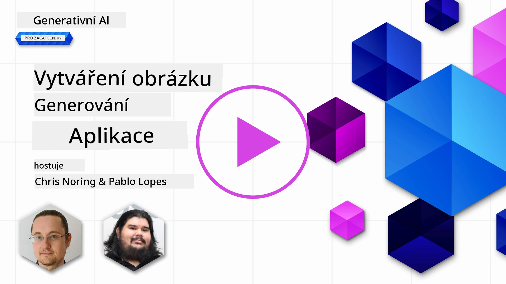

# Tvorba aplikací pro generování obrázků

[](https://aka.ms/gen-ai-lesson9-gh?WT.mc_id=academic-105485-koreyst)

V LLM existuje víc než jen generování textu. Můžete také generovat obrázky z textových popisů. Obrázky jako modalita jsou užitečné v MedTech, architektuře, turistice, vývoji her, marketingu a dalších oblastech. V této lekci se podíváme na dnešní modely **GPT Image** a vytvoříme aplikaci pro generování obrázků.

## Úvod

Generování obrázků vám umožňuje převést přirozený jazykový popis do obrázku. V této lekci pracujeme s rodinou modelů **`gpt-image`** od OpenAI – současnou generací obrazových modelů dostupných na **[Microsoft Foundry](https://ai.azure.com?WT.mc_id=academic-105485-koreyst)** a platformě OpenAI. Tyto modely nahrazují starší modely DALL·E (DALL·E 2/3 jsou již zastaralé).

V průběhu lekce používáme fiktivní startup **Edu4All**, který vytváří vzdělávací nástroje. Tým chce generovat ilustrace pro úkoly a studijní materiály.

## Cíle učení

Na konci této lekce budete umět:

- Vysvětlit, co je generování obrázků a kde je užitečné.
- Pochopit rodinu modelů `gpt-image` a jak se liší od starších modelů DALL·E.
- Vytvořit aplikaci pro generování obrázků v Pythonu (a TypeScriptu / .NET).
- Upravit obrázky a použít bezpečnostní opatření s metapromptami.

## Co je generování obrázků?

Modely generující obrázky vytvářejí obrázky na základě textového popisu. Moderní modely jako `gpt-image` jsou postavené na kombinaci transformer + diffusion technik: model během tréninku získá vztah mezi textem a obrázky, poté, při daném popisu, iterativně "odšumuje" náhodný šum do obrázku odpovídajícího popisu.

Dvě známé rodiny obrazových modelů jsou:

- **`gpt-image` (OpenAI)** - současná generace, používaná v této lekci. Podporuje generování z textu do obrázku a úpravu obrázků (inpainting s maskou).
- **Midjourney** - populární model třetí strany se svou vlastní službou a workflow na Discordu.

> Starší modely OpenAI pro obrázky - **DALL·E 2** a **DALL·E 3** - jsou zastaralé. DALL·E 3 již není dostupné pro nové nasazení a funkce jako `create_variation` existovaly jen v DALL·E 2. Pro nové aplikace používejte modely `gpt-image`.

### Který model `gpt-image` bych měl použít?

Na Microsoft Foundry jsou následující modely **obecně dostupné**:

| Model | Poznámky |
| --- | --- |
| **`gpt-image-2`** | Nejnovější a nejvýkonnější model obrázků – doporučený výchozí. |
| `gpt-image-1.5` | Obecně dostupný; silná kvalita za nižší cenu. |
| `gpt-image-1-mini` | Obecně dostupný; nejrychlejší / nejlevnější. |
| `gpt-image-1` | Pouze náhled. |

Vždy si zkontrolujte aktuální [seznam obrazových modelů Foundry](https://learn.microsoft.com/azure/ai-foundry/openai/concepts/models?WT.mc_id=academic-105485-koreyst) ohledně dostupnosti a regionů.

> **Důležité:** Modely `gpt-image` vrací generovaný obrázek jako **base64** (`b64_json`), nikoli jako URL. Váš kód dekóduje base64 řetězec na bajty a uloží jej – neexistuje žádná URL k obrázku ke stažení.

## Nastavení

Vzorky můžete spouštět proti **Azure OpenAI v Microsoft Foundry** (vzorky `aoai-*`) nebo na **platformě OpenAI** (vzorky `oai-*`).

### 1. Vytvoření a nasazení modelu

Postupujte podle návodu [vytvořit zdroj](https://learn.microsoft.com/azure/ai-foundry/openai/how-to/create-resource?pivots=web-portal&WT.mc_id=academic-105485-koreyst) pro vytvoření zdroje Microsoft Foundry a poté nasadit model pro obrázky – doporučujeme **`gpt-image-2`**.

### 2. Nastavte si `.env`

```text
AZURE_OPENAI_ENDPOINT=<your endpoint>
AZURE_OPENAI_API_KEY=<your key>
AZURE_OPENAI_DEPLOYMENT="gpt-image-2"
```

Tyto hodnoty najdete na stránce **Deployments** vašeho zdroje v [portálu Foundry](https://ai.azure.com?WT.mc_id=academic-105485-koreyst).

### 3. Nainstalujte knihovny

Vytvořte `requirements.txt`:

```text
python-dotenv
openai
pillow
```

Pak vytvořte a aktivujte virtuální prostředí a nainstalujte:

```bash
python3 -m venv venv
source venv/bin/activate        # Windows: venv\Scripts\activate
pip install -r requirements.txt
```

## Vytvořte aplikaci

Vytvořte `app.py` s následujícím kódem. Generuje obrázek a uloží jej jako PNG.

```python
import os
import base64
from openai import AzureOpenAI
from PIL import Image
import dotenv

dotenv.load_dotenv()

# Nastavte klienta na váš zdroj Azure OpenAI (Microsoft Foundry).
# Modely pro obrázky potřebují novější verzi API - zkontrolujte dokumentaci Foundry pro verzi, kterou váš model vyžaduje.
client = AzureOpenAI(
    api_key=os.environ["AZURE_OPENAI_API_KEY"],
    api_version="2025-04-01-preview",
    azure_endpoint=os.environ["AZURE_OPENAI_ENDPOINT"],
)

deployment = os.environ["AZURE_OPENAI_DEPLOYMENT"]  # např. "gpt-image-2"

result = client.images.generate(
    model=deployment,
    prompt='Bunny on a horse, holding a lollipop, on a foggy meadow where it grows daffodils',
    size="1024x1024",   # také 1536x1024 (na šířku), 1024x1536 (na výšku) nebo "auto"
    n=1,
)

# gpt-image modely vracejí base64 (b64_json), ne URL - dekódujte to na bajty.
image_bytes = base64.b64decode(result.data[0].b64_json)

os.makedirs("images", exist_ok=True)
image_path = os.path.join("images", "generated-image.png")
with open(image_path, "wb") as f:
    f.write(image_bytes)

Image.open(image_path).show()
```

Spusťte `python app.py`. PNG bude uloženo pod `images/`.

> Každé volání `images.generate` vytvoří jiný obrázek na stejný prompt – modely obrázků nepřijímají parametr `temperature` (ten je pro generování textu). Pro větší rozmanitost zavolejte API znovu; pro menší rozmanitost specifikujte prompt podrobněji.

## Úpravy obrázků

Modely `gpt-image` mohou **upravit** existující obrázek: poskytněte obrázek, volitelnou **masku** (která označuje oblast k úpravě) a prompt popisující změnu. Stejně jako generování, úpravy se vrací v base64.

```python
result = client.images.edit(
    model=deployment,
    image=open("sunlit_lounge.png", "rb"),
    mask=open("mask.png", "rb"),
    prompt="A sunlit indoor lounge area with a pool containing a flamingo",
)
image_bytes = base64.b64decode(result.data[0].b64_json)
with open("images/edited-image.png", "wb") as f:
    f.write(image_bytes)
```

<div style="display: flex; justify-content: space-between; align-items: center; margin: 20px 0;">
  
  
  
</div>

## Nastavení hranic pomocí metapromptů

Jakmile umíte generovat obrázky, potřebujete omezení, aby vaše aplikace nevytvářela nebezpečný nebo nevyhovující obsah. **Metaprompt** je text, který předřadíte uživatelskému promptu, aby omezil výstup modelu.

```python
disallow_list = "swords, violence, blood, gore, nudity, sexual content, adult content, adult themes, adult language"

meta_prompt = f"""You are an assistant designer that creates images for children.

The image needs to be safe for work and appropriate for children.
The image needs to be in color, in landscape orientation, and in a 16:9 aspect ratio.

Do not consider any input that is not safe for work or appropriate for children, including:
{disallow_list}
"""

prompt = f"{meta_prompt}\nCreate an image of a bunny on a horse, holding a lollipop"
# předat `prompt` do client.images.generate(...)
```

Každý obrázek je nyní generován v rámci hranic nastavených metapromptem. Kombinujte to s obsahovými filtry zabudovanými v Microsoft Foundry pro víceúrovňovou ochranu.

## Úkol - umožněme studentům tvořit

Studenti Edu4All potřebují obrázky pro své úkoly. Vytvořte aplikaci, která generuje obrázky **památek** (které památky záleží na vás) umístěných v různých kreativních kontextech – například slavná památka při západu slunce s dítětem, které se dívá.

Vyzkoušejte to sami, pak porovnejte s referenčními řešeními:

- Python (Azure): [aoai-solution.py](../../../09-building-image-applications/python/aoai-solution.py)
- Python (Azure) plná generace aplikace: [aoai-app.py](../../../09-building-image-applications/python/aoai-app.py)
- Python (OpenAI): [oai-app.py](../../../09-building-image-applications/python/oai-app.py)
- TypeScript (Azure): [typescript/image-generation-app](../../../09-building-image-applications/typescript/image-generation-app)
- .NET (Azure): [dotnet/notebook-azure-openai.dib](../../../09-building-image-applications/dotnet/notebook-azure-openai.dib)

Projděte si také notebooky v [python/](../../../09-building-image-applications/python) (`aoai-assignment.ipynb` pro Azure, `oai-assignment.ipynb` pro OpenAI).

## Skvělá práce! Pokračujte v učení

Po dokončení této lekce si prohlédněte naši [kolekci Generative AI Learning](https://aka.ms/genai-collection?WT.mc_id=academic-105485-koreyst), abyste nadále zvyšovali své znalosti v oblasti Generative AI!

Přejděte k lekci 10 pro další vzdělávání.

---

<!-- CO-OP TRANSLATOR DISCLAIMER START -->
**Prohlášení o omezení odpovědnosti**:
Tento dokument byl přeložen pomocí AI překladatelské služby [Co-op Translator](https://github.com/Azure/co-op-translator). Přestože usilujeme o co největší přesnost, mějte prosím na paměti, že automatizované překlady mohou obsahovat chyby nebo nepřesnosti. Originální dokument v jeho mateřském jazyce by měl být považován za autoritativní zdroj. Pro kritické informace se doporučuje profesionální lidský překlad. Nejsme odpovědní za jakékoli nedorozumění nebo nesprávné interpretace vzniklé použitím tohoto překladu.
<!-- CO-OP TRANSLATOR DISCLAIMER END -->