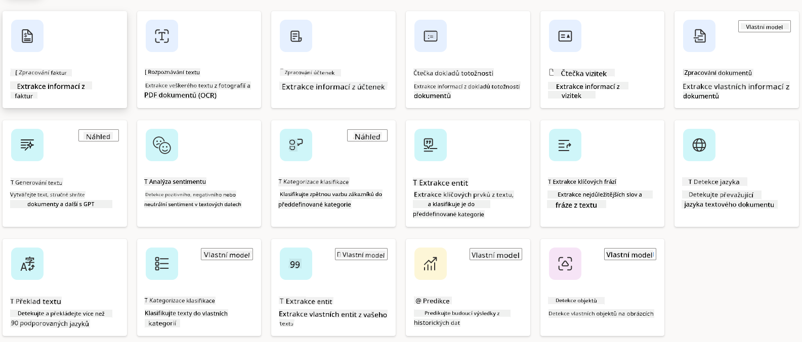
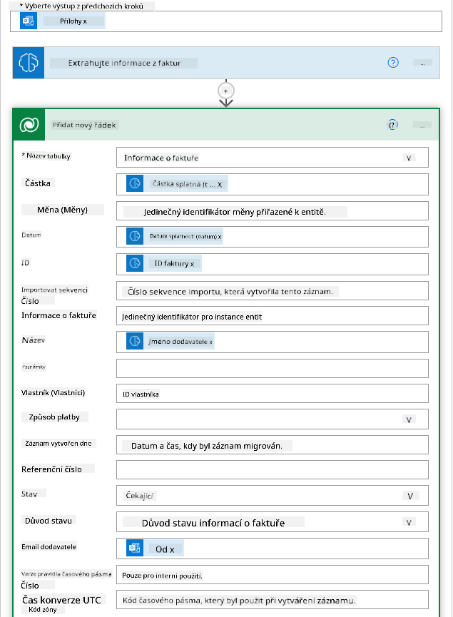
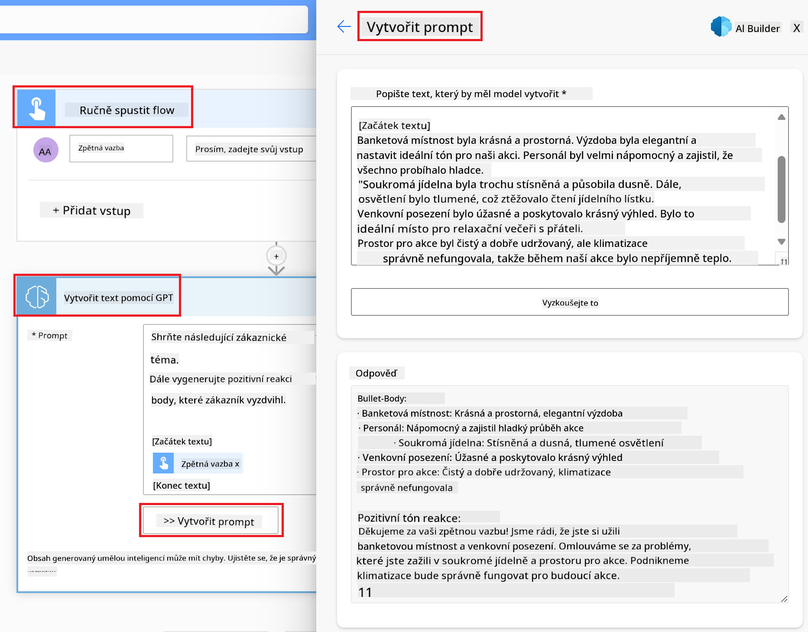

<!--
CO_OP_TRANSLATOR_METADATA:
{
  "original_hash": "f5ff3b6204a695a117d6f452403c95f7",
  "translation_date": "2025-05-19T21:01:06+00:00",
  "source_file": "10-building-low-code-ai-applications/README.md",
  "language_code": "cs"
}
-->
# Budování Low Code AI Aplikací

## Úvod

Nyní, když jsme se naučili, jak vytvářet aplikace generující obrázky, pojďme si povídat o low code. Generativní AI může být použita v různých oblastech včetně low code, ale co to vlastně low code je a jak do něj můžeme přidat AI?

Vytváření aplikací a řešení se díky Low Code Development Platforms stalo jednodušším jak pro tradiční vývojáře, tak pro ne-vývojáře. Tyto platformy umožňují vytvářet aplikace a řešení s minimálním nebo žádným kódem. Toho je dosaženo poskytnutím vizuálního vývojového prostředí, které umožňuje přetahovat komponenty a tak vytvářet aplikace a řešení. To umožňuje vytvářet aplikace a řešení rychleji a s menšími zdroji. V této lekci se podrobně ponoříme do toho, jak používat Low Code a jak obohatit vývoj low code pomocí AI s využitím Power Platform.

Power Platform poskytuje organizacím příležitost posílit jejich týmy, aby si mohly vytvářet vlastní řešení prostřednictvím intuitivního low-code nebo no-code prostředí. Toto prostředí pomáhá zjednodušit proces vytváření řešení. S Power Platform mohou být řešení vybudována během dnů nebo týdnů místo měsíců nebo let. Power Platform se skládá z pěti klíčových produktů: Power Apps, Power Automate, Power BI, Power Pages a Copilot Studio.

Tato lekce pokrývá:

- Úvod do Generativní AI v Power Platform
- Úvod do Copilot a jak ho používat
- Použití Generativní AI k vytváření aplikací a toků v Power Platform
- Pochopení AI Modelů v Power Platform s AI Builder

## Cíle učení

Na konci této lekce budete schopni:

- Pochopit, jak Copilot funguje v Power Platform.

- Vytvořit aplikaci Student Assignment Tracker pro náš vzdělávací startup.

- Vytvořit tok zpracování faktur, který používá AI k extrakci informací z faktur.

- Aplikovat osvědčené postupy při používání modelu Create Text s GPT AI.

Nástroje a technologie, které budete v této lekci používat, jsou:

- **Power Apps**, pro aplikaci Student Assignment Tracker, která poskytuje low-code vývojové prostředí pro vytváření aplikací ke sledování, správě a interakci s daty.

- **Dataverse**, pro ukládání dat pro aplikaci Student Assignment Tracker, kde Dataverse poskytne low-code datovou platformu pro ukládání dat aplikace.

- **Power Automate**, pro tok zpracování faktur, kde budete mít low-code vývojové prostředí pro vytváření pracovních toků k automatizaci procesu zpracování faktur.

- **AI Builder**, pro model AI zpracování faktur, kde budete používat předem vytvořené AI modely k zpracování faktur pro náš startup.

## Generativní AI v Power Platform

Obohacení low-code vývoje a aplikací generativní AI je klíčovou oblastí zaměření pro Power Platform. Cílem je umožnit každému vytvářet aplikace poháněné AI, stránky, dashboardy a automatizovat procesy pomocí AI, _bez nutnosti odborných znalostí datové vědy_. Toho je dosaženo integrací generativní AI do low-code vývojového zážitku v Power Platform ve formě Copilot a AI Builder.

### Jak to funguje?

Copilot je AI asistent, který vám umožňuje vytvářet řešení Power Platform popisem vašich požadavků v sérii konverzačních kroků pomocí přirozeného jazyka. Můžete například instruovat svého AI asistenta, aby uvedl, jaká pole vaše aplikace použije, a on vytvoří jak aplikaci, tak podkladový datový model, nebo můžete specifikovat, jak nastavit tok v Power Automate.

Funkce poháněné Copilotem můžete používat jako funkci na obrazovkách vaší aplikace, aby uživatelé mohli objevovat vhledy prostřednictvím konverzačních interakcí.

AI Builder je low-code AI schopnost dostupná v Power Platform, která vám umožňuje používat AI modely k automatizaci procesů a předpovídání výsledků. S AI Builder můžete přinést AI do vašich aplikací a toků, které se připojují k vašim datům v Dataverse nebo v různých cloudových datových zdrojích, jako je SharePoint, OneDrive nebo Azure.

Copilot je dostupný ve všech produktech Power Platform: Power Apps, Power Automate, Power BI, Power Pages a Power Virtual Agents. AI Builder je dostupný v Power Apps a Power Automate. V této lekci se zaměříme na to, jak používat Copilot a AI Builder v Power Apps a Power Automate k vybudování řešení pro náš vzdělávací startup.

### Copilot v Power Apps

Jako součást Power Platform poskytuje Power Apps low-code vývojové prostředí pro vytváření aplikací ke sledování, správě a interakci s daty. Je to sada služeb pro vývoj aplikací s rozšiřitelnou datovou platformou a schopností připojit se ke cloudovým službám a on-premises datům. Power Apps umožňuje vytvářet aplikace, které běží na prohlížečích, tabletech a telefonech, a mohou být sdíleny s kolegy. Power Apps usnadňuje uživatelům vývoj aplikací pomocí jednoduchého rozhraní, takže každý obchodní uživatel nebo profesionální vývojář může vytvářet vlastní aplikace. Zkušenost s vývojem aplikací je také obohacena o Generativní AI prostřednictvím Copilot.

Funkce Copilot AI asistenta v Power Apps vám umožňuje popsat, jakou aplikaci potřebujete a jaké informace chcete, aby vaše aplikace sledovala, sbírala nebo zobrazovala. Copilot pak generuje responzivní Canvas aplikaci na základě vašeho popisu. Poté můžete aplikaci přizpůsobit svým potřebám. AI Copilot také generuje a navrhuje tabulku Dataverse s poli, která potřebujete k ukládání dat, která chcete sledovat, a s některými vzorovými daty. Později se v této lekci podíváme na to, co je Dataverse a jak ho můžete použít v Power Apps. Poté můžete tabulku přizpůsobit svým potřebám pomocí funkce AI Copilot prostřednictvím konverzačních kroků. Tato funkce je snadno dostupná z domovské obrazovky Power Apps.

### Copilot v Power Automate

Jako součást Power Platform umožňuje Power Automate uživatelům vytvářet automatizované pracovní toky mezi aplikacemi a službami. Pomáhá automatizovat opakující se obchodní procesy, jako je komunikace, sběr dat a schvalování rozhodnutí. Jeho jednoduché rozhraní umožňuje uživatelům s různou technickou způsobilostí (od začátečníků po zkušené vývojáře) automatizovat pracovní úkoly. Zkušenost s vývojem pracovních toků je také obohacena o Generativní AI prostřednictvím Copilot.

Funkce Copilot AI asistenta v Power Automate vám umožňuje popsat, jaký druh toku potřebujete a jaké akce chcete, aby váš tok vykonával. Copilot pak generuje tok na základě vašeho popisu. Poté můžete tok přizpůsobit svým potřebám. AI Copilot také generuje a navrhuje akce, které potřebujete k provedení úkolu, který chcete automatizovat. Později se v této lekci podíváme na to, co jsou toky a jak je můžete používat v Power Automate. Poté můžete akce přizpůsobit svým potřebám pomocí funkce AI Copilot prostřednictvím konverzačních kroků. Tato funkce je snadno dostupná z domovské obrazovky Power Automate.

## Zadání: Spravujte studentské úkoly a faktury pro náš startup pomocí Copilot

Náš startup poskytuje online kurzy studentům. Startup rychle rostl a nyní má potíže s udržením krok s poptávkou po svých kurzech. Startup vás najal jako vývojáře Power Platform, abyste jim pomohli vytvořit low code řešení, které jim pomůže spravovat studentské úkoly a faktury. Jejich řešení by mělo být schopno pomoci jim sledovat a spravovat studentské úkoly prostřednictvím aplikace a automatizovat proces zpracování faktur prostřednictvím pracovního toku. Byli jste požádáni, abyste použili Generativní AI k vývoji řešení.

Když začínáte s používáním Copilot, můžete použít [Power Platform Copilot Prompt Library](https://github.com/pnp/powerplatform-prompts?WT.mc_id=academic-109639-somelezediko) k zahájení práce s výzvami. Tato knihovna obsahuje seznam výzev, které můžete použít k vytváření aplikací a toků s Copilot. Můžete také použít výzvy v knihovně, abyste získali představu o tom, jak popsat své požadavky Copilot.

### Vytvořte aplikaci Student Assignment Tracker pro náš startup

Učitelé v našem startupu měli potíže s udržením přehledu o studentských úkolech. Používali tabulku ke sledování úkolů, ale to se stalo obtížně spravovatelným, protože počet studentů se zvýšil. Požádali vás, abyste vytvořili aplikaci, která jim pomůže sledovat a spravovat studentské úkoly. Aplikace by jim měla umožnit přidávat nové úkoly, zobrazovat úkoly, aktualizovat úkoly a mazat úkoly. Aplikace by také měla umožnit učitelům a studentům zobrazit úkoly, které byly ohodnoceny, a ty, které nebyly ohodnoceny.

Aplikaci vytvoříte pomocí Copilot v Power Apps podle následujících kroků:

1. Přejděte na domovskou obrazovku [Power Apps](https://make.powerapps.com?WT.mc_id=academic-105485-koreyst).

1. Použijte textové pole na domovské obrazovce k popisu aplikace, kterou chcete vytvořit. Například: **_Chci vytvořit aplikaci pro sledování a správu studentských úkolů_**. Klikněte na tlačítko **Odeslat**, abyste poslali výzvu AI Copilot.

1. AI Copilot navrhne tabulku Dataverse s poli, která potřebujete k ukládání dat, která chcete sledovat, a s některými vzorovými daty. Poté můžete tabulku přizpůsobit svým potřebám pomocí funkce AI Copilot prostřednictvím konverzačních kroků.

   > **Důležité**: Dataverse je podkladová datová platforma pro Power Platform. Je to low-code datová platforma pro ukládání dat aplikace. Je to plně spravovaná služba, která bezpečně ukládá data v Microsoft Cloud a je nasazena ve vašem Power Platform prostředí. Přichází s vestavěnými schopnostmi správy dat, jako je klasifikace dat, rodokmen dat, jemnozrnná kontrola přístupu a další. Více se o Dataverse můžete dozvědět [zde](https://docs.microsoft.com/powerapps/maker/data-platform/data-platform-intro?WT.mc_id=academic-109639-somelezediko).

1. Učitelé chtějí posílat e-maily studentům, kteří odevzdali své úkoly, aby je udrželi v obraze o postupu jejich úkolů. Můžete použít Copilot k přidání nového pole do tabulky pro ukládání e-mailu studenta. Například můžete použít následující výzvu k přidání nového pole do tabulky: **_Chci přidat sloupec pro ukládání e-mailu studenta_**. Klikněte na tlačítko **Odeslat**, abyste poslali výzvu AI Copilot.

1. AI Copilot vygeneruje nové pole a poté můžete pole přizpůsobit svým potřebám.

1. Jakmile budete hotovi s tabulkou, klikněte na tlačítko **Vytvořit aplikaci**, abyste vytvořili aplikaci.

1. AI Copilot vygeneruje responzivní Canvas aplikaci na základě vašeho popisu. Poté můžete aplikaci přizpůsobit svým potřebám.

1. Aby učitelé mohli posílat e-maily studentům, můžete použít Copilot k přidání nové obrazovky do aplikace. Například můžete použít následující výzvu k přidání nové obrazovky do aplikace: **_Chci přidat obrazovku pro odesílání e-mailů studentům_**. Klikněte na tlačítko **Odeslat**, abyste poslali výzvu AI Copilot.

1. AI Copilot vygeneruje novou obrazovku a poté můžete obrazovku přizpůsobit svým potřebám.

1. Jakmile budete hotovi s aplikací, klikněte na tlačítko **Uložit**, abyste aplikaci uložili.

1. Chcete-li aplikaci sdílet s učiteli, klikněte na tlačítko **Sdílet** a poté znovu klikněte na tlačítko **Sdílet**. Poté můžete aplikaci sdílet s učiteli zadáním jejich e-mailových adres.

> **Vaše domácí úloha**: Aplikace, kterou jste právě vytvořili, je dobrý začátek, ale může být vylepšena. S funkcí e-mailu mohou učitelé posílat e-maily studentům pouze ručně, když musí zadávat jejich e-maily. Můžete použít Copilot k vytvoření automatizace, která umožní učitelům posílat e-maily studentům automaticky, když odevzdají své úkoly? Vaše nápověda je, že s pravou výzvou můžete použít Copilot v Power Automate k vytvoření tohoto.

### Vytvořte tabulku informací o fakturách pro náš startup

Finanční tým našeho startupu měl potíže s udržením přehledu o fakturách. Používali tabulku ke sledování faktur, ale to se stalo obtížně spravovatelným, protože počet faktur se zvýšil. Požádali vás, abyste vytvořili tabulku, která jim pomůže ukládat, sledovat a spravovat informace o fakturách, které obdrželi. Tabulka by měla být použita k vytvoření automatizace, která extrahuje všechny informace o fakturách a ukládá je do tabulky. Tabulka by také měla umožnit finančnímu týmu zobrazit faktury, které byly zaplaceny, a ty, které nebyly zaplaceny.

Power Platform má podkladovou datovou platformu nazvanou Dataverse, která vám umožňuje ukládat data pro vaše aplikace a řešení. Dataverse poskytuje low-code datovou platformu pro ukládání dat aplikace. Je to plně spravovaná služba, která bezpečně ukládá data v Microsoft Cloud a je nasazena ve vašem Power Platform prostředí. Přichází s vestavěnými schopnostmi správy dat, jako je klasifikace dat, rodokmen dat, jemnozrnná kontrola přístupu a další. Více se o [Dataverse můžete dozvědět zde](https://docs.microsoft.com/powerapps/maker/data-platform/data-platform-intro?WT.mc_id=academic-109639-somelezediko).

Proč bychom měli použít Dataverse pro náš startup? Standardní a vlastní tabulky v rámci Dataverse poskytují bezpečnou a cloudovou úložnou možnost pro vaše data. Tabulky vám umožňují ukládat různé typy dat, podobně jako byste používali více listů v jednom Excelovém sešitu. Můžete použít tabulky k ukládání dat, která jsou specifická pro potřeby vaší organizace nebo podnikání. Některé z výhod, které náš startup získá použitím Dataverse, zahrnují, ale nejsou omezeny na:

- **Snadná správa**: Jak metadata, tak data jsou uložena v cloudu, takže se nemusíte starat o detaily, jak jsou uložena nebo spravována. Můžete se soustředit na budování vašich aplikací a řešení.

- **Bezpečnost**: Dataverse poskytuje bezpečnou a cloudovou úložnou možnost pro vaše data. Můžete kontrolovat, kdo má přístup k datům ve vašich tabulkách a jak k nim mohou přistupovat pomocí role-based security.

- **Bohatá metadata**: Datové typy a vztahy jsou používány přímo v Power Apps

- **Logika a validace**: Můžete použít obchodní pravidla, vypočítaná pole a validační pravidla k vynucení obchodní logiky a udržení přesnosti dat.

Nyní, když víte, co je Dataverse a proč byste ho měli použít, pojďme se podívat, jak můžete použít Copilot k vytvoření tabulky v Dataverse, aby splnila požadavky našeho finančního týmu.

> **Poz
a text. - **Analýza sentimentu**: Tento model detekuje pozitivní, negativní, neutrální nebo smíšené pocity v textu. - **Čtečka vizitek**: Tento model extrahuje informace z vizitek. - **Rozpoznávání textu**: Tento model extrahuje text z obrázků. - **Detekce objektů**: Tento model detekuje a extrahuje objekty z obrázků. - **Zpracování dokumentů**: Tento model extrahuje informace z formulářů. - **Zpracování faktur**: Tento model extrahuje informace z faktur. S vlastními AI modely můžete přinést svůj vlastní model do AI Builderu, aby fungoval jako jakýkoli vlastní model AI Builderu, což vám umožní trénovat model s vlastními daty. Tyto modely můžete využít k automatizaci procesů a předpovídání výsledků jak v Power Apps, tak v Power Automate. Při používání vlastního modelu platí určitá omezení. Více o těchto [omezeních](https://learn.microsoft.com/ai-builder/byo-model#limitations?WT.mc_id=academic-105485-koreyst).  ## Úkol č. 2 - Vytvořte tok pro zpracování faktur pro náš startup Finanční tým měl potíže se zpracováním faktur. Používali tabulku pro sledování faktur, ale s rostoucím počtem faktur se to stalo obtížně spravovatelným. Požádali vás, abyste vytvořili workflow, které jim pomůže zpracovávat faktury pomocí AI. Workflow by mělo umožnit extrakci informací z faktur a jejich uložení do tabulky v Dataverse. Workflow by také mělo umožnit zasílání e-mailů finančnímu týmu s extrahovanými informacemi. Nyní, když víte, co je AI Builder a proč byste ho měli používat, podívejme se, jak můžete použít model pro zpracování faktur v AI Builderu, který jsme již probírali, k vytvoření workflow, které pomůže finančnímu týmu zpracovávat faktury. Chcete-li vytvořit workflow, které pomůže finančnímu týmu zpracovávat faktury pomocí modelu pro zpracování faktur v AI Builderu, postupujte podle následujících kroků: 1. Přejděte na domovskou obrazovku [Power Automate](https://make.powerautomate.com?WT.mc_id=academic-105485-koreyst). 2. Použijte textové pole na domovské obrazovce k popsání workflow, které chcete vytvořit. Například **_Zpracovat fakturu, když dorazí do mé schránky_**. Klikněte na tlačítko **Odeslat** pro odeslání podnětu AI Copilotovi.  3. AI Copilot navrhne akce, které potřebujete k provedení úkolu, který chcete automatizovat. Můžete kliknout na tlačítko **Další** pro přechod k dalším krokům. 4. V dalším kroku vás Power Automate vyzve k nastavení potřebných připojení pro tok. Jakmile budete hotovi, klikněte na tlačítko **Vytvořit tok** pro vytvoření toku. 5. AI Copilot vygeneruje tok a vy jej pak můžete přizpůsobit svým potřebám. 6. Aktualizujte spouštěč toku a nastavte **Složku** na složku, kde budou faktury uloženy. Například můžete nastavit složku na **Doručená pošta**. Klikněte na **Zobrazit rozšířené možnosti** a nastavte **Pouze s přílohami** na **Ano**. To zajistí, že tok poběží pouze tehdy, když do složky dorazí e-mail s přílohou. 7. Odstraňte z toku následující akce: **HTML to text**, **Compose**, **Compose 2**, **Compose 3** a **Compose 4**, protože je nebudete používat. 8. Odstraňte z toku akci **Podmínka**, protože ji nebudete používat. Mělo by to vypadat jako na následujícím snímku obrazovky:  9. Klikněte na tlačítko **Přidat akci** a vyhledejte **Dataverse**. Vyberte akci **Přidat nový řádek**. 10. Na akci **Extrahovat informace z faktur** aktualizujte **Soubor faktury**, aby ukazoval na **Obsah přílohy** z e-mailu. To zajistí, že tok extrahuje informace z přílohy faktury. 11. Vyberte **Tabulku**, kterou jste vytvořili dříve. Například můžete vybrat tabulku **Informace o faktuře**. Vyberte dynamický obsah z předchozí akce k vyplnění následujících polí: - ID - Částka - Datum - Jméno - Stav - Nastavte **Stav** na **Čekající**. - E-mail dodavatele - Použijte dynamický obsah **Od** z triggeru **Když dorazí nový e-mail**.  12. Jakmile dokončíte tok, klikněte na tlačítko **Uložit** pro uložení toku. Poté můžete tok otestovat odesláním e-mailu s fakturou do složky, kterou jste specifikovali ve spouštěči. > **Váš domácí úkol**: Tok, který jste právě vytvořili, je dobrý začátek, nyní musíte přemýšlet, jak můžete vytvořit automatizaci, která umožní našemu finančnímu týmu odeslat e-mail dodavateli, aby ho informovali o aktuálním stavu jejich faktury. Vaše nápověda: tok musí běžet, když se změní stav faktury.

## Použití modelu AI pro generování textu v Power Automate

Model Create Text with GPT v AI Builderu vám umožňuje generovat text na základě podnětu a je poháněn službou Microsoft Azure OpenAI. S touto schopností můžete integrovat technologii GPT (Generative Pre-Trained Transformer) do svých aplikací a toků pro vytváření různých automatizovaných toků a chytrých aplikací.

Modely GPT jsou rozsáhle trénovány na obrovských množstvích dat, což jim umožňuje produkovat text, který se velmi podobá lidskému jazyku, když jsou jim poskytnuty podněty. Když jsou integrovány s automatizací workflow, AI modely jako GPT mohou být využity k zjednodušení a automatizaci široké škály úkolů.

Například můžete vytvořit toky pro automatické generování textu pro různé případy použití, jako jsou: koncepty e-mailů, popisy produktů a další. Model můžete také použít k generování textu pro různé aplikace, jako jsou chatboty a aplikace zákaznického servisu, které umožňují agentům zákaznického servisu efektivně a účinně reagovat na dotazy zákazníků.

Chcete-li se naučit, jak tento model AI používat v Power Automate, projděte si modul [Přidejte inteligenci s AI Builderem a GPT](https://learn.microsoft.com/training/modules/ai-builder-text-generation/?WT.mc_id=academic-109639-somelezediko).

## Skvělá práce! Pokračujte ve svém vzdělávání

Po dokončení této lekce se podívejte na naši [sbírku vzdělávání o generativní AI](https://aka.ms/genai-collection?WT.mc_id=academic-105485-koreyst), abyste dále rozvíjeli své znalosti o generativní AI!

Přejděte na Lekci 11, kde se podíváme na to, jak [integrovat generativní AI s voláním funkcí](../11-integrating-with-function-calling/README.md?WT.mc_id=academic-105485-koreyst)!

**Upozornění**:  
Tento dokument byl přeložen pomocí AI překladatelské služby [Co-op Translator](https://github.com/Azure/co-op-translator). Ačkoli se snažíme o přesnost, mějte prosím na paměti, že automatizované překlady mohou obsahovat chyby nebo nepřesnosti. Původní dokument v jeho rodném jazyce by měl být považován za závazný zdroj. Pro kritické informace se doporučuje profesionální lidský překlad. Nejsme zodpovědní za jakékoli nedorozumění nebo mylné interpretace vyplývající z použití tohoto překladu.