# Vytváření nízkokódových AI aplikací

[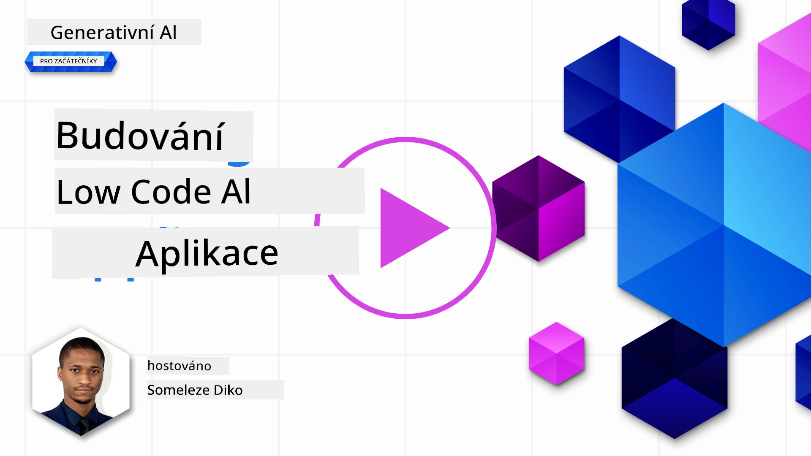](https://youtu.be/1vzq3Nd8GBA?si=h6LHWJXdmqf6mhDg)

> _(Klikněte na obrázek výše pro zobrazení videa této lekce)_

## Úvod

Nyní, když jsme se naučili, jak vytvářet aplikace generující obrázky, podívejme se na nízký kód. Generativní AI lze použít v různých oblastech včetně nízkého kódu, ale co je nízký kód a jak do něj můžeme přidat AI?

Vytváření aplikací a řešení se stalo jednodušším jak pro tradiční vývojáře, tak pro neprogramátory díky využití platform nízkokódového vývoje. Platformy nízkokódového vývoje vám umožňují vytvářet aplikace a řešení s minimem nebo úplně bez kódu. Toho je dosaženo poskytnutím vizuálního vývojového prostředí, které umožňuje přetahovat komponenty pro tvorbu aplikací a řešení. To umožňuje vytvářet aplikace a řešení rychleji a s menšími zdroji. V této lekci se podrobně zaměříme na to, jak používat nízký kód a jak nízkokódový vývoj vylepšit pomocí AI pomocí Power Platform.

Power Platform poskytuje organizacím příležitost zmocnit jejich týmy k vytváření vlastních řešení prostřednictvím intuitivního nízkokódového nebo bezkódového prostředí. Toto prostředí usnadňuje proces vytváření řešení. Díky Power Platform mohou být řešení postavena za dny nebo týdny místo měsíců či let. Power Platform se skládá z pěti klíčových produktů: Power Apps, Power Automate, Power BI, Power Pages a Copilot Studio.

Tato lekce zahrnuje:

- Úvod do generativní AI v Power Platform
- Úvod do Copilota a jak jej používat
- Používání generativní AI k vytváření aplikací a toků v Power Platform
- Porozumění AI modelům v Power Platform pomocí AI Builder
- Vytváření inteligentních agentů s Microsoft Copilot Studio

## Cíle učení

Na konci této lekce budete schopni:

- Porozumět, jak Copilot funguje v Power Platform.

- Vytvořit aplikaci pro sledování studentských úkolů pro naše vzdělávací startup.

- Vytvořit tok pro zpracování faktur, který používá AI k extrahování informací z faktur.

- Používat nejlepší praxe při využívání AI modelu Create Text with GPT.

- Porozumět, co je Microsoft Copilot Studio a jak s ním vytvářet inteligentní agenty.

Nástroje a technologie, které v této lekci použijete, jsou:

- **Power Apps**, pro aplikaci Student Assignment Tracker, která poskytuje nízkokódové vývojové prostředí pro vytváření aplikací pro sledování, správu a interakci s daty.

- **Dataverse**, pro ukládání dat aplikace Student Assignment Tracker, kde Dataverse poskytne nízkokódovou datovou platformu pro uložení dat aplikace.

- **Power Automate**, pro tok zpracování faktur, kde budete mít nízkokódové vývojové prostředí pro tvorbu pracovních toků pro automatizaci procesu zpracování faktur.

- **AI Builder**, pro AI model zpracování faktur, kde použijete předem sestavené AI modely pro zpracování faktur pro náš startup.

## Generativní AI v Power Platform

Vylepšování nízkokódového vývoje a aplikací pomocí generativní AI je klíčovou oblastí zaměření Power Platform. Cílem je umožnit každému vytvářet aplikace, weby, přehledy a automatizovat procesy poháněné AI, _aniž by bylo potřeba mít odborné znalosti z oblasti datové vědy_. Toho je dosaženo integrací generativní AI do nízkokódového vývojového prostředí Power Platform ve formě Copilota a AI Builderu.

### Jak to funguje?

Copilot je AI asistent, který vám umožňuje vytvářet řešení v Power Platform tím, že popíšete své požadavky v sérii konverzačních kroků pomocí přirozeného jazyka. Můžete například asistentovi AI říct, jaká pole má vaše aplikace používat, a on vytvoří jak aplikaci, tak základní datový model, nebo můžete specifikovat, jak nastavit tok v Power Automate.

Funkce řízené Copilotem můžete použít jako prvek na obrazovkách vaší aplikace, aby uživatelé mohli odhalovat poznatky pomocí konverzačního rozhraní.

AI Builder je nízkokódová AI schopnost dostupná v Power Platform, která vám umožní využívat AI modely k automatizaci procesů a předpovídání výsledků. Pomocí AI Builderu můžete přinést AI do svých aplikací a toků, které se připojují k vašim datům v Dataverse nebo v různých cloudových datových zdrojích, jako jsou SharePoint, OneDrive nebo Azure.

Copilot je dostupný ve všech produktech Power Platform: Power Apps, Power Automate, Power BI, Power Pages a Copilot Studio (dříve Power Virtual Agents). AI Builder je dostupný v Power Apps a Power Automate. V této lekci se zaměříme na to, jak používat Copilot a AI Builder v Power Apps a Power Automate k vytvoření řešení pro náš vzdělávací startup.

### Copilot v Power Apps

Jako součást Power Platform poskytuje Power Apps nízkokódové vývojové prostředí k vytváření aplikací pro sledování, správu a interakci s daty. Jedná se o sadu služeb pro vývoj aplikací s rozšiřitelnou datovou platformou a schopností připojení ke cloudovým službám a lokálním datům. Power Apps umožňuje vytvářet aplikace, které běží v prohlížečích, na tabletech a telefonech a mohou být sdíleny s kolegy. Power Apps uživatele jemně uvádí do vývoje aplikací pomocí jednoduchého rozhraní, takže každý obchodní uživatel nebo profesionální vývojář může vytvářet vlastní aplikace. Vývojovou zkušenost aplikací vylepšuje generativní AI prostřednictvím Copilota.

Funkce AI asistenta Copilot v Power Apps umožňuje popsat, jaký druh aplikace potřebujete a jaké informace chcete, aby vaše aplikace sledovala, sbírala nebo zobrazovala. Copilot pak na základě vašeho popisu generuje responzivní Canvas aplikaci. Následně aplikaci můžete přizpůsobit svým potřebám. AI Copilot také generuje a navrhuje tabulku Dataverse s poli, která potřebujete k ukládání dat, jež chcete sledovat, a nějaká ukázková data. V této lekci se později podíváme, co je Dataverse a jak jej můžete používat v Power Apps. Tabulku můžete potom přizpůsobit svým potřebám pomocí funkce AI Copilot asistenta prostřednictvím konverzačních kroků. Tato funkce je snadno dostupná z domovské obrazovky Power Apps.

### Copilot v Power Automate

Jako součást Power Platform umožňuje Power Automate uživatelům vytvářet automatizované pracovní toky mezi aplikacemi a službami. Pomáhá automatizovat opakující se obchodní procesy jako komunikaci, sběr dat a schvalování rozhodnutí. Jeho jednoduché rozhraní umožňuje uživatelům s různou technickou způsobilostí (od začátečníků po zkušené vývojáře) automatizovat pracovní úkoly. Vývojový zážitek z tvorby pracovních toků je také vylepšen generativní AI prostřednictvím Copilota.

Funkce AI asistenta Copilot v Power Automate umožňuje popsat, jaký druh toku potřebujete a jaké akce má váš tok vykonávat. Copilot pak na základě vašeho popisu generuje tok. Tok můžete poté přizpůsobit svým potřebám. AI Copilot také generuje a navrhuje akce, které potřebujete k provedení úkolu, který chcete automatizovat. V této lekci si později vysvětlíme, co jsou to toky a jak je používat v Power Automate. Akce můžete přizpůsobit svým potřebám pomocí AI Copilot asistenta prostřednictvím konverzačních kroků. Tato funkce je snadno dostupná z domovské obrazovky Power Automate.

## Vytváření inteligentních agentů s Microsoft Copilot Studio

[Microsoft Copilot Studio](https://learn.microsoft.com/microsoft-copilot-studio/fundamentals-what-is-copilot-studio?WT.mc_id=academic-105485-koreyst) (dříve Power Virtual Agents) je nízkokódový člen Power Platform pro vytváření **AI agentů** — konverzačních kopilotů, kteří mohou odpovídat na otázky, přijímat akce a automatizovat úkoly za vaše uživatele. Stejně jako ostatní části Power Platform vytváříte tyto agenty ve vizuálním prostředí s důrazem na přirozený jazyk: popíšete, co chcete, aby agent dělal, a Copilot Studio pomáhá vytvářet jeho instrukce, znalosti a akce.

Pro náš vzdělávací startup můžete vytvořit agenta, který odpovídá na dotazy studentů ohledně kurzů, kontroluje termíny úkolů a dokonce posílá e-maily instruktorům — to vše bez psaní kódu.

Zde jsou některé z nejnovějších schopností, které dělají Copilot Studio silným:

- **Generativní odpovědi z vašich znalostí**. Místo ručního psaní každé konverzace můžete připojit **zdroje znalostí** — veřejné weby, SharePoint, OneDrive, Dataverse, nahrané soubory nebo podniková data přes konektory — a agent z nich generuje podložené odpovědi.

- **Generativní orchestraci**. Místo spoléhání se na pevné spouštěcí fráze agent využívá AI k pochopení požadavku a dynamicky rozhoduje, které znalosti, témata a akce zkombinovat k jeho splnění, včetně řetězení několika kroků.

- **Akce a konektory**. Agenti nemluví jen; mohou i *jednat*. Můžete agentovi dát akce podporované více než 1500 předem připravenými konektory Power Platform, toky Power Automate, vlastními REST API, výzvami nebo servery **Model Context Protocol (MCP)**.

- **Autonomní agenti**. Agenti nejsou omezeni odpovídáním v chatovém okně. Můžete budovat **autonomní agenty**, které se spustí událostmi — jako příchozí e-mail, nový záznam v Dataverse nebo nahrání souboru — a poté působí na pozadí, aby dokončili úkol.

- **Orchestrace více agentů**. Agenti mohou volat jiné agenty. Agent Copilot Studio může předat úkol nebo být rozšířen jinými agenty, včetně agentů publikovaných do Microsoft 365 Copilot a agentů vytvořených v Microsoft Foundry.

- **Volba modelu**. Kromě vestavěných modelů můžete přinést modely z katalogu Microsoft Foundry, aby váš agent uvažoval a odpovídal na míru.

- **Publikujte kdekoliv**. Jakmile je agent vytvořen, může být publikován na více kanálech — Microsoft Teams, Microsoft 365 Copilot, web či vlastní aplikace a další — se zabezpečením, autentizací a analytikou řízenou přes administraci Power Platform.

Můžete začít budovat svého prvního agenta na [copilotstudio.microsoft.com](https://copilotstudio.microsoft.com?WT.mc_id=academic-105485-koreyst) a dozvědět se více v [dokumentaci Microsoft Copilot Studio](https://learn.microsoft.com/microsoft-copilot-studio/?WT.mc_id=academic-105485-koreyst).

## Zadání: Správa studentských úkolů a faktur pro náš startup s použitím Copilota

Náš startup poskytuje online kurzy studentům. Startup rychle rostl a nyní má potíže držet krok s poptávkou po svých kurzech. Najali vás jako vývojáře Power Platform, abyste jim pomohli vytvořit nízkokódové řešení pro správu studentských úkolů a faktur. Jejich řešení by mělo umožnit sledovat a spravovat studentské úkoly pomocí aplikace a automatizovat proces zpracování faktur pomocí pracovního toku. Byli jste požádáni, abyste využili generativní AI k vývoji tohoto řešení.

Když začínáte používat Copilota, můžete využít [Power Platform Copilot Prompt Library](https://github.com/pnp/powerplatform-prompts?WT.mc_id=academic-109639-somelezediko) pro inspiraci výzev. Tato knihovna obsahuje seznam výzev, které můžete použít pro tvorbu aplikací a toků s Copilotem. Také vám může pomoci s představou, jak popsat své požadavky Copilotovi.

### Vytvořte aplikaci Student Assignment Tracker pro náš startup

Učitelé v našem startupu měli potíže držet přehled o studentských úkolech. Používali tabulku pro sledování úkolů, ale jak počet studentů rostl, stalo se to těžko spravovatelným. Požádali vás, abyste vytvořili aplikaci, která jim pomůže sledovat a spravovat studentské úkoly. Aplikace by měla umožňovat přidávání nových úkolů, zobrazovat úkoly, aktualizovat je a mazat. Také by měla umožnit učitelům a studentům zobrazit hodnocené úkoly i ty, které ještě nebyly ohodnocené.

Aplikaci vytvoříte pomocí Copilota v Power Apps podle následujících kroků:

1. Přejděte na domovskou obrazovku [Power Apps](https://make.powerapps.com?WT.mc_id=academic-105485-koreyst).

1. Použijte textové pole na domovské obrazovce k popisu aplikace, kterou chcete vytvořit. Například **_Chci vytvořit aplikaci pro sledování a správu studentských úkolů_**. Klikněte na tlačítko **Odeslat** pro poslání výzvy AI Copilotovi.

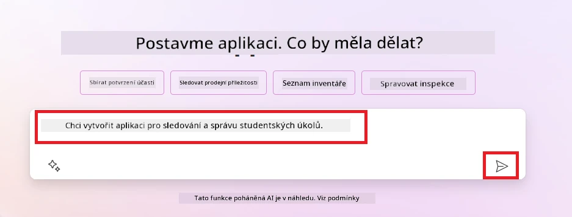

1. AI Copilot navrhne tabulku Dataverse s poli, která potřebujete pro ukládání sledovaných dat, a také nějakými ukázkovými daty. Tabulku poté můžete přizpůsobit svým potřebám pomocí asistenta AI Copilot v konverzačních krocích.

   > **Důležité**: Dataverse je základní datová platforma pro Power Platform. Jedná se o nízkokódovou datovou platformu pro ukládání dat aplikace. Je to plně spravovaná služba, která bezpečně uchovává data v Microsoft Cloudu a je poskytována ve vašem prostředí Power Platform. Obsahuje vestavěné funkce pro správu dat, jako je klasifikace dat, sledování původu dat, jemnozrnná kontrola přístupu a další. Více o Dataverse se můžete dozvědět [zde](https://docs.microsoft.com/powerapps/maker/data-platform/data-platform-intro?WT.mc_id=academic-109639-somelezediko).

   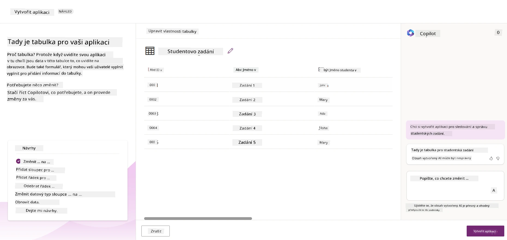

1. Učitelé chtějí posílat e-maily studentům, kteří odevzdali své úkoly, aby je informovali o pokroku jejich úkolů. Můžete použít Copilota k přidání nového pole do tabulky pro uložení e-mailu studenta. Můžete například použít následující výzvu k přidání nového pole do tabulky: **_Chci přidat sloupec pro uložení studenckého e-mailu_**. Klikněte na tlačítko **Odeslat** pro poslání výzvy AI Copilotovi.

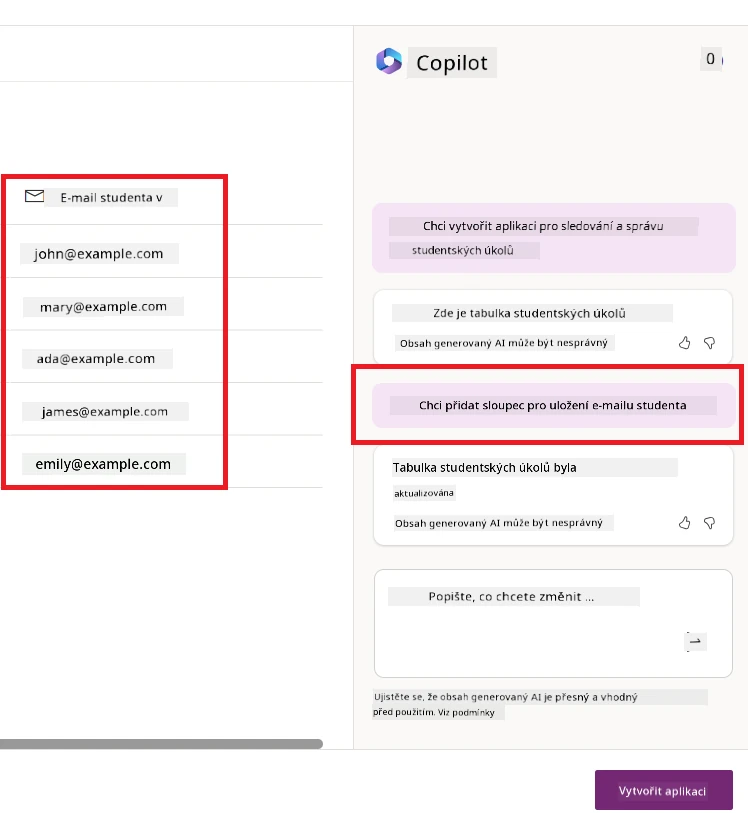

1. AI Copilot vytvoří nové pole a vy jej můžete upravit podle svých potřeb.

1. Jakmile dokončíte tabulku, klikněte na tlačítko **Vytvořit aplikaci** pro vytvoření aplikace.

1. AI Copilot na základě vašeho popisu vytvoří responzivní aplikaci Canvas. Aplikaci pak můžete přizpůsobit podle svých potřeb.

1. Pro pedagogy, kteří chtějí posílat studentům e-maily, můžete použít Copilot k přidání nové obrazovky do aplikace. Například můžete použít následující příkaz pro přidání nové obrazovky do aplikace: **_Chci přidat obrazovku pro odesílání e-mailů studentům_**. Klikněte na tlačítko **Odeslat** pro odeslání příkazu AI Copilotu.

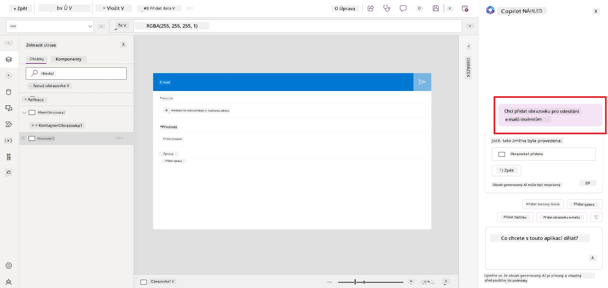

1. AI Copilot vytvoří novou obrazovku, kterou pak můžete přizpůsobit podle svých potřeb.

1. Jakmile dokončíte aplikaci, klikněte na tlačítko **Uložit** pro uložení aplikace.

1. Pro sdílení aplikace s pedagogy klikněte na tlačítko **Sdílet** a pak znovu na tlačítko **Sdílet**. Pak můžete aplikaci sdílet s pedagogy zadáním jejich e-mailových adres.

> **Vaše domácí úloha**: Aplikace, kterou jste právě vytvořili, je dobrým startem, ale může být vylepšena. S funkcí e-mailu mohou pedagogové odesílat e-maily studentům pouze ručně, kdy musí zadávat jejich e-maily. Můžete použít Copilot k vytvoření automatizace, která umožní pedagogům automaticky posílat e-maily studentům, když odevzdají své úkoly? Vaše nápověda je, že s tím správným příkazem můžete využít Copilot v Power Automate k vytvoření této automatizace.

### Vytvoření tabulky informací o fakturách pro náš startup

Finanční tým našeho startupu měl potíže s evidencí faktur. Používali tabulku pro sledování faktur, ale jak se počet faktur zvýšil, začalo to být obtížné spravovat. Požádali vás, abyste vytvořili tabulku, která jim pomůže ukládat, sledovat a řídit informace o přijatých fakturách. Tabulka by měla být použita k vytvoření automatizace, která extrahuje všechny informace z faktur a uloží je do tabulky. Tabulka by měla také umožnit finančnímu týmu zobrazovat faktury, které byly zaplaceny, a ty, které ještě zaplaceny nebyly.

Power Platform má základní datovou platformu nazvanou Dataverse, která vám umožňuje ukládat data pro vaše aplikace a řešení. Dataverse poskytuje low-code datovou platformu pro ukládání dat aplikací. Je to plně spravovaná služba, která bezpečně ukládá data v Microsoft Cloudu a je poskytována ve vašem Power Platform prostředí. Přichází s integrovanými schopnostmi správy dat, jako je klasifikace dat, sledování původu dat, jemnozrnná kontrola přístupu a další. Více se o Dataverse dozvíte [zde](https://docs.microsoft.com/powerapps/maker/data-platform/data-platform-intro?WT.mc_id=academic-109639-somelezediko).

Proč bychom měli používat Dataverse pro náš startup? Standardní a vlastní tabulky v Dataverse poskytují bezpečnou a cloudovou možnost uložení vašich dat. Tabulky vám umožňují ukládat různé typy dat, podobně jako byste používali více listů v jednom sešitu Excelu. Můžete používat tabulky k ukládání dat specifických pro vaši organizaci nebo obchodní potřeby. Některé výhody, které náš startup získá použitím Dataverse, zahrnují, ale nejsou omezeny na:

- **Snadná správa**: Metadata i data jsou uložena v cloudu, takže se nemusíte starat o detaily, jak jsou uložena nebo spravována. Můžete se soustředit na tvorbu svých aplikací a řešení.

- **Bezpečné**: Dataverse poskytuje bezpečné a cloudové úložiště pro vaše data. Můžete kontrolovat, kdo má přístup k datům ve vašich tabulkách a jak k nim má přístup pomocí řízení přístupu založeného na rolích.

- **Bohatá metadata**: Datové typy a vztahy se používají přímo v Power Apps.

- **Logika a validace**: Můžete používat obchodní pravidla, vypočítaná pole a validační pravidla k prosazení obchodní logiky a udržení správnosti dat.

Nyní, když víte, co je Dataverse a proč ho použít, podívejme se, jak můžete pomocí Copilotu vytvořit tabulku v Dataverse, která splní požadavky našeho finančního týmu.

> **Poznámka** : Tuto tabulku použijete v další části k vytvoření automatizace, která extrahuje všechny informace z faktur a uloží je do tabulky.

Pro vytvoření tabulky v Dataverse pomocí Copilotu postupujte podle následujících kroků:

1. Navigujte na domovskou obrazovku [Power Apps](https://make.powerapps.com?WT.mc_id=academic-105485-koreyst).

2. V levém navigačním panelu vyberte **Tabulky** a poté klikněte na **Popište novou Tabulku**.

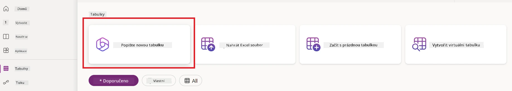

1. Na obrazovce **Popište novou Tabulku** použijte textové pole k popsání tabulky, kterou chcete vytvořit. Například **_Chci vytvořit tabulku pro ukládání informací o fakturách_**. Klikněte na tlačítko **Odeslat** pro odeslání příkazu AI Copilotu.

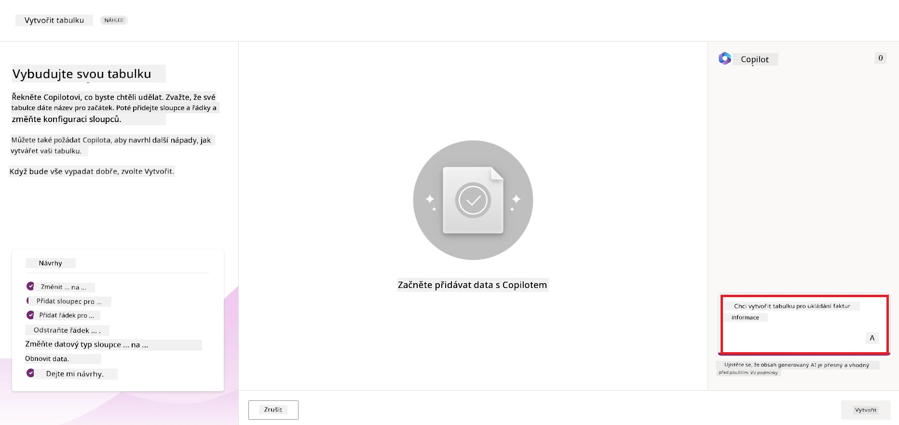

1. AI Copilot navrhne Dataverse tabulku s poli, která potřebujete pro ukládání dat, která chcete sledovat, a několik ukázkových dat. Poté můžete tabulku přizpůsobit dle svých potřeb pomocí funkce asistenta AI Copilot krok za krokem v konverzaci.

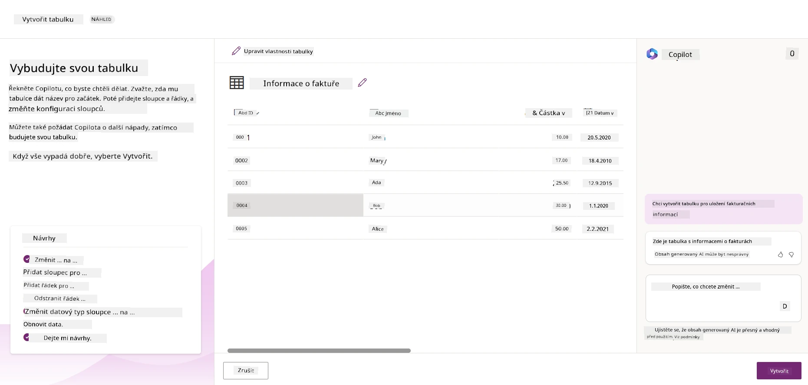

1. Finanční tým chce poslat e-mail dodavateli, aby ho informoval o aktuálním stavu jeho faktury. Můžete použít Copilot k přidání nového pole do tabulky pro uložení e-mailu dodavatele. Například můžete použít následující příkaz pro přidání nového sloupce: **_Chci přidat sloupec pro ukládání e-mailu dodavatele_**. Klikněte na tlačítko **Odeslat** pro odeslání příkazu AI Copilotu.

1. AI Copilot vytvoří nové pole, které pak můžete přizpůsobit podle svých potřeb.

1. Jakmile dokončíte tabulku, klikněte na tlačítko **Vytvořit** pro vytvoření tabulky.

## AI modely v Power Platform pomocí AI Builder

AI Builder je low-code AI schopnost dostupná v Power Platform, která vám umožní využívat AI modely k automatizaci procesů a předpovídání výsledků. S AI Builderem můžete přinést AI do svých aplikací a toků, které se připojují k datům v Dataverse nebo v různých cloudových datových zdrojích, jako je SharePoint, OneDrive nebo Azure.

## Předpřipravené AI modely vs Vlastní AI modely

AI Builder poskytuje dva typy AI modelů: Předpřipravené AI modely a Vlastní AI modely. Předpřipravené AI modely jsou modely připravené k použití, které jsou vyškoleny Microsoftem a dostupné v Power Platform. Tyto modely pomáhají přidat inteligenci do vašich aplikací a toků bez nutnosti sbírat data a následně budovat, trénovat a publikovat vlastní modely. Můžete tyto modely použít k automatizaci procesů a předpovídání výsledků.

Některé z předpřipravených AI modelů dostupných v Power Platform zahrnují:

- **Extrahování klíčových frází**: Tento model extrahuje klíčové fráze z textu.
- **Detekce jazyka**: Tento model rozpozná jazyk textu.
- **Analýza sentimentu**: Tento model rozpozná pozitivní, negativní, neutrální nebo smíšený sentiment v textu.
- **Čtení vizitek**: Tento model extrahuje informace z vizitek.
- **Rozpoznávání textu**: Tento model extrahuje text z obrázků.
- **Detekce objektů**: Tento model detekuje a extrahuje objekty z obrázků.
- **Zpracování dokumentů**: Tento model extrahuje informace z formulářů.
- **Zpracování faktur**: Tento model extrahuje informace z faktur.

S vlastními AI modely můžete přinést vlastní model do AI Builder tak, aby fungoval jako jakýkoli vlastní model AI Builderu, což vám umožní model trénovat na svých vlastních datech. Tyto modely můžete používat k automatizaci procesů a předpovídání výsledků jak v Power Apps, tak v Power Automate. Při používání vlastního modelu platí určitá omezení. Více o těchto [omezeních](https://learn.microsoft.com/ai-builder/byo-model#limitations?WT.mc_id=academic-105485-koreyst).

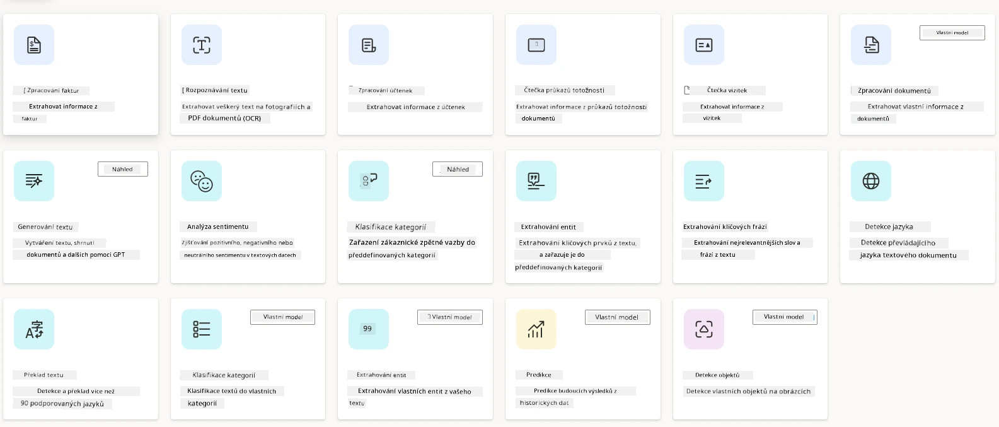

## Úkol č. 2 - Vytvoření toku pro zpracování faktur pro náš startup

Finanční tým měl potíže se zpracováním faktur. Používali tabulku pro sledování faktur, ale jak se počet faktur zvýšil, začalo to být obtížné spravovat. Požádali vás, abyste vytvořili pracovní postup, který jim pomůže faktury zpracovávat pomocí AI. Pracovní postup by měl umožnit extrahovat informace z faktur a ukládat je do tabulky v Dataverse. Pracovní postup by měl také umožnit odeslat e-mail finančnímu týmu s extrahovanými informacemi.

Nyní, když víte, co je AI Builder a proč ho používat, podívejme se, jak můžete použít AI model Zpracování faktur z AI Builderu, který jsme již zmínili, k vytvoření pracovního postupu, který pomůže finančnímu týmu zpracovávat faktury.

Pro vytvoření pracovního postupu, který pomůže finančnímu týmu zpracovávat faktury pomocí AI modelu Zpracování faktur z AI Builderu, postupujte takto:

1. Navigujte na domovskou obrazovku [Power Automate](https://make.powerautomate.com?WT.mc_id=academic-105485-koreyst).

2. Použijte textové pole na domovské obrazovce k popsání pracovního postupu, který chcete vytvořit. Například **_Zpracovat fakturu, když přijde do mé schránky_**. Klikněte na tlačítko **Odeslat** pro odeslání příkazu AI Copilotu.

   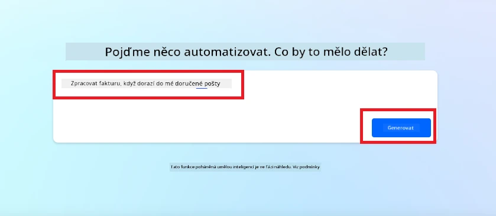

3. AI Copilot navrhne akce nezbytné k vykonání úkolu, který chcete automatizovat. Můžete kliknout na tlačítko **Další** a projít další kroky.

4. V dalším kroku vás Power Automate vyzve k nastavení připojení potřebných pro tok. Po dokončení klikněte na tlačítko **Vytvořit tok** pro vytvoření toku.

5. AI Copilot vygeneruje tok, který pak můžete přizpůsobit podle svých potřeb.

6. Aktualizujte spouštěč toku a nastavte **Složku** na složku, kde budou faktury ukládány. Například můžete složku nastavit na **Doručená pošta**. Klikněte na **Zobrazit pokročilé možnosti** a nastavte **Pouze s přílohami** na **Ano**. To zajistí, že tok se spustí pouze, když bude v dané složce e-mail s přílohou.

7. Odstraňte z toku následující akce: **HTML na text**, **Sestavit**, **Sestavit 2**, **Sestavit 3** a **Sestavit 4**, protože je nebudete používat.

8. Odstraňte z toku akci **Podmínka**, protože ji nebudete používat. Mělo by to vypadat takto:

   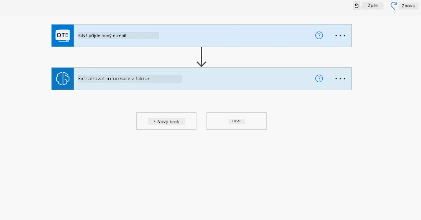

9. Klikněte na tlačítko **Přidat akci** a vyhledejte **Dataverse**. Vyberte akci **Přidat nový řádek**.

10. V akci **Extrahovat informace z faktur** aktualizujte **Soubor faktury** tak, aby odkazoval na **Obsah přílohy** z e-mailu. To zajistí, že tok extrahuje informace z přílohy faktury.

11. Vyberte tabulku, kterou jste vytvořili dříve. Například můžete vybrat tabulku **Informace o fakturách**. Vyberte dynamický obsah z předchozí akce k vyplnění následujících polí:

    - ID
    - Částka
    - Datum
    - Název
    - Stav - nastavte **Stav** na **Čeká na zpracování**.
    - E-mail dodavatele - použijte dynamický obsah **Od** ze spouštěče **Když přijde nový e-mail**.

    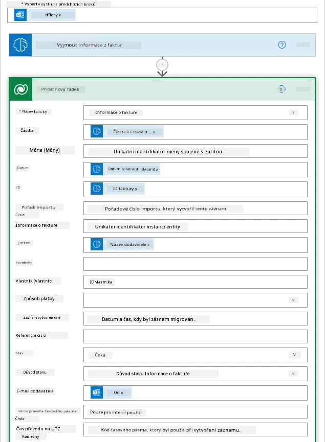

12. Jakmile dokončíte tok, klikněte na tlačítko **Uložit** pro uložení toku. Pak můžete tok otestovat odesláním e-mailu s fakturou do složky, kterou jste uvedli ve spouštěči.

> **Vaše domácí úloha**: Tok, který jste právě vytvořili, je dobrým začátkem, nyní byste měli přemýšlet, jak vytvořit automatizaci, která umožní našemu finančnímu týmu posílat e-maily dodavatelům, aby je informoval o aktuálním stavu jejich faktury. Vaše nápověda: tok musí běžet, když se změní stav faktury.

## Použití AI modelu pro generování textu v Power Automate

AI model Create Text with GPT v AI Builderu vám umožňuje generovat text založený na příkazu a je poháněn službou Microsoft Azure OpenAI. S touto schopností můžete do svých aplikací a toků integrovat technologii GPT (Generative Pre-Trained Transformer) a vytvářet různé automatizované toky a přehledné aplikace.

GPT modely procházejí rozsáhlým tréninkem na obrovských množstvích dat, což jim umožňuje produkovat text, který velmi připomíná lidský jazyk, pokud jim je zadán příkaz. Při integraci s automatizací pracovních postupů lze AI modely jako GPT využít ke zjednodušení a automatizaci široké škály úkolů.

Například můžete vytvářet toky, které automaticky generují text pro různé případy užití, jako jsou nástřely e-mailů, popisy produktů a další. Model můžete také využít k generování textu pro různé aplikace, například chatboty a aplikace zákaznické podpory, které umožňují agentům poskytovat zákaznický servis efektivně a rychle reagovat na dotazy.

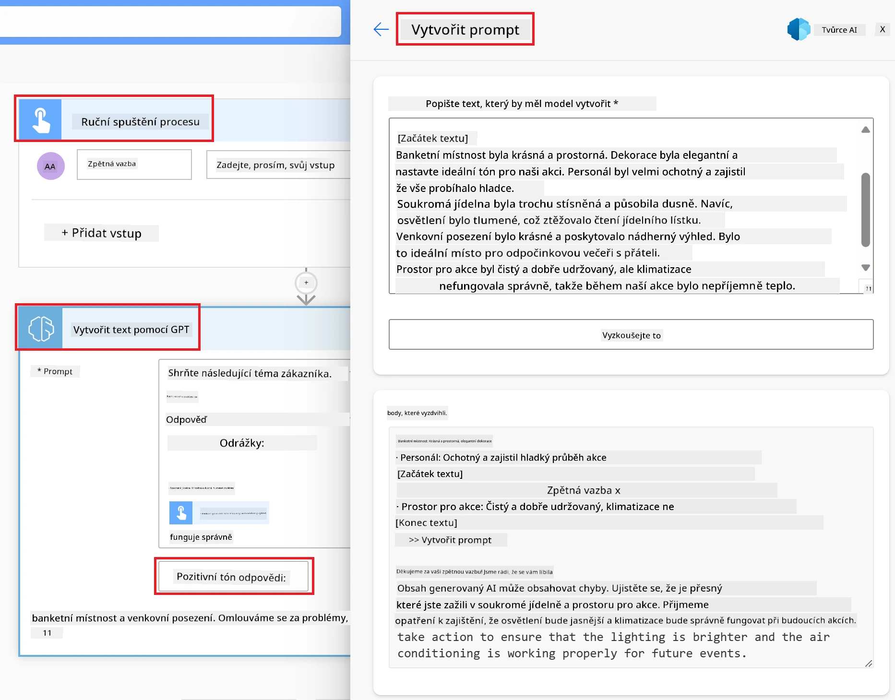

Chcete-li se naučit, jak používat tento AI model v Power Automate, projděte si modul [Přidání inteligence pomocí AI Builder a GPT](https://learn.microsoft.com/training/modules/ai-builder-text-generation/?WT.mc_id=academic-109639-somelezediko).

## Skvělá práce! Pokračujte ve svém vzdělávání

Po dokončení této lekce se podívejte na naši [sbírku Generative AI Learning](https://aka.ms/genai-collection?WT.mc_id=academic-105485-koreyst) a pokračujte ve zvyšování svých znalostí o Generative AI!

Chcete Copilota přizpůsobit a získat z něj více? Prozkoumejte [Awesome Copilot](https://github.com/github/awesome-copilot?WT.mc_id=academic-105485-koreyst) — komunitou přispívanou sbírku příkazů, agentů, schopností a konfigurací, která vám pomůže využít GitHub Copilot na maximum.

Přejděte k lekci 11, kde se podíváme, jak [integrovat Generative AI s Function Calling](../11-integrating-with-function-calling/README.md?WT.mc_id=academic-105485-koreyst)!

---

<!-- CO-OP TRANSLATOR DISCLAIMER START -->
**Prohlášení o omezení odpovědnosti**:
Tento dokument byl přeložen pomocí AI překladatelské služby [Co-op Translator](https://github.com/Azure/co-op-translator). Přestože usilujeme o co největší přesnost, mějte prosím na paměti, že automatizované překlady mohou obsahovat chyby nebo nepřesnosti. Originální dokument v jeho mateřském jazyce by měl být považován za autoritativní zdroj. Pro kritické informace se doporučuje profesionální lidský překlad. Nejsme odpovědní za jakékoli nedorozumění nebo nesprávné interpretace vzniklé použitím tohoto překladu.
<!-- CO-OP TRANSLATOR DISCLAIMER END -->