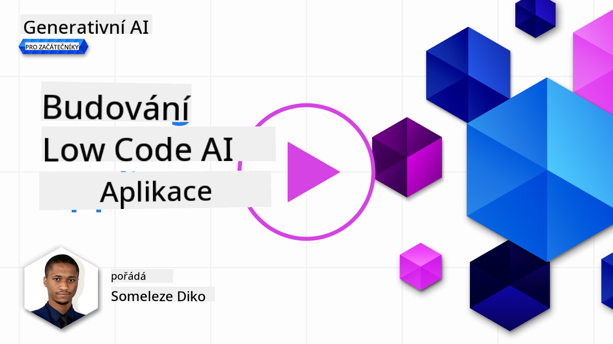
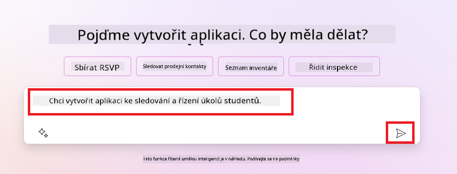
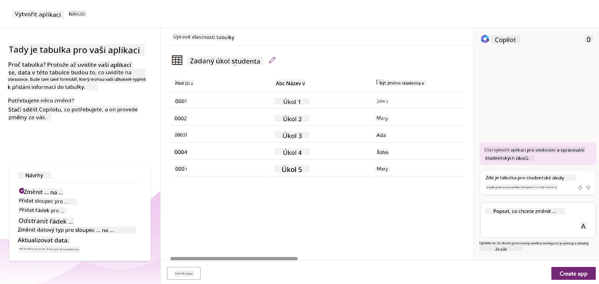
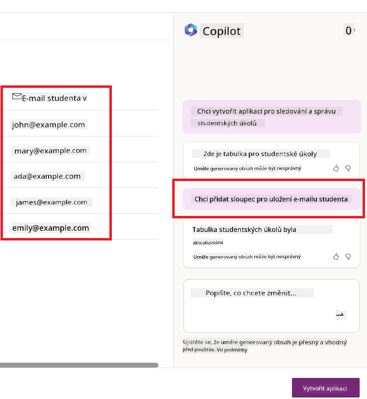
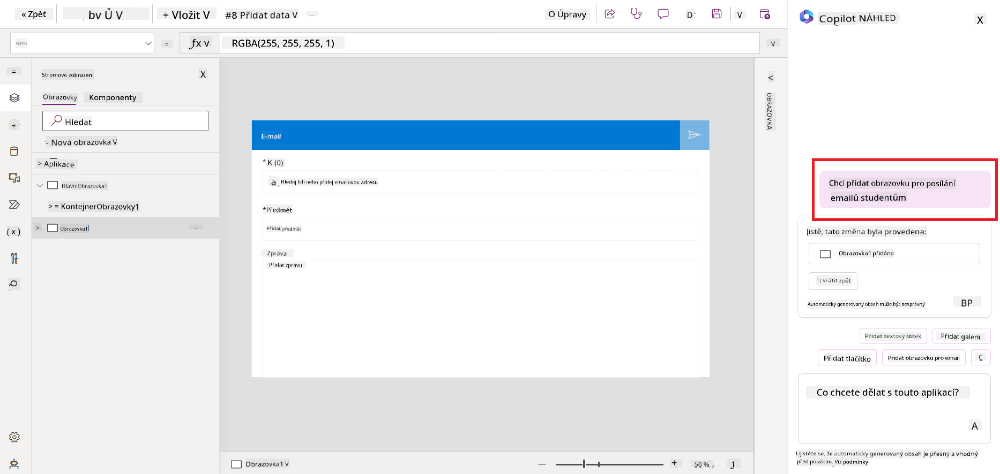

<!--
CO_OP_TRANSLATOR_METADATA:
{
  "original_hash": "f5ff3b6204a695a117d6f452403c95f7",
  "translation_date": "2025-06-25T19:18:56+00:00",
  "source_file": "10-building-low-code-ai-applications/README.md",
  "language_code": "cs"
}
-->
# Vytváření AI aplikací s nízkým kódem

> _(Klikněte na obrázek výše pro zhlédnutí videa této lekce)_

## Úvod

Nyní, když jsme se naučili, jak vytvářet aplikace generující obrázky, pojďme si povědět o nízkém kódu. Generativní AI může být použita v různých oblastech včetně nízkého kódu, ale co je to nízký kód a jak do něj můžeme přidat AI?

Vytváření aplikací a řešení se stalo jednodušším pro tradiční vývojáře i nevývojáře díky platformám pro vývoj s nízkým kódem. Tyto platformy umožňují vytvářet aplikace a řešení s malým nebo žádným kódem. Toho je dosaženo poskytnutím vizuálního vývojového prostředí, které umožňuje přetahovat komponenty pro vytváření aplikací a řešení. To umožňuje rychlejší a méně nákladné vytváření aplikací a řešení. V této lekci se podrobně podíváme na to, jak používat nízký kód a jak zlepšit vývoj s nízkým kódem pomocí AI s využitím Power Platform.

Power Platform poskytuje organizacím možnost posílit své týmy, aby si mohly samy vytvářet řešení v intuitivním prostředí s nízkým nebo žádným kódem. Toto prostředí pomáhá zjednodušit proces vytváření řešení. S Power Platform lze řešení vytvářet během dnů nebo týdnů místo měsíců nebo let. Power Platform se skládá z pěti klíčových produktů: Power Apps, Power Automate, Power BI, Power Pages a Copilot Studio.

Tato lekce zahrnuje:

- Úvod do Generativní AI v Power Platform
- Úvod do Copilot a jak jej používat
- Použití Generativní AI k vytváření aplikací a toků v Power Platform
- Porozumění AI modelům v Power Platform s AI Builder

## Cíle učení

Na konci této lekce budete schopni:

- Pochopit, jak funguje Copilot v Power Platform.

- Vytvořit aplikaci pro sledování úkolů studentů pro náš vzdělávací startup.

- Vytvořit tok pro zpracování faktur, který používá AI k extrakci informací z faktur.

- Aplikovat osvědčené postupy při používání modelu GPT AI pro tvorbu textu.

Nástroje a technologie, které v této lekci použijete, jsou:

- **Power Apps**, pro aplikaci na sledování úkolů studentů, která poskytuje prostředí s nízkým kódem pro vytváření aplikací k sledování, správě a interakci s daty.

- **Dataverse**, pro ukládání dat pro aplikaci na sledování úkolů studentů, kde Dataverse poskytne platformu s nízkým kódem pro ukládání dat aplikace.

- **Power Automate**, pro tok zpracování faktur, kde budete mít prostředí s nízkým kódem pro vytváření pracovních postupů k automatizaci procesu zpracování faktur.

- **AI Builder**, pro AI model zpracování faktur, kde použijete předpřipravené AI modely k zpracování faktur pro náš startup.

## Generativní AI v Power Platform

Zlepšení vývoje a aplikací s nízkým kódem pomocí generativní AI je klíčovou oblastí zaměření pro Power Platform. Cílem je umožnit každému vytvářet aplikace, weby, dashboardy a automatizovat procesy s AI, _aniž by bylo vyžadováno jakékoli odborné znalosti datové vědy_. Tento cíl je dosažen integrací generativní AI do vývojového prostředí s nízkým kódem v Power Platform ve formě Copilot a AI Builder.

### Jak to funguje?

Copilot je AI asistent, který vám umožňuje vytvářet řešení Power Platform popisem vašich požadavků v řadě konverzačních kroků pomocí přirozeného jazyka. Můžete například instruovat svého AI asistenta, aby uvedl, jaká pole vaše aplikace použije, a on vytvoří jak aplikaci, tak podkladový datový model, nebo můžete specifikovat, jak nastavit tok v Power Automate.

Funkce řízené Copilotem můžete použít jako funkci na obrazovkách vaší aplikace, aby uživatelé mohli objevovat poznatky prostřednictvím konverzačních interakcí.

AI Builder je schopnost AI s nízkým kódem dostupná v Power Platform, která vám umožňuje používat AI modely k automatizaci procesů a předpovídání výsledků. S AI Builder můžete přinést AI do svých aplikací a toků, které se připojují k vašim datům v Dataverse nebo v různých cloudových zdrojích dat, jako je SharePoint, OneDrive nebo Azure.

Copilot je k dispozici ve všech produktech Power Platform: Power Apps, Power Automate, Power BI, Power Pages a Power Virtual Agents. AI Builder je dostupný v Power Apps a Power Automate. V této lekci se zaměříme na to, jak používat Copilot a AI Builder v Power Apps a Power Automate k vytvoření řešení pro náš vzdělávací startup.

### Copilot v Power Apps

Jako součást Power Platform poskytuje Power Apps prostředí s nízkým kódem pro vytváření aplikací k sledování, správě a interakci s daty. Je to sada služeb pro vývoj aplikací s rozšiřitelnou datovou platformou a schopností připojení ke cloudovým službám a datům na místě. Power Apps umožňuje vytvářet aplikace, které běží v prohlížečích, tabletech a telefonech, a lze je sdílet s kolegy. Power Apps usnadňuje uživatelům vývoj aplikací s jednoduchým rozhraním, takže každý uživatel nebo profesionální vývojář může vytvářet vlastní aplikace. Zážitek z vývoje aplikací je také vylepšen generativní AI prostřednictvím Copilot.

Funkce AI asistenta Copilot v Power Apps vám umožňuje popsat, jakou aplikaci potřebujete a jaké informace chcete, aby vaše aplikace sledovala, sbírala nebo zobrazovala. Copilot pak na základě vašeho popisu vygeneruje responzivní aplikaci Canvas. Poté můžete aplikaci přizpůsobit svým potřebám. AI Copilot také generuje a navrhuje tabulku Dataverse s poli, která potřebujete k ukládání dat, která chcete sledovat, a některými vzorovými daty. Později se v této lekci podíváme na to, co je Dataverse a jak jej můžete použít v Power Apps. Poté můžete tabulku přizpůsobit svým potřebám pomocí funkce AI Copilot asistenta prostřednictvím konverzačních kroků. Tato funkce je snadno dostupná z domovské obrazovky Power Apps.

### Copilot v Power Automate

Jako součást Power Platform umožňuje Power Automate uživatelům vytvářet automatizované pracovní postupy mezi aplikacemi a službami. Pomáhá automatizovat opakující se obchodní procesy, jako je komunikace, sběr dat a schvalování rozhodnutí. Jeho jednoduché rozhraní umožňuje uživatelům s jakoukoli technickou kompetencí (od začátečníků po zkušené vývojáře) automatizovat pracovní úkoly. Zážitek z vývoje pracovních postupů je také vylepšen generativní AI prostřednictvím Copilot.

Funkce AI asistenta Copilot v Power Automate vám umožňuje popsat, jaký druh toku potřebujete a jaké akce chcete, aby váš tok vykonával. Copilot pak na základě vašeho popisu vygeneruje tok. Poté můžete tok přizpůsobit svým potřebám. AI Copilot také generuje a navrhuje akce, které potřebujete k provedení úkolu, který chcete automatizovat. Později se v této lekci podíváme na to, co jsou toky a jak je můžete použít v Power Automate. Poté můžete akce přizpůsobit svým potřebám pomocí funkce AI Copilot asistenta prostřednictvím konverzačních kroků. Tato funkce je snadno dostupná z domovské obrazovky Power Automate.

## Úkol: Spravujte studentské úkoly a faktury pro náš startup pomocí Copilot

Náš startup poskytuje online kurzy studentům. Startup rychle roste a nyní má potíže s uspokojením poptávky po svých kurzech. Startup si najal vás jako vývojáře Power Platform, abyste jim pomohli vytvořit řešení s nízkým kódem, které jim pomůže spravovat studentské úkoly a faktury. Jejich řešení by mělo být schopno pomoci jim sledovat a spravovat studentské úkoly prostřednictvím aplikace a automatizovat proces zpracování faktur prostřednictvím pracovního postupu. Bylo vám řečeno, abyste použili generativní AI k vývoji řešení.

Když začínáte s používáním Copilot, můžete použít [Knihovnu promptů Power Platform Copilot](https://github.com/pnp/powerplatform-prompts?WT.mc_id=academic-109639-somelezediko) pro začátek s prompty. Tato knihovna obsahuje seznam promptů, které můžete použít k vytváření aplikací a toků s Copilot. Můžete také použít prompty v knihovně, abyste získali představu o tom, jak popsat své požadavky Copilot.

### Vytvořte aplikaci pro sledování úkolů studentů pro náš startup

Pedagogové v našem startupu mají potíže s udržováním přehledu o studentských úkolech. Používali tabulku k sledování úkolů, ale to se stalo obtížně zvládnutelné, protože počet studentů se zvýšil. Požádali vás, abyste vytvořili aplikaci, která jim pomůže sledovat a spravovat studentské úkoly. Aplikace by jim měla umožnit přidávat nové úkoly, zobrazovat úkoly, aktualizovat úkoly a mazat úkoly. Aplikace by také měla umožnit pedagogům a studentům zobrazit úkoly, které byly ohodnoceny, a ty, které nebyly ohodnoceny.

Aplikaci vytvoříte pomocí Copilot v Power Apps podle následujících kroků:

1. Přejděte na domovskou obrazovku [Power Apps](https://make.powerapps.com?WT.mc_id=academic-105485-koreyst).

1. Použijte textovou oblast na domovské obrazovce k popisu aplikace, kterou chcete vytvořit. Například **_Chci vytvořit aplikaci pro sledování a správu studentských úkolů_**. Klikněte na tlačítko **Odeslat** pro odeslání promptu AI Copilot.

1. AI Copilot navrhne tabulku Dataverse s poli, která potřebujete k ukládání dat, která chcete sledovat, a některými vzorovými daty. Poté můžete tabulku přizpůsobit svým potřebám pomocí funkce AI Copilot asistenta prostřednictvím konverzačních kroků.

   > **Důležité**: Dataverse je podkladová datová platforma pro Power Platform. Je to platforma s nízkým kódem pro ukládání dat aplikace. Je to plně spravovaná služba, která bezpečně ukládá data v Microsoft Cloudu a je zřízena ve vašem prostředí Power Platform. Má zabudované schopnosti správy dat, jako je klasifikace dat, sledování dat, jemnozrnná kontrola přístupu a další. Více o Dataverse se můžete dozvědět [zde](https://docs.microsoft.com/powerapps/maker/data-platform/data-platform-intro?WT.mc_id=academic-109639-somelezediko).

   

1. Pedagogové chtějí posílat e-maily studentům, kteří odevzdali své úkoly, aby je informovali o postupu jejich úkolů. Můžete použít Copilot k přidání nového pole do tabulky pro uložení e-mailu studenta. Například můžete použít následující prompt k přidání nového pole do tabulky: **_Chci přidat sloupec pro uložení e-mailu studenta_**. Klikněte na tlačítko **Odeslat** pro odeslání promptu AI Copilot.

1. AI Copilot vygeneruje nové pole a poté můžete pole přizpůsobit svým potřebám.

1. Jakmile budete s tabulkou hotovi, klikněte na tlačítko **Vytvořit aplikaci** pro vytvoření aplikace.

1. AI Copilot vygeneruje responzivní aplikaci Canvas na základě vašeho popisu. Poté můžete aplikaci přizpůsobit svým potřebám.

1. Aby pedagogové mohli posílat e-maily studentům, můžete použít Copilot k přidání nové obrazovky do aplikace. Například můžete použít následující prompt k přidání nové obrazovky do aplikace: **_Chci přidat obrazovku pro odesílání e-mailů studentům_**. Klikněte na tlačítko **Odeslat** pro odeslání promptu AI Copilot.

1. AI Copilot vygeneruje novou obrazovku a poté můžete obrazovku přizpůsobit svým potřebám.

1. Jakmile budete s aplikací hotovi, klikněte na tlačítko **Uložit** pro uložení aplikace.

1. Chcete-li aplikaci sdílet s pedagogy, klikněte na tlačítko **Sdílet** a poté znovu na tlačítko **Sdílet**. Poté můžete aplikaci sdílet s pedagogy zadáním jejich e-mailových adres.

> **Vaše domácí úloha**: Aplikace, kterou jste právě vytvořili, je dobrým začátkem, ale lze ji vylepšit. S funkcí e-mailu mohou pedagogové posílat e-maily studentům pouze ručně tím, že musí psát jejich e-maily. Můžete použít Copilot k vytvoření automatizace, která umožní pedagogům automaticky posílat e-maily studentům, když odevzdají své úkoly? Vaše nápověda je, že s pravým promptem můžete použít Copilot v Power Automate k vytvoření tohoto.

### Vytvořte tabulku s informacemi o fakturách pro náš startup

Finanční tým našeho startupu má potíže s udržováním přehledu o fakturách. Používali tabulku k sledování faktur, ale to se stalo obtížně zvládnutelné, protože počet faktur se zvýšil. Požádali vás, abyste vytvořili tabulku, která jim pomůže ukládat, sledovat a spravovat informace o fakturách, které obdrželi. Tabulka by měla být použita k vytvoření automatizace, která extrahuje všechny informace o fakturách a uloží je do tabulky. Tabulka by také měla umožnit finančnímu týmu zobrazit faktury, které byly zaplaceny, a ty, které nebyly zaplaceny.

Power Platform má podkladovou datovou platformu nazvanou Dataverse, která vám umožňuje ukládat data pro vaše aplikace a řešení. Dataverse poskytuje platformu s nízkým kódem pro ukládání dat aplikace. Je to plně spravovaná služba, která bezpečně ukládá data v Microsoft Cloudu a je zřízena ve vašem prostředí Power Platform. Má zabudované schopnosti správy dat, jako je klasifikace dat, sledování dat, jemnozrnná kontrola přístupu a další. Více se můžete dozvědět [o Dataverse zde](https://docs.microsoft.com/powerapps/maker/data-platform/data-platform-intro?WT.mc_id=academic-109639-somelezediko).

Proč bychom měli používat Dataverse pro náš startup? Standardní a vlastní tabulky v Dataverse poskytují bezpečnou a cloudovou možnost ukládání vašich dat. Tabulky vám umožňují ukládat různé typy dat, podobně jako byste mohli používat více listů v jednom Excelovém sešitu. Můžete použít tabulky k ukládání dat, která jsou specifická pro vaše organizační nebo obchodní potřeby. Některé z výhod, které náš
- **Analýza sentimentu**: Tento model detekuje pozitivní, negativní, neutrální nebo smíšený sentiment v textu.
- **Čtečka vizitek**: Tento model extrahuje informace z vizitek.
- **Rozpoznávání textu**: Tento model extrahuje text z obrázků.
- **Detekce objektů**: Tento model detekuje a extrahuje objekty z obrázků.
- **Zpracování dokumentů**: Tento model extrahuje informace z formulářů.
- **Zpracování faktur**: Tento model extrahuje informace z faktur.

S vlastními AI modely můžete do AI Builderu přinést svůj vlastní model, aby mohl fungovat jako jakýkoli vlastní model AI Builderu, což vám umožní trénovat model pomocí vlastních dat. Tyto modely můžete použít k automatizaci procesů a předpovídání výsledků v Power Apps i Power Automate. Při použití vlastního modelu platí určitá omezení. Přečtěte si více o těchto [omezeních](https://learn.microsoft.com/ai-builder/byo-model#limitations?WT.mc_id=academic-105485-koreyst).

## Úkol č. 2 - Vytvoření toku pro zpracování faktur pro náš startup

Finanční tým má potíže se zpracováním faktur. Používali tabulkový procesor ke sledování faktur, ale s nárůstem počtu faktur se to stalo obtížně spravovatelným. Požádali vás, abyste vytvořili workflow, které jim pomůže zpracovávat faktury pomocí AI. Workflow by jim mělo umožnit extrahovat informace z faktur a ukládat je do tabulky Dataverse. Workflow by jim mělo také umožnit poslat e-mail finančnímu týmu s extrahovanými informacemi.

Nyní, když víte, co je AI Builder a proč byste ho měli používat, podívejme se, jak můžete použít model AI pro zpracování faktur v AI Builderu, který jsme zmínili dříve, k vytvoření workflow, které pomůže finančnímu týmu zpracovávat faktury.

Chcete-li vytvořit workflow, které pomůže finančnímu týmu zpracovávat faktury pomocí modelu AI pro zpracování faktur v AI Builderu, postupujte podle následujících kroků:

1. Přejděte na domovskou obrazovku [Power Automate](https://make.powerautomate.com?WT.mc_id=academic-105485-koreyst).
2. Na domovské obrazovce použijte textovou oblast k popisu workflow, které chcete vytvořit. Například **_Zpracovat fakturu, když dorazí do mé poštovní schránky_**. Klikněte na tlačítko **Odeslat** pro odeslání výzvy AI Copilotovi.
3. AI Copilot navrhne akce, které potřebujete k provedení úkolu, který chcete automatizovat. Můžete kliknout na tlačítko **Další** a projít další kroky.
4. V dalším kroku vás Power Automate vyzve k nastavení potřebných připojení pro tok. Jakmile budete hotovi, klikněte na tlačítko **Vytvořit tok** pro vytvoření toku.
5. AI Copilot vygeneruje tok a můžete jej pak přizpůsobit podle svých potřeb.
6. Aktualizujte spouštěč toku a nastavte **Složku** na složku, kde budou faktury ukládány. Například můžete nastavit složku na **Doručená pošta**. Klikněte na **Zobrazit pokročilé možnosti** a nastavte **Pouze s přílohami** na **Ano**. To zajistí, že tok poběží pouze tehdy, když do složky dorazí e-mail s přílohou.
7. Odstraňte následující akce z toku: **HTML na text**, **Složit**, **Složit 2**, **Složit 3** a **Složit 4**, protože je nebudete používat.
8. Odstraňte akci **Podmínka** z toku, protože ji nebudete používat. Mělo by to vypadat jako na následujícím snímku obrazovky:
9. Klikněte na tlačítko **Přidat akci** a vyhledejte **Dataverse**. Vyberte akci **Přidat nový řádek**.
10. U akce **Extrahovat informace z faktur** aktualizujte **Soubor faktury**, aby ukazoval na **Obsah přílohy** z e-mailu. To zajistí, že tok extrahuje informace z přílohy faktury.
11. Vyberte **Tabulku**, kterou jste vytvořili dříve. Například můžete vybrat tabulku **Informace o faktuře**. Vyberte dynamický obsah z předchozí akce k vyplnění následujících polí:
   - ID
   - Částka
   - Datum
   - Jméno
   - Stav
   - Nastavte **Stav** na **Čekající**.
   - E-mail dodavatele
   - Použijte dynamický obsah **Od** ze spouštěče **Když dorazí nový e-mail**.
12. Jakmile dokončíte tok, klikněte na tlačítko **Uložit** pro uložení toku. Tok můžete pak otestovat tím, že pošlete e-mail s fakturou do složky, kterou jste určili ve spouštěči.

> **Vaše domácí úloha**: Tok, který jste právě vytvořili, je dobrý začátek, nyní musíte přemýšlet o tom, jak vytvořit automatizaci, která umožní našemu finančnímu týmu poslat e-mail dodavateli, aby ho informoval o aktuálním stavu jeho faktury. Vaše nápověda: tok musí běžet, když se změní stav faktury.

## Použití modelu AI pro generování textu v Power Automate

Model Create Text with GPT AI v AI Builderu vám umožňuje generovat text na základě výzvy a je poháněn službou Microsoft Azure OpenAI. S touto schopností můžete do svých aplikací a toků integrovat technologii GPT (Generative Pre-Trained Transformer) k vytváření různorodých automatizovaných toků a přehledných aplikací.

Modely GPT procházejí rozsáhlým tréninkem na obrovském množství dat, což jim umožňuje produkovat text, který se velmi podobá lidskému jazyku, když jsou jim poskytnuty výzvy. Když jsou integrovány s automatizací workflow, modely AI jako GPT mohou být využity k zjednodušení a automatizaci široké škály úkolů.

Například můžete vytvořit toky, které automaticky generují text pro různé případy použití, jako jsou: návrhy e-mailů, popisy produktů a další. Model můžete také použít k generování textu pro různé aplikace, jako jsou chatboty a aplikace zákaznického servisu, které umožňují agentům zákaznického servisu efektivně a účinně reagovat na dotazy zákazníků.

Chcete-li se naučit, jak používat tento model AI v Power Automate, projděte si modul [Přidání inteligence s AI Builderem a GPT](https://learn.microsoft.com/training/modules/ai-builder-text-generation/?WT.mc_id=academic-109639-somelezediko).

## Skvělá práce! Pokračujte ve svém učení

Po dokončení této lekce se podívejte na naši [kolekci učení o generativní AI](https://aka.ms/genai-collection?WT.mc_id=academic-105485-koreyst), abyste pokračovali ve zvyšování svých znalostí o generativní AI!

Přejděte na lekci 11, kde se podíváme na to, jak [integrovat generativní AI s voláním funkcí](../11-integrating-with-function-calling/README.md?WT.mc_id=academic-105485-koreyst)!

**Zřeknutí se odpovědnosti**:  
Tento dokument byl přeložen pomocí AI překladové služby [Co-op Translator](https://github.com/Azure/co-op-translator). I když se snažíme o přesnost, prosím uvědomte si, že automatizované překlady mohou obsahovat chyby nebo nepřesnosti. Původní dokument v jeho rodném jazyce by měl být považován za autoritativní zdroj. Pro kritické informace se doporučuje profesionální lidský překlad. Nejsme odpovědní za žádná nedorozumění nebo mylné interpretace vzniklé použitím tohoto překladu.