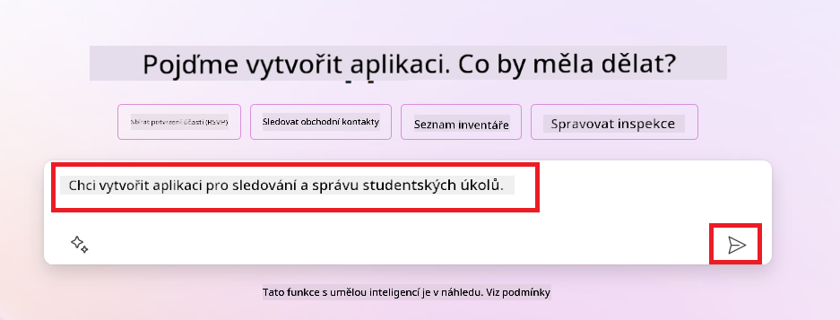
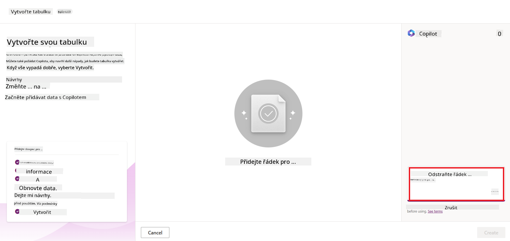
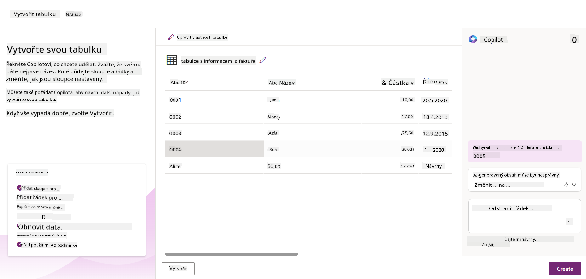
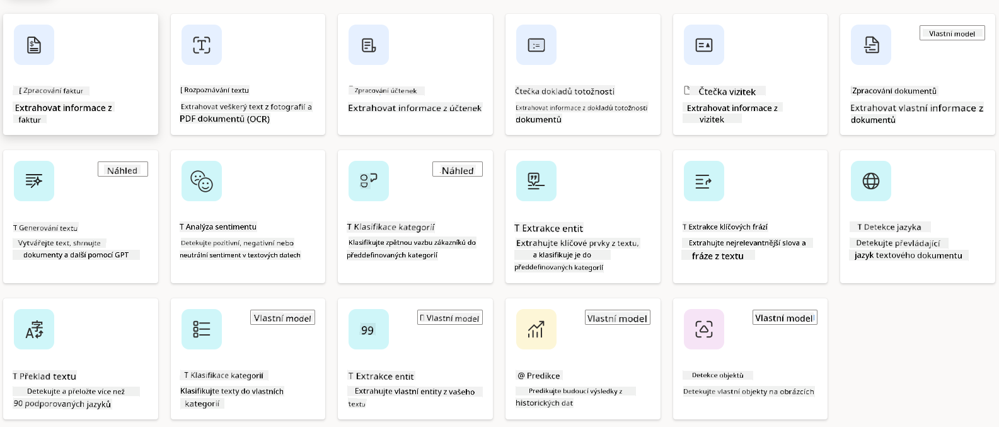
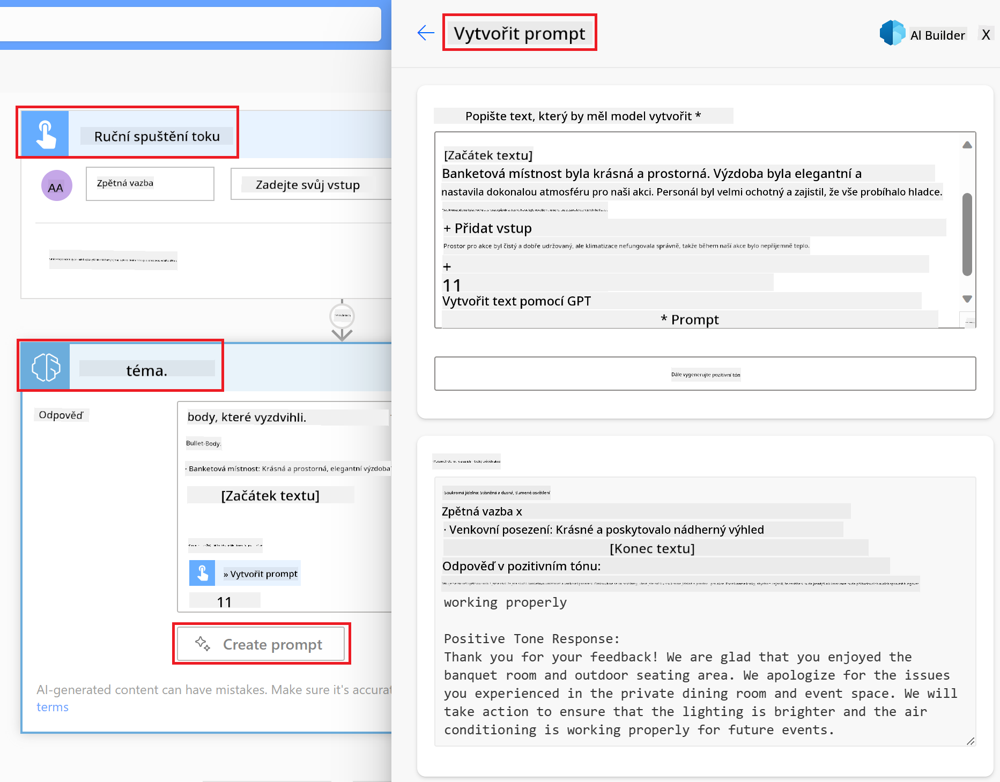

<!--
CO_OP_TRANSLATOR_METADATA:
{
  "original_hash": "846ac8e3b7dcfb697d3309fec05f0fea",
  "translation_date": "2025-10-17T21:40:12+00:00",
  "source_file": "10-building-low-code-ai-applications/README.md",
  "language_code": "cs"
}
-->
# Vytváření AI aplikací s nízkým kódem

> _(Klikněte na obrázek výše pro zhlédnutí videa této lekce)_

## Úvod

Nyní, když jsme se naučili, jak vytvářet aplikace generující obrázky, pojďme si povědět o nízkém kódu. Generativní AI může být využita v různých oblastech, včetně nízkého kódu, ale co to vlastně nízký kód je a jak do něj můžeme přidat AI?

Vytváření aplikací a řešení se stalo jednodušším pro tradiční vývojáře i ne-vývojáře díky platformám pro vývoj s nízkým kódem. Tyto platformy umožňují vytvářet aplikace a řešení s minimálním nebo žádným kódem. Toho je dosaženo poskytnutím vizuálního vývojového prostředí, které umožňuje přetahovat komponenty a vytvářet aplikace a řešení. Díky tomu je možné vytvářet aplikace a řešení rychleji a s menšími zdroji. V této lekci se podrobně podíváme na to, jak používat nízký kód a jak zlepšit vývoj s nízkým kódem pomocí AI v Power Platform.

Power Platform poskytuje organizacím možnost posílit jejich týmy, aby si mohly samy vytvářet řešení prostřednictvím intuitivního prostředí s nízkým nebo žádným kódem. Toto prostředí zjednodušuje proces vytváření řešení. S Power Platform lze řešení vytvářet během dnů nebo týdnů místo měsíců nebo let. Power Platform se skládá z pěti klíčových produktů: Power Apps, Power Automate, Power BI, Power Pages a Copilot Studio.

Tato lekce zahrnuje:

- Úvod do generativní AI v Power Platform
- Úvod do Copilot a jeho použití
- Použití generativní AI k vytváření aplikací a toků v Power Platform
- Porozumění AI modelům v Power Platform s AI Builder

## Cíle učení

Na konci této lekce budete schopni:

- Porozumět, jak funguje Copilot v Power Platform.

- Vytvořit aplikaci pro sledování úkolů studentů pro náš vzdělávací startup.

- Vytvořit tok pro zpracování faktur, který využívá AI k extrakci informací z faktur.

- Použít osvědčené postupy při používání modelu Create Text s GPT AI.

Nástroje a technologie, které budete v této lekci používat, jsou:

- **Power Apps**, pro aplikaci Student Assignment Tracker, která poskytuje vývojové prostředí s nízkým kódem pro vytváření aplikací ke sledování, správě a interakci s daty.

- **Dataverse**, pro ukládání dat pro aplikaci Student Assignment Tracker, kde Dataverse poskytne platformu s nízkým kódem pro ukládání dat aplikace.

- **Power Automate**, pro tok zpracování faktur, kde budete mít vývojové prostředí s nízkým kódem pro vytváření pracovních toků k automatizaci procesu zpracování faktur.

- **AI Builder**, pro AI model zpracování faktur, kde použijete předem vytvořené AI modely k zpracování faktur pro náš startup.

## Generativní AI v Power Platform

Zlepšení vývoje a aplikací s nízkým kódem pomocí generativní AI je klíčovou oblastí zaměření Power Platform. Cílem je umožnit každému vytvářet aplikace, weby, dashboardy a automatizovat procesy s AI, _aniž by bylo nutné mít odborné znalosti v oblasti datové vědy_. Toho je dosaženo integrací generativní AI do vývojového prostředí s nízkým kódem v Power Platform ve formě Copilot a AI Builder.

### Jak to funguje?

Copilot je AI asistent, který vám umožňuje vytvářet řešení v Power Platform tím, že popíšete své požadavky v sérii konverzačních kroků pomocí přirozeného jazyka. Můžete například instruovat svého AI asistenta, jaká pole bude vaše aplikace používat, a on vytvoří jak aplikaci, tak podkladový datový model, nebo můžete specifikovat, jak nastavit tok v Power Automate.

Funkce řízené Copilotem můžete použít jako součást obrazovek vaší aplikace, aby uživatelé mohli odhalovat poznatky prostřednictvím konverzačních interakcí.

AI Builder je schopnost AI s nízkým kódem dostupná v Power Platform, která vám umožňuje používat AI modely k automatizaci procesů a předpovídání výsledků. S AI Builder můžete přinést AI do vašich aplikací a toků, které se připojují k vašim datům v Dataverse nebo v různých cloudových datových zdrojích, jako jsou SharePoint, OneDrive nebo Azure.

Copilot je dostupný ve všech produktech Power Platform: Power Apps, Power Automate, Power BI, Power Pages a Power Virtual Agents. AI Builder je dostupný v Power Apps a Power Automate. V této lekci se zaměříme na to, jak používat Copilot a AI Builder v Power Apps a Power Automate k vytvoření řešení pro náš vzdělávací startup.

### Copilot v Power Apps

V rámci Power Platform poskytuje Power Apps vývojové prostředí s nízkým kódem pro vytváření aplikací ke sledování, správě a interakci s daty. Je to sada služeb pro vývoj aplikací s škálovatelnou datovou platformou a schopností připojit se ke cloudovým službám a datům na místě. Power Apps umožňuje vytvářet aplikace, které běží na prohlížečích, tabletech a telefonech, a mohou být sdíleny s kolegy. Power Apps usnadňuje uživatelům vývoj aplikací díky jednoduchému rozhraní, takže každý obchodní uživatel nebo profesionální vývojář může vytvářet vlastní aplikace. Zkušenost s vývojem aplikací je také zlepšena generativní AI prostřednictvím Copilot.

Funkce AI asistenta Copilot v Power Apps vám umožňuje popsat, jaký typ aplikace potřebujete a jaké informace chcete, aby vaše aplikace sledovala, sbírala nebo zobrazovala. Copilot pak na základě vašeho popisu vytvoří responzivní Canvas aplikaci. Poté můžete aplikaci přizpůsobit svým potřebám. AI Copilot také generuje a navrhuje tabulku Dataverse s poli, která potřebujete k ukládání dat, která chcete sledovat, a některými vzorovými daty. V této lekci se později podíváme na to, co je Dataverse a jak jej můžete používat v Power Apps. Poté můžete tabulku přizpůsobit svým potřebám pomocí funkce AI Copilot asistenta prostřednictvím konverzačních kroků. Tato funkce je snadno dostupná z domovské obrazovky Power Apps.

### Copilot v Power Automate

V rámci Power Platform umožňuje Power Automate uživatelům vytvářet automatizované pracovní toky mezi aplikacemi a službami. Pomáhá automatizovat opakující se obchodní procesy, jako je komunikace, sběr dat a schvalování rozhodnutí. Jeho jednoduché rozhraní umožňuje uživatelům s různou technickou úrovní (od začátečníků po zkušené vývojáře) automatizovat pracovní úkoly. Zkušenost s vývojem pracovních toků je také zlepšena generativní AI prostřednictvím Copilot.

Funkce AI asistenta Copilot v Power Automate vám umožňuje popsat, jaký typ toku potřebujete a jaké akce chcete, aby váš tok prováděl. Copilot pak na základě vašeho popisu vytvoří tok. Poté můžete tok přizpůsobit svým potřebám. AI Copilot také generuje a navrhuje akce, které potřebujete k provedení úkolu, který chcete automatizovat. V této lekci se později podíváme na to, co jsou toky a jak je můžete používat v Power Automate. Poté můžete akce přizpůsobit svým potřebám pomocí funkce AI Copilot asistenta prostřednictvím konverzačních kroků. Tato funkce je snadno dostupná z domovské obrazovky Power Automate.

## Úkol: Správa studentských úkolů a faktur pro náš startup pomocí Copilot

Náš startup poskytuje online kurzy studentům. Startup rychle roste a nyní má problémy s uspokojením poptávky po svých kurzech. Startup vás najal jako vývojáře Power Platform, abyste mu pomohli vytvořit řešení s nízkým kódem, které mu pomůže spravovat studentské úkoly a faktury. Řešení by mělo umožnit sledovat a spravovat studentské úkoly prostřednictvím aplikace a automatizovat proces zpracování faktur prostřednictvím pracovního toku. Byli jste požádáni, abyste k vývoji řešení použili generativní AI.

Když začínáte používat Copilot, můžete použít [Power Platform Copilot Prompt Library](https://github.com/pnp/powerplatform-prompts?WT.mc_id=academic-109639-somelezediko) k zahájení práce s prompty. Tato knihovna obsahuje seznam promptů, které můžete použít k vytváření aplikací a toků s Copilot. Můžete také použít prompty v knihovně, abyste získali představu o tom, jak popsat své požadavky Copilotovi.

### Vytvořte aplikaci pro sledování studentských úkolů pro náš startup

Učitelé v našem startupu mají problémy se sledováním studentských úkolů. Používali tabulku ke sledování úkolů, ale to se stalo obtížně spravovatelné, jak se počet studentů zvýšil. Požádali vás, abyste vytvořili aplikaci, která jim pomůže sledovat a spravovat studentské úkoly. Aplikace by měla umožnit přidávat nové úkoly, zobrazovat úkoly, aktualizovat úkoly a mazat úkoly. Aplikace by také měla umožnit učitelům a studentům zobrazovat úkoly, které byly ohodnoceny, a ty, které nebyly ohodnoceny.

Aplikaci vytvoříte pomocí Copilot v Power Apps podle následujících kroků:

1. Přejděte na domovskou obrazovku [Power Apps](https://make.powerapps.com?WT.mc_id=academic-105485-koreyst).

1. Použijte textové pole na domovské obrazovce k popisu aplikace, kterou chcete vytvořit. Například **_Chci vytvořit aplikaci ke sledování a správě studentských úkolů_**. Klikněte na tlačítko **Odeslat**, abyste odeslali prompt AI Copilotovi.

1. AI Copilot navrhne tabulku Dataverse s poli, která potřebujete k ukládání dat, která chcete sledovat, a některými vzorovými daty. Poté můžete tabulku přizpůsobit svým potřebám pomocí funkce AI Copilot asistenta prostřednictvím konverzačních kroků.

   > **Důležité**: Dataverse je podkladová datová platforma pro Power Platform. Je to platforma s nízkým kódem pro ukládání dat aplikace. Je to plně spravovaná služba, která bezpečně ukládá data v Microsoft Cloudu a je zřízena ve vašem prostředí Power Platform. Má vestavěné schopnosti správy dat, jako je klasifikace dat, původ dat, jemně odstupňovaná kontrola přístupu a další. Více o Dataverse se můžete dozvědět [zde](https://docs.microsoft.com/powerapps/maker/data-platform/data-platform-intro?WT.mc_id=academic-109639-somelezediko).

   

1. Učitelé chtějí posílat e-maily studentům, kteří odevzdali své úkoly, aby je informovali o pokroku jejich úkolů. Můžete použít Copilot k přidání nového pole do tabulky pro ukládání e-mailu studenta. Například můžete použít následující prompt k přidání nového pole do tabulky: **_Chci přidat sloupec pro ukládání e-mailu studenta_**. Klikněte na tlačítko **Odeslat**, abyste odeslali prompt AI Copilotovi.

1. AI Copilot vytvoří nové pole a poté můžete pole přizpůsobit svým potřebám.

1. Jakmile budete hotovi s tabulkou, klikněte na tlačítko **Vytvořit aplikaci**, abyste aplikaci vytvořili.

1. AI Copilot vytvoří responzivní Canvas aplikaci na základě vašeho popisu. Poté můžete aplikaci přizpůsobit svým potřebám.

1. Aby učitelé mohli posílat e-maily studentům, můžete použít Copilot k přidání nové obrazovky do aplikace. Například můžete použít následující prompt k přidání nové obrazovky do aplikace: **_Chci přidat obrazovku pro posílání e-mailů studentům_**. Klikněte na tlačítko **Odeslat**, abyste odeslali prompt AI Copilotovi.

1. AI Copilot vytvoří novou obrazovku a poté můžete obrazovku přizpůsobit svým potřebám.

1. Jakmile budete hotovi s aplikací, klikněte na tlačítko **Uložit**, abyste aplikaci uložili.

1. Chcete-li aplikaci sdílet s učiteli, klikněte na tlačítko **Sdílet** a poté znovu klikněte na tlačítko **Sdílet**. Poté můžete aplikaci sdílet s učiteli zadáním jejich e-mailových adres.

> **Vaše domácí úkoly**: Aplikace, kterou jste právě vytvořili, je dobrý začátek, ale může být vylepšena. S funkcí e-mailu mohou učitelé posílat e-maily studentům pouze ručně tím, že musí zadávat jejich e-maily. Můžete použít Copilot k vytvoření automatizace, která umožní učitelům posílat e-maily studentům automaticky, když odevzdají své úkoly? Vaše nápověda je, že s vhodným promptem můžete použít Copilot v Power Automate k vytvoření tohoto.

### Vytvořte tabulku informací o fakturách pro náš startup

Finanční tým našeho startupu má problémy se sledováním faktur. Používali tabulku ke sledování faktur, ale to se stalo obtížně spravovatelné, jak se počet faktur zvýšil. Požádali vás, abyste vytvořili tabulku, která jim pomůže ukládat, sledovat a spravovat informace o přijatých fakturách. Tabulka by měla být použita k vytvoření automatizace, která extrahuje všechny informace o fakturách a uloží je do tabulky. Tabulka by také měla umožnit finančnímu týmu zobrazovat faktury, které byly zaplaceny, a ty, které nebyly zaplaceny.

Power Platform má podkladovou datovou platformu nazvanou Dataverse, která vám umožňuje ukládat data pro vaše aplikace a řešení. Dataverse poskytuje platformu s nízkým kódem pro ukládání dat aplikace. Je to plně spravovaná služba, která bezpečně ukládá data v Microsoft Cloudu a je zřízena ve vašem prostředí Power Platform. Má vestavěné schopnosti správy dat, jako je klasifikace dat, původ dat, jemně odstupňovaná kontrola přístupu a další. Více o Dataverse se můžete dozvědět [zde](https://docs.microsoft.com/powerapps/maker/data-platform/data-platform-intro?WT.mc_id=academic-109639-somelezediko).
Proč bychom měli používat Dataverse pro náš startup? Standardní a vlastní tabulky v Dataverse poskytují bezpečnou a cloudovou možnost ukládání vašich dat. Tabulky vám umožňují ukládat různé typy dat, podobně jako byste používali více listů v jednom Excelovém sešitu. Tabulky můžete použít k ukládání dat, která jsou specifická pro potřeby vaší organizace nebo podnikání. Některé z výhod, které náš startup získá používáním Dataverse, zahrnují mimo jiné:

- **Snadná správa**: Metadata i data jsou uložena v cloudu, takže se nemusíte starat o detaily, jak jsou ukládána nebo spravována. Můžete se soustředit na vytváření aplikací a řešení.

- **Bezpečnost**: Dataverse poskytuje bezpečnou a cloudovou možnost ukládání vašich dat. Můžete kontrolovat, kdo má přístup k datům ve vašich tabulkách a jak k nim může přistupovat pomocí zabezpečení založeného na rolích.

- **Bohatá metadata**: Datové typy a vztahy jsou přímo použity v Power Apps.

- **Logika a validace**: Můžete použít obchodní pravidla, vypočítaná pole a validační pravidla k prosazení obchodní logiky a udržení přesnosti dat.

Teď, když víte, co je Dataverse a proč byste ho měli používat, podívejme se, jak můžete použít Copilot k vytvoření tabulky v Dataverse, která splní požadavky našeho finančního týmu.

> **Note**: Tuto tabulku použijete v další části k vytvoření automatizace, která extrahuje všechny informace o fakturách a uloží je do tabulky.

Chcete-li vytvořit tabulku v Dataverse pomocí Copilot, postupujte podle následujících kroků:

1. Přejděte na domovskou obrazovku [Power Apps](https://make.powerapps.com?WT.mc_id=academic-105485-koreyst).

2. Na levém navigačním panelu vyberte **Tables** a poté klikněte na **Describe the new Table**.

3. Na obrazovce **Describe the new Table** použijte textové pole k popisu tabulky, kterou chcete vytvořit. Například **_Chci vytvořit tabulku pro ukládání informací o fakturách_**. Klikněte na tlačítko **Send**, abyste odeslali požadavek AI Copilotovi.

4. AI Copilot navrhne tabulku Dataverse s poli, která potřebujete k ukládání dat, která chcete sledovat, a poskytne vzorová data. Poté můžete tabulku přizpůsobit svým potřebám pomocí asistenta AI Copilot prostřednictvím konverzačních kroků.

5. Finanční tým chce poslat e-mail dodavateli, aby ho informoval o aktuálním stavu jeho faktury. Můžete použít Copilot k přidání nového pole do tabulky pro uložení e-mailu dodavatele. Například můžete použít následující požadavek k přidání nového pole do tabulky: **_Chci přidat sloupec pro uložení e-mailu dodavatele_**. Klikněte na tlačítko **Send**, abyste odeslali požadavek AI Copilotovi.

6. AI Copilot vytvoří nové pole a poté můžete pole přizpůsobit svým potřebám.

7. Jakmile budete s tabulkou hotovi, klikněte na tlačítko **Create**, abyste tabulku vytvořili.

## AI modely v Power Platform s AI Builder

AI Builder je low-code AI funkce dostupná v Power Platform, která vám umožňuje používat AI modely k automatizaci procesů a předpovídání výsledků. S AI Builderem můžete přinést AI do svých aplikací a toků, které se připojují k vašim datům v Dataverse nebo v různých cloudových datových zdrojích, jako jsou SharePoint, OneDrive nebo Azure.

## Předpřipravené AI modely vs vlastní AI modely

AI Builder poskytuje dva typy AI modelů: předpřipravené AI modely a vlastní AI modely. Předpřipravené AI modely jsou připravené k použití, trénované Microsoftem a dostupné v Power Platform. Tyto modely vám pomohou přidat inteligenci do vašich aplikací a toků, aniž byste museli shromažďovat data a poté vytvářet, trénovat a publikovat vlastní modely. Tyto modely můžete použít k automatizaci procesů a předpovídání výsledků.

Některé z předpřipravených AI modelů dostupných v Power Platform zahrnují:

- **Extrahování klíčových frází**: Tento model extrahuje klíčové fráze z textu.
- **Detekce jazyka**: Tento model detekuje jazyk textu.
- **Analýza sentimentu**: Tento model detekuje pozitivní, negativní, neutrální nebo smíšený sentiment v textu.
- **Čtečka vizitek**: Tento model extrahuje informace z vizitek.
- **Rozpoznávání textu**: Tento model extrahuje text z obrázků.
- **Detekce objektů**: Tento model detekuje a extrahuje objekty z obrázků.
- **Zpracování dokumentů**: Tento model extrahuje informace z formulářů.
- **Zpracování faktur**: Tento model extrahuje informace z faktur.

S vlastními AI modely můžete přinést svůj vlastní model do AI Builderu, aby mohl fungovat jako jakýkoli vlastní model AI Builderu, což vám umožní trénovat model pomocí vlastních dat. Tyto modely můžete použít k automatizaci procesů a předpovídání výsledků v Power Apps i Power Automate. Při používání vlastního modelu platí určitá omezení. Přečtěte si více o těchto [omezeních](https://learn.microsoft.com/ai-builder/byo-model#limitations?WT.mc_id=academic-105485-koreyst).

## Úkol č. 2 - Vytvořte tok pro zpracování faktur pro náš startup

Finanční tým má problémy se zpracováním faktur. Používají tabulku k sledování faktur, ale to se stalo obtížně spravovatelné, protože počet faktur se zvýšil. Požádali vás, abyste vytvořili workflow, který jim pomůže zpracovávat faktury pomocí AI. Workflow by mělo umožnit extrahování informací z faktur a ukládání těchto informací do tabulky Dataverse. Workflow by mělo také umožnit odeslání e-mailu finančnímu týmu s extrahovanými informacemi.

Teď, když víte, co je AI Builder a proč byste ho měli používat, podívejme se, jak můžete použít AI model pro zpracování faktur v AI Builderu, který jsme zmínili dříve, k vytvoření workflow, který pomůže finančnímu týmu zpracovávat faktury.

Chcete-li vytvořit workflow, který pomůže finančnímu týmu zpracovávat faktury pomocí AI modelu pro zpracování faktur v AI Builderu, postupujte podle následujících kroků:

1. Přejděte na domovskou obrazovku [Power Automate](https://make.powerautomate.com?WT.mc_id=academic-105485-koreyst).

2. Použijte textové pole na domovské obrazovce k popisu workflow, který chcete vytvořit. Například **_Zpracovat fakturu, když dorazí do mé schránky_**. Klikněte na tlačítko **Send**, abyste odeslali požadavek AI Copilotovi.

   

3. AI Copilot navrhne akce, které potřebujete k provedení úkolu, který chcete automatizovat. Můžete kliknout na tlačítko **Next**, abyste prošli dalšími kroky.

4. V dalším kroku vás Power Automate vyzve k nastavení připojení potřebných pro tok. Jakmile budete hotovi, klikněte na tlačítko **Create flow**, abyste vytvořili tok.

5. AI Copilot vytvoří tok a poté můžete tok přizpůsobit svým potřebám.

6. Aktualizujte spouštěč toku a nastavte **Folder** na složku, kde budou faktury uloženy. Například můžete nastavit složku na **Inbox**. Klikněte na **Show advanced options** a nastavte **Only with Attachments** na **Yes**. Tím zajistíte, že tok se spustí pouze tehdy, když do složky dorazí e-mail s přílohou.

7. Odstraňte následující akce z toku: **HTML to text**, **Compose**, **Compose 2**, **Compose 3** a **Compose 4**, protože je nebudete používat.

8. Odstraňte akci **Condition** z toku, protože ji nebudete používat. Mělo by to vypadat jako na následujícím snímku obrazovky:

   

9. Klikněte na tlačítko **Add an action** a vyhledejte **Dataverse**. Vyberte akci **Add a new row**.

10. V akci **Extract Information from invoices** aktualizujte **Invoice File**, aby odkazoval na **Attachment Content** z e-mailu. Tím zajistíte, že tok extrahuje informace z přílohy faktury.

11. Vyberte tabulku, kterou jste vytvořili dříve. Například můžete vybrat tabulku **Invoice Information**. Vyberte dynamický obsah z předchozí akce a vyplňte následující pole:

    - ID
    - Částka
    - Datum
    - Jméno
    - Stav - Nastavte **Status** na **Pending**.
    - E-mail dodavatele - Použijte dynamický obsah **From** z triggeru **When a new email arrives**.

    

12. Jakmile budete s tokem hotovi, klikněte na tlačítko **Save**, abyste tok uložili. Poté můžete tok otestovat tím, že pošlete e-mail s fakturou do složky, kterou jste specifikovali v triggeru.

> **Váš domácí úkol**: Tok, který jste právě vytvořili, je dobrý začátek, nyní musíte přemýšlet o tom, jak můžete vytvořit automatizaci, která umožní našemu finančnímu týmu poslat e-mail dodavateli, aby ho informoval o aktuálním stavu jeho faktury. Vaše nápověda: tok musí běžet, když se změní stav faktury.

## Použití AI modelu pro generování textu v Power Automate

AI model Create Text with GPT v AI Builderu vám umožňuje generovat text na základě požadavku a je poháněn službou Microsoft Azure OpenAI. S touto funkcí můžete integrovat technologii GPT (Generative Pre-Trained Transformer) do svých aplikací a toků, abyste vytvořili různé automatizované toky a aplikace s přidanou hodnotou.

GPT modely procházejí rozsáhlým tréninkem na obrovském množství dat, což jim umožňuje produkovat text, který se velmi podobá lidskému jazyku, když jim je poskytnut požadavek. Při integraci s automatizací workflow mohou být AI modely jako GPT využity k zefektivnění a automatizaci široké škály úkolů.

Například můžete vytvořit toky pro automatické generování textu pro různé účely, jako jsou: návrhy e-mailů, popisy produktů a další. Model můžete také použít k generování textu pro různé aplikace, jako jsou chatboty a aplikace zákaznického servisu, které umožňují pracovníkům zákaznického servisu efektivně a účinně reagovat na dotazy zákazníků.

Chcete-li se naučit, jak používat tento AI model v Power Automate, projděte si modul [Přidání inteligence s AI Builderem a GPT](https://learn.microsoft.com/training/modules/ai-builder-text-generation/?WT.mc_id=academic-109639-somelezediko).

## Skvělá práce! Pokračujte ve svém vzdělávání

Po dokončení této lekce se podívejte na naši [kolekci vzdělávání o generativní AI](https://aka.ms/genai-collection?WT.mc_id=academic-105485-koreyst), abyste dále rozvíjeli své znalosti o generativní AI!

Přejděte na lekci 11, kde se podíváme na to, jak [integrovat generativní AI s voláním funkcí](../11-integrating-with-function-calling/README.md?WT.mc_id=academic-105485-koreyst)!

---

**Prohlášení**:  
Tento dokument byl přeložen pomocí služby AI pro překlady [Co-op Translator](https://github.com/Azure/co-op-translator). I když se snažíme o přesnost, mějte prosím na paměti, že automatizované překlady mohou obsahovat chyby nebo nepřesnosti. Původní dokument v jeho původním jazyce by měl být považován za autoritativní zdroj. Pro důležité informace se doporučuje profesionální lidský překlad. Neodpovídáme za žádná nedorozumění nebo nesprávné interpretace vyplývající z použití tohoto překladu.